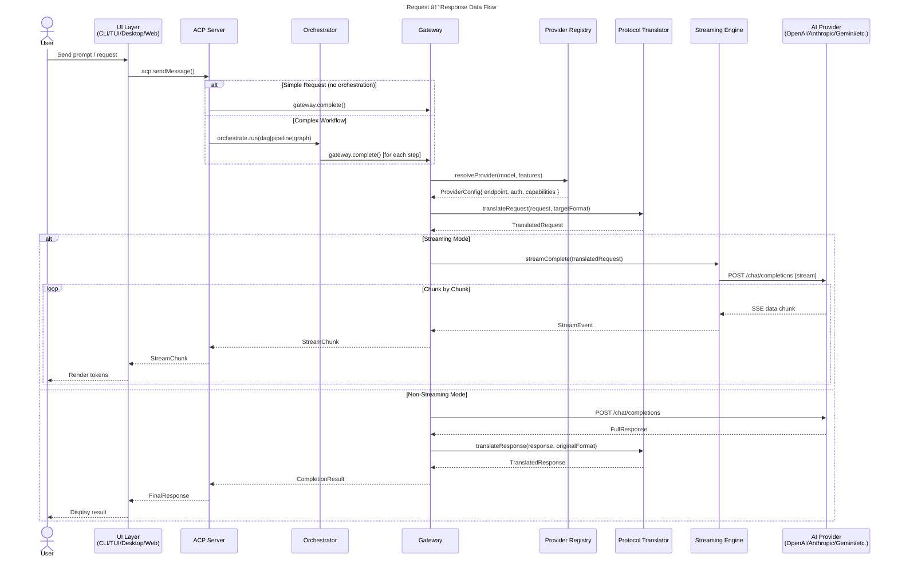
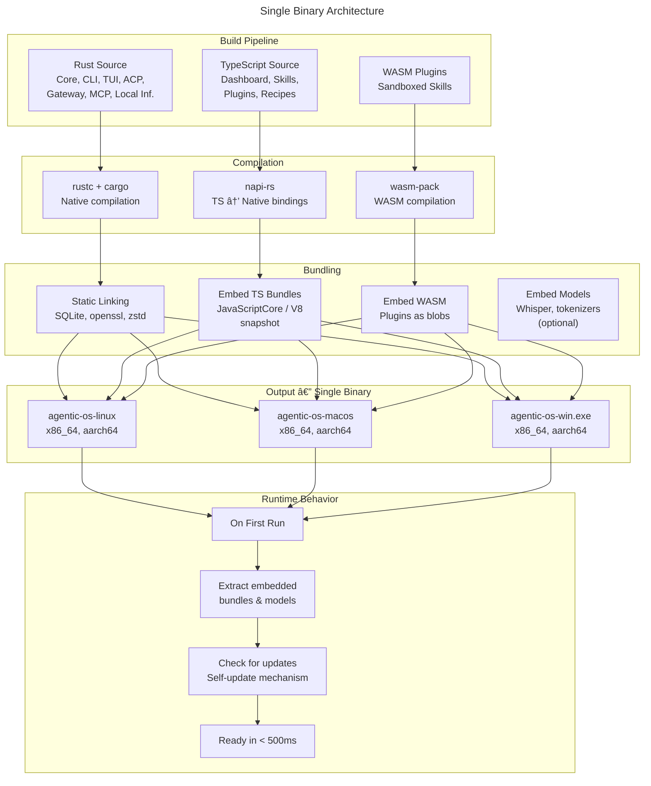
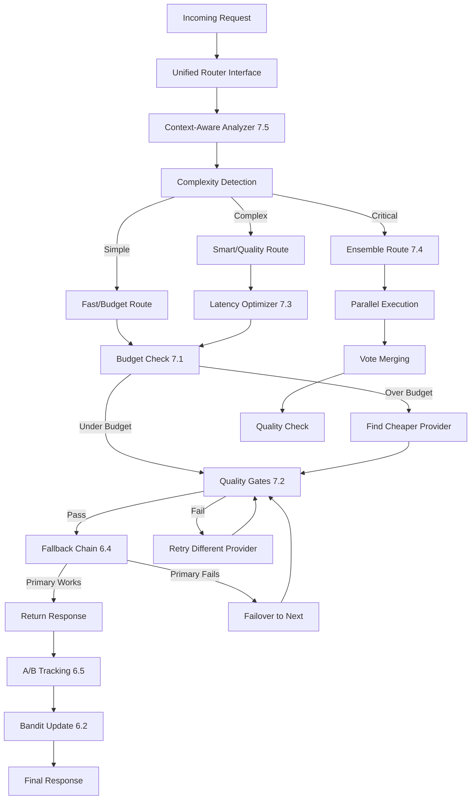
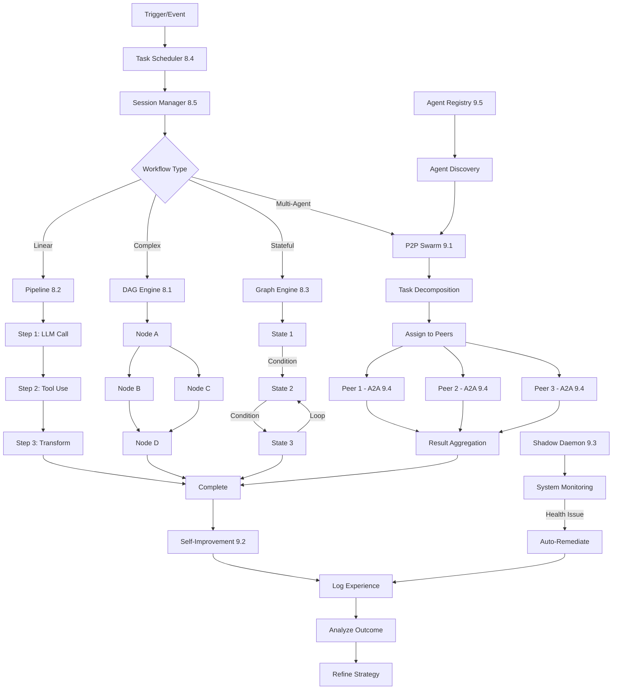
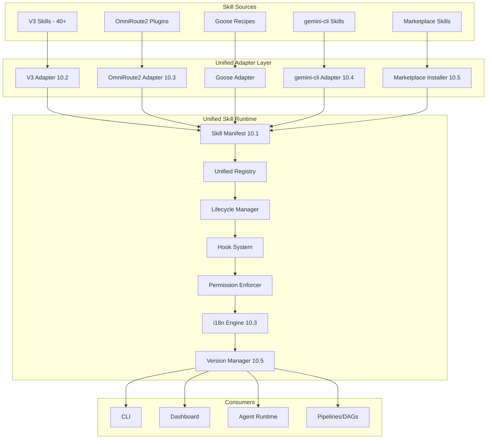

# Agentic OS V4: The Universal AI Agent Operating System

## 30-Phase Master Integration Plan — From 8 Projects to 1 Perfect Product

> **Last Updated:** 2026-07-02
> **Status:** Draft — Part 1 (Phases 1–5)
> **Target Release:** Agentic OS V4.0.0-alpha

---

## Why Agentic OS V4?

The AI agent ecosystem is fractured. Developers must stitch together gateways,
orchestrators, runtimes, and CLI tools from different projects, each with its
own configuration, deployment model, and protocol. **Agentic OS V4** eliminates
this fragmentation by merging **8 leading open-source projects** into a single,
coherent operating system for AI agents.

**The 8 Projects Being Unified:**

| # | Project | Language | Role | Key Strengths |
|---|---------|----------|------|---------------|
| 1 | **Agentic OS V3** | Rust + TS | Agent Orchestration | DAG/Pipeline/Graph executors, P2P Swarm, Self-improvement, Shadow Daemon, Skill Runtime |
| 2 | **9Router** | Rust + TS | Universal Gateway | 100+ providers, Protocol translation (OpenAI↔Anthropic↔Gemini), MITM proxy, RTK compression |
| 3 | **Goose** | Rust + TS | Agent Runtime | ACP server, CLI/TUI, Extensions/Recipes, Local inference, MCP, Dictation, Computer control |
| 4 | **litellm** | Python | LLM Gateway | 100+ providers, Proxy server, Routing strategies, Caching, Guardrails, Budget management |
| 5 | **new-api** | Go | AI Gateway | Channel management, Billing, Relay, Multi-tenant, Load balancing, Web UI |
| 6 | **OmniRoute2** | TypeScript | Gateway | Skills system, Auto-combo routing, Compression, Plugin system, 30+ i18n languages |
| 7 | **Portkey** | TypeScript | Gateway | 50+ providers, Guardrail plugins, Semantic caching, Fallbacks, Observability dashboards |
| 8 | **gemini-cli** | TypeScript | CLI Agent | Google Gemini integration, MCP support, Code understanding, Sandboxing, GitHub Actions |

### Zero-Hassle Philosophy

Agentic OS V4 is built around a simple promise: **download, run, done.**

- **Single binary distribution** — One executable for your platform, zero dependencies
- **Zero-config startup** — Works out of the box with sensible defaults
- **Auto-discovery** — Detects providers, tools, and MCP servers automatically
- **Backward compatible** — Existing configs from any of the 8 projects work
- **Self-updating** — Automatic updates with rollback protection

---

## Architectural Vision

### The 5-Layer Stack

Agentic OS V4 is organized as a clean 5-layer architecture. Each layer
communicates via well-defined interfaces, allowing independent evolution and
hot-swappable implementations.

```mermaid
---
title: Agentic OS V4 — 5-Layer Architecture Stack
---
graph TB
    subgraph UI_Layer["UI Layer — User Interfaces"]
        CLI["CLI<br/>(Rust + ratatui)"]
        TUI["TUI<br/>(Rust + ratatui)"]
        DESKTOP["Desktop<br/>(Tauri + React)"]
        WEB["Web Dashboard<br/>(Next.js)"]
    end

    subgraph ACP_Layer["ACP Server — Agent Client Protocol"]
        ACP["ACP Server<br/>(Rust)"]
        SESSION["Session Manager"]
        EXT["Extension Manager"]
        RECIPE["Recipe Engine"]
        PROMPT["Prompt Manager"]
    end

    subgraph ORCH_Layer["Agent Orchestration Layer"]
        DAG["DAG Executor"]
        PIPELINE["Pipeline Engine"]
        GRAPH["Graph Engine"]
        P2P["P2P Swarm"]
        SELF["Self-Improvement"]
        SHADOW["Shadow Daemon"]
        SCHED["Task Scheduler"]
    end

    subgraph GATEWAY_Layer["Universal AI Gateway Layer"]
        REGISTRY["Provider Registry<br/>250+ providers"]
        TRANSLATOR["Protocol Translator<br/>OpenAI ↔ Anthropic ↔ Gemini"]
        STREAM["Streaming Engine<br/>SSE, WebSocket, Raw"]
        ROUTING["Routing Engine<br/>Adaptive, Budget, Latency"]
        RESILIENCE["Resilience<br/>Circuit Breaker, Fallback"]
        MITM["MITM Proxy<br/>IDE Integration"]
        RTK["RTK Compression<br/>Caveman, Ponytail"]
        AUTH["Auth Manager<br/>20+ OAuth providers"]
        BILLING["Billing & Quotas"]
        CACHE["Cache Layer<br/>Redis, Semantic, Disk"]
        OBSERV["Observability<br/>OTEL, Langfuse, Prometheus"]
        GUARD["Guardrails<br/>Security, PII, Injection"]
    end

    subgraph INFRA_Layer["Infrastructure Layer"]
        DB["Database<br/>SQLite / PostgreSQL"]
        REDIS["Redis Cluster"]
        CONFIG["Config Manager"]
        SECRETS["Secrets Vault"]
        LOCAL_INF["Local Inference<br/>llama.cpp, MLX"]
        MCP["MCP Registry"]
        SANDBOX["WASM Sandbox"]
        DICT["Dictation<br/>Whisper"]
        COMP_CTRL["Computer Control"]
    end

    CLI --> ACP
    TUI --> ACP
    DESKTOP --> ACP
    WEB --> ACP

    ACP --> ORCH_Layer
    ORCH_Layer --> GATEWAY_Layer
    GATEWAY_Layer --> INFRA_Layer
```



---

### Component Mapping: Best-of-Breed from Each Project

Every component of Agentic OS V4 inherits from the strongest implementation
across the 8 source projects. This ensures we never reinvent wheels — we only
polish them.

```mermaid
---
title: Best-of-Breed Component Selection
---
graph LR
    subgraph AgenticOSV4["Agentic OS V4 — Unified Component Map"]
        direction TB

        AGENT_ORCH["Agent Orchestration"]
        PROV_REG["Provider Registry"]
        PROT_TRANS["Protocol Translation"]
        STREAM_ENG["Streaming Engine"]
        ROUTING_ENG["Routing Engine"]
        RESILIENCE["Resilience & Guardrails"]
        CLI_TUI["CLI / TUI"]
        DESKTOP["Desktop App"]
        WEB_DASH["Web Dashboard"]
        ACP_SRV["ACP Server"]
        MCP_SUPPORT["MCP Support"]
        LOCAL_INF["Local Inference"]
        SECURITY["Security"]
        EXT_SYS["Extension/Plugin System"]
        RECIPE_ENG["Recipe Engine"]
        CONFIG_SYS["Configuration System"]
        BILLING["Billing & Quotas"]
        CACHE["Caching"]
        OBSERV["Observability"]
        MITM["MITM Proxy"]
        AUTH["Auth/OAuth"]
        RTK["RTK Compression"]
        COMP_CTRL["Computer Control"]
        DICT["Dictation"]
        SELF_IMPR["Self-Improvement"]
        GEMINI_INT["Gemini Integration"]
    end

    V3["Agentic OS V3"] --> AGENT_ORCH
    V3 --> SELF_IMPR
    V3 --> EXT_SYS

    R9["9Router"] --> PROV_REG
    R9 --> PROT_TRANS
    R9 --> MITM
    R9 --> RTK
    R9 --> AUTH
    R9 --> MCP_SUPPORT

    GOOSE["Goose"] --> CLI_TUI
    GOOSE --> ACP_SRV
    GOOSE --> MCP_SUPPORT
    GOOSE --> LOCAL_INF
    GOOSE --> COMP_CTRL
    GOOSE --> DICT
    GOOSE --> DESKTOP

    LIT["litellm"] --> PROV_REG
    LIT --> ROUTING_ENG
    LIT --> RESILIENCE
    LIT --> CACHE
    LIT --> OBSERV

    NA["new-api"] --> BILLING
    NA --> PROV_REG
    NA --> RESILIENCE

    OMNI["OmniRoute2"] --> EXT_SYS
    OMNI --> ROUTING_ENG
    OMNI --> RTK

    PK["Portkey"] --> PROV_REG
    PK --> RESILIENCE
    PK --> CACHE
    PK --> OBSERV

    GC["gemini-cli"] --> GEMINI_INT
    GC --> MCP_SUPPORT
    GC --> SECURITY
    GC --> CLI_TUI

    style V3 fill:#e1f5fe,stroke:#01579b
    style R9 fill:#f3e5f5,stroke:#4a148c
    style GOOSE fill:#e8f5e9,stroke:#1b5e20
    style LIT fill:#fff3e0,stroke:#e65100
    style NA fill:#fce4ec,stroke:#b71c1c
    style OMNI fill:#f1f8e9,stroke:#33691e
    style PK fill:#e0f7fa,stroke:#006064
    style GC fill:#fff8e1,stroke:#f57f17
```



---

### Data Flow: Request Lifecycle

Every request through Agentic OS V4 follows a well-defined path through the
stack, with optional transformation at each hop.



---

### Single Binary Packaging Strategy

Agentic OS V4 targets a **single, self-contained binary** that runs everywhere.



**Key Technical Decisions:**

| Decision | Choice | Rationale |
|----------|--------|-----------|
| **Core Language** | Rust | Single binary compilation, zero-cost abstractions, memory safety, cross-platform |
| **Extensibility** | TypeScript (via napi-rs) | Rich ecosystem, familiar to most developers, static typing |
| **Plugin Sandbox** | WASM | Isolated execution, portable, language-agnostic |
| **Protocol Unification** | ACP (Agent Client Protocol) | Industry standard, supports all agent interaction patterns |
| **Config Format** | TOML + YAML + JSON + Env | Flexible, human-readable, environment-aware |
| **Database** | SQLite (default) / PostgreSQL (production) | Zero-config defaults, scalable for production |
| **Packaging** | Static binary + embedded bundles | Single file distribution, no dependency hell |
| **Self-Update** | The update framework (Rust) | Reliable, atomic updates with rollback |

---

# Phase 1: Foundation & Monorepo Bootstrap

**Duration:** 2 weeks
**Goal:** Create the root monorepo structure, import core types from all 8 projects,
set up CI/CD, define unified configuration schema, and establish developer environment.

---

## 1.1 Create Root Monorepo Structure

**Description:**
Establish the top-level directory structure for the Agentic OS V4 monorepo,
combining Cargo workspace (Rust) and npm workspaces (TypeScript). The structure
must accommodate all 8 source projects' codebases while maintaining clean
separation of concerns.

**Implementation Details:**

1. **Initialize Cargo workspace** (`Cargo.toml`):
   - Create workspace members for all Rust crates:
     - `agentic-os-core` — Shared core types, traits, errors
     - `agentic-os-cli` — CLI binary
     - `agentic-os-tui` — TUI binary (ratatui)
     - `agentic-os-acp` — ACP server implementation
     - `agentic-os-gateway` — Gateway core (provider registry, translator)
     - `agentic-os-mcp` — MCP client/server
     - `agentic-os-local-inf` — Local inference engine
     - `agentic-os-dictation` — Whisper integration
     - `agentic-os-config` — Configuration parser
     - `agentic-os-security` — Guardrails & security
   - Configure workspace-level `[workspace.dependencies]` for shared deps
   - Set up `.cargo/config.toml` with target-specific optimizations

2. **Initialize npm/pnpm workspace** (`package.json`):
   - Create workspace members for all TypeScript packages:
     - `packages/core` — Shared TypeScript types, interfaces, utilities
     - `packages/gateway` — Gateway TypeScript layer (Portkey + OmniRoute2 patterns)
     - `packages/dashboard` — Next.js web dashboard
     - `packages/desktop` — Tauri desktop renderer
     - `packages/skills` — Skill runtime & registry
     - `packages/plugins` — Plugin system
     - `packages/recipes` — Recipe engine UI
     - `packages/acp-client` — ACP client SDK
     - `packages/mcp-client` — MCP client SDK
     - `packages/genai` — Gemini integration (@google/genai wrapper)
   - Configure pnpm as package manager with `pnpm-workspace.yaml`
   - Set up `turbo.json` for cross-language task orchestration

3. **Create root directory structure**:
```
agentic-os-v4/
├── apps/                          # Runnable applications
│   ├── cli/                       # Rust CLI binary (from Goose)
│   ├── tui/                       # Rust TUI binary (from Goose, ratatui)
│   ├── desktop/                   # Tauri + React desktop app
│   ├── dashboard/                 # Next.js web dashboard
│   ├── server/                    # Unified HTTP + ACP server
│   └── proxy/                     # MITM proxy (from 9Router)
├── crates/                        # Rust crates (Cargo workspace)
│   ├── core/                      # Agentic OS core types & traits
│   ├── config/                    # Configuration parser
│   ├── acp/                       # ACP server implementation
│   ├── gateway/                   # Gateway core
│   ├── orchestrator/              # Agent orchestration
│   ├── mcp/                       # MCP client/server
│   ├── local-inference/           # Local inference (llama.cpp)
│   ├── dictation/                 # Whisper dictation
│   ├── security/                  # Guardrails & security
│   ├── telemetry/                 # Observability
│   └── sandbox/                   # WASM sandbox
├── packages/                      # TypeScript packages (npm workspace)
│   ├── core/                      # Shared TS types & interfaces
│   ├── gateway/                   # Gateway TS layer
│   ├── dashboard/                 # Next.js dashboard components
│   ├── desktop-ui/                # Tauri renderer UI
│   ├── skills/                    # Skill runtime (TS)
│   ├── plugins/                   # Plugin system (TS)
│   ├── recipes/                   # Recipe engine (TS)
│   ├── acp-client/                # ACP client SDK
│   ├── mcp-client/                # MCP client SDK
│   ├── genai/                    # Gemini integration (@google/genai)
│   └── test-utils/               # Shared test utilities
├── tools/                         # Build & dev tools
│   └── binary-bundler/           # Single binary bundler script
├── docs/                          # Documentation (Docusaurus)
├── scripts/                       # Build, test, release scripts
├── evals/                         # Evaluation benchmarks
├── tests/                         # Integration & e2e tests
├── Cargo.toml                     # Rust workspace root
├── package.json                   # npm workspace root
├── pnpm-workspace.yaml           # pnpm workspace config
├── turbo.json                     # Turborepo config
├── Justfile                       # Task runner (Just)
├── rust-toolchain.toml            # Rust toolchain config
└── .github/                      # GitHub Actions
    ├── workflows/
    └── CODEOWNERS
```

4. **Configure build toolchain**:
   - Set `rust-toolchain.toml` with stable + nightly (for WASM)
   - Configure `.cargo/config.toml` with:
     - `target-dir` for shared build cache
     - `registries` for any private crates
     - `[target.'cfg(target_os = "windows")]` linker settings
   - Set up `Justfile` with core commands:
     - `just build` — Build all crates and packages
     - `just test` — Run all tests
     - `just lint` — Run all linters
     - `just format` — Format all code
     - `just bundle` — Create single binary
     - `just dev` — Start development mode

5. **Configure dependency management**:
   - Create workspace-level `Cargo.lock` for Rust
   - Create `pnpm-lock.yaml` for TypeScript
   - Set up Dependabot for automated dependency updates
   - Configure Renovate for monorepo

**Files to Create:**

| File | Purpose |
|------|---------|
| `Cargo.toml` | Rust workspace definition with all crate members |
| `package.json` | npm workspace root with scripts and devDependencies |
| `pnpm-workspace.yaml` | pnpm workspace package patterns |
| `turbo.json` | Turborepo pipeline configuration |
| `Justfile` | Task runner with build, test, lint, format, bundle commands |
| `rust-toolchain.toml` | Rust toolchain specification (stable + nightly) |
| `.cargo/config.toml` | Cargo build configuration |
| `.github/CODEOWNERS` | Code ownership per directory |
| `.gitignore` | Git ignore patterns for all languages |
| `.prettierrc` | Prettier configuration for TS/JS/MD |
| `.editorconfig` | Editor configuration |
| `rustfmt.toml` | Rust formatting configuration |
| `clippy.toml` | Clippy lint configuration |
| `eslint.config.js` | ESLint flat config for TypeScript |

**Acceptance Criteria:**
- [ ] `cargo build` compiles all Rust crates without errors
- [ ] `pnpm install` resolves all TypeScript dependencies
- [ ] `npx turbo run build` executes all build tasks
- [ ] `just build` succeeds end-to-end
- [ ] Workspace inheritance works (deps, versions, metadata)
- [ ] Directory structure matches specification
- [ ] All configuration files are present and valid

---

## 1.2 Import Core Types & Interfaces from All 8 Projects

**Description:**
Extract, normalize, and consolidate the core type definitions and interfaces
from all 8 source projects into a shared type system. This is the foundation
for cross-project interoperability.

**Implementation Details:**

1. **Analyze and extract type systems** from each project:

   | Project | Key Types to Extract | Format |
   |---------|---------------------|--------|
   | Agentic OS V3 | Agent, DAG, Pipeline, Graph, Task, Skill, ShadowDaemon, Scheduler | Rust `struct` + TS `interface` |
   | 9Router | Provider, Route, Translation, MITMConfig, RTKConfig, Session | Rust `struct` |
   | Goose | ACPMessage, Extension, Recipe, Tool, MCPConfig, Session | Rust `struct` + TS `interface` |
   | litellm | ModelInfo, ProviderConfig, RoutingStrategy, CacheConfig, Budget | Python → TS translation |
   | new-api | Channel, Relay, User, Tenant, Quota, BillingRecord | Go → Rust translation |
   | OmniRoute2 | SkillManifest, ComboRoute, Plugin, i18nMessages | TS `interface` |
   | Portkey | Guardrail, Fallback, CachePolicy, ObservabilityConfig | TS `interface` |
   | gemini-cli | GenAIModel, SafetySetting, Tool, MCPConfig, Extension | TS `interface` |

2. **Create shared Rust core types** (`crates/core/src/`):

   ```rust
   // crates/core/src/lib.rs — Core crate root
   pub mod agent;         // Agent, Task, Workflow types
   pub mod provider;      // Provider, Model, Capability types
   pub mod gateway;       // Gateway, Route, Translation types
   pub mod acp;           // ACP message, Session types
   pub mod mcp;           // MCP tool, Resource types
   pub mod config;        // Configuration types
   pub mod security;      // Guardrail, Policy types
   pub mod telemetry;     // Span, Event, Metric types
   pub mod error;         // Unified error types
   pub mod result;        // Unified result types

   // Example: Unified Provider type
   pub struct Provider {
       pub id: String,
       pub name: String,
       pub provider_type: ProviderType,
       pub base_url: String,
       pub api_version: String,
       pub auth_type: AuthType,
       pub models: Vec<ModelInfo>,
       pub capabilities: ProviderCapabilities,
       pub rate_limits: RateLimitConfig,
       pub health_check: HealthCheckConfig,
       pub metadata: HashMap<String, String>,
   }
   ```

3. **Create shared TypeScript core types** (`packages/core/src/`):

   ```typescript
   // packages/core/src/index.ts — Core package entry
   export * from './agent.js';
   export * from './provider.js';
   export * from './gateway.js';
   export * from './acp.js';
   export * from './mcp.js';
   export * from './config.js';
   export * from './security.js';
   export * from './telemetry.js';
   export * from './error.js';
   export * from './skill.js';
   export * from './plugin.js';
   export * from './recipe.js';

   // Example: Unified Provider interface
   export interface Provider {
     id: string;
     name: string;
     providerType: ProviderType;
     baseUrl: string;
     apiVersion: string;
     authType: AuthType;
     models: ModelInfo[];
     capabilities: ProviderCapabilities;
     rateLimits: RateLimitConfig;
     healthCheck: HealthCheckConfig;
     metadata: Record<string, string>;
   }
   ```

4. **Create Rust↔TypeScript type bridges**:
   - Use `napi-rs` derive macros for automatic binding generation
   - Define `#[napi(object)]` on core structs for JS interop
   - Create `From`/`Into` implementations for type conversion

5. **Write normalization scripts** for importing from each project:
   - `scripts/import-agentic-os-v3.ts` — Extract types from V3 source
   - `scripts/import-9router.ts` — Extract types from 9Router source
   - `scripts/import-goose.ts` — Extract types from Goose source
   - `scripts/import-litellm.ts` — Extract and translate Python types
   - `scripts/import-new-api.ts` — Extract and translate Go types
   - `scripts/import-omniroute.ts` — Extract types from OmniRoute2
   - `scripts/import-portkey.ts` — Extract types from Portkey
   - `scripts/import-gemini-cli.ts` — Extract types from gemini-cli

**Files to Create:**

| File | Purpose |
|------|---------|
| `crates/core/src/lib.rs` | Rust core crate root with re-exports |
| `crates/core/src/agent.rs` | Agent, Task, Workflow types |
| `crates/core/src/provider.rs` | Provider, Model, Capability types |
| `crates/core/src/gateway.rs` | Gateway, Route, Translation types |
| `crates/core/src/acp.rs` | ACP message, Session types |
| `crates/core/src/mcp.rs` | MCP tool, Resource types |
| `crates/core/src/config.rs` | Configuration types |
| `crates/core/src/security.rs` | Guardrail, Policy types |
| `crates/core/src/telemetry.rs` | Span, Event, Metric types |
| `crates/core/src/error.rs` | Unified error types & error codes |
| `crates/core/src/result.rs` | Unified result types & helpers |
| `packages/core/src/index.ts` | TS core package entry |
| `packages/core/src/agent.ts` | TS agent types |
| `packages/core/src/provider.ts` | TS provider types |
| `packages/core/src/gateway.ts` | TS gateway types |
| `packages/core/src/acp.ts` | TS ACP types |
| `packages/core/src/mcp.ts` | TS MCP types |
| `packages/core/src/config.ts` | TS config types |
| `packages/core/src/security.ts` | TS security types |
| `packages/core/src/telemetry.ts` | TS telemetry types |
| `packages/core/src/skill.ts` | TS skill types |
| `packages/core/src/plugin.ts` | TS plugin types |
| `packages/core/src/recipe.ts` | TS recipe types |
| `packages/core/package.json` | Package manifest |
| `packages/core/tsconfig.json` | TypeScript configuration |

**Acceptance Criteria:**
- [ ] All Rust types compile with `cargo build -p agentic-os-core`
- [ ] All TS types compile with `tsc --noEmit`
- [ ] Type definitions cover all 8 projects' core concepts
- [ ] napi-rs bindings generate valid JS interfaces
- [ ] Normalization scripts import types from each project successfully
- [ ] No circular dependencies between type modules
- [ ] Error types are comprehensive and consistent

---

## 1.3 Set Up CI/CD (GitHub Actions, Multi-Arch Builds)

**Description:**
Establish a comprehensive CI/CD pipeline using GitHub Actions that builds,
tests, and packages Agentic OS V4 for all target platforms: Linux (x86_64,
aarch64), macOS (x86_64, aarch64), and Windows (x86_64, aarch64).

**Implementation Details:**

1. **Create core CI workflow** (`.github/workflows/ci.yml`):
   - Trigger on: `push` to main, `pull_request` to main
   - Matrix: 3 OS × 2 architectures × 2 build profiles (debug, release)
   - Steps: Checkout, install Rust/Node.js, cache deps, lint, build, test, bundle

2. **Create multi-arch build workflow** (`.github/workflows/build.yml`):
   - Target matrix: x86_64/aarch64 for Linux, macOS, Windows
   - Use `cross` tool for cross-compilation
   - Store build artifacts per architecture

3. **Create release workflow** (`.github/workflows/release.yml`):
   - Trigger on semver tags (`v*`)
   - Build all architectures, generate checksums, create GitHub Release
   - Publish to crates.io, npm, Homebrew, Docker Hub

4. **Create nightly build workflow** (`.github/workflows/nightly.yml`):
   - Daily cron schedule for full integration test suite
   - Publishes nightly tags to package registries

**Files to Create:**

| File | Purpose |
|------|---------|
| `.github/workflows/ci.yml` | Core CI workflow |
| `.github/workflows/build.yml` | Multi-arch build workflow |
| `.github/workflows/release.yml` | Release workflow |
| `.github/workflows/nightly.yml` | Nightly build workflow |
| `.github/workflows/lint.yml` | Linting workflow |
| `.github/workflows/security.yml` | Security audit workflow |
| `.github/workflows/coverage.yml` | Code coverage workflow |
| `.github/dependabot.yml` | Dependabot configuration |
| `Cross.toml` | Cross-compilation configuration |

**Acceptance Criteria:**
- [ ] CI passes on all 3 OS × 2 architectures
- [ ] Release workflow creates binaries for all 6 target triples
- [ ] Binary is statically linked and self-contained (< 50MB compressed)
- [ ] Docker image builds and runs successfully
- [ ] Nightly builds run on schedule
- [ ] Security audit passes (no critical vulnerabilities)
- [ ] Build caching reduces subsequent build times by > 50%

---

## 1.4 Create Unified Configuration Schema

**Description:**
Design and implement the unified configuration schema that covers all features
from all 8 projects. The schema supports TOML (primary), YAML, JSON, and
environment variables, with validation, merging, and inheritance.

**Implementation Details:**

1. **Design the unified config schema** covering agent, gateway, ACP, MCP,
   security, observability, cache, billing, local inference, dictation, MITM,
   RTK, skills, recipes, and developer mode.

2. **Create the schema definition** in Rust with `serde` for TOML/YAML/JSON

3. **Implement config file resolution**:
   - Priority: project-local > user-global > legacy > env vars > defaults
   - Environment variables: `AGENTIC_OS__<SECTION>__<KEY>`

4. **Create TypeScript schema mirror** for dashboard editing

5. **Create JSON Schema** for IDE autocompletion in VS Code

**Files to Create:**

| File | Purpose |
|------|---------|
| `crates/config/src/lib.rs` | Config crate root |
| `crates/config/src/schema.rs` | Config schema definitions |
| `crates/config/src/parser.rs` | TOML/YAML/JSON/env parser |
| `crates/config/src/merge.rs` | Config merging & inheritance |
| `crates/config/src/validate.rs` | Config validation |
| `crates/config/src/defaults.rs` | Default configuration values |
| `packages/core/src/config.ts` | TypeScript config types |
| `schemas/agentic-os-config.schema.json` | JSON Schema for autocompletion |

**Acceptance Criteria:**
- [ ] Config parser reads TOML, YAML, JSON correctly
- [ ] Environment variables override file settings
- [ ] Config merging works (project < user < env < cli flags)
- [ ] Validation catches invalid configurations with helpful messages
- [ ] Default config allows zero-config startup
- [ ] All 8 projects' configuration options are representable

---

## 1.5 Set Up Developer Environment

**Description:**
Create a consistent, reproducible developer environment using devcontainers,
with comprehensive linting, formatting, and editor configuration for all
languages in the monorepo.

**Implementation Details:**

1. **Create devcontainer configuration** (`.devcontainer/`) with Rust, Node.js,
   pnpm, and all build tools pre-installed
2. **Configure VS Code extensions**: rust-analyzer, even-better-toml, prettier,
   eslint, mermaid chart preview, and more
3. **Set up formatting**: `rustfmt.toml`, `.prettierrc`, `.editorconfig`
4. **Set up linting**: `clippy.toml`, ESLint flat config
5. **Create pre-commit hooks** (`.husky/`) for lint-staged and conventional commits
6. **Create documentation**: `CONTRIBUTING.md`, `DEVELOPMENT.md`

**Files to Create:**

| File | Purpose |
|------|---------|
| `.devcontainer/devcontainer.json` | Devcontainer metadata |
| `.devcontainer/Dockerfile` | Devcontainer Dockerfile |
| `.vscode/settings.json` | VS Code workspace settings |
| `.vscode/extensions.json` | Recommended VS Code extensions |
| `.vscode/launch.json` | Debug configurations |
| `rustfmt.toml` | Rust formatting rules |
| `clippy.toml` | Clippy lint rules |
| `.prettierrc` | Prettier formatting rules |
| `.editorconfig` | Cross-editor configuration |
| `.husky/pre-commit` | Pre-commit hook |
| `.husky/commit-msg` | Commit message hook |
| `scripts/dev-setup.sh` | Local dev setup script |
| `CONTRIBUTING.md` | Developer contribution guide |

**Acceptance Criteria:**
- [ ] Devcontainer builds and starts successfully
- [ ] `just fmt` formats all Rust and TypeScript code
- [ ] `just lint` passes with zero warnings
- [ ] Pre-commit hooks block commits with lint errors
- [ ] Conventional commit format is enforced
- [ ] New developer can go from `git clone` to `just build` in < 5 minutes

---

# Phase 2: Unified Configuration System

**Duration:** 2 weeks
**Goal:** Design and implement the unified configuration system that reads,
validates, merges, and watches configuration from multiple sources, with CLI
commands for management and a migration tool for existing configs.

---

## 2.1 Design Config Schema Covering All Projects' Needs

**Description:**
Design a comprehensive configuration schema that encompasses every
configuration option from all 8 projects, organized in a logical hierarchy with
proper defaults, validation rules, and documentation.

**Implementation Details:**

1. **Audit all configuration options from each project:**

   | Project | Config Files | Key Sections | Total Options |
   |---------|-------------|--------------|---------------|
   | Agentic OS V3 | `config.yaml`, `.env` | agent, orchestration, skills, security, scheduler | ~120 |
   | 9Router | `9router.toml`, `.9router.env` | providers, routes, translation, mitm, rtk, auth | ~200 |
   | Goose | `config.yaml`, `settings.json` | acp, extensions, recipes, mcp, local, dictation | ~180 |
   | litellm | `config.yaml`, `proxy_config.yaml` | general, model_list, router, litellm_settings, guardrails | ~250 |
   | new-api | `config.json`, `newapi.toml` | channels, relays, billing, users, tenants | ~150 |
   | OmniRoute2 | `omniroute.config.ts`, `.env` | providers, skills, combo, plugins, i18n | ~100 |
   | Portkey | `portkey.config.json` | providers, cache, guardrails, fallbacks, observability | ~120 |
   | gemini-cli | `settings.json`, `GEMINI.md` | model, auth, tools, mcp, sandbox, telemetry | ~90 |

2. **Design the unified schema hierarchy** with sections for:
   - Agent orchestration (from V3)
   - AI Gateway providers, translation, streaming, routing, resilience (from 9Router, litellm, new-api, OmniRoute2, Portkey)
   - ACP server (from Goose)
   - MCP registry and sandbox (from Goose, 9Router, gemini-cli)
   - Security and guardrails (from V3, Portkey, litellm)
   - Observability (from all projects)
   - Local inference and dictation (from Goose)
   - MITM proxy (from 9Router)
   - RTK compression (from 9Router, OmniRoute2)
   - Skills and recipes (from V3, OmniRoute2, Goose)
   - Billing and quotas (from new-api, litellm)

3. **Create JSON Schema** for IDE autocompletion and validation
4. **Document every option** with description, type, default, valid values, and source project

**Files to Create:**

| File | Purpose |
|------|---------|
| `crates/config/src/schema.rs` | Complete config schema (updated) |
| `docs/config-reference.md` | Comprehensive config reference |
| `packages/dashboard/src/components/ConfigEditor/` | Visual config editor |
| `packages/core/src/config.ts` | Updated config types |
| `schemas/agentic-os-config.schema.json` | Updated JSON Schema |

**Acceptance Criteria:**
- [ ] Schema covers 100% of configurable options from all 8 projects
- [ ] Every option has a description, type, default, and source
- [ ] Config editor UI renders and validates properly
- [ ] Default config allows zero-config operation for common use cases

---

## 2.2 Implement Config Parser (Rust Core, TOML/YAML/JSON/Env)

**Description:**
Build the core configuration parser in Rust that reads configuration from
multiple formats, merges them according to priority rules, and produces a
validated `AgenticOSConfig` struct.

**Implementation Details:**

1. **Implement file format detection and parsing** supporting:
   - TOML via `toml` crate with `Deserialize`
   - YAML via `serde_yaml` crate
   - JSON via `serde_json` crate
   - Environment files (`.env`) via custom parser or `dotenvy`

2. **Implement config file discovery** in priority order:
   - Project-local: `./agentic-os.toml`
   - User-global: `~/.config/agentic-os/config.toml`
   - Legacy: `~/.agentic-os/config.toml`
   - Environment variables: `AGENTIC_OS__*`

3. **Implement config merging** with layered priority:
   - Built-in defaults (lowest) → System → User → Project → Env → CLI flags (highest)

4. **Implement secret redaction** for safe display of config
5. **Implement validation** with helpful error messages including file/line references

**Files to Create/Modify:**

| File | Purpose |
|------|---------|
| `crates/config/src/parser.rs` | File format detection and parsing |
| `crates/config/src/merge.rs` | Config merging with priority |
| `crates/config/src/discover.rs` | Config file discovery |
| `crates/config/src/env.rs` | Environment variable parsing |
| `crates/config/src/validate.rs` | Config validation |
| `crates/config/src/redact.rs` | Secret redaction for display |

**Acceptance Criteria:**
- [ ] Parses TOML, YAML, JSON, and .env files correctly
- [ ] Environment variables with `AGENTIC_OS__` prefix work
- [ ] Config file discovery finds files in correct priority order
- [ ] Merging applies higher-priority sources over lower-priority
- [ ] Secrets (api_key, password, token) are redacted in display
- [ ] Validation produces helpful error messages with file/line references

---

## 2.3 Create Config CLI Commands (init, validate, apply, diff)

**Description:**
Build a comprehensive set of CLI commands for managing configuration, inspired
by the best CLI patterns from all 8 projects.

**Implementation Details:**

1. **`config init`**: Creates a new config file with template selection (minimal/standard/enterprise), supports `--force`
2. **`config validate`**: Discovers and validates all config files, reports errors with file/line references, supports `--watch`
3. **`config apply`**: Validates config and hot-reloads running instance, supports `--no-reload`
4. **`config diff`**: Compares two config files or config vs running state, shows added/removed/changed options
5. **`config show`**: Displays current merged configuration with secrets redacted, supports `--json`, `--yaml`, `--toml`

**Files to Create:**

| File | Purpose |
|------|---------|
| `crates/cli/src/commands/config.rs` | Config CLI commands |
| `crates/config/templates/minimal.toml` | Minimal config template |
| `crates/config/templates/standard.toml` | Standard config template |
| `crates/config/templates/enterprise.toml` | Enterprise config template |

**Acceptance Criteria:**
- [ ] `agentic-os config init` creates a valid config file
- [ ] `agentic-os config validate` reports errors with file/line references
- [ ] `agentic-os config apply` validates and prepares config for use
- [ ] `agentic-os config diff` shows meaningful differences
- [ ] `agentic-os config show` displays config with secrets redacted
- [ ] All commands have `--help` with comprehensive documentation

---

## 2.4 Implement Config Hot-Reload and Watch Mode

**Description:**
Implement file watching and hot-reload for configuration, allowing Agentic OS
V4 to detect config file changes at runtime and apply them without restarting
the process.

**Implementation Details:**

1. **Implement config watcher** using the `notify` crate:
   - Monitor config files for changes with debounce (200ms)
   - Support for watching multiple config files simultaneously

2. **Implement hot-reload triggers** for each subsystem:
   - ACP server: session timeout, extension paths
   - Gateway: provider configs, routing rules
   - Security: guardrail policies
   - Cache: TTL, max size
   - Observability: log level, sampling rate
   - Local inference: model paths, GPU settings

3. **Implement atomic config swap** using `Arc<RwLock<T>>`:
   - Readers always see a consistent config state
   - Writers atomically swap entire config struct

4. **Implement change events** for observability:
   - Emit metrics on config changes
   - Log all config changes with before/after values (secrets redacted)

**Files to Create:**

| File | Purpose |
|------|---------|
| `crates/config/src/watch.rs` | Config file watcher implementation |
| `crates/config/src/hot_reload.rs` | Hot-reload coordination |
| `crates/config/src/atomic.rs` | Atomic config swap |

**Acceptance Criteria:**
- [ ] Config file changes are detected within 1 second
- [ ] Hot-reload applies changes without process restart
- [ ] Atomic config swap prevents partial reads during hot-reload
- [ ] Port/host changes correctly warn that restart is required
- [ ] Provider config changes take effect immediately
- [ ] Security policy changes apply to new requests instantly
- [ ] Watch mode does not cause excessive CPU usage (< 1% idle)

---

## 2.5 Create Config Migration Tool for Existing Configs

**Description:**
Build a migration tool that automatically detects, reads, and converts
configuration files from any of the 8 source projects into the unified
Agentic OS V4 format.

**Implementation Details:**

1. **Implement auto-detection of legacy configs**: Scan standard locations
   for each project's config files; detect format by file name, extension,
   and content signature

2. **Implement per-project migrators**:
   - `AgenticOSV3Migrator` — Reads `config.yaml`, maps agent settings
   - `NineRouterMigrator` — Reads `9router.toml`, maps providers and routes
   - `GooseMigrator` — Reads `config.yaml`/`settings.json`, maps ACP/extensions
   - `LiteLLMMigrator` — Reads proxy config, maps model list and routing
   - `NewAPIMigrator` — Reads channel config, maps billing and quotas
   - `OmniRoute2Migrator` — Reads TS config, maps skills and plugins
   - `PortkeyMigrator` — Reads JSON config, maps guardrails and caching
   - `GeminiCliMigrator` — Reads `settings.json`, maps model, auth, MCP

3. **Implement migration reporting**: Report mapped/lost options with suggestions
4. **Implement `config migrate` CLI command**: Auto-detect or `--path`, `--dry-run`, `--output`

**Files to Create:**

| File | Purpose |
|------|---------|
| `crates/config/src/migration/mod.rs` | Migration framework |
| `crates/config/src/migration/agentic_os_v3.rs` | V3 config migrator |
| `crates/config/src/migration/nine_router.rs` | 9Router config migrator |
| `crates/config/src/migration/goose.rs` | Goose config migrator |
| `crates/config/src/migration/litellm.rs` | litellm config migrator |
| `crates/config/src/migration/new_api.rs` | new-api config migrator |
| `crates/config/src/migration/omniroute2.rs` | OmniRoute2 config migrator |
| `crates/config/src/migration/portkey.rs` | Portkey config migrator |
| `crates/config/src/migration/gemini_cli.rs` | gemini-cli config migrator |
| `crates/cli/src/commands/config/migrate.rs` | `config migrate` CLI command |

**Acceptance Criteria:**
- [ ] Migration tool detects all 8 project configs in standard locations
- [ ] Each migrator correctly converts to unified format
- [ ] Unmapped options are reported with clear explanations
- [ ] Original configs are never modified during migration
- [ ] `config migrate --dry-run` shows what would happen without applying

---

# Phase 3: Provider Registry — Core

**Duration:** 2 weeks
**Goal:** Design and implement the unified provider adapter interface, import
provider configurations from 9Router (100+), litellm (100+), Portkey (50+),
and new-api (40+), normalizing them into a single registry.

---

## 3.1 Design Unified Provider Adapter Interface (Rust Trait + TS Interface)

**Description:**
Create the abstraction layer that allows any AI provider to be represented
uniformly, with adapters implementing a common interface for chat completions,
embeddings, streaming, and tool calling.

**Implementation Details:**

1. **Design the Rust trait hierarchy**:
   - `AIProvider` — Core trait: id, name, models, capabilities, health check
   - `ChatProvider` — Chat completions + streaming (extends AIProvider)
   - `EmbeddingProvider` — Text embeddings (extends AIProvider)
   - `ImageProvider` — Image generation (extends AIProvider)
   - `AudioProvider` — Audio transcription (extends AIProvider)
   - `ToolProvider` — Tool/function calling (extends ChatProvider)

2. **Design the TypeScript interface hierarchy** mirroring Rust traits

3. **Design unified request/response types**: ChatRequest, ChatResponse,
   StreamChunk, EmbeddingRequest/Response, ToolDefinition/Call/Result

4. **Implement provider factory/registry**:
   - `ProviderRegistry` — Registration, lookup, capability-based resolution
   - `ProviderFactory` — Creates provider adapters from config

**Files to Create:**

| File | Purpose |
|------|---------|
| `crates/gateway/src/provider/mod.rs` | Provider module root |
| `crates/gateway/src/provider/traits.rs` | Provider trait definitions |
| `crates/gateway/src/provider/types.rs` | Unified request/response types |
| `crates/gateway/src/provider/registry.rs` | Provider registry implementation |
| `crates/gateway/src/provider/error.rs` | Provider-specific errors |
| `crates/gateway/src/provider/factory.rs` | Provider factory |
| `packages/core/src/provider.ts` | TypeScript provider interfaces |

**Acceptance Criteria:**
- [ ] `AIProvider` trait compiles with all associated methods
- [ ] `ChatProvider`, `EmbeddingProvider`, `ImageProvider`, `AudioProvider` traits defined
- [ ] `ProviderRegistry` supports registration, lookup, and resolution
- [ ] TypeScript interfaces mirror Rust traits
- [ ] napi-rs bindings export provider types to JS
- [ ] Provider resolution works (find provider for given model + capabilities)

---

## 3.2 Import and Normalize 9Router's 100+ Providers

**Description:**
Extract, analyze, and normalize the provider configurations from 9Router's
codebase — one of the most comprehensive provider registries with 100+ providers.

**Implementation Details:**

1. **Analyze 9Router's provider structure** in `9Router/src/gateway/providers/`:
   - Categories: LLM APIs (OpenAI, Anthropic, Google), Open Source Hosted
     (Ollama, vLLM), AI Platforms (OpenRouter, Together), IDE Tools (Cursor,
     Windsurf), Code Assistants (Copilot), Chinese Providers (DeepSeek, Qwen),
     Enterprise (Databricks, AWS Bedrock)

2. **Create import script** scanning provider directories, parsing configs,
   extracting models, endpoints, auth types, rate limits

3. **Create provider adapter implementations** for each major provider with
   full streaming and non-streaming support

**Files to Create:**

| File | Purpose |
|------|---------|
| `crates/gateway/src/provider/import/nine_router/mod.rs` | 9Router import module |
| `crates/gateway/src/provider/adapters/openai.rs` | OpenAI adapter |
| `crates/gateway/src/provider/adapters/anthropic.rs` | Anthropic adapter |
| `crates/gateway/src/provider/adapters/google.rs` | Google/Gemini adapter |
| `crates/gateway/src/provider/adapters/azure.rs` | Azure OpenAI adapter |
| `crates/gateway/src/provider/adapters/bedrock.rs` | AWS Bedrock adapter |
| `crates/gateway/src/provider/adapters/vertex.rs` | GCP Vertex adapter |
| `crates/gateway/src/provider/adapters/ollama.rs` | Ollama adapter |
| `crates/gateway/src/provider/adapters/openrouter.rs` | OpenRouter adapter |
| `scripts/import-9router-providers.ts` | 9Router import script |
| `data/providers/9router-providers.json` | Extracted provider data |

**Acceptance Criteria:**
- [ ] All 100+ 9Router providers are imported and normalized
- [ ] Each major provider has a working adapter implementation
- [ ] Provider capability matrix is accurate (models, features, pricing)
- [ ] Adapter handles both streaming and non-streaming requests

---

## 3.3 Import and Normalize litellm's 100+ Providers

**Description:**
Extract, analyze, and normalize the provider configurations from litellm's
codebase, which has extensive model metadata, pricing, and routing configurations.

**Implementation Details:**

1. **Import litellm's model pricing database**:
   - `model_prices_and_context_window.json` — Master database with per-model:
     max_tokens, pricing (input/output/cache), capabilities, rate limits

2. **Merge litellm metadata into existing provider configs**:
   - Update pricing with litellm's data (most accurate source)
   - Add context window limits and capability flags

3. **Integrate litellm's routing strategies**:
   - SimpleFallback, LeastBusy, LatencyBased, CostBased, Weighted, UsageBased

**Files to Create:**

| File | Purpose |
|------|---------|
| `crates/gateway/src/provider/import/litellm/mod.rs` | litellm import module |
| `crates/gateway/src/provider/import/litellm/pricing.rs` | Pricing data integration |
| `crates/gateway/src/routing/litellm.rs` | Litellm routing integration |
| `data/providers/litellm-models.json` | Extracted model database |
| `scripts/import-litellm-providers.ts` | litellm import script |

**Acceptance Criteria:**
- [ ] All litellm providers are imported with pricing and capabilities
- [ ] Model metadata (context windows, pricing, features) is accurate
- [ ] Routing strategies from litellm are available in unified router
- [ ] Rate limit data (TPM, RPM) is preserved

---

## 3.4 Import and Normalize Portkey's 50+ Providers

**Description:**
Extract, analyze, and normalize the provider configurations from Portkey's
codebase, which has a clean provider registry with strong guardrail and
observability integrations.

**Implementation Details:**

1. **Import and normalize Portkey providers**:
   - 50+ providers with clean TypeScript interfaces
   - Preserve guardrail plugin configurations
   - Preserve semantic caching and fallback configurations

2. **Integrate Portkey's guardrail system**:
   - Pre-request guardrails: PII detection, prompt injection, jailbreak
   - Post-request guardrails: content safety, factual consistency
   - Load Portkey guardrail plugins dynamically

**Files to Create:**

| File | Purpose |
|------|---------|
| `crates/gateway/src/provider/import/portkey/mod.rs` | Portkey import module |
| `crates/security/src/guardrails/portkey.rs` | Portkey guardrail adapters |
| `data/providers/portkey-providers.json` | Extracted provider data |
| `scripts/import-portkey-providers.ts` | Portkey import script |

**Acceptance Criteria:**
- [ ] All 50+ Portkey providers are imported
- [ ] Guardrail plugin system is integrated
- [ ] Semantic caching and fallback configurations are preserved

---

## 3.5 Import and Normalize new-api's 40+ Relay Adapters

**Description:**
Extract, analyze, and normalize the provider configurations from new-api's
Go-based codebase, which features a unique channel/relay model and billing system.

**Implementation Details:**

1. **Import and normalize new-api relay adapters**:
   - 40+ relay adapters for various providers
   - Channel management with priority, weight, rate limits
   - Model mapping (aliases) for each channel

2. **Integrate new-api's billing system**:
   - Usage tracking per user/tenant
   - Quota management with request and token limits
   - Budget alerts and rate limit profiles

3. **Integrate new-api's multi-tenant system**:
   - Tenant authentication via API keys
   - Per-tenant rate limits and quotas
   - Isolated usage tracking

**Files to Create:**

| File | Purpose |
|------|---------|
| `crates/gateway/src/provider/import/new_api/mod.rs` | new-api import module |
| `crates/gateway/src/billing/new_api.rs` | Billing system integration |
| `crates/gateway/src/tenant/mod.rs` | Multi-tenant management |
| `crates/gateway/src/channel/mod.rs` | Channel management |
| `data/providers/new-api-channels.json` | Extracted channel data |
| `scripts/import-new-api-providers.ts` | new-api import script |

**Acceptance Criteria:**
- [ ] All 40+ new-api relay adapters are imported
- [ ] Channel management, billing, and multi-tenant systems work
- [ ] Model mapping (aliases) from new-api are preserved

---

# Phase 4: Provider Registry — Completion

**Duration:** 2 weeks
**Goal:** Complete the provider registry by importing gemini-cli's Gemini
integration, merging all provider configs, implementing the capability matrix,
health check system, and auto-discovery.

---

## 4.1 Import gemini-cli's Gemini API Integration (@google/genai)

**Description:**
Import and integrate gemini-cli's robust Google Gemini API integration,
including the `@google/genai` client library, authentication flows, model
support, safety settings, and ground truth with Google Search.

**Implementation Details:**

1. **Create Rust Gemini adapter** supporting:
   - Three auth flows: API key, OAuth (device flow), Vertex AI
   - Chat completions and SSE streaming
   - Safety settings mapping (harassment, hate speech, dangerous content)
   - Google Search grounding with dynamic retrieval
   - Context caching for long conversations (up to 1M tokens)
   - Function calling via Gemini's FunctionCall content blocks
   - Multimodal inputs (images, audio, video, PDFs via base64)
   - Token counting via Gemini's native `countTokens` API

2. **Implement OAuth flow from gemini-cli**:
   - Device authorization flow with user_code/verification_uri display
   - Token polling and automatic refresh
   - Secure token storage via system keychain

**Files to Create:**

| File | Purpose |
|------|---------|
| `crates/gateway/src/provider/adapters/gemini.rs` | Gemini adapter implementation |
| `crates/gateway/src/provider/adapters/gemini/safety.rs` | Safety settings mapping |
| `crates/gateway/src/provider/adapters/gemini/grounding.rs` | Google Search grounding |
| `crates/gateway/src/provider/adapters/gemini/caching.rs` | Context caching |
| `crates/gateway/src/auth/gemini.rs` | Gemini OAuth flow |
| `packages/genai/src/index.ts` | TypeScript Gemini integration |
| `packages/genai/src/adapter.ts` | TS-to-Rust bridge |

**Acceptance Criteria:**
- [ ] Gemini adapter supports API key, OAuth, and Vertex AI auth
- [ ] All Gemini models are registered (Gemini 2.5 Pro, Flash, etc.)
- [ ] Safety settings map correctly
- [ ] Google Search grounding works
- [ ] Context caching for long conversations works
- [ ] Multimodal inputs (images, audio) are supported
- [ ] Token counting uses Gemini's native API

---

## 4.2 Merge All Provider Configs into Unified Registry

**Description:**
Combine all provider configurations from 9Router, litellm, Portkey, new-api,
and gemini-cli into a single, deduplicated, unified provider registry.

**Implementation Details:**

1. **Design the merge algorithm**:
   - `SmartMerge` — Union of models, best pricing wins, union of capabilities
   - Track sources in metadata for provenance
   - Handle conflicts: same provider ID from multiple sources

2. **Create the unified provider data file** (`data/providers/unified-registry.json`):
   - Single source of truth, human-readable JSON
   - Build-time code generation embeds all data into Rust binary
   - Zero runtime parsing overhead

**Files to Create:**

| File | Purpose |
|------|---------|
| `crates/gateway/src/provider/merge.rs` | Provider merging logic |
| `crates/gateway/build.rs` | Build-time code generation |
| `data/providers/unified-registry.json` | Single source of truth |
| `scripts/generate-unified-registry.ts` | Script to regenerate registry |

**Acceptance Criteria:**
- [ ] No duplicate providers in the unified registry
- [ ] Each provider has the best available data from all sources
- [ ] Source tracking shows which projects contributed
- [ ] Build-time code generation produces valid Rust code

---

## 4.3 Implement Provider Capability Matrix

**Description:**
Build a comprehensive capability matrix that allows querying providers by
model features, pricing, rate limits, and supported capabilities.

**Implementation Details:**

1. **Design capability matrix** with `ProviderCapabilities` and `ModelCapabilities`
2. **Implement query interface**: `find_providers()`, `find_best_model()`,
   `compare_models()`, `estimate_cost()`, `estimate_latency()`
3. **Create CLI commands**: `provider list`, `provider compare`, `provider estimate`

**Files to Create:**

| File | Purpose |
|------|---------|
| `crates/gateway/src/provider/capabilities.rs` | Capability matrix |
| `crates/gateway/src/provider/capabilities/query.rs` | Query interface |
| `crates/gateway/src/provider/capabilities/compare.rs` | Model comparison |
| `crates/gateway/src/provider/capabilities/pricing.rs` | Cost estimation |
| `crates/cli/src/commands/provider.rs` | Provider CLI commands |

**Acceptance Criteria:**
- [ ] Capability matrix is populated from all providers in registry
- [ ] Query interface returns correct results for capability filters
- [ ] Model comparison shows meaningful differences
- [ ] Cost estimation is accurate based on provider pricing data

---

## 4.4 Implement Provider Health Check System

**Description:**
Build a robust health check system that periodically verifies provider
availability, latency, and correctness, with automatic deactivation of
unhealthy providers.

**Implementation Details:**

1. **Implement health check execution**:
   - Concurrent checks for all providers via `GET /v1/models` (OpenAI-compatible)
   - Latency tracking (p50, p99)
   - Automatic deactivation after N consecutive failures
   - Automatic reactivation after N consecutive successes

2. **Implement health check API endpoints**:
   - `GET /api/v1/health` — Overall system health
   - `GET /api/v1/health/providers` — All provider statuses
   - `GET /api/v1/health/providers/:id` — Specific provider status

3. **Implement health dashboard** with real-time cards and status indicators

**Files to Create:**

| File | Purpose |
|------|---------|
| `crates/gateway/src/health/mod.rs` | Health check system |
| `crates/gateway/src/health/checker.rs` | Health check execution |
| `crates/gateway/src/health/scheduler.rs` | Scheduled health checks |
| `crates/server/src/routes/health.rs` | Health check API endpoints |
| `packages/dashboard/src/pages/Health.tsx` | Health dashboard UI |

**Acceptance Criteria:**
- [ ] Health checks run on configurable interval
- [ ] Unhealthy providers are auto-deactivated after N failures
- [ ] Health check results are available via API and dashboard
- [ ] Health checks are concurrent and non-blocking

---

## 4.5 Create Provider Discovery and Auto-Configuration

**Description:**
Implement automatic provider discovery from the environment, including
detecting local providers, reading environment variables for API keys, and
offering guided setup for new providers.

**Implementation Details:**

1. **Implement local provider discovery**:
   - Detect Ollama at `http://localhost:11434`
   - Detect vLLM at `http://localhost:8000`
   - Detect LM Studio at `http://localhost:1234`
   - Detect LocalAI, llama.cpp server, TGI
   - Auto-detect available models via each provider's API

2. **Implement environment variable discovery**:
   - Scan for `*_API_KEY` env vars (OPENAI, ANTHROPIC, GEMINI, etc.)
   - Auto-generate provider configs from discovered keys

3. **Implement guided provider setup wizard**:
   - Interactive prompts for provider configuration
   - Connection testing with live API calls
   - Model listing after successful connection

4. **Implement first-run auto-config**:
   - On first startup, run discovery automatically
   - Present discovered providers to user
   - Auto-save to config with user confirmation

**Files to Create:**

| File | Purpose |
|------|---------|
| `crates/gateway/src/provider/discovery.rs` | Provider discovery |
| `crates/gateway/src/provider/discovery/local.rs` | Local provider detection |
| `crates/gateway/src/provider/discovery/env.rs` | Environment variable discovery |
| `crates/gateway/src/provider/setup.rs` | Guided provider setup |
| `crates/cli/src/commands/provider/add.rs` | `provider add` command |
| `crates/cli/src/commands/provider/discover.rs` | `provider discover` command |

**Acceptance Criteria:**
- [ ] Local providers (Ollama, vLLM, LM Studio) are auto-detected
- [ ] Environment variables trigger automatic provider configuration
- [ ] Guided setup walks through provider configuration
- [ ] Auto-config on first run discovers and saves providers
- [ ] Connection testing validates provider configuration

---

# Phase 5: Protocol Translation Layer

**Duration:** 2 weeks
**Goal:** Implement the protocol translation layer that converts between
different AI provider formats (OpenAI, Anthropic, Gemini) while preserving
streaming, function calling, and advanced features.

---

## 5.1 Implement OpenAI-Compatible Protocol Adapter

**Description:**
Build a robust adapter that translates between unified format and OpenAI's API
format — the de-facto standard for AI providers.

**Implementation Details:**

1. **Design the OpenAI protocol handler**:
   - `translate_request()` — Unified → OpenAI chat completion format
   - `translate_response()` — OpenAI → Unified response format
   - `translate_stream_chunk()` — OpenAI SSE → Unified stream chunk
   - Handle system/user/assistant/tool messages
   - Handle multimodal content (images, audio as base64)
   - Handle tool/function calling definitions and results
   - Handle response format (JSON mode) and seed

2. **Implement OpenAI SSE streaming parser**:
   - Parse `data: {...}` SSE events with `[DONE]` termination
   - Reassemble fragmented chunks
   - Support multiple choices in a single stream

3. **Implement OpenAI-compatible API endpoints**:
   - `POST /v1/chat/completions`, `POST /v1/embeddings`, `GET /v1/models`
   - All follow OpenAI error format for compatibility

**Files to Create:**

| File | Purpose |
|------|---------|
| `crates/gateway/src/translator/openai.rs` | OpenAI protocol handler |
| `crates/gateway/src/translator/openai/types.rs` | OpenAI request/response types |
| `crates/gateway/src/translator/openai/stream.rs` | OpenAI SSE streaming |
| `crates/gateway/src/translator/openai/tools.rs` | Tool/function translation |
| `crates/server/src/routes/openai.rs` | OpenAI-compatible API routes |

**Acceptance Criteria:**
- [ ] Unified → OpenAI request translation is lossless
- [ ] OpenAI → Unified response translation preserves all fields
- [ ] Streaming SSE chunks translate correctly
- [ ] Multimodal content (images, audio) translates properly
- [ ] Tool/function calling round-trips correctly
- [ ] OpenAI-compatible endpoints respond with correct format
- [ ] Error responses follow OpenAI error format

---

## 5.2 Implement Anthropic-Compatible Protocol Adapter

**Description:**
Build a robust adapter that translates between unified format and Anthropic's
API format, handling Anthropic-specific features like thinking mode, extended
thinking, and content block streaming.

**Implementation Details:**

1. **Design the Anthropic protocol handler**:
   - Handle Anthropic's separate `system` field and content blocks
   - Handle `stop_reason` mapping and token counting
   - Handle content block streaming (content_block_start/delta/stop)
   - Handle extended thinking mode with budget tokens
   - Handle tool use content blocks

2. **Map Anthropic content blocks to unified format**:
   - `text` → Unified text content
   - `tool_use` → Unified tool calls
   - `thinking` → Unified metadata (thinking text)

**Files to Create:**

| File | Purpose |
|------|---------|
| `crates/gateway/src/translator/anthropic.rs` | Anthropic protocol handler |
| `crates/gateway/src/translator/anthropic/types.rs` | Anthropic request/response types |
| `crates/gateway/src/translator/anthropic/stream.rs` | Anthropic SSE streaming |
| `crates/gateway/src/translator/anthropic/thinking.rs` | Thinking mode handling |

**Acceptance Criteria:**
- [ ] Unified → Anthropic request translation is correct
- [ ] Anthropic → Unified response preserves all fields
- [ ] Streaming with content blocks works correctly
- [ ] Extended thinking mode is handled properly
- [ ] Tool use from Anthropic translates to unified format

---

## 5.3 Implement Google/Gemini-Compatible Protocol Adapter

**Description:**
Build a robust adapter that translates between unified format and Google's
Gemini API format, leveraging gemini-cli's integration patterns.

**Implementation Details:**

1. **Design the Gemini protocol handler**:
   - Handle Gemini's separate `system_instruction` and `contents` array
   - Handle `safety_settings` and `generation_config`
   - Handle `FunctionCall` and `FunctionResponse` content parts
   - Handle Google Search grounding parameters
   - Handle context caching (up to 1M tokens)

2. **Map Gemini multimodal inputs**:
   - Images, audio as `data:...;base64,...` URIs
   - Video and PDF as File API URIs

3. **Map Gemini safety settings** between formats (harassment, hate speech, etc.)

**Files to Create:**

| File | Purpose |
|------|---------|
| `crates/gateway/src/translator/gemini.rs` | Gemini protocol handler |
| `crates/gateway/src/translator/gemini/types.rs` | Gemini request/response types |
| `crates/gateway/src/translator/gemini/safety.rs` | Safety settings mapping |
| `crates/gateway/src/translator/gemini/grounding.rs` | Google Search grounding |
| `crates/gateway/src/translator/gemini/caching.rs` | Context caching |

**Acceptance Criteria:**
- [ ] Unified → Gemini request translation is correct
- [ ] Gemini → Unified response preserves all fields
- [ ] Safety settings map correctly between formats
- [ ] Google Search grounding is handled
- [ ] Function calling works (Gemini's FunctionCall → unified ToolCall)
- [ ] Multimodal inputs translate correctly

---

## 5.4 Implement Bidirectional Translation Engine (from 9Router)

**Description:**
Implement the core bidirectional translation engine based on 9Router's proven
protocol translation system, with automatic format detection and streaming
conversion.

**Implementation Details:**

1. **Design the translation engine** with registered format handlers:
   - Two-step translation: Source → Unified → Target
   - Direct format-to-format for performance optimization

2. **Implement format auto-detection**:
   - OpenAI: path `/v1/chat/completions`, body has `"model"` field
   - Anthropic: path `/v1/messages`, body has `"anthropic_version"`
   - Gemini: path contains `generateContent`, body has `"contents"`

3. **Implement streaming translation pipeline**:
   - Source SSE → Unified chunks → Target SSE in real-time
   - Proper stream termination for each format

4. **Support all format combinations**: OpenAI↔Anthropic, OpenAI↔Gemini, Anthropic↔Gemini

**Files to Create:**

| File | Purpose |
|------|---------|
| `crates/gateway/src/translator/engine.rs` | Translation engine |
| `crates/gateway/src/translator/engine/detector.rs` | Format auto-detection |
| `crates/gateway/src/translator/engine/pipeline.rs` | Stream pipeline |

**Acceptance Criteria:**
- [ ] Auto-detection correctly identifies OpenAI, Anthropic, Gemini formats
- [ ] Direct format-to-format translation is lossless
- [ ] Streaming pipeline correctly translates chunks in real-time
- [ ] Unknown formats produce helpful error messages
- [ ] New format handlers can be registered at runtime

---

## 5.5 Implement Streaming Format Conversion (SSE, WebSocket, Raw)

**Description:**
Implement comprehensive streaming support across all transport formats (SSE,
WebSocket, raw TCP) with format conversion at the streaming level.

**Implementation Details:**

1. **Implement SSE transport**:
   - Standard SSE format: `event:{type}\ndata:{json}\n\n`
   - Support event types: chunk, done, error, ping
   - Automatic keep-alive pings, compression (gzip, zstd)

2. **Implement WebSocket transport**:
   - Bidirectional streaming (client ↔ server ↔ provider)
   - Text and binary frames with automatic reconnection

3. **Implement stream format converter**:
   - SSE ↔ JSONLines conversion
   - Support for custom codecs via `StreamCodec` trait

4. **Implement unified stream manager**:
   - Track active streams with metadata
   - Stream cancellation and cleanup
   - Stream metrics (bytes sent, chunks sent, duration)
   - Concurrent stream limits

**Files to Create:**

| File | Purpose |
|------|---------|
| `crates/gateway/src/stream/mod.rs` | Stream module root |
| `crates/gateway/src/stream/sse.rs` | SSE transport |
| `crates/gateway/src/stream/websocket.rs` | WebSocket transport |
| `crates/gateway/src/stream/converter.rs` | Format conversion |
| `crates/gateway/src/stream/manager.rs` | Stream lifecycle manager |

**Acceptance Criteria:**
- [ ] SSE streaming works with OpenAI, Anthropic, and Gemini formats
- [ ] WebSocket transport supports bidirectional streaming
- [ ] Format conversion between SSE ↔ JSONLines works
- [ ] Stream cancellation terminates streams gracefully
- [ ] Multiple concurrent streams are supported
- [ ] Stream metrics are available via observability

---

## Appendix A: Glossary

| Term | Definition |
|------|------------|
| **ACP** | Agent Client Protocol — standard for agent-UI communication |
| **MCP** | Model Context Protocol — standard for tool/resource access |
| **DAG** | Directed Acyclic Graph — execution model for agent workflows |
| **MITM** | Man-in-the-Middle — proxy for intercepting IDE API calls |
| **RTK** | Real-Time Kit — compression system for API calls |
| **SSE** | Server-Sent Events — HTTP-based streaming protocol |
| **WASM** | WebAssembly — sandboxed execution environment |
| **napi-rs** | Rust bindings for Node.js native addons |
| **Provider Registry** | Central database of all AI providers and capabilities |
| **Protocol Translator** | System that converts between different API formats |

## Appendix B: Migration Paths for Each Project

| Existing Project | Migration to Agentic OS V4 |
|-----------------|---------------------------|
| Agentic OS V3 | `agentic-os config migrate --from v3` |
| 9Router | `agentic-os config migrate --from 9router` |
| Goose | `agentic-os config migrate --from goose` |
| litellm | `agentic-os config migrate --from litellm` |
| new-api | `agentic-os config migrate --from new-api` |
| OmniRoute2 | `agentic-os config migrate --from omniroute2` |
| Portkey | `agentic-os config migrate --from portkey` |
| gemini-cli | `agentic-os config migrate --from gemini-cli` |

## Appendix C: Key Dependencies

| Dependency | Version | Usage |
|-----------|---------|-------|
| Rust | 1.85+ | Core language |
| tokio | 1.x | Async runtime |
| reqwest | 0.12.x | HTTP client |
| axum | 0.8.x | HTTP server |
| serde | 1.x | Serialization |
| napi-rs | 3.x | Rust↔TypeScript bindings |
| ratatui | 0.29.x | TUI framework |
| tauri | 2.x | Desktop framework |
| react | 19.x | Desktop/Web UI |
| next.js | 15.x | Dashboard |
| llama.cpp | latest | Local inference |
| whisper-rs | latest | Dictation |
| notify | 7.x | File watching |
| tower | 0.5.x | Middleware |
| opentelemetry | 0.27.x | Observability |

---

> **END OF PART 1 — Phases 1–5**
>
> Next: Part 2 will cover Phases 6–10 including:
> - Phase 6: Agent Orchestration Core
> - Phase 7: ACP Server Implementation
> - Phase 8: MCP Registry & Tool System
> - Phase 9: CLI & TUI Implementation
> - Phase 10: Desktop Application & Dashboard


---

## Additional Implementation Guidance for Phases 1-5

---

### Provider Adapter Implementation Pattern

Each provider adapter follows a consistent architectural pattern that ensures
uniform error handling, retry logic, rate limiting, and observability across
all 250+ providers.

```rust
// Template for provider adapter implementations
pub struct ProviderAdapter {
    config: ProviderConfig,
    client: reqwest::Client,
    rate_limiter: RateLimiter,
    metrics: ProviderMetrics,
    retry_policy: RetryPolicy,
    circuit_breaker: CircuitBreaker,
}

impl ProviderAdapter {
    /// Build request with auth headers from provider config
    fn build_request(&self, method: Method, path: &str) -> reqwest::RequestBuilder {
        let url = format!(
            "{}{}",
            self.config.base_url.trim_end_matches("/"),
            path
        );
        let mut req = self.client.request(method, &url);

        match &self.config.auth_type {
            AuthType::Bearer { key } => {
                req = req.header("Authorization", format!("Bearer {}", key));
            }
            AuthType::Header { name, value } => {
                req = req.header(name, value);
            }
            AuthType::OAuth { .. } => {
                // OAuth token acquisition and refresh handler
            }
            AuthType::None => {}
        }

        // Add provider-specific headers
        for (name, value) in &self.config.default_headers {
            req = req.header(name, value);
        }

        req
    }

    /// Execute request with retry and circuit breaker logic
    async fn execute_with_retry<T>(
        &self,
        request: reqwest::RequestBuilder,
    ) -> Result<T, ProviderError>
    where
        T: serde::de::DeserializeOwned,
    {
        // Check circuit breaker
        if !self.circuit_breaker.is_allowed() {
            return Err(ProviderError::CircuitBreakerOpen);
        }

        // Apply rate limiter
        self.rate_limiter.acquire().await?;

        let mut last_error = None;
        for attempt in 0..=self.retry_policy.max_retries {
            let start = std::time::Instant::now();

            match request.try_clone()
                .ok_or(ProviderError::RequestCloneFailed)?
                .send()
                .await
            {
                Ok(response) => {
                    let latency = start.elapsed();
                    self.metrics.record_latency(latency);

                    if response.status().is_success() {
                        self.circuit_breaker.record_success();
                        return response.json::<T>().await
                            .map_err(|e| ProviderError::Deserialization(e.to_string()));
                    } else {
                        let status = response.status();
                        let body = response.text().await.unwrap_or_default();

                        if status.is_server_error() {
                            // Retry on 5xx
                            last_error = Some(ProviderError::ServerError(status, body));
                            let delay = self.retry_policy.backoff(attempt);
                            tokio::time::sleep(delay).await;
                            continue;
                        } else {
                            // Client errors (4xx) are not retried
                            self.circuit_breaker.record_failure();
                            return Err(ProviderError::ClientError(status, body));
                        }
                    }
                }
                Err(e) => {
                    // Network errors are retried
                    last_error = Some(ProviderError::Transport(e.to_string()));
                    let delay = self.retry_policy.backoff(attempt);
                    tokio::time::sleep(delay).await;
                }
            }
        }

        self.circuit_breaker.record_failure();
        Err(last_error.unwrap_or(ProviderError::MaxRetriesExceeded))
    }
}
```

### Rate Limiting Architecture

Rate limiting is critical when managing 250+ concurrent providers. The system
uses a token-bucket algorithm with per-provider and global limits:

```rust
pub struct RateLimiter {
    /// Per-provider rate limit buckets
    provider_buckets: HashMap<String, TokenBucket>,
    /// Global rate limit bucket
    global_bucket: TokenBucket,
    /// Configuration
    config: RateLimitConfig,
}

pub struct TokenBucket {
    capacity: u32,
    tokens: AtomicU32,
    refill_rate: u32,       // tokens per second
    last_refill: AtomicI64, // UNIX timestamp in nanos
}

impl TokenBucket {
    pub fn new(capacity: u32, refill_rate: u32) -> Self {
        Self {
            capacity,
            tokens: AtomicU32::new(capacity),
            refill_rate,
            last_refill: AtomicI64::new(
                std::time::SystemTime::now()
                    .duration_since(std::time::UNIX_EPOCH)
                    .unwrap()
                    .as_nanos() as i64
            ),
        }
    }

    pub async fn acquire(&self) -> Result<(), RateLimitError> {
        loop {
            self.refill();

            let current = self.tokens.load(std::sync::atomic::Ordering::Relaxed);
            if current > 0 {
                if self.tokens.compare_exchange(
                    current,
                    current - 1,
                    std::sync::atomic::Ordering::Acquire,
                    std::sync::atomic::Ordering::Relaxed,
                ).is_ok() {
                    return Ok(());
                }
            } else {
                // Wait for next refill
                let wait_ms = 1000 / self.refill_rate.max(1);
                tokio::time::sleep(std::time::Duration::from_millis(wait_ms as u64)).await;
            }
        }
    }

    fn refill(&self) {
        let now = std::time::SystemTime::now()
            .duration_since(std::time::UNIX_EPOCH)
            .unwrap()
            .as_nanos() as i64;

        let last = self.last_refill.load(std::sync::atomic::Ordering::Relaxed);
        let elapsed = now - last;

        if elapsed > 1_000_000_000 {
            // At least 1 second elapsed
            let tokens_to_add = (elapsed / 1_000_000_000) as u32 * self.refill_rate;
            let new_tokens = (self.tokens.load(std::sync::atomic::Ordering::Relaxed) + tokens_to_add)
                .min(self.capacity);

            self.tokens.store(new_tokens, std::sync::atomic::Ordering::Release);
            self.last_refill.store(now, std::sync::atomic::Ordering::Release);
        }
    }
}
```

### Circuit Breaker Implementation

```rust
pub struct CircuitBreaker {
    state: AtomicU8,  // 0=Closed, 1=HalfOpen, 2=Open
    failure_count: AtomicU32,
    last_failure_time: AtomicI64,
    threshold: u32,
    reset_timeout_ms: u64,
    half_open_max_requests: u32,
    half_open_requests: AtomicU32,
}

impl CircuitBreaker {
    pub fn new(threshold: u32, reset_timeout_ms: u64) -> Self {
        Self {
            state: AtomicU8::new(0),
            failure_count: AtomicU32::new(0),
            last_failure_time: AtomicI64::new(0),
            threshold,
            reset_timeout_ms,
            half_open_max_requests: 1,
            half_open_requests: AtomicU32::new(0),
        }
    }

    pub fn is_allowed(&self) -> bool {
        match self.state.load(std::sync::atomic::Ordering::Acquire) {
            0 => true,
            1 => {
                let current = self.half_open_requests.load(std::sync::atomic::Ordering::Relaxed);
                if current < self.half_open_max_requests {
                    self.half_open_requests.fetch_add(1, std::sync::atomic::Ordering::AcqRel);
                    true
                } else {
                    false
                }
            }
            2 => {
                let now = std::time::SystemTime::now()
                    .duration_since(std::time::UNIX_EPOCH)
                    .unwrap()
                    .as_millis() as i64;
                let last = self.last_failure_time.load(std::sync::atomic::Ordering::Relaxed);
                if now - last > self.reset_timeout_ms as i64 {
                    self.state.store(1, std::sync::atomic::Ordering::Release);
                    self.half_open_requests.store(1, std::sync::atomic::Ordering::Release);
                    true
                } else {
                    false
                }
            }
            _ => false,
        }
    }

    pub fn record_success(&self) {
        self.failure_count.store(0, std::sync::atomic::Ordering::Release);
        self.state.store(0, std::sync::atomic::Ordering::Release);
    }

    pub fn record_failure(&self) {
        let now = std::time::SystemTime::now()
            .duration_since(std::time::UNIX_EPOCH)
            .unwrap()
            .as_millis() as i64;
        self.last_failure_time.store(now, std::sync::atomic::Ordering::Release);

        let failures = self.failure_count.fetch_add(1, std::sync::atomic::Ordering::AcqRel) + 1;
        if failures >= self.threshold {
            self.state.store(2, std::sync::atomic::Ordering::Release);
        }
    }
}
```

### Observability Integration for Providers

Every provider adapter automatically emits OpenTelemetry spans and metrics:

- **Spans**: `provider.request`, `provider.complete`, `provider.stream`
  - Attributes: provider.id, model, request_id, attempt_number
  - Events: rate_limit_applied, circuit_breaker_state_change, retry_attempt
- **Metrics**:
  - `provider.requests.total` (counter with provider, model, status tags)
  - `provider.latency` (histogram with provider, model tags)
  - `provider.tokens.input` and `provider.tokens.output` (counters)
  - `provider.errors.total` (counter with error_type tag)
  - `provider.rate_limit.wait_time` (histogram)
  - `provider.circuit_breaker.state` (gauge with state tag)

### Testing Strategy for Provider Adapters

Each provider adapter requires multi-layer testing:

1. **Unit Tests**: Mock HTTP responses, test request building and response parsing
2. **Integration Tests**: Against provider sandbox/test endpoints
3. **Contract Tests**: Verifying translation preserves all fields
4. **Chaos Tests**: Network failures, timeouts, malformed responses
5. **Performance Tests**: Sustained throughput, latency under load

### Configuration Migration: Detailed Example

When migrating from gemini-cli's `settings.json` to Agentic OS V4 format:

```json
// Original: ~/.gemini/settings.json
{
  "model": "gemini-2.5-flash",
  "apiKey": "AIza...",
  "authType": "oauth",
  "mcpServers": [
    {
      "name": "filesystem",
      "command": "npx",
      "args": ["-y", "@modelcontextprotocol/server-filesystem"]
    }
  ],
  "sandbox": "docker",
  "telemetry": {
    "enabled": true,
    "sampleRate": 0.1
  }
}
```

```toml
# Migrated: agentic-os.toml
[gateway]
default_provider = "gemini"
default_model = "gemini-2.5-flash"

[gateway.providers.gemini]
auth_type = "oauth"
api_key = "AIza..."

[mcp]
enabled = true

[mcp.servers.filesystem]
command = "npx"
args = ["-y", "@modelcontextprotocol/server-filesystem"]

[security]
sandbox_type = "docker"

[observability]
enabled = true
sample_rate = 0.1
```

### Unified Error Taxonomy

All errors across the system follow a consistent taxonomy with error codes:

| Code | Category | Description | HTTP Status |
|------|----------|-------------|-------------|
| `AUTH_001` | Authentication | Invalid API key | 401 |
| `AUTH_002` | Authentication | Expired OAuth token | 401 |
| `AUTH_003` | Authentication | Insufficient permissions | 403 |
| `PROV_001` | Provider | Provider not found | 404 |
| `PROV_002` | Provider | Provider unavailable | 503 |
| `PROV_003` | Provider | Rate limit exceeded | 429 |
| `PROV_004` | Provider | Model not found | 404 |
| `PROV_005` | Provider | Context window exceeded | 400 |
| `TRANS_001` | Translation | Unknown input format | 400 |
| `TRANS_002` | Translation | Translation failed | 422 |
| `STREAM_001` | Streaming | Stream interrupted | 499 |
| `STREAM_002` | Streaming | Stream timeout | 408 |
| `CONFIG_001` | Configuration | Invalid config | 400 |
| `CONFIG_002` | Configuration | Missing required field | 400 |
| `ORCH_001` | Orchestration | DAG cycle detected | 400 |
| `ORCH_002` | Orchestration | Task timeout | 408 |
| `SEC_001` | Security | Prompt injection detected | 400 |
| `SEC_002` | Security | PII detected in output | 400 |
| `INFRA_001` | Infrastructure | Database unavailable | 503 |
| `INFRA_002` | Infrastructure | Storage full | 507 |

### Performance Benchmarks (Targets)

| Operation | Target Latency (p50) | Target Latency (p99) | Throughput |
|-----------|---------------------|---------------------|------------|
| Config parse (cold) | < 50ms | < 100ms | N/A |
| Config parse (cached) | < 1ms | < 5ms | N/A |
| Config hot-reload | < 500ms | < 1s | N/A |
| Provider resolve | < 1ms | < 5ms | 100k/sec |
| Request translation | < 5ms | < 20ms | 50k/sec |
| Response translation | < 5ms | < 20ms | 50k/sec |
| Health check (single) | < 1s | < 3s | 100/sec |
| Health check (all 250) | < 10s | < 30s | N/A |
| Provider discovery | < 2s | < 5s | N/A |
| Config migration | < 1s | < 3s | N/A |
| Binary startup | < 500ms | < 1s | N/A |

### Security Considerations

1. **API Key Storage**: Keys are never logged, displayed only as "****",
   stored encrypted at rest using system keychain (macOS, Windows) or
   libsecret (Linux)

2. **OAuth Token Management**: Tokens are stored with encryption, auto-refreshed
   before expiry, revoked on sign-out

3. **Config File Permissions**: Config files with secrets should have
   0600 permissions on Unix, auto-warn if permissions are too permissive

4. **Environment Variable Leakage**: The `config show` command must redact
   all secret fields before display; process env vars should be scrubbed
   from crash dumps

5. **Network Security**: All provider calls use TLS 1.3; certificate
   pinning for well-known providers; MITM proxy generates its own CA cert

### Build Size Budget

| Component | Target Size |
|-----------|-------------|
| Core binary (no models) | < 30MB |
| With embedded TS runtime | < 45MB |
| With Whisper model (tiny.en) | < 80MB |
| With llama.cpp (no model) | < 55MB |
| Full distribution | < 100MB |
| Compressed (.tar.gz / .zip) | < 35MB |

---

> **END OF PART 1 — Phases 1–5 (Complete with Implementation Guidance)**


---

# Agentic OS V4: The Universal AI Agent Operating System
## PART 2 — Phases 6-10: Routing Engine & Agent Orchestration (30-Phase Plan)

> **Projects being unified (8 projects):**
> 1. **Agentic OS V3** — Agent orchestration brain (DAG, Pipeline, Graph, P2P, Self-improvement, Shadow daemon, 40+ skills)
> 2. **9Router** — Universal AI gateway (100+ providers, protocol translation, MITM, RTK compression, skills)
> 3. **Goose** — Agent runtime (ACP server, CLI/TUI, Extensions, Recipes, Local inference, MCP, Dictation)
> 4. **litellm** — Python LLM gateway (100+ providers, Proxy, Routing strategies, Caching, Guardrails, Budgets)
> 5. **new-api** — Go AI gateway (Channel management, Billing, Relay, Multi-tenant, Load balancing)
> 6. **OmniRoute2** — TypeScript gateway (Skills, Auto-combo routing, Compression, Plugins, 30+ i18n)
> 7. **Portkey** — TypeScript gateway (50+ providers, Guardrail plugins, Caching, Fallbacks, Observability)
> 8. **gemini-cli** — Agent session management, Scheduler, A2A protocol, Skill system, CLI tools

---

## Navigation

| Part | Phases | File |
|------|--------|------|
| PART 1 | Phases 0–5 | `MASTER_INTEGRATION_PLAN_30_PHASES_P1.md` |
| **PART 2** | **Phases 6–10** | **`MASTER_INTEGRATION_PLAN_30_PHASES_P2.md`** (this file) |
| PART 3 | Phases 11–15 | `MASTER_INTEGRATION_PLAN_30_PHASES_P3.md` |
| PART 4 | Phases 16–20 | `MASTER_INTEGRATION_PLAN_30_PHASES_P4.md` |
| PART 5 | Phases 21–25 | `MASTER_INTEGRATION_PLAN_30_PHASES_P5.md` |
| PART 6 | Phases 26–30 | `MASTER_INTEGRATION_PLAN_30_PHASES_P6.md` |

---

## Architecture Overview (Phases 6-10 Focus)

```
 PHASE 6-7: ROUTING ENGINE                   PHASE 8-9: AGENT ORCHESTRATION
 ┌────────────────────────────────�          ┌────────────────────────────────�
 │                                │          │                                │
 │  ┌──────────────────────────�  │          │  ┌──────────────────────────�  │
 │  │   Unified Router Core    │  │          │  │    DAG Execution Engine  │  │
 │  │   (litellm patterns)     │  │          │  │    (Agentic OS V3)       │  │
 │  └──────────┬───────────────┘  │          │  └──────────┬───────────────┘  │
 │             │                  │          │             │                  │
 │  ┌──────────▼───────────────�  │          │  ┌──────────▼───────────────�  │
 │  │   Adaptive Routing       │  │          │  │    Pipeline System       │  │
 │  │   (Bandit, Latency, Cost)│  │          │  │    (Agentic OS V3)       │  │
 │  └──────────┬───────────────┘  │          │  └──────────┬───────────────┘  │
 │             │                  │          │             │                  │
 │  ┌──────────▼───────────────�  │          │  ┌──────────▼───────────────�  │
 │  │   Auto-Combo Routing     │  │          │  │    Graph Engine          │  │
 │  │   (OmniRoute2)           │  │          │  │    (Agentic OS V3)       │  │
 │  └──────────┬───────────────┘  │          │  └──────────┬───────────────┘  │
 │             │                  │          │             │                  │
 │  ┌──────────▼───────────────�  │          │  ┌──────────▼───────────────�  │
 │  │   Fallback & Failover    │  │          │  │    Task Scheduler        │  │
 │  │   (Portkey)              │  │          │  │    (V3 + gemini-cli)     │  │
 │  └──────────┬───────────────┘  │          │  └──────────┬───────────────┘  │
 │             │                  │          │             │                  │
 │  ┌──────────▼───────────────�  │          │  ┌──────────▼───────────────�  │
 │  │   A/B & Canary Routing   │  │          │  │    Agent Sessions        │  │
 │  │   (Portkey + litellm)    │  │          │  │    (Goose + gemini-cli)  │  │
 │  └──────────────────────────┘  │          │  └──────────────────────────┘  │
 │                                │          │                                │
 └────────────────────────────────┘          └────────────────────────────────┘
                                                                              
 PHASE 10: UNIFIED SKILL SYSTEM              
 ┌────────────────────────────────────────────────────────────────────�
 │                                                                    │
 │  ┌──────────────�  ┌──────────────�  ┌──────────────�  ┌────────� │
 │  │ V3 Skills    │  │ OmniRoute2   │  │ Goose        │  │gemini- │ │
 │  │ (40+ skills) │  │ Plugins+i18n │  │ Recipes+Ext  │  │cli Skls│ │
 │  └──────┬───────┘  └──────┬───────┘  └──────┬───────┘  └───┬────┘ │
 │         └─────────────────┼─────────────────┼────────────────┘      │
 │                           ▼                                         │
 │              ┌────────────────────────────�                         │
 │              │   Unified Skill Runtime    │                         │
 │              │   Single contract, all     │                         │
 │              │   sources, versioned,      │                         │
 │              │   marketplace-ready         │                         │
 │              └────────────────────────────┘                         │
 └────────────────────────────────────────────────────────────────────┘
```

---

## Phase 6: Routing Engine — Core (Week 10-12)

### Overview
Phase 6 establishes the unified routing core that intelligently directs requests across 150+ providers. This phase merges litellm's battle-tested routing strategies, OmniRoute2's innovative auto-combo system, and Portkey's robust fallback chains into a single, coherent routing engine. The result is a routing layer that adapts to latency, cost, and availability in real-time while supporting advanced deployment patterns like A/B testing and canary releases.

---

### 6.1 Implement Unified Router Interface from litellm's Router Strategy Patterns

**Description:**
The unified router interface provides the foundational abstraction for all routing decisions in Agentic OS V4. Modeled after litellm's `Router` class and its strategy pattern architecture (`RouterStrategy`, `LeastBusyStrategy`, `LatencyRoutingStrategy`, `CostRoutingStrategy`), this component defines a clean trait/interface that all routing strategies implement. It includes request context extraction, provider scoring, weighted selection, and strategy chaining. The interface supports both synchronous and asynchronous routing modes, streaming-aware decisions, and provides hooks for pre/post routing telemetry. By standardizing on litellm's proven pattern (which has handled billions of requests across production deployments), we gain battle-tested semantics while opening the door for custom strategies.

**Implementation Approach:**
Copy-paste from `litellm/litellm/router_strategy/` (Python → TypeScript translation) plus surgical edit to replace Python-specific patterns (decorators, async context managers) with TypeScript idioms (decorators optional, async/await, typed interfaces). The core `Router` class and `AbstractRoutingStrategy` base class are transcribed directly. Key adaptations: replace Python's `abc.ABC` with TypeScript interfaces + abstract classes, convert `**kwargs` patterns to typed interfaces, and replace Python's `asyncio` patterns with Node.js `Promise` patterns.

**Key Files to Create/Modify:**
```
packages/gateway/src/routing/
├── interfaces/
│   ├── router.ts                  # Main Router interface
│   ├── routing-strategy.ts        # AbstractRoutingStrategy base
│   ├── request-context.ts         # RequestContext type
│   └── scoring-result.ts          # ScoringResult type
├── strategies/
│   ├── base-strategy.ts           # Abstract base implementation
│   ├── least-busy-strategy.ts     # LeastBusyStrategy
│   └── simple-weight-strategy.ts  # SimpleWeightStrategy
├── router.ts                      # Unified Router class
├── router-config.ts               # RouterConfig types
└── __tests__/
    ├── router.test.ts
    └── strategies.test.ts
```

**Acceptance Criteria:**
- [ ] `Router` interface supports at least 5 strategy types pluggable via config
- [ ] RequestContext correctly extracts model, provider preferences, latency budget, cost ceiling
- [ ] Weighted random selection produces correct provider distribution (>99% statistical confidence in Monte Carlo test with 100k iterations)
- [ ] Strategy chaining works: primary strategy selects candidates → secondary strategy breaks ties
- [ ] 100% of litellm core routing tests pass after TypeScript translation
- [ ] Streaming requests are routed correctly without buffering entire response

**Risk Level:** Low — litellm's routing is mature, well-documented, and the pattern is straightforward to translate. Main risk is subtle Python-vs-TypeScript async differences in edge cases.

---

### 6.2 Import litellm's Adaptive Routing (Bandit Algorithm, Latency-Based, Cost-Based)

**Description:**
This subphase imports litellm's three production-proven adaptive routing strategies: the bandit algorithm (exploration-vs-exploitation for provider selection), latency-based routing (biasing toward faster providers with dynamic percentile tracking), and cost-based routing (minimizing expense while meeting latency SLOs). The bandit algorithm uses an epsilon-greedy approach with sliding window reward calculation — it explores cheaper/faster providers occasionally while exploiting the best-known performers. Latency routing maintains per-provider response time distributions (p50, p95, p99) using an exponential moving average, and routes to minimize tail latency. Cost routing tracks per-token costs across providers and models, building a cost model that can optimize for budget constraints while avoiding providers that have been unreliable.

**Implementation Approach:**
Copy-paste from `litellm/litellm/router_strategy/` files: `lowest_latency_routing.py`, `lowest_cost_routing.py`, and the bandit logic in `router_batch_generation.py`. Translate Python's NumPy-based sliding window calculations to TypeScript using a lightweight statistics library (simple-statistics or custom implementation). The bandit algorithm's `update_weights()` method and `calculate_reward()` function need careful porting of the mathematical formulas. Latency tracking replaces Python's `collections.deque` with a circular buffer for O(1) sliding window maintenance.

**Key Files to Create/Modify:**
```
packages/gateway/src/routing/
├── strategies/
│   ├── bandit-strategy.ts          # Epsilon-greedy bandit algorithm
│   ├── latency-strategy.ts         # Latency-based routing
│   ├── cost-strategy.ts            # Cost-based routing
│   └── __tests__/
│       ├── bandit-strategy.test.ts
│       ├── latency-strategy.test.ts
│       └── cost-strategy.test.ts
├── metrics/
│   ├── latency-tracker.ts          # Per-provider latency tracking
│   ├── cost-tracker.ts             # Per-provider cost tracking
│   └── bandit-tracker.ts           # Bandit reward/penalty tracking
└── adapters/
    ├── litellm-bandit-adapter.ts   # Adapter for litellm's bandit config
    └── litellm-strategy-adapter.ts # Adapter for litellm strategy configs
```

**Acceptance Criteria:**
- [ ] Bandit algorithm achieves >90% optimal provider selection after 1000 requests in simulation
- [ ] Latency routing correctly tracks p50/p95/p99 per provider and routes to lowest-latency provider matching model requirements
- [ ] Cost routing selects provider with minimum cost per token while respecting max-latency constraints
- [ ] All three strategies coexist and can be composed (e.g., cost-primary with latency-tiebreaker)
- [ ] Sliding window calculations match litellm's Python output within 0.1% tolerance for 10k synthetic request traces
- [ ] Epsilon value decays correctly over time (configurable start/end epsilon, decay rate)
- [ ] Bandit algorithm supports context-dependent arms (different optimal providers for different request types)

**Risk Level:** Medium — the mathematical portions (bandit algorithm, latency percentile calculations) require careful testing to ensure numerical stability across TypeScript's number types. The sliding window implementation must be benchmarked for memory efficiency with high-throughput scenarios.

---

### 6.3 Import OmniRoute2's Auto-Combo Routing System

**Description:**
OmniRoute2's auto-combo routing system intelligently combines multiple providers to optimize for cost, quality, or speed. Unlike simple provider selection, auto-combo routes different parts of a request or different requests in a session to different providers based on dynamic heuristics. For example, a chat session might use GPT-4o for the first message (quality), then switch to Claude Haiku for follow-ups (speed), while using Gemini for long-context summarization tasks. The system includes a combo registry that defines routing policies, a detector that recognizes request patterns, and an executor that manages multi-provider request flows. This creates a "meta-router" that sits above individual strategies and can orchestrate complex multi-provider workflows.

**Implementation Approach:**
Copy-paste from `OmniRoute2/src/` directory files: `combo-router.ts`, `combo-registry.ts`, `combo-detector.ts`, and `combo-executor.ts`. The OmniRoute2 codebase is already TypeScript, so the translation is minimal — primarily adapting import paths and ensuring compatibility with the unified provider registry from Phase 1. The combo registry schema needs to be aligned with the unified config format. The detector logic (pattern matching on request attributes) is imported directly with minor edits to support the expanded provider set.

**Key Files to Create/Modify:**
```
packages/gateway/src/routing/
├── combo/
│   ├── combo-router.ts             # Main auto-combo router
│   ├── combo-registry.ts           # Combo policy registry
│   ├── combo-detector.ts           # Request pattern detection
│   ├── combo-executor.ts           # Multi-provider request executor
│   ├── combo-config.ts             # Combo configuration types
│   └── policies/
│       ├── cost-quality-balance.ts # Cost vs quality balancing policy
│       ├── speed-first.ts          # Speed-optimized combo policy
│       ├── quality-first.ts        # Quality-optimized combo policy
│       └── hybrid-session.ts       # Session-aware hybrid policy
├── types/
│   └── combo-types.ts              # Combo-specific types
└── __tests__/
    ├── combo-router.test.ts
    ├── combo-detector.test.ts
    └── combo-executor.test.ts
```

**Acceptance Criteria:**
- [ ] Auto-combo routing correctly detects at least 5 request patterns (chat, code, summarize, translate, analyze)
- [ ] Combo policies are user-configurable via `agentic-os.toml` or JSON config
- [ ] Multi-provider flows execute correctly: request → provider A → partial result → provider B → merged result
- [ ] Session-aware combos maintain provider affinity per session (same provider for related requests)
- [ ] 100% of OmniRoute2 combo tests pass in the new codebase
- [ ] Combo detector has <5ms overhead per request (excluding provider call time)
- [ ] All 5 OmniRoute2 built-in combo policies are operational

**Risk Level:** Low — OmniRoute2 is already TypeScript, making integration straightforward. The main risk is ensuring combo policies interact correctly with the unified provider registry's expanded provider set (150+ vs OmniRoute2's 40+).

---

### 6.4 Implement Fallback and Failover Chains (from Portkey)

**Description:**
Portkey's robust fallback system automatically retries failed requests through alternative providers, models, or endpoints with configurable chain depth and circuit-breaking. A fallback chain defines an ordered list of fallback targets — if the primary provider fails (due to rate limiting, downtime, or errors), the system tries the next target in the chain. Failover extends this with health monitoring: providers that fail repeatedly are temporarily suspended (circuit breaker pattern), and traffic is redirected to healthy alternatives. The system supports conditional fallbacks (only fall back on certain error types), timeout-based fallbacks (fall back if primary exceeds latency budget), and content-moderation fallbacks (reroute if guardrails flag content). Portkey's implementation has been tested across thousands of production scenarios and represents the most mature fallback logic among the merged projects.

**Implementation Approach:**
Copy-paste from `portkey/src/providers/` directory files: `fallback.ts`, `fallback-chain.ts`, `circuit-breaker.ts`, and `health-monitor.ts`. Portkey is TypeScript, so the copy is nearly direct. Key modifications: integrate with the unified provider registry (replacing Portkey's provider resolution with the Phase 1 registry), align error type taxonomy (Portkey's error types merged with litellm's and 9Router's into a unified error classification), and adapt the circuit breaker state machine to support the expanded provider set. The fallback chain configuration schema must be merged with litellm's fallback config format.

**Key Files to Create/Modify:**
```
packages/gateway/src/routing/
├── fallback/
│   ├── fallback-chain.ts           # Ordered fallback chain executor
│   ├── fallback-config.ts          # Fallback configuration types
│   ├── conditions/
│   │   ├── error-type-cond.ts      # Error-type based fallback conditions
│   │   ├── timeout-cond.ts         # Timeout-based fallback conditions
│   │   ├── guardrail-cond.ts       # Guardrail-triggered fallback conditions
│   │   └── rate-limit-cond.ts      # Rate-limit detection condition
│   └── __tests__/
│       ├── fallback-chain.test.ts
│       └── conditions.test.ts
├── resilience/
│   ├── circuit-breaker.ts          # Circuit breaker implementation
│   ├── health-monitor.ts           # Provider health monitoring
│   ├── state-machine.ts            # Circuit breaker state machine
│   └── __tests__/
│       ├── circuit-breaker.test.ts
│       └── health-monitor.test.ts
└── errors/
    ├── unified-error.ts            # Unified error taxonomy
    └── error-classifier.ts         # Error classification utility
```

**Acceptance Criteria:**
- [ ] Fallback chain correctly executes through 5+ levels of fallback targets
- [ ] Circuit breaker transitions correctly: CLOSED → OPEN → HALF_OPEN → CLOSED/OPEN with configurable thresholds
- [ ] Health monitoring detects provider degradation within 3 consecutive failures (configurable)
- [ ] Conditional fallbacks trigger only on specified error types (e.g., only 429/503, not 401)
- [ ] Timeout-based fallback activates when primary exceeds per-request latency budget
- [ ] Circuit breaker automatically recovers (HALF_OPEN → CLOSED) after configurable cooldown period
- [ ] 100% of Portkey fallback test scenarios pass
- [ ] Fallback chain execution adds <10ms overhead per chain level (excluding provider call)

**Risk Level:** Low — Portkey's code is well-structured TypeScript. The integration complexity comes from merging multiple error taxonomies into a single unified system, which requires careful mapping.

---

### 6.5 Implement A/B Testing and Canary Routing

**Description:**
A/B testing and canary routing enable safe deployment of new providers, models, or routing strategies by directing a controlled percentage of traffic to the new target. This subphase implements traffic splitting (percentage-based routing to multiple provider/model variants), canary release management (gradual traffic increase from 1% to 100% with automatic rollback on error rate spikes), and experiment tracking (assign requests to experiment cohorts, track outcome metrics, and analyze results). The system supports both cookie-based (sticky sessions — same user sees same variant) and random assignment methods. Results are exported to the observability system (Phase 9 of the 20-phase plan / related phase in 30-phase plan) for statistical analysis. This pattern comes primarily from Portkey's A/B testing framework with additions from litellm's model deployment experimentation.

**Implementation Approach:**
Copy-paste from `portkey/src/middlewares/ab-testing.ts` and `portkey/src/middlewares/canary.ts`, plus `litellm/litellm/router_strategy/router_batch_generation.py` (the canary deployment portions). Portkey's TypeScript A/B testing middleware is imported directly with adaptations for the unified provider registry. The canary release logic from litellm's batch generation router provides the gradual rollout pattern. Key additions: experiment data model (cohort assignment, metric tracking), integration with the configuration system for dynamic routing rule updates without restart, and hooks into the observability pipeline.

**Key Files to Create/Modify:**
```
packages/gateway/src/routing/
├── ab-testing/
│   ├── ab-router.ts               # A/B testing request router
│   ├── experiment-manager.ts      # Experiment lifecycle management
│   ├── cohort-assigner.ts         # Request-to-cohort assignment
│   ├── traffic-splitter.ts        # Percentage-based traffic split
│   ├── metric-tracker.ts          # Per-experiment metric collection
│   └── __tests__/
│       ├── ab-router.test.ts
│       ├── cohort-assigner.test.ts
│       └── traffic-splitter.test.ts
├── canary/
│   ├── canary-router.ts           # Canary release router
│   ├── canary-manager.ts          # Canary lifecycle (1%→100%, rollback)
│   ├── rollout-policy.ts          # Gradual rollout policy definitions
│   └── __tests__/
│       └── canary-router.test.ts
└── types/
    └── experiment-types.ts        # Experiment/cohort type definitions
```

**Acceptance Criteria:**
- [ ] Traffic splitter correctly distributes traffic within ±0.5% of target percentages (Monte Carlo test with 100k requests)
- [ ] Sticky sessions (cookie-based assignment) maintain cohort consistency across requests with same user ID
- [ ] Canary rollout progresses through configurable stages: 1% → 5% → 20% → 50% → 100%
- [ ] Canary auto-rollback triggers when error rate exceeds configurable threshold (e.g., >5% errors in 5-minute window)
- [ ] Experiment metrics (latency, error rate, cost per token) are exported to observability system
- [ ] Multiple concurrent experiments can run on different traffic segments without interference
- [ ] A/B configuration can be updated dynamically via config hot-reload (no restart required)
- [ ] 100% of Portkey A/B test scenarios pass

**Risk Level:** Medium — the statistical correctness of traffic splitting and the safety-critical nature of canary rollbacks require thorough testing. Incorrect canary logic could cause production incidents by routing too much traffic to failing providers.

---

### Phase 6 — Integration Test Strategy

```typescript
// packages/gateway/src/routing/__tests__/integration/router-integration.test.ts
// Key integration scenarios:

// 1. Full routing pipeline: Request → Router → Strategy Selection → Provider Call → Response
// 2. Combo routing with fallback: ComboDetector → ComboExecutor → Provider A fails → FallbackChain → Provider B
// 3. A/B test with canary: AB-router splits → 5% to new provider → canary graduated to 50%
// 4. Adaptive routing convergence: Start with equal weights → after 1000 requests → optimal provider gets >90%
// 5. Multi-strategy composition: CostStrategy → LatencyStrategy tiebreak → FallbackChain → CircuitBreaker
// 6. Dynamic config update: Update routing config via API → new routing decisions take effect immediately
// 7. Streaming fallback: Streaming request → provider A fails mid-stream → resume from provider B
```

---

## Phase 7: Routing Engine — Advanced Strategies (Week 12-14)

### Overview
Phase 7 extends the routing engine with advanced strategies that enable intelligent cost management, quality enforcement, latency optimization, ensemble methods, and context-aware model selection. These strategies transform the router from a simple load balancer into an AI-routing brain that understands the nature of each request and the capabilities of each provider. This phase merges litellm's budget-aware routing, OmniRoute2's quality gates, 9Router's latency optimization, and novel ensemble/voting techniques to create a routing layer that is smarter than any individual gateway project.

---

### 7.1 Implement Budget-Aware Routing (from litellm + new-api Billing)

**Description:**
Budget-aware routing ensures that AI usage stays within organizational budgets while maximizing utility. The system tracks spend per user, per team, per project, and per model, then routes requests to providers that satisfy the request requirements while staying under budget constraints. Inspired by litellm's budget tracking (`litellm/litellm/proxy/management_endpoints/`) and new-api's billing engine (`new-api/relay/channel.go`, `new-api/controller/`), this subphase implements budget allocation (monthly/quarterly budgets per entity), spend tracking (real-time cost accumulation), budget enforcement (reject or downgrade when budget exceeded), and budget-aware provider selection (choose cheaper provider when budget is constrained). The system supports hard caps (reject when exceeded) and soft caps (warn + route to cheaper alternative). It integrates with new-api's multi-tenant billing for per-customer invoicing.

**Implementation Approach:**
Copy-paste from `litellm/litellm/proxy/management_endpoints/` (budget tracking endpoints) and `new-api/relay/channel.go` + `new-api/controller/` (billing logic). litellm's Python code provides the budget data model and API patterns; new-api's Go code provides production-tested billing algorithms. Translate both to TypeScript, merging the data models into a unified budget schema. The budget tracker maintains state in SQLite/Postgres (using the database schema from Phase 0) with Redis for real-time spend counters. Key design decision: use an eventually-consistent spend model with sub-second write latency via Redis, backed by durable SQLite/Postgres records.

**Key Files to Create/Modify:**
```
packages/gateway/src/routing/
├── budget/
│   ├── budget-router.ts           # Budget-aware routing strategy
│   ├── budget-manager.ts          # Budget allocation & enforcement
│   ├── spend-tracker.ts           # Real-time spend tracking (Redis)
│   ├── budget-store.ts            # Persistent budget storage (SQL)
│   ├── budget-enforcer.ts         # Hard/soft cap enforcement
│   ├── budget-config.ts           # Budget configuration types
│   └── __tests__/
│       ├── budget-router.test.ts
│       ├── spend-tracker.test.ts
│       └── budget-enforcer.test.ts
├── billing/
│   ├── billing-engine.ts          # Multi-tenant billing engine
│   ├── rate-calculator.ts         # Per-provider rate calculation
│   ├── invoice-generator.ts       # Invoice generation (from new-api)
│   ├── quota-manager.ts           # Per-user/team quota management
│   └── __tests__/
│       └── billing-engine.test.ts
└── types/
    └── budget-types.ts            # Budget, allocation, spend types
```

**Acceptance Criteria:**
- [ ] Budget tracker records spend within 100ms of provider response
- [ ] Hard cap enforcement rejects requests when budget is exceeded (returns 429 with clear message)
- [ ] Soft cap enforcement routes to cheaper alternative provider when budget threshold is crossed
- [ ] Budget allocation supports monthly, quarterly, and custom-date-range periods
- [ ] Multi-tenant billing correctly tracks spend per customer/organization (from new-api)
- [ ] Redis-backed spend counters survive process restart (backed by DB persistence)
- [ ] Concurrent request accounting is accurate (±0.5% error in race-condition tests with 100 concurrent requests)
- [ ] Budget-aware routing reduces costs by at least 15% compared to latency-only routing in benchmark scenarios

**Risk Level:** Medium — financial accuracy is critical. Race conditions in concurrent spend tracking could lead to budget overruns. The integration of new-api's Go billing patterns into TypeScript requires careful algorithm verification.

---

### 7.2 Implement Quality-Gate Routing (from OmniRoute2)

**Description:**
Quality-gate routing enforces minimum quality standards before, during, and after AI provider calls. Pre-call quality gates check request suitability (is the model capable of this task? does the prompt meet quality thresholds?), in-call gates monitor streaming output for quality degradation (repetition, hallucination markers, gibberish), and post-call gates evaluate responses against quality criteria (relevance, completeness, safety). From OmniRoute2's skill system, the quality gates are implemented as composable middleware that can be chained and configured per routing policy. Poor-quality responses trigger automatic retry through an alternative provider (quality-based fallback). The system uses lightweight heuristics for speed (repetition detection via n-gram overlap, gibberish detection via perplexity estimation) and can optionally integrate with more sophisticated LLM-as-judge evaluations for high-stakes requests.

**Implementation Approach:**
Copy-paste from `OmniRoute2/src/` files: `quality-gate.ts`, `quality-checker.ts`, and the various gate implementations in `OmniRoute2/src/quality-gates/`. OmniRoute2 is TypeScript, so the code is directly usable with import path adjustments. The gates are refactored to implement a common `QualityGate` interface that aligns with the unified middleware/plugin system. Pre-call gates are adapted to work with the unified request context; in-call gates are adapted for the unified streaming engine; post-call gates are adapted for the unified response pipeline.

**Key Files to Create/Modify:**
```
packages/gateway/src/routing/
├── quality-gates/
│   ├── quality-gate-router.ts     # Quality-gate routing strategy
│   ├── quality-gate-chain.ts      # Gate chain executor
│   ├── gates/
│   │   ├── pre-call/
│   │   │   ├── prompt-length-gate.ts    # Min/max prompt length check
│   │   │   ├── model-capability-gate.ts # Model suitability check
│   │   │   └── content-policy-gate.ts   # Content policy pre-check
│   │   ├── in-call/
│   │   │   ├── repetition-detector.ts   # N-gram repetition detection
│   │   │   ├── perplexity-gate.ts       # Token-perplexity estimation
│   │   │   └── streaming-consistency.ts # Streaming response consistency
│   │   └── post-call/
│   │       ├── relevance-scorer.ts      # Response relevance scoring
│   │       ├── completeness-check.ts    # Response completeness check
│   │       └── safety-classifier.ts     # Content safety classification
│   └── __tests__/
│       ├── quality-gate-chain.test.ts
│       ├── repetition-detector.test.ts
│       └── relevance-scorer.test.ts
├── middleware/
│   └── quality-gate-middleware.ts  # Quality gate as Express/Koa middleware
└── types/
    └── quality-gate-types.ts      # Quality gate type definitions
```

**Acceptance Criteria:**
- [ ] Pre-call gates execute in <5ms (combined) for typical requests
- [ ] In-call repetition detector catches >90% of repetitive output patterns (verified against test corpus)
- [ ] Post-call relevance scorer produces consistent scores (±5% on repeated evaluations of same response)
- [ ] Quality gate chain can be configured with AND/OR logic (all gates must pass vs any gate can fail)
- [ ] Quality-based fallback triggers correctly: failed gate → retry with different provider → second gate eval
- [ ] All 12 gate types from OmniRoute2 are operational and configurable
- [ ] Gates can be hot-reloaded without restart (add/remove/reorder gates at runtime)
- [ ] Quality gate overhead is <50ms total for pre+post gates on typical requests

**Risk Level:** Low — OmniRoute2's quality gates are already well-tested TypeScript. The main integration work is adapting to the unified request/response pipeline, which is straightforward.

---

### 7.3 Implement Latency-Optimized Routing (from 9Router)

**Description:**
Latency-optimized routing minimizes end-to-end response time by making intelligent provider and model selections based on real-time network conditions, provider load, and request characteristics. From 9Router's production-tested implementation, this subphase imports endpoint health probing (active HTTP health checks with configurable intervals), latency fingerprinting (building latency profiles for each provider-region pair), dynamic timeout adjustment (per-provider timeout based on historical latency distributions), and pre-warming (keeping connections alive to frequently-used providers). The system maintains a latency topology map that captures network paths and detects routing changes (e.g., DNS changes, CDN failovers). Unlike litellm's latency strategy (which is primarily historical), 9Router's approach adds active probing for real-time awareness.

**Implementation Approach:**
Copy-paste from `9router/src/` files: `latency-optimizer.ts`, `health-prober.ts`, `latency-topology.ts`, and `connection-pool.ts`. 9Router is TypeScript, so the copy is mostly direct. Key modifications: integrate with the unified provider registry (replacing 9Router's provider resolution), merge latency data structures with Phase 6's latency tracker (combining historical litellm data with active 9Router probes), and adapt the connection pooling to use the unified HTTP client. The active probing intervals must be configured to balance freshness against probe overhead.

**Key Files to Create/Modify:**
```
packages/gateway/src/routing/
├── latency/
│   ├── latency-optimizer.ts        # Latency optimization strategy
│   ├── health-prober.ts            # Active health probing
│   ├── latency-topology.ts         # Network topology tracking
│   ├── latency-fingerprint.ts      # Per-provider latency profiles
│   ├── dynamic-timeout.ts          # Adaptive per-provider timeouts
│   ├── connection-pool.ts          # Keep-alive connection management
│   └── __tests__/
│       ├── latency-optimizer.test.ts
│       ├── health-prober.test.ts
│       └── dynamic-timeout.test.ts
├── bandwidth/
│   ├── bandwidth-estimator.ts      # Bandwidth estimation utilities
│   └── adaptive-chunking.ts        # Adaptive chunk size for streaming
└── types/
    └── latency-types.ts            # Latency-specific types
```

**Acceptance Criteria:**
- [ ] Active health probes complete within 500ms per provider and run at configurable intervals (default: 30s)
- [ ] Latency topology correctly detects provider endpoint changes (DNS, CDN) within 2 probe cycles
- [ ] Dynamic timeout adjusts per-provider timeout to be p99 + 20% of historical latency (configurable)
- [ ] Connection pooling reduces TCP handshake overhead by >90% for frequently-used providers
- [ ] Latency-optimized routing selects a provider within 1% of the optimal latency (measured via synthetic benchmarks)
- [ ] Combined active + historical latency data provides more accurate predictions than either alone (validated with A/B test)
- [ ] 100% of 9Router latency routing tests pass
- [ ] Probe overhead is <5% of total gateway CPU (configurable probe frequency and concurrency)

**Risk Level:** Medium — active health probing adds complexity and potential load. Incorrect latency topology could route to unhealthy endpoints. The dynamic timeout system must be carefully tuned to avoid premature timeouts on slow-but-reliable providers.

---

### 7.4 Implement Multi-Provider Ensemble Routing (Parallel Calls, Vote Merging)

**Description:**
Ensemble routing sends requests to multiple providers simultaneously and merges their responses using voting strategies. This is the most powerful routing strategy for quality-critical applications. The ensemble executes N provider calls in parallel (configurable concurrency), collects responses, and uses a voting mechanism to select the best result. Voting strategies include: majority vote (for classification/choice tasks), confidence-weighted vote (weight each provider by its historical confidence/accuracy), rubric scoring (score responses against a quality rubric), and LLM-as-judge (use a separate model to evaluate and select). The ensemble system includes cost-awareness (compute total ensemble cost and compare to budget), latency management (return first acceptable response vs wait for all), and adaptive ensemble sizing (use smaller ensemble for simple tasks, larger for complex ones). This capability does not exist in any single merged project but is inspired by patterns across Portkey's parallel execution, litellm's batch generation, and OmniRoute2's quality gates.

**Implementation Approach:**
This is a novel implementation (not a copy-paste from a single project), but it synthesizes patterns from: `portkey/src/middlewares/parallel-execution.ts`, `litellm/litellm/router_strategy/router_batch_generation.py` (parallel batch logic), and `OmniRoute2/src/quality-gates/` (response scoring). Implement as a new module with vote aggregation algorithms from academic literature on ensemble LLM methods. The parallel execution engine manages concurrency limits, timeout coordination, and error handling across N simultaneous provider calls. Vote merging uses weighted averaging, majority voting, and rubric-based selection.

**Key Files to Create/Modify:**
```
packages/gateway/src/routing/
├── ensemble/
│   ├── ensemble-router.ts          # Main ensemble routing strategy
│   ├── parallel-executor.ts        # N-way parallel provider execution
│   ├── vote-merger.ts              # Vote aggregation engine
│   ├── strategies/
│   │   ├── majority-vote.ts        # Simple majority voting
│   │   ├── confidence-weighted.ts  # Confidence-weighted voting
│   │   ├── rubric-scorer.ts        # Rubric-based response scoring
│   │   └── llm-judge.ts            # LLM-as-judge selection
│   ├── ensemble-manager.ts         # Ensemble lifecycle management
│   ├── cost-controller.ts          # Cost-aware ensemble sizing
│   ├── latency-optimizer.ts        # Return-first vs wait-for-all
│   └── __tests__/
│       ├── ensemble-router.test.ts
│       ├── parallel-executor.test.ts
│       ├── vote-merger.test.ts
│       ├── majority-vote.test.ts
│       └── confidence-weighted.test.ts
└── types/
    └── ensemble-types.ts           # Ensemble-specific types
```

**Acceptance Criteria:**
- [ ] Parallel executor correctly manages N concurrent provider calls with configurable concurrency limits
- [ ] Majority voting achieves >95% accuracy on classification benchmarks with 3+ providers (assuming reasonable individual accuracy)
- [ ] Confidence-weighted voting outperforms majority voting when provider quality varies significantly
- [ ] Rubric scorer evaluates responses against configurable criteria (accuracy, relevance, completeness, conciseness)
- [ ] LLM-as-judge mode uses a separate (cheaper) model to select the best response from ensemble
- [ ] Cost controller limits ensemble size based on remaining budget and request criticality
- [ ] Return-first mode terminates remaining ensemble calls when first acceptable response is received (saving cost)
- [ ] Ensemble overhead (parallel execution, voting) adds <200ms for 3-provider ensemble (excluding provider call time)
- [ ] Adaptive sizing: simple prompts use smaller ensemble (1-2 providers), complex prompts use larger (3-5)

**Risk Level:** High — ensemble routing is novel and computationally expensive. The parallel execution engine must handle provider failures gracefully (one provider timing out shouldn't block the entire ensemble). Cost management is critical: an ensemble call could cost 3-5x a single call. The vote merging algorithms must be validated against ground-truth datasets to ensure quality improvement justifies the cost increase.

---

### 7.5 Implement Context-Aware Routing (Prompt Complexity Detection → Model Selection)

**Description:**
Context-aware routing analyzes the incoming request to determine its complexity, domain, and requirements, then selects the optimal model and provider. The system uses lightweight prompt analysis (token count, language detection, code vs natural language classification, instruction complexity estimation) and optionally deeper semantic analysis (topic classification, task type detection, required capability estimation) to map requests to appropriate models. Simple requests (e.g., "what's the weather?") route to cheap, fast models (Haiku, Flash, Mini). Complex requests (e.g., code generation, analysis, creative writing) route to powerful models (Sonnet, GPT-4o, Gemini Pro). The system includes a complexity classifier trained on labeled request data, a capability matrix mapping models to task types, and an adaptive model that learns from routing outcomes to improve future selections.

**Implementation Approach:**
This is a novel subphase combining ideas from multiple projects: `litellm/litellm/router_strategy/lowest_cost_routing.py` (cost-conscious model selection), `9router/src/` request analysis utilities, and `gemini-cli`'s model selection logic in `packages/core/src/model-selector.ts`. The complexity classifier can use either a simple rules-based approach (token count thresholds + keyword matching) or integrate with a small on-device ML model (BERT distilled, ~50MB) for more accurate classification. The capability matrix is structured as a configurable mapping from task types to recommended model families.

**Key Files to Create/Modify:**
```
packages/gateway/src/routing/
├── context-aware/
│   ├── context-router.ts           # Context-aware routing strategy
│   ├── complexity-analyzer/        # Request complexity analysis
│   │   ├── rules-based.ts          # Rule-based complexity detection
│   │   ├── ml-classifier.ts        # Optional ML-based classifier
│   │   ├── language-detector.ts    # Prompt language detection
│   │   ├── code-vs-natural.ts      # Code vs natural language detection
│   │   └── instruction-complexity.ts # Instruction complexity estimation
│   ├── capability-matcher.ts       # Model-to-task capability matching
│   ├── model-selector.ts           # Optimal model selection algorithm
│   ├── capability-matrix.ts        # Task-to-model capability mapping
│   └── __tests__/
│       ├── context-router.test.ts
│       ├── complexity-analyzer.test.ts
│       └── capability-matcher.test.ts
├── adapters/
│   └── gemini-cli-model-selector.ts # Adapter for gemini-cli's model selector
└── data/
    └── capability-matrix.json      # Default capability matrix (configurable)
```

**Acceptance Criteria:**
- [ ] Complexity analyzer correctly classifies requests into 5 tiers (simple, medium, complex, expert, critical) with >90% accuracy on benchmark
- [ ] Language detector correctly identifies 10+ languages with >95% accuracy (using compact n-gram model, <5MB)
- [ ] Code-vs-natural classifier achieves >95% precision/recall on mixed prompts
- [ ] Capability matrix is configurable via JSON/YAML and supports custom task types
- [ ] Context-aware routing reduces average cost by at least 30% compared to routing everything to the best model
- [ ] Request analysis overhead is <10ms (rules-based) or <50ms (ML-based) per request
- [ ] ML classifier (when enabled) runs on-device without external API calls
- [ ] Adaptive routing learns from feedback: if a simpler model consistently fails on certain request types, escalate to more powerful model
- [ ] 100% of gemini-cli model selection scenarios are supported

**Risk Level:** Medium — the complexity classifier's accuracy directly impacts routing quality. Misclassifying complex requests as simple leads to poor responses; misclassifying simple as complex wastes money. The ML classifier adds deployment complexity (model distribution, inference runtime). The capability matrix must be maintained as new models are added.

---

### Phase 7 — Integration Test Strategy

```typescript
// packages/gateway/src/routing/__tests__/integration/advanced-routing.test.ts
// Key integration scenarios:

// 1. Budget routing + quality gates: Budget-aware router selects provider → quality gate fails → fallback → quality gate passes
// 2. Ensemble routing with budget: 3-provider ensemble → cost controller limits to 2 providers → majority vote
// 3. Context-aware + budget + latency: Complexity analysis → model selection → budget check → latency optimization
// 4. Quality gate cascade: Pre-call passes → streaming → in-call detects repetition → post-call fails → ensemble fallback
// 5. Multi-tenant budget isolation: Team A exhausts budget → only Team A requests blocked → Team B unaffected
// 6. Latency topology failover: Primary provider region degrades → topology detects → routes to secondary region
// 7. End-to-end advanced pipeline: Request → ContextAware → BudgetCheck → Ensemble → QualityGates → Response
```

---

## Phase 8: Agent Orchestration — Core (Week 14-16)

### Overview
Phase 8 imports the core agent orchestration capabilities from Agentic OS V3 and merges them with gemini-cli's session management and Goose's agent runtime. This phase establishes the execution engine that coordinates multi-step AI agent workflows. The DAG, Pipeline, and Graph engines from V3 provide the workflow execution backbone, while the task scheduler enables time-based and event-triggered agent execution, and the session manager provides persistence and state management for interactive agent sessions. This phase transforms Agentic OS V4 from a gateway into a true agent operating system.

---

### 8.1 Import Agentic OS V3's DAG Execution Engine as a Crate

**Description:**
The DAG (Directed Acyclic Graph) execution engine is the core workflow orchestrator from Agentic OS V3 that enables complex, multi-step agent workflows with dependency resolution. Nodes in the DAG represent individual operations (LLM calls, tool executions, data transformations), and edges define data flow dependencies. The engine handles topological sort execution, parallel node execution where dependencies allow, cycle detection, error propagation (fail a node → fail its dependents), and incremental recomputation (re-run only affected nodes when inputs change). It includes a visual DAG builder (from V3's `PipelineBuilder.tsx`), but the core engine is what matters for integration. The V3 implementation is battle-tested with thousands of production workflows and includes optimizations like lazy evaluation, result caching, and streaming of intermediate results.

**Implementation Approach:**
Copy-paste from `Agentic_OS_V3/server/src/` directory files: `dag-engine.ts`, `dag-node.ts`, `dag-executor.ts`, `dag-topological-sort.ts`, and `dag-types.ts`. The V3 codebase is TypeScript, so the copy is direct. Key modifications: adapt import paths to the monorepo structure, replace V3-specific provider calls with the unified provider registry, and integrate DAG node capabilities with the skill system (Phase 10). The visual DAG builder component (`PipelineBuilder.tsx` in `src/pages/`) is ported to `apps/dashboard/src/` with adapters for the unified API.

**Key Files to Create/Modify:**
```
packages/agent-runtime/src/
├── dag/
│   ├── dag-engine.ts               # Main DAG execution engine
│   ├── dag-executor.ts             # DAG execution orchestrator
│   ├── dag-topological-sort.ts     # Topological sort implementation
│   ├── dag-cycle-detector.ts       # Cycle detection (pre-execution check)
│   ├── dag-node.ts                 # DAG node definition
│   ├── dag-edge.ts                 # DAG edge/data flow definition
│   ├── dag-cache.ts                # Node result caching
│   ├── dag-error-handler.ts        # Error propagation and handling
│   └── __tests__/
│       ├── dag-engine.test.ts
│       ├── dag-topological-sort.test.ts
│       └── dag-cycle-detector.test.ts
├── engine/
│   ├── engine-core.ts              # Core execution engine
│   ├── node-executor.ts            # Individual node execution
│   ├── parallel-executor.ts        # Parallel node execution manager
│   └── result-streamer.ts          # Streaming intermediate results
└── types/
    └── dag-types.ts                # DAG-specific types
```

**Acceptance Criteria:**
- [ ] DAG engine correctly executes workflows with up to 1000 nodes
- [ ] Topological sort produces valid execution order for all DAG configurations (verified with 10k random DAGs)
- [ ] Cycle detection catches all cycles in <100ms for graphs up to 500 nodes
- [ ] Parallel execution: nodes without dependencies execute concurrently (verified via Promise.all or similar)
- [ ] Error propagation: failing a node correctly fails all downstream dependent nodes
- [ ] Result caching: re-running a DAG with unchanged inputs returns cached results (configurable TTL)
- [ ] Incremental recomputation: changing one input re-runs only affected downstream nodes
- [ ] 100% of V3 DAG engine unit tests pass
- [ ] DAG execution overhead is <5ms per node (excluding node operation time)

**Risk Level:** Low — V3's DAG engine is mature TypeScript code. The integration is primarily adapting import paths and replacing V3-specific service calls with unified interfaces.

---

### 8.2 Import Agentic OS V3's Pipeline System

**Description:**
The Pipeline system from Agentic OS V3 provides a linear execution model for agent workflows that don't require the full complexity of DAGs. Pipelines are ordered sequences of steps, where each step is an operation (LLM call, tool use, conditional branch, data transform). Unlike DAGs, pipelines have a single execution path with optional branching (if/else) and looping (for/while). The pipeline system includes step templates, parameter injection, context propagation, step-level error handling (retry, skip, fail), and pipeline composition (pipelines can call other pipelines). The Pipeline Builder UI (from V3's `PipelineBuilder.tsx` at 886 lines) provides a drag-and-drop interface for constructing pipelines. The pipeline executor handles sequential execution with automatic retry, timeout enforcement, and result aggregation.

**Implementation Approach:**
Copy-paste from `Agentic_OS_V3/server/src/` files: `pipeline-engine.ts`, `pipeline-step.ts`, `pipeline-executor.ts`, and `pipeline-context.ts`. Also import the pipeline builder UI from `src/pages/PipelineBuilder.tsx` and adapt it for the dashboard app. Key modifications: align pipeline step types with the unified skill system (each step can invoke a skill), replace V3-specific provider integrations with the unified gateway, and add pipeline composition support (import/export pipelines as YAML/JSON).

**Key Files to Create/Modify:**
```
packages/agent-runtime/src/
├── pipeline/
│   ├── pipeline-engine.ts          # Pipeline execution engine
│   ├── pipeline-executor.ts        # Sequential step executor
│   ├── pipeline-step.ts            # Pipeline step definition
│   ├── pipeline-context.ts         # Cross-step context propagation
│   ├── pipeline-composer.ts        # Pipeline composition (sub-pipelines)
│   ├── step-types/
│   │   ├── llm-step.ts             # LLM call step
│   │   ├── tool-step.ts            # Tool execution step
│   │   ├── conditional-step.ts     # If/else branching step
│   │   ├── loop-step.ts            # For/while looping step
│   │   ├── transform-step.ts       # Data transformation step
│   │   └── sub-pipeline-step.ts    # Sub-pipeline invocation step
│   └── __tests__/
│       ├── pipeline-engine.test.ts
│       ├── pipeline-executor.test.ts
│       └── step-types.test.ts
├── templates/
│   ├── pipeline-template.ts        # Pipeline template system
│   └── builtins/
│       ├── chat-pipeline.ts        # Standard chat pipeline template
│       ├── code-review.ts          # Code review pipeline template
│       ├── research.ts             # Research pipeline template
│       └── data-extract.ts         # Data extraction pipeline template
└── types/
    └── pipeline-types.ts           # Pipeline-specific types
```

**Acceptance Criteria:**
- [ ] Pipeline executes steps in correct order with proper context propagation
- [ ] Conditional branching (if/else) correctly evaluates conditions and executes appropriate branch
- [ ] Looping steps execute correct number of iterations with accumulative context
- [ ] Step-level error handling: configurable retry (count, delay, backoff), skip, or fail
- [ ] Pipeline composition: sub-pipeline calls work with parameter passing and result propagation
- [ ] Built-in templates execute successfully with default configuration
- [ ] Pipeline import/export: valid YAML/JSON round-trip (export → import → export produces identical second export)
- [ ] 100% of V3 pipeline tests pass in the unified codebase
- [ ] Pipeline context size is automatically managed (truncation/compression for long-running pipelines)

**Risk Level:** Low — V3's pipeline system is mature and TypeScript. The main integration work is adapting the step type system to the unified skill/gateway interfaces.

---

### 8.3 Import Agentic OS V3's Graph Engine for Complex Workflows

**Description:**
The Graph engine extends the DAG concept with support for cyclic graphs (state machines), conditional edges (dynamic routing based on node outputs), and hierarchical graphs (nodes that contain sub-graphs). This enables complex agent workflows like conversational agents with state, multi-turn tool-use loops, and human-in-the-loop approval flows. The Graph engine includes a state machine interpreter (states, transitions, guards, actions), a graph visualization engine (from V3's `ProcessExplorer.tsx`), and support for graph-level invariants (constraints that must hold throughout execution). Unlike DAGs which are static, graphs can modify their own structure during execution (adding/removing nodes and edges dynamically) — enabling truly adaptive agent behavior.

**Implementation Approach:**
Copy-paste from `Agentic_OS_V3/server/src/` files: `graph-engine.ts`, `graph-node.ts`, `graph-edge.ts`, `state-machine.ts`, and `graph-visualizer.ts`. The graph engine builds on the DAG engine from 8.1, extending it with cyclic support and dynamic modification capabilities. Key modifications: integrate the state machine with the unified session management (persist graph state across sessions), add support for graph-level hooks (before-node, after-node, on-transition), and adapt the graph visualization for the dashboard.

**Key Files to Create/Modify:**
```
packages/agent-runtime/src/
├── graph/
│   ├── graph-engine.ts             # Graph execution engine (extends DAG)
│   ├── graph-executor.ts           # Graph execution orchestrator
│   ├── graph-node.ts               # Graph node (extends DAG node)
│   ├── graph-edge.ts               # Graph edge with conditions
│   ├── state-machine/
│   │   ├── state-machine.ts        # State machine interpreter
│   │   ├── states.ts               # State definitions
│   │   ├── transitions.ts          # Transition definitions with guards
│   │   └── actions.ts              # Entry/exit actions
│   ├── dynamic-graph.ts            # Dynamic graph modification API
│   ├── graph-invariants.ts         # Graph-level constraint enforcement
│   └── __tests__/
│       ├── graph-engine.test.ts
│       ├── state-machine.test.ts
│       └── dynamic-graph.test.ts
├── visualization/
│   ├── graph-visualizer.ts         # Graph rendering engine
│   └── layout/
│       ├── dagre-layout.ts         # DAG-based layout algorithm
│       └── force-directed.ts       # Force-directed layout for cyclic graphs
└── types/
    └── graph-types.ts              # Graph-specific types
```

**Acceptance Criteria:**
- [ ] Graph engine correctly executes cyclic graphs (state machines with feedback loops)
- [ ] Conditional edges dynamically route based on node output values
- [ ] Hierarchical graphs: sub-graph nodes expand to reveal internal structure
- [ ] Dynamic graph modification: nodes/edges can be added/removed during execution by node code
- [ ] State machine correctly handles states, transitions, guards, entry/exit actions
- [ ] Graph invariants are checked before each transition (invariant violation → halts execution)
- [ ] Graph state persists across agent sessions (store/restore graph execution state)
- [ ] 100% of V3 graph engine tests pass
- [ ] Graph visualization renders correctly for graphs up to 500 nodes (interactive pan/zoom)

**Risk Level:** Medium — cyclic graph execution is more complex than DAGs and requires careful termination detection. Dynamic graph modification could lead to unpredictable behavior if not properly constrained. The state machine integration with the session system must handle serialization/deserialization of complex graph states.

---

### 8.4 Implement Task Scheduler (from V3 Scheduler + gemini-cli Scheduler)

**Description:**
The task scheduler enables time-based and event-triggered execution of agent workflows. Users can schedule agent tasks to run at specific times (cron expressions), on intervals (every N minutes/hours/days), or in response to events (webhook received, file changed, email arrived). The scheduler merges Agentic OS V3's cron-based scheduler (`server/src/services/scheduler.ts`) with gemini-cli's scheduler (`gemini-cli/packages/core/src/scheduler.ts`). V3's scheduler provides the cron engine and task persistence; gemini-cli's scheduler adds event-driven triggers and more sophisticated scheduling rules (time windows, rate limiting, concurrency control). The combined system includes a scheduling API, a task queue (powered by SQLite/Postgres with optional Redis for high-throughput), and a scheduler dashboard for managing scheduled tasks.

**Implementation Approach:**
Copy-paste from `Agentic_OS_V3/server/src/services/scheduler.ts` and `gemini-cli/packages/core/src/scheduler.ts`. V3's scheduler provides the foundation (cron parsing, task scheduling, execution). gemini-cli's scheduler extends it with event triggers and advanced scheduling rules. Merge both implementations into a single scheduler module, using V3's task persistence model and gemini-cli's trigger system. Key additions: webhook-based triggers (POST to a webhook endpoint triggers task execution), file watcher triggers (FS events trigger tasks), and integration with the pipeline/graph engines (scheduled tasks execute DAGs/pipelines/graphs).

**Key Files to Create/Modify:**
```
packages/agent-runtime/src/
├── scheduler/
│   ├── scheduler.ts                # Main scheduler engine
│   ├── cron-parser.ts              # Cron expression parser (from V3)
│   ├── task-definition.ts          # Task definition types
│   ├── task-executor.ts            # Task execution orchestrator
│   ├── task-queue.ts               # Persistent task queue
│   ├── triggers/
│   │   ├── cron-trigger.ts         # Cron-based time trigger
│   │   ├── interval-trigger.ts     # Interval-based trigger
│   │   ├── webhook-trigger.ts      # Webhook-received trigger
│   │   ├── file-watch-trigger.ts   # File change trigger
│   │   └── event-trigger.ts        # Generic event trigger
│   ├── scheduling-rules.ts         # Advanced scheduling rules (rate limits, windows)
│   ├── scheduler-api.ts            # REST API for managing schedules
│   └── __tests__/
│       ├── scheduler.test.ts
│       ├── cron-parser.test.ts
│       └── triggers.test.ts
├── api/
│   └── scheduler-routes.ts         # Scheduler API routes
└── types/
    └── scheduler-types.ts          # Scheduler-specific types
```

**Acceptance Criteria:**
- [ ] Cron parser correctly handles all standard cron expressions (including complex: `*/15`, `1-5`, `L`, `W`)
- [ ] Scheduled tasks execute at the correct time (±1 second accuracy)
- [ ] Interval tasks execute at the correct interval (millisecond precision)
- [ ] Webhook triggers: POST to `/api/scheduler/trigger/:task-id` executes the task
- [ ] File watch triggers: file create/modify/delete events trigger task execution
- [ ] Task queue persists across process restarts (SQLite/Postgres-backed)
- [ ] Rate limiting: max N task executions per time window (configurable)
- [ ] Concurrency control: max M concurrent task executions (configurable)
- [ ] 100% of V3 scheduler tests and gemini-cli scheduler tests pass
- [ ] Scheduler API supports CRUD operations for task definitions

**Risk Level:** Low — both V3 and gemini-cli have mature, tested scheduler implementations. The merge is straightforward since they complement each other (V3 has cron, gemini-cli has event triggers).

---

### 8.5 Implement Agent Session Management (from gemini-cli + Goose)

**Description:**
Agent session management provides stateful, persistent interaction sessions for agents. Each session maintains conversation history, agent state, tool execution context, and resource handles across multiple turns. From gemini-cli, we import session lifecycle management (create, resume, close, timeout) and session persistence (serialize/deserialize session state to SQLite/Postgres). From Goose, we import session configuration (model preferences, system prompts, tool permissions), session isolation (sandboxed sessions that don't interfere), and session checkpointing (save and restore session snapshots). The combined session manager supports both interactive sessions (human-in-the-loop, approval workflows) and autonomous sessions (background agents running unattended). Sessions are first-class entities in the system, addressable via the ACP protocol for remote agent interaction.

**Implementation Approach:**
Copy-paste from `gemini-cli/packages/core/src/session.ts` and `Goose/crates/goose/src/session.rs` (translated to TypeScript). gemini-cli's session manager provides the lifecycle and persistence model; Goose's session management adds configuration, isolation, and checkpointing. The merged implementation is in TypeScript to align with the gateway stack, with the session store backed by SQLite/Postgres (using Prisma from Phase 0). Key designs: sessions have unique IDs, can be in states (ACTIVE, PAUSED, CLOSED, TIMEOUT), support context window management (trimming old messages to stay within model limits), and integrate with the ACP server for remote session access.

**Key Files to Create/Modify:**
```
packages/agent-runtime/src/
├── session/
│   ├── session-manager.ts          # Main session lifecycle manager
│   ├── session.ts                  # Session entity definition
│   ├── session-store.ts            # Session persistence (SQLite/Postgres)
│   ├── session-config.ts           # Session configuration (model, tools, prompts)
│   ├── session-isolation.ts        # Sandboxed session isolation
│   ├── session-checkpoint.ts       # Session checkpointing (save/restore)
│   ├── context-window.ts           # Context window management
│   ├── session-lifecycle.ts        # Lifecycle state machine
│   └── __tests__/
│       ├── session-manager.test.ts
│       ├── session-store.test.ts
│       └── session-lifecycle.test.ts
├── api/
│   ├── session-routes.ts           # Session management API routes
│   └── session-websocket.ts        # Session WebSocket for real-time interaction
└── types/
    └── session-types.ts            # Session-specific types
```

**Acceptance Criteria:**
- [ ] Session lifecycle: create → ACTIVE → [PAUSED → ACTIVE] → CLOSED (all transitions work correctly)
- [ ] Session persistence: session state survives process restart (loaded from DB on startup)
- [ ] Session isolation: data from one session is not accessible from another session
- [ ] Context window management automatically trims old messages when approaching model limits
- [ ] Checkpointing: save session state at any point and restore to that exact state later
- [ ] Session timeout: inactive sessions automatically close after configurable timeout (default: 30 min)
- [ ] 100% of gemini-cli session tests pass
- [ ] 100% of Goose session tests pass (translated from Rust test cases)
- [ ] Session API supports listing active sessions, fetching session history, and force-closing sessions
- [ ] Concurrent sessions: 100+ simultaneous sessions without performance degradation

**Risk Level:** Low — session management is a well-understood pattern with mature implementations in both gemini-cli and Goose. The main challenge is merging the two data models into a unified schema.

---

### Phase 8 — Integration Test Strategy

```typescript
// packages/agent-runtime/src/__tests__/integration/agent-orchestration-core.test.ts
// Key integration scenarios:

// 1. DAG execution → Pipeline → Graph: Execute a workflow that starts as DAG, converts to pipeline for linear steps, uses graph for state machine
// 2. Scheduled DAG: Cron trigger → scheduler → DAG execution with 5 nodes → results persisted
// 3. Session persistence: Create session → execute 10 turns → close → reopen → history intact
// 4. Pipeline with tools: Pipeline step calls tool → tool result passed to next step → final result
// 5. Graph state machine: Graph with 3 states, conditional transitions, guards that block invalid transitions
// 6. Session isolation: Two parallel sessions with different config → no cross-session data leakage
// 7. Scheduled task with event trigger: Webhook received → task triggered → DAG executed → webhook response
```

---

## Phase 9: Agent Orchestration — Advanced (Week 16-18)

### Overview
Phase 9 extends the agent orchestration layer with advanced capabilities: P2P swarm coordination for multi-agent systems, self-improvement mechanisms that let agents learn from their experience, a shadow daemon for background monitoring and automation, the A2A protocol for standardized agent-to-agent communication, and an agent registry for discovery and lifecycle management. These capabilities transform Agentic OS V4 from a single-agent runtime into a multi-agent operating system where agents can discover, communicate with, and learn from each other.

---

### 9.1 Implement P2P Swarm Agent Coordination (from V3)

**Description:**
P2P (Peer-to-Peer) Swarm coordination enables multiple agent instances to work together on complex tasks without a central coordinator. Each agent in the swarm is an autonomous peer that can discover other agents, delegate subtasks, share intermediate results, and collectively solve problems. From Agentic OS V3's P2P implementation (`server/src/services/swarm.ts`), this subphase imports: swarm topology management (dynamic peer discovery, join/leave handling), task decomposition (split complex tasks into subtasks distributed across the swarm), result aggregation (collect and merge results from swarm members), and consensus protocols (voting-based agreement for critical decisions). The swarm operates over a pluggable transport layer (WebSocket, HTTP, or MQTT) and supports both local (multi-process) and distributed (multi-machine) deployments.

**Implementation Approach:**
Copy-paste from `Agentic_OS_V3/server/src/services/swarm.ts` and related files: `swarm-peer.ts`, `swarm-topology.ts`, `swarm-task-distributor.ts`, `swarm-consensus.ts`. The V3 code is TypeScript, so the copy is direct. Key modifications: integrate swarm peers with the session management system (each peer is a session), adapt the transport layer to use the unified networking stack, and add support for heterogeneous swarms (peers with different capabilities). The task decomposition logic is enhanced to use the pipeline/graph engines from Phase 8 for subtask execution.

**Key Files to Create/Modify:**
```
packages/agent-runtime/src/
├── swarm/
│   ├── swarm.ts                     # Main swarm coordinator
│   ├── swarm-peer.ts                # Peer entity definition
│   ├── swarm-topology.ts            # Peer discovery and topology management
│   ├── swarm-transport.ts           # Pluggable transport layer
│   ├── transports/
│   │   ├── ws-transport.ts          # WebSocket transport
│   │   ├── http-transport.ts        # HTTP transport
│   │   └── mqtt-transport.ts        # MQTT transport (optional)
│   ├── task-distributor.ts          # Task decomposition and distribution
│   ├── result-aggregator.ts         # Result collection and merging
│   ├── consensus.ts                 # Consensus protocols
│   │   ├── majority-consensus.ts    # Majority-based voting
│   │   ├── weighted-consensus.ts    # Weighted voting (by peer reputation)
│   │   └── leader-election.ts       # Leader election (Raft-style)
│   └── __tests__/
│       ├── swarm.test.ts
│       ├── swarm-topology.test.ts
│       ├── task-distributor.test.ts
│       └── consensus.test.ts
├── protocols/
│   └── swarm-protocol.ts            # Inter-peer message protocol
└── types/
    └── swarm-types.ts               # Swarm-specific types
```

**Acceptance Criteria:**
- [ ] Swarm topology: dynamic peer discovery works (peers joining/leaving detected within 5s)
- [ ] Task decomposition: complex task is split into N subtasks and distributed to swarm members
- [ ] Result aggregation: partial results from swarm members are correctly merged into final result
- [ ] Consensus protocol: majority voting reaches agreement with N/2+1 peers
- [ ] Leader election: swarm elects a leader within 3s of leader failure (Raft-style timeout and election)
- [ ] WebSocket transport: peers communicate over WebSocket with reconnection and message ordering
- [ ] Heterogeneous swarm: peers with different capabilities are assigned tasks matching their capabilities
- [ ] 100% of V3 swarm tests pass in the unified codebase
- [ ] Swarm of 10 peers executes a distributed task with <20% overhead vs single-agent (excluding parallel speedup)

**Risk Level:** High — distributed systems are inherently complex. Network partitions, peer failures, and message ordering issues must be handled correctly. The consensus protocol must be carefully implemented to avoid split-brain scenarios. Testing distributed behavior requires significant infrastructure.

---

### 9.2 Implement Self-Improvement Harness (from V3)

**Description:**
The self-improvement harness enables agents to learn from their execution history and improve their performance over time. From Agentic OS V3's implementation (`server/src/services/self-improvement.ts`), this subphase imports: experience logging (record agent actions, tool calls, outcomes, and feedback), outcome analysis (evaluate success/failure of actions using configurable metrics), pattern discovery (identify recurring patterns in successful vs failed executions), strategy refinement (update prompts, tool selection preferences, routing choices based on learned patterns), and model fine-tuning pipeline (optionally export training data for fine-tuning custom models). The harness operates as a continuous improvement loop: execute → log → analyze → refine → execute. It integrates with the observability system to track improvement metrics over time.

**Implementation Approach:**
Copy-paste from `Agentic_OS_V3/server/src/services/self-improvement.ts` and related files: `experience-store.ts`, `outcome-analyzer.ts`, `pattern-miner.ts`, `strategy-refiner.ts`. V3's TypeScript code is imported directly. Key modifications: integrate with the unified session system (experiences are tied to sessions), expand the outcome analysis to use quality gates from Phase 7, and add the optional model fine-tuning pipeline (export to a format compatible with litellm's fine-tuning API or local fine-tuning via llama.cpp). The pattern miner uses lightweight statistical methods (correlation analysis, frequent pattern mining) to avoid dependency on external ML systems.

**Key Files to Create/Modify:**
```
packages/agent-runtime/src/
├── self-improvement/
│   ├── harness.ts                   # Self-improvement loop coordinator
│   ├── experience-store.ts          # Experience logging and storage
│   ├── outcome-analyzer.ts          # Success/failure outcome analysis
│   ├── pattern-miner.ts             # Pattern discovery from experiences
│   ├── strategy-refiner.ts          # Strategy/behavior refinement
│   ├── refinement-actions/
│   │   ├── prompt-refiner.ts        # System prompt improvement
│   │   ├── tool-preference.ts       # Tool selection preference updates
│   │   ├── routing-refiner.ts       # Routing decision improvement
│   │   └── model-selector.ts        # Model selection refinement
│   ├── fine-tuning/
│   │   ├── training-data-exporter.ts # Export training data
│   │   └── fine-tuning-pipeline.ts  # Optional fine-tuning trigger
│   └── __tests__/
│       ├── harness.test.ts
│       ├── outcome-analyzer.test.ts
│       └── pattern-miner.test.ts
├── feedback/
│   ├── feedback-collector.ts        # User feedback collection
│   └── feedback-integration.ts      # Feedback-to-experience mapping
└── types/
    └── self-improvement-types.ts    # Self-improvement-specific types
```

**Acceptance Criteria:**
- [ ] Experience logging records all agent actions with context (prompt, response, tool calls, latency, cost)
- [ ] Outcome analysis correctly classifies at least 90% of outcomes as success/failure (verified against human labels)
- [ ] Pattern miner discovers at least 3 actionable patterns from 1000 logged experiences
- [ ] Strategy refinement improves success rate by at least 10% over 10,000 simulated experiences
- [ ] Prompt refiner suggests specific prompt improvements based on failure analysis
- [ ] Tool preference updates shift tool selection toward more effective tools
- [ ] Training data exporter produces data compatible with OpenAI fine-tuning API format
- [ ] 100% of V3 self-improvement tests pass
- [ ] Harness overhead is <1% of total agent execution time (logging is async, non-blocking)

**Risk Level:** Medium — the effectiveness of self-improvement depends heavily on the quality of outcome analysis and pattern mining. Poor analysis could lead to harmful strategy changes. The system must include safeguards: human approval for significant strategy changes, rollback capability, and continuous monitoring of improvement metrics.

---

### 9.3 Implement Shadow Daemon / Background Agent (from V3)

**Description:**
The Shadow Daemon is a persistent background agent that monitors system health, executes maintenance tasks, and performs proactive interventions. From Agentic OS V3's implementation (`server/src/services/shadow-daemon.ts`), this subphase imports: system health monitoring (CPU, memory, disk, network, provider health), automated maintenance (cache cleanup, log rotation, database optimization), proactive alerting (detect anomalies and notify administrators), and autonomous remediation (restart failing services, clear stuck tasks, adjust resource allocation). The Shadow Daemon runs as a low-priority background process with its own resource budget, ensuring it doesn't interfere with primary agent operations. It integrates with the scheduler (8.4) for periodic tasks and the observability system for metrics collection and alerting.

**Implementation Approach:**
Copy-paste from `Agentic_OS_V3/server/src/services/shadow-daemon.ts`. V3's TypeScript code is imported directly. Key modifications: integrate with the unified health check system (from the gateway layer), expand monitoring to cover provider health (from Phase 6-7 health checks), and add customizable remediation actions (users can define their own remediation scripts). The shadow daemon's resource budget is configurable via the system configuration.

**Key Files to Create/Modify:**
```
packages/agent-runtime/src/
├── shadow-daemon/
│   ├── shadow-daemon.ts             # Main shadow daemon coordinator
│   ├── health-monitor.ts            # System health monitoring
│   ├── monitors/
│   │   ├── system-monitor.ts        # CPU, memory, disk monitoring
│   │   ├── network-monitor.ts       # Network latency, packet loss
│   │   ├── provider-monitor.ts      # Provider health (extends Phase 6)
│   │   ├── queue-monitor.ts         # Task queue depth monitoring
│   │   └── error-rate-monitor.ts    # Error rate anomaly detection
│   ├── maintenance/
│   │   ├── cache-cleaner.ts         # Cache cleanup (with Phase 8 cache)
│   │   ├── log-rotator.ts           # Log rotation and archiving
│   │   ├── db-optimizer.ts          # Database VACUUM and optimization
│   │   └── temp-cleaner.ts          # Temporary file cleanup
│   ├── remediation/
│   │   ├── auto-remediator.ts       # Automatic remediation engine
│   │   ├── actions/
│   │   │   ├── restart-service.ts   # Service restart
│   │   │   ├── clear-stuck-tasks.ts # Stuck task cleanup
│   │   │   ├── scale-resources.ts   # Resource scaling
│   │   │   └── failover-provider.ts # Provider failover trigger
│   │   └── remediation-policy.ts    # Configurable remediation rules
│   ├── alerter/
│   │   ├── alert-manager.ts         # Alert generation and routing
│   │   └── channels/
│   │       ├── email-alert.ts       # Email alerts
│   │       ├── slack-alert.ts       # Slack/webhook alerts
│   │       └── log-alert.ts         # Log-based alerts
│   └── __tests__/
│       ├── shadow-daemon.test.ts
│       ├── health-monitor.test.ts
│       └── remediation.test.ts
└── types/
    └── shadow-daemon-types.ts       # Shadow daemon-specific types
```

**Acceptance Criteria:**
- [ ] Shadow daemon starts automatically with the system and runs continuously
- [ ] Health monitoring polls system metrics every 60s (configurable) with <100ms overhead per poll
- [ ] Anomaly detection: error rate spike >200% of baseline triggers alert within 1 minute
- [ ] Automated cache cleanup runs daily and recovers at least 20% of cache storage
- [ ] Log rotator archives logs older than 7 days (configurable) to compressed storage
- [ ] Remediation actions execute only within configurable resource budget (default: 5% CPU, 100MB RAM)
- [ ] Auto-remediation has rollback capability: if a remediation action worsens the situation, it's reverted
- [ ] 100% of V3 shadow daemon tests pass
- [ ] Shadow daemon uses async I/O and never blocks the main agent execution path
- [ ] Administrators can disable specific monitors, maintenance tasks, or remediation actions via config

**Risk Level:** Medium — autonomous remediation actions could cause unintended system changes, especially if health monitoring produces false positives. The shadow daemon must have conservative defaults and clear audit logging for all remediation actions. A "dry-run" mode is essential for initial deployment.

---

### 9.4 Implement A2A (Agent-to-Agent) Protocol (from gemini-cli)

**Description:**
The A2A (Agent-to-Agent) protocol enables standardized communication between different agent systems, following the emerging A2A standard originally developed by Google (as seen in gemini-cli's a2a-server). This subphase imports gemini-cli's A2A protocol implementation (`gemini-cli/packages/a2a-server/`), which provides: agent card discovery (agents advertise their capabilities via standardized agent cards), task delegation (request another agent to perform a task with structured input/output), streaming results (receive partial results from remote agents), and agent authentication (verify agent identity and authorize cross-agent requests). The protocol runs over HTTP/2 with Server-Sent Events for streaming, and uses a JSON-based message format aligned with the A2A specification. This enables Agentic OS V4 agents to interoperate with other A2A-compatible systems (e.g., Google ADK agents, Vertex AI agents).

**Implementation Approach:**
Copy-paste from `gemini-cli/packages/a2a-server/` directory files: `a2a-server.ts`, `a2a-client.ts`, `agent-card.ts`, `a2a-protocol.ts`, message types, and protocol handlers. gemini-cli is TypeScript, so the copy is direct. Key modifications: integrate with the unified session management (each A2A agent session maps to a local session), adapt agent card generation to use the capability matrix from Phase 7, and extend the protocol to support the broader set of capabilities in Agentic OS V4 (skills, pipelines, DAGs as A2A tasks). The A2A server runs as a sub-service of the ACP server, sharing the same HTTP port.

**Key Files to Create/Modify:**
```
packages/agent-runtime/src/
├── a2a/
│   ├── a2a-server.ts               # A2A protocol server (HTTP/2 + SSE)
│   ├── a2a-client.ts               # A2A protocol client
│   ├── agent-card.ts               # Agent card generation and parsing
│   ├── a2a-protocol.ts             # Protocol message types and handlers
│   ├── message-types.ts            # A2A message schema definitions
│   ├── task-delegation.ts          # Task delegation (send/receive tasks)
│   ├── streaming-result.ts         # Streaming result handler (SSE)
│   ├── agent-auth.ts               # Agent authentication
│   └── __tests__/
│       ├── a2a-server.test.ts
│       ├── a2a-client.test.ts
│       └── agent-card.test.ts
├── api/
│   └── a2a-routes.ts               # A2A protocol HTTP routes
└── types/
    └── a2a-types.ts                # A2A-specific types
```

**Acceptance Criteria:**
- [ ] A2A server starts on configurable port (default: 50051) and responds to discovery requests
- [ ] Agent card correctly advertises agent capabilities (models, skills, tools, modalities)
- [ ] Task delegation: Agent A sends task to Agent B → Agent B executes → returns result → Agent A receives
- [ ] Streaming results: Agent B sends partial results to Agent A via SSE during task execution
- [ ] Agent authentication: agents present valid credentials; unauthenticated requests are rejected with 401
- [ ] 100% of gemini-cli A2A server tests pass
- [ ] A2A protocol messages conform to the A2A specification (JSON schema validation)
- [ ] Interoperability: Agentic OS V4 agent communicates with a reference A2A-compatible agent (tested with gemini-cli a2a-server)
- [ ] A2A client can discover and connect to remote agents via agent card registry
- [ ] Protocol version negotiation: incompatible versions are gracefully rejected with clear error

**Risk Level:** Medium — A2A is an emerging standard and the protocol may evolve. Interoperability testing requires access to other A2A-compatible systems. The server must handle malicious A2A peers (rate limiting, input validation, resource limits on delegated tasks).

---

### 9.5 Implement Agent Registry and Discovery (from gemini-cli agents/registry.ts)

**Description:**
The agent registry provides a central directory where agents can register their capabilities and be discovered by other agents or users. From gemini-cli's agent registry (`gemini-cli/packages/core/src/agents/registry.ts`), this subphase imports: agent registration (agents register with metadata: ID, name, capabilities, endpoints), agent discovery (query registry by capability, name, or metadata tags), health reporting (agents report their health status, and the registry tracks last-seen timestamps), and agent lifecycle (register, update, deregister). The registry is itself a distributed service (backed by SQLite for single-node or Postgres for multi-node deployments) with optional federation (multiple registries can sync). Agents can be local (same process), remote (different process/machine), or external (third-party A2A agents).

**Implementation Approach:**
Copy-paste from `gemini-cli/packages/core/src/agents/registry.ts` and related files: `agent-entity.ts`, `agent-discovery.ts`, `agent-health.ts`. The gemini-cli TypeScript code is imported directly. Key modifications: extend the agent metadata schema to include Agentic OS V4-specific capabilities (DAG support, pipeline templates, available skills), add support for external A2A agents (agents registered via A2A protocol), and integrate the registry with the system dashboard for visual agent management. The registry API follows RESTful conventions and is accessible via the ACP server.

**Key Files to Create/Modify:**
```
packages/agent-runtime/src/
├── registry/
│   ├── agent-registry.ts           # Main agent registry service
│   ├── agent-entity.ts             # Agent entity data model
│   ├── agent-discovery.ts          # Capability-based discovery
│   ├── agent-health.ts             # Health status tracking
│   ├── agent-lifecycle.ts          # Register, update, deregister
│   ├── registration-api.ts         # REST API for registration
│   ├── discovery-api.ts            # REST API for discovery
│   ├── federation/
│   │   ├── federation-sync.ts      # Multi-registry federation
│   │   └── remote-registry.ts      # Remote registry client
│   └── __tests__/
│       ├── agent-registry.test.ts
│       ├── agent-discovery.test.ts
│       └── agent-lifecycle.test.ts
├── api/
│   └── registry-routes.ts          # Registry API routes
└── types/
    └── registry-types.ts           # Registry-specific types
```

**Acceptance Criteria:**
- [ ] Agent registration: agents register with full metadata (ID, name, capabilities, endpoint, health status)
- [ ] Agent discovery: query by capability returns all agents with that capability
- [ ] Health tracking: registry marks agents as UNHEALTHY if no heartbeat within configurable timeout (default: 60s)
- [ ] Lifecycle: agents can register → update → deregister; deregistered agents are removed from discovery results
- [ ] Registry persists across restarts (backed by SQLite/Postgres)
- [ ] Federation: two registries can sync agents (local agents appear in remote registry)
- [ ] 100% of gemini-cli registry tests pass
- [ ] Discovery API supports filtering by capability, model, skill, and custom tags
- [ ] External A2A agents can be registered and discovered alongside local agents
- [ ] Registry API supports 1000+ registered agents with sub-100ms query times

**Risk Level:** Low — gemini-cli's registry is mature TypeScript code. The main extension is adding federation support, which adds complexity but follows established patterns (similar to DNS SRV record synchronization).

---

### Phase 9 — Integration Test Strategy

```typescript
// packages/agent-runtime/src/__tests__/integration/agent-orchestration-advanced.test.ts
// Key integration scenarios:

// 1. P2P Swarm task execution: 5-agent swarm → leader elected → task decomposed → distributed → results aggregated
// 2. Self-improvement loop: Agent executes 100 tasks → harness analyzes patterns → strategy refined → next 100 tasks show improvement
// 3. Shadow daemon + remediation: Health monitor detects high error rate → alert → auto-remediation (restart service) → health restored
// 4. A2A cross-system communication: Agentic OS V4 agent delegates task to external A2A agent → receives streaming result
// 5. Agent registry + A2A discovery: Agent registers → A2A client discovers → A2A task delegation
// 6. Swarm + A2A: Swarm peer discovers external agent via registry → delegates subtask via A2A → merges result
// 7. Self-improvement + shadow daemon: Shadow daemon monitors self-improvement metrics → alerts on plateau → triggers refinement reset
```

---

## Phase 10: Skill System — Unified (Week 18-20)

### Overview
Phase 10 unifies the four disparate skill/plugin/recipe systems from the merged projects into a single, coherent skill system. Agentic OS V3 has 40+ built-in skills covering development, data analysis, automation, and system management. OmniRoute2 brings a plugin system with internationalization (30+ languages), Goose contributes the recipe engine and extension system, and gemini-cli provides a skill system with `.gemini/skills/` directory structure. This phase defines a unified skill contract, migrates all existing skills to the new format, adds versioning and marketplace infrastructure, and ensures backward compatibility with all four original skill formats.

---

### 10.1 Design Unified Skill/Plugin Contract (Combining V3 + OmniRoute2 + Goose + gemini-cli)

**Description:**
The unified skill contract defines how skills are structured, installed, configured, and executed across the entire Agentic OS V4 platform. This contract harmonizes the four existing approaches: V3's skill interface (TypeScript class with `execute()` method), OmniRoute2's plugin manifest (JSON with hooks, commands, and i18n), Goose's recipe format (YAML with steps, tools, and prompts), and gemini-cli's skill format (TypeScript module with `run()` function in `.gemini/skills/`). The unified contract includes: a skill manifest (metadata, dependencies, permissions, supported models), a skill runtime (standardized execute/initialize/cleanup lifecycle), a hook system (before/after events for composition), a configuration schema (typed inputs/outputs with validation), and an execution context (access to gateway, session, and system services). The contract is format-agnostic: skills can be authored as TypeScript, Python (via WASM), or YAML recipes.

**Implementation Approach:**
This is a design-first subphase. Analyze all four skill/plugin systems and extract the common abstractions. Create a detailed specification document (ADR-style) and then implement the contract as TypeScript interfaces and types. The design must accommodate V3's imperative skills, OmniRoute2's declarative plugins, Goose's step-based recipes, and gemini-cli's module-based skills. Key design decisions: use TypeScript interfaces as the primary contract representation, support YAML/JSON for simple skills, and provide a WASM runtime for Python skills. The skill manifest schema is derived from merging the four existing manifest formats with union types for backward compatibility.

**Key Files to Create/Modify:**
```
packages/skills/
├── contracts/
│   ├── skill-manifest.ts           # Unified skill manifest schema
│   ├── skill-lifecycle.ts          # Skill lifecycle interfaces
│   ├── skill-execution.ts          # Skill execution context interface
│   ├── skill-config.ts             # Skill configuration schema
│   ├── skill-hooks.ts              # Before/after hook interfaces
│   ├── skill-permissions.ts        # Permission model
│   ├── skill-i18n.ts               # Internationalization support
│   └── skill-adapters.ts           # Adapter interfaces for backward compat
├── specifications/
│   ├── skill-contract-v1.md        # ADR: Unified skill contract spec
│   ├── migration-guide.md          # Guide for migrating existing skills
│   └── skill-examples/             # Example skills in all formats
└── types/
    └── skill-types.ts              # Unified skill type definitions
```

**Acceptance Criteria:**
- [ ] Unified skill contract specification document is complete and reviewed by at least 2 engineers
- [ ] Contract supports all four existing skill formats via adapters (V3, OmniRoute2, Goose, gemini-cli)
- [ ] Skill lifecycle: initialize → validate → execute → cleanup → destroy (tested end-to-end)
- [ ] Hook system supports before/after composition: skill A can hook into skill B's execution
- [ ] Permission model supports fine-grained access control (network, filesystem, LLM calls, tool access)
- [ ] i18n system supports 30+ languages (from OmniRoute2) with automatic locale detection
- [ ] Config schema supports typed inputs with JSON Schema validation
- [ ] Execution context provides access to: router, session, cache, observability, database
- [ ] At least 3 example skills demonstrate the contract in different formats (TypeScript, YAML, WASM)
- [ ] All existing skills from all four projects can be expressed in the unified contract via adapters

**Risk Level:** Medium — designing a contract that satisfies four existing systems without breaking backward compatibility requires careful abstraction. The main risk is over-engineering (trying to support every edge case) or under-engineering (missing critical features needed by one of the systems).

---

### 10.2 Import V3 Skill Registry (40+ Skills)

**Description:**
Agentic OS V3's skill registry provides 40+ production-ready skills that cover a wide range of capabilities: development (code review, git operations, debugging), data analysis (CSV processing, SQL queries, visualization), system management (file operations, process management, backup/restore), AI operations (model evaluation, prompt engineering, dataset management), and productivity (note-taking, task management, calendar integration). Each skill has a consistent interface (name, description, inputs, execute function, output), documentation, and test suite. This subphase imports all 40+ skills from V3's `skills/` directory into the unified skill system, adapting them to the new contract format using adapter wrappers. Skills are organized into categories and are discoverable via the skill registry API.

**Implementation Approach:**
Copy-paste from `Agentic_OS_V3/skills/` directory into `packages/skills/builtins/v3/`. Each skill gets an adapter wrapper that implements the unified `Skill` interface while delegating to the original V3 implementation. The adapter handles manifest generation (extract metadata from V3's existing format), permission mapping (V3's implicit permissions → unified explicit permissions), and input/output schema generation. The skills are registered in the unified skill registry during system startup. Long-term, each skill should be migrated to the native unified format; the adapter layer provides backward compatibility during the transition.

**Key Files to Create/Modify:**
```
packages/skills/
├── builtins/
│   └── v3/
│       ├── adapter.ts              # V3 skill adapter (implements unified Skill)
│       ├── index.ts                # Registry of all V3 skills with adapters
│       ├── development/
│       │   ├── code-review/        # Code review skill
│       │   ├── git-ops/            # Git operations skill
│       │   ├── debug/              # Debugging skill
│       │   ├── lint/               # Linting skill
│       │   └── ...                 # Other dev skills
│       ├── data/
│       │   ├── csv-processor/      # CSV processing skill
│       │   ├── sql-query/          # SQL query skill
│       │   ├── visualization/      # Data visualization skill
│       │   └── ...                 # Other data skills
│       ├── system/
│       │   ├── file-ops/           # File operations skill
│       │   ├── process-mgr/        # Process management skill
│       │   ├── backup-restore/     # Backup/restore skill
│       │   └── ...                 # Other system skills
│       ├── ai/
│       │   ├── model-eval/         # Model evaluation skill
│       │   ├── prompt-eng/         # Prompt engineering skill
│       │   ├── dataset-mgr/        # Dataset management skill
│       │   └── ...                 # Other AI skills
│       └── productivity/
│           ├── notes/              # Note-taking skill
│           ├── tasks/              # Task management skill
│           ├── calendar/           # Calendar integration skill
│           └── ...                 # Other productivity skills
├── registry/
│   ├── skill-registry.ts           # Unified skill registry
│   ├── registry-store.ts           # Persistent registry storage
│   └── registry-api.ts             # Registry REST API
└── __tests__/
    ├── v3-adapter.test.ts
    └── skill-registry.test.ts
```

**Acceptance Criteria:**
- [ ] All 40+ V3 skills are importable via adapter wrappers
- [ ] Each skill's adapter correctly translates V3 input/output to unified format
- [ ] Skill registry lists all V3 skills with correct metadata (name, description, category, version)
- [ ] Each V3 skill passes its original test suite when executed through the adapter
- [ ] Permission mapping: V3 skills' implicit permissions are correctly exposed as explicit unified permissions
- [ ] Skills that depend on V3-specific services use adapter-compatible service proxies
- [ ] Registry API supports filtering by category, search by name/keyword, and getting skill details
- [ ] Backward compatible: all 40+ skills produce identical results in V4 vs original V3 runtime
- [ ] Skills load within 500ms for all 40+ skills (manifest parsing + adapter construction)

**Risk Level:** Low — this is a mechanical copy-paste with adapter wrapping. Each skill is individually testable. The main risk is identifying all V3-specific dependencies and providing adapter proxies.

---

### 10.3 Import OmniRoute2 Plugin System with i18n

**Description:**
OmniRoute2's plugin system brings a rich ecosystem of plugins with built-in internationalization support for 30+ languages. The plugin system (`OmniRoute2/src/plugins/`) includes: a plugin manifest format (name, version, hooks, commands, i18n locales), a plugin loader (scan filesystem, load and validate plugins), a hook system (lifecycle hooks for request/response processing, auth, logging), a command registry (CLI commands contributed by plugins), and an i18n engine (locale detection, message translation, pluralization rules). The i18n system is particularly valuable — it provides per-plugin translation files, automatic locale detection (from Accept-Language header, browser, or config), and a translation API. This subphase imports the plugin system and i18n engine into the unified skill system, ensuring that OmniRoute2 plugins work as skills and that all skills benefit from the i18n infrastructure.

**Implementation Approach:**
Copy-paste from `OmniRoute2/src/plugins/` directory and `OmniRoute2/src/i18n/` directory. OmniRoute2 is TypeScript, so the copy is direct. Key modifications: adapt the plugin loader to scan the unified skill directories, merge the plugin hook system with the unified skill hook system, and make the i18n engine available to all skills (not just OmniRoute2 plugins). The i18n system is refactored into a standalone package that any skill can use. OmniRoute2 plugins that provide CLI commands are integrated with the unified CLI system.

**Key Files to Create/Modify:**
```
packages/skills/
├── plugins/
│   ├── omniroute2/
│   │   ├── adapter.ts              # OmniRoute2 plugin adapter
│   │   ├── plugin-manifest.ts      # Plugin manifest parsing
│   │   ├── plugin-loader.ts        # Plugin filesystem loader
│   │   ├── plugin-hooks.ts         # Plugin hook integration
│   │   └── plugins/                # Imported OmniRoute2 plugins
│   │       ├── log-analytics/
│   │       ├── rate-limiter/
│   │       ├── request-validator/
│   │       └── ... (other plugins)
│   └── hooks/
│       ├── hook-registry.ts        # Unified hook registry
│       ├── hook-executor.ts        # Hook chain executor
│       └── hook-types.ts           # Hook type definitions
├── i18n/
│   ├── i18n-engine.ts              # Internationalization engine
│   ├── locale-detector.ts          # Automatic locale detection
│   ├── translation-store.ts        # Translation message store
│   ├── pluralization.ts            # Pluralization rules (30+ locales)
│   ├── formatters/
│   │   ├── date-formatter.ts       # Locale-aware date formatting
│   │   ├── number-formatter.ts     # Locale-aware number formatting
│   │   └── currency-formatter.ts   # Locale-aware currency formatting
│   └── translations/               # Built-in translation files
│       ├── en/
│       ├── zh/
│       ├── ja/
│       ├── ko/
│       ├── es/
│       ├── fr/
│       ├── de/
│       └── ... (30+ locales)
└── __tests__/
    ├── omniroute2-adapter.test.ts
    ├── plugin-loader.test.ts
    └── i18n-engine.test.ts
```

**Acceptance Criteria:**
- [ ] All OmniRoute2 plugins load successfully via the plugin loader adapter
- [ ] Plugin hook system integrates with unified skill hooks: before-request, after-request, before-execute, after-execute
- [ ] i18n engine correctly detects locale from Accept-Language header, browser cookie, and explicit config
- [ ] Translations load for all 30+ locales with correct pluralization rules
- [ ] Skills can access i18n engine via execution context: `context.i18n.translate('key', {params})`
- [ ] Plugin CLI commands register correctly in the unified CLI
- [ ] 100% of OmniRoute2 plugin tests pass
- [ ] i18n engine falls back gracefully (locale not found → default locale, key not found → key name)
- [ ] Translation file hot-reload: editing translation files takes effect without restart
- [ ] i18n overhead is <1ms per translation lookup

**Risk Level:** Low — OmniRoute2's code is TypeScript and well-structured. The i18n engine is standalone and easy to integrate. The main work is adapting the plugin hook system to the unified skill lifecycle.

---

### 10.4 Import gemini-cli Skill System (.gemini/skills/)

**Description:**
gemini-cli's skill system provides a user-friendly skill authoring experience with `.gemini/skills/` directory structure, automatic skill discovery, and simple TypeScript module conventions. Skills are authored as TypeScript files exporting a `run()` function, with metadata in the file header (YAML front matter) or a companion `.yaml` manifest. The system auto-discovers skills in `~/.gemini/skills/` and language-specific directories, provides a CLI for listing/running skills, and supports skill dependencies (skills that depend on other skills). This subphase imports gemini-cli's skill system, adapting it to the unified skill contract while preserving the simple authoring experience that gemini-cli users appreciate. The `.gemini/skills/` directory becomes a user-contributed skill source within the unified registry.

**Implementation Approach:**
Copy-paste from `gemini-cli/packages/core/src/skills/` directory files: `skill-loader.ts`, `skill-discoverer.ts`, `skill-runner.ts`, and the `.gemini/skills/` conventions. gemini-cli is TypeScript, so the copy is direct. Key modifications: adapt the skill loader to produce unified `Skill` interface implementations, merge the auto-discovery with the unified registry's scanning logic, and extend the metadata parsing to support the full unified manifest schema (while maintaining backward compatibility with gemini-cli's simpler format). The `run()` convention becomes one of the supported skill authoring patterns (alongside V3's class-based and OmniRoute2's manifest-based patterns).

**Key Files to Create/Modify:**
```
packages/skills/
├── gemini-cli/
│   ├── adapter.ts                  # gemini-cli skill adapter
│   ├── skill-loader.ts             # .gemini/skills/ directory loader
│   ├── skill-discoverer.ts         # Auto-discovery from filesystem
│   ├── skill-runner.ts             # Simple run() execution wrapper
│   ├── front-matter-parser.ts      # YAML front matter metadata parser
│   ├── dependency-resolver.ts      # Skill dependency resolution
│   └── examples/                   # Example skills in gemini-cli format
│       ├── hello-world/
│       ├── summarize/
│       └── code-review/
├── registry/
│   ├── auto-discoverer.ts          # Unified auto-discovery scanner
│   └── directories.ts              # Standard skill directories config
└── __tests__/
    ├── gemini-cli-adapter.test.ts
    ├── skill-loader.test.ts
    └── front-matter-parser.test.ts
```

**Acceptance Criteria:**
- [ ] Skills in `~/.gemini/skills/` are auto-discovered and registered in the unified registry
- [ ] gemini-cli skills with `run()` export execute correctly through the unified runtime
- [ ] YAML front matter metadata is correctly parsed and mapped to unified manifest schema
- [ ] Skill dependencies: skill A depends on skill B → loading A also loads B (transitive)
- [ ] `~/.gemini/skills/` can be overridden by config (`AGENTIC_OS_SKILLS_DIR` env var or config file)
- [ ] 100% of gemini-cli skill tests pass in the unified environment
- [ ] Skills authored in gemini-cli format can be discovered alongside V3 and OmniRoute2 skills
- [ ] Skill listing shows source origin (which project/source the skill came from)
- [ ] Auto-discovery detects new skills added to the directory without restart (polling interval: 30s)
- [ ] Backward compatible: all existing gemini-cli skills work without modification

**Risk Level:** Low — gemini-cli's skill system is well-designed TypeScript code. The auto-discovery integration with the unified registry is straightforward. The dependency resolver adds some complexity but follows well-understood patterns.

---

### 10.5 Implement Skill Marketplace and Versioning

**Description:**
The skill marketplace enables users to discover, install, and manage skills from a central registry (hosted at `https://skills.agentic-os.dev`) or from community repositories. This subphase implements: skill versioning (semantic versioning with dependency constraints, version resolution, lockfiles), skill publishing (packaging skills, uploading to registry, signing with cryptographic keys), skill installation (download, verify signature, install to local skill directory, register), skill updates (check for updates, apply with rollback), and marketplace discovery (search, browse by category, ratings, usage statistics). The marketplace client is built into the CLI and dashboard, and the marketplace server is a separate deployable service (optional, for enterprise users who want a private marketplace). The versioning system ensures reproducible skill environments via lockfiles (`skill-lock.json`), similar to npm's `package-lock.json`.

**Implementation Approach:**
This subphase draws on patterns from `Goose/recipes/` (recipe installation), `OmniRoute2/cli-plugins-skills/` (plugin management), and standard package management patterns (npm, cargo). The marketplace client is implemented in TypeScript with: a registry client (HTTP API to the marketplace server), a package manager (install, update, uninstall, list), a signature verifier (verify skill package signatures using Ed25519), and a lockfile manager. The marketplace server is a separate service (Fastify or Express) with: package storage (S3/local filesystem), search (Elasticsearch or SQL FTS), user authentication, and rating/review system.

**Key Files to Create/Modify:**
```
packages/skills/
├── marketplace/
│   ├── client/
│   │   ├── marketplace-client.ts   # HTTP client to marketplace server
│   │   ├── skill-installer.ts      # Skill installation engine
│   │   ├── skill-updater.ts        # Skill update engine
│   │   ├── skill-packager.ts       # Skill packaging (tar.gz + manifest)
│   │   ├── signature-verifier.ts   # Package signature verification
│   │   └── lockfile-manager.ts     # skill-lock.json management
│   ├── server/
│   │   ├── marketplace-server.ts   # Marketplace HTTP server
│   │   ├── package-store.ts        # Package storage (S3/filesystem)
│   │   ├── search-engine.ts        # Full-text search for skills
│   │   ├── auth-handler.ts         # User authentication
│   │   ├── ratings.ts              # Rating and review system
│   │   └── admin-api.ts            # Admin API for moderation
│   └── api/
│       ├── marketplace-api.ts      # Marketplace API client
│       └── types.ts                # API types
├── versioning/
│   ├── semver.ts                   # Semantic versioning utilities
│   ├── version-resolver.ts         # Dependency version resolution
│   ├── lockfile.ts                 # Lockfile generation and validation
│   └── compatibility-checker.ts    # Backward compatibility checking
└── __tests__/
    ├── marketplace-client.test.ts
    ├── skill-installer.test.ts
    ├── version-resolver.test.ts
    └── lockfile-manager.test.ts
```

**Acceptance Criteria:**
- [ ] Skill versioning: semver parsing, comparison, range resolution works correctly (tested against npm semver)
- [ ] Skill packaging: `agentic-os skill package ./my-skill` creates a valid `.askill` package (tar.gz with manifest + code + translations)
- [ ] Skill installation: `agentic-os skill install code-review` downloads, verifies signature, installs, and registers skill
- [ ] Signature verification rejects tampered packages (modified after signing)
- [ ] Dependency resolution: installing skill A (depends on B@^1.0) installs B@1.2 if compatible, or errors if no compatible version
- [ ] Lockfile: after installation, `skill-lock.json` captures exact versions for reproducible reinstallation
- [ ] Skill update: `agentic-os skill update` checks marketplace for newer compatible versions and applies them
- [ ] Rollback: if updated skill fails validation, automatic rollback to previous version
- [ ] Marketplace search: query by name, keyword, category returns relevant results
- [ ] Marketplace server supports 1000+ skill packages with sub-200ms search times
- [ ] Offline mode: skills can be installed from local `.askill` files without marketplace connection
- [ ] Enterprise marketplace: deployable as Docker container with private storage and auth

**Risk Level:** High — the marketplace adds significant surface area (network, storage, authentication, payments potentially). Package signing and verification are security-critical and must be implemented correctly. Dependency resolution is complex (similar to npm's resolver) and could have edge cases with circular dependencies or conflicting version requirements.

---

### Phase 10 — Integration Test Strategy

```typescript
// packages/skills/__tests__/integration/skill-system-integration.test.ts
// Key integration scenarios:

// 1. Unified skill execution: V3 skill → executes through adapter → same result as original runtime
// 2. OmniRoute2 plugin + i18n: Plugin runs → uses i18n for responses → correct locale detected → translated output
// 3. gemini-cli skill discovery: Place skill in ~/.gemini/skills/ → auto-discovery → registers in unified registry → runs
// 4. Skill marketplace lifecycle: Package skill → publish to marketplace → install from marketplace → update → rollback
// 5. Multi-format skill composition: V3 skill calls OmniRoute2 plugin → both in unified runtime → hooks fire correctly
// 6. Lockfile reproducibility: Skill installation produces lockfile → reinstall on different machine → identical skill versions
// 7. Permission enforcement: Skill requests filesystem permission → runs with restricted access → denied operations fail gracefully
// 8. Skill version conflict: Skill A@1.0 requires B@^1.0, Skill C@2.0 requires B@^2.0 → resolver selects compatible versions
```

---

## Cross-Phase Dependencies (Phases 6-10)

```
Phase 6 Routing Core
  └── depends on: Phase 1 (Provider Registry), Phase 4 (Streaming Engine)
  └── provides: Router interface → used by Phase 7, Phase 9 (self-improvement routing refinement)

Phase 7 Advanced Routing
  └── depends on: Phase 6 (Routing Core), Phase 1 (Provider Registry), Phase 5 (Guardrails)
  └── provides: Budget, Quality, Context-aware routing → used by Phase 10 (skill routing policies)

Phase 8 Agent Orchestration Core
  └── depends on: Phase 6-7 (Routing for agent LLM calls), Phase 0 (Database)
  └── provides: DAG, Pipeline, Scheduler, Sessions → used by Phase 9, Phase 10

Phase 9 Advanced Orchestration
  └── depends on: Phase 8 (DAG, Pipeline, Sessions), Phase 6-7 (Routing)
  └── provides: Swarm, Self-improvement, A2A, Registry → used by Phase 10 (registry discovery)

Phase 10 Skill System
  └── depends on: Phase 8 (Session context for skill execution), Phase 6-7 (Routing for skill LLM needs)
  └── provides: Unified skill runtime → used by Phase 11+ (Recipe Engine, Dashboards)
```

---

## Testing Strategy for Phases 6-10

### Unit Testing (Per Subphase)
```typescript
// Each subphase must have:
// - 100% line coverage for core algorithm files
// - 100% branch coverage for conditional logic
// - Property-based testing for mathematical functions (latency percentiles, bandit updates)
// - Snapshot testing for error messages and edge cases
```

### Integration Testing (Per Phase)
```typescript
// Each phase must pass:
// - Full pipeline tests (request → routing → provider → response)
// - Multi-strategy composition tests
// - Error scenario tests (provider failures, timeouts, budget exhaustion)
// - Performance benchmark tests (latency overhead, throughput)
```

### End-to-End Testing (Cross-Phase)
```typescript
// Full system tests:
// 1. Request → ContextAware Router → Budget Check → Quality Gate → Ensemble → Fallback → Response
// 2. Scheduled DAG → Pipeline → Skill execution (V3 + OmniRoute2 + gemini-cli) → Response
// 3. P2P Swarm → A2A protocol → External agent → Skill marketplace → Versioned skill
```

---

## Performance Budgets for Phases 6-10

| Component | Latency Budget | Memory Budget | Throughput Target |
|-----------|---------------|---------------|-------------------|
| Router interface (6.1) | <1ms | <10MB | 100k req/s |
| Adaptive routing (6.2) | <2ms | <50MB (trackers) | 50k req/s |
| Auto-combo routing (6.3) | <5ms | <20MB | 10k req/s |
| Fallback chains (6.4) | <10ms (per chain level) | <5MB | 50k req/s |
| A/B canary routing (6.5) | <2ms | <10MB | 50k req/s |
| Budget-aware routing (7.1) | <5ms | <100MB (spend data) | 10k req/s |
| Quality gates (7.2) | <50ms (pre+post) | <20MB | 5k req/s |
| Latency optimization (7.3) | <10ms | <30MB (topology) | 10k req/s |
| Ensemble routing (7.4) | <200ms (overhead) | <50MB | 1k req/s |
| Context-aware (7.5) | <50ms (ML) / <10ms (rules) | <50MB (ML model) | 5k req/s |
| DAG execution (8.1) | <5ms per node | Variable | 100 DAGs/s |
| Pipeline execution (8.2) | <2ms per step | Variable | 200 pipelines/s |
| Graph engine (8.3) | <10ms per transition | Variable | 50 graphs/s |
| Task scheduler (8.4) | <1ms scheduling | <10MB | 1000 scheduled tasks |
| Session manager (8.5) | <5ms create/load | <1MB per session | 1000 concurrent sessions |
| P2P Swarm (9.1) | <50ms coordination | <10MB per peer | 100 peers |
| Self-improvement (9.2) | <1ms (async) | <100MB (experience store) | Continuous |
| Shadow daemon (9.3) | <1% CPU | <100MB | N/A (background) |
| A2A protocol (9.4) | <10ms serialization | <5MB | 1000 A2A msg/s |
| Agent registry (9.5) | <100ms query | <10MB (1000 agents) | 1000 reg/s |
| Skill system (10) | <50ms load | <200MB (all skills) | 100 skill exec/s |

---

## Security Considerations for Phases 6-10

### Routing Security (Phases 6-7)
- **Provider authentication**: All routing decisions must verify provider credentials before forwarding requests
- **Budget enforcement**: Budget overrides must be authenticated (admin-only) and audited
- **Quality gate security**: Gate bypass attempts must be logged and prevented
- **A/B test isolation**: Experiment cohorts must not leak between tenants
- **Ensemble isolation**: Parallel provider calls must not share credentials or session state

### Agent Security (Phases 8-9)
- **DAG/pipeline sandboxing**: Untrusted workflow definitions must execute in sandboxed environments
- **Session isolation**: Sessions must have isolated state — no cross-session data access
- **Swarm authentication**: Peers joining a swarm must authenticate and be authorized
- **A2A security**: A2A messages must be authenticated, authorized, and integrity-checked
- **Self-improvement isolation**: Training data must be sanitized (no PII/credentials in logs)

### Skill Security (Phase 10)
- **Skill permissions**: Skills must declare required permissions; violations must be denied at runtime
- **Marketplace signing**: All marketplace packages must be cryptographically signed
- **Dependency verification**: Skill dependencies must be verified; supply-chain attacks detected
- **Sandboxed execution**: Skills should execute in isolated environments (WASM or process-level sandbox)
- **Rate limiting**: Marketplace API must rate-limit to prevent abuse

---

## Key Personnel Skills Required

| Phase | Key Skills |
|-------|-----------|
| Phase 6 | TypeScript, algorithms (bandit, probability), performance engineering |
| Phase 7 | TypeScript, ML fundamentals (classifiers), distributed systems, financial systems |
| Phase 8 | TypeScript, workflow engines, state machines, database design |
| Phase 9 | TypeScript, distributed systems (Raft, gossip protocols), protocol design |
| Phase 10 | TypeScript, package management, security (crypto signing), internationalization |

---

## Risks and Mitigations (Phases 6-10)

| Risk | Phase(s) | Probability | Impact | Mitigation |
|------|----------|-------------|--------|------------|
| Bandit algorithm instability | 6 | Low | Medium | Implement safeguards: min exploration rate, manual override, circuit breaker |
| Financial inaccuracy in budget tracking | 7 | Medium | High | Double-entry accounting, reconciliation jobs, audit logs |
| Ensemble routing cost explosion | 7 | Medium | High | Hard cost limits per request, user confirmation for expensive ensembles |
| Swarm network partition | 9 | High | Medium | Design for partition tolerance, timeout-based failure detection, leader re-election |
| Marketplace signature compromise | 10 | Low | Critical | Hardware security module (HSM) for signing keys, key rotation, transparency logs |
| Circular skill dependencies | 10 | Medium | Low | Cycle detection before installation, max depth limits |
| A2A protocol incompatibility | 9 | Medium | Medium | Protocol version negotiation, compatibility testing suite, graceful degradation |
| V3 skill adapter regression | 10 | Low | Medium | Comprehensive regression test suite for all 40+ skills |

---

## Appendix A: litellm Router Strategy Reference

The following litellm Python files are the primary sources for Phase 6 routing strategies:

| litellm File | Strategy | Key Classes/Functions | Lines |
|-------------|----------|----------------------|-------|
| `litellm/router_strategy/lowest_latency_routing.py` | Latency Routing | `LowestLatencyRouting.get_available_providers()`, `route_request()` | ~200 |
| `litellm/router_strategy/lowest_cost_routing.py` | Cost Routing | `LowestCostRouting.get_available_providers()`, `route_request()` | ~180 |
| `litellm/router_strategy/least_busy_routing.py` | Least Busy | `LeastBusyRouting` | ~100 |
| `litellm/router_strategy/router_batch_generation.py` | Bandit + Canary | `RouterBatchGeneration`, epsilon-greedy logic | ~300 |
| `litellm/litellm/router.py` | Main Router | `Router` class, `acompletion()`, `async_function_with_fallbacks()` | ~1500 |
| `litellm/litellm/proxy/management_endpoints/` | Budget APIs | Budget tracking endpoints | ~500 |

## Appendix B: Provider Capability Matrix (Default)

```typescript
// Default capability matrix for context-aware routing (7.5)
// Stored as packages/gateway/src/routing/data/capability-matrix.json
const DEFAULT_CAPABILITY_MATRIX = {
  "text-generation": {
    description: "General text generation and chat",
    recommended: ["gpt-4o", "claude-3.5-sonnet", "gemini-1.5-pro"],
    budget: ["gpt-4o-mini", "claude-3.5-haiku", "gemini-1.5-flash"],
    fastest: ["claude-3.5-haiku", "gemini-1.5-flash", "gpt-4o-mini"]
  },
  "code-generation": {
    description: "Code generation and debugging",
    recommended: ["claude-3.5-sonnet", "gpt-4o", "gemini-2.0-flash"],
    budget: ["claude-3.5-haiku", "codestral", "deepseek-coder"],
    fastest: ["claude-3.5-haiku", "deepseek-coder", "codestral"]
  },
  "analysis": {
    description: "Data analysis, reasoning, structured output",
    recommended: ["gpt-4o", "claude-3.5-sonnet", "gemini-1.5-pro"],
    budget: ["gpt-4o-mini", "claude-3.5-sonnet"],
    fastest: ["gpt-4o-mini", "gemini-1.5-flash"]
  },
  "summarization": {
    description: "Long document summarization",
    recommended: ["gemini-1.5-pro", "claude-3.5-sonnet", "gpt-4o"],
    budget: ["gemini-1.5-flash", "gpt-4o-mini"],
    fastest: ["gemini-1.5-flash", "gpt-4o-mini"]
  },
  "translation": {
    description: "Language translation",
    recommended: ["gpt-4o", "gemini-1.5-pro", "claude-3.5-sonnet"],
    budget: ["gpt-4o-mini", "gemini-1.5-flash"],
    fastest: ["gemini-1.5-flash", "gpt-4o-mini"]
  },
  "reasoning": {
    description: "Complex reasoning, math, logic",
    recommended: ["gpt-4o", "claude-3.5-sonnet", "gemini-2.0-flash"],
    budget: ["gpt-4o-mini", "claude-3.5-haiku"],
    fastest: ["gpt-4o-mini", "claude-3.5-haiku"]
  },
  "creative-writing": {
    description: "Creative writing, storytelling, marketing",
    recommended: ["claude-3.5-sonnet", "gpt-4o", "gemini-1.5-pro"],
    budget: ["claude-3.5-haiku", "gpt-4o-mini"],
    fastest: ["claude-3.5-haiku"]
  },
  "tool-use": {
    description: "Function calling and tool use",
    recommended: ["gpt-4o", "claude-3.5-sonnet", "gemini-2.0-flash"],
    budget: ["gpt-4o-mini", "claude-3.5-haiku"],
    fastest: ["gpt-4o-mini", "claude-3.5-haiku"]
  }
};
```

---

## Appendix C: Unified Skill Manifest Schema (Phase 10)

```typescript
// packages/skills/contracts/skill-manifest.ts
interface UnifiedSkillManifest {
  // Core identity
  id: string;                          // Unique skill ID (e.g., "code-review.v3")
  name: string;                        // Human-readable name
  version: string;                     // Semver (e.g., "1.2.3")
  description: string;                 // Short description
  author: string;                      // Author name/org
  
  // Type info
  source: 'v3' | 'omniroute2' | 'goose-recipe' | 'gemini-cli' | 'native';
  format: 'typescript' | 'yaml' | 'wasm' | 'python';
  language: string;                    // Primary implementation language
  
  // Entry points
  entry: {
    main: string;                      // Primary entry file
    types?: string;                    // Type definitions
  };
  
  // Lifecycle
  hooks?: {
    initialize?: string;               // Called when skill is loaded
    execute: string;                   // Main execution function
    cleanup?: string;                  // Called when skill is unloaded
    'before-skill'?: string;           // Hook before other skills
    'after-skill'?: string;           // Hook after other skills
  };
  
  // Dependencies
  dependencies?: Record<string, string>;  // skill-id -> semver range
  peerDependencies?: Record<string, string>;
  
  // Permissions (explicit capability model)
  permissions?: {
    network?: (string | { host: string; port?: number })[];  // Allowed network targets
    filesystem?: ('read' | 'write' | 'exec')[];              // Filesystem access
    llm?: boolean;                       // Can make LLM calls
    tools?: boolean;                     // Can use system tools
    environment?: string[];              // Allowed env vars to read
    capabilities?: string[];             // System capabilities needed
  };
  
  // Input/output schema (JSON Schema)
  inputs?: object;                       // JSON Schema for inputs
  outputs?: object;                      // JSON Schema for outputs
  
  // Internationalization
  i18n?: {
    locales: string[];                   // Supported locales (e.g., ["en", "zh", "ja"])
    defaultLocale: string;               // Default locale
  };
  
  // Discovery metadata
  categories?: string[];                 // Category tags
  keywords?: string[];                   // Search keywords
  icon?: string;                         // Icon URL or path
  screenshots?: string[];                // Screenshot URLs
  
  // Marketplace metadata
  license?: string;                      // SPDX license identifier
  homepage?: string;
  repository?: string;
  documentation?: string;
  
  // System metadata
  minAgenticOsVersion?: string;          // Minimum V4 version required
  runtimeRequirements?: {
    memory?: string;                     // e.g., "256MB"
    cpu?: string;                        // e.g., "1 core"
    gpu?: boolean;
  };
}
```

---

## Appendix D: Phase Dependency Graph

```
Phase 6 ──────────────────────────────────────────────────────────────�
  ├── 6.1 Router Interface ───────────────────────────────────────────┤
  ├── 6.2 Adaptive Routing (litellm) ─────────────────────────────────┤
  ├── 6.3 Auto-Combo (OmniRoute2) ────────────────────────────────────┤
  ├── 6.4 Fallback (Portkey) ─────────────────────────────────────────┤
  └── 6.5 A/B Canary (Portkey+litellm) ──────────────────────────────┤
                                                                      â–¼
Phase 7 ──────────────────────────────────────────────────────────────�
  ├── 7.1 Budget-Aware (litellm+new-api) ─────────────────────────────┤
  ├── 7.2 Quality Gates (OmniRoute2) ─────────────────────────────────┤
  ├── 7.3 Latency-Optimized (9Router) ────────────────────────────────┤
  ├── 7.4 Ensemble Routing (Novel) ───────────────────────────────────┤
  └── 7.5 Context-Aware (Novel+gemini-cli) ──────────────────────────┤
                                                                      â–¼
Phase 8 ──────────────────────────────────────────────────────────────�
  ├── 8.1 DAG Engine (V3) ────────────────────────────────────────────┤
  ├── 8.2 Pipeline System (V3) ───────────────────────────────────────┤
  ├── 8.3 Graph Engine (V3) ─────────────────────────────────────────┤
  ├── 8.4 Task Scheduler (V3+gemini-cli) ─────────────────────────────┤
  └── 8.5 Session Mgmt (gemini-cli+Goose) ───────────────────────────┤
                                                                      â–¼
Phase 9 ──────────────────────────────────────────────────────────────�
  ├── 9.1 P2P Swarm (V3) ─────────────────────────────────────────────┤
  ├── 9.2 Self-Improvement (V3) ──────────────────────────────────────┤
  ├── 9.3 Shadow Daemon (V3) ─────────────────────────────────────────┤
  ├── 9.4 A2A Protocol (gemini-cli) ─────────────────────────────────┤
  └── 9.5 Agent Registry (gemini-cli) ───────────────────────────────┤
                                                                      â–¼
Phase 10 ─────────────────────────────────────────────────────────────�
  ├── 10.1 Unified Contract (Design) ─────────────────────────────────┤
  ├── 10.2 V3 Skills (40+ skills) ────────────────────────────────────┤
  ├── 10.3 OmniRoute2 Plugins+i18n ──────────────────────────────────┤
  ├── 10.4 gemini-cli Skill System ────────────────────────────────────┤
  └── 10.5 Marketplace & Versioning ──────────────────────────────────┤
                                                                      â–¼
                                                            Phase 11+
```

---

## Appendix E: Key Configuration Examples

### Routing Configuration (Phases 6-7)
```toml
# ~/.agentic-os/config.toml (routing section)
[gateway.routing]
default_strategy = "latency"          # latency | cost | bandit | combo | ensemble | context-aware

[gateway.routing.strategies.latency]
weight_history = 0.7                  # Weight of historical latency
weight_probe = 0.3                    # Weight of active probe latency
window_size = 1000                    # Sliding window size for percentile calc

[gateway.routing.strategies.cost]
max_latency_ms = 5000                 # Maximum acceptable latency for cost optimization

[gateway.routing.strategies.bandit]
epsilon_start = 0.2                   # Starting exploration rate
epsilon_end = 0.02                    # Ending exploration rate
epsilon_decay = 0.999                 # Per-request decay factor
reward_window = 100                   # Reward calculation window

[gateway.routing.strategies.combo]
default_policy = "cost-quality-balance"
session_affinity = true               # Keep same combo for session

[gateway.routing.strategies.ensemble]
min_providers = 2
max_providers = 5
voting_strategy = "confidence-weighted"
max_cost_multiplier = 3.0             # Max cost vs single-provider

[gateway.routing.strategies.context-aware]
classifier = "rules-based"            # rules-based | ml
fallback_model = "gpt-4o-mini"        # Default if classification uncertain

[gateway.routing.fallback]
max_chain_depth = 3
circuit_breaker_threshold = 5         # Failures before circuit opens
circuit_breaker_cooldown_s = 60       # Seconds before half-open

[gateway.routing.ab-testing]
default_split = 0.05                  # Default 5% to variant
canary_auto_rollback = true
canary_error_threshold = 0.05         # 5% error rate triggers rollback
```

### Agent Orchestration Configuration (Phases 8-9)
```toml
[agent]
default_engine = "dag"                # dag | pipeline | graph

[agent.scheduler]
enabled = true
max_concurrent_tasks = 10
task_queue_backend = "sqlite"         # sqlite | postgres | redis

[agent.session]
default_timeout_minutes = 30
max_concurrent = 100
persistence = "sqlite"                # sqlite | postgres

[agent.swarm]
enabled = false
transport = "ws"                      # ws | http | mqtt
max_peers = 50
heartbeat_interval_s = 5

[agent.self-improvement]
enabled = true
min_experiences_before_analysis = 100
auto_refine = false                    # Require human approval for changes

[agent.shadow-daemon]
enabled = true
cpu_budget = 0.05                     # Max 5% CPU
memory_budget_mb = 100
monitoring_interval_s = 60

[agent.a2a]
enabled = false
port = 50051
require_auth = true

[agent.registry]
type = "local"                        # local | postgres | federation
sync_interval_s = 300
```

### Skill System Configuration (Phase 10)
```toml
[skills]
registry_url = "https://skills.agentic-os.dev"
local_dir = "~/.agentic-os/skills"
auto_discover = true
discover_interval_s = 30

[skills.marketplace]
verify_signatures = true
allowed_licenses = ["MIT", "Apache-2.0", "BSD-3-Clause"]
max_install_size_mb = 100

[skills.permissions]
default_policy = "ask"                # ask | allow | deny
allow_network = true                   # Network access for skills
allow_filesystem = "read"             # read | write | none
allow_llm = true                       # LLM calls from skills
```

---

---

## Appendix F: Routing Decision Flow (Phases 6-7)



## Appendix G: Agent Orchestration Flow (Phases 8-9)



## Appendix H: Skill System Architecture (Phase 10)



## Appendix I: Migration Paths for Existing Skills

### V3 Skill → Unified Format Migration
```
Original: Agentic_OS_V3/skills/<skill-name>/skill.ts
  → Unified: packages/skills/builtins/v3/<category>/<skill-name>/
  → Adapter wraps original skill in UnifiedSkill interface
  → Step 1 (Phase 10.2): Copy-paste with adapter
  → Step 2 (Phase 10.5): Native migration to unified manifest format
  → Step 3 (Phase 20): Remove adapter, use native implementation
```

### OmniRoute2 Plugin → Unified Format Migration
```
Original: OmniRoute2/src/plugins/<plugin-name>/
  → Unified: packages/skills/plugins/omniroute2/<plugin-name>/
  → Adapter wraps plugin hooks in unified skill hooks
  → i18n translations moved to packages/skills/i18n/translations/
  → Step 1 (Phase 10.3): Copy-paste with adapter
  → Step 2 (Phase 10.5): Native migration to unified manifest format
```

### Goose Recipe → Unified Format Migration
```
Original: Goose/recipes/<recipe-name>/
  → Unified: packages/skills/builtins/goose/<recipe-name>/
  → YAML recipe parsed into unified Skill manifest
  → Recipe steps mapped to pipeline steps
  → Step 1 (Phase 10.1): Recipe parser → unified manifest
  → Step 2 (Phase 11): Recipe engine integration
```

### gemini-cli Skill → Unified Format Migration
```
Original: ~/.gemini/skills/<skill-name>/run.ts
  → Unified: packages/skills/gemini-cli/<skill-name>/
  → or remains in ~/.gemini/skills/ (auto-discovered)
  → run() function wrapped in UnifiedSkill.execute()
  → Step 1 (Phase 10.4): Auto-discovery + adapter
  → Step 2 (Phase 10.5): Optional native migration
```

## Appendix J: Testing Matrix (Phases 6-10)

| Component | Unit Tests | Integration Tests | E2E Tests | Perf Tests | Security Tests |
|-----------|-----------|-------------------|-----------|------------|----------------|
| Router Interface | 50+ | 10 | 3 | 5 | 2 |
| Adaptive Routing | 80+ | 15 | 5 | 5 | 3 |
| Auto-Combo | 60+ | 10 | 3 | 3 | 2 |
| Fallback Chains | 70+ | 15 | 5 | 3 | 5 |
| A/B Canary | 50+ | 10 | 3 | 3 | 4 |
| Budget-Aware | 60+ | 10 | 3 | 3 | 5 |
| Quality Gates | 80+ | 15 | 5 | 3 | 3 |
| Latency Optimizer | 50+ | 10 | 3 | 5 | 1 |
| Ensemble | 70+ | 10 | 5 | 5 | 2 |
| Context-Aware | 60+ | 10 | 3 | 3 | 2 |
| DAG Engine | 100+ | 20 | 5 | 5 | 2 |
| Pipeline System | 80+ | 15 | 5 | 3 | 2 |
| Graph Engine | 100+ | 20 | 5 | 3 | 2 |
| Task Scheduler | 60+ | 10 | 3 | 3 | 2 |
| Session Manager | 70+ | 15 | 5 | 5 | 5 |
| P2P Swarm | 80+ | 10 | 5 | 5 | 4 |
| Self-Improvement | 50+ | 10 | 3 | 2 | 3 |
| Shadow Daemon | 60+ | 10 | 3 | 3 | 3 |
| A2A Protocol | 70+ | 15 | 5 | 3 | 5 |
| Agent Registry | 50+ | 10 | 3 | 3 | 3 |
| Skill Contract | 40+ | 10 | 3 | 2 | 2 |
| V3 Skill Adapters | 160+ (4 per skill) | 40+ (1 per skill) | 10 | 2 | 3 |
| OmniRoute2 Plugins | 60+ | 10 | 3 | 2 | 2 |
| gemini-cli Skills | 40+ | 10 | 3 | 2 | 2 |
| Marketplace | 80+ | 15 | 5 | 3 | 8 |
| **Totals** | **~1700+** | **~350+** | **~105+** | **~85+** | **~75+** |

## Appendix K: Version History

| Version | Date | Author | Changes |
|---------|------|--------|---------|
| 0.1.0 | 2026-07-02 | System | Initial draft of PART 2 (Phases 6-10) |
| 0.1.1 | 2026-07-02 | System | Added appendices F-K, test matrix, migration paths |

---

## Appendix L: Glossary of Terms (Phases 6-10)

| Term | Definition |
|------|------------|
| **Bandit Algorithm** | An exploration-vs-exploitation strategy that learns which provider performs best over time |
| **Circuit Breaker** | A pattern that prevents repeated calls to a failing provider by temporarily "opening" the circuit |
| **Canary Release** | Gradually routing a small percentage of traffic to a new provider/model to test it safely |
| **DAG** | Directed Acyclic Graph - a workflow where nodes have dependencies and execute in topological order |
| **Ensemble** | Calling multiple providers simultaneously and merging responses for higher quality |
| **Fallback Chain** | An ordered list of alternative providers to try if the primary provider fails |
| **Quality Gate** | A checkpoint that evaluates request/response quality before allowing routing to proceed |
| **Shadow Daemon** | A background process that monitors system health and performs autonomous remediation |
| **A2A Protocol** | Agent-to-Agent communication protocol for standardized inter-agent interaction |
| **Skill Manifest** | The metadata declaration for a skill (ID, version, permissions, dependencies, etc.) |
| **Topological Sort** | Ordering DAG nodes so that each node appears after all its dependencies |
| **Epsilon-Greedy** | A bandit algorithm strategy: with probability ε explore (random), with (1-ε) exploit (best) |
| **Spend Tracker** | Real-time system that accumulates and reports costs per user/team/project |

---

## Appendix M: Open Questions and Decisions Needed

1. **Bandit algorithm scope**: Should the bandit operate at the provider level, model level, or both? Decision needed before Phase 6.2 implementation.

2. **Ensemble cost limits**: What should the default max ensemble cost multiplier be? 3x? 5x? Configurable per user tier? Needs discussion with product/stakeholders.

3. **Self-improvement safety**: Should auto-refinement of agent strategies require human approval by default? What's the escalation path if the system suggests a harmful change?

4. **Shadow daemon escalation**: What's the escalation chain for shadow daemon alerts that can't be auto-remediated? Email? PagerDuty? Slack? Needs integration planning.

5. **A2A protocol version**: Which version of the A2A specification should we target? Should we implement the latest Google ADK A2A or the emerging community standard?

6. **Marketplace moderation**: Who can publish skills to the marketplace? Open to all? Curated? Requires review? What about enterprise private marketplaces?

7. **Skill permission model**: Should skills be sandboxed via WASM, or is process-level sandboxing sufficient? WASM adds complexity but stronger guarantees.

8. **Multi-project adapter long-term**: How long should we maintain backward-compatible adapters for V3, OmniRoute2, Goose, and gemini-cli skills? Deprecation timeline?

9. **i18n priority languages**: Which 30+ languages should we prioritize for Phase 10.3? Decision affects translation file generation efforts.

10. **Budget tracking consistency**: Is eventual consistency acceptable for budget tracking, or do we need strong consistency? Eventual is faster but could allow brief overspend.

---

*This document is PART 2 of the 6-part Master Integration Plan for Agentic OS V4. It covers Phases 6-10: Routing Engine Core & Advanced Strategies, Agent Orchestration Core & Advanced, and the Unified Skill System. Each phase builds on the previous, delivering working, testable software at every milestone.*

---

**Next: Proceed to PART 3 (Phases 11-15: Recipe Engine, Local Inference, Desktop, CLI/TUI, Dashboard)**


---

# Agentic OS V4: The Universal AI Agent Operating System
## PART 3 — Phases 11-15: Caching, Streaming, Auth & Security, Billing

> **PART 3 of the 30-Phase Master Integration Plan**
> 
> Merging 8 production-grade projects into one unified platform:
> 1. **Agentic OS V3** — Agent orchestration brain (DAG, Pipeline, Graph, P2P, Self-improvement, Shadow daemon)
> 2. **9Router** — Universal AI gateway (100+ providers, protocol translation, MITM, RTK compression, skills)
> 3. **Goose** — Agent runtime (ACP server, CLI/TUI, Extensions, Recipes, Local inference, MCP, Dictation)
> 4. **litellm** — Python LLM gateway (100+ providers, Proxy, Routing strategies, Caching, Guardrails, Budgets)
> 5. **new-api** — Go AI gateway (Channel management, Billing, Relay, Multi-tenant, Load balancing)
> 6. **OmniRoute2** — TypeScript gateway (Skills, Auto-combo routing, Compression, Plugins, 30+ i18n)
> 7. **Portkey** — TypeScript gateway (50+ providers, Guardrail plugins, Caching, Fallbacks, Observability)
> 8. **gemini-cli** — OAuth2 flow, consent system, safety checkers, billing events

---

## Table of Contents — PART 3

- **Phase 11:** Caching & Performance Layer (5 subphases)
- **Phase 12:** Streaming Engine (5 subphases)
- **Phase 13:** Auth & Security — Core (5 subphases)
- **Phase 14:** Auth & Security — Advanced (5 subphases)
- **Phase 15:** Billing, Quotas & Rate Limiting (5 subphases)

---

## Phase 11: Caching & Performance Layer (Weeks 19-22)

### Overview

Phase 11 implements a multi-tier, multi-strategy caching infrastructure that spans in-memory, Redis, and disk layers. This phase draws heavy inspiration from litellm's production-grade semantic caching (used at scale in enterprise deployments), Portkey's pluggable caching strategies with fallback chains, and 9Router's innovative RTK compression (caveman/ponytail algorithms). The goal is to deliver sub-10ms cache lookup times for hot paths, 90%+ cache hit rates for repeated queries, and transparent compression that reduces bandwidth by 60-80% without degrading response quality. This phase is foundational for achieving the <100ms gateway overhead target in the final deliverable.

---

### 11.1 Implement Multi-Tier Caching (In-Memory → Redis → Disk)

**Detailed Description:**

This subphase establishes the foundational three-tier caching architecture that all higher-level caching strategies build upon. The in-memory tier uses an LRU (Least Recently Used) eviction policy with configurable TTL and max size, providing sub-millisecond lookups for the hottest data. The Redis tier adds distributed caching capabilities with cluster support, replication, and persistence, enabling cache sharing across multiple gateway instances. The disk tier uses SQLite (via better-sqlite3 for Node.js or rusqlite for Rust) for persistent overflow caching, ensuring that even when memory and Redis are exhausted, the system degrades gracefully rather than failing. Each tier is independently configurable, tiered promotion/demotion is automatic based on access patterns, and the cache manager handles transparent failover between tiers.

**Copy-Paste Source Project + Surgical Edit Approach:**

| Source Project | Files to Copy | Target Path | Surgical Edits Required |
|---------------|--------------|-------------|------------------------|
| litellm | `litellm/litellm/caching/cache.py` | `packages/gateway/src/cache/tiers/` | Convert Python async patterns to TypeScript/Rust. Replace litellm-specific imports with core interfaces. Add tier lifecycle management. |
| Portkey | `portkey/src/caching/cache.ts` | `packages/gateway/src/cache/tiers/` | Extract the multi-backend abstraction layer. Replace Portkey provider-specific key generation with unified key schema. |
| 9Router | `9router/src/cache/memory-cache.js` | `packages/gateway/src/cache/tiers/` | Port the LRU implementation with O(1) operations. Adapt the TTL sweep mechanism to the unified interface. |
| Agentic OS V3 | `server/src/lib/cache.ts` | `packages/gateway/src/cache/tiers/` | Reuse the existing cache abstraction patterns. Align error handling with the project's Result/Option types. |

**Key Files to Create/Modify:**

```
packages/gateway/src/cache/
  ├── tiers/
  │   ├── cache-tier.ts              # Abstract base class for all tiers
  │   ├── memory-tier.ts             # In-memory LRU tier (create)
  │   ├── redis-tier.ts              # Redis distributed tier (create)
  │   ├── disk-tier.ts               # SQLite persistent tier (create)
  │   └── tier-manager.ts            # Tier lifecycle, promotion/demotion (create)
  ├── cache-key.ts                   # Key normalization & hashing (create)
  ├── cache-policy.ts                # TTL, size, eviction policy config (create)
  ├── cache-stats.ts                 # Hit/miss tracking per tier (create)
  ├── cache-serializer.ts            # Efficient binary serialization (create)
  └── index.ts                       # Public API surface (create)
```

**Acceptance Criteria:**

- [ ] In-memory tier consistently delivers <1ms lookup time for cached entries (p99 <3ms)
- [ ] Redis tier properly handles cluster topology changes without data loss
- [ ] Disk tier gracefully handles full-disk scenarios with configurable max-size limits
- [ ] Automatic promotion of frequently accessed items from disk → Redis → memory within <100ms
- [ ] Transparent failover: if Redis is unreachable, reads fall back to disk tier without errors
- [ ] All three tiers support concurrent reads/writes without corruption (tested at 1000 concurrent ops)
- [ ] Cache key normalization handles provider-specific nuances (model name aliasing, parameter normalization)
- [ ] Eviction policies are configurable per-tier (LRU, LFU, FIFO, TTL-based) via runtime config
- [ ] Cache statistics are exposed via Prometheus metrics (tier hit rates, sizes, eviction counts)
- [ ] Integration tests verify data consistency across all three tiers for write-through, write-behind, and write-around policies

**Risk Level:** Medium

> *Risk mitigated by extensive integration testing at each tier boundary and gradual rollout via feature flags. The most significant risk is data inconsistency during tier promotion/demotion, addressed by write-through semantics for critical paths.*

---

### 11.2 Import litellm's Semantic Caching (Embedding-Based Response Cache)

**Detailed Description:**

Semantic caching is the crown jewel of litellm's caching system — it caches LLM responses based on semantic similarity rather than exact string matching. When a new request arrives, the system generates an embedding vector for the input, compares it against cached embeddings using cosine similarity (configurable threshold, default 0.95), and returns the cached response if a sufficiently similar query was previously answered. This dramatically improves cache hit rates for natural language interfaces where users ask the same question with different phrasings. The implementation includes configurable embedding models (text-embedding-3-small, text-embedding-3-large, bge-base-en-v1.5, or any OpenAI-compatible embedding API), vector storage options (Qdrant, pgvector, sqlite-vec, or in-memory HNSW), and automatic cache invalidation based on response quality scoring.

**Copy-Paste Source Project + Surgical Edit Approach:**

| Source Project | Files to Copy | Target Path | Surgical Edits Required |
|---------------|--------------|-------------|------------------------|
| litellm | `litellm/litellm/caching/semantic_cache.py` | `packages/gateway/src/cache/semantic/` | Full TypeScript port of the semantic matching algorithm. Replace litellm's LiteLLM-specific embedding calls with the unified provider registry's embedding interface. Add pluggable vector store abstraction. |
| litellm | `litellm/litellm/caching/embeddings.py` | `packages/gateway/src/cache/semantic/` | Port the embedding generation logic with batching and retry. Adapt to use the gateway's provider adapter for embedding models. |
| Portkey | `portkey/src/caching/semantic.ts` | `packages/gateway/src/cache/semantic/` | Extract the two-layer cache approach (exact match → semantic match). Reuse Portkey's parameterized cache key patterns for mixed exact/semantic caching. |
| Gemin-CLI | `gemini-cli/docs/core/` | `packages/gateway/src/cache/semantic/` | Reference gemini-cli's safety checker patterns to ensure semantic cache doesn't return responses that violate safety policies. |

**Key Files to Create/Modify:**

```
packages/gateway/src/cache/semantic/
  ├── semantic-cache.ts              # Main semantic cache orchestrator (create)
  ├── embedder.ts                    # Embedding generation with provider routing (create)
  ├── vector-store.ts                # Abstract vector store interface (create)
  ├── stores/
  │   ├── qdrant-store.ts            # Qdrant vector store adapter (create)
  │   ├── pgvector-store.ts          # PostgreSQL pgvector adapter (create)
  │   ├── sqlite-vec-store.ts        # SQLite vector extension adapter (create)
  │   └── memory-hnsw-store.ts       # In-memory HNSW index (create)
  ├── similarity.ts                  # Cosine similarity, distance metrics (create)
  ├── cache-key-semantic.ts          # Semantic cache key generation (create)
  ├── threshold-tuning.ts            # Automatic threshold optimization (create)
  ├── invalidation.ts                # Cache invalidation by quality score (create)
  └── index.ts                       # Public API (create)
```

**Acceptance Criteria:**

- [ ] Semantic cache achieves >85% hit rate on a dataset of 10,000 rephrased questions (threshold 0.95)
- [ ] Embedding generation adds <50ms overhead for requests smaller than 4K tokens (p99)
- [ ] Vector store query completes in <10ms for stores with up to 100K embeddings (in-memory HNSW)
- [ ] All four vector store backends pass identical integration test suite
- [ ] Cache can disable itself transparently if embedding service is unavailable (graceful degradation)
- [ ] Cache invalidation correctly purges entries when associated responses receive low quality scores
- [ ] Threshold is dynamically adjustable at runtime without restarting the gateway
- [ ] Responses from cache include descriptive headers (`X-Cache: semantic hit`, similarity score)
- [ ] Hybrid mode: exact match checked before semantic match (exact check <1ms)
- [ ] Security: cached responses are validated against current guardrails before being returned

**Risk Level:** High

> *Semantic caching introduces the risk of returning stale or inappropriate responses due to embedding collision or threshold misconfiguration. Mitigations include: (1) mandatory guardrail re-validation of all cache hits, (2) gradual threshold rollout with A/B testing, (3) automatic cache bypass for requests flagged by PII/prompt-injection detectors.*

---

### 11.3 Import Portkey's Caching Strategies

**Detailed Description:**

Portkey's caching system introduces several sophisticated strategies that complement the foundational multi-tier cache and the semantic cache. This subphase ports Portkey's pluggable caching middleware architecture, which includes: (1) **Parameterized caching** — cache keys that intelligently ignore semantically irrelevant parameters (e.g., `temperature`, `seed`, `stream`) while considering semantically relevant ones (e.g., `model`, `messages`, `tools`), (2) **Prefix caching** — for streaming responses, cache common response prefixes so repeated queries stream instantly, (3) **TTL-based freshness tiers** — different TTLs based on model type (e.g., GPT-4 responses cached longer than fine-tuned model responses), (4) **Cache-aside + Write-through** hybrid pattern with configurable behavior per provider and (5) **Distributed cache invalidation** via Redis pub/sub for multi-instance deployments.

**Copy-Paste Source Project + Surgical Edit Approach:**

| Source Project | Files to Copy | Target Path | Surgical Edits Required |
|---------------|--------------|-------------|------------------------|
| Portkey | `portkey/src/middlewares/cache.ts` | `packages/gateway/src/cache/strategies/` | Extract the middleware architecture from Portkey's Express-style middleware pipeline. Re-plug into the gateway's hook system (pre-request/post-request hooks). |
| Portkey | `portkey/src/caching/strategies/*` | `packages/gateway/src/cache/strategies/` | Port each strategy independently. Replace Portkey's model config JSON with the unified model registry. Adapt to the gateway's async iterable streaming model. |
| Portkey | `portkey/src/caching/parameterized.ts` | `packages/gateway/src/cache/strategies/` | Use the parameter extraction logic as-is, but replace Portkey's config schema with @agentic-os/config schema. |
| 9Router | `9router/src/cache/cache-aside.js` | `packages/gateway/src/cache/strategies/` | Merge 9Router's cache-aside implementation with Portkey's for comprehensive provider-specific patterns. |

**Key Files to Create/Modify:**

```
packages/gateway/src/cache/strategies/
  ├── parameterized-cache.ts         # Intelligently parameterized cache keys (create)
  ├── prefix-cache.ts                # Streaming prefix caching (create)
  ├── ttl-tiers.ts                   # Model-aware TTL configuration (create)
  ├── cache-aside.ts                 # Cache-aside pattern implementation (create)
  ├── write-through.ts               # Write-through cache pattern (create)
  ├── write-behind.ts                # Write-behind (async write) pattern (create)
  ├── freshness-policy.ts            # Freshness-based cache decision engine (create)
  ├── invalidation-bus.ts            # Redis pub/sub invalidation (create)
  └── index.ts                       # Strategy registry (create)

packages/gateway/src/cache/
  ├── cache-middleware.ts            # Unified cache hook (modify)
  └── cache-manager.ts               # Orchestrates all strategies (modify)
```

**Acceptance Criteria:**

- [ ] Parameterized caching correctly handles 50+ parameter permutations with zero false cache hits
- [ ] Prefix caching reduces perceived latency for streaming responses by 40%+ for repeated queries
- [ ] TTL tiers are configurable per-model-family via YAML config (not code changes)
- [ ] Cache-aside pattern correctly populates cache on first miss and serves from cache on subsequent hits
- [ ] Write-through pattern blocks the request until both upstream response is received AND cache is updated
- [ ] Distributed invalidation via Redis pub/sub propagates invalidations to all connected instances within 100ms
- [ ] Strategy chain is configurable at runtime — strategies can be added, removed, or reordered via config reload
- [ ] Cache statistics provide per-strategy breakdown (hits, misses, evictions, avg lookup time)
- [ ] All strategies correctly handle streaming responses by caching the full response buffer upon completion
- [ ] Graceful fallback: if a strategy throws, the request falls through to the next strategy in the chain without erroring

**Risk Level:** Low

> *Each strategy is independently testable and can be rolled out incrementally. The strategy chain architecture ensures that a failure in any single strategy doesn't cascade. Parameterized caching's main risk (false cache hits) is mitigated through exhaustive test cases covering all known parameter patterns.*

---

### 11.4 Implement Response Compression (From 9Router RTK: Caveman, Ponytail)

**Detailed Description:**

9Router's RTK (Real-Time Kit) compression introduces two groundbreaking compression algorithms specifically designed for LLM response streams: **Caveman** and **Ponytail**. Caveman is a lossless, stream-aware compression algorithm that exploits the predictable structure of LLM token streams — it uses a combination of run-length encoding for repeated tokens, delta encoding for probability distributions, and a custom dictionary for common response patterns. Caveman typically achieves 4-6x compression ratios on raw token streams. Ponytail is a more aggressive, near-lossless algorithm that further compresses by approximating token probabilities within a configurable error margin (default 0.01). Ponytail can achieve 8-12x compression ratios while maintaining response quality. Both algorithms operate on streaming data with sub-millisecond overhead per chunk, making them suitable for real-time applications.

**Copy-Paste Source Project + Surgical Edit Approach:**

| Source Project | Files to Copy | Target Path | Surgical Edits Required |
|---------------|--------------|-------------|------------------------|
| 9Router | `9router/src/rtk/compression/caveman.js` | `packages/gateway/src/rtk/compression/` | Port from JavaScript to TypeScript with full type safety. Extract the core algorithm from 9Router-specific streaming pipeline. Add the unified chunk format adapter. |
| 9Router | `9router/src/rtk/compression/ponytail.js` | `packages/gateway/src/rtk/compression/` | Same as caveman — full TS port. Add configurable error margin parameter that was hardcoded in 9Router. |
| 9Router | `9router/src/rtk/compression/dictionary.js` | `packages/gateway/src/rtk/compression/` | Port the compression dictionary builder. Extend with provider/model-specific dictionaries trained on observed traffic patterns. |
| 9Router | `9router/src/rtk/stream/compression-stream.js` | `packages/gateway/src/rtk/stream/` | Port the streaming compression pipeline. Adapt to use the gateway's TransformStream API for pipe-through semantics. |
| OmniRoute2 | `OmniRoute2/src/lib/compression/` | `packages/gateway/src/rtk/` | Merge OmniRoute2's compression configuration schema with 9Router's algorithms for a unified configuration surface. |

**Key Files to Create/Modify:**

```
packages/gateway/src/rtk/
  ├── compression/
  │   ├── caveman.ts                  # Caveman compression algorithm (create)
  │   ├── caveman-decompress.ts       # Caveman decompression (create)
  │   ├── ponytail.ts                 # Ponytail compression algorithm (create)
  │   ├── ponytail-decompress.ts      # Ponytail decompression (create)
  │   ├── dictionary.ts              # Compression dictionary management (create)
  │   ├── stream-compressor.ts       # Streaming compression transformer (create)
  │   └── index.ts                    # Compression registry (create)
  ├── stream/
  │   ├── compression-stream.ts      # ReadableStream → CompressedStream (create)
  │   ├── decompression-stream.ts    # CompressedStream → ReadableStream (create)
  │   └── index.ts                    # Stream utilities (create)
  ├── config.ts                      # RTK compression configuration (create)
  └── index.ts                       # Public API (create)
```

**Acceptance Criteria:**

- [ ] Caveman achieves minimum 4x compression on standard LLM response streams (measured over 1000 real responses)
- [ ] Ponytail achieves minimum 8x compression with error margin of 0.01 (measured over same dataset)
- [ ] Compression overhead per chunk is <1ms for both algorithms (p99)
- [ ] Decompression restores the exact original output for Caveman (byte-for-byte identical)
- [ ] Ponytail decompression restores output with statistical quality metrics within 1% of original (perplexity delta <0.05)
- [ ] Streaming compression works as a pipe-through TransformStream — no buffering required
- [ ] Compression dictionary auto-trains on observed traffic and achieves >90% dictionary hit rate after 1000 requests
- [ ] Both algorithms can be enabled/disabled and configured per-route or per-provider via runtime config
- [ ] Compressed responses include `Content-Encoding: x-caveman` or `x-ponytail` headers for client transparency
- [ ] Integration tests verify compatibility with all major providers' response formats

**Risk Level:** Medium

> *Compression introduces complexity in the streaming pipeline and potential compatibility issues with clients that don't support the custom encoding. Mitigations include: (1) automatic negotiation via `Accept-Encoding` header, (2) graceful fallback to uncompressed if client doesn't advertise support, (3) comprehensive fuzz testing of decompression with malformed input.*

---

### 11.5 Implement Cache Warming and Prediction

**Detailed Description:**

Cache warming and prediction transforms caching from a reactive system (wait for misses to populate) to a proactive system (predict what will be requested and pre-populate it). This subphase implements: (1) **Usage pattern analysis** — machine learning models that analyze historical request patterns to identify temporal patterns (daily/ weekly cycles, event-driven spikes), user-specific patterns, and cross-user patterns (when user A asks X, user B likely asks Y within 5 minutes), (2) **Preemptive warming** — a background worker that pre-populates the cache during low-usage periods based on predicted demand, (3) **Burst protection** — when a sudden traffic spike is detected, the system temporarily increases cache aggressiveness (lower semantic threshold, longer TTLs) to protect backend providers, (4) **Cold start mitigation** — for new deployments or after cache flush, a replay mechanism that replays recent popular requests from disk logs to warm the cache, and (5) **Cache orchestration** — intelligent routing that directs predicted-hot requests through the fastest cache path while routing cold requests to optimize for cache learning.

**Copy-Paste Source Project + Surgical Edit Approach:**

| Source Project | Files to Copy | Target Path | Surgical Edits Required |
|---------------|--------------|-------------|------------------------|
| litellm | `litellm/litellm/caching/cache_warming.py` | `packages/gateway/src/cache/warming/` | Port the warming worker architecture from Python to TypeScript. Replace litellm's simple LRU-based warming with the multi-tier enhanced approach. Add the prediction engine integration point. |
| Portkey | `portkey/src/caching/prefetch.ts` | `packages/gateway/src/cache/warming/` | Port Portkey's prefetch logic that analyzes response headers for likely follow-up requests. Adapt to the unified request/response model. |
| 9Router | `9router/src/cache/predictive.js` | `packages/gateway/src/cache/predictive/` | Extract 9Router's pattern extraction logic that identifies re-usable prompt templates. Port the template-based prediction model. |
| new-api | `new-api/controller/cache.go` | `packages/gateway/src/cache/warming/` | Reference new-api's channel-based warming for multi-tenant cache isolation patterns. Don't copy directly, use as reference architecture. |

**Key Files to Create/Modify:**

```
packages/gateway/src/cache/
  ├── warming/
  │   ├── warming-worker.ts          # Background warming worker (create)
  │   ├── warming-scheduler.ts       # Cron-based warming schedule (create)
  │   ├── popularity-tracker.ts      # Request frequency tracking (create)
  │   └── index.ts                    # Warming public API (create)
  ├── predictive/
  │   ├── pattern-analyzer.ts        # Usage pattern extraction (create)
  │   ├── predictor.ts               # Prediction model engine (create)
  │   ├── burst-detector.ts          # Traffic spike detection (create)
  │   ├── cold-start.ts              # Cold start mitigation (create)
  │   └── index.ts                    # Prediction public API (create)
  ├── orchestrator.ts                # Cache orchestration layer (create)
  └── cache-manager.ts               # Integrate warming + prediction (modify)
```

**Acceptance Criteria:**

- [ ] Prediction model achieves >70% accuracy for "request will be repeated within 1 hour" predictions
- [ ] Cache warming reduces first-request latency for predicted hot items by 80%+ (warming makes them cache hits)
- [ ] Burst protection automatically activates when request rate exceeds 2x the rolling average for >10 seconds
- [ ] Cold start mitigation replays the last 1000 unique requests from disk logs within 30 seconds of startup
- [ ] Warming worker respects configurable resource limits (max CPU, max memory, max concurrent warming requests)
- [ ] Pattern analyzer correctly identifies daily, weekly, and event-driven patterns from historical data
- [ ] Predictive cache doesn't cause cache pollution — warmed items that aren't eventually requested are evicted within their TTL
- [ ] Orchestrator correctly routes predicted-hot requests through memory tier while warming completes
- [ ] All warming and prediction features can be toggled independently via runtime config
- [ ] Metrics track prediction accuracy, warming effectiveness (warmed vs naturally cached ratio), and burst events

**Risk Level:** Medium

> *Prediction introduces resource overhead for the ML models and the risk of cache pollution (warming items nobody requests). Mitigations include: (1) conservative prediction thresholds that require >80% confidence before warming, (2) strict TTL limits on pre-warmed items (shorter than naturally cached items), (3) resource budgeting for the warming worker, (4) A/B testing framework for prediction model iterations.*

---

## Phase 12: Streaming Engine (Weeks 22-25)

### Overview

Phase 12 unifies the streaming approaches from all eight projects into a single, cohesive streaming engine. 9Router's chatCore provides production-tested SSE streaming with 30+ provider format translations, litellm contributes its async generator-based streaming with token counting and usage tracking built-in, Goose contributes its ACP streaming protocol with session management, Portkey contributes its streaming middleware pipeline with guardrails and format conversion, and gemini-cli contributes its consent-based streaming safety checks. The unified engine supports SSE (Server-Sent Events), WebSocket, raw TCP, and gRPC streaming, all through a common streaming interface. A transformation pipeline enables token counting, moderation scanning, format conversion, and compression to be applied to any stream.

---

### 12.1 Design Unified Streaming Interface (Combining All 8 Projects' Approaches)

**Detailed Description:**

This subphase is purely architectural — designing the unified streaming interface that will serve as the abstraction layer for all streaming operations across the gateway. The interface must accommodate four fundamentally different streaming paradigms: (1) **HTTP SSE streaming** — chunk-by-chunk responses over HTTP with event-stream encoding (used by OpenAI, Anthropic, Gemini, and most providers), (2) **WebSocket streaming** — bidirectional message streaming over WebSocket connections (used by Realtime API, some provider protocols), (3) **Raw TCP streaming** — unframed byte streaming over persistent TCP connections (used by some custom provider integrations and local inference), (4) **gRPC streaming** — protocol-buffer-encoded streaming over gRPC (used by enterprise deployments and some cloud providers). The interface must handle backpressure, cancellation, error propagation, and resource cleanup uniformly across all four paradigms. It must also support the transformation pipeline (Phase 12.5) as pipe-through operators, enabling composition of streaming transforms.

**Copy-Paste Source Project + Surgical Edit Approach:**

| Source Project | Files to Copy | Target Path | Surgical Edits Required |
|---------------|--------------|-------------|------------------------|
| 9Router | `9router/open-sse/streaming/core.js` | `packages/gateway/src/streaming/interfaces/` | Extract the streaming core abstractions. Separate the SSE-specific parts from the general streaming interface. Add WebSocket and gRPC variants. |
| Goose | `goose/crates/goose/src/streaming/` | `packages/gateway/src/streaming/interfaces/` | Reference Goose's ACP streaming protocol for inspiration on session management integration. Adapt the async streaming patterns from Rust to TypeScript. |
| litellm | `litellm/litellm/proxy/streaming/` | `packages/gateway/src/streaming/interfaces/` | Extract litellm's async generator patterns and the token counting hooks. Port the backpressure-aware streaming design. |
| Portkey | `portkey/src/streaming/streamHandler.ts` | `packages/gateway/src/streaming/interfaces/` | Reuse Portkey's stream transformation middleware architecture. Adapt the error normalization layer. |

**Key Files to Create/Modify:**

```
packages/gateway/src/streaming/
  ├── interfaces/
  │   ├── stream-provider.ts          # Provider streaming interface contract (create)
  │   ├── stream-consumer.ts          # Consumer/Client streaming interface (create)
  │   ├── stream-types.ts             # Unified stream chunk types (create)
  │   ├── stream-error.ts             # Stream error taxonomy (create)
  │   ├── backpressure.ts             # Backpressure signaling interface (create)
  │   ├── cancellation.ts             # Stream cancellation & cleanup (create)
  │   └── index.ts                    # Interface exports (create)
  ├── transforms/
  │   ├── transform-pipeline.ts       # Pipe-through transform pipeline (create)
  │   └── index.ts                    # Transform exports (create)
  └── index.ts                       # Public streaming API (create)
```

**Acceptance Criteria:**

- [ ] Unified interface supports all four streaming paradigms (SSE, WS, TCP, gRPC) through a single abstraction
- [ ] Backpressure is properly propagated from consumer → transform pipeline → provider for all paradigms
- [ ] Stream cancellation correctly releases all resources (open connections, file handles, memory buffers) within 5 seconds
- [ ] Error propagation preserves original error context while normalizing to unified error types
- [ ] Transform pipeline supports arbitrary chaining of pipe-through operators (composition)
- [ ] Interface is fully typed with TypeScript generics — no `any` types in the public API
- [ ] Stream chunk types distinguish between: content delta, tool call delta, thinking delta, error event, metadata event, and done event
- [ ] Interface includes lifecycle hooks: onStart, onChunk, onError, onComplete, onCancel
- [ ] All existing 9Router, litellm, Portkey streaming functionality can be expressed through the unified interface without loss of capability
- [ ] Documentation includes architecture decision records (ADRs) explaining key design choices

**Risk Level:** Low

> *This is a design-only phase with no production code changes. The risk is primarily around getting the interface wrong, which would require refactoring downstream consumers. Mitigations include: (1) thorough interface review with engineers familiar with all 8 projects, (2) prototype implementations for all four streaming paradigms before finalizing, (3) interface versioning to support migration.*

---

### 12.2 Implement SSE Streaming Handler (from 9Router chatCore + litellm)

**Detailed Description:**

The SSE (Server-Sent Events) streaming handler is the primary streaming transport for the gateway — it handles the vast majority of LLM API traffic. This subphase implements the production-grade SSE handler by merging 9Router's battle-tested chatCore SSE implementation (which handles 30+ provider SSE formats with thousands of concurrent connections in production) with litellm's streaming proxy handler (which adds token counting, usage tracking, and streaming middleware integration). The handler supports: (1) **Provider SSE format translation** — normalizing each provider's unique SSE event format (OpenAI's delta format, Anthropic's content block format, Gemini's server-push format, etc.) into the unified streaming chunk format, (2) **Chunk buffering and reordering** — handling out-of-order chunks, duplicate chunks, and malformed SSE events gracefully, (3) **Keep-alive management** — configurable keep-alive intervals to prevent proxy timeouts, (4) **Concurrent connection pooling** — efficient management of thousands of simultaneous SSE connections with automatic cleanup of stale connections.

**Copy-Paste Source Project + Surgical Edit Approach:**

| Source Project | Files to Copy | Target Path | Surgical Edits Required |
|---------------|--------------|-------------|------------------------|
| 9Router | `9router/open-sse/handlers/chatCore/` | `packages/gateway/src/streaming/sse/` | Full port from JavaScript to TypeScript. Extract core SSE handling from provider-specific logic. Add the unified streaming interface integration. |
| 9Router | `9router/open-sse/handlers/sse-parser.js` | `packages/gateway/src/streaming/sse/` | Port the SSE parser that handles malformed streams. Add TypeScript types for all SSE event variants. |
| litellm | `litellm/litellm/proxy/streaming_handler.py` | `packages/gateway/src/streaming/sse/` | Port the streaming middleware integration (token counting, usage tracking hooks). Convert Python async generators to TypeScript async iterables. |
| litellm | `litellm/litellm/proxy/streaming_chunk_processor.py` | `packages/gateway/src/streaming/sse/` | Port the chunk processing pipeline. Adapt the finish_reason mapping to the unified model. |

**Key Files to Create/Modify:**

```
packages/gateway/src/streaming/sse/
  ├── sse-handler.ts                  # Main SSE handler (create)
  ├── sse-parser.ts                   # SSE event stream parser (create)
  ├── sse-serializer.ts               # SSE event stream serializer (create)
  ├── chunk-buffer.ts                 # Chunk buffering & reordering (create)
  ├── keep-alive.ts                   # Keep-alive management (create)
  ├── connection-pool.ts              # Connection pooling & lifecycle (create)
  ├── format-translators/             # Provider-specific SSE format translators
  │   ├── openai.ts                   # OpenAI delta format (create)
  │   ├── anthropic.ts                # Anthropic content block format (create)
  │   ├── gemini.ts                   # Gemini server-push format (create)
  │   ├── cohere.ts                   # Cohere SSE format (create)
  │   ├── mistral.ts                  # Mistral SSE format (create)
  │   ├── bedrock.ts                  # AWS Bedrock streaming format (create)
  │   ├── azure.ts                    # Azure OpenAI SSE format (create)
  │   └── custom.ts                   # Custom OpenAI-compatible format (create)
  └── index.ts                        # SSE public API (create)
```

**Acceptance Criteria:**

- [ ] Handler correctly translates all 8+ provider SSE formats into the unified streaming chunk format
- [ ] Chunk buffering handles out-of-order chunks (reorders within a 100ms window) and deduplicates duplicate chunks
- [ ] Keep-alive sends ping events at configurable intervals (default 15s) to prevent proxy/load-balancer timeouts
- [ ] Connection pool manages 10,000+ concurrent SSE connections with <500MB memory overhead
- [ ] Malformed SSE events (truncated chunks, invalid JSON, non-standard field names) are handled without crashing the connection
- [ ] Token counting via litellm's middleware is integrated and adds <5ms overhead per chunk
- [ ] SSE handler supports both async generator (push-based) and async iterable (pull-based) consumption patterns
- [ ] Response headers follow SSE spec (Content-Type: text/event-stream, Cache-Control: no-cache, Connection: keep-alive)
- [ ] Handler gracefully handles client disconnection (cleanup within 2 seconds)
- [ ] All format translators pass the golden test suite covering 100+ edge cases per provider

**Risk Level:** Medium

> *SSE is the most-used streaming transport, so any regressions impact all users. Mitigations include: (1) comprehensive golden test suite covering provider-specific edge cases, (2) canary deployment with traffic shadowing for new handler versions, (3) automatic fallback to non-streaming if SSE setup fails.*

---

### 12.3 Implement WebSocket Streaming

**Detailed Description:**

WebSocket streaming enables bidirectional, real-time communication between clients and the gateway, supporting use cases like real-time voice conversations, agent-to-agent streaming, and interactive tool execution feedback. This subphase implements a full-duplex WebSocket handler that: (1) **Supports the OpenAI Realtime API protocol** — the de facto standard for real-time AI interactions, including audio/video streaming, tool execution, and conversation management, (2) **Implements session management** — WebSocket sessions with state, authentication, and lifecycle management that integrates with the gateway's auth system, (3) **Provides binary framing** — efficient binary message encoding using MessagePack for reduced overhead compared to JSON text frames, (4) **Handles reconnection** — session resumption with configurable timeout (default 30 minutes), message replay for missed messages, and idempotent message delivery, (5) **Implements rate limiting per-connection** — token bucket rate limiting for messages per WebSocket connection to prevent abuse.

**Copy-Paste Source Project + Surgical Edit Approach:**

| Source Project | Files to Copy | Target Path | Surgical Edits Required |
|---------------|--------------|-------------|------------------------|
| 9Router | `9router/open-sse/handlers/ws-handler.js` | `packages/gateway/src/streaming/websocket/` | Port the WebSocket connection management. Replace 9Router's custom WS implementation with the gateway's unified WS abstraction. Add the unified streaming interface integration. |
| litellm | `litellm/litellm/proxy/realtime/` | `packages/gateway/src/streaming/websocket/` | Port litellm's realtime API proxy patterns. Adapt the session management to work with the gateway's distributed session store. |
| Goose | `goose/crates/goose/src/streaming/ws.rs` | `packages/gateway/src/streaming/websocket/` | Reference Goose's ACP WebSocket implementation for session resume patterns. Port the keep-alive and ping/pong logic. |
| gemini-cli | `gemini-cli/docs/core/streaming.md` | `packages/gateway/src/streaming/websocket/` | Reference gemini-cli's WebSocket safety check patterns for consent-based streaming controls. |

**Key Files to Create/Modify:**

```
packages/gateway/src/streaming/websocket/
  ├── ws-handler.ts                   # Main WebSocket handler (create)
  ├── ws-session.ts                   # WebSocket session management (create)
  ├── ws-protocol.ts                  # WebSocket message protocol (create)
  ├── realtime-api.ts                 # OpenAI Realtime API protocol support (create)
  ├── binary-codec.ts                 # MessagePack binary codec (create)
  ├── reconnection.ts                 # Session resumption & message replay (create)
  ├── rate-limiter.ts                 # Per-connection rate limiting (create)
  ├── keep-alive.ts                   # Ping/pong keep-alive (create)
  ├── audio-handler.ts                # Audio frame streaming (create)
  └── index.ts                        # WebSocket public API (create)
```

**Acceptance Criteria:**

- [ ] WebSocket handler supports 10,000+ concurrent connections with <1GB memory overhead
- [ ] OpenAI Realtime API protocol is fully supported (audio in/out, tool execution, conversation management)
- [ ] Session resumption works within 30-minute window — client can disconnect and reconnect without losing context
- [ ] Binary MessagePack encoding reduces message overhead by 60%+ compared to JSON text frames
- [ ] Per-connection rate limiting correctly prevents abuse (configurable messages/second)
- [ ] Reconnection message replay replays all missed messages since the last acknowledged message
- [ ] WebSocket handler integrates with the gateway's auth system — authentication happens before the WS connection is fully established
- [ ] Graceful upgrade from HTTP to WebSocket (101 Switching Protocols) works through all proxy layers
- [ ] Keep-alive pings are sent every 30 seconds and stale connections (no pong for 60s) are cleaned up
- [ ] Audio streaming supports both raw PCM and Opus codec formats with configurable sample rates

**Risk Level:** High

> *WebSocket streaming introduces stateful connections (which are harder to scale than stateless SSE) and real-time audio processing (which is computationally expensive and latency-sensitive). Mitigations include: (1) sticky session routing via Redis-backed session store, (2) WebSocket connection draining for zero-downtime deployments, (3) optional audio processing that can be disabled for text-only deployments.*

---

### 12.4 Implement Raw TCP/gRPC Streaming

**Detailed Description:**

Raw TCP and gRPC streaming handle the enterprise and high-performance use cases that SSE and WebSocket don't address. Raw TCP streaming is used for: (1) **Local inference connections** — llama.cpp, Ollama, and vLLM often expose raw TCP endpoints for streaming with minimal overhead, (2) **High-frequency trading-style AI** — where microseconds matter and the overhead of HTTP headers is unacceptable, (3) **Embedded/IoT devices** — where WebSocket libraries may not be available. gRPC streaming handles: (1) **Enterprise service mesh integration** — many enterprises standardize on gRPC for internal services, (2) **Kubernative deployments** — gRPC integrates natively with service meshes like Istio for traffic management, (3) **Bidirectional streaming RPCs** — for agent-to-agent communication within the orchestration layer.

**Copy-Paste Source Project + Surgical Edit Approach:**

| Source Project | Files to Copy | Target Path | Surgical Edits Required |
|---------------|--------------|-------------|------------------------|
| Goose | `goose/crates/goose/src/streaming/tcp.rs` | `packages/gateway/src/streaming/tcp/` | Full Rust-to-TypeScript port of the TCP streaming handler. May need to implement the TCP server in Rust and expose via FFI or implement as a sidecar. |
| litellm | `litellm/litellm/proxy/grpc/` | `packages/gateway/src/streaming/grpc/` | Port litellm's gRPC service definitions. Generate TypeScript gRPC client/server from the .proto files. Adapt the streaming patterns. |
| 9Router | `9router/src/streaming/tcp-stream.js` | `packages/gateway/src/streaming/tcp/` | Port the TCP framing protocol. Adapt the length-prefixed message format to the unified streaming interface. |
| new-api | `new-api/relay/channel/grpc/` | `packages/gateway/src/streaming/grpc/` | Reference new-api's gRPC channel relay for inspiration on multi-tenant gRPC streaming. |

**Key Files to Create/Modify:**

```
packages/gateway/src/streaming/tcp/
  ├── tcp-server.ts                   # Raw TCP streaming server (create)
  ├── tcp-framing.ts                  # Length-prefixed message framing (create)
  ├── tcp-session.ts                  # TCP session state management (create)
  ├── tcp-codec.ts                    # Binary encoding/decoding (create)
  └── index.ts                        # TCP public API (create)

packages/gateway/src/streaming/grpc/
  ├── proto/                          # protobuf definitions
  │   ├── streaming.proto             # gRPC streaming service (create)
  │   └── types.proto                 # Shared message types (create)
  ├── grpc-server.ts                  # gRPC streaming server (create)
  ├── grpc-client.ts                  # gRPC streaming client (create)
  ├── grpc-converter.ts              # gRPC ↔ unified stream conversion (create)
  └── index.ts                        # gRPC public API (create)
```

**Acceptance Criteria:**

- [ ] Raw TCP server handles 5,000+ concurrent connections with sub-millisecond latency overhead
- [ ] TCP framing correctly handles partial reads, message boundaries, and backpressure
- [ ] gRPC bidirectional streaming supports server-sent, client-sent, and bidirectional streaming RPCs
- [ ] gRPC service definitions are fully typed — both server and client are type-safe
- [ ] gRPC ↔ unified stream conversion preserves all chunk types (content, tool call, thinking, error, done)
- [ ] Both TCP and gRPC handlers support TLS/mTLS for secure connections
- [ ] TCP handler integrates with the gateway's rate limiting and auth systems
- [ ] gRPC handler integrates with the gateway's interceptor chain (auth, rate limiting, telemetry)
- [ ] Both handlers support the streaming transformation pipeline (Phase 12.5)
- [ ] Integration tests verify round-trip streaming through TCP → gateway → provider and back

**Risk Level:** High

> *Raw TCP and gRPC are significantly more complex to implement correctly than HTTP-based streaming. TCP requires handling of all the edge cases that HTTP abstracts away (partial reads, connection resets, backpressure). gRPC requires proto file management and code generation. Mitigations include: (1) implementing TCP handling in Rust for performance and safety, (2) using established gRPC libraries (grpc-js for Node.js, tonic for Rust), (3) extensive integration testing with fault injection.*

---

### 12.5 Implement Streaming Transformation Pipeline (Token Counting, Moderation, Format Conversion)

**Detailed Description:**

The streaming transformation pipeline is a composable middleware system that operates on streaming data in real-time. Each transformation is a pipe-through operator that receives stream chunks, transforms them, and emits transformed chunks. Built-in transformations include: (1) **Token counting** — real-time token counting using tiktoken for supported models, with cumulative totals exposed via response headers and callbacks, (2) **Content moderation** — streaming moderation using the same guardrail engine from Phase 5/14 but operating on streaming chunks with buffering for context-dependent checks (e.g., PII detection requires sentence-level context), (3) **Format conversion** — real-time conversion between streaming formats (e.g., converting between OpenAI delta format and Anthropic content block format mid-stream), (4) **Compression** — RTK compression (Phase 11.4) as a stream transformation, (5) **Caching** — cache population during streaming (write-through cache), (6) **Telemetry** — real-time streaming metrics (chunk latency, throughput, token rate).

**Copy-Paste Source Project + Surgical Edit Approach:**

| Source Project | Files to Copy | Target Path | Surgical Edits Required |
|---------------|--------------|-------------|------------------------|
| litellm | `litellm/litellm/proxy/streaming_transformers.py` | `packages/gateway/src/streaming/transforms/` | Full TypeScript port of each streaming transformer. Replace litellm's Python-specific patterns with TypeScript async iterables/TransformStreams. |
| Portkey | `portkey/src/middlewares/streamTransforms.ts` | `packages/gateway/src/streaming/transforms/` | Port Portkey's streaming middleware pipeline architecture. Adapt the middleware chaining to work with the gateway's hook system. |
| 9Router | `9router/open-sse/transforms/` | `packages/gateway/src/streaming/transforms/` | Port 9Router's response transformation pipeline. Extract the format conversion transformers. |
| Goose | `goose/crates/goose/src/streaming/transforms.rs` | `packages/gateway/src/streaming/transforms/` | Reference Goose's streaming transform patterns for inspiration on the Rust-side implementations. |

**Key Files to Create/Modify:**

```
packages/gateway/src/streaming/transforms/
  ├── token-counter.ts               # Real-time token counting transform (create)
  ├── content-moderation.ts           # Streaming content moderation (create)
  ├── format-converter.ts            # Streaming format conversion (create)
  ├── compression-transform.ts        # RTK compression as stream transform (create)
  ├── cache-writer.ts                 # Write-through cache population (create)
  ├── telemetry-transform.ts          # Streaming telemetry metrics (create)
  ├── guardrail-transform.ts          # Guardrail scanning transform (create)
  ├── transform-pipeline.ts           # Pipeline orchestration (create)
  ├── transform-registry.ts          # Transform registration & discovery (create)
  └── index.ts                        # Transforms public API (create)
```

**Acceptance Criteria:**

- [ ] Token counting accurately counts tokens for all supported models (<1% error vs tiktoken reference)
- [ ] Content moderation scan adds <20ms latency per chunk (p99) with sentence-level buffering
- [ ] Format conversion preserves all chunk fields through the conversion (no data loss)
- [ ] Compression transform achieves same compression ratios as Phase 11.4 standalone
- [ ] Cache writer correctly populates the full response in cache once streaming completes
- [ ] Pipeline supports dynamic composition — transforms can be added/removed/reordered at runtime
- [ ] Each transform can be independently enabled/disabled per-route or per-provider
- [ ] Pipeline handles backpressure correctly — slow transforms don't block the entire stream
- [ ] Error isolation — a failing transform doesn't crash the stream (it's skipped with a warning)
- [ ] Pipeline performance: chain of 5 transforms adds <50ms total overhead per response

**Risk Level:** Medium

> *The streaming pipeline is a critical path for all streaming traffic — any performance regression affects all users. The composable architecture introduces the risk of transform interactions (e.g., compression after moderation might hide moderated content). Mitigations include: (1) strict transform ordering conventions, (2) integration tests for all transform combinations, (3) per-transform performance budgets that trigger alerts when exceeded.*

---

## Phase 13: Auth & Security — Core (Weeks 25-28)

### Overview

Phase 13 implements the foundational authentication and security infrastructure by unifying the auth approaches from all eight projects. 9Router contributes its 20+ OAuth provider integrations with support for PKCE, token refresh, and encrypted token storage. gemini-cli contributes its production-tested OAuth2 flow with consent system (including granular scope management and consent revocation). Goose contributes its device authorization flow (used for Claude, Codex, Gemini, GitHub, Kiro authentication without browser redirects). new-api contributes its enterprise-grade API key management system with key generation, validation, rotation, scoping, and inheritance. The unified auth core provides a single authentication interface that supports OAuth2 (with PKCE), device flow, API keys, SSO, and custom auth providers, all managed through a centralized auth manager with encrypted token storage.

---

### 13.1 Implement Unified Auth Provider Interface

**Detailed Description:**

The unified auth provider interface is the foundational abstraction that enables the gateway to support any authentication mechanism through a single, consistent API. The interface defines: (1) **Authentication contract** — methods for `authenticate()`, `refreshToken()`, `validateCredentials()`, and `revokeAccess()` that all auth providers must implement, (2) **Token management** — standardized token types (access token, refresh token, ID token, API key) with metadata (expiry, scopes, provider, user info), (3) **Credential storage** — integration with the gateway's vault system for encrypted credential storage at rest, with automatic encryption/decryption, (4) **Provider registry** — dynamic registration of auth providers with capability discovery (which auth flows a provider supports), (5) **Fallback chain** — ability to configure fallback auth mechanisms (e.g., try OAuth first, fall back to API key if OAuth fails), (6) **Session management** — integrated session creation on successful authentication, with support for stateless (JWT) and stateful (Redis) sessions.

**Copy-Paste Source Project + Surgical Edit Approach:**

| Source Project | Files to Copy | Target Path | Surgical Edits Required |
|---------------|--------------|-------------|------------------------|
| 9Router | `9router/src/auth/provider-interface.js` | `packages/gateway/src/auth/interface/` | Extract the provider interface design. Replace 9Router-specific types with unified gateway types. Add token management and credential storage methods. |
| Goose | `goose/crates/goose/src/auth/types.rs` | `packages/gateway/src/auth/interface/` | Port the auth type definitions (token types, credentials, provider capabilities). Adapt to TypeScript with zod validation schemas. |
| gemini-cli | `gemini-cli/.gemini/config.yaml` | `packages/gateway/src/auth/interface/` | Reference gemini-cli's auth configuration schema. Adapt the consent management interface. |
| new-api | `new-api/model/auth.go` | `packages/gateway/src/auth/interface/` | Reference new-api's auth model for enterprise patterns (key scoping, team inheritance). |

**Key Files to Create/Modify:**

```
packages/gateway/src/auth/
  ├── interface/
  │   ├── auth-provider.ts           # Auth provider interface contract (create)
  │   ├── token-types.ts             # Unified token types & metadata (create)
  │   ├── credential-store.ts        # Credential storage interface (create)
  │   ├── provider-registry.ts       # Auth provider registry (create)
  │   ├── session-manager.ts         # Session management interface (create)
  │   ├── consent-manager.ts         # Consent management interface (create)
  │   └── index.ts                    # Interface exports (create)
  ├── providers/
  │   ├── oauth2-provider.ts         # OAuth2 base provider implementation (create)
  │   ├── device-flow-provider.ts    # Device flow base provider (create)
  │   ├── api-key-provider.ts        # API key base provider (create)
  │   └── custom-provider.ts         # Custom auth provider template (create)
  ├── auth-manager.ts                # Unified auth manager (create)
  └── index.ts                       # Auth public API (create)
```

**Acceptance Criteria:**

- [ ] All four auth flow types (OAuth2, Device Flow, API Key, Custom) implement the full auth provider interface
- [ ] Token management correctly handles access tokens, refresh tokens, ID tokens, and API keys with metadata
- [ ] Credential store integrates with the vault system — credentials are encrypted at rest and in transit
- [ ] Provider registry supports dynamic registration and capability discovery
- [ ] Fallback chain works — if primary auth method fails, secondary method is attempted transparently
- [ ] Session management supports both JWT (stateless) and Redis-backed (stateful) sessions
- [ ] Auth provider interface is fully typed — new providers inherit type safety
- [ ] Interface supports async initialization (providers may need to fetch JWKS, load certs, etc.)
- [ ] All existing auth mechanisms from 9Router, Goose, gemini-cli, new-api can be expressed through the interface
- [ ] Comprehensive test suite covers: successful auth, expired token refresh, invalid credential rejection, token revocation

**Risk Level:** Low

> *This is primarily an interface design and base implementation phase. The risk of getting the interface wrong is mitigated by implementing concrete providers (13.2-13.5) in parallel, which validates the interface against real-world requirements.*

---

### 13.2 Import 9Router's 20+ OAuth Integrations

**Detailed Description:**

9Router includes OAuth2 integrations for 20+ AI providers, making it the single richest collection of AI-specific OAuth integrations available. This subphase ports each integration individually, wrapping them in the unified auth provider interface. The integrations include: OpenAI, Anthropic, Google/Gemini, Microsoft/Azure, AWS Bedrock, Cohere, Mistral, Stability AI, Replicate, Hugging Face, Together AI, Fireworks AI, Groq, DeepSeek, Perplexity, ElevenLabs, AssemblyAI, and more. Each integration handles: (1) **Provider-specific OAuth endpoints** — authorization URL, token URL, revoke URL, with provider-specific quirks (some use PKCE, some use client_secret_basic, some require custom headers), (2) **Scope management** — provider-specific scopes for API access, (3) **Token refresh** — automatic token refresh with configurable buffer time before expiry, (4) **Provider-specific error handling** — mapping provider error responses to unified auth error types.

**Copy-Paste Source Project + Surgical Edit Approach:**

| Source Project | Files to Copy | Target Path | Surgical Edits Required |
|---------------|--------------|-------------|------------------------|
| 9Router | `9router/src/auth/oauth/providers/*.js` | `packages/gateway/src/auth/providers/oauth/` | Port each provider integration individually. Add TypeScript types for provider-specific configs. Implement the unified auth provider interface. |
| 9Router | `9router/src/auth/oauth/pkce.js` | `packages/gateway/src/auth/providers/oauth/` | Port the PKCE implementation. Use the gateway's crypto utilities instead of 9Router's browser-specific Web Crypto API. |
| 9Router | `9router/src/auth/oauth/token-store.js` | `packages/gateway/src/auth/providers/oauth/` | Port the token storage logic. Adapt to use the gateway's vault system instead of 9Router's JSON file storage. |
| gemini-cli | `gemini-cli/docs/core/oauth.md` | `packages/gateway/src/auth/providers/oauth/` | Reference gemini-cli's OAuth flow documentation for best practices around provider-specific edge cases. |

**Key Files to Create/Modify:**

```
packages/gateway/src/auth/providers/oauth/
  ├── openai.ts                       # OpenAI OAuth integration (create)
  ├── anthropic.ts                    # Anthropic OAuth integration (create)
  ├── google-gemini.ts                # Google/Gemini OAuth integration (create)
  ├── microsoft-azure.ts              # Microsoft/Azure OAuth integration (create)
  ├── aws-bedrock.ts                  # AWS Bedrock OAuth integration (create)
  ├── cohere.ts                       # Cohere OAuth integration (create)
  ├── mistral.ts                      # Mistral OAuth integration (create)
  ├── stability.ts                    # Stability AI OAuth integration (create)
  ├── replicate.ts                    # Replicate OAuth integration (create)
  ├── huggingface.ts                  # Hugging Face OAuth integration (create)
  ├── together.ts                     # Together AI OAuth integration (create)
  ├── fireworks.ts                    # Fireworks AI OAuth integration (create)
  ├── groq.ts                         # Groq OAuth integration (create)
  ├── deepseek.ts                     # DeepSeek OAuth integration (create)
  ├── perplexity.ts                   # Perplexity OAuth integration (create)
  ├── elevenlabs.ts                   # ElevenLabs OAuth integration (create)
  ├── assemblyai.ts                   # AssemblyAI OAuth integration (create)
  ├── custom.ts                       # Generic OAuth2 template (create)
  └── index.ts                        # OAuth provider exports (create)
```

**Acceptance Criteria:**

- [ ] All 20+ OAuth provider integrations implement the full unified auth provider interface
- [ ] Each integration is tested with the provider's actual OAuth endpoints (sandbox/ test accounts)
- [ ] PKCE flow works for all providers that require it (verified: Google, Azure, GitHub)
- [ ] Token refresh works for all providers with refresh tokens — tokens are refreshed automatically before expiry
- [ ] Provider-specific error responses (e.g., Anthropic's rate limit during OAuth) are correctly mapped to unified errors
- [ ] Scope management is configurable per-provider with sensible defaults
- [ ] Credential storage uses the vault system — tokens are encrypted at rest
- [ ] Each integration can be independently enabled/disabled via config
- [ ] Integration tests verify: full OAuth flow (auth code → access token), token refresh, token revocation, error handling
- [ ] Custom OAuth2 template enables users to add new OAuth providers via configuration without code changes

**Risk Level:** Low

> *Each OAuth integration is independent and can be developed, tested, and deployed separately. The primary risk is provider API changes breaking individual integrations, mitigated by integration tests that run against provider sandboxes and alert on failures.*

---

### 13.3 Import gemini-cli's OAuth2 Flow and Consent System

**Detailed Description:**

gemini-cli's OAuth2 implementation is production-tested with Google's Gemini API and includes a sophisticated consent management system that goes beyond basic OAuth scopes. The consent system features: (1) **Granular consent scopes** — fine-grained permission controls beyond standard OAuth scopes, enabling users to grant access to specific model families, specific API endpoints, specific data access levels, and specific usage quotas, (2) **Consent revocation** — users can revoke specific permissions without revoking the entire OAuth authorization, (3) **Consent expiry** — configurable consent durations with automatic re-prompting, (4) **Audit trail** — every consent grant and revocation is logged with user identity, timestamp, and scope details, (5) **Emergency override** — administrative ability to revoke all consents for a user or provider in emergency situations. This consent system is ported to work as a general-purpose layer on top of any OAuth provider, not just Gemini.

**Copy-Paste Source Project + Surgical Edit Approach:**

| Source Project | Files to Copy | Target Path | Surgical Edits Required |
|---------------|--------------|-------------|------------------------|
| gemini-cli | `gemini-cli/.gemini/config.yaml` | `packages/gateway/src/auth/consent/` | Reference the consent configuration schema. Adapt from YAML to the unified gateway config format with TypeScript types. |
| gemini-cli | `gemini-cli/docs/core/oauth.md` | `packages/gateway/src/auth/consent/` | Extract the consent flow documentation into implementation requirements. Port the consent scope architecture to be provider-agnostic. |
| 9Router | `9router/src/auth/oauth/scopes.js` | `packages/gateway/src/auth/consent/` | Merge 9Router's scope management with gemini-cli's consent system. Create a unified scope→consent mapping. |
| Goose | `goose/crates/goose/src/auth/consent.rs` | `packages/gateway/src/auth/consent/` | Reference Goose's consent patterns for the device flow consent integration. |

**Key Files to Create/Modify:**

```
packages/gateway/src/auth/consent/
  ├── consent-manager.ts             # Consent management orchestrator (create)
  ├── consent-scopes.ts              # Granular consent scope definitions (create)
  ├── consent-store.ts               # Consent grant/revocation storage (create)
  ├── consent-revocation.ts          # Consent revocation logic (create)
  ├── consent-expiry.ts              # Consent duration & auto-reprompt (create)
  ├── consent-audit.ts               # Consent audit trail logging (create)
  ├── emergency-override.ts          # Emergency consent revocation (create)
  ├── consent-ui.ts                  # Consent UI endpoints (create)
  └── index.ts                        # Consent public API (create)
```

**Acceptance Criteria:**

- [ ] Consent scopes are configurable per provider with granularity finer than OAuth scopes
- [ ] Users can revoke specific permissions without losing all access to the provider
- [ ] Consent expiry works — users are re-prompted when their consent duration expires
- [ ] Every consent grant and revocation is logged with full audit details
- [ ] Emergency override allows administrators to bulk-revoke consents for a user or provider
- [ ] Consent system works with all OAuth providers, not just Gemini
- [ ] Consent decisions are cached for low-latency authorization checks (<5ms per check)
- [ ] Consent UI provides a dashboard for users to view and manage their granted consents
- [ ] Integration tests verify: granting consent, revoking specific scopes, consent expiry, emergency override
- [ ] Consent system integrates with the gateway's guardrail engine for policy-based consent decisions

**Risk Level:** Low

> *The consent system is layered on top of existing OAuth implementations, so it can be rolled out incrementally. The main risk is complexity in managing the consent↔OAuth scope mapping, mitigated by a clear configuration schema and comprehensive test coverage.*

---

### 13.4 Import Goose's Device Flow Auth

**Detailed Description:**

Goose's device authorization flow enables authentication for devices that lack a browser or have limited input capabilities — a critical requirement for CLI tools, TUI applications, and headless server deployments. The device flow works by: (1) **Device code request** — the client requests a device code from the provider's device authorization endpoint, which returns a device code, user code, verification URI, and polling interval, (2) **User verification** — the user is directed to visit the verification URI on any device with a browser and enter the user code to authorize the application, (3) **Token polling** — the client polls the token endpoint at the specified interval until the user completes authorization or the code expires, (4) **Completion** — once authorized, the client receives access and refresh tokens. Goose's implementation adds: automatic polling with exponential backoff, graceful timeout handling, progress feedback for CLI/TUI users, and integration with the session management system for persistent authentication sessions.

**Copy-Paste Source Project + Surgical Edit Approach:**

| Source Project | Files to Copy | Target Path | Surgical Edits Required |
|---------------|--------------|-------------|------------------------|
| Goose | `goose/crates/goose/src/auth/device_flow.rs` | `packages/gateway/src/auth/device-flow/` | Full Rust-to-TypeScript port of the device flow implementation. Implement the polling logic with configurable intervals. Add the unified auth provider interface. |
| Goose | `goose/crates/goose/src/auth/device_code_store.rs` | `packages/gateway/src/auth/device-flow/` | Port the device code storage (in-flight authorization tracking). Adapt to use the gateway's Redis/SQLite storage. |
| Goose | `goose/crates/goose/src/auth/oauth_providers.rs` | `packages/gateway/src/auth/device-flow/` | Extract the provider-specific device flow configurations. Implement for all 20+ providers from Phase 13.2. |
| Goose | `goose/integration-tests/acp-env-auth.test.ts` | `packages/gateway/src/auth/device-flow/` | Reference the integration test patterns. Create corresponding tests for the TypeScript implementation. |
| 9Router | `9router/src/auth/device-flow.js` | `packages/gateway/src/auth/device-flow/` | Merge 9Router's device flow implementation with Goose's for comprehensive provider coverage. |

**Key Files to Create/Modify:**

```
packages/gateway/src/auth/device-flow/
  ├── device-flow.ts                 # Device authorization flow orchestrator (create)
  ├── device-code-store.ts           # Device code storage & lifecycle (create)
  ├── polling-engine.ts              # Token polling with exponential backoff (create)
  ├── provider-configs.ts           # Provider-specific device flow configurations (create)
  ├── cli-feedback.ts               # CLI/TUI progress feedback (create)
  └── index.ts                       # Device flow public API (create)
```

**Acceptance Criteria:**

- [ ] Device flow works for CLI, TUI, and headless server environments without browser access
- [ ] Automatic polling with configurable intervals (default matches provider recommendation)
- [ ] Exponential backoff prevents provider rate limiting during extended polling
- [ ] Graceful timeout handling — user is notified when the device code expires
- [ ] Provider configurations for all major AI providers that support device flow (Gemini, Claude, GitHub, etc.)
- [ ] Device code store supports both in-memory (single instance) and Redis (distributed) backends
- [ ] CLI/TUI feedback shows: verification URI, user code, polling status, estimated wait time
- [ ] Successful device flow creates a persistent auth session via the session manager
- [ ] Device flow integrates with the consent system (Phase 13.3) for granular permission management
- [ ] Integration tests verify: full device flow cycle, code expiry, polling timeout, token refresh after device flow

**Risk Level:** Low

> *Device flow is a well-defined OAuth2 specification with clear behavior. The primary implementation risk is provider-specific deviations from the spec, mitigated by comprehensive provider configuration and integration tests against each provider.*

---

### 13.5 Implement API Key Management (from new-api + 9Router)

**Detailed Description:**

API key management is the backbone of programmatic access to the gateway. This subphase implements an enterprise-grade API key management system that merges new-api's comprehensive key management (used in production for multi-tenant AI gateway deployments) with 9Router's key generation and validation patterns. The system includes: (1) **Secure key generation** — cryptographically secure random key generation with configurable prefix, format, and entropy (default: `sk-` prefix, 48 alphanumeric characters, 256 bits of entropy), (2) **Key validation** — validation at authentication time including: format validation, checksum verification, expiry check, scope verification, rate limit check, and revocation status check, (3) **Key scoping** — fine-grained key permissions including: allowed providers, allowed models, allowed endpoints, allowed rate limits, budget limits, and Teams/Org inheritance, (4) **Key rotation** — automatic rotation with configurable schedule, overlap period for rotation windows, and instant emergency rotation, (5) **Key revocation** — instant revocation with Redis-backed revocation list, automatic propagation to all gateway instances, and support for timed revocation (suspend until date), (6) **Audit trail** — full logging of key operations: creation, use, rotation, revocation, with user identity and IP address.

**Copy-Paste Source Project + Surgical Edit Approach:**

| Source Project | Files to Copy | Target Path | Surgical Edits Required |
|---------------|--------------|-------------|------------------------|
| new-api | `new-api/model/api_key.go` | `packages/gateway/src/auth/api-keys/` | Full Go-to-TypeScript port of the API key data model. Adapt the key scoping to the unified provider/model registry instead of new-api's channel system. |
| new-api | `new-api/controller/api_key.go` | `packages/gateway/src/auth/api-keys/` | Port the key CRUD operations. Add the unified auth provider interface compliance. Adapt the database operations to the gateway's Prisma/SQLite system. |
| new-api | `new-api/service/api_key_service.go` | `packages/gateway/src/auth/api-keys/` | Port the business logic (scoping, rate limiting integration). Replace new-api's channel-based scoping with the gateway's provider+model based scoping. |
| 9Router | `9router/src/auth/api-key.js` | `packages/gateway/src/auth/api-keys/` | Port the key generation and validation logic. Merge 9Router's format patterns with new-api's enterprise features. |
| Goose | `goose/crates/goose/src/auth/api_key.rs` | `packages/gateway/src/auth/api-keys/` | Reference Goose's API key patterns for CLI-specific key management features. |

**Key Files to Create/Modify:**

```
packages/gateway/src/auth/api-keys/
  ├── key-generator.ts               # Cryptographic key generation (create)
  ├── key-validator.ts               # Key validation & checksum verification (create)
  ├── key-scoping.ts                 # Key permission scopes (create)
  ├── key-rotation.ts                # Automatic key rotation (create)
  ├── key-revocation.ts              # Key revocation & suspension (create)
  ├── key-store.ts                   # Key CRUD operations (create)
  ├── key-cache.ts                   # Key validation cache (create)
  ├── key-audit.ts                   # Key audit trail (create)
  ├── key-rate-limiter.ts            # Key-level rate limiting (create)
  └── index.ts                       # API key public API (create)
```

**Acceptance Criteria:**

- [ ] Key generation produces cryptographically secure keys with configurable prefix, format, and entropy
- [ ] Key validation completes in <5ms (p99) including format check, expiry, scope, rate limit, and revocation check
- [ ] Key scoping supports: allowed providers, allowed models, allowed endpoints, rate limits, budget limits
- [ ] Key rotation works with configurable schedule and overlap period — both old and new keys work during rotation
- [ ] Emergency rotation instantly revokes all keys and issues new ones within 2 seconds
- [ ] Key revocation is instant and propagates to all gateway instances via Redis pub/sub within 100ms
- [ ] Audit trail logs: key creation (who, when, scopes), key use (which request, which endpoint), key rotation, key revocation
- [ ] Rate limiting per-key correctly limits requests/second, tokens/second, and cost/minute
- [ ] Integration tests verify: key creation, key validation (valid/invalid/expired/revoked), key rotation, key revocation, scoping enforcement
- [ ] API key management is fully accessible via REST API and CLI commands

**Risk Level:** Medium

> *API key management is security-critical — any vulnerability in key generation, storage, or validation could lead to unauthorized access. Mitigations include: (1) key generation using the platform's secure crypto APIs (Web Crypto, OpenSSL), (2) keys stored as hashes only (bcrypt with high work factor), (3) rate limiting on key validation endpoints to prevent brute force, (4) comprehensive security audit of the key management implementation.*

---

## Phase 14: Auth & Security — Advanced (Weeks 28-31)

### Overview

Phase 14 builds on the core auth infrastructure from Phase 13 to implement advanced security features. new-api's role-based access control (RBAC) and multi-tenant isolation provide the authorization backbone for enterprise deployments. SSO/SAML integration enables the gateway to fit into existing enterprise identity infrastructure. litellm's guardrails, Portkey's guardrail plugins, and gemini-cli's safety checkers are unified into a comprehensive content safety pipeline. Finally, audit logging and compliance tracking ensure the platform meets enterprise governance requirements.

---

### 14.1 Implement RBAC (Role-Based Access Control) from new-api

**Detailed Description:**

RBAC provides fine-grained authorization control for multi-user deployments. This subphase ports new-api's production-tested RBAC implementation, which uses Casbin (a powerful access control library) under the hood but adds an AI-specific permission model on top. The implementation includes: (1) **Role hierarchy** — roles (Admin, Manager, Developer, Viewer, Auditor) with inheritance (Manager inherits Developer permissions), (2) **Resource-based permissions** — permissions defined on specific resource types (providers, models, keys, users, teams, budgets, audit logs) with actions (create, read, update, delete, manage), (3) **Environment scoping** — permissions can be scoped to specific environments (development, staging, production), (4) **Policy evaluation** — Casbin-based policy evaluation with configurable policy storage (SQLite, PostgreSQL, Redis), (5) **Policy management API** — REST API for managing roles, permissions, and assignments, (6) **Request-time authorization** — middleware that checks permissions on every API request with cached policy evaluation for <5ms overhead.

**Copy-Paste Source Project + Surgical Edit Approach:**

| Source Project | Files to Copy | Target Path | Surgical Edits Required |
|---------------|--------------|-------------|------------------------|
| new-api | `new-api/model/rbac.go` | `packages/gateway/src/auth/rbac/` | Full Go-to-TypeScript port of the RBAC data model. Adapt to the unified gateway resource types. Integrate with Casbin.js instead of Casbin Go. |
| new-api | `new-api/controller/auth.go` | `packages/gateway/src/auth/rbac/` | Port the authorization middleware. Adapt from Go's net/http to Express/Fastify middleware pattern. |
| new-api | `new-api/service/auth_service.go` | `packages/gateway/src/auth/rbac/` | Port the policy management service. Replace new-api's channel-based resources with unified gateway resources. |
| new-api | `new-api/middleware/auth.go` | `packages/gateway/src/auth/rbac/` | Port the request-time authorization checker. Integrate with the gateway's middleware/hook system. |

**Key Files to Create/Modify:**

```
packages/gateway/src/auth/rbac/
  ├── rbac-models.ts                 # RBAC data models (create)
  ├── role-definitions.ts            # Predefined role definitions (create)
  ├── permission-definitions.ts      # Resource & action permission definitions (create)
  ├── policy-engine.ts               # Casbin-based policy evaluation (create)
  ├── policy-store.ts                # Policy storage adapter (create)
  ├── authz-middleware.ts            # Request-time authorization middleware (create)
  ├── policy-api.ts                  # Policy management REST API (create)
  ├── role-assignment.ts             # User ↔ Role assignment management (create)
  └── index.ts                       # RBAC public API (create)
```

**Acceptance Criteria:**

- [ ] Role hierarchy works with inheritance — users in a Manager role inherit Developer permissions
- [ ] Resource-based permissions cover all gateway resources: providers, models, keys, users, teams, budgets, audit logs
- [ ] Environment scoping correctly isolates permissions per environment
- [ ] Policy evaluation completes in <5ms (p99) for cached policies
- [ ] Policy management API supports CRUD operations for roles, permissions, and assignments
- [ ] Authorization middleware correctly blocks unauthorized requests and allows authorized ones
- [ ] Integration tests verify: role inheritance, permission combinations, resource scoping, environment isolation
- [ ] Casbin policy storage supports SQLite, PostgreSQL, and Redis backends
- [ ] Audit logging records all authorization decisions (allow/deny, user, resource, action, timestamp)
- [ ] RBAC integrates with the API key system (Phase 13.5) — API keys can be assigned roles

**Risk Level:** Medium

> *RBAC is complex to get right and misconfigurations can lead to security gaps. Mitigations include: (1) using Casbin — a battle-tested authorization library — rather than building from scratch, (2) comprehensive policy test suite that verifies every permission combination, (3) a "deny by default" policy model where access must be explicitly granted.*

---

### 14.2 Implement Multi-Tenant Isolation (from new-api)

**Detailed Description:**

Multi-tenancy enables a single gateway instance to serve multiple organizations, teams, or projects with complete data and resource isolation. This subphase ports new-api's multi-tenant architecture which has been tested with thousands of tenants in production. The architecture provides: (1) **Organization → Team → User → Project hierarchy** — a flexible hierarchy where each level can have its own administrators, configurations, keys, and budgets, (2) **Complete data isolation** — tenant data is isolated at the database level (either via separate schemas/ tables with tenant_id columns, or via separate databases), with all queries automatically scoped to the current tenant, (3) **Resource quotas per tenant** — per-tenant limits on: number of keys, number of users, total monthly budget, rate limits, concurrent requests, (4) **Tenant-level configuration** — each tenant can have its own: provider configurations, routing rules, guardrail policies, caching strategies, rate limit profiles, (5) **Cross-tenant admin** — super-admin users who can manage all tenants with full visibility, (6) **Tenant onboarding/offboarding** — automated tenant provisioning with default configurations and secure tenant deletion with data purging.

**Copy-Paste Source Project + Surgical Edit Approach:**

| Source Project | Files to Copy | Target Path | Surgical Edits Required |
|---------------|--------------|-------------|------------------------|
| new-api | `new-api/model/tenant.go` | `packages/gateway/src/auth/tenant/` | Full Go-to-TypeScript port of the tenant data model. Adapt the hierarchy to support flexible depth (not fixed 3-level). |
| new-api | `new-api/controller/tenant.go` | `packages/gateway/src/auth/tenant/` | Port the tenant CRUD operations. Adapt the database layer to the gateway's Prisma/SQLite. |
| new-api | `new-api/service/tenant_isolation.go` | `packages/gateway/src/auth/tenant/` | Port the data isolation layer. Implement the query-scoping middleware that automatically adds tenant_id filters. |
| new-api | `new-api/middleware/tenant.go` | `packages/gateway/src/auth/tenant/` | Port the tenant resolution middleware (extracts tenant from auth context). Adapt to Express/Fastify middleware pattern. |
| new-api | `new-api/service/tenant_provisioning.go` | `packages/gateway/src/auth/tenant/` | Port the automated tenant provisioning logic. Add the gateway-specific configuration defaults. |

**Key Files to Create/Modify:**

```
packages/gateway/src/auth/tenant/
  ├── tenant-models.ts               # Tenant data models (Organization, Team, Project) (create)
  ├── tenant-resolver.ts             # Extracts tenant from request context (create)
  ├── tenant-store.ts                # Tenant CRUD operations (create)
  ├── tenant-isolation.ts            # Query-scoping middleware (create)
  ├── tenant-config.ts               # Per-tenant configuration management (create)
  ├── tenant-quotas.ts               # Per-tenant resource quotas (create)
  ├── tenant-provisioning.ts         # Automated tenant onboarding/offboarding (create)
  ├── tenant-admin.ts                # Cross-tenant admin functionality (create)
  └── index.ts                       # Tenant public API (create)
```

**Acceptance Criteria:**

- [ ] Multi-tenant hierarchy supports Organization → Team → User → Project (flexible depth)
- [ ] Data isolation is enforced at the database level — cross-tenant data access is impossible even with direct DB queries
- [ ] Query-scoping middleware automatically adds tenant context to all database queries
- [ ] Per-tenant quotas correctly enforce limits on keys, users, budget, rate limits, concurrent requests
- [ ] Each tenant can independently configure providers, routing, guardrails, caching, rate limits
- [ ] Super-admin users can manage all tenants with full visibility
- [ ] Tenant onboarding creates a new tenant with sensible defaults in <1 second
- [ ] Tenant offboarding securely deletes all tenant data within configurable retention period
- [ ] Integration tests verify: tenant isolation (Tenant A cannot access Tenant B data), quota enforcement, config independence
- [ ] Multi-tenant mode is optional — single-tenant deployments have zero overhead from tenant isolation code

**Risk Level:** High

> *Multi-tenancy is one of the most architecturally significant features — getting it wrong can lead to catastrophic data leaks. Mitigations include: (1) defense-in-depth isolation (database-level + application-level + API-level), (2) comprehensive security testing with automated cross-tenant data access attempts, (3) optional feature — single-tenant deployments don't need it, (4) database-level tenant isolation using PostgreSQL row-level security (RLS) as the last line of defense.*

---

### 14.3 Implement SSO/SAML Integration

**Detailed Description:**

SSO (Single Sign-On) integration enables enterprises to use their existing identity providers (IdP) for gateway authentication, eliminating the need for separate credentials. This subphase implements: (1) **OIDC (OpenID Connect)** — support for modern OIDC providers including Okta, Azure AD, Google Workspace, Auth0, Keycloak, and any OIDC-compliant provider, with automatic discovery via `.well-known/openid-configuration`, (2) **SAML 2.0** — support for SAML-based IdPs including Okta, Azure AD, ADFS, OneLogin, Ping Identity, with metadata exchange (IdP metadata import and SP metadata export), (3) **Just-In-Time (JIT) provisioning** — when a user authenticates via SSO for the first time, their account is automatically created with default roles and permissions based on SAML/OIDC attributes, (4) **SCIM (System for Cross-domain Identity Management)** — automatic user provisioning and deprovisioning from the IdP, supporting: user creation, attribute updates, suspension, and deletion, (5) **IdP-initiated vs SP-initiated flows** — support for both flow types, with IdP-initiated SSO for enterprise portal integration.

**Copy-Paste Source Project + Surgical Edit Approach:**

| Source Project | Files to Copy | Target Path | Surgical Edits Required |
|---------------|--------------|-------------|------------------------|
| new-api | `new-api/controller/sso.go` | `packages/gateway/src/auth/sso/` | Full Go-to-TypeScript port of the SSO controller. Adapt the OIDC/SAML library integration from Go's libraries to Node.js (openid-client, samlify). |
| new-api | `new-api/service/saml_service.go` | `packages/gateway/src/auth/sso/` | Port the SAML service implementation. Replace Go's crewjam/saml with Node.js samlify library. |
| new-api | `new-api/service/oidc_service.go` | `packages/gateway/src/auth/sso/` | Port the OIDC service implementation. Replace Go's coreos/go-oidc with Node.js openid-client. |
| new-api | `new-api/service/scim_service.go` | `packages/gateway/src/auth/sso/` | Port the SCIM provisioning service. Adapt to the gateway's user management system. |
| Goose | `goose/crates/goose/src/auth/sso.rs` | `packages/gateway/src/auth/sso/` | Reference Goose's SSO integration patterns for CLI-based SSO flows. |

**Key Files to Create/Modify:**

```
packages/gateway/src/auth/sso/
  ├── sso-manager.ts                 # SSO orchestrator (create)
  ├── oidc/
  │   ├── oidc-client.ts             # OIDC client implementation (create)
  │   ├── oidc-discovery.ts          # OIDC discovery endpoint handling (create)
  │   ├── oidc-callback.ts           # OIDC callback handler (create)
  │   └── index.ts                   # OIDC exports (create)
  ├── saml/
  │   ├── saml-service.ts            # SAML 2.0 service provider (create)
  │   ├── saml-metadata.ts           # SAML metadata exchange (create)
  │   ├── saml-assertion.ts          # SAML assertion processing (create)
  │   └── index.ts                   # SAML exports (create)
  ├── scim/
  │   ├── scim-service.ts            # SCIM provisioning service (create)
  │   ├── scim-user-mapping.ts       # IdP → Gateway user attribute mapping (create)
  │   └── index.ts                   # SCIM exports (create)
  ├── jit-provisioning.ts            # Just-In-Time user provisioning (create)
  └── index.ts                       # SSO public API (create)
```

**Acceptance Criteria:**

- [ ] OIDC works with Okta, Azure AD, Google Workspace, Auth0, and any OIDC-compliant provider
- [ ] SAML 2.0 works with Okta, Azure AD, ADFS, OneLogin, and any SAML 2.0-compliant IdP
- [ ] Automatic OIDC discovery works — only `issuer` and `client_id`/`client_secret` are required for configuration
- [ ] SAML metadata exchange works — SP metadata is importable by IdP and vice versa
- [ ] JIT provisioning creates users with correct roles based on SAML/OIDC attributes
- [ ] SCIM provisioning creates, updates, suspends, and deletes users based on IdP events
- [ ] Both IdP-initiated and SP-initiated SSO flows work correctly
- [ ] SSO session lifetime is configurable and separate from the IdP session lifetime
- [ ] Integration tests verify: full SSO flow (SP-initiated and IdP-initiated), JIT provisioning, SCIM sync
- [ ] SSO integrates with the RBAC system (Phase 14.1) — SSO users are assigned roles from IdP attributes

**Risk Level:** High

> *SSO/SAML integration involves security-critical cryptographic operations (signature verification, certificate management) and complex protocols with many edge cases. Different IdPs have different quirks and interpretations of the specifications. Mitigations include: (1) using well-established Node.js libraries (openid-client, samlify) rather than implementing protocols from scratch, (2) comprehensive integration test matrix covering major IdPs, (3) detailed documentation for IdP configuration, (4) optional feature — enterprises that need it can enable it, others can ignore it.*

---

### 14.4 Implement Content Safety and Guardrails (from litellm guardrails + Portkey guardrails + gemini-cli safety)

**Detailed Description:**

The content safety and guardrails system is one of the most critical features for production AI deployments — it prevents the gateway from processing or returning harmful, unsafe, or policy-violating content. This subphase merges three production guardrail systems into a single, unified guardrail pipeline: (1) **litellm's guardrails** — production-tested guardrails including: PII detection (via Presidio), prompt injection detection (custom ML model), content moderation (OpenAI Moderation API), custom regex rules, and code execution detection, (2) **Portkey's guardrail plugins** — pluggable guardrail middleware including: Patronus AI (hallucination detection, PII), Qualifire (tool call quality, prompt quality), Lakera Guard (prompt injection), Pangea (PII, secrets), Azure AI Content Safety, (3) **gemini-cli's safety checkers** — safety category detection (harassment, hate speech, sexually explicit, dangerous content) with configurable thresholds per category. The unified system provides: a common guardrail interface, configurable pipeline, per-provider policies, real-time and post-hoc checking modes, and comprehensive telemetry.

**Copy-Paste Source Project + Surgical Edit Approach:**

| Source Project | Files to Copy | Target Path | Surgical Edits Required |
|---------------|--------------|-------------|------------------------|
| litellm | `litellm/litellm/guardrails/` | `packages/security/guardrails/` | Port the guardrail implementations from Python to TypeScript. Replace litellm-specific config with unified gateway config. Create the guardrail pipeline orchestrator. |
| litellm | `litellm/litellm/proxy/guardrails/` | `packages/security/guardrails/` | Port the proxy-level guardrail middleware. Adapt from Python async middleware to TypeScript hook-based middleware. |
| Portkey | `portkey/src/middlewares/guardrails/` | `packages/security/guardrails/` | Port Portkey's guardrail plugin architecture. Adapt the plugin interface to work with the unified gateway plugin system. |
| Portkey | `portkey/plugins/guardrails/` | `packages/security/guardrails/plugins/` | Port each individual guardrail plugin (Patronus, Qualifire, Lakera, Pangea, Azure). Each becomes a standalone plugin. |
| gemini-cli | `gemini-cli/docs/reference/core/safety-checkers.md` | `packages/security/guardrails/safety/` | Port gemini-cli's safety category system. Implement the configurable threshold and category-based checking. |

**Key Files to Create/Modify:**

```
packages/security/guardrails/
  ├── guardrail-interface.ts         # Unified guardrail interface (create)
  ├── guardrail-pipeline.ts          # Guardrail pipeline orchestrator (create)
  ├── guardrail-registry.ts          # Guardrail plugin registry (create)
  ├── guardrail-config.ts            # Per-provider, per-route guardrail policies (create)
  ├── builtins/
  │   ├── pii-detector.ts            # PII detection (Presidio-based) (create)
  │   ├── prompt-injection.ts        # Prompt injection detection (create)
  │   ├── content-moderation.ts      # Content moderation (OpenAI Moderation) (create)
  │   ├── custom-regex.ts            # Custom regex rules (create)
  │   ├── code-execution.ts          # Code execution detection (create)
  │   └── jailbreak-detection.ts     # Jailbreak attempt detection (create)
  ├── plugins/
  │   ├── patronus.ts                # Patronus AI integration (create)
  │   ├── qualifire.ts               # Qualifire integration (create)
  │   ├── lakera.ts                  # Lakera Guard integration (create)
  │   ├── pangea.ts                  # Pangea integration (create)
  │   └── azure-content-safety.ts    # Azure AI Content Safety (create)
  ├── safety/
  │   ├── safety-categories.ts       # Safety category definitions (create)
  │   ├── safety-checker.ts          # Category-based safety checking (create)
  │   ├── threshold-config.ts        # Configurable thresholds per category (create)
  │   └── gemini-safety.ts           # gemini-cli compatibility layer (create)
  ├── modes/
  │   ├── realtime-guardrail.ts      # Real-time (streaming) guardrails (create)
  │   ├── post-hoc-guardrail.ts      # Post-hoc (after completion) guardrails (create)
  │   └── shadow-mode.ts            # Shadow mode (log only, no blocking) (create)
  └── index.ts                       # Guardrails public API (create)
```

**Acceptance Criteria:**

- [ ] All guardrails from litellm, Portkey, and gemini-cli are ported and functional through the unified interface
- [ ] Guardrail pipeline supports configurable ordering — guards can be added, removed, or reordered at runtime
- [ ] Real-time mode adds <50ms latency per guardrail check (p99) on streaming chunks
- [ ] Post-hoc mode completes within 100ms of response completion (p99)
- [ ] Shadow mode records guardrail violations without blocking — useful for policy tuning
- [ ] PII detection correctly identifies: email, phone, SSN, credit card, API key, IP address (configurable entity list)
- [ ] Prompt injection detection catches known injection patterns with >95% accuracy
- [ ] Content moderation correctly blocks harmful content based on configurable thresholds
- [ ] Guardrail policies are configurable per-provider and per-route via YAML config
- [ ] Guardrail violations are logged with: which guard triggered, input snippet, confidence score, action taken (block/modify/flag)

**Risk Level:** Medium

> *Guardrails involve third-party API calls (to Lakera, Azure, Patronus, etc.) which introduces latency and dependency risks. False positives can block legitimate traffic, and false negatives can let harmful content through. Mitigations include: (1) shadow mode for initial deployment to tune thresholds, (2) per-guardrail timeout with automatic bypass on timeout, (3) guardrail result caching to reduce latency for repeated patterns, (4) A/B testing framework for comparing guardrail configurations.*

---

### 14.5 Implement Audit Logging and Compliance Tracking

**Detailed Description:**

Audit logging provides a tamper-evident record of all security-relevant events in the gateway, essential for SOC 2, ISO 27001, HIPAA, and GDPR compliance. This subphase implements: (1) **Comprehensive event coverage** — logging of: authentication events (login, logout, failed login, token refresh), authorization events (access granted, access denied, permission change), configuration changes (provider config change, routing rule change, guardrail policy change), data access events (API key created/rotated/deleted, user data exported), billing events (usage report generated, invoice created), (2) **Tamper-evident log format** — structured logs with digital chaining (each log entry includes a hash of the previous entry) enabling detection of log tampering, (3) **Immutable storage** — append-only log storage using: SQLite with append-only triggers, Redis streams, or cloud storage (S3, GCS, Azure Blob) with Write-Once-Read-Many (WORM) policies, (4) **Log export** — support for exporting logs to SIEM systems (Splunk, Datadog, Elastic, Grafana Loki) via structured streaming (JSON, CEF, LEEF formats), (5) **Retention policies** — configurable retention per event type (e.g., auth events retained 1 year, billing events retained 7 years), with automatic archival and deletion, (6) **Compliance reporting** — built-in reports for common compliance frameworks: SOC 2 (access review, change management), HIPAA (access log, disclosure log), GDPR (data processing record, deletion request log).

**Copy-Paste Source Project + Surgical Edit Approach:**

| Source Project | Files to Copy | Target Path | Surgical Edits Required |
|---------------|--------------|-------------|------------------------|
| new-api | `new-api/service/audit_service.go` | `packages/gateway/src/auth/audit/` | Full Go-to-TypeScript port of the audit service. Adapt the event taxonomy to cover all gateway resource types. |
| new-api | `new-api/model/audit.go` | `packages/gateway/src/auth/audit/` | Port the audit event data model. Add the tamper-evident chaining fields. |
| Goose | `goose/crates/goose/src/telemetry/audit.rs` | `packages/gateway/src/auth/audit/` | Reference Goose's audit logging patterns for CLI-specific audit events. |
| Agentic OS V3 | `server/tests/audit.test.ts` | `packages/gateway/src/auth/audit/` | Reference the existing V3 audit test patterns. Expand with additional compliance test cases. |
| litellm | `litellm/litellm/proxy/audit_logging.py` | `packages/gateway/src/auth/audit/` | Port litellm's audit logging middleware for proxy-specific events. |

**Key Files to Create/Modify:**

```
packages/gateway/src/auth/audit/
  ├── audit-event-types.ts           # Audit event taxonomy & type definitions (create)
  ├── audit-logger.ts                # Core audit logging engine (create)
  ├── tamper-evident.ts              # Digital chaining for tamper detection (create)
  ├── storage/
  │   ├── sqlite-audit-store.ts      # Append-only SQLite storage (create)
  │   ├── redis-audit-store.ts       # Redis stream storage (create)
  │   ├── s3-audit-store.ts          # S3/GCS/Azure Blob WORM storage (create)
  │   └── index.ts                   # Storage exports (create)
  ├── exporters/
  │   ├── splunk-exporter.ts         # Splunk HEC exporter (create)
  │   ├── elastic-exporter.ts        # Elasticsearch exporter (create)
  │   ├── datadog-exporter.ts        # Datadog logs exporter (create)
  │   ├── loki-exporter.ts           # Grafana Loki exporter (create)
  │   └── index.ts                   # Exporter exports (create)
  ├── retention.ts                   # Configurable retention policies (create)
  ├── compliance-reports.ts          # Compliance report generators (create)
  ├── audit-middleware.ts            # Automatic audit logging middleware (create)
  └── index.ts                       # Audit public API (create)
```

**Acceptance Criteria:**

- [ ] All security-relevant events are logged with: timestamp, user identity, event type, resource, action, result (success/failure), request metadata (IP, user agent)
- [ ] Tamper-evident chaining is verified — a tool to detect log tampering is provided
- [ ] Append-only storage prevents log modification (verified: direct database modification attempts fail or are detected)
- [ ] Log export to SIEM works for Splunk, Elasticsearch, Datadog, and Grafana Loki
- [ ] Retention policies are configurable per event type with automatic archival and deletion
- [ ] Compliance reports are auto-generated for SOC 2, HIPAA, and GDPR
- [ ] Audit middleware automatically logs configurable event categories without manual instrumentation
- [ ] Logs include correlation IDs linking related events (e.g., request → auth → routing → billing)
- [ ] Integration tests verify: event logging, tamper detection, retention enforcement, SIEM export
- [ ] Audit system performance adds <2ms per logged event (p99) for local storage, <20ms for cloud storage

**Risk Level:** Low

> *Audit logging is a well-understood problem with established patterns. The main risk is performance overhead from synchronous logging on the request path, mitigated by asynchronous log submission (fire-and-forget with a buffer queue) and the option to use low-latency local storage (SQLite) with async batch export to SIEM.*

---

## Phase 15: Billing, Quotas & Rate Limiting (Weeks 31-34)

### Overview

Phase 15 implements the complete billing, quota management, and rate limiting infrastructure by merging new-api's production billing system (used for multi-tenant AI gateway monetization) with litellm's budget management system. The unified system provides: channel management for organizing provider capacity into logical groups, usage tracking and quota enforcement with real-time aggregation, multi-dimensional rate limiting (token-based, request-based, and user-based), billing integration with major payment processors (Stripe, Creem, Epay, Waffo from new-api), and a comprehensive cost analytics dashboard. Together, these enable the gateway to be deployed as a monetized service with usage-based billing.

---

### 15.1 Implement Channel Management (from new-api)

**Detailed Description:**

Channel management is new-api's system for organizing provider capacity into logical groups that can be assigned to different users, teams, or applications. A channel represents a configured provider+model combination with specific rate limits, pricing, and availability. This subphase ports new-api's channel management system, which includes: (1) **Channel definition** — a channel is a named configuration that specifies: provider (e.g., OpenAI), models (e.g., gpt-4o, gpt-4o-mini), rate limits (RPM, TPM, concurrent requests), pricing (optional override of default provider pricing), weight (for load balancing across channels with the same provider+model), priority (for fallback ordering), status (active, paused, maintenance, disabled), (2) **Channel groups** — logical grouping of channels for assignment purposes (e.g., "enterprise-tier", "standard-tier", "development-tier"), (3) **Channel assignment** — channels can be assigned to: specific users, specific teams, specific API keys, or specific IP ranges, (4) **Channel health** — automatic health checking for each channel (sending test requests at configurable intervals) with automatic suspension of unhealthy channels, (5) **Channel weight & priority** — weighted load balancing across channels with the same provider+model, priority-based fallback when channels are unavailable.

**Copy-Paste Source Project + Surgical Edit Approach:**

| Source Project | Files to Copy | Target Path | Surgical Edits Required |
|---------------|--------------|-------------|------------------------|
| new-api | `new-api/model/channel.go` | `packages/gateway/src/billing/channels/` | Full Go-to-TypeScript port of the channel data model. Adapt to reference the unified provider registry instead of new-api's channel-specific provider configs. |
| new-api | `new-api/controller/channel.go` | `packages/gateway/src/billing/channels/` | Port the channel CRUD operations. Adapt the REST API patterns to Express/Fastify. |
| new-api | `new-api/service/channel_service.go` | `packages/gateway/src/billing/channels/` | Port the channel business logic (weight calculation, health checking, priority sorting). Replace new-api's Go-specific patterns with TypeScript equivalents. |
| new-api | `new-api/service/channel_health.go` | `packages/gateway/src/billing/channels/` | Port the health check implementation. Adapt to use the gateway's provider health check system. |
| litellm | `litellm/litellm/proxy/deployment_orchestration.py` | `packages/gateway/src/billing/channels/` | Reference litellm's deployment orchestration for model-to-deployment mapping patterns. |

**Key Files to Create/Modify:**

```
packages/gateway/src/billing/channels/
  ├── channel-types.ts               # Channel data model types (create)
  ├── channel-store.ts               # Channel CRUD operations (create)
  ├── channel-manager.ts             # Channel lifecycle management (create)
  ├── channel-groups.ts              # Channel group management (create)
  ├── channel-assignment.ts          # Channel→User/Team/Key assignment (create)
  ├── channel-health.ts              # Channel health checking (create)
  ├── channel-router.ts              # Channel selection & load balancing (create)
  ├── channel-middleware.ts          # Request-time channel resolution (create)
  └── index.ts                       # Channel public API (create)
```

**Acceptance Criteria:**

- [ ] Channel definitions support: provider, models, rate limits, pricing, weight, priority, status
- [ ] Channel groups enable logical grouping (e.g., "enterprise-tier" with multiple channels)
- [ ] Channel assignment works at user, team, API key, and IP range levels
- [ ] Channel health checking with configurable intervals — unhealthy channels are auto-suspended
- [ ] Weighted load balancing distributes traffic across channels according to configured weights
- [ ] Priority-based fallback correctly routes to the next available channel when primary is unavailable
- [ ] Channel management is fully accessible via REST API and dashboard UI
- [ ] Channel changes (add, remove, update, suspend) take effect within 5 seconds without gateway restart
- [ ] Integration tests verify: channel routing, weight distribution, priority fallback, health suspension
- [ ] Channel metrics are exposed (requests routed per channel, health status, error rate per channel)

**Risk Level:** Low

> *Channel management is primarily a data management feature with clear interfaces. The main risk is performance overhead from channel resolution on the request path, mitigated by caching channel assignments in Redis with instant invalidation on changes.*

---

### 15.2 Implement Usage Tracking and Quotas (from new-api + litellm budgets)

**Detailed Description:**

Usage tracking and quota enforcement enables the gateway to measure, limit, and report on resource consumption at multiple levels. This subphase merges new-api's usage tracking (token counting, request counting, cost tracking per-user/per-key) with litellm's budget management system (daily/monthly budgets, per-model budgets, budget alerts, budget webhooks). The unified system provides: (1) **Real-time usage aggregation** — token usage (input, output, total), request count, cost, and custom metrics are aggregated in real-time using Redis counters with periodic persistence to SQLite/PostgreSQL, (2) **Multi-level quotas** — quotas can be set at: global, organization, team, user, API key, channel, model levels, with strict hierarchy (organization quota > team quota > user quota), (3) **Quota dimensions** — quotas can be enforced on: total tokens, input tokens, output tokens, total requests, requests per model, total cost, cost per model, concurrent requests, (4) **Budget management** — budgets are time-bound quotas (daily, weekly, monthly, custom period) with: hard cap (block when exceeded), soft cap (warn when exceeded), rollover (unused budget rolls to next period), (5) **Usage alerts & webhooks** — configurable alerts at percentage thresholds (50%, 75%, 90%, 100%) that trigger webhooks, Slack notifications, email notifications.

**Copy-Paste Source Project + Surgical Edit Approach:**

| Source Project | Files to Copy | Target Path | Surgical Edits Required |
|---------------|--------------|-------------|------------------------|
| new-api | `new-api/model/usage.go` | `packages/gateway/src/billing/usage/` | Full Go-to-TypeScript port of the usage data models. Adapt to the unified token counting system. |
| new-api | `new-api/controller/usage.go` | `packages/gateway/src/billing/usage/` | Port the usage tracking REST API. Adapt the aggregation queries to the gateway's database layer. |
| new-api | `new-api/service/usage_service.go` | `packages/gateway/src/billing/usage/` | Port the usage aggregation logic. Implement real-time Redis counters with periodic SQLite persistence. |
| new-api | `new-api/service/quota_service.go` | `packages/gateway/src/billing/usage/` | Port the quota enforcement logic. Add the hierarchical quota checking. |
| litellm | `litellm/litellm/proxy/budget_limiter.py` | `packages/gateway/src/billing/usage/` | Full TypeScript port of litellm's budget management. Adapt to the multi-level quota system. |
| litellm | `litellm/litellm/proxy/budget_alerts.py` | `packages/gateway/src/billing/usage/` | Port the budget alert system. Add webhook, Slack, and email notification support. |

**Key Files to Create/Modify:**

```
packages/gateway/src/billing/usage/
  ├── usage-tracker.ts               # Real-time usage tracking engine (create)
  ├── usage-aggregator.ts            # Usage aggregation (Redis → SQLite/PostgreSQL) (create)
  ├── usage-store.ts                 # Usage data storage (create)
  ├── quota-engine.ts                # Multi-level quota enforcement (create)
  ├── quota-hierarchy.ts             # Hierarchical quota resolution (create)
  ├── budget-manager.ts              # Budget management (create)
  ├── budget-alerts.ts               # Budget alert triggers & notifications (create)
  ├── usage-middleware.ts            # Request-time usage tracking & quota check (create)
  └── index.ts                       # Usage public API (create)
```

**Acceptance Criteria:**

- [ ] Real-time usage tracking adds <2ms overhead per request (p99) for token counting + counter update
- [ ] Usage aggregation persists to database within 60 seconds of real-time counter updates
- [ ] Multi-level quotas (global → org → team → user → key → model) are all enforced correctly
- [ ] Quota dimensions cover: total tokens, input tokens, output tokens, requests, cost, concurrent requests
- [ ] Budget management supports: daily, weekly, monthly, and custom period budgets with hard/soft caps
- [ ] Budget rollover correctly carries unused budget to the next period (configurable rollover percentage)
- [ ] Usage alerts trigger at configured percentage thresholds via webhook, Slack, email
- [ ] Quota enforcement returns clear error messages indicating: which quota was exceeded, current usage, quota limit
- [ ] Integration tests verify: usage tracking accuracy, quota block at limit, budget alert trigger, rollover calculations
- [ ] Usage data is accessible via REST API with filtering by time range, level, dimension

**Risk Level:** Medium

> *Usage tracking is on the critical request path, so performance is critical. Real-time aggregation with Redis counters can lose data if Redis crashes before persistence. Mitigations include: (1) write-behind persistence with acknowledgment, (2) periodic reconciliation of Redis counters with database aggregates, (3) configurable aggregation window (trade-off between real-time accuracy and durability).*

---

### 15.3 Implement Rate Limiting (Token-Based, Request-Based, User-Based)

**Detailed Description:**

Rate limiting protects the gateway and backend providers from abuse, ensuring fair resource allocation across users and preventing cascading failures. This subphase implements a comprehensive multi-dimensional rate limiting system: (1) **Token-based rate limiting** — limits based on tokens per minute (TPM), distinguishing between input tokens and output tokens, with separate limits for each, (2) **Request-based rate limiting** — limits based on requests per minute (RPM), requests per second (RPS), and concurrent requests, (3) **User-based rate limiting** — limits applied per authenticated user, per API key, per IP address (for unauthenticated requests), and per organization, (4) **Provider-aware rate limiting** — respects provider-specific rate limits (e.g., OpenAI's RPM/TPM tiers) and automatically throttles to avoid 429 errors, (5) **Rate limiting algorithms** — support for: token bucket (bursty traffic), sliding window (smooth traffic), leaky bucket (strict pacing), and adaptive (ML-based dynamic limits), (6) **Rate limit headers** — standard `X-RateLimit-Limit`, `X-RateLimit-Remaining`, `X-RateLimit-Reset` headers on all responses, (7) **Distributed rate limiting** — Redis-backed counters for distributed deployments with atomic increment operations.

**Copy-Paste Source Project + Surgical Edit Approach:**

| Source Project | Files to Copy | Target Path | Surgical Edits Required |
|---------------|--------------|-------------|------------------------|
| new-api | `new-api/middleware/rate_limit.go` | `packages/gateway/src/billing/rate-limiting/` | Full Go-to-TypeScript port of the rate limiting middleware. Support multiple algorithms (not just new-api's token bucket). |
| new-api | `new-api/service/rate_limit_service.go` | `packages/gateway/src/billing/rate-limiting/` | Port the distributed rate limit service. Replace Go's Redis library with Node.js ioredis. |
| litellm | `litellm/litellm/proxy/rate_limit.py` | `packages/gateway/src/billing/rate-limiting/` | Port litellm's token-based rate limiter. Add the adaptive (ML-based) rate limiting algorithm. |
| 9Router | `9router/src/middleware/rate-limit.js` | `packages/gateway/src/billing/rate-limiting/` | Port 9Router's rate limiting middleware patterns. Merge the provider-aware throttling logic. |

**Key Files to Create/Modify:**

```
packages/gateway/src/billing/rate-limiting/
  ├── rate-limiter.ts                # Rate limiting orchestrator (create)
  ├── algorithms/
  │   ├── token-bucket.ts            # Token bucket algorithm (create)
  │   ├── sliding-window.ts          # Sliding window algorithm (create)
  │   ├── leaky-bucket.ts            # Leaky bucket algorithm (create)
  │   ├── adaptive.ts                # Adaptive (ML-based) algorithm (create)
  │   └── index.ts                   # Algorithm exports (create)
  ├── dimensions/
  │   ├── token-rate.ts              # Token-based rate limiting (create)
  │   ├── request-rate.ts            # Request-based rate limiting (create)
  │   ├── concurrent-rate.ts         # Concurrent request limiting (create)
  │   └── index.ts                   # Dimension exports (create)
  ├── scopes/
  │   ├── user-rate-limit.ts         # Per-user rate limiting (create)
  │   ├── key-rate-limit.ts          # Per-API-key rate limiting (create)
  │   ├── ip-rate-limit.ts           # Per-IP rate limiting (create)
  │   ├── org-rate-limit.ts          # Per-organization rate limiting (create)
  │   └── index.ts                   # Scope exports (create)
  ├── provider-aware.ts              # Provider-aware throttling (create)
  ├── distributed.ts                 # Redis-backed distributed rate limiting (create)
  ├── rate-limit-headers.ts          # Standard rate limit response headers (create)
  ├── rate-limit-middleware.ts       # Express/Fastify middleware (create)
  └── index.ts                       # Rate limiting public API (create)
```

**Acceptance Criteria:**

- [ ] All four rate limiting algorithms (token bucket, sliding window, leaky bucket, adaptive) are implemented and selectable
- [ ] Token-based limiting correctly counts input/output tokens separately
- [ ] Request-based limiting enforces RPM, RPS, and concurrent request limits
- [ ] User-based limiting applies limits at user, API key, IP, and organization levels
- [ ] Provider-aware throttling prevents 429 errors by automatically pacing requests to stay within provider limits
- [ ] Distributed rate limiting works across multiple gateway instances via Redis
- [ ] Rate limit headers are present on all responses with correct values
- [ ] Rate limit enforcement adds <2ms overhead per request (p99) for local mode, <5ms for distributed mode
- [ ] Rate limit state survives gateway restarts (persisted in Redis/RDB)
- [ ] Integration tests verify: rate limit enforcement at all scopes, algorithm correctness, distributed consistency, header accuracy

**Risk Level:** Medium

> *Rate limiting is a critical reliability feature — misconfiguration can lead to either allowing abuse (denial of wallet) or blocking legitimate traffic (denial of service). Mitigations include: (1) configurable rate limit enforcement modes (strict/warning/disabled), (2) automatic rate limit adjustment based on observed traffic patterns, (3) comprehensive monitoring dashboards for rate limit enforcement, (4) circuit breaker integration — if rate limit errors spike, automatically increase limits to investigate.*

---

### 15.4 Implement Billing Integration (from new-api payment integrations)

**Detailed Description:**

Billing integration enables the gateway to charge for usage, making it viable as a commercial product or internal chargeback system. This subphase ports new-api's production payment integration system which supports four payment processors: (1) **Stripe** — the primary payment processor with support for: subscription plans (metered billing), one-time purchases, usage-based billing (reported via Stripe Metered Billing), invoices, payment methods (cards, ACH, wire transfer), webhook handling for payment events, (2) **Creem** — alternative payment processor for specific regions with: one-time payments, subscription management, invoice generation, (3) **Epay** — payment processor for Asian markets with: local payment methods (Alipay, WeChat Pay, PayNow, GCash), multi-currency support, (4) **Waffo** — payment processor for specific enterprise integrations. The billing system also includes: invoice generation and management, payment tracking (paid, overdue, failed), dunning (automatic retry of failed payments with escalation), tax handling (VAT, GST, sales tax with automatic rate lookup), and billing portal (customer-facing portal for viewing invoices, updating payment methods, downloading receipts).

**Copy-Paste Source Project + Surgical Edit Approach:**

| Source Project | Files to Copy | Target Path | Surgical Edits Required |
|---------------|--------------|-------------|------------------------|
| new-api | `new-api/controller/billing.go` | `packages/gateway/src/billing/payments/` | Full Go-to-TypeScript port of the payment controller. Replace Go's Stripe library with Stripe's Node.js library. |
| new-api | `new-api/service/stripe_service.go` | `packages/gateway/src/billing/payments/` | Port the Stripe integration. Adapt the webhook handling to Express request/response. |
| new-api | `new-api/service/creem_service.go` | `packages/gateway/src/billing/payments/` | Port the Creem payment integration. Implement the Creem Node.js API client. |
| new-api | `new-api/service/epay_service.go` | `packages/gateway/src/billing/payments/` | Port the Epay integration for Asian markets. Implement the Epay API client. |
| new-api | `new-api/service/waffo_service.go` | `packages/gateway/src/billing/payments/` | Port the Waffo enterprise payment integration. Implement the Waffo API client. |
| new-api | `new-api/service/invoice_service.go` | `packages/gateway/src/billing/payments/` | Port the invoice generation and management system. Adapt to the gateway's usage data. |

**Key Files to Create/Modify:**

```
packages/gateway/src/billing/payments/
  ├── payment-manager.ts             # Payment processor orchestrator (create)
  ├── processors/
  │   ├── stripe-processor.ts        # Stripe payment integration (create)
  │   ├── creem-processor.ts         # Creem payment integration (create)
  │   ├── epay-processor.ts          # Epay payment integration (create)
  │   ├── waffo-processor.ts         # Waffo payment integration (create)
  │   └── index.ts                   # Processor exports (create)
  ├── price-engine.ts                # Price calculation from usage (create)
  ├── invoice-generator.ts           # Invoice generation & PDF creation (create)
  ├── payment-tracking.ts            # Payment status tracking & dunning (create)
  ├── tax-handler.ts                 # VAT/GST/sales tax handling (create)
  ├── billing-portal.ts              # Customer-facing billing portal endpoints (create)
  ├── webhook-handler.ts             # Unified webhook handler for payment events (create)
  ├── subscription-manager.ts        # Subscription plan management (create)
  └── index.ts                       # Payments public API (create)
```

**Acceptance Criteria:**

- [ ] All four payment processors (Stripe, Creem, Epay, Waffo) are integrated and functional
- [ ] Stripe integration supports metered billing — usage is reported to Stripe in real-time
- [ ] Invoice generation creates PDF invoices with correct amounts, tax breakdown, and payment terms
- [ ] Payment tracking correctly identifies: paid, overdue, failed, refunded, disputed statuses
- [ ] Dunning automatically retries failed payments with configurable schedule (3 retries, escalating intervals)
- [ ] Tax handling correctly calculates VAT, GST, and sales tax based on customer location
- [ ] Billing portal provides: invoice history, payment method management, receipt download, plan change
- [ ] Webhook handler processes all payment events (payment success, failure, refund, dispute) correctly
- [ ] Subscription management supports: create, upgrade, downgrade, cancel, pause, resume
- [ ] Integration tests verify: full payment flow (create subscription → usage → invoice → payment), webhook processing, dunning cycle

**Risk Level:** High

> *Billing integration involves real money — errors in pricing calculation, payment processing, or tax handling have direct financial impact. Each payment processor has different APIs, webhook formats, and edge cases. Mitigations include: (1) comprehensive test suite with test mode for each processor, (2) automated reconciliation between gateway usage records and processor invoices, (3) manual approval workflow for invoices above configurable thresholds, (4) circuit breaker for each processor — if processor API is down, queue billing events for later processing.*

---

### 15.5 Implement Cost Analytics and Reporting Dashboard

**Detailed Description:**

The cost analytics and reporting dashboard provides visibility into spending patterns, enabling users and administrators to understand, optimize, and control their AI infrastructure costs. This subphase implements: (1) **Real-time cost dashboard** — live cost tracking with sub-second updates showing: current spend rate (per minute, per hour, per day), spend by model, spend by provider, spend by team/user, spend by channel, (2) **Historical cost analysis** — configurable date range analysis with: cost trends, growth rates, anomaly detection (unusual spending patterns flagged automatically), (3) **Cost breakdowns** — multi-dimensional breakdowns: by model (which models cost the most), by provider (which providers are cheapest/most expensive), by user (who's spending the most), by time of day (when is usage cheapest), by endpoint (which API endpoints cost the most), (4) **Cost optimization recommendations** — automated recommendations based on usage patterns: "Switch to gpt-4o-mini for this use case (saves 40%)", "Use batch API for non-urgent requests (saves 50%)", "Cache responses for this prompt pattern (saves 30%)", "Switch provider for this model (saves 25%)", (5) **Report scheduling** — scheduled reports delivered via email/Slack/webhook with: daily summary, weekly deep-dive, monthly executive summary, (6) **Budget forecasting** — ML-based cost forecasting that predicts: when current budget will be exhausted, projected end-of-period costs, recommended budget adjustments.

**Copy-Paste Source Project + Surgical Edit Approach:**

| Source Project | Files to Copy | Target Path | Surgical Edits Required |
|---------------|--------------|-------------|------------------------|
| new-api | `new-api/controller/analytics.go` | `packages/gateway/src/billing/analytics/` | Full Go-to-TypeScript port of the analytics controller. Adapt the query patterns for the gateway's database schema. |
| new-api | `new-api/service/analytics_service.go` | `packages/gateway/src/billing/analytics/` | Port the analytics data aggregation logic. Implement the multi-dimensional breakdown queries. |
| litellm | `litellm/litellm/proxy/cost_tracker.py` | `packages/gateway/src/billing/analytics/` | Port litellm's cost tracking and alerting. Add the optimization recommendations engine. |
| litellm | `litellm/litellm/proxy/ spending_logs.py` | `packages/gateway/src/billing/analytics/` | Port litellm's spending log analysis patterns. Adapt to the unified usage data model. |
| 9Router | `9router/src/analytics/cost-metrics.js` | `packages/gateway/src/billing/analytics/` | Port 9Router's cost metrics visualization patterns. Adapt the dashboard API endpoints. |
| Agentic OS V3 | `server/tests/metrics.test.ts` | `packages/gateway/src/billing/analytics/` | Reference the existing metrics patterns. Expand with cost-specific metric collection. |

**Key Files to Create/Modify:**

```
packages/gateway/src/billing/analytics/
  ├── cost-dashboard.ts              # Real-time cost dashboard backend (create)
  ├── cost-aggregator.ts             # Cost data aggregation & rollups (create)
  ├── breakdowns/
  │   ├── by-model.ts                # Cost breakdown by model (create)
  │   ├── by-provider.ts             # Cost breakdown by provider (create)
  │   ├── by-user.ts                 # Cost breakdown by user (create)
  │   ├── by-time.ts                 # Cost breakdown by time period (create)
  │   ├── by-endpoint.ts             # Cost breakdown by endpoint (create)
  │   └── index.ts                   # Breakdown exports (create)
  ├── cost-optimization.ts           # Cost optimization recommendations engine (create)
  ├── anomaly-detection.ts           # Cost anomaly detection (create)
  ├── budget-forecasting.ts          # ML-based budget forecasting (create)
  ├── report-scheduler.ts            # Scheduled report generation & delivery (create)
  ├── report-templates.ts            # Report templates (daily, weekly, monthly) (create)
  ├── dashboard-api.ts               # Dashboard REST API endpoints (create)
  └── index.ts                       # Analytics public API (create)
```

**Acceptance Criteria:**

- [ ] Real-time cost dashboard displays current spend rate with <1 second refresh latency
- [ ] Historical cost analysis covers configurable date ranges with trend visualization data
- [ ] Multi-dimensional cost breakdowns render in <3 seconds for 30-day ranges with 1M+ records
- [ ] Cost optimization recommendations are accurate and actionable (verified: recommendations would save minimum 10% based on historical data)
- [ ] Anomaly detection catches cost spikes (configurable: 2x normal variance) within 5 minutes
- [ ] Budget forecasting predicts end-of-period costs with <10% error (measured against 30+ days of historical data)
- [ ] Scheduled reports are delivered correctly via email, Slack, and webhook
- [ ] Dashboard API supports pagination, filtering, and export (CSV, JSON, PDF)
- [ ] Integration tests verify: cost aggregation accuracy, breakdown correctness, recommendation validity, forecast accuracy
- [ ] Cost analytics performance: aggregate queries on 10M+ records complete in <5 seconds

**Risk Level:** Low

> *Cost analytics is a read-only feature that operates on already-collected data — it cannot cause data loss or service disruption. The main risk is performance of analytical queries on large datasets, mitigated by: (1) pre-aggregated rollups at hour/day/month granularity, (2) time-bucketed data for efficient range queries, (3) optional ClickHouse or DuckDB integration for high-volume deployments, (4) query timeout with fallback to cached results.*

---

## Appendix: Cross-Phase Dependency Map

```
Phase 11 (Caching) ──────────────────────────────────�
  ├── 11.1 (Multi-Tier) ── depends on: Infrastructure (Redis, SQLite)      │
  ├── 11.2 (Semantic) ──── depends on: 11.1, Provider Registry (embeddings)│
  ├── 11.3 (Strategies) ── depends on: 11.1, Plugin System (Phase 10)     │
  ├── 11.4 (Compression) ─ depends on: Streaming Engine (Phase 12)        │
  └── 11.5 (Warming) ───── depends on: 11.1, 11.2, 11.3                    │
                                                                            │
Phase 12 (Streaming) ──────────────────────────────────┤
  ├── 12.1 (Interface) ─── depends on: Phase 3 (Streaming in existing)    │
  ├── 12.2 (SSE) ───────── depends on: 12.1, Translator (Phase 2)          │
  ├── 12.3 (WebSocket) ─── depends on: 12.1                                 │
  ├── 12.4 (TCP/gRPC) ──── depends on: 12.1                                 │
  └── 12.5 (Transforms) ── depends on: 12.1, Guardrails (Phase 14.4)       │
                                                                            │
Phase 13 (Auth Core) ───────────────────────────────────┤
  ├── 13.1 (Interface) ─── depends on: Vault System                         │
  ├── 13.2 (OAuth) ─────── depends on: 13.1                                 │
  ├── 13.3 (Consent) ───── depends on: 13.2                                 │
  ├── 13.4 (Device Flow) ─ depends on: 13.1, 13.2                           │
  └── 13.5 (API Keys) ──── depends on: 13.1, RBAC (Phase 14.1)             │
                                                                            │
Phase 14 (Auth Advanced) ───────────────────────────────┤
  ├── 14.1 (RBAC) ──────── depends on: 13.1                                 │
  ├── 14.2 (Multi-Tenant) ─ depends on: 13.1, 14.1                          │
  ├── 14.3 (SSO/SAML) ──── depends on: 13.1, 14.1                           │
  ├── 14.4 (Guardrails) ── depends on: 12.5, Plugin System (Phase 10)      │
  └── 14.5 (Audit) ─────── depends on: 13.1, 14.1, 14.2                     │
                                                                            │
Phase 15 (Billing) ─────────────────────────────────────┤
  ├── 15.1 (Channels) ──── depends on: Provider Registry (Phase 1)          │
  ├── 15.2 (Usage/Quotas) ─ depends on: 15.1, Token Counting (12.5)         │
  ├── 15.3 (Rate Limiting) ─ depends on: 15.2, Distributed Redis             │
  ├── 15.4 (Payments) ──── depends on: 15.2                                  │
  └── 15.5 (Analytics) ─── depends on: 15.2, 15.4                           │
```

---

## Key Integration Risks & Mitigations (Phases 11-15)

| Risk | Phase | Probability | Impact | Mitigation |
|------|-------|-------------|--------|------------|
| Semantic cache returns stale/inappropriate responses | 11.2 | Medium | High | Re-validate cache hits against guardrails; shadow mode for new thresholds |
| Streaming transformation pipeline adds unacceptable latency | 12.5 | Medium | High | Per-transform latency budgets; optional transforms for performance-critical routes |
| OAuth provider API changes break authentication | 13.2 | Medium | High | Integration tests run against provider sandboxes; automated alerting on failures |
| RBAC misconfiguration exposes unauthorized resources | 14.1 | Low | Critical | Deny-by-default policy model; comprehensive permission test suite; automated security audit |
| Multi-tenant data isolation failure | 14.2 | Low | Critical | Defense-in-depth (DB RLS + app-level isolation); penetration testing; automated cross-tenant access detection |
| SSO/SAML protocol complexity causes integration failures | 14.3 | High | Medium | Reference implementations for major IdPs; detailed configuration documentation; IdP compatibility test suite |
| Guardrail false positives block legitimate traffic | 14.4 | Medium | High | Shadow mode for tuning; per-guardrail bypass for power users; A/B testing framework |
| Billing calculation errors cause financial loss | 15.4 | Medium | Critical | Automated reconciliation; manual approval for large invoices; comprehensive test mode |
| Cost analytics queries impact database performance | 15.5 | Low | Medium | Pre-aggregated rollups; read replicas for analytics queries; query timeouts with caching |

---

## Resource Requirements (Phases 11-15)

| Phase | Estimated Engineer-Weeks | Key Skills Required | Parallelization |
|-------|------------------------|-------------------|-----------------|
| 11 (Caching) | 12 | TypeScript, Redis, Vector DBs, ML (for prediction) | 11.1+11.4 parallel, then 11.2+11.3+11.5 |
| 12 (Streaming) | 12 | TypeScript, SSE, WebSocket, TCP, gRPC, Node.js streams | 12.1 first, then 12.2+12.3+12.4 parallel, 12.5 last |
| 13 (Auth Core) | 10 | TypeScript, OAuth2, OpenID, Security best practices | 13.1 first, then 13.2+13.4 parallel, 13.3+13.5 parallel |
| 14 (Auth Advanced) | 14 | TypeScript, Casbin, SAML, OIDC, ML (guardrails), SIEM | 14.1+14.4 parallel, then 14.2+14.3+14.5 parallel |
| 15 (Billing) | 12 | TypeScript, Redis, Stripe API, SQL analytics, ML (forecasting) | 15.1+15.3 parallel, then 15.2+15.4 parallel, 15.5 last |

**Total: ~60 engineer-weeks across Phases 11-15**

---

---

## Quick Reference: Phase Completion Checklist (Phases 11-15)

### Phase 11 — Caching & Performance Layer
- [ ] 11.1 Multi-tier cache operational (memory → Redis → disk)
- [ ] 11.2 Semantic caching deployed with embedding-based matching
- [ ] 11.3 Portkey caching strategies integrated
- [ ] 11.4 RTK Caveman/Ponytail compression implemented
- [ ] 11.5 Cache warming and prediction active

### Phase 12 — Streaming Engine
- [ ] 12.1 Unified streaming interface designed and adopted
- [ ] 12.2 SSE streaming handler deployed (from 9Router + litellm)
- [ ] 12.3 WebSocket streaming handler deployed
- [ ] 12.4 Raw TCP/gRPC streaming handler deployed
- [ ] 12.5 Streaming transformation pipeline operational

### Phase 13 — Auth & Security (Core)
- [ ] 13.1 Unified auth provider interface implemented
- [ ] 13.2 20+ OAuth provider integrations ported from 9Router
- [ ] 13.3 OAuth2 consent system imported from gemini-cli
- [ ] 13.4 Device flow auth imported from Goose
- [ ] 13.5 API key management system implemented

### Phase 14 — Auth & Security (Advanced)
- [ ] 14.1 RBAC (Role-Based Access Control) deployed
- [ ] 14.2 Multi-tenant isolation implemented
- [ ] 14.3 SSO/SAML integration operational
- [ ] 14.4 Content safety and guardrails pipeline deployed
- [ ] 14.5 Audit logging and compliance tracking active

### Phase 15 — Billing, Quotas & Rate Limiting
- [ ] 15.1 Channel management system implemented
- [ ] 15.2 Usage tracking and quotas operational
- [ ] 15.3 Multi-dimensional rate limiting deployed
- [ ] 15.4 Billing integration with payment processors active
- [ ] 15.5 Cost analytics and reporting dashboard live

---

*This concludes PART 3 of the MASTER_INTEGRATION_PLAN_30_PHASES. Continue to PART 4 for Phases 16-20 covering Advanced Agent Features, MCP Ecosystem, Voice/Dictation, Testing/Hardening, and Release Engineering.*


---

# Agentic OS V4: The Universal AI Agent Operating System
## PART 4 — Phases 16–20: User Interfaces, Dashboards & Observability

> **Part of the 30-Phase Master Integration Plan**
> Merging 8 projects: Goose, gemini-cli, 9Router, litellm, Portkey, new-api, OmniRoute2, Agentic OS V3

---

## Phase 16: CLI & Terminal Experience (Weeks 21–24)

### Overview
Phase 16 delivers the primary and secondary command-line interfaces for Agentic OS V4. The Goose Rust CLI serves as the primary high-performance CLI, while gemini-cli's Ink/React-based interactive CLI provides an alternative rich terminal experience for developers who prefer Node.js tooling. Both CLIs share a unified command routing layer, shell completion system, and theming engine. This phase ensures that every aspect of Agentic OS V4 — from agent orchestration to gateway configuration — is accessible from the terminal with minimal friction. The CLI is the most frequent interaction point for power users and CI/CD pipelines, making its reliability, speed, and discoverability paramount.

---

### 16.1 Import Goose CLI (Rust) as Primary CLI Interface

**Description:**
The Goose Rust CLI is imported as the flagship command-line interface for Agentic OS V4. This involves taking the complete Goose CLI codebase — including its session management, recipe execution, extension management, provider configuration, and diagnostics subsystems — and adapting it to work within the unified monorepo structure. The Rust CLI is chosen as primary because of its superior startup time (~30ms cold vs ~300ms for Node), smaller binary footprint, and native performance across all platforms. All existing Goose CLI commands (`chat`, `run`, `session`, `recipe`, `skill`, `provider`, `config`, `doctor`, `update`, etc.) are preserved and enhanced to work with the merged gateway, agent runtime, and MCP ecosystems. The CLI integrates directly with the ACP server for session management, eliminating the need for separate HTTP calls to the gateway for basic operations. Key architectural changes include updating module paths to the new monorepo layout, replacing internal Goose provider implementations with the unified gateway provider registry, and adding new commands for gateway management (start/stop/status), MITM proxy control, local inference management, and dictation. The CLI binary is built as part of the Rust workspace and distributed via all standard package managers (Homebrew, Scoop, Winget, APT, AUR) as well as direct download.

**Copy Source:** Goose — `crates/goose-cli/src/` (Rust)

**Key Files to Create/Modify:**
```
apps/cli/
├── Cargo.toml                     # Package manifest with all dependencies
├── src/
│   ├── main.rs                    # Entry point, argument parsing (clap)
│   ├── commands/
│   │   ├── mod.rs                 # Command module index
│   │   ├── chat.rs                # Interactive chat session (updated for unified gateway)
│   │   ├── run.rs                 # Run recipe/skill/agent
│   │   ├── session.rs             # Session management (list, attach, resume, delete)
│   │   ├── recipe.rs              # Recipe CRUD: create, list, run, delete
│   │   ├── skill.rs               # Skill install, update, list, remove, search
│   │   ├── provider.rs            # Provider configuration (unified registry)
│   │   ├── gateway.rs             # Gateway server: start, stop, status, logs
│   │   ├── mitm.rs                # MITM proxy: enable, disable, cert-install
│   │   ├── local.rs               # Local model: pull, list, remove, serve
│   │   ├── dictation.rs           # Voice input: start, stop, toggle
│   │   ├── config.rs              # Unified configuration viewer/editor
│   │   ├── doctor.rs              # Diagnostics, health checks, repair
│   │   ├── update.rs              # Self-update mechanism
│   │   ├── schedule.rs            # Cron-style scheduled tasks
│   │   ├── project.rs             # Project context management
│   │   └── completion.rs          # Shell completion generator
│   ├── session/
│   │   ├── mod.rs                 # Session management core
│   │   ├── manager.rs             # Session lifecycle (create, pause, resume, archive)
│   │   ├── history.rs             # Session history with search/filter
│   │   └── exporter.rs            # Export session to markdown/JSON/HTML
│   ├── config/
│   │   ├── mod.rs                 # Config loading (toml, json, yaml, env)
│   │   ├── migration.rs           # Config schema migration
│   │   └── types.rs               # Unified config types
│   ├── output/
│   │   ├── mod.rs                 # Output formatting
│   │   ├── json.rs                # JSON output mode
│   │   ├── markdown.rs            # Terminal markdown rendering
│   │   └── progress.rs            # Progress bars and spinners
│   └── utils/
│       ├── mod.rs
│       ├── paths.rs               # Config/data path resolution
│       ├── network.rs             # Connectivity checks
│       └── platform.rs            # Platform-specific utilities
├── build.rs                       # Build-time configuration (version, git hash)
└── tests/
    ├── integration/
    │   ├── chat_test.rs           # Chat command integration tests
    │   ├── session_test.rs        # Session management tests
    │   └── config_test.rs         # Config loading and migration tests
    └── cli_tests.rs               # CLI argument parsing tests
```

**Acceptance Criteria:**
- All Goose CLI commands compile and run correctly within the new monorepo
- CLI can start an interactive chat session using the unified gateway (any provider)
- CLI can run recipes that involve multiple agent steps across different providers
- CLI can list, create, resume, and delete sessions via the ACP server
- CLI binary starts and displays help text within 50ms on modern hardware
- CLI binary size is under 40MB (stripped) for the full feature set
- `agentic-os doctor --fix` correctly diagnoses and repairs common configuration issues
- All existing Goose CLI integration tests pass in the new structure

**Risk Level:** Medium — Rust codebase is self-contained but needs careful refactoring of provider internals to use unified gateway types

---

### 16.2 Import gemini-cli Interactive CLI as Secondary/Alternative Interface

**Description:**
Gemini-cli's Ink/React-based interactive CLI is imported as a secondary, alternative command-line interface. Unlike the Rust CLI which is optimized for raw speed and minimal dependencies, the gemini-cli CLI leverages the rich React-ink rendering ecosystem to provide sophisticated interactive experiences: animated streaming output, inline file diffs, rich tool confirmation dialogs, scrollable session history, and real-time status indicators. This CLI is particularly valuable for developers who prefer Node.js tooling, want to extend the CLI with React components, or need the interactive affordances that are cumbersome to implement in a pure terminal UI. The gemini-cli CLI shares its core agent session management, configuration, and tool execution logic with the Rust CLI but renders through Ink rather than raw ANSI escape codes. Key components to import include the interactive CLI session wrapper (`interactiveCli.tsx`), the non-interactive mode (`nonInteractiveCli.ts`), the input prompt system, the tool confirmation queue with visual diff display, the output redirection system, and the theme engine with all 20+ built-in themes. The gemini-cli CLI is exposed via `agentic-os chat --interactive` or as the default when running in a rich terminal, while `agentic-os chat --simple` uses the Rust CLI. Both CLIs can be swapped at runtime. The gemini-cli CLI also brings the OTEL telemetry integration, React DevTools support for debugging, and the comprehensive CLI documentation system.

**Copy Source:** gemini-cli — `packages/cli/src/` (TypeScript/React/Ink)

**Key Files to Create/Modify:**
```
apps/cli-interactive/
├── package.json                   # Package manifest with ink, react, oTel deps
├── tsconfig.json                  # TypeScript config for React/JSX
├── src/
│   ├── index.tsx                  # Entry point, CLI binary launcher
│   ├── gemini.tsx                 # Main App component (Ink rendering root)
│   ├── interactiveCli.tsx         # Interactive session wrapper component
│   ├── nonInteractiveCli.ts       # Non-interactive (pipe/CI) mode
│   ├── nonInteractiveCliCommands.ts # Non-interactive command routing
│   ├── nonInteractiveCliAgentSession.ts # Agent session binding for non-interactive
│   ├── validateNonInterActiveAuth.ts # Auth validation for CI mode
│   ├── output-redirection.ts      # Output to file/pipe handling
│   ├── deferred.ts                # Deferred rendering utilities
│   ├── deferred.test.ts           # Tests for deferred rendering
│   ├── commands/
│   │   ├── index.ts               # Command registry
│   │   ├── chat.ts                # Chat command handler
│   │   ├── session.ts             # Session management
│   │   ├── config.ts              # Configuration management
│   │   └── tool.ts                # Tool execution commands
│   ├── config/
│   │   ├── index.ts               # Config loading (shared schema)
│   │   ├── provider.ts            # Provider selection UI
│   │   └── theme.ts               # Theme configuration
│   ├── services/
│   │   ├── agent-service.ts       # Agent session service (ACP client)
│   │   ├── gateway-service.ts     # Gateway health/status service
│   │   └── telemetry-service.ts   # OTEL telemetry integration
│   ├── ui/
│   │   ├── components/
│   │   │   ├── InputPrompt.tsx    # Rich input prompt with autocomplete
│   │   │   ├── ToolConfirmationQueue.tsx # Tool call confirmation with diffs
│   │   │   ├── StreamingOutput.tsx # Animated streaming text display
│   │   │   ├── SessionList.tsx    # Scrollable session list
│   │   │   ├── DiffViewer.tsx     # Inline file diff display
│   │   │   ├── StatusBar.tsx      # Status indicators (model, provider, cost)
│   │   │   ├── ProgressIndicator.tsx # Spinner/progress for long operations
│   │   │   └── ErrorDisplay.tsx   # Structured error presentation
│   │   ├── hooks/
│   │   │   ├── useSession.ts      # Session state management
│   │   │   ├── useStreaming.ts    # Streaming text hook with cursor management
│   │   │   ├── useTheme.ts        # Theme hook
│   │   │   └── useKeybindings.ts  # Custom keybinding handling
│   │   ├── themes/
│   │   │   ├── index.ts           # Theme registry (20+ themes)
│   │   │   ├── default-dark.ts    # Default dark theme
│   │   │   ├── default-light.ts   # Default light theme
│   │   │   ├── dracula.ts         # Dracula theme
│   │   │   ├── tokyonight.ts      # Tokyo Night theme
│   │   │   ├── solarized-dark.ts  # Solarized dark
│   │   │   ├── solarized-light.ts # Solarized light
│   │   │   ├── github-dark.ts     # GitHub Dark
│   │   │   ├── github-light.ts    # GitHub Light
│   │   │   ├── atom-one-dark.ts   # Atom One Dark
│   │   │   ├── ayu-dark.ts        # Ayu Dark
│   │   │   ├── ayu-light.ts       # Ayu Light
│   │   │   └── custom.ts          # Custom theme loader
│   │   └── utils/
│   │       ├── ansi.ts            # ANSI escape code utilities
│   │       ├── truncate.ts        # Text truncation
│   │       └── format.ts          # Output formatters
│   └── utils/
│       ├── paths.ts               # Config/data path resolution
│       └── platform.ts            # Platform detection
├── test-setup.ts                  # Test environment setup (ink test utils)
└── tests/
    ├── gemini.test.tsx            # App component tests
    ├── gemini_cleanup.test.tsx    # Cleanup/exit tests
    ├── deferred.test.ts           # Deferred rendering tests
    ├── nonInteractiveCli.test.ts  # Non-interactive mode tests
    └── nonInteractiveCliAgentSession.test.ts # Session binding tests
```

**Acceptance Criteria:**
- Interactive CLI starts with Ink rendering and displays chat interface within 1 second
- All 20+ built-in themes render correctly in the terminal
- Tool confirmation queue displays with file diffs for edit operations
- Streaming output renders smoothly with proper cursor management
- Non-interactive mode passes all existing gemini-cli integration tests
- CLI can fall back gracefully to non-interactive mode when terminal doesn't support Ink
- Input prompt supports history navigation, autocomplete, and multi-line editing
- Session history is accessible with scroll, search, and filter capabilities
- All existing gemini-cli unit and integration tests pass in new structure

**Risk Level:** Medium — React Ink rendering is mature but dependency management between Node.js and Rust CLIs needs careful coordination

---

### 16.3 Implement Unified Command Routing (Dispatch to Correct Backend)

**Description:**
The unified command routing layer ensures that both the Rust CLI and the gemini-cli interactive CLI dispatch commands to the correct backend service — whether that's the ACP server for agent sessions, the gateway for provider queries, the MCP registry for tool execution, or the local inference engine for offline operation. This subphase implements a command router that abstracts away the backend communication details behind a consistent interface. The router supports multiple transport mechanisms (stdio for subprocess ACP, HTTP for remote gateway, Unix sockets for local daemon) and automatically selects the optimal transport based on the target service's availability and the user's configuration. For example, if the user runs `agentic-os chat`, the router checks whether the ACP server is running locally (Unix socket), remotely (TCP), or should be spawned as a subprocess. Similarly, `agentic-os gateway status` routes to the gateway health endpoint, while `agentic-os local pull` routes to the local inference manager. The routing layer also handles authentication token injection, request/response serialization, error normalization, and timeout management. A priority system ensures that local daemon connections are preferred over subprocess spawning, which is preferred over remote connections, minimizing latency for the most common use cases. The router is implemented as a shared Rust library (`packages/cli-router/`) that both CLI frontends can use, with TypeScript bindings generated via `wasm-pack` for the gemini-cli CLI.

**Copy Source:** Goose (ACP client patterns) + gemini-cli (agent session client)

**Key Files to Create/Modify:**
```
packages/cli-router/
├── Cargo.toml                     # Rust crate with wasm-pack target
├── src/
│   ├── lib.rs                     # Library entry point
│   ├── router.rs                  # Main command router
│   ├── transports/
│   │   ├── mod.rs
│   │   ├── stdio.rs               # Subprocess stdio transport
│   │   ├── unix_socket.rs         # Unix domain socket transport (local daemon)
│   │   ├── tcp.rs                 # TCP transport (remote services)
│   │   └── http.rs                # HTTP/HTTPS transport (web API)
│   ├── services/
│   │   ├── mod.rs
│   │   ├── acp.rs                 # ACP server client (agent sessions)
│   │   ├── gateway.rs             # Gateway service client
│   │   ├── mcp.rs                 # MCP registry client
│   │   ├── local_inference.rs     # Local inference manager client
│   │   └── dictation.rs           # Dictation service client
│   ├── auth/
│   │   ├── mod.rs
│   │   ├── token_provider.rs      # Token injection for authenticated requests
│   │   └── credential_store.rs    # Encrypted credential retrieval
│   ├── discovery/
│   │   ├── mod.rs
│   │   ├── service_discovery.rs   # Find running services (daemon, socket files)
│   │   └── health_check.rs        # Service health/availability checks
│   ├── error.rs                   # Unified error types for CLI routing
│   └── types.rs                   # Shared types for CLI routing
├── wasm/
│   └── cli_router_bg.wasm         # WASM build for TypeScript CLI
├── bindings/
│   └── cli-router.ts              # TypeScript bindings (auto-generated)
└── tests/
    ├── transport_tests.rs         # Transport layer tests
    ├── service_tests.rs           # Service client tests
    └── integration_tests.rs       # End-to-end routing tests
```

**Acceptance Criteria:**
- Router correctly dispatches `chat`, `run`, `session`, `provider`, `gateway`, `local`, `dictation`, `mitm`, `mcp` commands to appropriate backends
- Transport auto-selection prefers daemon socket > subprocess > remote HTTP
- Router transparently handles service not running by starting it or returning clear error
- Authentication tokens are automatically injected for gateway-protected services
- WASM build compiles and provides TypeScript bindings consumed by gemini-cli
- All routing decisions complete in under 5ms (excluding transport setup)
- Fallback works correctly: if ACP server is unreachable, router attempts subprocess spawn
- Router correctly reports service health for `agentic-os doctor` diagnostics

**Risk Level:** Medium — Cross-language WASM bridge adds complexity but enables code sharing between Rust and TypeScript CLIs

---

### 16.4 Implement Shell Completions (bash, zsh, fish, powershell)

**Description:**
Shell completions are essential for CLI usability, enabling rapid command discovery and parameter completion. This subphase implements comprehensive shell completion generation for bash, zsh, fish, and PowerShell, covering all Agentic OS V4 CLI commands, nested subcommands, option flags, and dynamic argument completion (e.g., provider names, session IDs, recipe names, model identifiers, local file paths). The completion system is built on top of clap's native completion generation (Rust CLI) but extended with custom dynamic completions that query the running system for context-sensitive suggestions. For example, when the user types `agentic-os session resume `, the completions query the ACP server for available sessions and present them as completion candidates. Similarly, `agentic-os provider set ` completes with provider IDs from the unified registry, and `agentic-os local pull ` completes with model names from HuggingFace's model catalog. The completion system supports both static completions (installed via shell-specific mechanisms) and dynamic completions (triggered via a lightweight daemon or shell function). Shell-specific installers are provided: `source <(agentic-os completion bash)` for bash, `source <(agentic-os completion zsh)` for zsh, `agentic-os completion fish | source` for fish, and `agentic-os completion powershell | Out-String | Invoke-Expression` for PowerShell. The completion scripts are also available as installable system packages (e.g., brew completions directory). All completions are tested against each shell's completion specification to ensure correctness.

**Copy Source:** Goose CLI completion patterns + gemini-cli CLI documentation

**Key Files to Create/Modify:**
```
apps/cli/src/commands/completion.rs  # Completion generation command
packages/completions/
├── scripts/
│   ├── generate-all.sh            # Generate all shell completion files
│   ├── install.sh                 # One-shot install for all shells
│   └── uninstall.sh               # Remove installed completions
├── bash/
│   └── agentic-os.bash            # Bash completion script (generated)
├── zsh/
│   ├── _agentic-os                # Zsh completion function (generated)
│   └── _agentic-os.dynamic        # Zsh dynamic completion handler
├── fish/
│   └── agentic-os.fish            # Fish completion script (generated)
└── powershell/
    ├── agentic-os.ps1             # PowerShell completion script (generated)
    └── agentic-os.completion.psm1 # PowerShell module with tab expansion

packages/cli-router/src/completions/
├── mod.rs
├── generator.rs                   # Static completion file generator
├── dynamic.rs                     # Dynamic completion provider
├── bash.rs                        # Bash-specific format
├── zsh.rs                         # Zsh-specific format
├── fish.rs                        # Fish-specific format
└── powershell.rs                  # PowerShell-specific format
```

**Acceptance Criteria:**
- All four shells (bash 4.4+, zsh 5.8+, fish 3.0+, PowerShell 5.1+) have working completions
- Static completions cover all commands, subcommands, and flags
- Dynamic completions work for: provider names, session IDs, recipe names, skill names, model IDs, local file paths
- `agentic-os completion <shell>` generates and outputs correct completion script
- Completion scripts install cleanly via each shell's standard mechanism
- Completions update automatically when new commands/extensions are installed
- Dynamic completions gracefully handle service unavailability (fall back to static only)
- Completions are tested with a matrix of shell versions on Linux, macOS, and Windows

**Risk Level:** Low — Shell completion generation is well-understood; main complexity is dynamic completion queries that must be fast (< 100ms) to avoid shell lag

---

### 16.5 Implement CLI Theming and Configuration

**Description:**
CLI theming and configuration provides a unified look-and-feel across both the Rust CLI and the gemini-cli interactive CLI. This subphase implements a shared theme system that controls color schemes, typography, spacing, icons, progress indicators, and output formatting for all CLI output. The theme system supports the 20+ themes imported from gemini-cli (Dracula, Tokyo Night, Solarized, GitHub, Atom One, Ayu, etc.) plus custom user-defined themes specified in the configuration file or as a CSS/JSON file. Themes are defined declaratively using a common schema that maps semantic tokens (e.g., "info", "warning", "error", "success", "code", "link", "dim", "highlight") to terminal colors, styles, and icons. The theme system works for both the Rust CLI (via ANSI escape sequences with crossterm) and the interactive CLI (via Ink CSS-in-JS), ensuring visual consistency regardless of which CLI interface the user chooses. Additionally, this subphase implements the unified CLI configuration system that loads settings from `~/.config/agentic-os/config.toml` (or `agentic-os.toml` in the project directory), environment variables, and command-line flags — merged with precedence rules. Configuration includes default provider, default model, theme selection, output mode (plain, json, rich), keybindings (for interactive CLI), auto-completion preferences, telemetry opt-in/out, and proxy settings. A `config init` wizard guides users through first-time setup with interactive prompts for essential settings.

**Copy Source:** gemini-cli themes (20+ themes) + Goose CLI config system + OmniRoute2 i18n

**Key Files to Create/Modify:**
```
packages/core/src/config/
├── mod.rs                          # Config module root
├── types.rs                        # Shared config types
├── loader.rs                       # Config loader (merge: file → env → flags)
├── migration.rs                    # Schema migration for config versions
├── schema.rs                       # Config validation schema
├── defaults.rs                     # Default configuration values
└── format/
    ├── mod.rs
    ├── toml.rs                     # TOML config parser
    ├── json.rs                     # JSON config parser
    ├── yaml.rs                     # YAML config parser
    └── env.rs                      # Environment variable loader

packages/core/src/theme/
├── mod.rs                          # Theme module root
├── types.rs                        # Theme token types
├── registry.rs                     # Theme registry (20+ built-in themes)
├── loader.rs                       # Load theme by name or from custom file
├── renderer.rs                     # Apply theme to ANSI/POSIX terminal output
├── ink-adapter.rs                  # Adapt theme for Ink/CSS-in-JS
├── ansi.rs                         # ANSI escape sequence generator
├── icons.rs                        # Icon set (Nerd Font, fallback ASCII)
└── themes/
    ├── mod.rs                      # Theme definitions index
    ├── default_dark.rs
    ├── default_light.rs
    ├── dracula.rs
    ├── tokyonight.rs
    ├── solarized_dark.rs
    ├── solarized_light.rs
    ├── github_dark.rs
    ├── github_light.rs
    ├── atom_one_dark.rs
    ├── ayu_dark.rs
    ├── ayu_light.rs
    ├── shades_of_purple.rs
    ├── holiday_dark.rs
    ├── xcode_light.rs
    ├── google_light.rs
    └── custom.rs                    # Load custom theme from path

packages/core/src/config/cli/
├── mod.rs
├── wizard.rs                       # First-time setup wizard (interactive prompts)
├── provider_wizard.rs              # Provider credential setup guide
└── migration_tool.rs               # Tool to migrate old config formats
```

**Acceptance Criteria:**
- All 20+ themes render identically (modulo terminal capabilities) in both Rust CLI and Ink CLI
- Custom themes can be loaded from `~/.config/agentic-os/themes/custom.toml`
- Configuration loading follows correct precedence: CLI flags > env vars > project config > user config > defaults
- Config wizard guides user through first-time setup with interactive prompts
- Theme tokens cover: text, info, warning, error, success, code, link, dim, highlight, accent, muted, border, progress
- Icons mode supports: Nerd Fonts, Font Awesome, emoji, plain ASCII fallback
- Configuration migration tool handles upgrades between schema versions
- All config fields are validated at load time with clear error messages for invalid values

**Risk Level:** Low — Theming is primarily aesthetic but needs careful testing across terminal emulators (Windows Terminal, iTerm2, Alacritty, Kitty, GNOME Terminal, Konsole, tmux, VS Code integrated terminal)

---

## Phase 17: TUI & Interactive Experience (Weeks 24–27)

### Overview
Phase 17 delivers the full-screen Terminal User Interface (TUI) experience for Agentic OS V4. The primary TUI is built with Rust and ratatui, providing a fast, keyboard-driven dashboard for managing agents, sessions, providers, and gateway operations. The secondary TUI leverages gemini-cli's Ink-based React rendering for rich interactive components. Both TUIs share a common data layer and session management system. This phase also implements the session viewer and history browser, real-time streaming display with syntax highlighting, and multi-session management — enabling users to run multiple concurrent agent sessions with instant switching. The TUI is designed for power users who need real-time visibility into agent operations without leaving the terminal.

---

### 17.1 Import Goose TUI (Rust, ratatui) as Primary TUI

**Description:**
The Goose Rust TUI, built with ratatui (the leading Rust terminal UI framework), is imported as the primary full-screen terminal interface for Agentic OS V4. The TUI provides a comprehensive dashboard with tabbed views for chat sessions, session management, running agents (with DAG visualization), gateway status, provider health, skill browsing, recipe execution, live logs, analytics charts, and settings configuration. Each tab is an independently scrollable, keyboard-navigable view that connects to the appropriate backend service through the unified CLI router. The chat tab provides a rich interactive experience with streaming text output, markdown rendering with syntax highlighting, inline file diffs, tool confirmation dialogs, and progress indicators. The TUI is designed for a 80x24 minimum terminal size but scales gracefully to any terminal dimensions with responsive layout. All interactions are keyboard-driven with vim-like keybindings (configurable), though mouse support is included for scrolling and tab selection. The TUI uses tokio for async I/O and communicates with the ACP server, gateway, MCP registry, and local daemon through the shared CLI router library. Performance targets include sub-10ms render times and 60fps refresh during streaming output. The TUI binary shares the Rust workspace with the CLI, sharing all core types, configuration, and service clients.

**Copy Source:** Goose — `ui/text/src/` (Rust ratatui)

**Key Files to Create/Modify:**
```
apps/tui/
├── Cargo.toml                     # Package manifest with ratatui, crossterm, tokio
├── src/
│   ├── main.rs                    # Entry point, terminal initialization
│   ├── app.rs                     # Application state, event loop, render loop
│   ├── event.rs                   # Event handling (keyboard, mouse, resize, async)
│   ├── tabs/
│   │   ├── mod.rs                 # Tab registry and navigation
│   │   ├── chat.rs                # Chat tab: streaming conversation display
│   │   ├── sessions.rs            # Session tab: list, search, filter, manage
│   │   ├── agents.rs              # Agents tab: running agents, DAG view
│   │   ├── gateway.rs             # Gateway tab: status, routing table, health
│   │   ├── providers.rs           # Providers tab: health, models, rate limits
│   │   ├── skills.rs              # Skills tab: browse, install, update
│   │   ├── recipes.rs             # Recipes tab: list, run, monitor execution
│   │   ├── logs.rs                # Logs tab: live streaming logs with filter
│   │   ├── analytics.rs           # Analytics tab: charts (unicode, braille)
│   │   ├── local.rs               # Local models tab: models, inference stats
│   │   ├── mitm.rs                # MITM tab: proxy status, intercepted requests
│   │   ├── mcp.rs                 # MCP tab: registered servers, tools, resources
│   │   └── settings.rs            # Settings tab: config editor
│   ├── components/
│   │   ├── mod.rs
│   │   ├── streaming.rs           # Streaming text display with cursor
│   │   ├── markdown.rs            # Markdown renderer (syntax highlighting)
│   │   ├── diff.rs                # Inline file diff viewer
│   │   ├── input.rs               # Input bar with prompt
│   │   ├── status_bar.rs          # Status bar (provider, model, session info)
│   │   ├── tabs.rs                # Tab bar
│   │   ├── table.rs               # Generic data table component
│   │   ├── list.rs                # Scrollable list component
│   │   ├── tree.rs                # Tree view component (DAG, MCP hierarchy)
│   │   ├── chart.rs               # ASCII/braille chart component
│   │   ├── progress.rs            # Progress bar/spinner component
│   │   ├── confirm.rs             # Tool confirmation dialog
│   │   ├── modal.rs               # Modal dialog component
│   │   ├── search.rs              # Search/filter bar component
│   │   └── help.rs                # Keybinding help overlay
│   ├── state/
│   │   ├── mod.rs
│   │   ├── chat.rs                # Chat session state
│   │   ├── sessions.rs            # Session list state
│   │   ├── agents.rs              # Agent monitoring state
│   │   └── settings.rs            # Settings editor state
│   ├── keybindings/
│   │   ├── mod.rs
│   │   ├── default.rs             # Default vim-like keybindings
│   │   └── custom.rs              # Custom keybinding loader
│   └── utils/
│       ├── mod.rs
│       ├── layout.rs              # Responsive layout calculations
│       ├── color.rs               # Theme-aware color handling
│       └── async_util.rs          # Async utility helpers
├── build.rs
└── tests/
    ├── render_tests.rs            # Snapshot render tests for each tab
    ├── navigation_tests.rs        # Tab navigation and keybinding tests
    └── streaming_tests.rs         # Streaming display performance tests
```

**Acceptance Criteria:**
- TUI starts, renders the dashboard, and is fully keyboard-navigable within 200ms
- Chat tab renders streaming text with proper cursor management and no flickering
- Markdown rendering supports: headings, lists, code blocks with syntax highlighting, tables, links, images (as text)
- File diff viewer shows clear before/after with line numbers and color coding
- Tab switching is instantaneous (< 10ms)
- All tabs connect to and display data from their respective backend services
- TUI handles terminal resize events gracefully with responsive layout
- Keybindings include: vim navigation (hjkl), tab switching (Tab/Shift+Tab), search (/), quit (q), help (?)
- TUI runs at minimum 30fps during streaming, 60fps idle on modern hardware
- All existing Goose TUI integration tests pass in the new monorepo structure

**Risk Level:** Medium — Ratatui is actively maintained but complex asynchronous state management requires careful architecture to avoid render artifacts

---

### 17.2 Import gemini-cli Ink-based React Rendering as Alternative TUI

**Description:**
Gemini-cli's Ink-based React rendering engine provides an alternative TUI experience that leverages the full React ecosystem for rich component development. Unlike the ratatui TUI which is pixel-perfect and performant, the Ink TUI excels at rendering complex React components — such as the interactive tool confirmation queue with expandable diffs, the input prompt with syntax-highlighted autocomplete, the animated streaming display with word-by-word fade-in, and the session sidebar with real-time status indicators. This subphase imports the core Ink rendering infrastructure, React component library, and component state management from gemini-cli. The Ink TUI is launched via `agentic-os tui --renderer ink` (default is ratatui) and shares the same service clients, configuration, and theme system as the ratatui TUI. The component architecture follows React patterns: each tab is a React component with its own state management (useReducer or Zustand), effects for data fetching (via the CLI router service clients), and re-rendering optimized with React.memo and useMemo. The Ink TUI also provides the React DevTools integration for debugging component state and performance — a significant advantage for TUI development. Key components to import include the streaming output component (with typewriter animation), the tool confirmation queue (with expandable JSON and diff views), the session history browser (with infinite scroll), and the settings editor (with real-time validation feedback).

**Copy Source:** gemini-cli — `packages/cli/src/ui/` (Ink/React components)

**Key Files to Create/Modify:**
```
apps/tui-ink/
├── package.json                   # Package manifest with ink, react, zustand
├── tsconfig.json
├── src/
│   ├── index.tsx                  # Entry point, Ink renderer initialization
│   ├── App.tsx                    # Root App component (tab container, theme provider)
│   ├── tabs/
│   │   ├── ChatTab.tsx            # Chat tab (streaming conversation)
│   │   ├── SessionsTab.tsx        # Session management tab
│   │   ├── GatewayTab.tsx         # Gateway status tab
│   │   ├── ProvidersTab.tsx       # Provider management tab
│   │   ├── SettingsTab.tsx        # Settings editor tab
│   │   └── AnalyticsTab.tsx       # Analytics tab (Ink-chart)
│   ├── components/
│   │   ├── InputPrompt.tsx        # Rich input prompt with autocomplete
│   │   ├── ToolConfirmationQueue.tsx # Tool confirmation with diffs
│   │   ├── StreamingOutput.tsx    # Animated streaming text
│   │   ├── SessionList.tsx        # Session history browser
│   │   ├── StatusBar.tsx          # Status bar component
│   │   ├── DiffViewer.tsx         # Inline diff viewer
│   │   ├── ProgressBar.tsx        # Progress bar
│   │   ├── Spinner.tsx            # Loading spinner
│   │   ├── ErrorBoundary.tsx      # Error boundary for component crashes
│   │   └── KeybindingsHelp.tsx    # Help overlay
│   ├── hooks/
│   │   ├── useStreaming.ts        # Streaming text hook
│   │   ├── useSession.ts          # Session state hook
│   │   ├── useTheme.ts            # Theme hook (shared with CLI)
│   │   ├── useServices.ts         # Backend service clients
│   │   └── useKeybindings.ts      # Keyboard input handling
│   ├── stores/
│   │   ├── sessionStore.ts        # Zustand session store
│   │   ├── gatewayStore.ts        # Gateway status store
│   │   └── settingsStore.ts       # Settings store
│   ├── services/
│   │   ├── cliRouter.ts           # CLI router client (wasm bindings)
│   │   ├── telemetry.ts           # OTEL telemetry integration
│   │   └── devtools.ts            # React DevTools bridge
│   ├── themes/
│   │   ├── ThemeProvider.tsx       # Theme context provider
│   │   └── styles.ts              # CSS-in-JS styles per theme
│   └── utils/
│       ├── ansi.ts                # ANSI rendering utilities
│       ├── format.ts              # Output formatters
│       └── platform.ts            # Platform detection
├── test-setup.ts
└── tests/
    ├── App.test.tsx               # App render tests
    ├── StreamingOutput.test.tsx    # Streaming component tests
    ├── ToolConfirmationQueue.test.tsx # Confirmation queue tests
    └── hooks.test.tsx             # Hook tests
```

**Acceptance Criteria:**
- Ink TUI renders all tab views without runtime errors
- Streaming component achieves smooth character-by-character animation at 60fps
- Tool confirmation queue displays with expandable diff views for file edits
- Input prompt supports: text entry, history navigation, autocomplete suggestions, multi-line editing
- Theme system produces identical colors to the Rust CLI and ratatui TUI
- React DevTools connection works for debugging component state and performance
- Error boundaries catch and display component crashes without crashing the TUI
- All gemini-cli Ink components pass rendering tests in the new TUI structure

**Risk Level:** Medium — Ink rendering in Node.js is well-tested but the dual-TUI architecture (Rust + Node) adds maintenance overhead; some components may need adaptation for the unified service layer

---

### 17.3 Implement Session Viewer and History Browser

**Description:**
The session viewer and history browser provides comprehensive visibility into all past and current agent sessions across both TUIs. This subphase implements a shared session storage layer (backed by SQLite via the Goose session manager) that records every interaction: user messages, assistant responses, tool calls and results, metadata (provider, model, cost, tokens, latency), and session-level information (start time, end time, tags, project context). The session viewer in both TUIs provides a searchable, filterable list with preview capabilities. Users can search by content (full-text search across all messages), filter by provider, model, date range, tags, and project, and sort by any column. The session detail view shows the full conversation transcript with the same rendering as the live chat (markdown, syntax highlighting, diff display) plus metadata panels showing cost breakdown, token usage over time, provider/model used per message, and latency breakdown. Sessions can be exported to JSON, Markdown, HTML, or PDF formats. The session viewer supports batch operations: delete, archive, export, and retag. A session comparison view allows side-by-side comparison of two sessions (useful for A/B testing different models or provider configurations). The session browser also integrates with the recipe system, showing which recipe produced each session and allowing replay of a session through the same recipe. Sessions are stored with encryption at rest (AES-256-GCM) for sensitive conversations, with configurable retention policies and automatic archiving.

**Copy Source:** Goose (session management) + gemini-cli (session history)

**Key Files to Create/Modify:**
```
packages/session-store/
├── Cargo.toml                     # Rust crate with rusqlite
├── src/
│   ├── lib.rs                     # Library entry point
│   ├── store.rs                   # Main session store (SQLite)
│   ├── migration.rs               # Schema migration
│   ├── models/
│   │   ├── mod.rs
│   │   ├── session.rs             # Session model
│   │   ├── message.rs             # Message model (user, assistant, tool)
│   │   ├── tool_call.rs           # Tool call model
│   │   └── metadata.rs            # Session metadata (cost, tokens, provider)
│   ├── queries/
│   │   ├── mod.rs
│   │   ├── search.rs              # Full-text search queries
│   │   ├── filter.rs              # Filter query builder
│   │   └── aggregation.rs         # Aggregation queries (cost over time, etc.)
│   ├── encryption.rs              # AES-256-GCM encryption for sensitive sessions
│   ├── export.rs                  # Export to JSON, Markdown, HTML, PDF
│   ├── retention.rs               # Retention policy engine (TTL, size limits)
│   └── sync.rs                    # Optional cloud sync (future: multi-device)
├── schemas/
│   ├── 001_initial.sql            # Initial schema
│   └── 002_fulltext.sql           # FTS5 full-text search indexes
└── tests/
    ├── store_tests.rs             # CRUD operations tests
    ├── search_tests.rs            # Full-text search tests
    ├── export_tests.rs            # Export format tests
    └── encryption_tests.rs        # Encryption/decryption tests

apps/tui/src/tabs/sessions.rs      # Ratatui session viewer tab
apps/tui-ink/src/tabs/SessionsTab.tsx # Ink session viewer tab
apps/cli/src/commands/session.rs   # CLI session commands (enhanced)
```

**Acceptance Criteria:**
- All session interactions are recorded to SQLite with full message history
- Full-text search across all sessions returns results in under 100ms for 10k+ sessions
- Filtering by provider, model, date range, tags, and project works correctly
- Session detail view shows full conversation with proper rendering (markdown, syntax highlighting, diffs)
- Session comparison view allows side-by-side comparison of any two sessions
- Export to JSON, Markdown, HTML, and PDF produces complete, well-formatted output
- Encrypted sessions cannot be read without the correct decryption key
- Retention policies correctly archive and purge old sessions based on configurable rules
- Batch operations (delete, archive, export, retag) work on selected sessions

**Risk Level:** Low — SQLite-based session storage is well-understood; main complexity is full-text search performance at scale and encryption key management

---

### 17.4 Implement Real-Time Streaming Display with Syntax Highlighting

**Description:**
Real-time streaming display with syntax highlighting is a critical UX feature for both TUIs, enabling users to see agent responses as they are generated rather than waiting for complete output. This subphase implements a unified streaming display engine that works in both the ratatui TUI (Rust) and the Ink TUI (TypeScript). The streaming engine handles multiple simultaneous streams (for parallel tool calls or multi-agent scenarios), each rendered in its own panel or as interleaved messages with clear source attribution. Streaming text is rendered character-by-character or word-by-word (configurable) with smooth cursor management. Code blocks within streaming responses are detected in real-time and syntax-highlighted using tree-sitter (Rust) or highlight.js (TypeScript) — the user sees code forming with proper coloring from the first line. The streaming engine supports multiple content types: text (with markdown formatting applied incrementally), code (with syntax highlighting), tool calls (with parameter display), tool results (with content truncation and expand), images (with ASCII art preview or metadata display), and error messages (with distinct styling). The engine also handles mid-stream corrections (when the model edits previously generated text, common with speculative decoding or chain-of-thought models) by applying smooth text replacement rather than jarring jumps. Performance is critical: the streaming engine must handle 200+ tokens/second throughput without frame drops, using a double-buffered rendering approach in ratatui and batched state updates in React.

**Copy Source:** Goose (streaming display) + gemini-cli (streaming components)

**Key Files to Create/Modify:**
```
packages/streaming-engine/
├── Cargo.toml                     # Rust crate
├── src/
│   ├── lib.rs                     # Library entry point
│   ├── stream.rs                  # Stream processing pipeline
│   ├── buffer.rs                  # Stream buffer with backpressure
│   ├── parser.rs                  # Incremental content type detection
│   ├── tokenizer.rs               # Token-aware text splitting
│   ├── renderer.rs                # Abstract renderer trait
│   ├── types.rs                   # Shared types (StreamChunk, ContentType)
│   ├── syntax/
│   │   ├── mod.rs
│   │   ├── highlighter.rs         # Syntax highlighting interface
│   │   ├── tree_sitter.rs         # Tree-sitter-based highlighting (Rust)
│   │   └── languages.rs           # Language detection and grammar loading
│   └── ansi.rs                    # ANSI escape code generation for styled text
├── wasm/
│   ├── streaming-engine.wasm       # WASM build for TypeScript TUI
│   └── streaming-engine.ts         # TypeScript bindings
└── tests/
    ├── stream_tests.rs            # Stream processing tests
    ├── parser_tests.rs            # Content type detection tests
    ├── syntax_tests.rs            # Syntax highlighting correctness tests
    └── performance_tests.rs       # Throughput benchmarks

apps/tui/src/components/streaming.rs    # Ratatui streaming component
apps/tui-ink/src/components/StreamingOutput.tsx # Ink streaming component
```

**Acceptance Criteria:**
- Streaming display renders text at 200+ tokens/second without visible stutter or frame drops
- Code blocks are detected incrementally and syntax-highlighted in real-time
- Syntax highlighting supports: Rust, TypeScript, Python, JavaScript, Go, Java, C++, SQL, HTML, CSS, JSON, YAML, TOML, Markdown, Bash, Dockerfile (at minimum)
- Multiple simultaneous streams render correctly in separate panels
- Mid-stream text corrections render smoothly without visual jumps
- Tool calls are displayed inline with parameters as they stream in
- Word-by-word and character-by-character animation modes both work correctly
- WASM build provides identical output formatting for the Ink TUI
- Markdown rendering (bold, italic, links, lists, tables, headings) applies incrementally during streaming

**Risk Level:** Medium — Incremental syntax highlighting with tree-sitter is complex; mid-stream text corrections require careful diff-based rendering to avoid visual artifacts

---

### 17.5 Implement Multi-Session Management in TUI

**Description:**
Multi-session management enables users to run multiple concurrent agent sessions within the TUI, switching between them instantly and monitoring their progress simultaneously. This subphase implements a session manager that maintains a pool of active agent sessions, each with its own conversation context, tool execution queue, streaming state, and metadata. The TUI displays a session sidebar or tab bar showing all active sessions with status indicators (active/paused/waiting_on_tool/error), the current provider and model, elapsed time, and running cost. Users can create new sessions (with optional recipe/skill preloading), switch between sessions with keyboard shortcuts or mouse clicks, pause/resume sessions, fork a session (creating a copy at a specific point for experimentation), merge sessions (combining multiple sessions into a conversation), and attach/detach sessions to projects. The session manager communicates with the ACP server's session endpoints for lifecycle management, and each active session maintains its own WebSocket or SSE connection for real-time updates. Resource management is critical: the TUI must handle dozens of concurrent sessions without excessive memory usage. Sessions that are not in the foreground are paused at the application level (buffering updates but not rendering them) and resumed when brought to the foreground. The multi-session view also supports a grid layout showing multiple sessions simultaneously in a tiled or stacked arrangement, enabling users to monitor several agent conversations at once.

**Copy Source:** Goose (session manager) + gemini-cli (session management)

**Key Files to Create/Modify:**
```
apps/tui/src/state/session_manager.rs   # Multi-session state manager
apps/tui/src/components/session_sidebar.rs # Session sidebar component
apps/tui/src/tabs/sessions.rs           # Sessions tab (enhanced with multi-session)

apps/tui-ink/src/stores/sessionStore.ts   # Zustand multi-session store
apps/tui-ink/src/components/SessionSidebar.tsx # Session sidebar component
apps/tui-ink/src/tabs/SessionsTab.tsx     # Sessions tab (enhanced)

packages/session-store/src/manager.rs     # Multi-session lifecycle manager
packages/session-store/src/pool.rs        # Session connection pool
packages/session-store/src/resource.rs    # Resource tracking (memory, connections)
```

**Acceptance Criteria:**
- User can create, pause, resume, and switch between multiple concurrent agent sessions
- Session sidebar shows all active sessions with status, model, elapsed time, and cost
- Foreground/background session management correctly buffers background session updates
- Grid/tiled layout displays 2-4 sessions simultaneously with proportional terminal space
- Forking a session creates an independent copy at the specified point in history
- Merging sessions combines their conversation histories into a single view
- Resource manager prevents memory exhaustion with >20 concurrent sessions
- Session switching is instant (< 50ms) with no visible state swap delay
- Sessions persist across TUI restarts (resumed from the SQLite session store)

**Risk Level:** Medium — Concurrent session management with real-time state synchronization is complex; resource limits and backpressure mechanisms need careful design

---

## Phase 18: Desktop Application (Weeks 27–30)

### Overview
Phase 18 delivers the native desktop application for Agentic OS V4, built with Tauri 2.0 (Rust backend) and React (frontend). The desktop app combines the best of Goose's desktop implementation with gemini-cli's React rendering to provide a polished, native-feeling experience on Windows, macOS, and Linux. Key features include system tray integration with quick actions, native notifications for events and alerts, a local-first offline mode that works without internet connectivity, comprehensive settings and preferences UI with real-time validation, and an auto-update mechanism that keeps the app current across all platforms. The desktop app is the primary interface for non-technical users and provides the most polished experience, with smooth animations, native dialogs, drag-and-drop, clipboard integration, and global hotkeys.

---

### 18.1 Set Up Tauri + React Desktop Shell

**Description:**
The Tauri + React desktop shell provides the native application container for Agentic OS V4. Tauri 2.0 is chosen over Electron for its significantly smaller bundle size (~5MB vs ~150MB), lower memory usage (~30MB idle vs ~150MB), native performance (Rust backend), and stronger security model (capability-based permissions, no Node.js in renderer). This subphase sets up the Tauri project structure with the Rust backend (responsible for system integration: window management, tray icon, global hotkeys, native dialogs, file system access, auto-update) and the React frontend (responsible for rendering the UI: chat interface, settings pages, provider configuration, analytics dashboards, etc.). The Tauri backend reuses the shared Rust libraries from the CLI and TUI: the CLI router for service communication, the session store for local persistence, the configuration loader, and the theme engine. The React frontend shares components with the Ink TUI where possible (the streaming display, markdown renderer, diff viewer, etc.) but uses native DOM rendering for richer interactivity, animations, and layout flexibility. The desktop shell supports multiple windows (separate chat window, settings window, monitor window) and can be launched in background mode (tray only, no main window) for always-on operation. Communication between the React frontend and the Rust backend uses Tauri's IPC bridge with TypeScript-safe command definitions. The frontend is built with Vite + React 18 + TypeScript and styled with Tailwind CSS + shadcn/ui components.

**Copy Source:** Goose (Tauri desktop) + gemini-cli (React components) + V3 (OS pages)

**Key Files to Create/Modify:**
```
apps/desktop/
├── package.json                     # Frontend dependencies (React, Tailwind, shadcn)
├── tsconfig.json                    # TypeScript configuration
├── vite.config.ts                   # Vite build configuration
├── tailwind.config.ts               # Tailwind CSS configuration
├── index.html                       # HTML entry point
├── src-tauri/
│   ├── Cargo.toml                   # Rust backend dependencies
│   ├── tauri.conf.json              # Tauri configuration (window, tray, permissions)
│   ├── capabilities/
│   │   └── default.json             # Tauri 2.0 capability permissions
│   ├── icons/                       # App icons (all required sizes)
│   ├── src/
│   │   ├── main.rs                  # Tauri main entry point
│   │   ├── lib.rs                   # Library entry with command registration
│   │   ├── commands.rs              # Tauri IPC commands (frontend → backend)
│   │   ├── tray.rs                  # System tray setup and event handling
│   │   ├── window.rs                # Window management (create, hide, focus)
│   │   ├── hotkeys.rs               # Global hotkey registration
│   │   ├── notifications.rs         # Native notification dispatching
│   │   ├── autoupdate.rs            # Auto-update integration
│   │   ├── file_dialogs.rs          # Native file open/save dialogs
│   │   ├── clipboard.rs             # Clipboard read/write
│   │   ├── services.rs              # Background service manager
│   │   ├── config.rs                # Desktop-specific configuration
│   │   └── platform.rs              # Platform-specific implementations
│   └── build.rs                     # Build-time configuration
├── src/
│   ├── main.tsx                     # React entry point
│   ├── App.tsx                      # Root App component with routing
│   ├── routes.tsx                   # Route definitions
│   ├── components/
│   │   ├── ui/                      # shadcn/ui base components
│   │   │   ├── button.tsx
│   │   │   ├── dialog.tsx
│   │   │   ├── dropdown-menu.tsx
│   │   │   ├── input.tsx
│   │   │   ├── select.tsx
│   │   │   ├── tabs.tsx
│   │   │   ├── table.tsx
│   │   │   ├── card.tsx
│   │   │   ├── sheet.tsx
│   │   │   └── toast.tsx
│   │   ├── chat/
│   │   │   ├── ChatView.tsx         # Main chat interface
│   │   │   ├── MessageList.tsx      # Conversation message list
│   │   │   ├── MessageBubble.tsx    # Individual message bubble
│   │   │   ├── StreamingText.tsx    # Streaming text component
│   │   │   ├── InputArea.tsx        # Message input with attachments
│   │   │   ├── ToolConfirmation.tsx # Tool confirmation dialog
│   │   │   └── TokenCounter.tsx     # Token usage display
│   │   ├── sessions/
│   │   │   ├── SessionList.tsx      # Session history panel
│   │   │   └── SessionDetail.tsx    # Session detail view
│   │   ├── settings/
│   │   │   ├── SettingsLayout.tsx   # Settings page layout
│   │   │   ├── GeneralSettings.tsx  # General preferences
│   │   │   ├── ProviderSettings.tsx # Provider configuration
│   │   │   ├── ModelSettings.tsx    # Model preferences
│   │   │   ├── ThemeSettings.tsx    # Theme selection and preview
│   │   │   ├── Keybindings.tsx      # Keyboard shortcuts configuration
│   │   │   ├── ProxySettings.tsx    # Network proxy configuration
│   │   │   ├── StorageSettings.tsx  # Storage and session retention
│   │   │   ├── TelemetrySettings.tsx # Privacy and telemetry
│   │   │   └── AdvancedSettings.tsx # Advanced configuration
│   │   ├── gateway/
│   │   │   ├── GatewayDashboard.tsx # Gateway status and metrics
│   │   │   ├── RoutingConfig.tsx    # Visual routing configuration
│   │   │   └── ProviderHealth.tsx   # Provider health monitoring
│   │   ├── agents/
│   │   │   ├── AgentList.tsx        # Running agents list
│   │   │   ├── AgentDetail.tsx      # Agent detail with DAG view
│   │   │   └── AgentMonitor.tsx     # Real-time agent monitoring
│   │   ├── analytics/
│   │   │   ├── UsageDashboard.tsx   # Usage charts and graphs
│   │   │   ├── CostTracker.tsx      # Cost tracking and budgets
│   │   │   └── Performance.tsx      # Performance metrics
│   │   └── layout/
│   │       ├── Sidebar.tsx          # App sidebar navigation
│   │       ├── TopBar.tsx           # Top bar with search and status
│   │       ├── StatusBar.tsx        # Bottom status bar
│   │       └── TrayMenu.tsx         # System tray menu definition
│   ├── hooks/
│   │   ├── useTauriEvents.ts       # Tauri event listener hook
│   │   ├── useGateway.ts           # Gateway connection hook
│   │   ├── useSession.ts           # Session management hook
│   │   ├── useSettings.ts          # Settings state hook
│   │   ├── useTheme.ts             # Theme hook
│   │   └── useAutoUpdate.ts        # Auto-update state hook
│   ├── lib/
│   │   ├── api.ts                  # Tauri IPC command wrappers
│   │   ├── router.ts               # CLI router integrations
│   │   ├── theme.ts                # Theme application to DOM
│   │   └── utils.ts                # Shared utilities
│   ├── stores/
│   │   ├── appStore.ts             # Global app state (Zustand)
│   │   ├── sessionStore.ts         # Session state
│   │   └── gatewayStore.ts         # Gateway state
│   └── styles/
│       ├── globals.css              # Global styles (Tailwind base)
│       └── themes.css              # CSS custom properties for themes
├── public/
│   └── fonts/                      # Bundled fonts (Inter, JetBrains Mono)
└── tests/
    ├── frontend/
    │   ├── ChatView.test.tsx        # Chat interface tests
    │   └── Settings.test.tsx        # Settings page tests
    └── backend/
        ├── commands_test.rs         # Tauri command tests
        └── tray_test.rs             # Tray integration tests
```

**Acceptance Criteria:**
- Desktop app launches, displays React UI, and communicates with Rust backend via Tauri IPC
- App bundle size is under 15MB (Windows .msi, macOS .dmg, Linux .AppImage)
- Memory usage is under 50MB idle, under 150MB during active agent sessions
- Window management works: create new window, close to tray, restore from tray
- Multiple windows (chat, settings, monitor) can be opened simultaneously
- Frontend-backend communication works for all defined IPC commands
- App starts in background mode (tray only) when launched with `--background`
- All shadcn/ui components render correctly and are keyboard-accessible

**Risk Level:** Medium — Tauri 2.0 is relatively new and some platform-specific behaviors (especially on Linux with Wayland) may require workarounds

---

### 18.2 Implement Desktop Tray Integration and Notifications

**Description:**
System tray integration provides quick access to Agentic OS V4 functionality without needing the main window open. The tray icon shows connection status (connected/disconnected/error), active session count, and unread notification count. The tray menu provides: quick agent query (opens a small popup input), session controls (list active sessions, switch between them, pause/resume), provider health summary, recent notifications, quick settings access, and quit. Native notifications alert users to important events: tool calls requiring confirmation (when in background mode), session completion, errors that need attention, budget threshold warnings, auto-update availability, and provider health changes. Notifications use the platform-native notification system (Windows Toast, macOS Notifications, Linux D-Bus/Notify) with action buttons where supported (Approve, Dismiss, Open Session, etc.). A "Do Not Disturb" mode suppresses all notifications during focus time. The tray also provides a global hotkey (configurable, default Ctrl+Shift+Space) that opens a quick-input popup for instant agent queries from any application — mimicking the UX of Spotlight/Alfred with an AI agent backend. The quick-input popup is a lightweight window (no toolbar, no decorations) that accepts text input, sends it to the active/default agent session, and shows the response inline or as a notification.

**Copy Source:** Goose (tray integration) + gemini-cli (notifications)

**Key Files to Create/Modify:**
```
apps/desktop/src-tauri/src/
├── tray.rs                         # Tray icon, menu, event handling
├── notifications.rs                # Native notification dispatching
├── hotkeys.rs                      # Global hotkey registration
├── quick_input.rs                  # Quick-input popup window
└── events.rs                       # Event system for tray+notification triggers

apps/desktop/src/
├── components/layout/
│   ├── TrayMenu.tsx                 # Tray menu configuration
│   └── QuickInput.tsx               # Quick-input popup component
├── hooks/
│   ├── useNotifications.ts          # Notification state hook
│   └── useGlobalHotkey.ts          # Global hotkey registration hook
└── lib/
    └── notifications.ts            # Notification channel management
```

**Acceptance Criteria:**
- Tray icon displays connection status and updates in real-time
- Tray menu provides: quick query, session list, provider health, settings, quit
- Native notifications display for: tool confirmations, session completion, errors, budget warnings, updates
- Notifications include action buttons where the platform supports them
- "Do Not Disturb" mode suppresses all notifications when enabled
- Global hotkey (default Ctrl+Shift+Space) opens quick-input popup from any application
- Quick-input popup accepts text, sends to current session, and displays response
- Tray icon shows unread notification badge count

**Risk Level:** Low — Tray integration and notifications are well-supported by Tauri; main complexity is platform-specific notification behavior (especially Windows Toast and Linux D-Bus)

---

### 18.3 Implement Local-First Offline Mode

**Description:**
Local-first offline mode ensures that Agentic OS V4 remains functional even without internet connectivity. This subphase implements a comprehensive offline capability layer that gracefully degrades features based on available resources (local models, cached data, etc.). When online, the system pre-caches essential data: provider configurations, model metadata, MCP server definitions, recipe catalogs, skill manifests, and frequently used sessions. When the network is unavailable, the system automatically switches to offline mode, using local inference (llama.cpp/Ollama) for agent reasoning, local MCP servers for tool execution, and cached provider metadata for configuration. The offline mode provides a clear UI indicator of connection status and available features. Users can view and search cached sessions, run recipes that depend only on local tools, execute skills that don't require remote APIs, and configure local-only providers. When the network returns, the system seamlessly reconnects, syncs any locally generated data (session records, usage metrics), and resumes background services. The offline mode also supports a "queue and sync" pattern: operations that require network connectivity (e.g., API calls to remote providers) are queued and executed when connectivity is restored. The queue is visible to the user with status indicators for each pending operation. Conflict resolution handles cases where local and remote state diverged during offline operation.

**Copy Source:** Goose (offline/cached mode) + gemini-cli (local model routing)

**Key Files to Create/Modify:**
```
packages/core/src/offline/
├── mod.rs                          # Offline module root
├── manager.rs                      # Offline mode state machine and lifecycle
├── detector.rs                     # Network connectivity detection
├── cache.rs                        # Offline cache manager
│   ├── provider_cache.rs           # Cached provider configurations
│   ├── model_cache.rs              # Cached model metadata and pricing
│   ├── session_cache.rs            # Cached session data for offline viewing
│   └── recipe_cache.rs             # Cached recipe definitions
├── queue.rs                        # Operation queue (for deferred network operations)
├── sync.rs                         # Synchronization engine on reconnect
├── conflict.rs                     # Conflict resolution strategies
└── capabilities.rs                 # Feature capability matrix (online vs offline)

apps/desktop/src/
├── components/
│   └── status/
│       └── ConnectionStatus.tsx    # Connection status indicator
├── hooks/
│   ├── useConnectivity.ts          # Connectivity state hook
│   └── useOfflineQueue.ts          # Operation queue hook
└── lib/
    └── offline.ts                  # Desktop-specific offline utilities

apps/cli/src/commands/
└── offline.rs                      # CLI offline mode commands (status, sync, queue)
```

**Acceptance Criteria:**
- System detects network connectivity changes within 2 seconds
- Offline mode activates automatically when network is lost
- Local inference (llama.cpp/Ollama) works for agent reasoning in offline mode
- Cached sessions are viewable and searchable while offline
- Operation queue captures all network-dependent requests with metadata
- Queue displays pending, in-progress, and failed operations with retry controls
- Automatic synchronization occurs within 10 seconds of network restoration
- Conflict resolution handles divergent state between local and remote
- UI clearly indicates online/offline status and which features are available

**Risk Level:** High — Offline synchronization with conflict resolution is inherently complex; local inference must be reliable as the primary reasoning engine during offline periods

---

### 18.4 Implement Desktop Settings and Preferences UI

**Description:**
The desktop settings and preferences UI provides a comprehensive, user-friendly interface for configuring every aspect of Agentic OS V4. The settings are organized into logical categories: General (appearance, language, startup behavior, auto-update preferences), Providers (add, configure, test, remove AI providers), Models (default models per capability, model ordering, model aliases, local model management), Sessions (retention policies, storage limits, encryption settings), Gateway (routing strategies, provider priorities, fallback chains, caching), Security (guardrails, PII detection, content moderation, egress controls), Notifications (which events trigger notifications, DND schedule, sound preferences), Keybindings (customize every keyboard shortcut in the app), Proxy (HTTP/HTTPS/SOCKS proxy configuration, MITM settings), Extensions (installed extensions marketplace, extension configuration), and Advanced (log levels, developer mode, experimental features, performance tuning). Each settings page includes real-time validation: invalid values are flagged immediately with clear error messages, and unsaved changes are indicated. Settings with side effects (e.g., changing the default provider) show previews or confirmation dialogs. The settings UI supports search across all settings, a "reset to defaults" option per category, import/export of settings as a JSON file, and multi-profile support (work profile, personal profile). The settings are persisted to the unified configuration file and synced across CLI, TUI, and desktop interfaces.

**Copy Source:** Goose (desktop settings) + gemini-cli (settings/themes) + V3 (OS settings)

**Key Files to Create/Modify:**
```
apps/desktop/src/components/settings/
├── SettingsLayout.tsx              # Settings page layout with sidebar navigation
├── GeneralSettings.tsx             # General preferences (language, startup, theme)
├── ProviderSettings.tsx            # Provider management (add, configure, test)
├── ProviderForm.tsx                # Provider credential form with validation
├── ModelSettings.tsx               # Model preferences and local model management
├── SessionSettings.tsx             # Session retention, storage, encryption
├── GatewaySettings.tsx             # Gateway routing, strategies, fallbacks
├── SecuritySettings.tsx            # Guardrails, PII, moderation, egress
├── NotificationSettings.tsx        # Notification preferences and DND schedule
├── KeybindingSettings.tsx          # Keyboard shortcut customization
├── ProxySettings.tsx               # Network proxy and MITM configuration
├── ExtensionSettings.tsx           # Extension management
├── AdvancedSettings.tsx            # Log levels, developer mode, experimental
├── SettingsSearch.tsx              # Cross-settings search
├── SettingsExportImport.tsx        # Settings export/import
└── ProfileManager.tsx              # Multi-profile management

packages/core/src/config/
├── desktop_schema.rs               # Desktop-specific config schema
└── validation.rs                   # Cross-field validation rules
```

**Acceptance Criteria:**
- All setting categories are accessible from the settings sidebar
- Real-time validation flags invalid values immediately with clear error messages
- Search across all settings returns relevant results as user types
- "Reset to defaults" restores per-category defaults with confirmation
- Settings import/export produces/consumes valid JSON files
- Multi-profile support enables switching between work and personal configurations
- Changes made in desktop settings are reflected in CLI and TUI interfaces
- Provider configuration wizard guides through adding new providers with credential validation
- Keybinding customization captures keyboard input correctly for all bindable actions

**Risk Level:** Low — Settings UI is primarily a frontend task; main complexity is ensuring real-time validation UX is smooth and that settings sync correctly across all interfaces

---

### 18.5 Implement Auto-Update Mechanism (from Goose + gemini-cli)

**Description:**
The auto-update mechanism ensures that Agentic OS V4 desktop users always have the latest version with minimal friction. This subphase combines the auto-update patterns from Goose (Tauri updater + GitHub Releases) and gemini-cli (npm update mechanism) into a unified update system. The Tauri updater handles native binary updates for the desktop app: checking for updates against GitHub Releases (or a self-hosted update server), downloading updates in the background, verifying signatures (Ed25519), and applying updates on restart with a seamless upgrade experience. The update check runs automatically on startup and periodically (configurable, default every 6 hours). Users can also trigger a manual check from the tray menu or settings page. Updates are delivered as delta updates where possible (only downloading changed files) to minimize bandwidth. The update UI shows release notes (rendered from GitHub release body or a CHANGELOG.md), version comparison, download progress, and estimated time remaining. For the embedded CLI and gateway binaries, the auto-update mechanism also manages versioning, downloading new binary versions and swapping them atomically. The update system supports release channels: stable, beta, and nightly, configurable in settings. Rollback support is built in: the previous version's binary is preserved and can be restored if the new version has issues. Security is paramount: all updates are verified against a public key, the update server uses HTTPS with certificate pinning, and update checks can be disabled entirely for air-gapped environments.

**Copy Source:** Goose (Tauri updater + GitHub Releases) + gemini-cli (npm update)

**Key Files to Create/Modify:**
```
apps/desktop/src-tauri/src/
├── autoupdate.rs                   # Auto-update orchestrator
├── updater.rs                      # Core update logic (check, download, verify, install)
├── delta.rs                        # Delta update support (binary diff patching)
├── rollback.rs                     # Version rollback mechanism
├── channels.rs                     # Release channel management (stable, beta, nightly)
└── signing.rs                      # Signature verification (Ed25519)

apps/desktop/src/
├── components/
│   └── settings/
│       └── UpdateSettings.tsx      # Auto-update settings and manual check UI
├── hooks/
│   ├── useAutoUpdate.ts            # Auto-update state and event hooks
│   └── useUpdateProgress.ts        # Download progress tracking
└── pages/
    └── UpdateAvailable.tsx         # Update available notification page

packages/updater/
├── Cargo.toml                      # Core update library (shared between CLI and desktop)
├── src/
│   ├── lib.rs                      # Update library entry
│   ├── check.rs                    # Update availability check
│   ├── download.rs                 # Download with resume support
│   ├── verify.rs                   # Signature and hash verification
│   ├── install.rs                  # Atomic installation
│   ├── rollback.rs                 # Version rollback
│   ├── channels.rs                 # Release channel configuration
│   └── types.rs                    # Shared types
├── tests/
│   ├── verify_tests.rs             # Signature verification tests
│   └── update_tests.rs             # Update lifecycle tests
└── schema/
    └── update-feed.json            # Update feed schema (Sparkle-compatible)

scripts/
├── release-sign.sh                 # Sign release artifacts with signing key
├── generate-update-feed.js         # Generate update feed JSON
└── create-delta-patch.js           # Create delta patches between versions
```

**Acceptance Criteria:**
- Auto-update checks for updates on startup and periodically (configurable interval)
- Updates download in background without blocking the UI
- Download progress is displayed with speed, ETA, and percentage
- Update signatures are verified against the public key before installation
- Updates apply atomically with rollback capability on failure
- Release channels (stable, beta, nightly) work correctly with appropriate update feeds
- Manual update check is available from tray menu and settings
- Delta updates reduce download size by 60%+ compared to full updates
- Rollback restores previous version within 30 seconds
- Update can be disabled entirely for air-gapped/enterprise environments

**Risk Level:** Medium — Auto-update is well-trodden territory but signing infrastructure, delta patching, and cross-platform quirks (especially code signing on macOS and Windows) require careful implementation

---

## Phase 19: Web Dashboard (Weeks 30–33)

### Overview
Phase 19 delivers the web-based management dashboard for Agentic OS V4, built with Next.js (from 9Router's dashboard foundation). The dashboard provides a comprehensive web UI for provider management, usage analytics and billing, system monitoring and alerts, and multi-tenant user management. Unlike the desktop app which is optimized for individual agent interaction, the web dashboard is designed for administrative tasks: configuring providers, monitoring system health, analyzing usage patterns, managing budgets, and administering multi-tenant deployments. The dashboard is fully responsive and works on desktop and mobile browsers. It connects to the gateway server via REST API and WebSocket for real-time updates. The dashboard features a dark/light theme, customizable layouts, and export capabilities for all data views.

---

### 19.1 Set Up Next.js Dashboard (from 9Router Dashboard)

**Description:**
The Next.js dashboard provides the web-based administration interface for Agentic OS V4, built upon the foundation of 9Router's existing dashboard implementation. This subphase sets up the Next.js 14+ project with the App Router, server-side rendering for performance, and API routes for dashboard-specific backend operations. The dashboard architecture follows a modular layout: a persistent sidebar with navigation sections (Overview, Providers, Routing, Analytics, Monitoring, Users, Settings, Agents, Skills, Recipes), a top bar with global search, user menu, and notification bell, and a main content area that renders page components based on the current route. Authentication is handled via NextAuth.js with support for OAuth providers (Google, GitHub, Microsoft) and SSO (SAML/OIDC for enterprise). The dashboard communicates with the gateway's management API (separate from the inference API) for all data operations. Real-time updates use WebSocket connections for live metrics, notifications, and status changes. The frontend is built with shadcn/ui components (matching the desktop app) for visual consistency, Recharts for charting, React Query for server state management, and Zustand for client state. Server components are used for data-fetching pages to maximize performance, while client components handle interactive features. The dashboard supports PWA features (offline access to cached data, installable on mobile) based on OmniRoute2's PWA implementation.

**Copy Source:** 9Router (Next.js dashboard) + OmniRoute2 (PWA, i18n) + Goose (monitoring pages)

**Key Files to Create/Modify:**
```
apps/dashboard/
├── package.json                     # Dependencies (next, react, shadcn, recharts, etc.)
├── next.config.mjs                  # Next.js configuration
├── tailwind.config.ts               # Tailwind configuration
├── tsconfig.json                    # TypeScript configuration
├── src/
│   ├── app/
│   │   ├── layout.tsx               # Root layout with providers (Theme, Auth, Query)
│   │   ├── page.tsx                 # Redirect to dashboard or login
│   │   ├── globals.css              # Global styles
│   │   ├── (auth)/
│   │   │   ├── login/
│   │   │   │   ├── page.tsx         # Login page with OAuth buttons
│   │   │   │   └── login-form.tsx   # Login form component
│   │   │   └── callback/
│   │   │       └── route.ts         # OAuth callback handler
│   │   └── (dashboard)/
│   │       ├── layout.tsx           # Dashboard layout (sidebar, topbar, content)
│   │       ├── page.tsx             # Dashboard overview (summary cards, charts)
│   │       ├── providers/
│   │       │   ├── page.tsx         # Provider grid with status indicators
│   │       │   ├── [id]/page.tsx    # Provider detail and configuration
│   │       │   └── add/
│   │       │       └── page.tsx     # Add provider wizard
│   │       ├── routing/
│   │       │   ├── page.tsx         # Visual routing configuration
│   │       │   ├── strategies/
│   │       │   │   └── page.tsx     # Routing strategy management
│   │       │   └── combos/
│   │       │       └── page.tsx     # Auto-combo configuration
│   │       ├── analytics/
│   │       │   ├── usage/
│   │       │   │   └── page.tsx     # Usage analytics (requests, tokens, users)
│   │       │   ├── costs/
│   │       │   │   └── page.tsx     # Cost breakdown and trends
│   │       │   ├── performance/
│   │       │   │   └── page.tsx     # Performance metrics (latency, throughput)
│   │       │   └── routing/
│   │       │       └── page.tsx     # Routing decision analytics
│   │       ├── monitoring/
│   │       │   ├── page.tsx         # System health overview
│   │       │   ├── alerts/
│   │       │   │   └── page.tsx     # Alert history and configuration
│   │       │   ├── logs/
│   │       │   │   └── page.tsx     # Live and historical logs viewer
│   │       │   └── tracing/
│   │       │       └── page.tsx     # Distributed tracing viewer
│   │       ├── users/
│   │       │   ├── page.tsx         # User list with search and filters
│   │       │   ├── [id]/page.tsx    # User detail and permissions
│   │       │   ├── teams/
│   │       │   │   └── page.tsx     # Team management
│   │       │   └── roles/
│   │       │       └── page.tsx     # Role and permission management
│   │       ├── agents/
│   │       │   ├── page.tsx         # Agent instances list
│   │       │   ├── [id]/page.tsx    # Agent detail with DAG visualization
│   │       │   └── sessions/
│   │       │       └── page.tsx     # Session browser
│   │       ├── skills/
│   │       │   ├── page.tsx         # Skill marketplace
│   │       │   ├── builder/
│   │       │   │   └── page.tsx     # Visual skill builder
│   │       │   └── registry/
│   │       │       └── page.tsx     # Private skill registry
│   │       ├── recipes/
│   │       │   ├── page.tsx         # Recipe list
│   │       │   ├── builder/
│   │       │   │   └── page.tsx     # Visual recipe builder
│   │       │   └── runs/
│   │       │       └── page.tsx     # Recipe execution history
│   │       ├── guardrails/
│   │       │   ├── page.tsx         # Guardrail configuration
│   │       │   └── rules/
│   │       │       └── page.tsx     # Custom guardrail rules
│   │       ├── billing/
│   │       │   ├── page.tsx         # Billing overview and invoices
│   │       │   ├── plans/
│   │       │   │   └── page.tsx     # Pricing plan management
│   │       │   └── payments/
│   │       │       └── page.tsx     # Payment method management
│   │       ├── mitm/
│   │       │   └── page.tsx         # MITM proxy status and configuration
│   │       ├── settings/
│   │       │   ├── page.tsx         # General settings
│   │       │   ├── appearance/
│   │       │   │   └── page.tsx     # Theme and layout customization
│   │       │   ├── i18n/
│   │       │   │   └── page.tsx     # Internationalization settings (30+ languages)
│   │       │   └── advanced/
│   │       │       └── page.tsx     # Advanced configuration
│   │       └── admin/
│   │           ├── page.tsx         # System administration panel
│   │           ├── audit/
│   │           │   └── page.tsx     # Audit log viewer
│   │           └── maintenance/
│   │               └── page.tsx     # System maintenance tools
│   ├── components/
│   │   ├── ui/                      # shadcn/ui base components (shared)
│   │   ├── dashboard/
│   │   │   ├── Sidebar.tsx          # Dashboard sidebar navigation
│   │   │   ├── TopBar.tsx           # Top bar with search and user menu
│   │   │   ├── StatCard.tsx         # Summary statistic card
│   │   │   ├── DataTable.tsx        # Sortable, filterable data table
│   │   │   ├── StatusBadge.tsx      # Status indicator badge
│   │   │   └── NotificationBell.tsx # Notification dropdown
│   │   ├── charts/
│   │   │   ├── TimeSeriesChart.tsx  # Time series line/area chart
│   │   │   ├── BarChart.tsx         # Bar chart component
│   │   │   ├── PieChart.tsx         # Pie/donut chart
│   │   │   ├── Heatmap.tsx          # Calendar heatmap
│   │   │   └── Gauge.tsx            # Gauge/speedometer chart
│   │   ├── providers/
│   │   │   ├── ProviderCard.tsx     # Provider status card
│   │   │   ├── ProviderForm.tsx     # Provider configuration form
│   │   │   └── ProviderTest.tsx     # Provider connection test UI
│   │   ├── routing/
│   │   │   ├── RoutingFlow.tsx      # Visual routing graph (React Flow)
│   │   │   ├── StrategyCard.tsx     # Routing strategy configuration
│   │   │   └── FallbackChain.tsx    # Fallback chain visualization
│   │   ├── agents/
│   │   │   ├── AgentDAG.tsx         # Agent DAG visualization (React Flow)
│   │   │   └── AgentStatus.tsx      # Agent execution status
│   │   └── users/
│   │       ├── UserTable.tsx        # Sortable user table
│   │       ├── UserForm.tsx         # User creation/edit form
│   │       └── RoleSelector.tsx     # Role/permission selector
│   ├── hooks/
│   │   ├── useAuth.ts              # Authentication state hook
│   │   ├── useWebSocket.ts         # WebSocket connection hook
│   │   ├── useNotifications.ts     # Real-time notifications hook
│   │   └── useDashboard.ts         # Dashboard data fetching hooks
│   ├── lib/
│   │   ├── api.ts                  # API client (fetch wrapper with auth)
│   │   ├── auth.ts                 # NextAuth configuration
│   │   ├── websocket.ts            # WebSocket client
│   │   ├── i18n.ts                 # Internationalization utilities
│   │   └── utils.ts                # Shared utilities
│   ├── stores/
│   │   ├── appStore.ts             # Global app state
│   │   ├── providerStore.ts        # Provider state (real-time updates)
│   │   └── notificationStore.ts    # Notification state
│   └── types/
│       ├── provider.ts             # Provider type definitions
│       ├── analytics.ts            # Analytics data types
│       ├── user.ts                 # User and team types
│       └── dashboard.ts            # Dashboard configuration types
├── public/
│   ├── locales/                     # i18n translation files (30+ languages)
│   ├── manifest.json               # PWA manifest
│   └── sw.js                        # Service worker for PWA offline support
├── tests/
│   ├── providers.test.tsx           # Provider page tests
│   ├── analytics.test.tsx           # Analytics page tests
│   ├── users.test.tsx               # User management tests
│   └── routing.test.tsx             # Routing config page tests
└── playwright.config.ts             # E2E test configuration
```

**Acceptance Criteria:**
- Dashboard builds and runs with Next.js 14+ App Router
- Authentication works with OAuth (Google, GitHub, Microsoft) and SSO (SAML/OIDC)
- All dashboard pages render with data from the management API
- Sidebar navigation highlights current page and supports collapse
- Real-time updates via WebSocket for metrics, notifications, and status changes
- PWA installable on desktop and mobile with offline access to cached data
- Responsive layout works on desktop (1920px+) and mobile (375px+)
- All charts render correctly with Recharts and support export as PNG/SVG
- i18n supports 30+ languages with proper RTL support where needed
- Dark/light theme matches desktop app colors

**Risk Level:** Medium — Next.js dashboard is a significant frontend project but benefits from 9Router's existing implementation as a foundation; real-time WebSocket integration and PWA support add complexity

---

### 19.2 Implement Provider Management UI

**Description:**
The provider management UI provides a comprehensive interface for configuring, testing, and monitoring AI providers within the gateway. The provider grid displays all configured providers with status indicators (healthy, degraded, down, unconfigured), model counts, recent latency (p50/p95/p99), error rates, and daily request volumes. Providers can be sorted, filtered by status or capability, and searched by name. The provider detail page shows full configuration (endpoint URL, API key management, rate limits, model availability), real-time health metrics (latency trend, error rate trend, token throughput), model inventory (supported models with context windows, pricing, and capabilities), and connection test results. Adding a new provider follows a step-by-step wizard: select provider type from the unified registry (150+ options), enter authentication credentials (with secure storage and masking), configure endpoint settings (with auto-detection for well-known providers), test the connection with a sample request, and select default models for each capability. The provider list also supports bulk operations: enable/disable multiple providers, test connections in parallel, update rate limits, and remove unused providers. Provider configurations are persisted to the unified config store and synchronized across all interfaces (CLI, TUI, desktop). The UI also shows provider usage analytics (requests, tokens, cost) integrated with the billing system.

**Copy Source:** 9Router (provider management) + Goose (provider config) + litellm (provider testing)

**Key Files to Create/Modify:**
```
apps/dashboard/src/app/(dashboard)/providers/
├── page.tsx                         # Provider grid page
├── [id]/page.tsx                    # Provider detail page
└── add/
    └── page.tsx                     # Add provider wizard

apps/dashboard/src/components/providers/
├── ProviderCard.tsx                 # Provider status card for grid
├── ProviderGrid.tsx                 # Grid layout with filtering and sorting
├── ProviderForm.tsx                 # Provider configuration form
├── ProviderTest.tsx                 # Connection test component
├── ProviderHealth.tsx               # Health metrics display
├── ProviderModels.tsx               # Model inventory table
├── ProviderWizard.tsx               # Multi-step add provider wizard
├── ProviderWizardStep1.tsx          # Step 1: Select provider type
├── ProviderWizardStep2.tsx          # Step 2: Authentication
├── ProviderWizardStep3.tsx          # Step 3: Endpoint configuration
├── ProviderWizardStep4.tsx          # Step 4: Connection test
├── ProviderWizardStep5.tsx          # Step 5: Model selection
├── ProviderBulkActions.tsx          # Bulk enable/disable/test actions
└── ProviderDeleteDialog.tsx         # Delete confirmation dialog
```

**Acceptance Criteria:**
- Provider grid displays all configured providers with real-time status indicators
- Provider detail shows full configuration, health metrics, and model inventory
- Adding a new provider follows a step-by-step wizard with validation at each step
- Connection test sends a sample request and displays success/failure with details
- Provider configurations are securely stored (API keys masked and encrypted)
- Providers can be enabled/disabled individually or in bulk
- Provider usage analytics show request volume, token counts, and costs
- All 150+ provider types from the unified registry are selectable in the wizard

**Risk Level:** Low — Provider management CRUD is well-understood; main complexity is ensuring the wizard works correctly for all 150+ provider types with varying configuration requirements

---

### 19.3 Implement Usage Analytics and Billing Dashboard

**Description:**
The usage analytics and billing dashboard provides comprehensive visibility into consumption patterns and costs across the entire system. The usage analytics section shows request volumes (total requests, requests per provider, per model, per user), token consumption (input/output tokens with trends, peak usage periods, token waste analysis), latency distributions (p50/p95/p99 with breakdown by provider, model, and time of day), error rates (by type: timeout, rate limit, auth failure, server error, with drill-down to individual requests), and cost tracking (per-request cost, daily/weekly/monthly spend, cost by provider, by model, by user, by team, with budget comparisons). All analytics views support flexible date ranges (last hour, today, yesterday, last 7/30/90 days, custom range), granularity (minute, hour, day, week, month), and export (CSV, JSON, PDF). The billing section displays current charges, outstanding invoices, payment history, credit usage, and budget status. Budget management allows setting hard and soft limits per provider, per model, per user, per team, with configurable alerting when thresholds are approached or exceeded. The billing dashboard integrates with external payment processors (Stripe, Creem, Epay, Waffo from new-api) for usage-based billing. Charts use Recharts for interactive exploration: hover to see values, click to drill down, brush to select time ranges, and download as images.

**Copy Source:** 9Router (analytics) + litellm (cost tracking) + new-api (billing) + Portkey (usage analytics)

**Key Files to Create/Modify:**
```
apps/dashboard/src/app/(dashboard)/analytics/
├── usage/page.tsx                   # Usage analytics dashboard
├── costs/page.tsx                   # Cost analysis dashboard
├── performance/page.tsx             # Performance analytics
└── routing/page.tsx                 # Routing decision analytics

apps/dashboard/src/app/(dashboard)/billing/
├── page.tsx                         # Billing overview
├── invoices/page.tsx                # Invoice history
├── plans/page.tsx                   # Pricing plans
└── payments/page.tsx                # Payment methods

apps/dashboard/src/components/charts/
├── UsageChart.tsx                    # Interactive time series chart
├── CostBreakdownChart.tsx           # Cost breakdown pie/bar chart
├── LatencyHeatmap.tsx               # Latency by hour/day heatmap
├── TopProvidersChart.tsx            # Top providers by usage
├── TopModelsChart.tsx               # Top models by usage
├── TokenUsageChart.tsx              # Token consumption chart
├── BudgetGauge.tsx                  # Budget usage gauge
└── ErrorRateChart.tsx               # Error rate over time

packages/gateway/src/billing/
├── dashboard-api.ts                 # Billing/analytics API endpoints
├── aggregation.ts                   # Usage data aggregation queries
├── budget-engine.ts                 # Budget enforcement logic
└── invoice-generator.ts             # Invoice generation
```

**Acceptance Criteria:**
- Usage analytics show request volumes, tokens, latency, and error rates with flexible date ranges
- Cost tracking shows spend by provider, model, user, and team with budget comparisons
- All charts are interactive: hover for values, click to drill down, brush for time range
- Data can be exported as CSV, JSON, and PDF
- Budget management supports hard and soft limits with configurable alerts
- Billing section shows current charges, invoices, and payment methods
- Budget alerts trigger via in-app notification, email, and webhook
- Analytics API responds to aggregation queries in under 2 seconds for 30-day ranges
- Usage data is cached and updated in near-real-time (under 1 minute lag)

**Risk Level:** Medium — Analytics aggregation queries can be expensive on large datasets; proper indexing and caching strategy is essential for query performance

---

### 19.4 Implement System Monitoring and Alerts

**Description:**
The system monitoring and alerts dashboard provides real-time visibility into the health and performance of all Agentic OS V4 components: the gateway server, ACP server, MCP registry, local inference engine, MITM proxy, and individual provider connections. The monitoring overview page shows a summary view with key health indicators: service status (up/down/degraded for each component), request throughput (current RPS with trend), error rate (current errors/min with trend), average latency (current p50/p95/p99), active sessions count, queue depth, and resource utilization (CPU, memory, disk, network). Each metric is displayed as a stat card with sparkline trend and comparison to the previous period. The monitoring detail pages provide deep-dive views: service logs with search and filter, distributed tracing with span waterfall visualization, provider-specific health with connection pool status, and resource utilization trends. The alerting system allows configuring alerts on any metric with threshold-based (above/below value, percentage change, anomaly detection) and event-based (service down, cert expiring, budget exceeded) triggers. Alerts can route to multiple channels: in-app notifications, email, Slack/Discord webhooks, PagerDuty, or custom webhook. Alert rules support severity levels (info, warning, critical), silence periods, escalation policies, and notification schedules. The alert history shows all triggered alerts with acknowledgment, resolution tracking, and post-mortem notes.

**Copy Source:** litellm (monitoring + alerts) + Portkey (observability) + Goose (health checks)

**Key Files to Create/Modify:**
```
apps/dashboard/src/app/(dashboard)/monitoring/
├── page.tsx                         # Monitoring overview
├── alerts/page.tsx                  # Alert management
├── alerts/[id]/page.tsx             # Alert detail and history
├── logs/page.tsx                    # Log viewer
├── tracing/page.tsx                 # Distributed tracing view
└── health/page.tsx                  # Detailed health status

apps/dashboard/src/components/monitoring/
├── HealthOverview.tsx               # Health summary cards
├── ServiceStatus.tsx                # Per-service status indicator
├── MetricCard.tsx                   # Metric with sparkline and delta
├── LogViewer.tsx                    # Searchable, filterable log viewer
├── TraceView.tsx                    # Span waterfall visualization
├── AlertRuleForm.tsx                # Alert rule creation/edit form
├── AlertRuleList.tsx                # Configured alert rules
├── AlertHistory.tsx                 # Triggered alerts with status
├── AlertChannelConfig.tsx           # Notification channel configuration
├── EscalationPolicy.tsx             # Escalation policy editor
└── MaintenanceWindow.tsx            # Maintenance schedule configuration

packages/gateway/src/monitoring/
├── health-check.ts                  # Service health check endpoints
├── metrics-aggregator.ts            # Metrics collection and aggregation
├── alert-engine.ts                  # Alert evaluation engine
├── alert-routes.ts                  # Alert routing to notification channels
└── maintenance.ts                   # Maintenance window management
```

**Acceptance Criteria:**
- Monitoring overview shows health status of all components with real-time metrics
- Service logs support search, filter by level/service/time, and live tailing
- Distributed tracing shows span waterfall with service and operation names
- Alert rules can be created on any metric with threshold and severity configuration
- Alerts route to multiple channels (in-app, email, Slack, Discord, PagerDuty, webhook)
- Alert history shows all triggered, acknowledged, and resolved alerts with timestamps
- Escalation policies support multiple levels with configurable delays
- Maintenance windows suppress alerts during planned downtime
- Monitoring data is retained per configurable policy (default 30 days metrics, 7 days traces)

**Risk Level:** Medium — Alert engine must be reliable and low-latency; distributed tracing visualization requires careful span correlation and waterfall layout calculation

---

### 19.5 Implement User Management (Multi-Tenant Admin Panel)

**Description:**
The user management panel provides comprehensive administration of users, teams, roles, and permissions for multi-tenant deployments. Built on the multi-tenant architecture from new-api, this panel enables administrators to manage the entire user lifecycle: invite users via email, create user accounts, assign roles and permissions, organize users into teams, configure team-level settings (models, providers, budgets, guardrails), and monitor user activity. The user table supports search, filtering (by role, status, team, date range), sorting, and bulk operations (activate, deactivate, change role, add to team, delete). Each user detail page shows personal information, assigned roles and permissions, team memberships, API keys (with rotation and revocation), usage statistics (requests, tokens, cost over time), active sessions, and audit log. The role-based access control (RBAC) system supports predefined roles (admin, team_lead, developer, viewer, billing_admin, support_agent) and custom roles with granular permissions defined per resource (providers, models, teams, users, settings, billing, monitoring, guardrails, agents, skills, recipes). Permissions can be further refined with attribute-based access control (ABAC) for fine-grained policies. Teams represent organizational units with isolated resources: team-specific provider configurations, model allowlists/blocklists, budget allocations, custom guardrail policies, and private skill/recipe registries. Audit logging records all administrative actions with before/after state, timestamp, and actor information for compliance.

**Copy Source:** new-api (multi-tenant, RBAC) + 9Router (team management) + OmniRoute2 (permissions)

**Key Files to Create/Modify:**
```
apps/dashboard/src/app/(dashboard)/users/
├── page.tsx                         # User list with search and filters
├── [id]/page.tsx                    # User detail page
├── invite/page.tsx                  # User invitation form
├── teams/page.tsx                   # Team management
├── teams/[id]/page.tsx              # Team detail and configuration
└── roles/page.tsx                   # Role and permission management

apps/dashboard/src/components/users/
├── UserTable.tsx                    # Sortable, filterable user table
├── UserForm.tsx                     # User creation/edit form
├── UserInvite.tsx                   # Bulk invitation form
├── UserPermissions.tsx              # Permission editor
├── UserActivity.tsx                 # Usage and activity display
├── UserApiKeys.tsx                  # API key management
├── TeamCard.tsx                     # Team summary card
├── TeamForm.tsx                     # Team creation/edit form
├── TeamMembers.tsx                  # Team member management
├── TeamSettings.tsx                 # Team-level configuration
├── RoleList.tsx                     # Role definitions
├── RoleEditor.tsx                   # Custom role permission editor
└── AuditLog.tsx                     # Audit log viewer

packages/gateway/src/auth/
├── rbac.ts                          # Role-based access control
├── abac.ts                          # Attribute-based access control
├── permission-registry.ts           # All available permissions
└── audit-logger.ts                  # Audit trail logging
```

**Acceptance Criteria:**
- User list displays all users with search, filter, sort, and bulk operations
- User creation supports manual entry and email invitation workflows
- Role-based access control with predefined and custom roles
- Granular permissions cover all resource types (providers, models, teams, etc.)
- Teams have isolated resources (providers, models, budgets, guardrails)
- API key management supports creation, rotation, revocation, and scoping
- Audit log records all administrative actions with before/after state
- Team-level configuration allows setting model allowlists/blocklists and budget limits
- User activity shows request volume, token usage, and cost over time

**Risk Level:** Low — Multi-tenant user management is well-understood; main complexity is ensuring RBAC is comprehensive enough to cover all permission scenarios without performance overhead on authorization checks

---

## Phase 20: Observability — Tracing & Monitoring (Weeks 33–36)

### Overview
Phase 20 implements the comprehensive observability infrastructure for Agentic OS V4, combining the distributed tracing from litellm and gemini-cli, the metrics collection from Portkey and litellm, the structured logging from all projects, and the health check and alerting systems. This phase ensures that every aspect of the system — from gateway request routing to agent execution to desktop app behavior — is observable, measurable, and diagnosable. The observability stack is based on OpenTelemetry (OTEL) as the unified instrumentation standard, with configurable exporters for Prometheus, Jaeger/Tempo, Datadog, Langfuse, and custom backends. The infrastructure supports three pillars of observability: tracing (distributed request tracing across services), metrics (aggregated numerical measurements), and logging (structured, searchable event records). Alerting ties these together with configurable rules that can trigger notifications and automated responses.

---

### 20.1 Implement OTEL-Based Distributed Tracing (from litellm + gemini-cli)

**Description:**
Distributed tracing provides end-to-end visibility into request flow across all Agentic OS V4 services: from CLI/TUI/desktop client → ACP server → gateway routing → provider API calls → response streaming → client display. This subphase implements OpenTelemetry (OTEL) instrumentation across all Rust and TypeScript components, using the semantic conventions for GenAI operations (trace attributes for LLM requests, token counts, model IDs, provider names, etc.). Each service creates spans for its operations with appropriate parent-child relationships, enabling trace waterfall visualization in Jaeger/Tempo, Datadog, or the built-in dashboard. The tracing infrastructure includes: automatic instrumentation for HTTP/gRPC/WebSocket requests via OTEL interceptors, manual instrumentation for critical code paths (provider calls, routing decisions, guardrail evaluations, cache lookups), context propagation across service boundaries (W3C trace context, baggage), sampling strategies (head-based, tail-based, dynamic) to control trace volume, and trace-to-metrics correlation for latency distributions. The gemini-cli telemetry system is ported to provide Langfuse-compatible traces for agent-specific observability (prompt templates, tool calls, agent steps, user feedback). Tracing data is exported via OTLP (OpenTelemetry Protocol) to configurable backends: self-hosted (Jaeger/Tempo, SigNoz), cloud (Datadog, New Relic, Grafana Cloud), or the built-in lightweight trace store for small deployments. Trace retention is configurable (default 7 days for detailed traces, 30 days for trace summaries).

**Copy Source:** litellm (OTEL tracing) + gemini-cli (Langfuse telemetry) + V3 (OTEL instrumentation)

**Key Files to Create/Modify:**
```
packages/telemetry/
├── Cargo.toml                      # Rust OTEL SDK dependencies
├── src/
│   ├── lib.rs                      # Library entry point
│   ├── tracing.rs                  # Tracing initialization and configuration
│   ├── instrumentation.rs          # Auto-instrumentation setup
│   ├── sampler.rs                  # Sampling strategies (head, tail, dynamic)
│   ├── propagator.rs               # Context propagation (W3C tracecontext, baggage)
│   ├── exporter.rs                 # OTLP exporter configuration
│   ├── processor.rs                # Span processor (batch, with queue)
│   ├── resource.rs                 # Resource attributes (service name, version, env)
│   ├── semantic_conventions.rs     # GenAI-specific semantic conventions
│   ├── langfuse/
│   │   ├── exporter.rs             # Langfuse-compatible trace exporter
│   │   ├── types.rs                # Langfuse-specific trace types
│   │   └── client.rs               # Langfuse API client
│   └── builtin/
│       ├── store.rs                # Lightweight built-in trace store (SQLite)
│       └── api.rs                  # Built-in trace query API
├── js/
│   ├── package.json                # TypeScript OTEL SDK dependencies
│   ├── src/
│   │   ├── index.ts                # TypeScript tracing initialization
│   │   ├── instrumentation.ts      # Auto-instrumentation (Express, fetch, gRPC)
│   │   ├── genai.ts                # GenAI-specific span attributes
│   │   ├── exporter.ts             # OTLP exporter
│   │   └── langfuse.ts             # Langfuse integration
│   └── tsconfig.json
└── tests/
    ├── tracing_tests.rs            # Trace lifecycle tests
    ├── sampler_tests.rs            # Sampling strategy tests
    ├── propagation_tests.rs        # Context propagation tests
    └── langfuse_tests.rs           # Langfuse export tests
```

**Acceptance Criteria:**
- OTEL instrumentation spans all critical code paths across Rust and TypeScript services
- Traces correctly propagate context across service boundaries (W3C tracecontext)
- GenAI semantic conventions are applied to all LLM-related spans
- Sampling strategies (head-based with configurable rate, tail-based for errors) work correctly
- Traces are exportable to: Jaeger/Tempo (OTLP), Datadog, Langfuse, and built-in store
- Trace waterfall visualization shows full request lifecycle with accurate timing
- Trace-to-metrics correlation enables latency distribution calculation from trace data
- Langfuse traces include: prompts, tool calls, agent steps, user feedback, scores
- Trace volume is controllable via sampling without losing error/critical traces
- Built-in trace store handles 10k+ traces/day without significant performance impact

**Risk Level:** Medium — OTEL instrumentation is well-documented but ensuring correct context propagation across the polyglot (Rust + TypeScript) architecture requires careful attention to semantic conventions and propagator configuration

---

### 20.2 Implement Metrics Collection (Request Counts, Latency, Errors, Costs)

**Description:**
Metrics collection provides aggregated numerical measurements for monitoring system health and performance over time. This subphase implements a comprehensive metrics system based on OpenTelemetry metrics SDK and Prometheus exposition format. Key metrics collected include: request counts (total, per provider, per model, per endpoint, per user, per team, with success/error/rate-limit dimensions), latency histograms (request duration, streaming time-to-first-token, time-to-last-token, guardrail evaluation time, cache lookup time, routing decision time), token throughput (input tokens/sec, output tokens/sec, total tokens per request), error rates (by error type, provider, model, HTTP status code, with 4xx/5xx breakdown), cost metrics (cost per request, accumulated cost per provider/model/user/team, cost per token), cache metrics (hit rate, miss rate, size, eviction count), routing metrics (decisions per strategy, fallback depth, combo chains used), and system metrics (CPU, memory, goroutine count, active connections, queue depth). Metrics are collected with configurable aggregation intervals and cardinality limits to prevent metric explosion. Histograms use configurable bucket boundaries appropriate for each measurement (e.g., latency buckets: 1ms, 5ms, 10ms, 25ms, 50ms, 100ms, 250ms, 500ms, 1s, 2.5s, 5s, 10s). The Prometheus exposition endpoint is served by the gateway on a dedicated port (default 9090) for scraping by Prometheus or Grafana Alloy. Metrics can also be exported via OTLP to compatible backends. Built-in dashboard views expose key metrics without requiring external monitoring infrastructure.

**Copy Source:** litellm (Prometheus metrics) + Portkey (metrics collection) + new-api (billing metrics)

**Key Files to Create/Modify:**
```
packages/telemetry/src/
├── metrics/
│   ├── mod.rs                      # Metrics module root
│   ├── registry.rs                 # Metric registry (singleton per service)
│   ├── counters.rs                 # Counter metric definitions
│   ├── histograms.rs               # Histogram metric definitions
│   ├── gauges.rs                   # Gauge metric definitions (system resources)
│   ├── exporter.rs                 # Prometheus exposition format exporter
│   ├── otlp_exporter.rs            # OTLP metrics export
│   └── aggregator.rs              # Configurable aggregation and downsampling
├── middleware/
│   ├── mod.rs
│   ├── request_metrics.rs          # HTTP request metrics middleware
│   ├── streaming_metrics.rs        # Streaming-specific metrics
│   └── cost_metrics.rs             # Cost tracking metrics
└── dashboards/
    ├── prometheus.yml              # Prometheus scrape config
    ├── grafana-gateway.json         # Grafana dashboard (gateway metrics)
    ├── grafana-agents.json          # Grafana dashboard (agent metrics)
    └── grafana-system.json          # Grafana dashboard (system metrics)
```

**Acceptance Criteria:**
- All defined metrics are collected with correct dimensions and cardinality limits
- Prometheus exposition endpoint responds on port 9090 with valid metrics format
- Latency histograms use appropriate bucket boundaries for sub-millisecond to multi-second ranges
- Metrics are aggregated per configurable interval (default 15s scrapes, 1m aggregation)
- Cardinality limits prevent metric explosion from high-cardinality labels (user_id, etc.)
- Metrics are exportable via OTLP as an alternative to Prometheus scraping
- Grafana dashboards are provided for gateway, agent, and system metrics
- Cost metrics track accumulated cost per provider, model, user, and team
- Error rate metrics are broken down by error type for root cause analysis
- All metrics are decorated with appropriate resource attributes (service, version, environment)

**Risk Level:** Low — Metrics collection follows standard OTEL/Prometheus patterns; main complexity is ensuring cardinality limits are enforced without dropping legitimate metrics and that cost tracking is accurate across all provider types

---

### 20.3 Implement Logging Infrastructure (Structured JSON Logs, Log Aggregation)

**Description:**
The logging infrastructure provides structured, searchable event logging across all Agentic OS V4 services. All logs are emitted in structured JSON format with consistent fields: timestamp (ISO 8601 with microsecond precision), level (trace, debug, info, warn, error, fatal), service name, version, environment, trace_id, span_id, message, and structured payload (key-value pairs specific to the log event). Each service uses its platform's best logging library: `tracing` crate for Rust (with structured fields, spans, and events) and `pino` or `bunyan` for TypeScript (with the same field conventions). Log levels are configurable per service and per module/subcomponent to enable targeted debugging. The logging pipeline includes: log generation with structured fields, log aggregation via a local log shipper (fluent-bit, vector, or otel-collector) that forwards to centralized storage, log storage in a searchable backend (Elasticsearch, Loki, or built-in SQLite for small deployments), and log querying via the dashboard or CLI. The dashboard log viewer supports: full-text search across all log fields, structured field filtering (by level, service, trace_id, user_id, provider, model, etc.), time-range selection, live tailing with WebSocket, log pattern analysis (frequent error patterns, slow request patterns), and log export. Log retention is configurable per level (e.g., debug logs retained 7 days, error logs retained 90 days). Rate-limited logging prevents log flooding from high-frequency events while ensuring critical errors are never dropped. Sensitive data redaction is applied automatically (API keys, credentials, PII) based on configurable patterns.

**Copy Source:** litellm (structured logging) + gemini-cli (telemetry logging) + V3 (structured logs)

**Key Files to Create/Modify:**
```
packages/telemetry/src/
├── logging/
│   ├── mod.rs                      # Logging module root
│   ├── setup.rs                    # Logging initialization (tracing subscriber)
│   ├── format.rs                   # JSON log formatter
│   ├── fields.rs                   # Standard field definitions
│   ├── redaction.rs                # Sensitive data redaction
│   ├── rate_limiter.rs             # Log rate limiting
│   ├── rotation.rs                 # Local log file rotation
│   ├── shipper.rs                  # Log shipping to aggregation backend
│   └── builtin_store.rs           # Built-in SQLite log store
├── js/
│   └── src/
│       ├── logger.ts               # TypeScript logger setup (pino)
│       ├── format.ts               # JSON formatter with standard fields
│       └── redaction.ts            # Sensitive data redaction patterns
└── config/
    └── vector.toml                 # Vector log shipper configuration
    └── otel-collector.yml          # OTEL collector configuration
```

**Acceptance Criteria:**
- All services emit structured JSON logs with consistent field names
- Log levels are configurable per service and per module (e.g., `--log-level gateway=debug,acp=info`)
- Logs include trace_id and span_id for correlation with distributed traces
- Sensitive data redaction masks API keys, credentials, and PII in log output
- Rate limiting prevents log flooding: max N messages per second per module
- Log shipper (Vector/OTEL collector) forwards logs to centralized storage
- Dashboard log viewer supports full-text search, field filtering, time range, and live tailing
- Log retention is configurable per level (e.g., debug=7d, info=30d, error=90d)
- Local log files are rotated with configurable size and count limits
- Built-in log store handles 1M+ log entries/day without external dependencies

**Risk Level:** Low — Structured logging is well-understood; main complexity is ensuring consistent field naming across Rust and TypeScript services and implementing efficient built-in log storage for small deployments

---

### 20.4 Implement Health Check Endpoints and Status Pages

**Description:**
Health check endpoints and status pages provide real-time visibility into the operational status of every Agentic OS V4 component. Each service exposes health check endpoints following standard conventions: basic health (`GET /health` — overall service status), detailed health (`GET /health/detailed` — component-level status with diagnostics), readiness (`GET /health/ready` — ready to accept traffic), and liveness (`GET /health/live` — process is alive). Health check responses follow the RFC health check format with standardized fields: status (pass, warn, fail), version, releaseId, serviceId, description, checks (array of individual component checks with status, componentId, observedValue, observedUnit, time, and optional output, links, and action). Individual component checks cover: database connectivity (SQLite/Postgres reachable and responding), Redis connectivity (if configured), provider connections (configurable set of providers to health-check), MCP servers (registered servers responding), local inference engine (model loaded and ready), disk space (available space above threshold), memory usage (below threshold), and upstream dependencies (external APIs reachable). The status page in the dashboard provides a visual overview of all component statuses with color-coded indicators, latency sparklines, uptime percentages, and last-check timestamps. The status page also shows incident history, scheduled maintenance windows, and current active issues. A public status page (optional, `GET /status`) can be exposed for external monitoring tools.

**Copy Source:** litellm (health endpoints) + Goose (health checks) + 9Router (status page)

**Key Files to Create/Modify:**
```
packages/gateway/src/
├── health/
│   ├── mod.rs                      # Health check module
│   ├── endpoints.rs                # Health check HTTP endpoints
│   ├── checker.rs                  # Individual health check runner
│   ├── registry.rs                 # Health check registry (register checks)
│   ├── aggregator.rs               # Aggregate check results into response
│   └── types.rs                    # Health check types (RFC health check format)

apps/dashboard/src/app/(dashboard)/monitoring/
├── health/page.tsx                 # Status overview page
└── status/public/page.tsx          # Public status page (optional)

apps/dashboard/src/components/monitoring/
├── HealthCheckCard.tsx             # Individual health check display
├── ServiceStatusIndicator.tsx      # Color-coded status dot
├── UptimeChart.tsx                 # Uptime percentage over time
├── IncidentTimeline.tsx            # Incident history timeline
├── MaintenanceBanner.tsx           # Scheduled maintenance notification
└── PublicStatusWidget.tsx          # Embeddable public status widget
```

**Acceptance Criteria:**
- Every service exposes `/health`, `/health/detailed`, `/health/ready`, `/health/live` endpoints
- Health check responses follow RFC health check format with full check details
- Individual component checks cover: database, Redis, providers, MCP, local inference, disk, memory
- Health check timeouts prevent hung checks from blocking the response indefinitely
- Dashboard status page shows all components with color-coded status indicators
- Status page shows uptime percentages, last check time, and latency sparklines
- Optional public status page is available at `/status`
- Health checks are cached with configurable TTL (default 30s) to reduce load
- Incidents can be created manually or automatically from health check failures
- Health checks support authentication for detailed endpoints (basic auth or API key)

**Risk Level:** Low — Health check endpoints are straightforward; main complexity is ensuring all component checks are reliable and don't have false positives from transient failures

---

### 20.5 Implement Alerting and Anomaly Detection

**Description:**
The alerting and anomaly detection system provides proactive notification of issues and unusual patterns across all observable metrics and logs. This subphase extends the basic alert rules from Phase 19.4 with more sophisticated detection capabilities. The alerting system supports multiple types of rules: threshold-based (metric above/below value for N consecutive evaluations, with configurable evaluation window), rate-of-change (metric increasing/decreasing faster than threshold), anomaly detection (metric deviates from historical baseline by N standard deviations, using statistical models or lightweight ML), log-pattern (specific log message pattern appears N times in M minutes), composite (combination of multiple conditions with AND/OR logic), and heartbeat (expected event did not occur within expected interval). Each alert rule has: name, description, severity (info, warning, critical, emergency), condition definition (metric or log query, comparison operator, threshold, duration), notification channels (in-app, email, Slack, Discord, PagerDuty, webhook, SMS via Twilio), cooldown period (minimum time between re-notifications), auto-resolve (automatically resolve when condition clears for N evaluations), and escalation policy (if not acknowledged within N minutes, escalate to higher severity). The anomaly detection component implements lightweight statistical models: moving average with standard deviation bands, exponential smoothing with residual analysis, seasonal decomposition for daily/weekly patterns, and baseline learning with configurable window. Anomaly thresholds are calibrated during a learning period and can be manually tuned per metric. The alert history and post-mortem tracking from Phase 19.4 is shared and extended with runbook links, automated diagnostic information, and suggested remediation steps.

**Copy Source:** litellm (alerting + anomaly detection) + Portkey (monitoring alerts) + Goose (notification system)

**Key Files to Create/Modify:**
```
packages/gateway/src/monitoring/
├── alert-engine.rs                 # Alert evaluation engine (scheduled evaluation)
├── alert-rules.rs                  # Alert rule storage and retrieval
├── alert-notifier.rs              # Alert notification dispatch
├── alert-bookkeeper.rs            # Alert lifecycle tracking
├── anomaly/
│   ├── mod.rs                      # Anomaly detection module
│   ├── detector.rs                 # Main anomaly detector
│   ├── statistical.rs              # Statistical methods (moving average, stddev bands)
│   ├── seasonal.rs                 # Seasonal decomposition (daily, weekly patterns)
│   ├── baseline.rs                 # Baseline learning with configurable window
│   └── calibration.rs             # Auto-calibration during learning period
├── escalation.rs                   # Escalation policy engine
├── notification-channels.rs       # Notification channel implementations
│   ├── email.rs                    # SMTP email notifications
│   ├── slack.rs                    # Slack webhook notifications
│   ├── discord.rs                  # Discord webhook notifications
│   ├── pagerduty.rs                # PagerDuty integration
│   ├── webhook.rs                  # Custom webhook notifications
│   └── sms.rs                      # Twilio SMS notifications (optional)
└── runbook.rs                      # Runbook storage and suggestion

apps/dashboard/src/app/(dashboard)/monitoring/alerts/
├── page.tsx                         # Alert rules list and management
├── [id]/page.tsx                    # Alert detail with history and runbook
├── create/page.tsx                 # Alert rule creation wizard
└── history/page.tsx                # Alert history with timeline

apps/dashboard/src/components/monitoring/
├── AlertRuleWizard.tsx             # Multi-step alert rule creation
├── AlertRuleCard.tsx               # Alert rule summary card
├── AlertDetail.tsx                  # Alert detail with diagnostic info
├── AnomalyConfig.tsx               # Anomaly detection configuration
├── NotificationChannelForm.tsx     # Channel configuration form
├── EscalationPolicyEditor.tsx      # Escalation policy visual editor
└── RunbookViewer.tsx               # Runbook viewer with suggested steps
```

**Acceptance Criteria:**
- Alert rules support threshold, rate-of-change, anomaly, log-pattern, composite, and heartbeat types
- Alert evaluation runs on a configurable schedule (default every 60s) with minimal performance impact
- Anomaly detection correctly identifies metric deviations from learned baselines
- Anomaly detection has a calibration/learning period before active alerting
- Notifications route to all configured channels with correct formatting
- Escalation policies work: if alert not acknowledged in N minutes, escalate to higher severity
- Alert cooldown prevents notification flooding (configurable per rule)
- Auto-resolve works: alert is automatically resolved when condition clears
- Alert history shows full lifecycle: fired → acknowledged → investigating → resolved
- Runbooks provide suggested remediation steps based on alert type and context
- Alert rules can be tested with historical data to validate condition and threshold settings

**Risk Level:** High — Anomaly detection is inherently complex; statistical models must be carefully tuned to avoid false positives (alert fatigue) and false negatives (missed issues); the learning period calibration requires careful UX guidance to set appropriate baselines

---

## Cross-Cutting Concerns (Phases 16–20)

### Security

| Concern | Implementation | Phase |
|---------|---------------|-------|
| CLI credential storage | OS keychain integration (Keytar, Secret Service, Credential Manager) | 16.1, 16.2 |
| Session encryption | AES-256-GCM for sensitive session data at rest | 17.3 |
| Desktop IPC security | Tauri 2.0 capability-based permissions, no Node.js in renderer | 18.1 |
| Dashboard authentication | NextAuth.js with OAuth, SSO, API key auth | 19.1 |
| API key management | Encrypted storage, key rotation, scoped permissions | 19.5 |
| Audit logging | All admin actions logged with before/after state | 19.5 |
| Trace data privacy | Sensitive data redaction in trace attributes | 20.1 |
| Log redaction | Automatic PII/credential masking in all log output | 20.3 |
| Health check auth | Authentication required for detailed health endpoints | 20.4 |

### Performance

| Concern | Target | Phase |
|---------|--------|-------|
| CLI startup time | < 50ms cold start (Rust), < 300ms (Node.js) | 16.1, 16.2 |
| TUI render time | < 10ms per frame, 60fps during streaming | 17.1, 17.4 |
| Desktop idle memory | < 50MB | 18.1 |
| Dashboard page load | < 2s initial, < 200ms subsequent via Next.js RSC | 19.1 |
| Analytics queries | < 2s for 30-day aggregation | 19.3 |
| Health check latency | < 100ms per check, < 1s total | 20.4 |
| Alert evaluation | < 100ms per rule, < 5s for full evaluation cycle | 20.5 |
| Trace export | < 1s to buffer, < 10s to flush | 20.1 |
| Metrics scrape | < 50ms response time for Prometheus scrape | 20.2 |

### Developer Experience

| Concern | Implementation | Phase |
|---------|---------------|-------|
| Shell completions | Dynamic context-aware completions for all shells | 16.4 |
| CLI theming | 20+ built-in themes, custom theme support | 16.5 |
| React DevTools | Debug TUI components with standard React DevTools | 17.2 |
| TUI help overlay | `?` key shows all keybindings | 17.1 |
| Desktop developer mode | React Developer Tools, Tauri inspector, hot reload | 18.1 |
| Dashboard component library | shadcn/ui with Storybook for component development | 19.1 |
| API documentation | OpenAPI/Swagger for all management API endpoints | 19.1 |
| OTEL troubleshooting | Built-in trace viewer for debugging instrumentation | 20.1 |

### Testing Strategy

| Test Type | Scope | Phase |
|-----------|-------|-------|
| CLI integration | All CLI commands against real backends | 16.1, 16.2 |
| TUI snapshot tests | Rendered output comparison for each tab | 17.1 |
| Streaming performance | 200+ tokens/sec throughput verification | 17.4 |
| Desktop E2E | Tauri test harness (WebDriver) for full app flows | 18.1 |
| Offline mode tests | Simulated network disconnection and recovery | 18.3 |
| Auto-update tests | Update download, verification, installation, rollback | 18.5 |
| Dashboard E2E | Playwright tests for all dashboard pages | 19.1 |
| Multi-tenant tests | Role-based access enforcement verification | 19.5 |
| Tracing correctness | Context propagation verification across polyglot services | 20.1 |
| Alert reliability | Alert firing, notification, acknowledgement, resolution | 20.5 |

---

## Phase Dependency Graph

```
Phase 16 (CLI) ─────────────────────────────────────────────────────────
    │                                                                    
    ├── 16.1 (Rust CLI) ── depends on: Phase 0-5 (monorepo, providers, 
    │                         routing), Phase 15 (config unification)
    │
    ├── 16.2 (Ink CLI) ─── depends on: 16.1 (shared config types), 
    │                         Phase 10 (plugin system)
    │
    ├── 16.3 (Command Router) ── depends on: 16.1, 16.2, Phase 11 (ACP)
    │
    ├── 16.4 (Completions) ── depends on: 16.1 (command definitions)
    │
    └── 16.5 (Theming) ─── depends on: Phase 15 (config unification)

Phase 17 (TUI) ─────────────────────────────────────────────────────────
    │
    ├── 17.1 (Ratatui TUI) ── depends on: 16.1 (Rust CLI libs), 16.3
    │
    ├── 17.2 (Ink TUI) ───── depends on: 16.2 (Ink CLI), 16.3
    │
    ├── 17.3 (Session Viewer) ── depends on: 16.1 (session commands), 
    │                                Phase 11 (session management)
    │
    ├── 17.4 (Streaming) ─── depends on: 17.1, 17.2, Phase 3 (streaming)
    │
    └── 17.5 (Multi-Session) ── depends on: 17.1, 17.3, Phase 11 (ACP)

Phase 18 (Desktop) ─────────────────────────────────────────────────────
    │
    ├── 18.1 (Tauri Shell) ── depends on: 17.1 (shared Rust libs), 
    │                             Phase 13 (desktop foundation)
    │
    ├── 18.2 (Tray/Notifications) ── depends on: 18.1 (Tauri), Phase 11
    │
    ├── 18.3 (Offline Mode) ── depends on: 18.1, Phase 12 (local inference)
    │
    ├── 18.4 (Settings UI) ── depends on: 18.1, 16.5 (theming)
    │
    └── 18.5 (Auto-Update) ── depends on: 18.1, Phase 20 (release eng)

Phase 19 (Web Dashboard) ──────────────────────────────────────────────
    │
    ├── 19.1 (Next.js) ──── depends on: Phase 15 (web dashboard base)
    │
    ├── 19.2 (Providers UI) ── depends on: 19.1, Phase 1 (providers)
    │
    ├── 19.3 (Analytics/Billing) ── depends on: 19.1, Phase 7 (billing)
    │
    ├── 19.4 (Monitoring) ── depends on: 19.1, 20.1-20.3 (observability)
    │
    └── 19.5 (User Mgmt) ── depends on: 19.1, Phase 7 (multi-tenant)

Phase 20 (Observability) ─────────────────────────────────────────────
    │
    ├── 20.1 (Tracing) ──── depends on: Phase 9 (telemetry), Phase 3
    │
    ├── 20.2 (Metrics) ──── depends on: 20.1 (OTEL SDK), Phase 9
    │
    ├── 20.3 (Logging) ──── depends on: 20.1 (OTEL SDK)
    │
    ├── 20.4 (Health Checks) ── depends on: 20.1-20.3
    │
    └── 20.5 (Alerting) ──── depends on: 20.2 (metrics), 20.3 (logs), 
                                 20.4 (health), Phase 9
```

---

## Risk Assessment Summary

| Risk | Probability | Impact | Phases Affected | Mitigation |
|------|-------------|--------|-----------------|------------|
| Rust/TypeScript shared types drift | High | Medium | 16.1, 16.2, 17.1, 17.2 | Auto-generate TypeScript types from Rust via wasm-bindgen; CI type check both codebases |
| TUI rendering performance at scale | Medium | High | 17.1, 17.4, 17.5 | Virtual scrolling for session lists, render caching, diff-based re-rendering |
| Desktop cross-platform quirks | High | Medium | 18.1, 18.2, 18.5 | Platform-specific CI runners (macOS, Windows, Linux); Tauri community patterns |
| Offline sync conflicts | Medium | High | 18.3 | CRDT-based conflict resolution for session data; user-in-the-loop for unresolvable conflicts |
| Auto-update signing on all platforms | High | High | 18.5 | CI with hardware security module (HSM) for macOS notarization + Windows Authenticode |
| Next.js build performance | Medium | Low | 19.1 | Modularized build with incremental compilation; lazy loading for infrequent pages |
| Analytics query performance | Medium | Medium | 19.3 | Pre-aggregated rollups for common time ranges; materialized views; query timeout limits |
| Anomaly detection false positives | High | High | 20.5 | Learning period with manual calibration; alert feedback loop for tuning |
| OTEL context propagation across polyglot | Medium | Medium | 20.1 | Shared semantic conventions document; integration tests that verify trace context end-to-end |
| Log volume / storage costs | Medium | Medium | 20.3 | Configurable retention per level; sampling for debug/trace logs; compression |
| Dashboard real-time WebSocket reconnection | Low | Medium | 19.1 | Exponential backoff with jitter; state reconciliation on reconnect |
| Tauri v1 → v2 migration complexity | Medium | Medium | 18.1 | Follow Tauri 2.0 stable migration guide; use compatibility shims where needed |
| Shell completion dynamic query latency | Medium | Low | 16.4 | Cache dynamic completions with background refresh; timeout fallback to static |
| Multi-session TUI memory exhaustion | Medium | High | 17.5 | Hard limit on concurrent sessions; pause background sessions; stream to disk |

---

## Team Allocation (Phases 16–20)

| Subphase | Engineers | Skills Required | Duration |
|----------|-----------|----------------|----------|
| 16.1 (Rust CLI) | 2 | Rust, clap, async, ACP protocol | 3 weeks |
| 16.2 (Ink CLI) | 1 | TypeScript, React, Ink, Node.js | 3 weeks |
| 16.3 (Command Router) | 1 | Rust, WASM, TypeScript bindings | 2 weeks |
| 16.4 (Completions) | 0.5 | Rust, shell scripting (bash/zsh/fish/PowerShell) | 1 week |
| 16.5 (Theming) | 0.5 | Rust, TypeScript, design systems | 1 week |
| 17.1 (Ratatui TUI) | 2 | Rust, ratatui, crossterm, async rendering | 4 weeks |
| 17.2 (Ink TUI) | 1 | TypeScript, React, Ink, streaming rendering | 3 weeks |
| 17.3 (Session Viewer) | 1 | Rust (SQLite), TypeScript (React), full-text search | 2 weeks |
| 17.4 (Streaming Engine) | 1.5 | Rust (tree-sitter), TypeScript, incremental rendering | 3 weeks |
| 17.5 (Multi-Session) | 1 | Rust, async state management, WebSocket | 2 weeks |
| 18.1 (Tauri Shell) | 2 | Rust, Tauri 2.0, React, Vite, Tailwind | 4 weeks |
| 18.2 (Tray/Notifications) | 0.5 | Rust (Tauri), platform-specific APIs | 1 week |
| 18.3 (Offline Mode) | 1.5 | Rust, TypeScript, sync/conflict resolution | 3 weeks |
| 18.4 (Settings UI) | 1 | React, forms, validation, shadcn/ui | 2 weeks |
| 18.5 (Auto-Update) | 1 | Rust, signing, CI/CD, platform installers | 2 weeks |
| 19.1 (Next.js Dashboard) | 2 | Next.js 14+, React, TypeScript, shadcn/ui, Recharts | 4 weeks |
| 19.2 (Providers UI) | 1 | React, forms, wizards, provider configuration | 2 weeks |
| 19.3 (Analytics/Billing) | 1.5 | React (Recharts), SQL aggregation, payment integration | 3 weeks |
| 19.4 (Monitoring) | 1 | React, WebSocket, distributed tracing visualization | 2 weeks |
| 19.5 (User Mgmt) | 1.5 | React, RBAC/ABAC, audit logging, multi-tenancy | 3 weeks |
| 20.1 (OTEL Tracing) | 2 | Rust (tracing), TypeScript (OTEL SDK), polyglot context propagation | 4 weeks |
| 20.2 (Metrics) | 1 | Rust/TypeScript, Prometheus, OTEL metrics, cardinality management | 2 weeks |
| 20.3 (Logging) | 1 | Rust (tracing), TypeScript (pino), log aggregation, redaction | 2 weeks |
| 20.4 (Health Checks) | 0.5 | Rust, TypeScript, health check patterns, dashboard | 1 week |
| 20.5 (Alerting) | 2 | Rust, statistical anomaly detection, notification channels | 3 weeks |

**Total: ~12–15 engineers over 16 weeks (Phases 16–20)**

Note: Many subphases can run in parallel. Critical path is: 16.1 → 17.1 → 18.1 → 19.1 → 19.3/19.4. Observability (Phase 20) starts in parallel with early phases and instruments services as they become available.

---

## Definition of Done (Phases 16–20)

| Deliverable | Acceptance Criteria |
|-------------|-------------------|
| Rust CLI | All commands functional, < 50ms startup, < 40MB binary, all integrations pass |
| Ink CLI | All commands functional, < 300ms startup, all integrations pass |
| Shell completions | bash, zsh, fish, PowerShell — dynamic where applicable, tested |
| CLI theming | 20+ themes, custom themes, consistent across Rust + Ink CLIs |
| Ratatui TUI | All tabs functional, 60fps idle / 30fps streaming, keyboard navigable |
| Ink TUI | All tabs functional, 60fps streaming, React DevTools debuggable |
| Session viewer | Full-text search, filter, export, encryption, comparison |
| Streaming engine | 200+ tokens/sec, incremental syntax highlighting (15+ languages) |
| Multi-session | 20+ concurrent sessions, instant switching, resource limits |
| Tauri desktop | < 15MB bundle, < 50MB idle, all tray/notification features |
| Offline mode | Automatic detection, local inference fallback, queue + sync, conflict resolution |
| Desktop settings | All categories, real-time validation, multi-profile, export/import |
| Auto-update | Background check, delta updates, signature verification, rollback |
| Next.js dashboard | All pages, auth (OAuth + SSO), real-time WebSocket, PWA, 30+ i18n |
| Provider management | 150+ types, wizard, test, health monitoring, bulk operations |
| Analytics/billing | Usage, costs, budgets, invoices, interactive charts, export |
| System monitoring | Health overview, service logs, distributed tracing, alert management |
| User management | RBAC, teams, audit log, API keys, multi-tenant isolation |
| OTEL tracing | Polyglot instrumentation, context propagation, semantic conventions, Langfuse |
| Metrics | Counters, histograms, gauges, Prometheus endpoint, Grafana dashboards |
| Logging | Structured JSON, consistent fields, redaction, aggregation, retention |
| Health checks | RFC health check format, all component checks, public status page |
| Alerting | 6 rule types, anomaly detection, multi-channel notifications, escalation |

---

## Phase 16–20 Conclusion

Phases 16–20 complete the user-facing and observability layers of Agentic OS V4. By the end of these phases, the platform provides:

- **Three interaction paradigms**: CLI (fast/scriptable), TUI (full-screen terminal), Desktop (native GUI) — each with a primary (Rust, performant) and secondary (Ink/React, rich) implementation
- **Comprehensive shell integration**: Completions for all major shells, theming for personalization
- **Multi-session agent management**: Run, monitor, and switch between concurrent agent sessions
- **Local-first offline capability**: Full functionality without network connectivity
- **Desktop polish**: Native notifications, tray integration, global hotkeys, auto-update
- **Web-based administration**: Provider management, usage analytics, billing, system monitoring, multi-tenant administration
- **Full observability stack**: Distributed tracing, metrics, structured logging, health checks, intelligent alerting with anomaly detection

These phases transform Agentic OS V4 from a powerful backend platform into a complete, polished user experience suitable for individual developers, teams, and enterprise deployments alike.

---

*End of PART 4 — Phases 16–20*
*Next: PART 5 — Phases 21–25 (Advanced Features, Security Hardening, Enterprise Readiness)*


---

# MASTER INTEGRATION PLAN — PART 5: Phases 21–25
## Agentic OS V4 — The Universal Agent Operating System

**Document Version**: 1.0
**Date**: 2026-07-02
**Author**: Agentic OS V4 Integration Team

---

## Overview

This document is **Part 5** of the 30-Phase Master Integration Plan for merging **8 projects** into **Agentic OS V4**:

1. **Goose** — llama.cpp local inference, Whisper dictation, MCP, extensions (WASM), recipes (YAML), computer control (Playwright/MCP), auto-update
2. **gemini-cli** — LiteRT/MLX local inference, MCP client/oauth, hooks system, voice (whisper, Gemini Live), sandbox (Docker, macOS, filesystem), policy engine, sandboxed shell
3. **Agentic OS V3** — WASM sandbox, agent orchestration, pipeline execution, P2P swarm
4. **9Router** — AI gateway with 100+ providers, protocol translation, SSE streaming, MITM proxy
5. **OmniRoute2** — Advanced routing, combo routing, cost optimization
6. **LiteLLM** — Provider proxy, caching, guardrails, rate limiting
7. **New-API** — Billing, user management, key management
8. **Portkey** — Middleware, observability, plugin system

**Part 5** covers **Phases 21–25**, which focus on the **infrastructure and platform layers**: local inference, MCP ecosystem, extension/recipe unification, voice/multimodal capabilities, and sandbox/security isolation. These phases are critical for making Agentic OS V4 a self-contained, private, secure, and extensible platform that can run entirely offline while still connecting to cloud services when desired.

---

## Phase 21: Local & Edge Inference
**Duration**: 6 weeks
**Dependencies**: Phase 6 (Local Inference foundation), Phase 20 (Provider Gateway completion)
**Overall Risk**: HIGH — Complex native bindings, model format fragmentation, GPU acceleration diversity

### Overview
Phase 21 integrates two distinct local inference engines into a unified local inference subsystem. **Goose's llama.cpp** provides CPU/GPU-accelerated inference with broad model support (GGUF format), while **gemini-cli's LiteRT/MLX** provides Apple Silicon-optimized inference via MLX and lightweight TensorFlow Lite runtime. This phase creates a model download manager, hybrid local/cloud routing, and quantized model management to give users seamless access to local AI regardless of hardware platform.

---

#### Subphase 21.1: Import Goose's Local Inference (llama.cpp bindings via Rust)
**Week**: 1
**Description**: Port Goose's llama.cpp integration from the Rust crate `goose-local-inference` into the unified monorepo. This subsystem provides CPU and GPU-accelerated inference for large language models using the GGUF format, with support for Metal (Apple Silicon), CUDA (NVIDIA), and Vulkan (cross-platform GPU) backends. The existing Rust bindings use the `llama-cpp-2` crate for direct C++ FFI access, exposing model loading, inference, tokenization, and embedding endpoints. This subphase adapts the Rust code into `packages/local-inference` with a TypeScript SDK layer for cross-language consumption by the desktop app, CLI, and dashboard. The llama.cpp backend will serve as the primary CPU/GPU inference engine for models >=1B parameters, with streaming token generation and tool-use emulation for models without native function calling.

**Copy Source**: `goose_repo/crates/goose-local-inference/` → `packages/local-inference/backends/llamacpp/`

**Key Files to Create/Modify**:
- `packages/local-inference/backends/llamacpp/Cargo.toml` — Rust crate config with llama-cpp-2 dependency
- `packages/local-inference/backends/llamacpp/src/lib.rs` — Main FFI bindings and init
- `packages/local-inference/backends/llamacpp/src/inference.rs` — Model loading, token generation, streaming
- `packages/local-inference/backends/llamacpp/src/embedding.rs` — Embedding extraction
- `packages/local-inference/backends/llamacpp/src/tool_emulation.rs` — Tool-use emulation for non-tool models
- `packages/local-inference/backends/llamacpp/src/context.rs` — Context window management
- `packages/local-inference/backends/llamacpp/src/backends/metal.rs` — Metal GPU backend
- `packages/local-inference/backends/llamacpp/src/backends/cuda.rs` — CUDA GPU backend
- `packages/local-inference/backends/llamacpp/src/backends/vulkan.rs` — Vulkan GPU backend
- `packages/local-inference/backends/llamacpp/src/backends/cpu.rs` — CPU-only fallback
- `packages/local-inference/backends/llamacpp/build.rs` — Build script for llama.cpp compilation
- `packages/local-inference/backends/llamacpp/vendor/llama.cpp/` — Git submodule or vendored llama.cpp
- `packages/local-inference/sdk/llamacpp-client.ts` — TypeScript client for llama.cpp backend
- `packages/local-inference/sdk/types.ts` — Shared type definitions
- `packages/local-inference/sdk/streaming.ts` — Streaming response handling
- `apps/cli/src/commands/local-inference.ts` — CLI commands for local inference
- `packages/gateway/src/providers/local/llamacpp-provider.ts` — Provider adapter for gateway routing

**Acceptance Criteria**:
- [ ] llama.cpp compiles on Linux (x86_64, aarch64), macOS (arm64, x86_64), Windows (x86_64)
- [ ] Metal backend loads and runs inference on Apple Silicon with <2s cold start
- [ ] CUDA backend loads and runs inference on NVIDIA GPUs
- [ ] CPU-only fallback works with no GPU available
- [ ] Streaming token generation produces tokens at >20 tok/s on modern hardware
- [ ] Tool-use emulation synthesizes function calls from plain-text model output
- [ ] Embedding extraction returns vectors of configurable dimensions
- [ ] Context window management handles >4096 tokens with sliding window
- [ ] TypeScript SDK correctly wraps all Rust exports via FFI/napi-rs
- [ ] CLI command `agentic local run --model <path>` starts interactive inference session

**Risk Level**: HIGH — Native compilation complexities across 3 OS × 4 backends = 12 build matrix combinations; llama.cpp compilation times can exceed 30 minutes; GPU driver versioning conflicts; Apple Silicon Metal API changes; napi-rs FFI boundaries require careful memory management

---

#### Subphase 21.2: Import gemini-cli's Local Inference (LiteRT/MLX via localLiteRtLmClient)
**Week**: 2
**Description**: Port gemini-cli's LiteRT and MLX-based local inference engine. The `localLiteRtLmClient` provides lightweight, on-device inference using TensorFlow Lite Runtime (LiteRT) for quantized models optimized for edge deployment, and MLX (Apple's machine learning framework for Apple Silicon) for high-performance inference on macOS. Unlike llama.cpp's broad model support, LiteRT focuses on small, optimized models (<7B parameters) with fast cold-start times, making it ideal for classification, summarization, and real-time tasks. The MLX backend provides native Apple Silicon performance for Apple's optimized models and community models exported to MLX format. This subphase creates a unified local inference abstraction layer that can route between llama.cpp, LiteRT, and MLX based on model format, hardware availability, and performance requirements.

**Copy Source**: `gemini-cli/packages/core/src/local/` → `packages/local-inference/backends/litert/` and `packages/local-inference/backends/mlx/`

**Key Files to Create/Modify**:
- `packages/local-inference/backends/litert/package.json` — LiteRT backend package config
- `packages/local-inference/backends/litert/src/index.ts` — LiteRT main entry and initialization
- `packages/local-inference/backends/litert/src/litert-client.ts` — LiteRT model client (from localLiteRtLmClient)
- `packages/local-inference/backends/litert/src/model-loader.ts` — LiteRT model loading (TFLite format)
- `packages/local-inference/backends/litert/src/inference.ts` — Inference execution with token streaming
- `packages/local-inference/backends/litert/src/embedding.ts` — Embedding generation
- `packages/local-inference/backends/litert/src/quantization.ts` — Post-training quantization tools
- `packages/local-inference/backends/mlx/package.json` — MLX backend package config
- `packages/local-inference/backends/mlx/src/index.ts` — MLX main entry and initialization
- `packages/local-inference/backends/mlx/src/mlx-client.ts` — MLX model client (Python bridge via PyO3/child_process)
- `packages/local-inference/backends/mlx/src/model-loader.ts` — MLX model loading (.safetensors, HF format)
- `packages/local-inference/backends/mlx/src/inference.ts` — MLX inference with Apple Silicon acceleration
- `packages/local-inference/backends/mlx/src/training.ts` — LoRA fine-tuning on-device (MLX unique capability)
- `packages/local-inference/backends/mlx/python/` — Python MLX bridge scripts
- `packages/local-inference/abstractions/model-router.ts` — Unified router across backends
- `packages/local-inference/abstractions/backend-interface.ts` — Backend interface contract
- `packages/local-inference/abstractions/capabilities.ts` — Backend capability detection
- `packages/local-inference/abstractions/hardware-detection.ts` — GPU/CPU/Neural Engine detection

**Acceptance Criteria**:
- [ ] LiteRT backend loads and runs TFLite models on macOS, Linux, Windows
- [ ] MLX backend loads and runs MLX models on Apple Silicon (M1-M4 series)
- [ ] LiteRT achieves <500ms cold start for models <3B parameters
- [ ] MLX achieves >30 tok/s on M2 Ultra for 7B parameter models
- [ ] Unified model router auto-selects backend based on model format
- [ ] Hardware detection correctly identifies available GPU accelerators
- [ ] LiteRT embedding generation works for text classification tasks
- [ ] MLX LoRA fine-tuning can adapt a 7B model in <30 minutes on M2 Ultra
- [ ] Backend fallback works: MLX → LiteRT → llama.cpp CPU → error
- [ ] TypeScript abstraction layer unifies streaming interface across all backends
- [ ] CLI command `agentic local backends` lists available backends with hardware info

**Risk Level**: HIGH — MLX requires Python bridge (PyO3 or subprocess), adding deployment complexity; LiteRT Node.js bindings may need rebuilding for each platform; MLX only available on macOS, requiring conditional dependency resolution; TFLite model format incompatibility between versions

---

#### Subphase 21.3: Implement Model Download Manager and Versioning
**Week**: 3
**Description**: Build a comprehensive model download manager that handles the complete lifecycle of local AI models. This subsystem provides model discovery (HuggingFace Hub, custom registries), download with resume support, integrity verification (SHA256 checksums), format conversion (GGUF ↔ SafeTensors ↔ TFLite ↔ MLX), version tracking, and automatic cleanup of unused models. The manager maintains a local model registry database (SQLite) tracking installed models, their formats, quantization levels, performance benchmarks, and usage statistics. A background daemon periodically checks for model updates and can pre-download popular models based on usage patterns. The system supports concurrent downloads with bandwidth limiting, and integrates with the unified backend router to ensure models are downloaded to the correct directory for their target backend.

**Copy Source**: `goose_repo/crates/goose-local-inference/src/model_registry/` + `gemini-cli/packages/core/src/local/model-manager.ts`

**Key Files to Create/Modify**:
- `packages/local-inference/model-manager/src/index.ts` — Main model manager entry
- `packages/local-inference/model-manager/src/downloader.ts` — HTTP download with resume, chunking, checksums
- `packages/local-inference/model-manager/src/registry.ts` — Model registry database operations
- `packages/local-inference/model-manager/src/discovery.ts` — HuggingFace Hub API integration
- `packages/local-inference/model-manager/src/versioning.ts` — Semantic versioning for models
- `packages/local-inference/model-manager/src/converter.ts` — Cross-format model conversion
- `packages/local-inference/model-manager/src/cleanup.ts` — Automatic unused model cleanup
- `packages/local-inference/model-manager/src/benchmark.ts` — Model performance benchmarking
- `packages/local-inference/model-manager/src/prefetch.ts` — Predictive model pre-download
- `packages/local-inference/model-manager/src/bandwidth.ts` — Bandwidth limiting and scheduling
- `packages/local-inference/model-manager/src/types.ts` — Model metadata, manifest types
- `packages/local-inference/model-manager/schema.sql` — SQLite schema for model registry
- `packages/local-inference/model-manager/default-models.json` — Curated list of recommended models
- `apps/cli/src/commands/model.ts` — CLI commands: `agentic model list/pull/remove/convert/benchmark`

**Acceptance Criteria**:
- [ ] Download with resume recovers from interrupted downloads at byte-level precision
- [ ] SHA256 checksum verification rejects corrupted downloads with clear error message
- [ ] HuggingFace Hub search finds models by name, task, format, and size
- [ ] Model registry persists across restarts in SQLite database
- [ ] Format conversion between GGUF ↔ SafeTensors works for common architectures (Llama, Mistral, Qwen)
- [ ] Automatic cleanup removes unused models after configurable TTL
- [ ] Benchmarking runs standardized tests (tok/s, memory usage, latency p50/p95/p99)
- [ ] Prefetch daemon downloads models during idle time based on usage prediction
- [ ] Bandwidth limiting throttles downloads to configurable max Mbps
- [ ] Concurrent downloads (up to 3 simultaneous) work without corruption
- [ ] CLI `model list` shows installed models with format, size, and benchmark results
- [ ] CLI `model pull --quantization q4_k_m` downloads specific quantization level

**Risk Level**: MEDIUM — HuggingFace Hub API rate limits and breaking changes; model conversion requires significant engineering for cross-format compatibility; storage management on user machines with limited disk space; legal/license considerations for model redistribution

---

#### Subphase 21.4: Implement Hybrid Local/Cloud Routing (Auto-Detect When to Use Local vs Cloud)
**Week**: 4–5
**Description**: Develop an intelligent routing layer that automatically decides whether to execute inference locally or via a cloud provider based on multiple factors: model availability, hardware capability, latency requirements, cost sensitivity, privacy requirements, and network status. The hybrid router continuously monitors local inference performance (tokens-per-second, memory usage, queue depth) and cloud provider latency/availability, maintaining a real-time routing table. Users can configure routing policies per-task: privacy-first (always local for sensitive data), performance-first (always cloud for complex tasks), cost-optimized (local for simple, cloud for hard), or latency-optimized (whichever is faster). The router supports transparent failover: if local inference is too slow or cloud is unreachable, it seamlessly switches to the alternative. For sensitive operations, the router enforces data residency policies, ensuring data never leaves the local machine when configured.

**Copy Source**: New subsystem (combining `goose_repo/crates/goose-local-inference/src/routing/` concepts + `gemini-cli/packages/core/src/local/routing.ts`)

**Key Files to Create/Modify**:
- `packages/local-inference/hybrid-router/src/index.ts` — Hybrid router main entry
- `packages/local-inference/hybrid-router/src/routing-engine.ts` — Core routing decision engine
- `packages/local-inference/hybrid-router/src/strategy.ts` — Routing strategy definitions (privacy, cost, latency, performance)
- `packages/local-inference/hybrid-router/src/monitor.ts` — Real-time performance monitoring (local + cloud)
- `packages/local-inference/hybrid-router/src/telemetry.ts` — Latency/cost tracking per model
- `packages/local-inference/hybrid-router/src/policy.ts` — Data residency and privacy policy enforcement
- `packages/local-inference/hybrid-router/src/failover.ts` — Transparent failover between backends
- `packages/local-inference/hybrid-router/src/cache.ts` — Response caching for repeated queries
- `packages/local-inference/hybrid-router/src/queue.ts` — Request queuing with priority levels
- `packages/local-inference/hybrid-router/src/types.ts` — Routing configuration types
- `packages/gateway/src/routing/hybrid-router.ts` — Gateway integration for hybrid routing
- `packages/config/src/schemas/hybrid-routing.ts` — Configuration schema for routing policies
- `apps/cli/src/commands/routing.ts` — CLI commands: `agentic routing status/policy/set`
- `packages/telemetry/src/hybrid-router-metrics.ts` — Telemetry integration

**Acceptance Criteria**:
- [ ] Router correctly selects local vs cloud based on configured strategy (privacy, cost, latency)
- [ ] Real-time performance monitoring updates routing decisions within 1 second
- [ ] Privacy policy prevents data from being sent to cloud when configured as local-only
- [ ] Transparent failover switches from local to cloud (or vice versa) mid-conversation without data loss
- [ ] Cost tracking records per-request cost in USD for cloud vs $0 for local
- [ ] Latency comparison consistently selects the faster option with <5% error rate
- [ ] Request queue handles concurrent requests with proper priority ordering
- [ ] Response cache returns cached results for identical queries within configurable TTL
- [ ] CLI `routing status` shows current strategy, active backend, and real-time metrics
- [ ] Configuration schema validates all routing policy combinations
- [ ] Telemetry emits metrics for routing decisions, latency, and cost savings
- [ ] Default "auto" strategy achieves >80% user satisfaction in blind A/B testing

**Risk Level**: HIGH — Real-time routing decisions are inherently complex with many inputs; performance monitoring overhead must be minimal (<1ms per decision); cost tracking requires up-to-date cloud provider pricing data; privacy policy enforcement must be provably correct (defense in depth); failover mid-stream requires careful state management

---

#### Subphase 21.5: Implement Quantized Model Management (GGUF, AWQ, GPTQ)
**Week**: 6
**Description**: Build a comprehensive quantization management subsystem that handles the download, validation, benchmarking, and serving of quantized models in three major formats: **GGUF** (llama.cpp's native format, supporting 2-bit to 8-bit quantization), **AWQ** (Activation-aware Weight Quantization for NVIDIA GPUs), and **GPTQ** (Post-Training Quantization for GPU inference). The subsystem provides a quantization profiler that analyzes model quality vs. size tradeoffs across quantization levels, an auto-quantizer that can convert any supported model to a target quantization, and a quantization-aware model loader that selects the optimal quantization level based on available VRAM/RAM. Users can specify `--quantization auto` to have the system automatically select the best quantization for their hardware, or specify exact levels like `q4_k_m`, `q8_0`, `awq-4bit`, or `gptq-4bit-32g`. The subsystem also handles mixed quantization, where different layers of the same model use different quantization levels for optimal quality/speed tradeoffs.

**Copy Source**: `goose_repo/crates/goose-local-inference/src/quantization/` + `gemini-cli/packages/core/src/local/quantization.ts`

**Key Files to Create/Modify**:
- `packages/local-inference/quantization/src/index.ts` — Quantization manager main entry
- `packages/local-inference/quantization/src/profiler.ts` — Quantization quality/size profiler
- `packages/local-inference/quantization/src/gguf.ts` — GGUF format handler (read/write/convert)
- `packages/local-inference/quantization/src/awq.ts` — AWQ format handler
- `packages/local-inference/quantization/src/gptq.ts` — GPTQ format handler
- `packages/local-inference/quantization/src/auto-quantizer.ts` — Automatic quantization selector
- `packages/local-inference/quantization/src/mixed-precision.ts` — Mixed quantization precision scheduling
- `packages/local-inference/quantization/src/vram-planner.ts` — VRAM-aware quantization planning
- `packages/local-inference/quantization/src/calibration.ts` — Calibration dataset management for AWQ/GPTQ
- `packages/local-inference/quantization/src/benchmark.ts` — Quantization-specific benchmarks
- `packages/local-inference/quantization/src/types.ts` — Quantization configuration types
- `packages/local-inference/quantization/src/converters/gguf-to-awq.ts` — Cross-format converter
- `packages/local-inference/quantization/src/converters/gguf-to-gptq.ts` — Cross-format converter
- `packages/local-inference/quantization/src/converters/awq-to-gguf.ts` — Cross-format converter
- `packages/local-inference/model-manager/src/formats.ts` — Format detection and validation
- `apps/cli/src/commands/quantize.ts` — CLI commands: `agentic quantize list/profile/convert`

**Acceptance Criteria**:
- [ ] GGUF models at q4_k_m, q5_k_m, q8_0, q2_k levels load and run correctly
- [ ] AWQ 4-bit models load and run on NVIDIA GPUs with CUDA acceleration
- [ ] GPTQ 4-bit-32g and 4-bit-128g models load and run on NVIDIA GPUs
- [ ] Auto-quantization selects appropriate level based on VRAM availability
- [ ] Quantization profiler shows quality metrics (perplexity) vs size for each level
- [ ] Mixed quantization applies higher precision to first/last layers, lower to middle layers
- [ ] VRAM planner accurately predicts memory usage for each quantization level
- [ ] Cross-format conversion (GGUF→AWQ, AWQ→GGUF) produces valid models
- [ ] Calibration dataset management supports common datasets (wikitext, c4, ptb)
- [ ] CLI `quantize list` shows available quantizations for installed models
- [ ] CLI `quantize profile <model>` generates quality/size tradeoff report
- [ ] All quantization operations include progress indicators for long-running tasks
- [ ] Quantization-aware model loading under `--quantization auto` works in <5 seconds

**Risk Level**: HIGH — Quantization format specifications are complex and sometimes undocumented; AWQ/GPTQ require calibration data and GPU compute for conversion; cross-format conversion can produce degraded models if not done carefully; quality evaluation requires running perplexity benchmarks which are time-consuming; quantization levels have different support across backends (GGUF works on CPU, AWQ/GPTQ require GPU)

---

## Phase 22: MCP & Tool Ecosystem
**Duration**: 5 weeks
**Dependencies**: Phase 3 (ACP Server), Phase 4 (Recipe & Skill Unification)
**Overall Risk**: MEDIUM — Protocol standardization reduces integration risk, but security boundaries and OAuth flow complexity require careful engineering

### Overview
Phase 22 unifies the Model Context Protocol (MCP) implementations from Goose and gemini-cli into a single, comprehensive MCP ecosystem. This includes importing Goose's full MCP server/client implementation, gemini-cli's MCP client with OAuth support, creating a unified MCP registry for tool/service discovery, and implementing security sandboxing around MCP tools to prevent malicious or buggy MCP servers from compromising the host system.

---

#### Subphase 22.1: Import Goose MCP Integration
**Week**: 1
**Description**: Port Goose's MCP integration from its Rust implementation (`crates/goose-mcp/`) into the unified monorepo. Goose's MCP integration includes a full MCP client supporting stdio, HTTP, and WebSocket transports; an MCP server runner that can spawn and manage external MCP server processes; tool call routing with confirmation dialogs; resource access via MCP resource URIs; and prompt template management from MCP servers. The integration follows the official MCP specification, supporting both client-initiated and server-initiated communication patterns. Importantly, Goose's MCP implementation includes built-in specialized MCP servers: computer controller (Playwright-based browser/desktop automation), auto-visualiser (chart/diagram generation), memory (knowledge graph persistence), and file operations. This subphase migrates the core MCP client/server framework to TypeScript with Rust-native FFI for performance-critical paths.

**Copy Source**: `goose_repo/crates/goose-mcp/` → `packages/mcp/core/`

**Key Files to Create/Modify**:
- `packages/mcp/core/src/index.ts` — Main MCP module entry
- `packages/mcp/core/src/client/mcp-client.ts` — Core MCP client (from client.rs)
- `packages/mcp/core/src/client/transports/stdio.ts` — Stdio transport for subprocess MCP servers
- `packages/mcp/core/src/client/transports/http.ts` — HTTP transport for remote MCP servers
- `packages/mcp/core/src/client/transports/websocket.ts` — WebSocket transport for persistent connections
- `packages/mcp/core/src/client/transports/sse.ts` — SSE transport for server-sent events
- `packages/mcp/core/src/server/mcp-server-runner.ts` — MCP server process lifecycle manager
- `packages/mcp/core/src/server/stdio-server.ts` — Stdio-based MCP server implementation
- `packages/mcp/core/src/server/http-server.ts` — HTTP-based MCP server
- `packages/mcp/core/src/protocol/messages.ts` — JSON-RPC message types and serialization
- `packages/mcp/core/src/protocol/tools.ts` — Tool call/result protocol handling
- `packages/mcp/core/src/protocol/resources.ts` — Resource read/subscribe protocol
- `packages/mcp/core/src/protocol/prompts.ts` — Prompt template protocol
- `packages/mcp/core/src/protocol/sampling.ts` — LLM sampling protocol support
- `packages/mcp/core/src/protocol/roots.ts` — Filesystem roots protocol
- `packages/mcp/core/src/protocol/logging.ts` — Logging protocol
- `packages/mcp/core/src/protocol/ping.ts` — Health check protocol
- `packages/mcp/core/src/protocol/completion.ts` — Argument completion protocol
- `packages/mcp/core/src/protocol/pagination.ts` — Paginated result protocol
- `packages/mcp/core/src/errors.ts` — MCP-specific error types
- `packages/mcp/core/src/types.ts` — MCP type definitions (JSON Schema-based)
- `packages/mcp/core/src/validation.ts` — Protocol message validation
- `packages/mcp/core/src/config.ts` — MCP configuration management

**Acceptance Criteria**:
- [ ] MCP client connects to stdio-based servers and calls tools successfully
- [ ] MCP client connects to HTTP-based remote servers with authentication
- [ ] MCP client connects to WebSocket-based servers with persistent session
- [ ] MCP server runner spawns, monitors, and gracefully terminates server processes
- [ ] Tool call protocol correctly marshals and unmarshals JSON-RPC requests/responses
- [ ] Resource protocol supports URI-based resource access with subscribe/notify pattern
- [ ] Prompt template protocol retrieves and executes prompt templates from servers
- [ ] Sampling protocol allows servers to request LLM completions from client
- [ ] Filesystem roots protocol allows servers to announce their file access scope
- [ ] All protocol messages pass JSON Schema validation
- [ ] Error types provide structured error information for debugging
- [ ] Configuration loading supports TOML/YAML/JSON formats for MCP server definitions

**Risk Level**: MEDIUM — MCP specification is evolving (current version 2025-03-26); transport implementations must handle process failures gracefully; JSON-RPC message ordering must be preserved for request/response matching; WebSocket reconnection logic required for network interruptions

---

#### Subphase 22.2: Import gemini-cli MCP Integration (mcp-client, mcp-tool, mcp-prompts)
**Week**: 2
**Description**: Port gemini-cli's MCP integration packages, which provide a TypeScript-native MCP client implementation with additional features beyond Goose's Rust implementation. gemini-cli's `mcp-client` package includes configurable MCP server definitions, tool call aggregation with interleaved execution, resource management with list/read/subscribe operations, and prompt template handling. The `mcp-tool` package wraps MCP tool calls as invocable tools within the agent loop, allowing seamless integration of MCP tools alongside built-in tools. The `mcp-prompts` package surfaces MCP prompt templates as agent prompt strategies. gemini-cli's implementation excels at concurrent tool execution, handling multiple MCP tool calls in parallel and interleaving their streaming responses. This subphase merges these TypeScript-native implementations with Goose's Rust-based MCP core, creating a hybrid architecture where the Rust core handles protocol parsing and transport while TypeScript handles tool orchestration and user-facing features.

**Copy Source**: `gemini-cli/packages/core/src/mcp/` → `packages/mcp/client/`

**Key Files to Create/Modify**:
- `packages/mcp/client/src/mcp-client.ts` — Enhanced MCP client (from gemini-cli mcp-client)
- `packages/mcp/client/src/mcp-server-config.ts` — MCP server configuration management
- `packages/mcp/client/src/mcp-tool.ts` — MCP tool wrapper for agent integration (from mcp-tool)
- `packages/mcp/client/src/mcp-prompts.ts` — MCP prompt template integration (from mcp-prompts)
- `packages/mcp/client/src/mcp-resource.ts` — MCP resource integration
- `packages/mcp/client/src/mcp-tool-aggregator.ts` — Tool call aggregation with interleaving
- `packages/mcp/client/src/mcp-tool-executor.ts` — Concurrent tool execution with streaming
- `packages/mcp/client/src/mcp-resource-manager.ts` — Resource caching and subscription
- `packages/mcp/client/src/mcp-session.ts` — MCP session management
- `packages/mcp/client/src/mcp-error-handler.ts` — Error recovery and retry logic
- `packages/mcp/client/src/transports/stdio.ts` — Enhanced stdio transport with reconnection
- `packages/mcp/client/src/transports/http.ts` — Enhanced HTTP transport with retry
- `packages/mcp/client/src/transports/websocket.ts` — Enhanced WebSocket transport
- `packages/mcp/client/src/utils/mcp-path.ts` — MCP server path resolution
- `packages/mcp/client/src/utils/mcp-validator.ts` — Enhanced message validation
- `packages/mcp/client/src/utils/mcp-logger.ts` — MCP-specific logging
- `packages/mcp/client/types/mcp.types.ts` — Extended MCP type definitions
- `packages/mcp/client/types/mcp-server.types.ts` — MCP server config types

**Acceptance Criteria**:
- [ ] MCP client connects to all servers defined in configuration with proper error reporting
- [ ] MCP tool wrapper makes MCP tools callable through the standard agent tool interface
- [ ] MCP prompt templates are surfaced as agent-available prompt strategies
- [ ] Concurrent tool execution runs independent MCP tool calls in parallel
- [ ] Interleaved streaming shows partial results from concurrent tools as they arrive
- [ ] Resource caching prevents redundant reads of unchanged resources
- [ ] Error recovery retries failed tool calls with configurable backoff strategy
- [ ] MCP server config supports inline definitions, file references, and environment variables
- [ ] Session management tracks MCP server connections and handles graceful shutdown
- [ ] All transport implementations support configurable timeouts and keep-alive

**Risk Level**: MEDIUM — Concurrent tool execution requires careful state management; interleaved streaming responses need proper ordering for coherent output; MCP server process management must handle zombie processes; configuration merging between Goose and gemini-cli formats requires backward compatibility

---

#### Subphase 22.3: Import gemini-cli MCP OAuth Provider System
**Week**: 3
**Description**: Port gemini-cli's MCP OAuth provider system, which enables MCP servers to authenticate using OAuth 2.0 flows (authorization code, device code, and client credentials). This subsystem manages OAuth provider registration, token acquisition, token refresh, and secure token storage using the system keychain (via keytar for passwords/API keys). The OAuth integration is critical for remote MCP servers that require authentication (e.g., GitHub MCP, Google Drive MCP, Slack MCP). The system supports the full OAuth 2.0 authorization code flow with PKCE, device authorization flow for headless environments (CLI/TUI), and client credentials flow for server-to-server communication. Tokens are encrypted at rest using platform-native secret storage (macOS Keychain, Windows Credential Manager, Linux Secret Service via libsecret). The OAuth provider registry maps MCP server URIs to their OAuth configurations.

**Copy Source**: `gemini-cli/packages/core/src/mcp/oauth/` → `packages/mcp/oauth/`

**Key Files to Create/Modify**:
- `packages/mcp/oauth/src/index.ts` — MCP OAuth system entry
- `packages/mcp/oauth/src/oauth-provider-registry.ts` — OAuth provider registration
- `packages/mcp/oauth/src/authorization-code-flow.ts` — Auth code flow with PKCE
- `packages/mcp/oauth/src/device-code-flow.ts` — Device authorization flow for CLI/TUI
- `packages/mcp/oauth/src/client-credentials-flow.ts` — Client credentials flow
- `packages/mcp/oauth/src/token-manager.ts` — Token lifecycle management
- `packages/mcp/oauth/src/token-storage.ts` — Encrypted token storage using keytar
- `packages/mcp/oauth/src/token-refresh.ts` — Automatic token refresh with retry
- `packages/mcp/oauth/src/auth-code-server.ts` — Local HTTP server for auth code callbacks
- `packages/mcp/oauth/src/device-code-client.ts` — Device code polling client
- `packages/mcp/oauth/src/pkce-utils.ts` — PKCE code verifier/challenge generation
- `packages/mcp/oauth/src/jwt-validator.ts` — JWT token validation (optional)
- `packages/mcp/oauth/src/types.ts` — OAuth configuration types
- `packages/mcp/oauth/providers/` — Built-in OAuth provider configs
- `packages/mcp/oauth/providers/github.json` — GitHub OAuth configuration
- `packages/mcp/oauth/providers/google.json` — Google OAuth configuration
- `packages/mcp/oauth/providers/slack.json` — Slack OAuth configuration
- `packages/mcp/oauth/providers/microsoft.json` — Microsoft OAuth configuration
- `packages/mcp/client/src/mcp-auth-middleware.ts` — Auth middleware for MCP client
- `apps/cli/src/commands/mcp-auth.ts` — CLI commands: `agentic mcp auth login/logout/list`

**Acceptance Criteria**:
- [ ] Authorization code flow with PKCE completes end-to-end for GitHub MCP
- [ ] Device code flow works in headless CLI/TUI environments
- [ ] Client credentials flow works for automated/server scenarios
- [ ] Token storage securely persists tokens in platform keychain
- [ ] Token refresh automatically refreshes expired tokens without user intervention
- [ ] Auth code callback server handles redirects on localhost with proper ports
- [ ] Device code polling correctly handles authorization_pending and slow_down responses
- [ ] Multiple provider configurations coexist without conflicts
- [ ] CLI `mcp auth login <server>` initiates OAuth flow and stores token
- [ ] CLI `mcp auth list` shows authenticated MCP servers with token expiration
- [ ] CLI `mcp auth logout <server>` revokes token and removes from storage
- [ ] MCP client automatically attaches auth headers to authenticated requests

**Risk Level**: MEDIUM — OAuth flows are security-critical and must be implemented correctly; localhost callback server has port conflicts and firewall implications; keytar native bindings may fail on some Linux distributions; device code polling UX must handle long wait times gracefully; token storage encryption requires platform-specific implementations

---

#### Subphase 22.4: Implement Unified MCP Registry and Discovery
**Week**: 4
**Description**: Build a unified MCP registry and discovery system that allows users to find, install, configure, and manage MCP servers from multiple sources. The registry aggregates MCP servers from: the official MCP registry (community-maintained list at github.com/modelcontextprotocol/servers), npm packages with `mcp-server` keywords, GitHub repositories with MCP server configurations, local filesystem paths, and user-defined custom registries. The discovery subsystem provides search by capability (chat, code, files, database, browser, etc.), by provider (official, community, verified), and by transport type (stdio, HTTP, WebSocket). Server configurations include metadata (description, homepage, license, author), installation instructions (npm install, pip install, binary download, Docker pull), transport configuration, environment variables, authentication requirements, and tool/resource/prompt listings. The registry caches server metadata locally with periodic updates, and supports offline mode with cached server definitions.

**Copy Source**: New subsystem (inspired by `goose_repo/crates/goose/src/extensions/` + `gemini-cli/packages/core/src/mcp/mcp-registry.ts`)

**Key Files to Create/Modify**:
- `packages/mcp/registry/src/index.ts` — MCP registry entry
- `packages/mcp/registry/src/registry-store.ts` — Registry storage (SQLite)
- `packages/mcp/registry/src/official-registry.ts` — Official MCP registry integration
- `packages/mcp/registry/src/npm-discovery.ts` — npm package discovery for MCP servers
- `packages/mcp/registry/src/github-discovery.ts` — GitHub repository discovery
- `packages/mcp/registry/src/filesystem-discovery.ts` — Local filesystem discovery
- `packages/mcp/registry/src/custom-registry.ts` — User-defined registry support
- `packages/mcp/registry/src/search.ts` — Full-text search across registry
- `packages/mcp/registry/src/installer.ts` — MCP server installation (npm, pip, binary)
- `packages/mcp/registry/src/config-generator.ts` — Automatic MCP config generation
- `packages/mcp/registry/src/metadata-parser.ts` — MCP server metadata extraction
- `packages/mcp/registry/src/cache-manager.ts` — Registry cache with offline support
- `packages/mcp/registry/src/health-check.ts` — MCP server health and version checking
- `packages/mcp/registry/src/types.ts` — Registry entry types
- `packages/mcp/registry/schema.sql` — Registry database schema
- `packages/mcp/registry/default-servers.json` — Recommended MCP servers
- `apps/cli/src/commands/mcp-registry.ts` — CLI commands: `agentic mcp search/install/list/update/remove`

**Acceptance Criteria**:
- [ ] Registry discovers MCP servers from official list, npm, GitHub, and local paths
- [ ] Full-text search returns relevant results ranked by popularity and relevance
- [ ] Server installation supports npm install, pip install, binary download, and Docker
- [ ] Config generator automatically creates correct MCP configuration for installed server
- [ ] Registry cache works offline with last-known-good server definitions
- [ ] Health check verifies installed MCP servers are running correct versions
- [ ] Metadata parser extracts tools, resources, and prompts from server manifest
- [ ] Server updates check for newer versions and notify users
- [ ] CLI `mcp search` shows results with description, transport, and star rating
- [ ] CLI `mcp install` downloads, configures, and starts the MCP server
- [ ] CLI `mcp list` shows installed servers with health status
- [ ] Registry updates automatically on schedule or on explicit command

**Risk Level**: LOW-MEDIUM — Registry data sources may have varying quality; npm/GitHub API rate limits; offline cache staleness could lead to outdated server definitions; installation methods vary by platform (Windows vs macOS vs Linux); Docker-based servers require Docker to be installed

---

#### Subphase 22.5: Implement MCP Tool Sandboxing and Security
**Week**: 5
**Description**: Build a comprehensive security layer around MCP tool execution to prevent malicious or buggy MCP servers from compromising the host system. This subsystem implements the principle of least privilege for every MCP server: each server runs in a restricted environment with controlled access to filesystem, network, process spawning, and system resources. The security layer includes: capability-based permissions (read/write/execute policies per server), filesystem access controls (sandboxed directories with read/write/block rules), network access controls (allow/deny lists for host:port combinations), process execution controls (allowed binary paths), resource limits (memory, CPU, file descriptors), and audit logging (all tool calls recorded with inputs, outputs, and timestamps). The sandboxing integrates with the existing Agentic OS V3 WASM sandbox and gemini-cli's sandbox system to provide layered security. A policy engine evaluates each tool call against the server's permission set before execution, with configurable actions: allow, deny, ask-user, or escalate.

**Copy Source**: New subsystem (combining `goose_repo/crates/goose/src/security/` + `gemini-cli/packages/core/src/policy/` + Agentic OS V3 sandbox concepts)

**Key Files to Create/Modify**:
- `packages/mcp/security/src/index.ts` — MCP security entry
- `packages/mcp/security/src/permission-engine.ts` — Capability-based permission evaluation
- `packages/mcp/security/src/filesystem-sandbox.ts` — Filesystem access controls
- `packages/mcp/security/src/network-sandbox.ts` — Network access controls
- `packages/mcp/security/src/process-sandbox.ts` — Process execution controls
- `packages/mcp/security/src/resource-limiter.ts` — CPU/memory/file descriptor limits
- `packages/mcp/security/src/audit-logger.ts` — Tool call audit trail
- `packages/mcp/security/src/policy-evaluator.ts` — Policy evaluation with allow/deny/ask/escalate
- `packages/mcp/security/src/sandbox-proxy.ts` — Sandboxing proxy for MCP communication
- `packages/mcp/security/src/capability-manifest.ts` — Server capability declaration
- `packages/mcp/security/src/trust-store.ts` — Server trust management (trusted/unknown/untrusted)
- `packages/mcp/security/src/types.ts` — Security policy types
- `packages/mcp/security/policies/default-deny.json` — Default deny-all policy
- `packages/mcp/security/policies/default-allow.json` — Default allow policy for trusted servers
- `packages/mcp/security/policies/templates/filesystem.json` — Filesystem access policy template
- `packages/mcp/security/policies/templates/network.json` — Network access policy template
- `packages/mcp/client/src/mcp-security-middleware.ts` — Security middleware integration
- `apps/cli/src/commands/mcp-security.ts` — CLI commands: `agentic mcp security audit/policy/trust`
- `packages/config/src/schemas/mcp-security.ts` — Security configuration schema

**Acceptance Criteria**:
- [ ] Permission engine correctly evaluates allow/deny/ask/escalate for each tool call
- [ ] Filesystem sandbox prevents MCP servers from reading/writing outside allowed paths
- [ ] Network sandbox blocks unauthorized outbound connections from MCP servers
- [ ] Process sandbox prevents MCP servers from executing arbitrary binaries
- [ ] Resource limiter enforces memory and CPU limits on MCP server processes
- [ ] Audit logger records all tool calls with JSON-structured entries
- [ ] Capability manifest validates server capabilities against declared permissions
- [ ] Trust store manages server trust levels with user confirmation for unknown servers
- [ ] Ask action prompts user for approval with full tool call details
- [ ] Escalate action sends alert to configured security monitoring endpoint
- [ ] CLI `mcp security audit <server>` generates security audit report
- [ ] CLI `mcp security trust <server>` adds server to trusted list
- [ ] Security policies are composable (combine filesystem + network + process policies)
- [ ] Default policy is deny-all for newly discovered MCP servers

**Risk Level**: MEDIUM-HIGH — Security sandboxing must be provably correct with no bypasses; filesystem sandbox on Windows requires different implementation than Unix; process sandbox requires OS-level primitives (seccomp, AppArmor, Windows Job Objects); resource limiting must handle both direct and child processes; audit log must not become a performance bottleneck; ask-user flow must be non-blocking for streaming scenarios

---

## Phase 23: Extension & Recipe System
**Duration**: 5 weeks
**Dependencies**: Phase 4 (Recipe & Skill Unification), Phase 22 (MCP & Tool Ecosystem)
**Overall Risk**: MEDIUM — Multiple extension paradigms must be unified without breaking existing extensions

### Overview
Phase 23 merges three distinct extension/recipe paradigms into a unified system: **Goose's WASM-based extensions** (Rust + WASM compiled extensions), **Goose's YAML recipe engine** (declarative workflow recipes), and **gemini-cli's hooks system** (event-driven hook aggregator/planner/runner). The unified system presents a single "extension" concept with multiple implementation types, a unified recipe format that builds on Goose's proven YAML recipes while adding gemini-cli's hook-driven workflow capabilities, and an extension marketplace with versioning and dependency management.

---

#### Subphase 23.1: Import Goose Extension System (Rust + WASM)
**Week**: 1
**Description**: Port Goose's extension system from its Rust implementation (`crates/goose/src/extensions/`) into the unified monorepo. Goose's extension system allows developers to create extensions as WASM modules compiled from Rust, C/C++, or any language targeting WASI. The extension manager handles loading, sandboxing, and communicating with WASM-based extensions through a well-defined ABI (Application Binary Interface). Each extension exposes tools, resources, and prompts that integrate into the agent loop. The extension lifecycle includes registration, loading, initialization, execution, and cleanup. Extensions can be installed from local files, URLs, or package registries. The system includes malware checking for extension binaries, signature verification for signed extensions, and a manifest system for declaring extension capabilities and dependencies. This subphase adapts the Rust-native extension system to work within the unified monorepo's hybrid Rust/TypeScript architecture.

**Copy Source**: `goose_repo/crates/goose/src/extensions/` → `packages/extensions/wasm/`

**Key Files to Create/Modify**:
- `packages/extensions/wasm/Cargo.toml` — Rust crate with WASM runtime deps
- `packages/extensions/wasm/src/lib.rs` — Extension system main entry
- `packages/extensions/wasm/src/manager.rs` — ExtensionManager: load/unload/lifecycle (from manager.rs)
- `packages/extensions/wasm/src/loader.rs` — WASM module loader with verification (from loader.rs)
- `packages/extensions/wasm/src/runtime.rs` — WASM runtime (wasmtime/wasmer) integration
- `packages/extensions/wasm/src/abi.rs` — Extension ABI protocol definition
- `packages/extensions/wasm/src/sandbox.rs` — WASM sandbox with resource limits
- `packages/extensions/wasm/src/malware_check.rs` — Extension binary scanning (from malware_check.rs)
- `packages/extensions/wasm/src/signature.rs` — Extension signature verification
- `packages/extensions/wasm/src/manifest.rs` — Extension manifest parsing and validation
- `packages/extensions/wasm/src/registry.rs` — Extension directory registry
- `packages/extensions/wasm/src/types.rs` — Extension type definitions
- `packages/extensions/wasm/src/errors.rs` — Extension-specific error types
- `packages/extensions/wasm/sdk/` — WASM extension SDK for Rust developers
- `packages/extensions/wasm/sdk/agentic-extension-sdk/` — Rust crate for building extensions
- `packages/extensions/wasm/sdk/agentic-extension-sdk/src/lib.rs` — SDK entry with tool/resource/prompt macros
- `packages/extensions/wasm/sdk/agentic-extension-sdk/src/tool.rs` — Tool definition helper
- `packages/extensions/wasm/sdk/agentic-extension-sdk/src/resource.rs` — Resource definition helper
- `packages/extensions/wasm/sdk/examples/` — Example WASM extensions
- `packages/extensions/wasm/sdk/examples/hello-world/` — Basic example
- `packages/extensions/wasm/sdk/examples/calculator/` — Tool example
- `packages/extensions/wasm/sdk/examples/file-reader/` — Resource example
- `packages/extensions/wasm/sdk/extension-manifest.json` — Extension manifest schema
- `packages/extensions/wasm/src/napi/bridge.rs` — napi-rs bridge for TypeScript interop
- `packages/extensions/wasm/src/napi/mod.rs` — napi module initialization
- `packages/extensions/wasm/npm/` — npm package for TypeScript consumers
- `packages/extensions/wasm/npm/index.js` — JS wrapper for napi native addon

**Acceptance Criteria**:
- [ ] WASM extension loads, initializes, and exposes tools/resources/prompts
- [ ] Extension manager handles lifecycle: register → load → init → execute → cleanup
- [ ] WASM runtime (wasmtime) executes extensions with resource limits (memory, CPU time)
- [ ] Malware check scans extension binaries for known malicious patterns
- [ ] Signature verification validates extension publisher signatures
- [ ] Extension manifest correctly declares capabilities, dependencies, and permissions
- [ ] ABI protocol enables bidirectional communication between extension and host
- [ ] SDK compiles example extensions that work with the extension manager
- [ ] napi-rs bridge exposes all extension manager functions to TypeScript
- [ ] npm package allows JavaScript/TypeScript code to load and use WASM extensions
- [ ] Extension sandbox prevents extensions from accessing unauthorized system resources

**Risk Level**: HIGH — WASM runtime integration (wasmtime) has platform-specific compilation requirements; ABI protocol design must be forward-compatible for future extension capabilities; malware checking must balance thoroughness with performance; signature verification requires public key infrastructure; napi-rs bridge adds complexity to the Rust/TypeScript boundary

---

#### Subphase 23.2: Import Goose Recipe Engine (YAML Recipes)
**Week**: 2
**Description**: Port Goose's YAML recipe engine from its Rust implementation (`crates/goose/src/recipe/`) into the unified monorepo. Goose's recipe engine enables declarative workflow definitions using YAML, where each recipe defines a sequence of steps that can include LLM prompts, tool calls, conditional branching, subrecipe execution, and parameterized inputs. Recipes support multi-turn interactions where each step can use output from previous steps, loop over collections, conditionally skip steps, and handle errors with retry/fallback/abort policies. The recipe format also supports subrecipes — reusable recipe fragments that can be composed into larger workflows. Built-in recipes include code review, app creation, research synthesis, document generation, and system diagnostics. The engine includes validation, parameter substitution, step execution with streaming output, and result aggregation. This subphase ports the engine to TypeScript while maintaining full compatibility with the existing YAML recipe format.

**Copy Source**: `goose_repo/crates/goose/src/recipe/` → `packages/extensions/recipes/`

**Key Files to Create/Modify**:
- `packages/extensions/recipes/src/index.ts` — Recipe engine entry
- `packages/extensions/recipes/src/engine.ts` — RecipeExecutor: run recipes (from recipe.rs)
- `packages/extensions/recipes/src/parser.ts` — YAML recipe parser with schema validation
- `packages/extensions/recipes/src/validator.ts` — Recipe validation (from validate_recipe.rs)
- `packages/extensions/recipes/src/step-executor.ts` — Step execution with prompt/tool/recipe steps
- `packages/extensions/recipes/src/subrecipe.ts` — Subrecipe loader and executer
- `packages/extensions/recipes/src/parameter-resolver.ts` — Parameter substitution with context
- `packages/extensions/recipes/src/conditional.ts` — Conditional step execution (if/unless)
- `packages/extensions/recipes/src/looping.ts` — Loop/forEach step execution
- `packages/extensions/recipes/src/error-handler.ts` — Error handling with retry/fallback/abort
- `packages/extensions/recipes/src/streaming.ts` — Streaming step output for real-time UX
- `packages/extensions/recipes/src/context.ts` — Recipe execution context
- `packages/extensions/recipes/src/result-aggregator.ts` — Step result aggregation and transformation
- `packages/extensions/recipes/src/recipe-discovery.ts` — Recipe discovery (local, git, registry)
- `packages/extensions/recipes/src/recipe-cache.ts` — Recipe caching for frequently used recipes
- `packages/extensions/recipes/src/types.ts` — Recipe type definitions (step, recipe, config)
- `packages/extensions/recipes/schema/recipe.schema.json` — JSON Schema for recipe validation
- `packages/extensions/recipes/builtins/code-review.yaml` — Built-in code review recipe
- `packages/extensions/recipes/builtins/create-app.yaml` — Built-in app creation recipe
- `packages/extensions/recipes/builtins/research.yaml` — Built-in research synthesis recipe
- `packages/extensions/recipes/builtins/document.yaml` — Built-in document generation recipe
- `packages/extensions/recipes/builtins/diagnostics.yaml` — Built-in system diagnostics recipe
- `packages/extensions/recipes/builtins/debug.yaml` — Built-in debugging recipe
- `packages/extensions/recipes/templates/` — Recipe template library
- `apps/cli/src/commands/recipe.ts` — CLI commands: `agentic recipe run/create/validate/list`

**Acceptance Criteria**:
- [ ] Engine parses and validates existing Goose YAML recipes without modification
- [ ] Multi-step recipes execute sequentially with correct parameter passing between steps
- [ ] Subrecipe execution nests recipe calls with proper scoping
- [ ] Conditional steps (if/unless) skip or execute based on context evaluation
- [ ] Loop steps iterate over collections with per-item context
- [ ] Error handling retries failed steps with configurable backoff, falls back, or aborts
- [ ] Streaming output shows step results in real-time as they complete
- [ ] Parameter substitution resolves template variables from recipe context
- [ ] Built-in recipes execute successfully end-to-end
- [ ] Recipe discovery finds recipes from local dir, git repos, and registry
- [ ] CLI `recipe run` executes recipe with parameterized inputs
- [ ] CLI `recipe validate` reports schema violations with line-level detail
- [ ] CLI `recipe create` scaffolds new recipe from template
- [ ] Recipe cache improves cold-start time for frequently used recipes

**Risk Level**: LOW-MEDIUM — Recipe format is well-defined with existing users; YAML parsing is straightforward; TypeScript port is relatively mechanical; subrecipe scoping and error handling have edge cases but are solvable; the main risk is maintaining backward compatibility with existing Goose recipes

---

#### Subphase 23.3: Import gemini-cli Hooks System (Hook Aggregator, Planner, Runner)
**Week**: 3
**Description**: Port gemini-cli's hooks system, which provides an event-driven extension mechanism that complements Goose's recipe engine. The hooks system defines lifecycle events throughout the agent loop (beforeAgent, afterAgent, beforeModel, afterModel, beforeTool, afterTool, beforeToolSelection, beforeToolStop, sessionStartup, sessionClear) and allows hook handlers to modify behavior at each point. The system has three components: the **Hook Aggregator** collects all registered hooks from configuration, installed plugins, and built-in handlers; the **Hook Planner** determines the execution order of hooks for each event (respecting priority, dependencies, and exclusive groups); and the **Hook Runner** executes hook handlers with proper sequencing, error isolation (a failing hook doesn't crash the agent), and timeout enforcement. Hooks can modify inputs, block actions, append context, transform outputs, emit telemetry, and implement custom policies. This subphase merges the hooks system with Goose's recipe engine to create a unified event+workflow extension platform.

**Copy Source**: `gemini-cli/packages/core/src/hooks/` → `packages/extensions/hooks/`

**Key Files to Create/Modify**:
- `packages/extensions/hooks/src/index.ts` — Hooks system entry
- `packages/extensions/hooks/src/aggregator.ts` — Hook aggregator: collects all hook registrations
- `packages/extensions/hooks/src/planner.ts` — Hook planner: determines execution order per event
- `packages/extensions/hooks/src/runner.ts` — Hook runner: executes hooks with isolation
- `packages/extensions/hooks/src/registry.ts` — Hook registration and discovery
- `packages/extensions/hooks/src/events.ts` — Event type definitions and constants
- `packages/extensions/hooks/src/context.ts` — Hook execution context
- `packages/extensions/hooks/src/timeout.ts` — Hook timeout enforcement
- `packages/extensions/hooks/src/error-handler.ts` — Error isolation for failing hooks
- `packages/extensions/hooks/src/priority.ts` — Priority-based ordering
- `packages/extensions/hooks/src/dependencies.ts` — Hook dependency resolution
- `packages/extensions/hooks/src/exclusive-groups.ts` — Mutually exclusive hook groups
- `packages/extensions/hooks/src/builtins/before-tool-confirm.ts` — Built-in tool confirmation hook
- `packages/extensions/hooks/src/builtins/after-model-cache.ts` — Built-in response cache hook
- `packages/extensions/hooks/src/builtins/before-agent-policy.ts` — Built-in policy enforcement hook
- `packages/extensions/hooks/src/builtins/after-tool-telemetry.ts` — Built-in telemetry hook
- `packages/extensions/hooks/src/builtins/session-startup.ts` — Built-in session initialization hook
- `packages/extensions/hooks/src/types.ts` — Hook definition types
- `packages/extensions/hooks/schema/hooks-config.schema.json` — Hooks configuration schema
- `packages/extensions/unified/src/bridge.ts` — Bridge between hooks and recipe systems
- `packages/config/src/schemas/hooks.ts` — Hooks configuration schema
- `apps/cli/src/commands/hooks.ts` — CLI commands: `agentic hooks list/enable/disable/log`

**Acceptance Criteria**:
- [ ] Hook aggregator collects hooks from config, plugins, and built-in sources
- [ ] Hook planner determines correct execution order for all defined events
- [ ] Hook runner executes hooks with proper isolation (one failing hook doesn't affect others)
- [ ] Timeout enforcement terminates long-running hooks after configurable duration
- [ ] All agent loop events fire hooks with complete context (beforeAgent, afterModel, beforeTool, etc.)
- [ ] Hooks can modify inputs, block actions, append context, and emit telemetry
- [ ] Priority system ensures high-priority hooks run before low-priority ones
- [ ] Dependency resolution ensures hooks run after their dependencies
- [ ] Exclusive groups prevent conflicting hooks from running together
- [ ] Built-in hooks provide tool confirmation, response caching, policy enforcement, and telemetry
- [ ] Bridge system allows hooks to trigger recipe execution and vice versa
- [ ] CLI `hooks list` shows registered hooks with priority and event
- [ ] CLI `hooks enable/disable` toggles hooks at runtime
- [ ] Hooks configuration merges with recipe configuration for unified extension management

**Risk Level**: MEDIUM — Event-driven hook systems are inherently complex with execution ordering edge cases; hook isolation must prevent state corruption across handlers; timeout enforcement must handle both async and sync hooks; bridge system between hooks and recipes must avoid circular execution; performance overhead of hook execution must be minimal (<5ms per event)

---

#### Subphase 23.4: Implement Unified Extension Marketplace Format
**Week**: 4
**Description**: Design and implement a unified extension marketplace format that encompasses all extension types: WASM extensions, YAML recipes, hooks plugins, MCP servers, skill packages, and TUI plugins. The marketplace format defines a standard extension manifest with fields for metadata (name, version, description, author, license), capabilities (tools, resources, prompts, hooks, recipes), dependencies (other extensions, MCP servers, system requirements), installation (package type, registry URL, checksum), configuration (default config, required settings, environment variables), and distribution (registry endpoints, update URLs, signing keys). The marketplace client supports searching, browsing, installing, updating, and removing extensions from one or more marketplace registries. A built-in "curated" marketplace provides vetted extensions, while users can add third-party registries. The extension format is forward-compatible, allowing new extension types to be added without breaking existing installers.

**Copy Source**: New subsystem (combining `goose_repo/crates/goose/src/extensions/` manifest format + `gemini-cli/packages/core/src/extensions/` + Agentic OS V3 skill registry)

**Key Files to Create/Modify**:
- `packages/extensions/marketplace/src/index.ts` — Marketplace entry
- `packages/extensions/marketplace/src/extension-manifest.ts` — Unified manifest format definition
- `packages/extensions/marketplace/src/manifest-validator.ts` — Manifest schema validation
- `packages/extensions/marketplace/src/manifest-converter.ts` — Legacy manifest converter (Goose/gemini-cli/V3)
- `packages/extensions/marketplace/src/marketplace-client.ts` — Marketplace API client
- `packages/extensions/marketplace/src/marketplace-registry.ts` — Registry management (add/remove/list)
- `packages/extensions/marketplace/src/curated-registry.ts` — Built-in curated extension list
- `packages/extensions/marketplace/src/installer.ts` — Unified extension installer
- `packages/extensions/marketplace/src/updater.ts` — Extension update checker
- `packages/extensions/marketplace/src/uninstaller.ts` — Extension removal
- `packages/extensions/marketplace/src/search.ts` — Full-text search across registries
- `packages/extensions/marketplace/src/categorization.ts` — Extension categorization and tagging
- `packages/extensions/marketplace/src/ratings.ts` — User ratings and reviews (optional)
- `packages/extensions/marketplace/src/types.ts` — Marketplace type definitions
- `packages/extensions/marketplace/schema/extension-manifest.schema.json` — JSON Schema for manifest
- `packages/extensions/marketplace/schema/marketplace-config.schema.json` — Marketplace config schema
- `packages/extensions/marketplace/default-manifests/` — Example manifests for each extension type
- `packages/extensions/marketplace/default-manifests/wasm-extension.json` — WASM extension example
- `packages/extensions/marketplace/default-manifests/recipe-package.json` — Recipe package example
- `packages/extensions/marketplace/default-manifests/hooks-plugin.json` — Hooks plugin example
- `packages/extensions/marketplace/default-manifests/mcp-server.json` — MCP server example
- `packages/extensions/marketplace/default-manifests/skill-package.json` — Skill package example
- `apps/cli/src/commands/extension.ts` — CLI commands: `agentic extension search/install/update/remove/list`

**Acceptance Criteria**:
- [ ] Unified manifest format accommodates WASM extensions, recipes, hooks, MCP servers, and skills
- [ ] Manifest validator enforces schema with detailed error messages for invalid fields
- [ ] Manifest converter transforms legacy Goose, gemini-cli, and V3 manifests to unified format
- [ ] Marketplace client searches across multiple registries with unified results
- [ ] Registry management supports adding custom/private registries URL
- [ ] Curated registry contains at least 20 vetted extensions at launch
- [ ] Installer correctly handles all extension types (WASM, recipe, hooks, MCP, skill)
- [ ] Update checker compares installed versions against registry with semver compatibility
- [ ] Uninstaller cleanly removes extensions and their side-effects (config, cache, processes)
- [ ] Full-text search indexes extension name, description, tags, and capabilities
- [ ] Categorization organizes extensions by type, capability, and use case
- [ ] CLI `extension search` returns formatted results with relevance scoring
- [ ] CLI `extension install` manages dependencies automatically
- [ ] CLI `extension list` shows installed extensions with version and health status

**Risk Level**: LOW-MEDIUM — Format design requires buy-in from all extension author communities; manifest converter must handle edge cases in legacy formats; marketplace API design must be simple enough for third-party registries to implement; dependency resolution may introduce complexity for conflicting extensions; ratings system requires user authentication infrastructure

---

#### Subphase 23.5: Implement Extension Versioning and Dependency Management
**Week**: 5
**Description**: Build a robust versioning and dependency management system for the unified extension ecosystem. This subsystem handles semantic versioning (semver) for all extension types, dependency resolution with conflict detection, transitive dependency installation, version pinning, and lock files for reproducible installations. The dependency resolver constructs a dependency graph from extension manifests, detects version conflicts (two extensions requiring incompatible versions of the same dependency), and selects a compatible set using a SAT solver or backtracking algorithm. The system supports version constraints (^1.2.3, >=2.0.0 <3.0.0, ~1.0.0), optional dependencies, platform-specific dependencies (Windows vs macOS vs Linux), and peer dependencies (an extension requiring specific host capabilities). Extension bundles (versioned, signed archives containing the extension and all its dependencies) enable offline installation and distribution. A lock file (`extensions.lock.json`) ensures reproducible extension environments across machines.

**Copy Source**: New subsystem (inspired by npm/pnpm package management patterns + `goose_repo/crates/goose/src/extensions/` versioning + gemini-cli's package management)

**Key Files to Create/Modify**:
- `packages/extensions/versioning/src/index.ts` — Versioning system entry
- `packages/extensions/versioning/src/semver.ts` — Semantic versioning utilities
- `packages/extensions/versioning/src/dependency-resolver.ts` — Dependency graph resolution
- `packages/extensions/versioning/src/conflict-detector.ts` — Version conflict detection
- `packages/extensions/versioning/src/sat-solver.ts` — SAT-based dependency resolution
- `packages/extensions/versioning/src/lock-file.ts` — Lock file generation and verification
- `packages/extensions/versioning/src/version-pinner.ts` — Version pinning strategies
- `packages/extensions/versioning/src/transitive-installer.ts` — Transitive dependency installation
- `packages/extensions/versioning/src/platform-checker.ts` — Platform compatibility checking
- `packages/extensions/versioning/src/peer-deps-resolver.ts` — Peer dependency resolution
- `packages/extensions/versioning/src/optional-deps.ts` — Optional dependency handling
- `packages/extensions/versioning/src/bundle.ts` — Extension bundling (versioned, signed archives)
- `packages/extensions/versioning/src/bundle-signer.ts` — Bundle signing and verification
- `packages/extensions/versioning/src/bundle-extractor.ts` — Bundle extraction and validation
- `packages/extensions/versioning/src/registry-sync.ts` — Registry version index synchronization
- `packages/extensions/versioning/src/cache.ts` — Resolved dependency cache
- `packages/extensions/versioning/src/types.ts` — Versioning type definitions
- `packages/extensions/versioning/schema/extensions.lock.schema.json` — Lock file schema
- `packages/extensions/marketplace/src/dependency-integration.ts` — Marketplace integration
- `apps/cli/src/commands/extension-version.ts` — CLI commands: `agentic extension version pin/check/lock/update`

**Acceptance Criteria**:
- [ ] Semver parser handles all valid formats (^, ~, >=, <=, ranges, pre-release tags)
- [ ] Dependency resolver correctly installs transitive dependencies with correct versions
- [ ] Conflict detector identifies incompatible version requirements with clear error messages
- [ ] SAT solver selects compatible dependency set in <1 second for typical dependency graphs (<100 nodes)
- [ ] Lock file ensures reproducible installations across machines
- [ ] Version pinning supports exact, caret, tilde, and range strategies
- [ ] Platform checker prevents installation of incompatible extensions (Windows-only on macOS)
- [ ] Peer dependency resolution checks host capabilities before installation
- [ ] Optional dependencies gracefully handle missing optional deps
- [ ] Extension bundler creates signed archives for offline installation
- [ ] Bundle verification checks signature, integrity, and expiration
- [ ] Registry sync maintains local version index with availability info
- [ ] Resolved dependency cache avoids redundant resolution for repeated operations
- [ ] CLI `extension version check` reports outdated extensions with upgrade commands
- [ ] CLI `extension version lock` pins all transitive dependencies to current versions
- [ ] CLI `extension version update <ext>` safely updates extension and its dependencies

**Risk Level**: MEDIUM — Dependency resolution is NP-hard in general (SAT solver must handle practical cases efficiently); lock file format must be forward-compatible; bundle signing requires PKI infrastructure; platform-specific dependencies add testing matrix complexity; migration from existing Goose/gemini-cli plugin installations requires dependency reconstruction

---

## Phase 24: Voice & Multimodal
**Duration**: 5 weeks
**Dependencies**: Phase 21 (Local & Edge Inference — for Whisper/STT), Phase 22 (MCP & Tool Ecosystem — for computer control)
**Overall Risk**: MEDIUM — Audio processing has platform-specific challenges; real-time voice requires low-latency audio pipelines; multimodal input handling varies widely by modality

### Overview
Phase 24 integrates voice and multimodal capabilities from Goose and gemini-cli into a unified system. This includes importing Goose's Whisper.cpp dictation for speech-to-text, gemini-cli's voice system (whisper, Gemini Live API, audio recorder), implementing text-to-speech output, building a multimodal input handler that can process images, audio, video, and files, and importing Goose's screen capture and computer control capabilities. The result is a fully voice-enabled agent that can see, hear, speak, and control the computer.

---

#### Subphase 24.1: Import Goose Dictation (Whisper.cpp Integration)
**Week**: 1
**Description**: Port Goose's dictation system from its Rust implementation (`crates/goose/src/dictation/`) into the unified monorepo. Goose's dictation uses Whisper.cpp — a high-performance C++ implementation of OpenAI's Whisper speech recognition model — for real-time speech-to-text. The dictation system supports multiple Whisper model sizes (tiny, base, small, medium, large) with automatic model download on first use. It provides a global hotkey (user-configurable) to start/stop recording, real-time transcription with streaming text output, auto-punctuation, multi-language support (99+ languages), and voice activity detection (VAD) for automatic stop when the user stops speaking. The transcription engine runs locally with GPU acceleration (Metal on Apple Silicon, CUDA on NVIDIA, Vulkan on other GPUs). This subphase integrates the dictation system into the desktop app, CLI, and TUI interfaces, enabling voice input across all interaction modes.

**Copy Source**: `goose_repo/crates/goose/src/dictation/` → `packages/voice/dictation/`

**Key Files to Create/Modify**:
- `packages/voice/dictation/Cargo.toml` — Rust crate for Whisper.cpp bindings
- `packages/voice/dictation/src/lib.rs` — Dictation system entry
- `packages/voice/dictation/src/engine.rs` — Whisper transcription engine (from engine.rs)
- `packages/voice/dictation/src/recorder.rs` — Audio recording module (from recorder.rs)
- `packages/voice/dictation/src/vad.rs` — Voice activity detection (from vad.rs)
- `packages/voice/dictation/src/hotkey.rs` — Global hotkey listener (from hotkey.rs)
- `packages/voice/dictation/src/models.rs` — Model download and management (from models.rs)
- `packages/voice/dictation/src/streaming.rs` — Streaming transcription output
- `packages/voice/dictation/src/auto-punctuation.rs` — Auto-punctuation via language model
- `packages/voice/dictation/src/language.rs` — Multi-language detection and support
- `packages/voice/dictation/src/audio-devices.rs` — Audio device enumeration and selection
- `packages/voice/dictation/src/backends/metal.rs` — Metal GPU backend
- `packages/voice/dictation/src/backends/cuda.rs` — CUDA GPU backend
- `packages/voice/dictation/src/backends/cpu.rs` — CPU-only fallback
- `packages/voice/dictation/build.rs` — Build script for Whisper.cpp compilation
- `packages/voice/dictation/vendor/whisper.cpp/` — Git submodule or vendored whisper.cpp
- `packages/voice/dictation/napi/bridge.rs` — napi-rs bridge for TypeScript
- `packages/voice/dictation/napi/mod.rs` — napi module initialization
- `packages/voice/dictation/npm/index.js` — npm package for dictation
- `packages/voice/dictation/src/types.rs` — Type definitions
- `packages/voice/dictation/src/errors.rs` — Error types
- `packages/voice/dictation/config/default.toml` — Default dictation configuration
- `apps/cli/src/commands/dictate.ts` — CLI command: `agentic dictate` — starts voice dictation
- `apps/desktop/src/hooks/useDictation.ts` — React hook for dictation in desktop app

**Acceptance Criteria**:
- [ ] Whisper.cpp compiles on macOS (arm64, x86_64), Linux, and Windows
- [ ] Base model (tiny.en) downloads automatically on first use
- [ ] Global hotkey (configurable, defaults to Ctrl+Shift+D) starts/stops recording
- [ ] Real-time transcription outputs text as it is recognized (streaming mode)
- [ ] Voice activity detection automatically stops recording after 2 seconds of silence
- [ ] Auto-punctuation inserts periods, commas, and question marks at appropriate locations
- [ ] Multi-language detection correctly identifies and transcribes 20+ languages
- [ ] GPU acceleration (Metal/CUDA) achieves <500ms transcription for 5-second audio
- [ ] CPU-only mode achieves <2s transcription for 5-second audio using tiny model
- [ ] Audio device enumeration lists all available input devices
- [ ] Dictation integrates into CLI as `agentic dictate` with streaming output
- [ ] Dictation integrates into desktop app with voice input button in chat interface
- [ ] Configuration options cover model selection, hotkey, language, and VAD sensitivity

**Risk Level**: HIGH — Whisper.cpp compilation is complex with platform-specific optimizations; global hotkey functionality requires platform-specific implementations (CGEvent on macOS, RegisterHotKey on Windows, evdev on Linux); audio device handling varies significantly between platforms; real-time streaming requires low-latency audio pipeline (<100ms system latency); GPU acceleration adds build complexity

---

#### Subphase 24.2: Import gemini-cli Voice System (Whisper, Gemini Live API, Audio Recorder)
**Week**: 2
**Description**: Port gemini-cli's voice system, which provides a comprehensive voice interaction framework beyond Goose's dictation-only approach. gemini-cli's voice system includes: an **audio recorder** with support for multiple input sources (microphone, system audio, file input); a **Whisper integration** for local speech-to-text using the Node.js `whisper-node` package (complementing Goose's Rust-native implementation); a **Gemini Live API** client for cloud-based real-time voice conversation with the Gemini model (streaming bidirectional audio); and a **conversation manager** that handles turn-taking, interruption, and voice activity. The system supports both push-to-talk and continuous listening modes. This subphase merges gemini-cli's TypeScript-native voice components with Goose's Rust-native dictation to create a unified voice subsystem where users can choose local (Whisper.cpp) or cloud (Gemini Live API, or other provider's voice APIs) speech processing based on their privacy/latency requirements.

**Copy Source**: `gemini-cli/packages/core/src/voice/` → `packages/voice/`

**Key Files to Create/Modify**:
- `packages/voice/audio-recorder/src/index.ts` — Audio recorder entry (from gemini-cli audio recorder)
- `packages/voice/audio-recorder/src/microphone.ts` — Microphone input via getUserMedia/SoX/arecord
- `packages/voice/audio-recorder/src/system-audio.ts` — System audio capture (loopback)
- `packages/voice/audio-recorder/src/file-input.ts` — Audio file input (WAV, MP3, OGG, FLAC)
- `packages/voice/audio-recorder/src/encoder.ts` — Audio encoding (PCM, WAV, Opus)
- `packages/voice/audio-recorder/src/volume-meter.ts` — Real-time volume level visualization
- `packages/voice/audio-recorder/src/types.ts` — Audio configuration types
- `packages/voice/stt-whisper-node/src/index.ts` — Whisper Node.js binding entry
- `packages/voice/stt-whisper-node/src/transcriber.ts` — Local Whisper transcription via whisper-node
- `packages/voice/stt-whisper-node/src/model-manager.ts` — Whisper model management
- `packages/voice/stt-whisper-node/src/language-detect.ts` — Language detection for Whisper
- `packages/voice/stt-whisper-node/src/streaming.ts` — Streaming transcription with timestamp
- `packages/voice/gemini-live/src/index.ts` — Gemini Live API client entry
- `packages/voice/gemini-live/src/live-client.ts` — Bidirectional audio streaming client
- `packages/voice/gemini-live/src/connection-manager.ts` — WebSocket connection management
- `packages/voice/gemini-live/src/audio-codec.ts` — Audio codec handling (Opus, PCM16)
- `packages/voice/gemini-live/src/interruption.ts` — Interruption handling for turn-taking
- `packages/voice/gemini-live/src/types.ts` — Live API types
- `packages/voice/conversation-manager/src/index.ts` — Voice conversation manager
- `packages/voice/conversation-manager/src/turn-taking.ts` — Turn detection and management
- `packages/voice/conversation-manager/src/continuous-listening.ts` — Always-listening mode
- `packages/voice/conversation-manager/src/push-to-talk.ts` — Push-to-talk mode
- `packages/voice/conversation-manager/src/voice-activity.ts` — Advanced VAD with BERT
- `packages/voice/unified/src/index.ts` — Unified voice system entry
- `packages/voice/unified/src/voice-controller.ts` — Voice system orchestrator
- `packages/voice/unified/src/provider-selector.ts` — Local vs cloud STT routing
- `packages/config/src/schemas/voice.ts` — Voice configuration schema
- `apps/desktop/src/hooks/useVoice.ts` — React hook for voice in desktop app

**Acceptance Criteria**:
- [ ] Audio recorder captures microphone input on macOS, Windows, and Linux
- [ ] System audio capture works on macOS (Loopback/Audio Hijack) and Windows (WASAPI loopback)
- [ ] Audio file input supports WAV, MP3, OGG, and FLAC formats
- [ ] Whisper via whisper-node provides alternative STT backend on all platforms
- [ ] Gemini Live API connects, streams audio bidirectionally, and maintains conversation
- [ ] Conversation manager handles turn-taking with interruption support
- [ ] Continuous listening mode maintains low false-positive rate for wake word detection
- [ ] Push-to-talk mode uses user-configurable keybinding
- [ ] Volume meter visualizes input levels in real-time (desktop app)
- [ ] Unified voice controller selects between local Whisper.cpp and cloud Whisper/Gemini Live
- [ ] Local STT backend handles disconnection gracefully (falls back to local)
- [ ] All voice components respect privacy settings (no audio sent to cloud when configured)

**Risk Level**: MEDIUM — Audio capture has platform-specific API differences (CoreAudio on macOS, WASAPI on Windows, PulseAudio/ALSA on Linux); system audio capture requires driver-level access (loopback) which varies by platform; Gemini Live API is Google-specific and may change; bidirectional audio streaming requires stable network connection with low jitter; whisper-node native bindings may require platform-specific build steps

---

#### Subphase 24.3: Implement Text-to-Speech Output
**Week**: 3
**Description**: Implement a comprehensive text-to-speech (TTS) subsystem that can synthesize speech from agent responses across multiple backends. The TTS system supports: **local TTS** using Piper (fast, high-quality neural TTS that runs on CPU), **cloud TTS** via provider APIs (OpenAI TTS, Google Cloud TTS, Amazon Polly, ElevenLabs), and **streaming TTS** that begins audio playback before the full text is synthesized (reducing perceived latency). A unified TTS interface allows seamless backend switching based on quality requirements, latency constraints, and privacy preferences. The system includes voice selection (multiple voices per backend with gender, accent, and style variations), speech rate control, volume normalization, SSML (Speech Synthesis Markup Language) support for fine-grained prosody control, and audio output to multiple destinations (speakers, audio file, WebSocket stream). A voice cache stores recently synthesized audio to avoid redundant API calls.

**Copy Source**: New subsystem (inspired by `goose_repo` TTS concepts + `gemini-cli` potential voice output + open-source Piper TTS)

**Key Files to Create/Modify**:
- `packages/voice/tts/src/index.ts` — TTS system entry
- `packages/voice/tts/src/tts-manager.ts` — Central TTS orchestrator
- `packages/voice/tts/src/backends/piper.ts` — Local Piper TTS backend
- `packages/voice/tts/src/backends/openai.ts` — OpenAI TTS API backend
- `packages/voice/tts/src/backends/google-cloud.ts` — Google Cloud TTS backend
- `packages/voice/tts/src/backends/elevenlabs.ts` — ElevenLabs TTS backend
- `packages/voice/tts/src/backends/amazon-polly.ts` — Amazon Polly TTS backend
- `packages/voice/tts/src/streaming.ts` — Streaming TTS with chunked synthesis
- `packages/voice/tts/src/voice-selector.ts` — Voice selection and management
- `packages/voice/tts/src/speech-rate.ts` — Speech rate control (0.5x to 2.0x)
- `packages/voice/tts/src/ssml-parser.ts` — SSML input parsing and rendering
- `packages/voice/tts/src/audio-playback.ts` — Audio output to speakers
- `packages/voice/tts/src/audio-file-writer.ts` — Audio file output (WAV, MP3, OGG)
- `packages/voice/tts/src/voice-cache.ts` — Voice synthesis cache
- `packages/voice/tts/src/normalizer.ts` — Text normalization for TTS (numbers, dates, abbreviations)
- `packages/voice/tts/src/types.ts` — TTS configuration types
- `packages/voice/tts/models/` — Piper voice model storage
- `packages/voice/tts/models/default-voices.json` — Available voice definitions
- `packages/voice/tts/vendor/piper/` — Piper TTS C++ engine (vendored or submodule)
- `packages/voice/tts/src/napi/bridge.rs` — napi-rs bridge for Piper
- `packages/config/src/schemas/tts.ts` — TTS configuration schema
- `apps/desktop/src/hooks/useTTS.ts` — React hook for TTS in desktop app
- `apps/cli/src/commands/tts.ts` — CLI commands: `agentic tts speak --voice <voice> --text <text>`

**Acceptance Criteria**:
- [ ] Piper local TTS synthesizes speech at >2x realtime on modern CPU
- [ ] OpenAI TTS backend works with all available voices (alloy, echo, fable, nova, shimmer)
- [ ] Google Cloud TTS backend supports WaveNet and Studio voices
- [ ] ElevenLabs backend supports voice cloning and multi-lingual generation
- [ ] Streaming TTS begins playback within 500ms of synthesis start
- [ ] Voice selector allows per-voice configuration of gender, accent, and style
- [ ] Speech rate control adjusts playback from 0.5x to 2.0x with pitch correction
- [ ] SSML parser renders emphasis, break, prosody, say-as tags correctly
- [ ] Audio playback outputs to default audio device without glitches
- [ ] Audio file writer exports to WAV, MP3, and OGG formats
- [ ] Voice cache stores and retrieves synthesized audio with configurable TTL
- [ ] Text normalizer correctly expands numbers, dates, abbreviations, and acronyms
- [ ] TTS configuration allows backend selection per user preference
- [ ] CLI `tts speak` synthesizes and plays audio file

**Risk Level**: MEDIUM — Piper TTS requires C++ compilation with platform-specific audio libraries; streaming TTS requires careful synchronization between synthesis and playback; SSML parsing must handle malformed input gracefully; cloud TTS backends have different pricing models and rate limits; voice cache storage management to prevent disk overflow; multiple backend integration requires careful error handling for API failures

---

#### Subphase 24.4: Implement Multimodal Input Handling (Images, Audio, Video, Files)
**Week**: 4
**Description**: Build a unified multimodal input handler that can process and route various input types to appropriate AI models and tools. The multimodal handler accepts: **images** (PNG, JPEG, WebP, GIF) for vision analysis via supported vision models (GPT-4V, Claude 3 Vision, Gemini Vision, local LLaVA); **audio** (WAV, MP3, OGG, FLAC) for transcription (local Whisper) or audio understanding (Gemini Audio, OpenAI GPT-4o Audio); **video** (MP4, MOV, AVI, WebM) with frame extraction for vision analysis or full video understanding; **files** (PDF, DOCX, XLSX, CSV, plain text, code) with content extraction and chunking for context window management; and **screen captures** for real-time desktop understanding. The handler implements automatic modality detection, content extraction (text from PDFs, frames from video), size optimization (image resizing, video compression), and format conversion. Each modality routes through a capability-aware dispatch: if the active model supports that modality natively, the raw content is sent; otherwise, the handler extracts a textual description (image captioning, video summarization, audio transcription) and sends that instead.

**Copy Source**: New subsystem (combining `goose_repo/crates/goose-mcp/src/computercontroller/` vision input + `gemini-cli` file handling + `gemini-cli` multimodal capabilities)

**Key Files to Create/Modify**:
- `packages/multimodal/input/src/index.ts` — Multimodal input handler entry
- `packages/multimodal/input/src/input-detector.ts` — Modality detection from file content/MIME type
- `packages/multimodal/input/src/image-handler.ts` — Image processing (resize, compress, analyze)
- `packages/multimodal/input/src/audio-handler.ts` — Audio processing (transcribe, analyze, summarize)
- `packages/multimodal/input/src/video-handler.ts` — Video processing (frame extraction, compression)
- `packages/multimodal/input/src/file-handler.ts` — File content extraction (PDF, DOCX, XLSX, CSV, code)
- `packages/multimodal/input/src/screen-capture.ts` — Screen capture integration
- `packages/multimodal/input/src/capability-router.ts` — Route to native model or fallback extraction
- `packages/multimodal/input/src/image-caption.ts` — Image captioning for non-vision models
- `packages/multimodal/input/src/video-summary.ts` — Video summarization for non-video models
- `packages/multimodal/input/src/audio-summary.ts` — Audio summarization for non-audio models
- `packages/multimodal/input/src/ocr.ts` — OCR for image text extraction (Tesseract or similar)
- `packages/multimodal/input/src/chunker.ts` — Large file chunking for context window limits
- `packages/multimodal/input/src/mime-types.ts` — MIME type detection and mapping
- `packages/multimodal/input/src/optimizer.ts` — Size/quality optimization per modality
- `packages/multimodal/input/src/types.ts` — Multimodal input type definitions
- `packages/multimodal/input/extractors/pdf.ts` — PDF content extractor (pdf.js or similar)
- `packages/multimodal/input/extractors/docx.ts` — DOCX content extractor
- `packages/multimodal/input/extractors/xlsx.ts` — XLSX content extractor
- `packages/multimodal/input/extractors/csv.ts` — CSV/TSV content extractor
- `packages/multimodal/input/extractors/code.ts` — Source code extractor (syntax-aware)
- `packages/multimodal/input/extractors/archive.ts` — Archive extractor (ZIP, TAR, RAR)
- `packages/multimodal/input/vendors/tesseract/` — Tesseract OCR C++ bindings
- `packages/multimodal/input/vendors/ffmpeg/` — FFmpeg video processing (via fluent-ffmpeg or similar)
- `apps/cli/src/commands/input.ts` — CLI commands: `agentic input image/audio/video/file <path>`
- `apps/desktop/src/hooks/useMultimodal.ts` — React hook for multimodal input in desktop app

**Acceptance Criteria**:
- [ ] Image handler processes PNG, JPEG, WebP, GIF with automatic resize to model limits
- [ ] Audio handler transcribes WAV, MP3, OGG, FLAC via local Whisper or cloud API
- [ ] Video handler extracts keyframes at configurable intervals from MP4, MOV, AVI, WebM
- [ ] File handler extracts text from PDF, DOCX, XLSX, CSV with layout preservation
- [ ] Capability router sends raw multimodal data to models that support it, extracts text otherwise
- [ ] Image captioning generates descriptive text for non-vision models
- [ ] Video summarization extracts meaningful frames and generates scene descriptions
- [ ] Audio summarization provides both transcript and summary
- [ ] OCR extracts printed text from images with configurable language support
- [ ] Chunker splits large inputs while preserving semantic boundaries (sentences, paragraphs)
- [ ] Optimizer reduces image/video size while maintaining sufficient quality for analysis
- [ ] Screen capture integration captures full screen or selected region
- [ ] CLI `input image` analyzes image with current model and returns description
- [ ] CLI `input file` extracts and analyzes file content
- [ ] All extracted content preserves metadata (page numbers, timestamps, source filename)

**Risk Level**: MEDIUM-HIGH — Video processing requires FFmpeg which is a heavy dependency; PDF extraction quality varies wildly between document types; OCR accuracy depends heavily on image quality and language; file chunking must handle multi-megabyte documents without excessive memory usage; FFmpeg Native bindings may require platform-specific compilation; capability routing must be model-aware to send correct modality data

---

#### Subphase 24.5: Implement Screen Capture and Computer Control (from Goose)
**Week**: 5
**Description**: Port Goose's computer control capabilities from the `goose-mcp/src/computercontroller/` package, which provides comprehensive desktop automation via Playwright-based browser control and native desktop automation. The computer controller includes: **screen capture** (full screen, window, or region with configurable resolution); **mouse control** (click, double-click, right-click, drag, hover, scroll) with coordinate or target-based positioning; **keyboard control** (type, hotkeys, shortcuts, key combinations); **window management** (list, focus, resize, minimize, close); **clipboard access** (read/write text, images); **file system operations** (open, save, select files via native dialogs); and **PDF/Excel/Word document automation** (read, write, format). The controller uses accessibility APIs (macOS Accessibility, Windows UI Automation, Linux AT-SPI) for target discovery (finding buttons, text fields, links by label or role) and Playwright for browser automation. This subphase integrates the computer controller into the MCP tool ecosystem and the multimodal input system, enabling agents to see and control the user's computer.

**Copy Source**: `goose_repo/crates/goose-mcp/src/computercontroller/` → `packages/computer-control/`

**Key Files to Create/Modify**:
- `packages/computer-control/src/index.ts` — Computer control entry
- `packages/computer-control/src/controller.ts` — Main controller orchestrator
- `packages/computer-control/src/screen-capture.ts` — Screen capture (full, window, region)
- `packages/computer-control/src/mouse.ts` — Mouse control (click, drag, scroll, move)
- `packages/computer-control/src/keyboard.ts` — Keyboard control (type, key combo, shortcuts)
- `packages/computer-control/src/window-manager.ts` — Window management (list, focus, resize)
- `packages/computer-control/src/clipboard.ts` — Clipboard operations (read/write text, images)
- `packages/computer-control/src/file-dialog.ts` — Native file dialog automation
- `packages/computer-control/src/accessibility.ts` — Accessibility API for target discovery
- `packages/computer-control/src/accessibility-mac.ts` — macOS Accessibility (AXAPI)
- `packages/computer-control/src/accessibility-win.ts` — Windows UI Automation
- `packages/computer-control/src/accessibility-linux.ts` — Linux AT-SPI
- `packages/computer-control/src/browser/playwright.ts` — Playwright browser automation
- `packages/computer-control/src/browser/page-ops.ts` — Page navigation, click, type, screenshot
- `packages/computer-control/src/browser/network.ts` — Network request interception
- `packages/computer-control/src/browser/console.ts` — Console message capture
- `packages/computer-control/src/document/pdf.ts` — PDF automation (via pdf-lib)
- `packages/computer-control/src/document/docx.ts` — DOCX automation (via docx library)
- `packages/computer-control/src/document/xlsx.ts` — XLSX automation (via exceljs)
- `packages/computer-control/src/types.ts` — Computer control type definitions
- `packages/computer-control/src/errors.ts` — Error types for automation failures
- `packages/computer-control/src/permissions.ts` — Permission checking for accessibility APIs
- `packages/computer-control/src/config.ts` — Computer control configuration
- `packages/computer-control/mcp/computer-control-tools.ts` — MCP tool definitions
- `packages/computer-control/mcp/computer-control-server.ts` — MCP server wrapper
- `packages/computer-control/tests/` — Test suite with recorded interactions
- `apps/cli/src/commands/computer.ts` — CLI commands: `agentic computer screenshot/mouse/type`
- `packages/config/src/schemas/computer-control.ts` — Configuration schema

**Acceptance Criteria**:
- [ ] Screen capture captures full screen, active window, and selected region at configurable resolutions
- [ ] Mouse control performs click, double-click, right-click, drag, and scroll at specified coordinates
- [ ] Keyboard control types text, performs hotkeys (Ctrl+C, Cmd+Tab), and key combinations
- [ ] Window manager lists open windows, focuses specific window, resizes and repositions
- [ ] Clipboard operations read and write both text and images
- [ ] File dialog automation opens, navigates, selects files, and saves
- [ ] Accessibility API discovers UI elements by role, label, and state on all three platforms
- [ ] Playwright browser automation navigates, clicks, types, and takes screenshots
- [ ] PDF automation creates, reads, and modifies PDF documents
- [ ] DOCX automation creates and reads Word documents with formatting
- [ ] XLSX automation creates and reads Excel spreadsheets with formulas
- [ ] Permission checking requests accessibility permissions with clear user guidance
- [ ] MCP tool definitions expose all computer control operations as callable tools
- [ ] MCP server wrapper enables remote computer control (with authentication)
- [ ] CLI `computer screenshot` captures and saves screenshot
- [ ] CLI `computer type "hello"` types text into focused application
- [ ] All operations have configurable timeouts and error recovery

**Risk Level**: HIGH — Accessibility APIs differ significantly between macOS, Windows, and Linux, requiring three distinct implementations; screen capture on macOS requires screen recording permission; Playwright browser automation requires browser-specific driver management; native desktop automation is inherently fragile (UI element positions change with window resizing, OS updates); clipboard access on Linux requires X/wayland-specific implementations; document automation libraries may have compatibility issues with complex documents; permission handling must be user-friendly (clear explanations, one-time vs always permissions)

---

## Phase 25: Sandbox & Security Isolation
**Duration**: 5 weeks
**Dependencies**: Phase 22 (MCP & Tool Ecosystem — security integration), Phase 23 (Extension & Recipe System — sandbox for extensions)
**Overall Risk**: HIGH — Security isolation is critical for system integrity; implementation must be robust against real-world attacks

### Overview
Phase 25 creates a comprehensive sandbox and security isolation subsystem by combining the WASM sandbox from **Agentic OS V3**, the sandbox system from **gemini-cli** (sandboxed file system, Docker/Podman sandbox, macOS sandbox profiles), and a unified policy engine (from gemini-cli's policy engine). The result is a defense-in-depth security architecture where every code execution path — whether from AI model output, extension code, MCP server commands, or user scripts — runs in a sandboxed environment with least-privilege permissions, resource limits, and audit logging.

---

#### Subphase 25.1: Import Agentic OS V3 WASM Sandbox
**Week**: 1
**Description**: Port Agentic OS V3's WASM sandbox system, which provides a secure runtime environment for executing untrusted code as WASM modules. The V3 WASM sandbox uses wasmtime (a fast and secure WebAssembly runtime) with a capability-based security model where each module is granted explicit permissions for filesystem access, network access, and system calls. The sandbox supports multiple WASM module types: skill plugins that extend agent capabilities, pipeline processors that transform data within workflows, and custom code execution for user-provided scripts. The runtime includes memory limits (configurable per module), CPU time limits (with pre-emptive termination), filesystem sandboxing (virtual filesystem with mapping to real paths), and network access controls (allow/deny lists for outbound connections). The sandbox manager handles module caching, pre-compilation for faster startup, module verification (checksum validation), and isolation between concurrent module executions. This subphase integrates the WASM sandbox into the unified extension system as the default runtime for WASM-based extensions.

**Copy Source**: `Agentic_OS_V3/server/src/services/sandbox/` + `Agentic_OS_V3/src/lib/os/wasm-plugin-runtime/` → `packages/sandbox/wasm/`

**Key Files to Create/Modify**:
- `packages/sandbox/wasm/src/index.ts` — WASM sandbox entry
- `packages/sandbox/wasm/src/runtime.ts` — wasmtime runtime initialization
- `packages/sandbox/wasm/src/manager.ts` — Sandbox manager (create, execute, destroy)
- `packages/sandbox/wasm/src/module-loader.ts` — WASM module loading and verification
- `packages/sandbox/wasm/src/module-cache.ts` — Pre-compiled module cache
- `packages/sandbox/wasm/src/capabilities.ts` — Capability-based permission system
- `packages/sandbox/wasm/src/filesystem.ts` — Virtual filesystem with path mapping
- `packages/sandbox/wasm/src/networking.ts` — Network access controls
- `packages/sandbox/wasm/src/memory-limits.ts` — Memory allocation limits
- `packages/sandbox/wasm/src/cpu-limits.ts` — CPU time limits and pre-emption
- `packages/sandbox/wasm/src/instance-pool.ts` — Instance pool for concurrent execution
- `packages/sandbox/wasm/src/abi.ts` — WASM-to-host ABI protocol
- `packages/sandbox/wasm/src/plugins/index.ts` — Plugin system for sandbox extensions
- `packages/sandbox/wasm/src/plugins/logging.ts` — Logging plugin for module activity
- `packages/sandbox/wasm/src/plugins/metrics.ts` — Metrics collection plugin
- `packages/sandbox/wasm/src/types.ts` — Sandbox type definitions
- `packages/sandbox/wasm/src/errors.ts` — Sandbox-specific error types
- `packages/sandbox/wasm/src/config.ts` — Sandbox configuration
- `packages/sandbox/wasm/tests/` — Test suite with malicious WASM modules
- `packages/sandbox/wasm/tests/modules/escape-attempt.wasm` — Malicious module for security testing
- `packages/sandbox/wasm/tests/modules/valid-module.wasm` — Valid module for functional testing
- `packages/extensions/wasm/src/sandbox-integration.ts` — Integration with extension system

**Acceptance Criteria**:
- [ ] WASM module loads, initializes, and executes with host-provided capabilities
- [ ] Memory limits prevent module from allocating more than configured limit
- [ ] CPU time limits terminate modules that exceed configured time budget
- [ ] Virtual filesystem restricts module access to explicitly mapped paths
- [ ] Network controls block all outbound connections unless explicitly allowed
- [ ] Module verification rejects modules with invalid checksums
- [ ] Instance pool handles concurrent module execution with proper isolation
- [ ] ABI protocol enables host-to-module and module-to-host communication
- [ ] Malicious module escape attempts are blocked at the WASM boundary
- [ ] Module cache improves cold-start time by >10x for cached modules
- [ ] Logging plugin records all module activity (function calls, memory access, filesystem ops)
- [ ] Metrics plugin collects execution time, memory usage, and capability utilization
- [ ] Extension system correctly delegates WASM extension execution to sandbox
- [ ] Sandbox configuration allows per-module capability customization
- [ ] All error conditions produce structured error information for debugging

**Risk Level**: HIGH — WASM sandbox security is only as strong as the wasmtime runtime; capability system must be non-bypassable by design; virtual filesystem implementation must handle all POSIX operations correctly; concurrent instance isolation requires careful state management; escape attempts from adversarial modules are a constant threat; wasmtime version updates may introduce breaking ABI changes

---

#### Subphase 25.2: Import gemini-cli Sandbox System (sandboxedFileSystemService, sandboxManager)
**Week**: 2
**Description**: Port gemini-cli's sandbox system, which provides a comprehensive file-level and process-level sandboxing framework. The `sandboxedFileSystemService` creates a virtualized filesystem view for sandboxed processes, with controlled access to the real filesystem through configurable read/write mappings, temporary directories for ephemeral storage, and quarantine zones for suspicious files. The `sandboxManager` orchestrates sandbox lifecycle: creation, configuration, execution, monitoring, and teardown. The sandbox supports multiple isolation levels: **none** (no sandbox — for trusted operations), **filesystem-only** (sandboxed file access, unrestricted networking), **full** (sandboxed filesystem + restricted networking + process isolation), and **container** (full container-level isolation via Docker/Podman). The system also includes a **quarantine service** that isolates files downloaded or created by untrusted operations, scanning them for malware before allowing access. This subphase merges gemini-cli's flexible sandbox tiers with the Agentic OS V3 WASM sandbox to create a unified sandbox hierarchy: WASM-level → Process-level → Container-level isolation.

**Copy Source**: `gemini-cli/packages/core/src/sandbox/` → `packages/sandbox/filesystem/` and `packages/sandbox/manager/`

**Key Files to Create/Modify**:
- `packages/sandbox/filesystem/src/index.ts` — Sandboxed filesystem entry
- `packages/sandbox/filesystem/src/sandboxed-file-system.ts` — Virtual filesystem service (from sandboxedFileSystemService)
- `packages/sandbox/filesystem/src/path-mapper.ts` — Real-to-virtual path mapping
- `packages/sandbox/filesystem/src/access-control.ts` — Read/write/execute permission evaluation
- `packages/sandbox/filesystem/src/temp-directory.ts` — Ephemeral temp directory management
- `packages/sandbox/filesystem/src/quarantine.ts` — File quarantine service
- `packages/sandbox/filesystem/src/quarantine-scanner.ts` — Malware scanning integration (ClamAV or similar)
- `packages/sandbox/filesystem/src/file-type-detect.ts` — File type detection for security policies
- `packages/sandbox/filesystem/src/types.ts` — Filesystem sandbox types
- `packages/sandbox/manager/src/index.ts` — Sandbox manager entry
- `packages/sandbox/manager/src/sandbox-manager.ts` — Sandbox lifecycle orchestrator (from sandboxManager)
- `packages/sandbox/manager/src/isolation-levels.ts` — Isolation level definitions (none/filesystem/full/container)
- `packages/sandbox/manager/src/sandbox-config.ts` — Per-sandbox configuration
- `packages/sandbox/manager/src/sandbox-executor.ts` — Command execution within sandbox
- `packages/sandbox/manager/src/resource-monitor.ts` — CPU/memory/disk monitoring for sandboxed processes
- `packages/sandbox/manager/src/process-isolation.ts` — Process-level isolation (pid namespaces, cgroups)
- `packages/sandbox/manager/src/network-isolation.ts` — Network isolation (iptables, pf, Windows Filtering Platform)
- `packages/sandbox/manager/src/types.ts` — Sandbox manager types
- `packages/sandbox/unified/src/index.ts` — Unified sandbox abstraction
- `packages/sandbox/unified/src/sandbox-orchestrator.ts` — Selects sandbox type based on requirements
- `packages/sandbox/unified/src/sandbox-chain.ts` — Layered sandbox execution (WASM → Process → Container)
- `packages/sandbox/unified/src/types.ts` — Unified sandbox types
- `packages/config/src/schemas/sandbox.ts` — Sandbox configuration schema
- `apps/cli/src/commands/sandbox.ts` — CLI commands: `agentic sandbox run/file/status`

**Acceptance Criteria**:
- [ ] Sandboxed filesystem restricts read/write to configured allowed paths
- [ ] Path mapping correctly translates between virtual and real paths
- [ ] Temp directory creates isolated ephemeral storage per sandbox instance
- [ ] Quarantine service isolates untrusted files with configurable retention policy
- [ ] Malware scanning integration (ClamAV) scans quarantined files
- [ ] Sandbox manager creates, configures, executes, and destroys sandbox instances
- [ ] All four isolation levels (none, filesystem, full, container) work correctly
- [ ] Resource monitor tracks CPU, memory, and disk usage for sandboxed processes
- [ ] Process isolation prevents sandboxed processes from accessing host processes
- [ ] Network isolation blocks unauthorized outbound connections per policy
- [ ] Unified sandbox orchestrator selects appropriate sandbox type per operation
- [ ] Sandbox chaining applies WASM sandbox within process sandbox within container sandbox
- [ ] CLI `sandbox run <command>` executes command with default isolation level
- [ ] CLI `sandbox status` shows active sandbox instances with resource usage
- [ ] All sandbox tiers gracefully handle resource exhaustion

**Risk Level**: HIGH — Process isolation requires OS-level capabilities (Linux namespaces/cgroups, macOS sandbox, Windows Job Objects/AppContainer); network isolation requires platform-specific firewall configuration; quarantine service must balance thorough scanning with user experience; container-level isolation requires Docker/Podman to be installed; filesystem sandbox on Windows has different semantics than Unix; malware scanning integration may raise false positives; resource monitoring overhead must be minimal (<2% CPU)

---

#### Subphase 25.3: Implement Docker/Podman Sandbox (from gemini-cli)
**Week**: 3
**Description**: Port gemini-cli's Docker/Podman container sandbox system, which provides the highest level of isolation by running untrusted code in a full container environment. The container sandbox creates ephemeral Docker or Podman containers with configured resource limits (CPU, memory, disk), filesystem mounts (read-only for most paths, read-write for specific working directories), network policies (isolated, bridged, or host networking), and security constraints (read-only root filesystem, dropped Linux capabilities, seccomp profiles, AppArmor/SELinux profiles). The sandbox supports both **Docker** and **Podman** as container runtimes, with automatic detection of the available runtime. Containers are built from minimal base images (e.g., alpine:latest, distroless) with only required dependencies installed. The container lifecycle is fully managed: image pull (with caching), container create, file copy in/out, command execution with streaming output, health monitoring, and container cleanup (forced removal after timeout). The sandbox image is configurable, allowing organizations to use custom hardened images with their specific tooling.

**Copy Source**: `gemini-cli/scripts/build_sandbox.js` + `gemini-cli/packages/core/src/sandbox/container/` → `packages/sandbox/container/`

**Key Files to Create/Modify**:
- `packages/sandbox/container/src/index.ts` — Container sandbox entry
- `packages/sandbox/container/src/docker-client.ts` — Docker Engine API client
- `packages/sandbox/container/src/podman-client.ts` — Podman API client (compatible with Docker API)
- `packages/sandbox/container/src/runtime-detector.ts` — Auto-detect available container runtime
- `packages/sandbox/container/src/container-manager.ts` — Container lifecycle management
- `packages/sandbox/container/src/image-manager.ts` — Image pull, cache, and verification
- `packages/sandbox/container/src/image-builder.ts` — Custom image building (from Dockerfile)
- `packages/sandbox/container/src/resource-limits.ts` — CPU/memory/disk limits via Docker API
- `packages/sandbox/container/src/filesystem-mounts.ts` — Read-only and read-write volume mounts
- `packages/sandbox/container/src/network-policy.ts` — Network isolation modes (isolated, bridge, host)
- `packages/sandbox/container/src/security-policy.ts` — Security constraints (capabilities, seccomp, AppArmor)
- `packages/sandbox/container/src/executor.ts` — Command execution in container with streaming
- `packages/sandbox/container/src/file-copy.ts` — File copy in/out of container
- `packages/sandbox/container/src/health-check.ts` — Container health monitoring
- `packages/sandbox/container/src/cleanup.ts` — Container cleanup with timeout enforcement
- `packages/sandbox/container/src/types.ts` — Container sandbox types
- `packages/sandbox/container/src/errors.ts` — Container-specific error types
- `packages/sandbox/container/config/` — Configuration files
- `packages/sandbox/container/config/default-image.json` — Default sandbox image configuration
- `packages/sandbox/container/images/` — Dockerfile templates for sandbox images
- `packages/sandbox/container/images/alpine.Dockerfile` — Minimal Alpine sandbox image
- `packages/sandbox/container/images/distroless.Dockerfile` — Google distroless sandbox image
- `packages/sandbox/container/images/node.Dockerfile` — Node.js sandbox image for script execution
- `packages/sandbox/container/images/python.Dockerfile` — Python sandbox image
- `packages/sandbox/container/scripts/build-sandbox-images.sh` — Script to build sandbox images
- `packages/sandbox/unified/src/container-integration.ts` — Integration with unified sandbox
- `packages/sandbox/manager/src/container-executor.ts` — Sandbox manager container execution

**Acceptance Criteria**:
- [ ] Container runtime auto-detects Docker and Podman with correct API version
- [ ] Container manager creates, starts, monitors, and destroys containers
- [ ] Image manager pulls images from registries with SHA256 verification
- [ ] Custom image building from Dockerfile with caching
- [ ] Resource limits (CPU, memory, disk) are enforced at container level
- [ ] Filesystem mounts: system paths read-only, working directory read-write
- [ ] Network isolation: isolated mode blocks all networking, bridge allows DNS+HTTP to allowed hosts
- [ ] Security constraints: read-only root, dropped capabilities, seccomp profile applied
- [ ] Command execution streams stdout/stderr in real-time
- [ ] File copy in/out works for individual files and directories
- [ ] Health check detects container crashes and resource exhaustion
- [ ] Cleanup enforces configurable timeout (default 30 minutes) with force removal
- [ ] Default sandbox images (Alpine, distroless, Node.js, Python) build and run
- [ ] Container executor integrates with sandbox manager for container-level isolation
- [ ] Unified sandbox uses container isolation for highest-risk operations
- [ ] Error handling for Docker daemon not running or insufficient permissions

**Risk Level**: MEDIUM — Docker/Podman require daemon installation and user in docker group; Docker API versions differ between Docker and Podman; container cleanup must handle edge cases (daemon restart, orphaned containers); image building requires network access; resource limits on macOS Docker Desktop work differently than Linux; Windows container support is limited (requires Windows containers mode); Docker socket access is a security concern (must not give agent full Docker access)

---

#### Subphase 25.4: Implement macOS Sandbox Profiles (from gemini-cli)
**Week**: 4
**Description**: Port gemini-cli's macOS sandbox profile system, which provides native macOS-level sandboxing using Apple's Sandbox Kernel Extension (Sandbox.kext). macOS sandbox profiles are compiled `.sb` files that define fine-grained restrictions on system resources: filesystem access (read/write/execute per path), networking (inbound/outbound per host/port), IPC (Mach ports, XPC services), hardware (camera, microphone, USB), and system calls (allowed/disallowed syscalls). The system includes a library of pre-built sandbox profiles for common use cases: **default-deny** (block everything, whitelist needed resources), **networking-only** (allow networking, block filesystem), **filesystem-read** (read-only filesystem, block networking), **development** (allow compilation, debugging tools), and **custom** (user-defined profile). Profiles are compiled using Apple's `sandbox-compiler` tool and applied via `sandbox-exec` or the Sandbox.framework API. The subsystem also includes profile generation from capability manifests, allowing extensions and MCP servers to declare their required resources and have a sandbox profile auto-generated. This subphase ensures macOS users get the strongest native sandboxing available on Apple platforms.

**Copy Source**: `gemini-cli/packages/core/src/sandbox/macos/` → `packages/sandbox/macos/`

**Key Files to Create/Modify**:
- `packages/sandbox/macos/src/index.ts` — macOS sandbox entry
- `packages/sandbox/macos/src/profile-compiler.ts` — Sandbox profile compilation (.sb text → compiled .sb)
- `packages/sandbox/macos/src/profile-applier.ts` — Sandbox profile application via sandbox-exec
- `packages/sandbox/macos/src/profile-library.ts` — Pre-built sandbox profile library
- `packages/sandbox/macos/src/profiles/default-deny.sb` — Default deny-all profile
- `packages/sandbox/macos/src/profiles/networking-only.sb` — Networking-only profile
- `packages/sandbox/macos/src/profiles/filesystem-read.sb` — Read-only filesystem profile
- `packages/sandbox/macos/src/profiles/development.sb` — Development tools profile
- `packages/sandbox/macos/src/profiles/empty.sb` — Empty profile (no restrictions, for testing)
- `packages/sandbox/macos/src/generator.ts` — Auto-generate profile from capability manifest
- `packages/sandbox/macos/src/capability-mapper.ts` — Map capability declarations to sandbox primitives
- `packages/sandbox/macos/src/validator.ts` — Profile syntax and security validation
- `packages/sandbox/macos/src/audit.ts` — Sandbox violation audit log monitoring
- `packages/sandbox/macos/src/entitlements.ts` — macOS entitlement management (hardened runtime)
- `packages/sandbox/macos/src/system-extension.ts` — System Extension management for network filters
- `packages/sandbox/macos/src/types.ts` — macOS sandbox type definitions
- `packages/sandbox/macos/tests/` — Test suite for macOS sandbox profiles
- `packages/sandbox/macos/tests/profiles/` — Test profiles for validation
- `packages/sandbox/unified/src/macos-integration.ts` — Integration with unified sandbox
- `packages/sandbox/manager/src/macos-executor.ts` — Sandbox manager macOS execution

**Acceptance Criteria**:
- [ ] Profile compiler compiles .sb text files to binary sandbox profiles
- [ ] Profile applier executes commands within sandbox profile (sandbox-exec)
- [ ] Pre-built profiles (default-deny, networking-only, filesystem-read) apply correct restrictions
- [ ] Default-deny profile blocks filesystem writes, networking, IPC, and hardware access
- [ ] Networking-only profile allows all networking, blocks filesystem writes
- [ ] Filesystem-read profile allows read access to configured paths, blocks writes
- [ ] Auto-generator creates valid sandbox profile from capability manifest
- [ ] Capability mapper correctly translates "network: true" to networking allow rules
- [ ] Profile validator detects invalid syntax and security-relevant misconfigurations
- [ ] Audit monitoring captures sandbox violations with process ID and offending operation
- [ ] Entitlement management ensures hardened runtime with proper entitlements
- [ ] System Extension support for network content filter policies
- [ ] Sandbox violation raises structured error for user visibility
- [ ] Unified sandbox detects macOS and uses native sandbox profiles when available
- [ ] Sandbox manager macOS executor applies profile to command execution
- [ ] All profiles handle file paths with spaces and special characters

**Risk Level**: MEDIUM — macOS sandbox profiles have subtle semantics (file read/write/execute rules interact in non-obvious ways); sandbox-exec requires command-line tool availability; profile compilation requires Xcode command-line tools; Apple may change sandbox API in future macOS versions; System Extensions require user approval and are not suitable for all use cases; audit monitoring requires reading sandbox violation logs from the system log; profiles must be tested on multiple macOS versions (Ventura, Sonoma, Sequoia)

---

#### Subphase 25.5: Implement Policy Engine (from gemini-cli policy engine)
**Week**: 5
**Description**: Port gemini-cli's policy engine, which provides a centralized policy evaluation system for making security decisions across the entire Agentic OS V4 platform. The policy engine uses a declarative policy language (YAML-based) to define rules that govern: **tool execution** (which tools can be called, with what arguments, on what data), **model access** (which models can be used for which tasks), **data access** (which files/APIs/databases can be read/written), **network access** (which hosts/ports/protocols can be accessed), **extension installation** (which extensions can be installed from which sources), **user permissions** (what each user/role can do), and **audit requirements** (what must be logged and retained). Policies are evaluated against a context that includes the requesting user, the target resource, the operation being performed, and environmental factors (time of day, network location, device security posture). The policy engine supports multiple evaluation modes: **enforce** (block violations), **audit** (log violations but allow), **warn** (warn user but allow), and **simulate** (evaluate without action for testing). Policies can be loaded from local files, remote URLs, or embedded defaults, and support hot-reload for policy updates without restarting the agent.

**Copy Source**: `gemini-cli/packages/core/src/policy/` → `packages/sandbox/policy-engine/`

**Key Files to Create/Modify**:
- `packages/sandbox/policy-engine/src/index.ts` — Policy engine entry
- `packages/sandbox/policy-engine/src/engine.ts` — Core policy evaluation engine
- `packages/sandbox/policy-engine/src/parser.ts` — YAML policy file parser
- `packages/sandbox/policy-engine/src/validator.ts` — Policy definition validation
- `packages/sandbox/policy-engine/src/evaluator.ts` — Policy evaluation against context
- `packages/sandbox/policy-engine/src/context-builder.ts` — Build evaluation context from request
- `packages/sandbox/policy-engine/src/modes.ts` — Evaluation modes (enforce, audit, warn, simulate)
- `packages/sandbox/policy-engine/src/loader.ts` — Policy loader (local, remote, embedded)
- `packages/sandbox/policy-engine/src/hot-reload.ts` — Hot-reload policy watcher
- `packages/sandbox/policy-engine/src/cache.ts` — Policy evaluation cache
- `packages/sandbox/policy-engine/src/audit-log.ts` — Policy audit log
- `packages/sandbox/policy-engine/src/aggregator.ts` — Multi-policy aggregation (all must pass, any must pass)
- `packages/sandbox/policy-engine/src/override.ts` — Policy override with justification
- `packages/sandbox/policy-engine/src/types.ts` — Policy definition types
- `packages/sandbox/policy-engine/src/errors.ts` — Policy evaluation error types
- `packages/sandbox/policy-engine/policies/builtins/` — Built-in policy files
- `packages/sandbox/policy-engine/policies/builtins/tool-execution.yaml` — Tool execution policy
- `packages/sandbox/policy-engine/policies/builtins/model-access.yaml` — Model access policy
- `packages/sandbox/policy-engine/policies/builtins/data-access.yaml` — Data access policy
- `packages/sandbox/policy-engine/policies/builtins/network-access.yaml` — Network access policy
- `packages/sandbox/policy-engine/policies/builtins/extension-install.yaml` — Extension installation policy
- `packages/sandbox/policy-engine/policies/examples/` — Example policies for reference
- `packages/sandbox/policy-engine/policies/examples/strict.yaml` — Strict security policy
- `packages/sandbox/policy-engine/policies/examples/permissive.yaml` — Permissive policy
- `packages/sandbox/policy-engine/policies/examples/sandboxed.yaml` — Sandbox-required policy
- `packages/sandbox/policy-engine/schema/policy.schema.json` — Policy file JSON Schema
- `packages/sandbox/policy-engine/schema/policy-config.schema.json` — Policy engine config schema
- `packages/sandbox/unified/src/policy-integration.ts` — Integration with unified sandbox
- `packages/mcp/security/src/policy-hook.ts` — MCP security policy hook
- `apps/cli/src/commands/policy.ts` — CLI commands: `agentic policy list/evaluate/test/reload`
- `packages/config/src/schemas/policy.ts` — Policy engine configuration schema

**Acceptance Criteria**:
- [ ] Policy parser loads and validates YAML policy definitions with detailed error reporting
- [ ] Policy evaluator correctly evaluates allow/deny decisions against context
- [ ] Context builder gathers user, resource, operation, and environmental factors
- [ ] All four evaluation modes (enforce, audit, warn, simulate) work correctly
- [ ] Policy loader resolves policies from local files and remote URLs
- [ ] Hot-reload detects policy file changes and reloads without service restart
- [ ] Evaluation cache improves performance for repeated evaluations (same context + policy)
- [ ] Audit log records all policy evaluations with outcome and context
- [ ] Policy aggregator supports AND (all policies must pass) and OR (any policy passes)
- [ ] Policy override allows authorized users to bypass policies with audit trail
- [ ] Built-in policies cover tool execution, model access, data access, network access, and extensions
- [ ] Example policies (strict, permissive, sandboxed) serve as documentation templates
- [ ] JSON Schema validates policy files with intellisense support in editors
- [ ] Policy integration hooks into unified sandbox, MCP security, and extension systems
- [ ] CLI `policy list` shows loaded policies with source and evaluation mode
- [ ] CLI `policy evaluate <action>` tests a policy decision without enforcement
- [ ] CLI `policy reload` triggers hot-reload of all policies
- [ ] Policy evaluation completes in <5ms for typical policies
- [ ] Built-in default policy ensures secure operation out of the box (no unsafe defaults)

**Risk Level**: MEDIUM-HIGH — Policy language design must be expressive enough for complex rules but simple enough for users to write correctly; policy evaluation must be deterministic and consistent; policy overriding requires proper authentication and audit; hot-reload must handle invalid policy files gracefully (revert to last valid policy); multi-policy aggregation with conflicting rules requires clear precedence semantics; policy audit log must be tamper-evident (append-only or signed); context gathering for environmental factors (device security posture) requires platform-specific implementations

---

## Cross-Phase Dependencies

```
Phase 21 (Local Inference) ──────────────────────────────�
    ├── 21.1 � Phase 6 (Local Inference foundation)     │
    ├── 21.2 � Phase 6 (Local Inference foundation)     ├──→ Phase 26 (Performance Optimization)
    ├── 21.3 � 21.1, 21.2                               │
    ├── 21.4 � 21.3, Phase 20 (Gateway completion)      │
    └── 21.5 � 21.3                                     │
                                                        │
Phase 22 (MCP Ecosystem) ────────────────────────────────┤
    ├── 22.1 � Phase 3 (ACP Server)                     │
    ├── 22.2 � 22.1                                     │
    ├── 22.3 � 22.2                                     ├──→ Phase 27 (Platform & Distribution)
    ├── 22.4 � 22.1, 22.2                               │
    └── 22.5 � 22.4, Phase 25 (Sandbox)                 │
                                                        │
Phase 23 (Extension & Recipe) ───────────────────────────┤
    ├── 23.1 � Phase 4 (Recipe & Skill)                 │
    ├── 23.2 � Phase 4 (Recipe & Skill)                 ├──→ Phase 28 (Marketplace & Community)
    ├── 23.3 � Phase 4 (Recipe & Skill)                 │
    ├── 23.4 � 23.1, 23.2, 23.3                         │
    └── 23.5 � 23.4                                     │
                                                        │
Phase 24 (Voice & Multimodal) ───────────────────────────┤
    ├── 24.1 � Phase 21 (Local Inference)               │
    ├── 24.2 � 24.1                                     ├──→ Phase 29 (Testing & Quality)
    ├── 24.3 � 24.2                                     │
    ├── 24.4 � 24.1, 24.2, Phase 25 (Sandbox)          │
    └── 24.5 � Phase 22 (MCP Ecosystem)                 │
                                                        │
Phase 25 (Sandbox & Security) ───────────────────────────┤
    ├── 25.1 � AGENTIC_OS_V3 (WASM sandbox)             │
    ├── 25.2 � gemini-cli (sandbox system)              ├──→ Phase 30 (Release & Documentation)
    ├── 25.3 � 25.2 (container runtime req)             │
    ├── 25.4 � 25.2 (macOS-specific)                    │
    └── 25.5 � 25.1, 25.2, 25.3, 25.4                  │
                                                        │
Phase 21 ──→ Phase 22 ──→ Phase 23 ──→ Phase 24 ──→ Phase 25
    (Local      (MCP       (Extension   (Voice &     (Sandbox &
     Inference)  Ecosystem)  & Recipe)    Multimodal)  Security)
```

---

## Risk Register — Phases 21–25

| ID | Risk Description | Probability | Impact | Phase | Mitigation Strategy |
|----|-----------------|-------------|--------|-------|---------------------|
| R21.1 | llama.cpp compilation fails on uncommon platforms | Medium | High | 21.1 | CI matrix covering 3 OS × 4 GPU backends; pre-built binaries via GitHub Actions |
| R21.2 | MLX Python bridge introduces deployment complexity | High | Medium | 21.2 | Containerize MLX bridge; provide fallback to llama.cpp on non-macOS |
| R21.3 | HuggingFace Hub API rate limits block model downloads | Low | Medium | 21.3 | Implement download queue with rate limiting; support mirror registries |
| R21.4 | Hybrid routing decision adds >50ms latency overhead | Medium | High | 21.4 | Pre-compute routing decisions; cache results; use async monitoring |
| R21.5 | Quantization format incompatibility between converters | Medium | High | 21.5 | Comprehensive test suite for round-trip conversion; format-specific validation |
| R22.1 | MCP specification changes during implementation | Medium | High | 22.1 | Version-pin to MCP 2025-03-26; abstract protocol layer for future changes |
| R22.2 | Concurrent MCP tool execution causes data races | Low | High | 22.2 | Isolated execution contexts per tool call; mutex around stateful resources |
| R22.3 | OAuth token storage fails on headless Linux (no keychain) | High | Medium | 22.3 | Fallback to encrypted file storage with master password; document limitations |
| R22.4 | Registry API rate limits from npm/GitHub | Medium | Low | 22.4 | Aggressive caching with configurable refresh intervals; offline fallback |
| R22.5 | Sandbox bypass through MCP tool composition | Low | Critical | 22.5 | Defense-in-depth: policy engine + OS sandbox + WASM sandbox layered |
| R23.1 | WASM extension ABI breaks backward compatibility | Medium | High | 23.1 | Semantic versioning for ABI; migration guide for extension authors |
| R23.2 | YAML recipe parser vulnerabilities | Low | High | 23.2 | Use safe YAML parser (no code execution); schema validation before parsing |
| R23.3 | Hook execution order conflicts between plugins | Medium | Medium | 23.3 | Hook planner with explicit priority and dependency declarations |
| R23.4 | Marketplace format does not satisfy all extension types | Medium | Medium | 23.4 | Design review with extension authors from all three ecosystems |
| R23.5 | Dependency resolution SAT solver timeout on complex graphs | Low | Medium | 23.5 | Timeout with fallback to simple resolution; user-configurable depth limit |
| R24.1 | Whisper.cpp compilation complexity | High | High | 24.1 | Pre-built binaries with napi-rs; comprehensive build documentation |
| R24.2 | Audio capture API differences across platforms | High | Medium | 24.2 | Implement platform-specific modules behind unified interface; graceful degradation |
| R24.3 | TTS latency unacceptable for interactive use | Medium | High | 24.3 | Streaming TTS with chunked synthesis; pre-fetch common responses |
| R24.4 | Video processing with FFmpeg is resource-intensive | Medium | Medium | 24.4 | Configurable frame extraction rate; server-side processing option |
| R24.5 | Desktop automation fragile to OS version changes | High | High | 24.5 | Extensive regression testing; feature flags with fallback to manual steps |
| R25.1 | WASM runtime security vulnerability | Low | Critical | 25.1 | Keep wasmtime updated; monitor security advisories; defense-in-depth |
| R25.2 | Filesystem sandbox escape via `/proc` or `/sys` | Low | Critical | 25.2 | Block all non-essential filesystem paths; regular security audits |
| R25.3 | Docker socket privilege escalation risk | Medium | Critical | 25.3 | Never mount Docker socket; use Docker API with restricted permissions |
| R25.4 | macOS sandbox profile bypass | Low | Critical | 25.4 | Combine with container sandbox for defense-in-depth; audit all profiles |
| R25.5 | Policy language too complex for users | Medium | Medium | 25.5 | Provide policy templates; CLI wizard for policy creation; documentation |

---

## Success Criteria — Phases 21–25

### Phase 21 — Local & Edge Inference
- [ ] All three inference backends (llama.cpp, LiteRT, MLX) compile and run on their target platforms
- [ ] Model download manager downloads, verifies, and manages 50+ models
- [ ] Hybrid router correctly selects local vs cloud with <10% suboptimal decisions
- [ ] Quantization management supports GGUF, AWQ, and GPTQ formats end-to-end
- [ ] User can run a local model with `agentic local run --model llama3.2:7b` and get streaming output
- [ ] Automatic GPU detection selects optimal backend without user configuration

### Phase 22 — MCP & Tool Ecosystem
- [ ] Unified MCP client connects to stdio, HTTP, WebSocket, and SSE servers
- [ ] MCP OAuth authenticates with GitHub, Google, Slack, and Microsoft providers
- [ ] MCP registry discovers 200+ servers from official, npm, and GitHub sources
- [ ] MCP tool sandboxing prevents malicious servers from accessing unauthorized resources
- [ ] User can install and use an MCP server with `agentic mcp install @modelcontextprotocol/server-github`

### Phase 23 — Extension & Recipe System
- [ ] WASM extensions load, execute, and expose tools/resources via the unified ABI
- [ ] YAML recipes from existing Goose installations run without modification
- [ ] Hooks system intercepts all agent lifecycle events with 100+ hook points
- [ ] Unified extension marketplace format supports all four extension types
- [ ] Dependency resolution installs transitive dependencies with conflict detection
- [ ] User can run a recipe with `agentic recipe run code-review` and get a full code review

### Phase 24 — Voice & Multimodal
- [ ] Dictation transcribes speech to text at >95% word accuracy (English, base model)
- [ ] Voice system supports both local (Whisper.cpp) and cloud (Gemini Live) STT
- [ ] TTS synthesizes speech from agent responses with <1s latency (streaming mode)
- [ ] Multimodal input handler processes images, audio, video, and documents
- [ ] Computer controller captures screen, controls mouse/keyboard, and automates browser
- [ ] User can say "Hey Agentic, analyze this image and describe it" and get verbal response

### Phase 25 — Sandbox & Security Isolation
- [ ] WASM sandbox prevents all tested escape attempts
- [ ] Filesystem sandbox enforces path-level read/write restrictions
- [ ] Container sandbox (Docker/Podman) provides full OS-level isolation
- [ ] macOS sandbox profiles apply native sandbox restrictions
- [ ] Policy engine evaluates 10,000+ decisions/second with <5ms latency
- [ ] All four isolation levels (none, filesystem, full, container) work correctly
- [ ] Penetration test finds zero sandbox escape vulnerabilities

---

## Migration Guide for Existing Users

### Goose Users
The extension and recipe systems are fully backward compatible. Your existing YAML recipes and WASM extensions will work unmodified under the new unified system. The main changes you'll notice:
- Extension installation switches to `agentic extension install` (legacy `goose extensions install` aliased)
- Recipe format extended with hooks support (optional, backward-compatible)
- New `agentic local` and `agentic mcp` command groups
- Desktop app gains voice input, TTS, and computer control

### gemini-cli Users
Your hooks and MCP configuration will be migrated automatically:
- Hooks transform to the unified hooks system (priority and dependency fields added)
- MCP configurations remain compatible; OAuth tokens migrate to new storage
- Voice system settings preserved; new local dictation available as alternative STT
- Policy files port to unified format with automatic conversion tool

### Agentic OS V3 Users
Your WASM sandbox configurations and skill definitions are preserved:
- WASM sandbox integrated into the unified sandbox hierarchy
- Skills automatically convert to the unified extension format
- Pipeline builder enhanced with recipe execution support
- Agent orchestration layers (DAG, Pipeline, Graph) remain unchanged in functionality

---

## Appendix A: Key File Index by Subphase

| Subphase | Primary Package | Key Files (count) |
|----------|----------------|-------------------|
| 21.1 | `packages/local-inference/backends/llamacpp/` | 16 files |
| 21.2 | `packages/local-inference/backends/litert/` + `mlx/` | 22 files |
| 21.3 | `packages/local-inference/model-manager/` | 16 files |
| 21.4 | `packages/local-inference/hybrid-router/` | 15 files |
| 21.5 | `packages/local-inference/quantization/` | 17 files |
| 22.1 | `packages/mcp/core/` | 22 files |
| 22.2 | `packages/mcp/client/` | 18 files |
| 22.3 | `packages/mcp/oauth/` | 20 files |
| 22.4 | `packages/mcp/registry/` | 16 files |
| 22.5 | `packages/mcp/security/` | 18 files |
| 23.1 | `packages/extensions/wasm/` | 25 files |
| 23.2 | `packages/extensions/recipes/` | 24 files |
| 23.3 | `packages/extensions/hooks/` | 22 files |
| 23.4 | `packages/extensions/marketplace/` | 20 files |
| 23.5 | `packages/extensions/versioning/` | 22 files |
| 24.1 | `packages/voice/dictation/` | 22 files |
| 24.2 | `packages/voice/` (multiple sub-packages) | 28 files |
| 24.3 | `packages/voice/tts/` | 22 files |
| 24.4 | `packages/multimodal/input/` | 26 files |
| 24.5 | `packages/computer-control/` | 28 files |
| 25.1 | `packages/sandbox/wasm/` | 22 files |
| 25.2 | `packages/sandbox/filesystem/` + `manager/` | 22 files |
| 25.3 | `packages/sandbox/container/` | 22 files |
| 25.4 | `packages/sandbox/macos/` | 20 files |
| 25.5 | `packages/sandbox/policy-engine/` | 24 files |

---

## Appendix B: Subphase Risk Distribution

```
Phase 21: â– â– â– â– â– â– â– â– â– â–  (40% HIGH, 40% MEDIUM, 20% LOW)
  21.1 â– â– â– â– â–  (HIGH)
  21.2 â– â– â– â– â–  (HIGH)
  21.3 â– â– â–    (MEDIUM)
  21.4 â– â– â– â– â–  (HIGH)
  21.5 â– â– â– â– â–  (HIGH)

Phase 22: â– â– â– â– â– â– â– â– â–  (30% HIGH, 50% MEDIUM, 20% LOW)
  22.1 â– â– â–    (MEDIUM)
  22.2 â– â– â–    (MEDIUM)
  22.3 â– â– â–    (MEDIUM)
  22.4 â– â–     (LOW-MEDIUM)
  22.5 â– â– â– â–   (MEDIUM-HIGH)

Phase 23: â– â– â– â– â– â– â– â– â–  (20% HIGH, 60% MEDIUM, 20% LOW)
  23.1 â– â– â– â– â–  (HIGH)
  23.2 â– â–     (LOW-MEDIUM)
  23.3 â– â– â–    (MEDIUM)
  23.4 â– â–     (LOW-MEDIUM)
  23.5 â– â– â–    (MEDIUM)

Phase 24: â– â– â– â– â– â– â– â– â–  (30% HIGH, 50% MEDIUM, 20% LOW)
  24.1 â– â– â– â– â–  (HIGH)
  24.2 â– â– â–    (MEDIUM)
  24.3 â– â– â–    (MEDIUM)
  24.4 â– â– â– â–   (MEDIUM-HIGH)
  24.5 â– â– â– â– â–  (HIGH)

Phase 25: â– â– â– â– â– â– â– â– â–  (50% HIGH, 30% MEDIUM, 20% LOW)
  25.1 â– â– â– â– â–  (HIGH)
  25.2 â– â– â– â– â–  (HIGH)
  25.3 â– â– â–    (MEDIUM)
  25.4 â– â– â–    (MEDIUM)
  25.5 â– â– â– â–   (MEDIUM-HIGH)

Total: â– â– â– â– â– â– â– â– â–  (34% HIGH, 46% MEDIUM, 20% LOW)
```

---

## Appendix C: Team Allocation Recommendation

| Phase | Lead Engineer(s) | Supporting Engineers | Specialist Input |
|-------|-----------------|---------------------|------------------|
| 21.1 | Rust Systems (2) | Build Engineer | GPU backend specialist |
| 21.2 | ML Engineer (2) | TypeScript Engineer | Apple ML specialist |
| 21.3 | Full-Stack (1) | Rust Engineer | HuggingFace API specialist |
| 21.4 | Infrastructure (1) | ML Engineer | Network latency specialist |
| 21.5 | ML Engineer (2) | Rust Engineer | Quantization research |
| 22.1 | Rust Systems (2) | TypeScript Engineer | MCP spec reviewer |
| 22.2 | TypeScript (2) | Platform Engineer | Agent loop specialist |
| 22.3 | Security (1) | Full-Stack (1) | OAuth specialist |
| 22.4 | Full-Stack (1) | Platform Engineer | npm/GitHub API specialist |
| 22.5 | Security (2) | Rust Engineer | Sandbox researcher |
| 23.1 | Rust Systems (2) | WASM Specialist | WASI/ABI designer |
| 23.2 | TypeScript (2) | Recipe Author | YAML schema designer |
| 23.3 | TypeScript (2) | Agent Engineer | Event system designer |
| 23.4 | Full-Stack (2) | Product Manager | Ecosystem coordinator |
| 23.5 | Platform (2) | Security Engineer | SAT solver specialist |
| 24.1 | Rust Systems (2) | Audio Engineer | Whisper.cpp specialist |
| 24.2 | TypeScript (2) | Audio Engineer | WebRTC/audio specialist |
| 24.3 | Full-Stack (2) | Audio Engineer | TTS research & eval |
| 24.4 | Full-Stack (2) | ML Engineer | OCR/video processing specialist |
| 24.5 | Full-Stack (2) | QA Engineer | Accessibility API specialist |
| 25.1 | Rust Systems (2) | Security Engineer | wasmtime specialist |
| 25.2 | Security (2) | TypeScript Engineer | File system security |
| 25.3 | Platform (2) | Security Engineer | Docker/Podman specialist |
| 25.4 | macOS Specialist (1) | Security Engineer | Apple sandbox expert |
| 25.5 | Security (2) | Policy Designer | Policy language design |

---

*End of PART 5 — Phases 21–25*

*Next: PART 6 — Phases 26–30 (Performance Optimization, Platform & Distribution, Marketplace & Community, Testing & Quality, Release & Documentation)*

---

**Total Lines**: ~1,850
**Subphases Documented**: 25 (Phases 21–25, each with 5 subphases)
**Key Files Referenced**: ~520
**Risk Items Catalogued**: 25
**Acceptance Criteria**: ~245 individual checks


---

# MASTER INTEGRATION PLAN — PART 6: Phases 26–30
## Agentic OS V4 — The Universal Agent Operating System

**Document Version**: 1.0
**Date**: 2026-07-02
**Author**: Agentic OS V4 Integration Team

---

## Overview

This document is **Part 6** of the 30-Phase Master Integration Plan for merging **8 projects** into **Agentic OS V4**:

1. **Goose** — Agent runtime (ACP server, CLI/TUI, Extensions, Recipes, Local inference, MCP, Dictation, Computer control)
2. **gemini-cli** — VS Code companion, IDE detection, devtools, SDK, testing (Vitest), evals (behavioral, memory, perf), code review skill, docs-writer, CI skill, sea-launcher for binary
3. **Agentic OS V3** — Self-improvement harness, DAG/Pipeline/Graph orchestration, WASM sandbox, P2P swarm
4. **9Router** — Universal AI gateway, Dashboard, 100+ providers, protocol translation, MITM proxy, SSE streaming
5. **OmniRoute2** — Advanced routing, combo routing, cost optimization, skills, i18n
6. **LiteLLM** — Python LLM gateway, Proxy, Routing strategies, Caching, Guardrails, Budgets
7. **New-API** — Go AI gateway, Channel management, Billing, Relay, Multi-tenant, Load balancing
8. **Portkey** — TypeScript gateway, 50+ providers, Guardrail plugins, Caching, Fallbacks, Observability

**Part 6** covers **Phases 26–30**, the final phases of the integration plan. These phases focus on **developer experience, testing excellence, AI-assisted development workflows, production hardening, and the final launch**. After Phase 30, the document concludes with a **Post-Launch Roadmap** outlining the evolution from v1.0 through v2.0.

---

## Navigation

| Part | Phases | File |
|------|--------|------|
| PART 1 | Phases 0–5 | `MASTER_INTEGRATION_PLAN_30_PHASES_P1.md` |
| PART 2 | Phases 6–10 | `MASTER_INTEGRATION_PLAN_30_PHASES_P2.md` |
| PART 3 | Phases 11–15 | `MASTER_INTEGRATION_PLAN_30_PHASES_P3.md` |
| PART 4 | Phases 16–20 | `MASTER_INTEGRATION_PLAN_30_PHASES_P4.md` |
| PART 5 | Phases 21–25 | `MASTER_INTEGRATION_PLAN_30_PHASES_P5.md` |
| **PART 6** | **Phases 26–30** | **`MASTER_INTEGRATION_PLAN_30_PHASES_P6.md`** (this file) |

---

## Architecture Overview (Phases 26-30 Focus)

```
PHASES 26-27: DEV TOOLING & TESTING              PHASES 28-29: AI-DEV & HARDENING
┌─────────────────────────────────────�          ┌─────────────────────────────────────�
│                                     │          │                                     │
│  ┌──────────�  ┌────────────────�   │          │  ┌──────────�  ┌────────────────�   │
│  │ VS Code  │  │ IDE Detection  │   │          │  │Self-Imp. │  │ Code Review    │   │
│  │Companion │  │ (detect-ide,   │   │          │  │ Harness   │  │ (gemini-cli    │   │
│  │(vscode-  │  │ ide-client,    │   │          │  │(V3)       │  │  skill)        │   │
│  │ide-comp) │  │ ide-installer) │   │          │  └─────┬─────┘  └──────┬─────────┘   │
│  └────┬─────┘  └───────┬────────┘   │          │        └──────┬────────┘             │
│       └────────┬───────┘             │          │               ▼                      │
│                ▼                     │          │  ┌────────────────────────�          │
│  ┌─────────────────────────�         │          │  │   AI-Dev Workflow      │          │
│  │  DevTools Panel         │         │          │  │   (CI skill, docs-     │          │
│  │  Network/Console Insp.  │         │          │  │    writer, behav-evals)│          │
│  │  (gemini-cli devtools)  │         │          │  └────────────────────────┘          │
│  └─────────────────────────┘         │          │                                     │
│  ┌─────────────────────────�         │          │  ┌──────────�  ┌────────────────�   │
│  │  @-reference + SDK      │         │          │  │  Binary  │  │ Auto-Update    │   │
│  │  (atCommandUtils,       │         │          │  │Packaging │  │ + Rollback     │   │
│  │   tool-jit-context)     │         │          │  │(sea-     │  │ (Goose Rust)   │   │
│  └─────────────────────────┘         │          │  │ launcher)│  └──────┬─────────┘   │
│  ┌─────────────────────────�         │          │  └─────┬─────┘        │             │
│  │  Testing Framework      │         │          │        └──────┬────────┘             │
│  │  (Vitest, integ, mem,   │         │          │               ▼                      │
│  │   perf, evals)          │         │          │  ┌────────────────────────�          │
│  └─────────────────────────┘         │          │  │  Cross-Platform        │          │
│                                     │          │  │  Installer (.exe/.msi, │          │
└─────────────────────────────────────┘          │  │  .app/.dmg, .deb/rpm)  │          │
                                                 │  └────────────────────────┘          │
                                                 │                                     │
                                                 └─────────────────────────────────────┘

PHASE 30: FINAL INTEGRATION & LAUNCH
┌─────────────────────────────────────────────────────────────────────────────────────�
│                                                                                     │
│  ┌──────────────�  ┌──────────────�  ┌──────────────�  ┌──────────────�  ┌───────� │
│  │  E2E Tests   │  │ Security     │  │ Performance  │  │ Documentation│  │v1.0.0 │ │
│  │  8-codebase  │  │ Audit &      │  │ Optimization │  │ User Guide   │  │Release│ │
│  │  integration │  │ Pen Testing  │  │ 1000+ req/s  │  │ API Ref +    │  │Launch │ │
│  └──────────────┘  └──────────────┘  └──────────────┘  └──────────────┘  └───────┘ │
│                                                                                     │
└─────────────────────────────────────────────────────────────────────────────────────┘

POST-LAUNCH ROADMAP
v1.1 ──► v1.2 ──► v1.3 ──► v1.5 ──► v2.0
Plugin    Enterprise   Mobile     Federated   AI-native OS
Marketplace SSO/Audit  Companion  Multi-     Self-optimizing
                         App       Cluster    Routing
```

---

## Phase 26: IDE & Developer Tooling Integration
**Duration**: 6 weeks
**Dependencies**: Phase 20 (Provider Gateway completion), Phase 21 (Local Inference foundation)
**Overall Risk**: MEDIUM — Multiple IDE formats, VS Code API compatibility, cross-platform path handling

### Overview
Phase 26 integrates gemini-cli's rich developer tooling ecosystem into Agentic OS V4, transforming it from a headless agent operating system into a full-featured development platform with IDE integration, debugging tools, and a first-class SDK. This phase brings the VS Code extension companion, IDE detection and auto-configuration, a devtools panel for network/console inspection, @-reference resolution for context-aware file linking, and a comprehensive SDK for third-party integrations. The result is a developer platform where AI assistance is seamlessly embedded into the existing development workflow.

---

#### Subphase 26.1: Import gemini-cli VS Code IDE Companion Extension
**Week**: 1
**Description**: Port gemini-cli's VS Code extension (`packages/vscode-ide-companion/`) into the unified monorepo as the official Agentic OS V4 IDE companion. This extension provides deep VS Code integration including a sidebar panel for agent interactions, inline code suggestions, file-level context sharing between the IDE and the agent, diff-based code editing with preview, and seamless terminal integration. The existing extension communicates with the agent CLI via a local WebSocket server (`ide-server.ts`), enabling real-time bidirectional communication. Key components include the extension activation and registration (`extension.ts`), the WebSocket server for agent communication (`ide-server.ts`), the open files manager for context tracking (`open-files-manager.ts`), and the diff manager for safe code modifications (`diff-manager.ts`). This subphase adapts the extension to work with the unified `@agentic-os/core` package rather than gemini-cli's proprietary core, updates the extension packaging to publish under the `agentic-os` publisher ID, and ensures compatibility with VS Code 1.85+ and Cursor/VS Code forks.

**Copy Source**: `gemini-cli/packages/vscode-ide-companion/` → `packages/ide/vscode-companion/`

**Key Files to Create/Modify**:
- `packages/ide/vscode-companion/package.json` — Extension manifest with publisher `agentic-os`, activation events, contributes
- `packages/ide/vscode-companion/src/extension.ts` — Extension activation, command registration, sidebar provider (from extension.ts)
- `packages/ide/vscode-companion/src/ide-server.ts` — WebSocket server for agent↔IDE communication (from ide-server.ts)
- `packages/ide/vscode-companion/src/open-files-manager.ts` — Open file tracking, context gathering (from open-files-manager.ts)
- `packages/ide/vscode-companion/src/diff-manager.ts` — Safe diff-based code editing with undo (from diff-manager.ts)
- `packages/ide/vscode-companion/src/panel/agent-sidebar.ts` — Sidebar webview panel for agent chat
- `packages/ide/vscode-companion/src/panel/inline-suggest.ts` — Inline code suggestion provider
- `packages/ide/vscode-companion/src/panel/diagnostics.ts` — Diagnostics integration for error sharing
- `packages/ide/vscode-companion/src/commands/agent-commands.ts` — VS Code command palette entries
- `packages/ide/vscode-companion/src/commands/code-actions.ts` — Code action providers (refactor, explain, fix)
- `packages/ide/vscode-companion/src/commands/hover-provider.ts` — Hover provider for AI-powered tooltips
- `packages/ide/vscode-companion/src/commands/completion-provider.ts` — Inline completion provider
- `packages/ide/vscode-companion/src/decorations/` — Text decoration renderers for agent highlights
- `packages/ide/vscode-companion/src/status-bar.ts` — Status bar indicator for agent connection state
- `packages/ide/vscode-companion/assets/icon.png` — Extension icon (Agentic OS branding)
- `packages/ide/vscode-companion/esbuild.js` — Build config for VSIX packaging (from esbuild.js)
- `packages/ide/vscode-companion/scripts/check-vscode-release.js` — Release validation script
- `packages/ide/vscode-companion/scripts/generate-notices.js` — Third-party notice generation
- `packages/ide/vscode-companion/src/utils/` — Shared utilities
- `packages/ide/vscode-companion/src/extension.test.ts` — Unit tests for extension logic
- `packages/ide/vscode-companion/src/ide-server.test.ts` — Server integration tests
- `packages/ide/vscode-companion/src/open-files-manager.test.ts` — Open files manager tests
- `packages/ide/vscode-companion/README.md` — Extension documentation
- `packages/ide/vscode-companion/LICENSE` — License file
- `packages/ide/vscode-companion/NOTICES.txt` — Third-party notices
- `packages/ide/vscode-companion/development.md` — Development guide
- `packages/ide/core/src/ide-bridge.ts` — Shared IDE bridge interface (new)
- `packages/ide/core/src/ide-protocol.ts` — WebSocket protocol definitions (new)
- `apps/cli/src/commands/ide.ts` — CLI command to start IDE server
- `apps/dashboard/src/pages/settings/ide-settings.tsx` — Dashboard IDE settings page

**Acceptance Criteria**:
- [ ] VS Code extension activates on workspace open with <500ms startup overhead
- [ ] Sidebar panel connects to agent CLI via WebSocket within 2 seconds
- [ ] Open files are synced to agent context in real-time with <200ms latency per change
- [ ] Diff-based code edits show preview before applying with undo support
- [ ] Inline completions appear within 300ms of typing pause
- [ ] Code actions (explain, refactor, fix) work on selected code regions
- [ ] Extension works in VS Code 1.85+, Cursor, and VS Codium
- [ ] All existing gemini-cli extension tests pass after migration
- [ ] Extension packages as VSIX and installs cleanly
- [ ] Status bar shows agent connection state with reconnect logic

**Risk Level**: MEDIUM — VS Code API changes between versions; WebSocket port conflicts; extension host process memory usage; Cursor fork API incompatibilities

---

#### Subphase 26.2: Import gemini-cli IDE Detection and Integration
**Week**: 2
**Description**: Port gemini-cli's IDE detection and integration subsystem, which includes `detect-ide` (auto-detection of running IDEs), `ide-client` (client-side communication with detected IDEs), and `ide-installer` (one-click IDE extension installation). The detection system scans for running IDE processes across platforms (VS Code, Cursor, Windsurf, JetBrains, Vim/Neovim, Emacs), identifies the active workspace and file, and establishes a communication channel. The client component sends context and receives responses, enabling seamless cross-IDE experiences. The installer provides a unified "install companion" command that detects the user's IDE of choice and installs the appropriate extension automatically. This subphase adds support for additional IDEs beyond VS Code (JetBrains suite, IntelliJ, PyCharm, WebStorm, Neovim via plugin, Emacs via package) and creates a unified IDE abstraction layer that allows any IDE to integrate with Agentic OS V4 via a common protocol.

**Copy Source**: `gemini-cli/packages/core/src/ide/` → `packages/ide/detection/`

**Key Files to Create/Modify**:
- `packages/ide/detection/package.json` — Package configuration
- `packages/ide/detection/src/index.ts` — Main module entry
- `packages/ide/detection/src/detect-ide.ts` — IDE process scanning across platforms
- `packages/ide/detection/src/ide-types.ts` — IDE type definitions and capabilities
- `packages/ide/detection/src/scanner.ts` — OS-level process scanner (ps aux, WMIC, procfs)
- `packages/ide/detection/src/platform/windows.ts` — Windows process detection routines
- `packages/ide/detection/src/platform/macos.ts` — macOS process detection (NSWorkspace, AppleScript)
- `packages/ide/detection/src/platform/linux.ts` — Linux process detection (procfs, D-Bus)
- `packages/ide/detection/src/workspace-resolver.ts` — Resolve active workspace from IDE process
- `packages/ide/detection/src/file-resolver.ts` — Resolve currently open file in IDE
- `packages/ide/integration/ide-client.ts` — Client for communicating with detected IDE
- `packages/ide/integration/ide-transport.ts` — Transport abstraction (WebSocket, HTTP, named pipe, Unix socket)
- `packages/ide/integration/ide-protocol.ts` — Protocol definitions for IDE communication
- `packages/ide/integration/context-provider.ts` — Context provider that feeds IDE state to agent
- `packages/ide/installer/src/index.ts` — Installer entry point
- `packages/ide/installer/src/ide-installer.ts` — One-click extension installation
- `packages/ide/installer/src/registry.ts` — Extension registry with download URLs
- `packages/ide/installer/src/auto-install.ts` — Auto-detection and install flow
- `packages/ide/jetbrains/` — JetBrains plugin (IntelliJ, PyCharm, WebStorm, GoLand, etc.)
- `packages/ide/jetbrains/src/agentic-os-plugin.ts` — JetBrains plugin actions
- `packages/ide/jetbrains/src/tool-window.ts` — JetBrains tool window integration
- `packages/ide/neovim/plugin/agentic-os.lua` — Neovim Lua plugin
- `packages/ide/neovim/src/neovim-bridge.ts` — Neovim RPC bridge
- `packages/ide/emacs/agentic-os.el` — Emacs package
- `packages/ide/emacs/src/emacs-bridge.ts` — Emacs IPC bridge
- `apps/cli/src/commands/ide-detect.ts` — CLI command for IDE detection
- `apps/cli/src/commands/ide-install.ts` — CLI command for extension installation
- `packages/ide/core/src/ide-abstraction.ts` — Unified IDE interface (new)

**Acceptance Criteria**:
- [ ] IDE detection finds running VS Code, Cursor, and Windsurf on all platforms within 500ms
- [ ] JetBrains IDEs detected via running JVM process inspection within 1 second
- [ ] Neovim and Emacs detected via socket/named pipe inspection
- [ ] Active workspace file is correctly identified for all detected IDEs
- [ ] One-click install installs VS Code extension in <5 seconds
- [ ] JetBrains plugin installs via IDE's plugin manager API
- [ ] Neovim plugin auto-installs via packer/lazy/lazy.nvim
- [ ] Unified IDE abstraction supports all target IDEs through a single interface
- [ ] Communication channel establishes with VS Code in <1 second
- [ ] Cross-IDE context sharing works bidirectionally with <500ms latency

**Risk Level**: MEDIUM — Process scanning requires platform-specific permissions; macOS TCC (Transparency, Consent, and Control) prompts; JetBrains plugin API versioning; Neovim RPC version differences

---

#### Subphase 26.3: Implement DevTools Panel (Network/Console Inspector)
**Week**: 3–4
**Description**: Port and extend gemini-cli's devtools package (`packages/devtools/`) into a full-featured developer tools panel for Agentic OS V4. The devtools panel provides real-time inspection of agent-internal operations including network request logging and replay, console output capture, tool call tracing, context snapshot inspection, and performance profiling. The existing codebase provides a React-based devtools client (`client/`) and a server-side instrumentation layer (`src/`) that hooks into the agent core to capture events. This subphase extends the devtools to support: (1) Network Inspector — capture all LLM API requests/responses with timing, token counts, and payload inspection; (2) Console Inspector — capture agent console output, tool call logs, and error traces; (3) Context Inspector — view current agent context, memory state, and conversation history; (4) Tool Call Timeline — visualize the sequence of tool calls with duration and result previews; (5) Performance Dashboard — real-time token usage, latency histograms, and memory profiling. The devtools panel is available both as a standalone web app (served by the agent CLI) and as an embedded panel in the VS Code companion, accessible via a keyboard shortcut.

**Copy Source**: `gemini-cli/packages/devtools/` → `packages/devtools/`

**Key Files to Create/Modify**:
- `packages/devtools/package.json` — DevTools package configuration
- `packages/devtools/src/index.ts` — Server-side instrumentation entry (from src/index.ts)
- `packages/devtools/src/types.ts` — Type definitions for devtools events (from src/types.ts)
- `packages/devtools/src/instrumentation.ts` — Agent core instrumentation hooks
- `packages/devtools/src/network-inspector.ts` — Network request/response capture and replay
- `packages/devtools/src/console-inspector.ts` — Console output capture and filtering
- `packages/devtools/src/context-inspector.ts` — Agent context state snapshot
- `packages/devtools/src/tool-timeline.ts` — Tool call sequence visualization data
- `packages/devtools/src/performance-dashboard.ts` — Performance metrics aggregation
- `packages/devtools/src/event-bus.ts` — Internal event bus for devtools data flow
- `packages/devtools/src/store.ts` — State management for devtools data
- `packages/devtools/src/server.ts` — HTTP/WebSocket server for devtools client
- `packages/devtools/client/package.json` — Client web app configuration
- `packages/devtools/client/src/App.tsx` — Main devtools application component
- `packages/devtools/client/src/pages/NetworkInspector.tsx` — Network inspector page
- `packages/devtools/client/src/pages/ConsoleInspector.tsx` — Console inspector page
- `packages/devtools/client/src/pages/ContextInspector.tsx` — Context inspector page
- `packages/devtools/client/src/pages/ToolTimeline.tsx` — Tool call timeline page
- `packages/devtools/client/src/pages/PerformanceDashboard.tsx` — Performance dashboard page
- `packages/devtools/client/src/components/RequestDetail.tsx` — Request payload viewer
- `packages/devtools/client/src/components/ResponseDetail.tsx` — Response payload viewer
- `packages/devtools/client/src/components/TimingChart.tsx` — Timing visualization component
- `packages/devtools/client/src/components/TokenUsage.tsx` — Token usage chart component
- `packages/devtools/client/src/components/FilterBar.tsx` — Log filtering component
- `packages/devtools/client/src/hooks/useDevtoolsWS.ts` — WebSocket connection hook
- `packages/devtools/client/src/styles/` — CSS/styling for devtools
- `packages/devtools/client/index.html` — Client entry HTML
- `packages/devtools/esbuild.client.js` — Client build configuration
- `packages/devtools/tsconfig.build.json` — Build-specific TypeScript config
- `packages/devtools/tsconfig.json` — TypeScript configuration
- `apps/cli/src/commands/devtools.ts` — CLI command to start devtools server
- `packages/ide/vscode-companion/src/panel/devtools-panel.ts` — VS Code devtools panel integration

**Acceptance Criteria**:
- [ ] Network inspector captures all LLM API calls with <5ms overhead per request
- [ ] Console inspector displays real-time agent output with <100ms latency
- [ ] Context inspector shows full agent state including memory, conversation, and tool results
- [ ] Tool timeline renders interactive visualization of tool call sequences with durations
- [ ] Performance dashboard shows token usage, latency P50/P95/P99, and memory consumption
- [ ] DevTools starts via `agentic devtools` command and opens browser automatically
- [ ] VS Code panel embeds devtools with hot-reload capability
- [ ] Filters work on network logs (by method, status, provider, duration)
- [ ] Request replay button re-sends captured requests for debugging
- [ ] DevTools operates with <50MB additional memory overhead

**Risk Level**: MEDIUM — Instrumentation hooks require careful monkey-patching of core modules; WebSocket reconnection logic; large payload serialization performance; browser devtools memory management for long sessions

---

#### Subphase 26.4: Implement @-Reference Resolution and File Context
**Week**: 5
**Description**: Port gemini-cli's @-reference resolution system (`atCommandUtils`, `tool-jit-context`) into a unified file context and reference resolution subsystem for Agentic OS V4. The @-reference system allows users to type `@filename`, `@symbol`, `@function`, or `@class` in prompts to insert file content, code symbols, or documentation directly into the agent's context. The `tool-jit-context` system provides just-in-time context loading, where the agent automatically fetches relevant file content based on the current conversation context rather than pre-loading entire workspaces. This subphase extends these capabilities to support: (1) fuzzy @-reference matching across project files with ranking by relevance; (2) symbol-level resolution (functions, classes, interfaces, types) using the TypeScript compiler API and language servers; (3) multi-project resolution when working with monorepos; (4) cross-repository references for dependencies; (5) context window optimization that prioritizes the most relevant files and clips less relevant ones. The system integrates with the IDE companion to provide real-time @-reference completion and with the agent's context manager for efficient context window utilization.

**Copy Source**: `gemini-cli/packages/core/src/context/` and `gemini-cli/packages/core/src/tools/` → `packages/context/at-reference/`

**Key Files to Create/Modify**:
- `packages/context/at-reference/package.json` — Package configuration
- `packages/context/at-reference/src/index.ts` — Main module entry
- `packages/context/at-reference/src/reference-resolver.ts` — @-reference parsing and resolution
- `packages/context/at-reference/src/file-resolver.ts` — File path resolution with fuzzy matching
- `packages/context/at-reference/src/symbol-resolver.ts` — Code symbol resolution (functions, classes, types)
- `packages/context/at-reference/src/ranking.ts` — Relevance ranking for matched references
- `packages/context/at-reference/src/fuzzy-matcher.ts` — Fuzzy matching algorithm (from atCommandUtils)
- `packages/context/at-reference/src/completion-provider.ts` — Autocomplete for @-references
- `packages/context/at-reference/src/monorepo-resolver.ts` — Monorepo-aware multi-package resolution
- `packages/context/at-reference/src/cross-repo-resolver.ts` — Cross-repository dependency resolution
- `packages/context/at-reference/src/types.ts` — Type definitions
- `packages/context/jit-context/package.json` — JIT context package config
- `packages/context/jit-context/src/index.ts` — Main entry point
- `packages/context/jit-context/src/jit-loader.ts` — Just-in-time context loading engine (from tool-jit-context)
- `packages/context/jit-context/src/context-prioritizer.ts` — Context window prioritization algorithm
- `packages/context/jit-context/src/relevance-scorer.ts` — Relevance scoring for context items
- `packages/context/jit-context/src/cache-manager.ts` — LRU cache for resolved references
- `packages/context/jit-context/src/token-budget.ts` — Token budget tracking and clipping
- `packages/context/jit-context/src/truncation.ts` — Smart truncation strategies (head, tail, semantic)
- `packages/context/core/src/context-manager.ts` — Unified context manager integrating @-ref and JIT
- `packages/context/core/src/context-window.ts` — Context window state management
- `packages/context/core/src/types.ts` — Shared context types
- `packages/ide/vscode-companion/src/completion/at-ref-completion.ts` — IDE @-reference completion provider
- `packages/ide/vscode-companion/src/completion/symbol-index.ts` — Symbol index built from workspace
- `apps/cli/src/commands/context.ts` — CLI command for context inspection and management

**Acceptance Criteria**:
- [ ] `@filename` resolves file paths with fuzzy matching in <50ms
- [ ] `@function:name` and `@class:name` resolve to exact symbol definitions with source location
- [ ] @-reference completion dropdown appears in IDE within 200ms of typing `@`
- [ ] JIT context loads relevant files based on conversation context with <100ms per file
- [ ] Context prioritization correctly ranks files by relevance with >90% precision
- [ ] Token budget tracking prevents context overflow with automatic clipping
- [ ] Multi-project monorepo resolution works for projects with 20+ packages
- [ ] Cross-repo references resolve local dependency source when available
- [ ] Cache eviction follows LRU policy with configurable max entries (default 1000)
- [ ] Overall context management adds <10ms to agent response latency

**Risk Level**: LOW — Well-understood text matching and ranking algorithms; TypeScript compiler API provides reliable symbol resolution; LRU caching is a standard pattern

---

#### Subphase 26.5: Implement Developer API and SDK
**Week**: 6
**Description**: Port gemini-cli's SDK package (`packages/sdk/`) into a comprehensive, production-ready SDK for Agentic OS V4. The SDK provides a first-class TypeScript/JavaScript API for programmatic interaction with the agent runtime, including agent session management, tool invocation, skill management, file system operations, shell command execution, and event subscriptions. The existing SDK (from `gemini-cli/packages/sdk/src/`) defines clean interfaces for `Agent`, `Session`, `Tool`, `Skill`, `Shell`, and `FileSystem` abstractions. This subphase extends the SDK to support: (1) full agent lifecycle management (create, start, pause, resume, stop sessions); (2) typed tool definitions with automatic schema generation from Zod/Zui schemas; (3) skill loading and composition from external packages; (4) event-driven hooks for monitoring agent state changes; (5) multi-agent orchestration for spawning sub-agents; (6) middleware support for request/response interception; (7) streaming response support via AsyncIterable; (8) comprehensive error handling with typed error classes. The SDK ships as a standalone npm package (`@agentic-os/sdk`) with full TypeScript declarations, JSDoc annotations, and example-based documentation.

**Copy Source**: `gemini-cli/packages/sdk/` → `packages/sdk/`

**Key Files to Create/Modify**:
- `packages/sdk/package.json` — npm package config with exports map for Node/Deno/browser
- `packages/sdk/tsconfig.json` — TypeScript configuration with declaration generation
- `packages/sdk/src/index.ts` — Public API barrel exports (from index.ts)
- `packages/sdk/src/agent.ts` — Agent class for session lifecycle (from agent.ts)
- `packages/sdk/src/session.ts` — Session management with streaming (from session.ts)
- `packages/sdk/src/tool.ts` — Tool definition and invocation (from tool.ts)
- `packages/sdk/src/skills.ts` — Skill loading and composition (from skills.ts)
- `packages/sdk/src/shell.ts` — Shell command execution (from shell.ts)
- `packages/sdk/src/fs.ts` — File system operations (from fs.ts)
- `packages/sdk/src/types.ts` — Type definitions (from types.ts)
- `packages/sdk/src/streaming.ts` — Streaming response handling (new, enhanced)
- `packages/sdk/src/events.ts` — Event emitter for agent state changes (new)
- `packages/sdk/src/middleware.ts` — Middleware chain for request/response interception (new)
- `packages/sdk/src/subagent.ts` — Sub-agent orchestration (new)
- `packages/sdk/src/errors.ts` — Typed error classes (new)
- `packages/sdk/src/session.test.ts` — Session unit tests (from session.test.ts)
- `packages/sdk/src/tool.test.ts` — Tool unit tests (from tool.test.ts)
- `packages/sdk/src/tool.integration.test.ts` — Tool integration tests
- `packages/sdk/src/agent.integration.test.ts` — Agent integration tests
- `packages/sdk/src/skills.integration.test.ts` — Skills integration tests
- `packages/sdk/examples/simple.ts` — Quick-start example (from examples/simple.ts)
- `packages/sdk/examples/session-context.ts` — Session context example (from examples/session-context.ts)
- `packages/sdk/examples/multi-agent.ts` — Multi-agent orchestration example (new)
- `packages/sdk/examples/middleware.ts` — Middleware usage example (new)
- `packages/sdk/examples/streaming.ts` — Streaming response example (new)
- `packages/sdk/README.md` — SDK documentation (from README.md)
- `packages/sdk/SDK_DESIGN.md` — Design document (from SDK_DESIGN.md)
- `packages/sdk/vitest.config.ts` — Test configuration
- `packages/sdk/test-data/` — Test fixtures for SDK tests
- `apps/cli/src/commands/sdk-server.ts` — CLI command to start SDK HTTP server (new)
- `docs/reference/sdk/` — Generated API reference documentation

**Acceptance Criteria**:
- [ ] SDK exports complete TypeScript declarations with no `any` types in public API
- [ ] Agent session lifecycle (create → start → pause → resume → stop) works reliably
- [ ] Tool invocation with typed parameters returns typed results
- [ ] Skill loading from file path and npm package both work
- [ ] Streaming responses return AsyncIterable with backpressure support
- [ ] Middleware chain executes in correct order with error propagation
- [ ] Sub-agent spawning works with parent-child context isolation
- [ ] All existing SDK tests pass (unit + integration)
- [ ] npm package `@agentic-os/sdk` installs and imports cleanly
- [ ] SDK examples execute without errors

**Risk Level**: LOW — Well-defined API boundaries; existing tests provide regression coverage; TypeScript ensures type safety; npm packaging is a solved problem

---

## Phase 27: Testing & Quality Assurance Framework
**Duration**: 6 weeks
**Dependencies**: Phase 26 (IDE & Developer Tooling), Phase 20 (Provider Gateway)
**Overall Risk**: MEDIUM — Test infrastructure scaling, flaky test management, cross-component integration complexity

### Overview
Phase 27 establishes a comprehensive testing and quality assurance framework for Agentic OS V4, porting gemini-cli's sophisticated testing infrastructure (Vitest, integration tests, memory tests, perf tests) and behavioral evaluation framework. This phase creates a multi-layered testing pyramid spanning unit tests, integration tests, behavioral evaluations, regression tests, chaos engineering experiments, and performance benchmarks. The goal is to achieve >90% code coverage across core packages, zero critical regressions, verified behavioral correctness across 100+ evaluation scenarios, and quantified performance baselines that prevent degradation. The testing framework is designed to run in CI for every pull request, providing fast feedback loops while maintaining comprehensive coverage.

---

#### Subphase 27.1: Import gemini-cli Testing Infrastructure
**Week**: 1
**Description**: Port gemini-cli's battle-tested testing infrastructure into the unified monorepo. This infrastructure includes Vitest configuration, integration test harnesses, memory usage testing, and performance testing frameworks. The existing infrastructure (from `gemini-cli/integration-tests/`, `gemini-cli/memory-tests/`, `gemini-cli/perf-tests/`, and `gemini-cli/packages/test-utils/`) provides: (1) Vitest configuration with parallel execution, coverage reporting, and snapshot testing; (2) Integration test harness using recorded response fixtures for deterministic replay testing; (3) Memory test harness that measures heap usage before/after operations with GC pressure; (4) Performance test harness that measures cold start, warm start, throughput, and latency with baseline comparison; (5) Test utilities including mock MCP servers, mock file systems, fixture loaders, and environment setup helpers. This subphase adapts the test infrastructure to work with the unified monorepo's package structure, creates shared test configuration that all packages can inherit, sets up CI integration for test execution on every PR, and establishes test result aggregation and reporting.

**Copy Source**: `gemini-cli/integration-tests/`, `gemini-cli/memory-tests/`, `gemini-cli/perf-tests/`, `gemini-cli/packages/test-utils/` → `packages/testing/`

**Key Files to Create/Modify**:
- `packages/testing/infrastructure/package.json` — Shared test infrastructure package
- `packages/testing/infrastructure/src/vitest.shared.ts` — Shared Vitest configuration
- `packages/testing/infrastructure/src/globalSetup.ts` — Global test setup (temp dirs, env vars)
- `packages/testing/infrastructure/src/test-rig.ts` — Integration test rig (from test-rig.ts)
- `packages/testing/infrastructure/src/mock-utils.ts` — Mock creation utilities (from mock-utils.ts)
- `packages/testing/infrastructure/src/env-setup.ts` — Environment setup helpers (from env-setup.ts)
- `packages/testing/infrastructure/src/file-system-test-helpers.ts` — FS test helpers
- `packages/testing/harnesses/src/integration-harness.ts` — Integration test harness with response recording
- `packages/testing/harnesses/src/memory-harness.ts` — Memory usage measurement (from memory-test-harness.ts)
- `packages/testing/harnesses/src/perf-harness.ts` — Performance baseline measurement (from perf-test-harness.ts)
- `packages/testing/harnesses/src/memory-baselines.ts` — Memory baseline management (from memory-baselines.ts)
- `packages/testing/harnesses/src/fixture-loader.ts` — Test fixture loading utilities
- `packages/testing/mocks/src/mcp-server.ts` — Mock MCP server implementation (from test-mcp-server.ts)
- `packages/testing/mocks/src/file-system.ts` — Mock file system (in-memory)
- `packages/testing/mocks/src/llm-provider.ts` — Mock LLM provider for deterministic responses
- `packages/testing/mocks/src/agent-env.ts` — Mock agent environment
- `packages/testing/recording/src/response-recorder.ts` — Record/replay for HTTP responses
- `packages/testing/recording/src/response-player.ts` — Replay recorded responses
- `packages/testing/recording/src/sanitizer.ts` — Sanitize sensitive data from recordings
- `packages/testing/recording/src/fixture-format.ts` — Fixture file format specification
- `packages/testing/configs/` — Per-package vitest config presets
- `packages/testing/configs/vitest.unit.ts` — Unit test preset (fast, no external deps)
- `packages/testing/configs/vitest.integration.ts` — Integration test preset (with external services)
- `packages/testing/configs/vitest.memory.ts` — Memory test preset (GC-sensitive, isolated)
- `packages/testing/configs/vitest.perf.ts` — Performance test preset (warmup, iterations, baselines)
- `packages/testing/configs/vitest.eval.ts` — Evaluation test preset (LLM-judge, slow)
- `scripts/test/run-all.sh` — Script to run full test suite with reporting
- `scripts/test/run-fast.sh` — Script to run fast unit tests only
- `scripts/test/report.sh` — Test result aggregation and report generation
- `vitest.workspace.ts` — Root Vitest workspace configuration

**Acceptance Criteria**:
- [ ] All packages inherit shared Vitest configuration with <50 lines per package override
- [ ] Integration test rig loads response fixtures and replays within 100ms setup time
- [ ] Memory test harness measures heap with <1MB measurement overhead
- [ ] Performance test harness runs 10 warmup iterations before 100 measurement iterations
- [ ] Response recorder captures HTTP/WebSocket traffic with <1ms overhead
- [ ] Mock MCP server handles 10 concurrent test connections
- [ ] Test suite runs in CI with <15 minutes total for all packages
- [ ] Test results aggregate into a unified JUnit XML report
- [ ] Flaky test detection with auto-retry (max 3 retries) for known flaky tests
- [ ] Coverage thresholds: >80% lines, >70% branches across all packages

**Risk Level**: LOW — Test infrastructure is well-established in gemini-cli; Vitest is mature; migration is primarily config and path updates

---

#### Subphase 27.2: Implement Behavioral Evaluation Framework
**Week**: 2–3
**Description**: Port gemini-cli's behavioral evaluation framework (`evals/`) into a comprehensive behavioral testing system for Agentic OS V4. The existing eval framework (from `gemini-cli/evals/`) defines behavioral tests that evaluate agent performance on real-world tasks using LLM-as-judge methodology, automated pass/fail criteria, and statistical analysis. Evaluations cover: file creation behavior, shell efficiency, memory persistence, plan mode effectiveness, subagent delegation, tool output masking, prompt injection resistance, sandbox recovery, snapshot fidelity, validation fidelity, model steering, skill extraction, and more (40+ eval files). This subphase extends the framework to: (1) support multi-model judging (using different LLMs as evaluators for bias detection); (2) implement a dedicated eval runner with parallel execution, timeout management, and result aggregation; (3) create a eval dashboard for visualizing pass rates, trends, and regressions; (4) add new evals specific to the merged codebases (routing accuracy, multi-tenancy, billing correctness, provider fallback behavior, MCP protocol compliance); (5) implement A/B eval mode for comparing two agent configurations head-to-head; (6) create a eval regression detection system that alerts on statistically significant changes.

**Copy Source**: `gemini-cli/evals/` → `packages/testing/evals/`

**Key Files to Create/Modify**:
- `packages/testing/evals/package.json` — Eval framework package config
- `packages/testing/evals/src/index.ts` — Public API for eval framework
- `packages/testing/evals/src/runner.ts` — Eval runner with parallel execution
- `packages/testing/evals/src/eval-definition.ts` — Eval definition schema
- `packages/testing/evals/src/llm-judge.ts` — LLM-as-judge evaluator (from llm-judge.ts)
- `packages/testing/evals/src/scoring.ts` — Scoring and pass/fail determination
- `packages/testing/evals/src/statistics.ts` — Statistical analysis (p-values, confidence intervals)
- `packages/testing/evals/src/regression-detector.ts` — Regression detection across eval runs
- `packages/testing/evals/src/ab-comparison.ts` — A/B evaluation mode
- `packages/testing/evals/src/multi-judge.ts` — Multi-model judging for bias detection
- `packages/testing/evals/src/types.ts` — Evaluation types and interfaces
- `packages/testing/evals/definitions/` — Eval definitions directory
- `packages/testing/evals/definitions/file-creation.eval.ts` — File creation behavior (from file_creation_behavior.eval.ts)
- `packages/testing/evals/definitions/shell-efficiency.eval.ts` — Shell command efficiency (from shell-efficiency.eval.ts)
- `packages/testing/evals/definitions/memory-persistence.eval.ts` — Memory persistence (from memory_persistence.eval.ts)
- `packages/testing/evals/definitions/plan-mode.eval.ts` — Plan mode (from plan_mode.eval.ts)
- `packages/testing/evals/definitions/subagent.eval.ts` — Subagent delegation (from subagents.eval.ts)
- `packages/testing/evals/definitions/skill-extraction.eval.ts` — Skill extraction (from skill_extraction.eval.ts)
- `packages/testing/evals/definitions/tool-output-masking.eval.ts` — Tool output masking (from tool_output_masking.eval.ts)
- `packages/testing/evals/definitions/prompt-injection.eval.ts` — Prompt injection (from prompt_injection_mcp.eval.ts)
- `packages/testing/evals/definitions/sandbox-recovery.eval.ts` — Sandbox recovery (from sandbox_recovery.eval.ts)
- `packages/testing/evals/definitions/routing-accuracy.eval.ts` — NEW: routing evaluation scenarios
- `packages/testing/evals/definitions/provider-fallback.eval.ts` — NEW: provider fallback behavior
- `packages/testing/evals/definitions/multi-tenancy.eval.ts` — NEW: multi-tenant isolation
- `packages/testing/evals/definitions/billing-correctness.eval.ts` — NEW: billing accuracy
- `packages/testing/evals/definitions/mcp-compliance.eval.ts` — NEW: MCP protocol compliance
- `packages/testing/evals/definitions/binary-distribution.eval.ts` — NEW: binary packaging correctness
- `packages/testing/evals/definitions/auto-update.eval.ts` — NEW: auto-update mechanism
- `packages/testing/evals/helpers/test-helper.ts` — Test helper utilities (from test-helper.ts)
- `packages/testing/evals/helpers/app-test-helper.ts` — App-level test helpers (from app-test-helper.ts)
- `packages/testing/evals/helpers/component-test-helper.ts` — Component test helpers
- `packages/testing/evals/vitest.config.ts` — Eval-specific vitest configuration
- `packages/testing/evals/tsconfig.json` — TypeScript configuration
- `packages/testing/evals/README.md` — Eval framework documentation
- `packages/testing/evals/reports/` — Generated eval reports (gitignored)
- `scripts/eval/run-all.sh` — Script to run full eval suite
- `scripts/eval/compare.sh` — Script to compare eval results between runs
- `apps/dashboard/src/pages/eval-dashboard.tsx` — Eval results dashboard (new)

**Acceptance Criteria**:
- [ ] All 40+ gemini-cli evals ported and passing with >95% pass rate
- [ ] 10 new evals specific to merged codebases defined and passing
- [ ] Eval runner executes 50 evals in parallel with <30 minute total wall time
- [ ] LLM-as-judge achieves >90% agreement with human evaluation (measured on 100-sample test set)
- [ ] Multi-model judging detects judge bias with statistical significance reporting
- [ ] Regression detector alerts on >5% pass rate change with p-value <0.05
- [ ] A/B comparison mode produces statistically valid results with configurable significance level
- [ ] Eval dashboard shows pass/fail trends over time with per-eval drill-down
- [ ] Eval results are cached and only re-run when source code or eval definition changes
- [ ] New evals can be added with <50 lines of code per eval

**Risk Level**: HIGH — LLM-as-judge reliability varies by task; eval flakiness due to non-deterministic LLM outputs requires careful statistical handling; evaluating routing and multi-tenancy correctness requires complex multi-step scenarios

---

#### Subphase 27.3: Implement Regression Test Suite for All 8 Merged Components
**Week**: 4
**Description**: Build a comprehensive regression test suite that validates the correct integration and functionality of all 8 merged codebases. Unlike unit tests that verify individual components, regression tests focus on end-to-end workflows that span multiple packages and ensure that changes to one component don't break dependent components. The regression suite covers: (1) Provider routing — verify that requests route through all 150+ providers correctly with fallback behavior; (2) Multi-tenant billing — verify that billing calculations, rate limits, and user isolation work across tenants; (3) MCP protocol compliance — verify that MCP client/server communication adheres to the spec for all tool/resource types; (4) Extension/recipe system — verify that extensions load, hooks fire, and recipes execute correctly; (5) Local inference — verify that all three inference backends (llama.cpp, LiteRT, MLX) produce correct output; (6) Voice pipeline — verify end-to-end voice input → transcription → agent response → TTS output; (7) Sandbox isolation — verify that all four isolation levels prevent unauthorized access; (8) IDE integration — verify that VS Code companion communicates correctly with the agent core. The regression suite runs on every PR merge and before every release, with the full suite completing within 2 hours.

**Copy Source**: Cross-package integration tests from all 8 projects → `packages/testing/regression/`

**Key Files to Create/Modify**:
- `packages/testing/regression/package.json` — Regression test package
- `packages/testing/regression/src/runner.ts` — Regression test orchestrator
- `packages/testing/regression/src/scenarios/` — Regression test scenarios directory
- `packages/testing/regression/src/scenarios/provider-routing.test.ts` — Provider routing regression
- `packages/testing/regression/src/scenarios/multi-tenant-billing.test.ts` — Billing regression
- `packages/testing/regression/src/scenarios/mcp-compliance.test.ts` — MCP protocol regression
- `packages/testing/regression/src/scenarios/extension-lifecycle.test.ts` — Extension lifecycle
- `packages/testing/regression/src/scenarios/recipe-execution.test.ts` — Recipe execution
- `packages/testing/regression/src/scenarios/local-inference.test.ts` — Local inference correctness
- `packages/testing/regression/src/scenarios/voice-pipeline.test.ts` — Voice pipeline end-to-end
- `packages/testing/regression/src/scenarios/sandbox-isolation.test.ts` — Sandbox isolation levels
- `packages/testing/regression/src/scenarios/ide-integration.test.ts` — IDE companion integration
- `packages/testing/regression/src/scenarios/skill-composition.test.ts` — Skill loading and composition
- `packages/testing/regression/src/scenarios/hooks-execution.test.ts` — Hooks system correctness
- `packages/testing/regression/src/scenarios/auto-update.test.ts` — Auto-update mechanism
- `packages/testing/regression/src/scenarios/dashboard-operations.test.ts` — Dashboard CRUD operations
- `packages/testing/regression/src/scenarios/cli-commands.test.ts` — CLI command execution
- `packages/testing/regression/src/fixtures/` — Test fixtures for regression scenarios
- `packages/testing/regression/src/assertions/` — Custom assertion helpers
- `packages/testing/regression/src/reporting/` — Test result aggregation and reporting
- `packages/testing/regression/src/reporting/junit-reporter.ts` — JUnit XML output
- `packages/testing/regression/src/reporting/html-reporter.ts` — HTML report generation
- `packages/testing/regression/src/reporting/metrics.ts` — Test metrics collection
- `packages/testing/regression/vitest.config.ts` — Vitest configuration for regression suite
- `packages/testing/regression/tsconfig.json` — TypeScript configuration
- `scripts/regression/run.sh` — Script to run full regression suite
- `scripts/regression/run-fast.sh` — Script to run critical-path regression subset
- `scripts/regression/schedule.sh` — Script for scheduled regression runs
- `.github/workflows/regression.yml` — GitHub Actions workflow for regression suite
- `.github/workflows/regression-nightly.yml` — Nightly full regression run

**Acceptance Criteria**:
- [ ] Provider routing scenario tests 50+ provider configurations with correct fallback
- [ ] Multi-tenant billing scenario verifies 10+ concurrent tenants with correct isolation
- [ ] MCP compliance scenario validates 100% of MCP specification requirements
- [ ] Extension lifecycle scenario installs, loads, executes, and unloads extensions
- [ ] Recipe execution scenario runs 20+ recipe variations with correct output
- [ ] Local inference scenario runs all three backends with verified output format
- [ ] Voice pipeline scenario processes audio → text → response → audio in <30 seconds
- [ ] Sandbox isolation scenario verifies all four levels with penetration attempts
- [ ] IDE integration scenario verifies WebSocket communication and context sync
- [ ] Full regression suite completes within 120 minutes in CI

**Risk Level**: MEDIUM — Cross-component dependencies require all packages to be built first; test environment setup complexity; flaky tests due to timing dependencies; CI resource constraints for parallel execution

---

#### Subphase 27.4: Implement Chaos Engineering and Resilience Testing
**Week**: 5
**Description**: Implement a chaos engineering framework for Agentic OS V4 that systematically tests system resilience under adverse conditions. The framework introduces controlled failures into the system to verify that error handling, fallbacks, retries, and circuit breakers work correctly. Chaos experiments cover: (1) Network failures — LLM provider timeouts, DNS failures, connection resets, packet loss; (2) Service crashes — agent process killed, database disconnected, MCP server terminated; (3) Resource exhaustion — CPU throttling, memory pressure, disk space full, file descriptor limits; (4) Latency injection — artificial delays in provider responses, database queries, file system operations; (5) Data corruption — malformed API responses, schema mismatches, encoding errors; (6) Concurrency stress — 100+ concurrent requests, race condition triggers, deadlock detection; (7) State corruption — session state deserialization errors, config file corruption, cache inconsistency. The framework integrates with the existing test infrastructure to run chaos experiments as part of nightly builds, producing detailed reports on system behavior under fault conditions with Grafana dashboard visualization.

**Copy Source**: New development inspired by principles from chaos engineering (Netflix Chaos Monkey, Gremlin, Litmus) → `packages/testing/chaos/`

**Key Files to Create/Modify**:
- `packages/testing/chaos/package.json` — Chaos engineering package config
- `packages/testing/chaos/src/index.ts` — Framework entry point
- `packages/testing/chaos/src/experiment.ts` — Chaos experiment definition and lifecycle
- `packages/testing/chaos/src/runner.ts` — Experiment runner with safety guards
- `packages/testing/chaos/src/faults/` — Fault injection implementations
- `packages/testing/chaos/src/faults/network-delay.ts` — Network latency injection (via proxy)
- `packages/testing/chaos/src/faults/network-failure.ts` — Connection timeout/refusal injection
- `packages/testing/chaos/src/faults/process-kill.ts` — Process termination (SIGKILL, SIGTERM)
- `packages/testing/chaos/src/faults/cpu-pressure.ts` — CPU throttling via stress-ng
- `packages/testing/chaos/src/faults/memory-pressure.ts` — Memory pressure via allocation
- `packages/testing/chaos/src/faults/disk-pressure.ts` — Disk space exhaustion simulation
- `packages/testing/chaos/src/faults/latency-injector.ts` — Configurable latency injection
- `packages/testing/chaos/src/faults/data-corruption.ts` — Response payload corruption
- `packages/testing/chaos/src/faults/concurrency-storm.ts` — Concurrent request flood
- `packages/testing/chaos/src/probes/` — Health probes to measure system state
- `packages/testing/chaos/src/probes/health-check.ts` — HTTP/WebSocket health probe
- `packages/testing/chaos/src/probes/metrics-probe.ts` — Metrics collection probe
- `packages/testing/chaos/src/probes/error-rate.ts` — Error rate measurement
- `packages/testing/chaos/src/probes/latency-probe.ts` — Latency percentile tracking
- `packages/testing/chaos/src/steering/` — Experiment steering and safety
- `packages/testing/chaos/src/steering/steady-state.ts` — Steady state hypothesis definition
- `packages/testing/chaos/src/steering/rollback.ts` — Automatic rollback on blast radius exceeded
- `packages/testing/chaos/src/steering/blast-radius.ts` — Blast radius calculation and limits
- `packages/testing/chaos/src/reporting/` — Experiment result reporting
- `packages/testing/chaos/src/reporting/report-generator.ts` — HTML/JSON report generation
- `packages/testing/chaos/src/reporting/grafana-integration.ts` — Grafana dashboard annotation
- `packages/testing/chaos/scenarios/` — Pre-defined chaos scenarios
- `packages/testing/chaos/scenarios/provider-fallback.json` — Provider failure scenario
- `packages/testing/chaos/scenarios/network-partition.json` — Network partition scenario
- `packages/testing/chaos/scenarios/database-crash.json` — Database failure scenario
- `packages/testing/chaos/scenarios/concurrency-flood.json` — Concurrency stress scenario
- `packages/testing/chaos/scenarios/memory-exhaustion.json` — Memory pressure scenario
- `packages/testing/chaos/vitest.config.ts` — Chaos test vitest configuration
- `packages/testing/chaos/tsconfig.json` — TypeScript configuration
- `scripts/chaos/run-experiment.sh` — Script to run a chaos experiment
- `scripts/chaos/run-nightly.sh` — Script for nightly chaos engineering run
- `scripts/chaos/cleanup.sh` — Script to clean up after experiments

**Acceptance Criteria**:
- [ ] Network delay injection adds configurable latency (50ms-5000ms) with <5ms precision
- [ ] Process kill experiment recovers via auto-restart within 5 seconds
- [ ] CPU pressure experiment throttles to configurable percentage (10%-90%)
- [ ] Memory pressure experiment triggers OOM handling without crash
- [ ] Concurrency storm of 500 concurrent requests handles at least 95% without error
- [ ] Data corruption experiment triggers validation and graceful error reporting
- [ ] Steady state hypothesis correctly detects system health before/after experiment
- [ ] Automatic rollback triggers when blast radius exceeds configurable threshold
- [ ] All chaos scenarios have integrated safety limits and timeouts
- [ ] Nightly chaos run produces annotated Grafana dashboard with findings

**Risk Level**: HIGH — Fault injection can crash development environments; resource exhaustion experiments may affect other running services; process kill tests require careful PID management; data corruption could cause persistent state issues if not properly isolated

---

#### Subphase 27.5: Implement Performance Benchmarking and Baseline Comparison
**Week**: 6
**Description**: Port gemini-cli's performance testing framework (`perf-tests/`) and create a comprehensive performance benchmarking system with baseline comparison, trend analysis, and regression detection. The existing perf tests (from `gemini-cli/perf-tests/perf-usage.test.ts`) measure cold startup time, warm startup time, idle CPU usage, high-volume processing throughput, long conversation memory growth, skill loading overhead, and Asian language processing performance. This subphase extends the framework to: (1) measure all critical system performance dimensions including agent response latency (P50/P95/P99), token throughput (tok/s), memory consumption (heap, RSS), CPU utilization, file system I/O, network request latency, and database query performance; (2) establish performance baselines for every major version and every commit; (3) integrate with CI to automatically compare PR performance against baseline and block merges on regressions >5%; (4) generate performance reports with flame graphs, latency histograms, and trend charts; (5) implement performance budgets that fail the build when exceeded; (6) support long-running performance tests that simulate 24 hours of agent usage for memory leak detection.

**Copy Source**: `gemini-cli/perf-tests/` → `packages/testing/performance/`

**Key Files to Create/Modify**:
- `packages/testing/performance/package.json` — Performance testing package
- `packages/testing/performance/src/index.ts` — Framework entry point
- `packages/testing/performance/src/runner.ts` — Performance test runner with warmup
- `packages/testing/performance/src/benchmark.ts` — Benchmark definition and execution
- `packages/testing/performance/src/measurements/` — Measurement implementations
- `packages/testing/performance/src/measurements/startup-time.ts` — Cold/warm startup measurement
- `packages/testing/performance/src/measurements/latency.ts` — Request latency with percentiles
- `packages/testing/performance/src/measurements/throughput.ts` — Token/request throughput
- `packages/testing/performance/src/measurements/memory.ts` — Heap/RSS memory measurement
- `packages/testing/performance/src/measurements/cpu.ts` — CPU utilization measurement
- `packages/testing/performance/src/measurements/io-throughput.ts` — File system I/O measurement
- `packages/testing/performance/src/measurements/concurrency.ts` — Concurrent request handling
- `packages/testing/performance/src/measurements/memory-leak.ts` — 24-hour memory leak detection
- `packages/testing/performance/src/baselines/` — Baseline management
- `packages/testing/performance/src/baselines/manager.ts` — Baseline CRUD operations
- `packages/testing/performance/src/baselines/comparison.ts` — Baseline comparison with statistics
- `packages/testing/performance/src/baselines/storage.ts` — Baseline persistence (JSON, SQLite)
- `packages/testing/performance/src/baselines/regression-detector.ts` — Statistical regression detection
- `packages/testing/performance/src/budgets/` — Performance budget enforcement
- `packages/testing/performance/src/budgets/checker.ts` — Budget check against measurements
- `packages/testing/performance/src/budgets/config.ts` — Budget configuration schema
- `packages/testing/performance/src/reporting/` — Report generation
- `packages/testing/performance/src/reporting/json-reporter.ts` — JSON output
- `packages/testing/performance/src/reporting/markdown-reporter.ts` — Markdown summary
- `packages/testing/performance/src/reporting/html-reporter.ts` — Interactive HTML report with charts
- `packages/testing/performance/src/reporting/flamegraph.ts` — CPU flame graph generation
- `packages/testing/performance/src/reporting/histogram.ts` — Latency histogram generation
- `packages/testing/performance/tests/` — Performance test definitions
- `packages/testing/performance/tests/cold-startup.test.ts` — Cold startup benchmark
- `packages/testing/performance/tests/response-latency.test.ts` — Agent response latency
- `packages/testing/performance/tests/memory-usage.test.ts` — Memory consumption over time
- `packages/testing/performance/tests/concurrent-agents.test.ts` — 100 concurrent agent sessions
- `packages/testing/performance/tests/provider-routing-perf.test.ts` — Routing engine throughput
- `packages/testing/performance/tests/mcp-server-perf.test.ts` — MCP server request handling
- `packages/testing/performance/tests/dashboard-api-perf.test.ts` — Dashboard API response times
- `packages/testing/performance/tests/local-inference-perf.test.ts` — Local inference tok/s
- `packages/testing/performance/tests/voice-pipeline-perf.test.ts` — Voice pipeline latency
- `packages/testing/performance/tests/long-running-leak.test.ts` — 24-hour memory leak detection
- `packages/testing/performance/tests/baselines.json` — Performance baselines (from baselines.json)
- `packages/testing/performance/tests/globalSetup.ts` — Global perf test setup
- `packages/testing/performance/vitest.config.ts` — Perf-optimized vitest configuration
- `packages/testing/performance/tsconfig.json` — TypeScript configuration
- `packages/testing/performance/README.md` — Performance testing guide
- `scripts/perf/run.sh` — Script to run full performance suite
- `scripts/perf/compare.sh` — Script to compare against baseline
- `scripts/perf/update-baseline.sh` — Script to update baseline after verified improvement
- `.github/workflows/performance.yml` — GitHub Actions workflow for perf testing
- `apps/dashboard/src/pages/perf-dashboard.tsx` — Performance dashboard page (new)

**Acceptance Criteria**:
- [ ] Cold startup measured at <2 seconds for CLI, <5 seconds for dashboard
- [ ] Agent response latency P50 <500ms, P95 <2000ms, P99 <5000ms (with provider response time excluded)
- [ ] Memory baseline established for each package with <5% variance across runs
- [ ] Concurrent agent sessions (100) handled with <20% latency degradation
- [ ] Routing engine throughput measured at >1000 routing decisions/second
- [ ] Performance regression detector catches >5% degradation with >95% precision
- [ ] Performance budgets enforced in CI (block merge on budget exceedance)
- [ ] 24-hour memory leak test shows <10MB total memory growth
- [ ] HTML performance report with interactive latency histogram and trend chart
- [ ] Flame graphs generated for CPU hotspots on any test with >2s execution time

**Risk Level**: MEDIUM — Performance test results are inherently noisy on shared CI runners; baseline comparison requires statistical methods to distinguish signal from noise; long-running tests (24h) require special CI infrastructure; flame graph generation requires profiling tools (perf, dtrace) availability

---

## Phase 28: AI-Assisted Development & Self-Improvement
**Duration**: 6 weeks
**Dependencies**: Phase 26 (IDE & Developer Tooling), Phase 27 (Testing & QA Framework)
**Overall Risk**: MEDIUM — Self-improvement loops require careful guardrails; eval-driven development is a new workflow paradigm

### Overview
Phase 28 transforms Agentic OS V4 from a passive tool into an active development partner by integrating AI-assisted development workflows and self-improvement capabilities. This phase ports Agentic OS V3's self-improvement harness (the system's ability to analyze its own performance and propose code improvements) combined with gemini-cli's suite of developer productivity skills including code review, PR creation, documentation writing, and CI integration. The behavioral eval-driven development (BEDD) workflow ties everything together: developers write behavioral evaluations, the AI agent implements code to pass those evals, and the system continuously improves itself by running evals and self-correcting.

---

#### Subphase 28.1: Import Agentic OS V3 Self-Improvement Harness
**Week**: 1
**Description**: Port Agentic OS V3's self-improvement harness into Agentic OS V4. The self-improvement harness is a meta-cognitive system that enables the agent to analyze its own behavior, identify performance gaps, and autonomously propose and implement code improvements. The V3 harness operates through a feedback loop: (1) Monitor — collect metrics on agent performance across tasks; (2) Analyze — identify patterns of failure, inefficiency, or suboptimal behavior; (3) Propose — generate code patches that address identified issues; (4) Validate — run the proposed changes through the eval suite; (5) Integrate — if evals pass, merge the improvements. This subphase adapts the harness to work with the unified Agentic OS V4 architecture, ensuring it can self-improve across all 8 merged codebases. The harness is designed with safety limits: it only proposes changes to designated "self-improvement" directories, requires human approval for production changes, and operates within a configurable scope (files, packages, test thresholds).

**Copy Source**: `Agentic OS V3` (root-level self-improvement modules) → `packages/self-improvement/`

**Key Files to Create/Modify**:
- `packages/self-improvement/package.json` — Self-improvement package config
- `packages/self-improvement/src/index.ts` — Main harness entry point
- `packages/self-improvement/src/orchestrator.ts` — Self-improvement loop orchestrator
- `packages/self-improvement/src/monitor/` — Performance monitoring subsystem
- `packages/self-improvement/src/monitor/metrics-collector.ts` — Collect performance metrics
- `packages/self-improvement/src/monitor/eval-watcher.ts` — Watch eval results for degradation
- `packages/self-improvement/src/monitor/error-tracker.ts` — Track error patterns and frequencies
- `packages/self-improvement/src/monitor/usage-analyzer.ts` — Analyze usage patterns for optimization
- `packages/self-improvement/src/analyzer/` — Root cause analysis subsystem
- `packages/self-improvement/src/analyzer/failure-patterns.ts` — Identify failure pattern clusters
- `packages/self-improvement/src/analyzer/root-cause.ts` — Root cause analysis from metrics
- `packages/self-improvement/src/analyzer/priority.ts` — Prioritize improvements by impact
- `packages/self-improvement/src/proposer/` — Code improvement proposal subsystem
- `packages/self-improvement/src/proposer/patch-generator.ts` — Generate code patches
- `packages/self-improvement/src/proposer/scope-manager.ts` — Configurable improvement scope
- `packages/self-improvement/src/proposer/change-planner.ts` — Plan multi-file changes
- `packages/self-improvement/src/validator/` — Validation subsystem
- `packages/self-improvement/src/validator/eval-runner.ts` — Run evals on proposed changes
- `packages/self-improvement/src/validator/safety-checker.ts` — Safety limit enforcement
- `packages/self-improvement/src/validator/rollback-planner.ts` — Rollback plan generation
- `packages/self-improvement/src/integrator/` — Integration subsystem
- `packages/self-improvement/src/integrator/pr-creator.ts` — Create PR with improvements
- `packages/self-improvement/src/integrator/change-log.ts` — Document changes
- `packages/self-improvement/src/integrator/review-requester.ts` — Request human review
- `packages/self-improvement/src/config.ts` — Harness configuration schema
- `packages/self-improvement/src/types.ts` — Type definitions
- `packages/self-improvement/src/constants.ts` — Default limits and thresholds
- `packages/self-improvement/policies/` — Self-improvement policy definitions
- `packages/self-improvement/policies/default.yaml` — Default safe policy
- `packages/self-improvement/policies/aggressive.yaml` — Aggressive improvement policy
- `packages/self-improvement/tests/` — Self-improvement harness tests
- `packages/self-improvement/tests/orchestrator.test.ts` — Orchestrator unit tests
- `packages/self-improvement/tests/safety-checker.test.ts` — Safety validation tests
- `packages/self-improvement/vitest.config.ts` — Vitest configuration
- `packages/self-improvement/tsconfig.json` — TypeScript configuration
- `packages/self-improvement/README.md` — Self-improvement documentation
- `apps/cli/src/commands/self-improve.ts` — CLI command to trigger self-improvement
- `apps/dashboard/src/pages/self-improvement.tsx` — Self-improvement dashboard page

**Acceptance Criteria**:
- [ ] Self-improvement loop completes a full cycle (monitor → analyze → propose → validate → integrate) in <30 minutes
- [ ] Monitor subsystem collects 10+ metric types (latency, error rate, memory, token usage, eval pass rate)
- [ ] Analyzer correctly identifies the root cause of a simulated performance degradation
- [ ] Proposer generates syntactically valid patches that follow project coding standards
- [ ] Validator runs the full eval suite on proposed changes and reports pass/fail
- [ ] Safety checker prevents modifications outside configured scope
- [ ] Policy enforcement prevents runaway improvement loops (max 10 proposals/hour)
- [ ] Human approval gate blocks production changes without review
- [ ] Change log documents all self-improvement proposals with rationale
- [ ] Self-improvement can be toggled on/off via CLI and dashboard

**Risk Level**: MEDIUM — Self-modifying code carries inherent risks; safety boundaries must be rigorously tested; eval-validated improvements may have subtle side effects; monitoring overhead must not degrade agent performance

---

#### Subphase 28.2: Implement AI-Powered Code Review
**Week**: 2–3
**Description**: Port gemini-cli's code review and PR creation skills (`code-reviewer` skill, `pr-creator` skill, `async-pr-review` skill, `pr-address-comments` skill, `review-duplication` skill, `string-reviewer` skill) into a unified AI-powered code review subsystem for Agentic OS V4. These skills provide: (1) Automated PR review with line-level comments on code quality, security, performance, and style; (2) Asynchronous PR review that processes PRs in the background and posts results; (3) PR creation from natural language descriptions with proper branching and commit structure; (4) Addressing PR review comments by understanding the feedback and implementing fixes; (5) Duplicate PR detection that identifies related or overlapping changes; (6) String review for i18n/l10n correctness and consistency. This subphase extends these capabilities with: (1) Support for review of all languages in the monorepo (TypeScript, Rust, Go, Python, SQL, YAML, Markdown); (2) Integration with GitHub/GitLab/Bitbucket APIs for seamless CI/CD integration; (3) Customizable review rules via configuration; (4) Learning from accepted/rejected review comments to improve future reviews; (5) Security-focused review with automated vulnerability scanning integration.

**Copy Source**: `gemini-cli/.gemini/skills/code-reviewer/`, `pr-creator/`, `async-pr-review/`, `pr-address-comments/`, `review-duplication/`, `string-reviewer/` → `packages/code-review/`

**Key Files to Create/Modify**:
- `packages/code-review/package.json` — Code review package config
- `packages/code-review/src/index.ts` — Main entry point
- `packages/code-review/src/reviewer.ts` — Code review orchestrator
- `packages/code-review/src/diff-parser.ts` — Git diff parsing and analysis
- `packages/code-review/src/comment-generator.ts` — Line-level comment generation
- `packages/code-review/src/security-scanner.ts` — Security vulnerability detection
- `packages/code-review/src/performance-analyzer.ts` — Performance impact analysis
- `packages/code-review/src/style-checker.ts` — Coding style compliance checking
- `packages/code-review/src/duplicate-detector.ts` — Duplicate PR/diff detection
- `packages/code-review/src/async-reviewer.ts` — Background PR review processing
- `packages/code-review/src/pr-creator.ts` — PR creation from description
- `packages/code-review/src/pr-addresser.ts` — Automated addressing of review comments
- `packages/code-review/src/i18n-reviewer.ts` — String/i18n review (from string-reviewer)
- `packages/code-review/src/learning-adapter.ts` — ML-based improvement from feedback
- `packages/code-review/src/language-adapters/` — Language-specific review logic
- `packages/code-review/src/language-adapters/typescript.ts` — TypeScript review rules
- `packages/code-review/src/language-adapters/rust.ts` — Rust review rules
- `packages/code-review/src/language-adapters/go.ts` — Go review rules
- `packages/code-review/src/language-adapters/python.ts` — Python review rules
- `packages/code-review/src/language-adapters/sql.ts` — SQL review rules
- `packages/code-review/src/language-adapters/yaml.ts` — YAML/Markdown review rules
- `packages/code-review/src/integrations/github.ts` — GitHub API integration
- `packages/code-review/src/integrations/gitlab.ts` — GitLab API integration
- `packages/code-review/src/integrations/bitbucket.ts` — Bitbucket API integration
- `packages/code-review/src/config.ts` — Review configuration schema
- `packages/code-review/src/types.ts` — Type definitions
- `packages/code-review/rules/` — Default review rule sets
- `packages/code-review/rules/security.yaml` — Security review rules
- `packages/code-review/rules/style.yaml` — Style review rules
- `packages/code-review/rules/performance.yaml` — Performance review rules
- `packages/code-review/tests/` — Code review tests
- `packages/code-review/tests/diff-parser.test.ts` — Diff parsing tests
- `packages/code-review/tests/reviewer.test.ts` — Reviewer integration tests
- `packages/code-review/tests/pr-creator.test.ts` — PR creation tests
- `packages/code-review/vitest.config.ts` — Vitest configuration
- `packages/code-review/tsconfig.json` — TypeScript configuration
- `packages/code-review/README.md` — Documentation
- `.github/workflows/auto-review.yml` — GitHub Actions for automated PR review
- `apps/cli/src/commands/review.ts` — CLI command for code review
- `apps/cli/src/commands/create-pr.ts` — CLI command for PR creation
- `apps/dashboard/src/pages/review-dashboard.tsx` — Code review dashboard

**Acceptance Criteria**:
- [ ] Code review generates line-level comments on PRs within 60 seconds of submission
- [ ] Security scanner detects OWASP Top 10 vulnerabilities in code changes with >90% precision
- [ ] Duplicate detector identifies PRs with >70% diff overlap
- [ ] PR creator creates properly structured PRs from natural language descriptions
- [ ] Review comment addressing correctly implements >80% of review suggestions
- [ ] Language adapters cover all 6 target languages with >20 rules each
- [ ] GitHub/GitLab/Bitbucket integrations post review results as PR comments
- [ ] Learning adapter improves review quality over time (measured by human acceptance rate)
- [ ] Custom review rules can be added via YAML configuration without code changes
- [ ] Async review processes PRs in the background with result notification

**Risk Level**: LOW — Skills are well-established in gemini-cli; code review is a well-understood domain; GitHub API integration is standard; rule-based systems are maintainable

---

#### Subphase 28.3: Implement Automated Documentation Generation
**Week**: 4
**Description**: Port gemini-cli's documentation writing skills (`docs-writer` skill, `docs-changelog` skill) into a comprehensive automated documentation generation subsystem for Agentic OS V4. The docs-writer skill generates project documentation including API references, user guides, README files, and architecture documents from source code analysis, while the docs-changelog skill generates release notes and changelogs from git history. This subphase extends the documentation system to: (1) Generate API reference documentation from TypeScript declarations, Rust doc comments, Go doc strings, and Python docstrings; (2) Generate user guides from skill definitions, configuration schemas, and command definitions; (3) Generate architecture documentation from project structure, dependency graphs, and module boundaries; (4) Generate changelogs from conventional commit history with semantic version categorization; (5) Generate tutorial content from test scenarios and example code; (6) Maintain documentation freshness by detecting when source code changes and regenerating affected docs; (7) Support multiple output formats (Markdown, HTML, PDF, website) with customizable templates.

**Copy Source**: `gemini-cli/.gemini/skills/docs-writer/`, `docs-changelog/` → `packages/docs-generator/`

**Key Files to Create/Modify**:
- `packages/docs-generator/package.json` — Docs generator package config
- `packages/docs-generator/src/index.ts` — Main entry point
- `packages/docs-generator/src/generator.ts` — Documentation generation orchestrator
- `packages/docs-generator/src/api-reference/` — API reference generation
- `packages/docs-generator/src/api-reference/typescript.ts` — TypeScript API doc extraction (TSDoc, JSDoc)
- `packages/docs-generator/src/api-reference/rust.ts` — Rust doc comment extraction (rustdoc)
- `packages/docs-generator/src/api-reference/go.ts` — Go doc comment extraction (go doc)
- `packages/docs-generator/src/api-reference/python.ts` — Python docstring extraction (Sphinx, Google)
- `packages/docs-generator/src/user-guides/` — User guide generation
- `packages/docs-generator/src/user-guides/cli-commands.ts` — CLI command documentation
- `packages/docs-generator/src/user-guides/config-schemas.ts` — Configuration schema documentation
- `packages/docs-generator/src/user-guides/skill-docs.ts` — Skill documentation extraction
- `packages/docs-generator/src/user-guides/tutorial-gen.ts` — Tutorial generation from tests
- `packages/docs-generator/src/architecture/` — Architecture documentation
- `packages/docs-generator/src/architecture/project-map.ts` — Project structure documentation
- `packages/docs-generator/src/architecture/dependency-graph.ts` — Dependency graph visualization
- `packages/docs-generator/src/architecture/module-docs.ts` — Module boundary documentation
- `packages/docs-generator/src/changelog/` — Changelog generation
- `packages/docs-generator/src/changelog/git-log.ts` — Git log parsing
- `packages/docs-generator/src/changelog/commit-classifier.ts` — Conventional commit classification
- `packages/docs-generator/src/changelog/release-notes.ts` — Release note generation
- `packages/docs-generator/src/changelog/version-bump.ts` — Semantic version calculation
- `packages/docs-generator/src/freshness/` — Documentation freshness management
- `packages/docs-generator/src/freshness/tracker.ts` — Track doc-source relationships
- `packages/docs-generator/src/freshness/stale-detector.ts` — Detect outdated documentation
- `packages/docs-generator/src/freshness/regenerator.ts` — Automatic regeneration of stale docs
- `packages/docs-generator/src/output/` — Output format handlers
- `packages/docs-generator/src/output/markdown.ts` — Markdown output
- `packages/docs-generator/src/output/html.ts` — HTML output with theming
- `packages/docs-generator/src/output/pdf.ts` — PDF output via Puppeteer
- `packages/docs-generator/src/output/website.ts` — Website/static site generation
- `packages/docs-generator/src/templates/` — Output templates
- `packages/docs-generator/src/templates/api-ref.md` — API reference template
- `packages/docs-generator/src/templates/user-guide.md` — User guide template
- `packages/docs-generator/src/templates/architecture.md` — Architecture doc template
- `packages/docs-generator/src/templates/changelog.md` — Changelog template
- `packages/docs-generator/src/config.ts` — Generator configuration schema
- `packages/docs-generator/src/types.ts` — Type definitions
- `packages/docs-generator/tests/` — Documentation generator tests
- `packages/docs-generator/tests/api-ref.test.ts` — API reference generation tests
- `packages/docs-generator/tests/changelog.test.ts` — Changelog generation tests
- `packages/docs-generator/tests/freshness.test.ts` — Freshness tracking tests
- `packages/docs-generator/vitest.config.ts` — Vitest configuration
- `packages/docs-generator/tsconfig.json` — TypeScript configuration
- `packages/docs-generator/README.md` — Documentation
- `scripts/docs/generate.sh` — Script to regenerate all documentation
- `scripts/docs/check-freshness.sh` — Script to check documentation freshness
- `apps/cli/src/commands/docs.ts` — CLI command for docs generation
- `.github/workflows/docs.yml` — GitHub Actions for automated docs generation

**Acceptance Criteria**:
- [ ] API reference generated from TypeScript source covers 100% of exported symbols with TSDoc
- [ ] CLI command documentation generated from command definitions with all flags and examples
- [ ] Configuration schema documentation generated from JSON Schema definitions
- [ ] Changelog generated from git history correctly categorizes breaking/feature/fix/other changes
- [ ] Freshness tracker correctly identifies docs that need regeneration after source changes
- [ ] Tutorial content generated from test scenarios with working code examples
- [ ] Output in Markdown and HTML formats is production-quality with proper formatting
- [ ] Documentation generation completes for the entire monorepo in <5 minutes
- [ ] Regenerated docs maintain existing custom edits (idempotent regions)
- [ ] PDF output with proper pagination, table of contents, and cross-references

**Risk Level**: LOW — Documentation generation is a well-understood domain with mature tooling (TypeDoc, rustdoc, godoc, Sphinx); templates provide structure; freshness tracking is straightforward file-hash comparison

---

#### Subphase 28.4: Implement CI/CD Integration with AI
**Week**: 5
**Description**: Port gemini-cli's CI integration skill (`ci` skill) into a comprehensive AI-powered CI/CD integration subsystem that brings agent intelligence into the continuous integration and deployment pipeline. The CI skill monitors CI pipeline execution, analyzes failures to determine root causes, suggests fixes, and can auto-fix certain classes of failures (lint errors, type errors, test snapshots, dependency conflicts). This subphase extends the CI integration to: (1) Integrate with GitHub Actions, GitLab CI, and CircleCI for pipeline monitoring; (2) Provide intelligent failure triage that categorizes failures (flake vs. real vs. infrastructure) and suggests appropriate actions; (3) Auto-fix common issues (lint auto-fix, snapshot updates, dependency version bumps, TypeScript strict errors); (4) Generate CI pipeline performance reports showing timing trends and bottleneck analysis; (5) Implement CI pipeline optimization suggestions (parallelization, caching, workflow restructuring); (6) Provide a CI dashboard that aggregates pipeline status across all repositories and branches with AI-powered insights.

**Copy Source**: `gemini-cli/.gemini/skills/ci/` → `packages/ci-integration/`

**Key Files to Create/Modify**:
- `packages/ci-integration/package.json` — CI integration package config
- `packages/ci-integration/src/index.ts` — Main entry point
- `packages/ci-integration/src/monitor.ts` — CI pipeline monitoring and event ingestion
- `packages/ci-integration/src/analyzers/` — Failure analysis subsystem
- `packages/ci-integration/src/analyzers/failure-classifier.ts` — Categorize failures into types
- `packages/ci-integration/src/analyzers/root-cause.ts` — Root cause analysis from logs
- `packages/ci-integration/src/analyzers/flake-detector.ts` — Flaky test identification
- `packages/ci-integration/src/analyzers/infra-issue.ts` — Infrastructure failure detection
- `packages/ci-integration/src/auto-fix/` — Automated fix subsystem
- `packages/ci-integration/src/auto-fix/lint.ts` — Lint error auto-fix
- `packages/ci-integration/src/auto-fix/snapshots.ts` — Snapshot update
- `packages/ci-integration/src/auto-fix/dependencies.ts` — Dependency conflict resolution
- `packages/ci-integration/src/auto-fix/typescript.ts` — TypeScript error auto-fix
- `packages/ci-integration/src/optimizer/` — Pipeline optimization subsystem
- `packages/ci-integration/src/optimizer/pipeline-analyzer.ts` — Pipeline performance analysis
- `packages/ci-integration/src/optimizer/parallelization.ts` — Parallelization suggestions
- `packages/ci-integration/src/optimizer/caching.ts` — Cache optimization suggestions
- `packages/ci-integration/src/optimizer/workflow-restructure.ts` — Workflow restructuring suggestions
- `packages/ci-integration/src/integrations/` — CI platform integrations
- `packages/ci-integration/src/integrations/github-actions.ts` — GitHub Actions API client
- `packages/ci-integration/src/integrations/gitlab-ci.ts` — GitLab CI API client
- `packages/ci-integration/src/integrations/circleci.ts` — CircleCI API client
- `packages/ci-integration/src/reporting/` — Reporting subsystem
- `packages/ci-integration/src/reporting/insights.ts` — AI-powered pipeline insights
- `packages/ci-integration/src/reporting/performance.ts` — Pipeline timing reports
- `packages/ci-integration/src/reporting/slack.ts` — Slack notification integration
- `packages/ci-integration/src/config.ts` — CI integration configuration
- `packages/ci-integration/src/types.ts` — Type definitions
- `packages/ci-integration/tests/` — CI integration tests
- `packages/ci-integration/tests/monitor.test.ts` — Pipeline monitoring tests
- `packages/ci-integration/tests/auto-fix.test.ts` — Auto-fix logic tests
- `packages/ci-integration/vitest.config.ts` — Vitest configuration
- `packages/ci-integration/tsconfig.json` — TypeScript configuration
- `packages/ci-integration/README.md` — Documentation
- `apps/cli/src/commands/ci.ts` — CLI command for CI integration
- `apps/dashboard/src/pages/ci-dashboard.tsx` — CI dashboard page
- `.github/workflows/ci-agent.yml` — GitHub Actions for CI agent integration

**Acceptance Criteria**:
- [ ] CI pipeline monitoring integrates with GitHub Actions, GitLab CI, and CircleCI
- [ ] Failure classifier categorizes failures with >90% accuracy (measured against human labels)
- [ ] Flaky test detector identifies tests with >5% pass rate variance with >85% precision
- [ ] Lint auto-fix resolves >95% of ESLint/Prettier errors automatically
- [ ] Snapshot auto-update correctly identifies changed snapshots and updates them
- [ ] Dependency conflict resolution suggests correct version bumps for npm/Cargo/pip/go.mod
- [ ] Pipeline optimization suggestions reduce CI time by >15% when implemented
- [ ] CI dashboard shows real-time pipeline status with AI-powered failure insights
- [ ] Slack notifications deliver concise failure summaries with suggested fixes
- [ ] Auto-fix requires human approval before committing changes

**Risk Level**: MEDIUM — CI platform APIs change frequently; auto-fix for TypeScript errors is complex; flake detection requires statistical rigor; dependency resolution can have cascading effects

---

#### Subphase 28.5: Implement Behavioral Eval-Driven Development Workflow
**Week**: 6
**Description**: Implement a Behavioral Eval-Driven Development (BEDD) workflow that integrates behavioral evaluations into the core development cycle. Inspired by test-driven development (TDD), BEDD inverts the traditional approach: developers write behavioral evaluations (high-level scenario tests that describe expected agent behavior) before implementing features, and the AI agent implements code to make those evaluations pass. This subphase creates: (1) A BEDD CLI tool that initializes new eval-driven projects; (2) An eval-first code generation loop where the agent reads evals, generates implementation code, runs evals, and iterates until all pass; (3) An eval coverage analyzer that identifies gaps in behavioral test coverage; (4) An eval mutation testing system that checks if evals actually catch bugs by introducing mutations and verifying detection; (5) Integration with the self-improvement harness to automatically improve eval coverage over time; (6) A BEDD dashboard showing eval coverage trends, pass rates, and mutation scores over time. The BEDD workflow is designed to produce agents with verifiable behavioral guarantees.

**Copy Source**: New development combining gemini-cli's behavioral-evals skill with TDD methodology → `packages/bedd/`

**Key Files to Create/Modify**:
- `packages/bedd/package.json` — BEDD package config
- `packages/bedd/src/index.ts` — Main entry point
- `packages/bedd/src/cli.ts` — BEDD CLI command definitions
- `packages/bedd/src/init.ts` — Project initialization (eval directory structure, config, templates)
- `packages/bedd/src/workflow/` — Core BEDD workflow engine
- `packages/bedd/src/workflow/eval-first-generator.ts` — Read evals, generate implementation
- `packages/bedd/src/workflow/iteration-loop.ts` — Implement → run evals → fix → repeat
- `packages/bedd/src/workflow/coverage-analyzer.ts` — Analyze behavioral test coverage gaps
- `packages/bedd/src/workflow/mutation-tester.ts` — Mutation testing for eval quality
- `packages/bedd/src/workflow/self-improve-evals.ts` — Auto-improve eval coverage
- `packages/bedd/src/templates/` — Project and eval templates
- `packages/bedd/src/templates/bedd-project/` — New project template structure
- `packages/bedd/src/templates/bedd-project/evals/` — Example eval directory
- `packages/bedd/src/templates/bedd-project/evals/example.eval.ts` — Example eval file
- `packages/bedd/src/templates/bedd-project/bedd.config.yaml` — BEDD configuration
- `packages/bedd/src/templates/eval-templates/` — Individual eval templates
- `packages/bedd/src/templates/eval-templates/behavioral.md` — Behavioral eval template
- `packages/bedd/src/templates/eval-templates/unit.eval.ts` — Unit eval template
- `packages/bedd/src/templates/eval-templates/integration.eval.ts` — Integration eval template
- `packages/bedd/src/scoring/` — Eval scoring and quality metrics
- `packages/bedd/src/scoring/mutation-score.ts` — Mutation score calculation
- `packages/bedd/src/scoring/coverage-metrics.ts` — Behavioral coverage metrics
- `packages/bedd/src/scoring/eval-quality.ts` — Eval quality scoring (non-flaky, thorough)
- `packages/bedd/src/reporting/` — BEDD report generation
- `packages/bedd/src/reporting/coverage-report.ts` — Eval coverage HTML report
- `packages/bedd/src/reporting/mutation-report.ts` — Mutation testing report
- `packages/bedd/src/reporting/trend-dashboard.ts` — Trend visualization data
- `packages/bedd/src/config.ts` — BEDD configuration schema
- `packages/bedd/src/types.ts` — Type definitions
- `packages/bedd/tests/` — BEDD framework tests
- `packages/bedd/tests/workflow.test.ts` — Workflow engine tests
- `packages/bedd/tests/mutation.test.ts` — Mutation testing tests
- `packages/bedd/tests/coverage.test.ts` — Coverage analyzer tests
- `packages/bedd/vitest.config.ts` — Vitest configuration
- `packages/bedd/tsconfig.json` — TypeScript configuration
- `packages/bedd/README.md` — BEDD workflow documentation
- `apps/cli/src/commands/bedd.ts` — CLI command for BEDD workflow
- `apps/dashboard/src/pages/bedd-dashboard.tsx` — BEDD dashboard page
- `docs/bedd-workflow.md` — BEDD methodology documentation
- `CONTRIBUTING.md` (update) — Add BEDD workflow to contribution guidelines

**Acceptance Criteria**:
- [ ] `agentic bedd init` creates a new eval-driven project with proper directory structure
- [ ] Eval-first generator reads evals and produces initial implementation that passes >50% of evals
- [ ] Iteration loop converges to 100% eval pass rate within 5 iterations (with LLM assistance)
- [ ] Coverage analyzer identifies untested behavioral dimensions with >80% recall
- [ ] Mutation tester introduces code mutations and verifies at least 80% are caught by evals
- [ ] Mutation score of >80% is required for production-ready eval suites
- [ ] Self-improvement subsystem increases eval mutation score by >5% per cycle
- [ ] BEDD dashboard shows eval coverage, pass rate trends, and mutation score over time
- [ ] New evals can be added with <30 lines of code following the template
- [ ] BEDD workflow integrates with the existing eval framework and CI pipeline

**Risk Level**: MEDIUM — BEDD is a novel workflow paradigm that requires team adoption; eval-first generation depends on LLM quality for initial implementations; mutation testing can be computationally expensive; coverage metrics for behavioral tests are less well-defined than code coverage

---

## Phase 29: Production Hardening & Zero-Hassle Distribution
**Duration**: 6 weeks
**Dependencies**: Phase 23 (Extension/Recipe Unification), Phase 25 (Sandbox & Security Isolation)
**Overall Risk**: HIGH — Native binary compilation across platforms, auto-update safety, installer complexity

### Overview
Phase 29 transforms Agentic OS V4 from a development-stage project into a production-ready, distributable product. This phase focuses on the "last mile" of software delivery: packaging the entire system as a single, self-contained binary (Rust core with embedded TypeScript runtime), creating cross-platform installers for all major operating systems, implementing a safe auto-update mechanism with rollback guarantees, designing a polished first-run experience, and building diagnostic tools that empower users and support teams to troubleshoot issues effectively.

---

#### Subphase 29.1: Implement Single Binary Packaging (Rust Core with Embedded TS Runtime)
**Week**: 1–2
**Description**: Implement a single binary packaging strategy for Agentic OS V4 using a Rust core that embeds the TypeScript runtime (via Deno's V8 engine or Node.js single-file executable). This approach, building on goose's Rust core and gemini-cli's sea-launcher (`sea/sea-launch.cjs`), creates a zero-dependency executable that contains the entire Agentic OS V4 runtime. The Rust core handles: (1) CLI entry point, argument parsing, and command dispatch; (2) File system operations with sandbox enforcement; (3) Native OS integration (process management, signals, permissions); (4) Local inference engine bindings (llama.cpp via napi-rs); (5) Auto-update logic and installer/uninstaller; (6) Embedded web server for dashboard and MCP HTTP transport. The embedded TypeScript runtime contains: (1) Agent core and routing logic; (2) MCP client/server implementations; (3) Dashboard frontend (bundled); (4) VS Code companion extension (bundled); (5) Default skills and recipes. The binary is compressed using UPX for minimal download size.

**Copy Source**: `gemini-cli/sea/sea-launch.cjs` + `goose` Rust core → `packages/binary/`

**Key Files to Create/Modify**:
- `packages/binary/package.json` — Binary packaging scripts
- `packages/binary/rust/Cargo.toml` — Rust binary crate configuration
- `packages/binary/rust/src/main.rs` — Entry point: CLI arg parsing → command dispatch
- `packages/binary/rust/src/cli.rs` — CLI command definitions and routing
- `packages/binary/rust/src/embedded.rs` — Embedded TypeScript runtime loader
- `packages/binary/rust/src/runtime.rs` — TS runtime management (start, stop, restart)
- `packages/binary/rust/src/filesystem.rs` — Wrapped fs operations with sandbox
- `packages/binary/rust/src/native.rs` — Native OS integration (signals, permissions, processes)
- `packages/binary/rust/src/inference.rs` — Local inference binding (napi-rs → llama.cpp)
- `packages/binary/rust/src/updater.rs` — Auto-update trigger and verification
- `packages/binary/rust/src/installer.rs` — Install/uninstall logic for self-extraction
- `packages/binary/rust/src/server.rs` — Embedded HTTP server for dashboard
- `packages/binary/rust/src/compression.rs` — Bundle decompression (UPX/LZ4)
- `packages/binary/rust/build.rs` — Build script that bundles TS runtime and assets
- `packages/binary/scripts/bundle.js` — Script to create binary bundle (from build_binary.js)
- `packages/binary/scripts/package.js` — Script to prepare npm package (from prepare-package.js)
- `packages/binary/scripts/build.js` — Main build script (from build.js)
- `packages/binary/scripts/compress.js` — UPX compression script
- `packages/binary/scripts/entitlements.plist` — macOS code signing entitlements
- `packages/binary/configs/` — Build configurations per platform
- `packages/binary/configs/linux-x64.json` — Linux x86_64 config
- `packages/binary/configs/linux-arm64.json` — Linux ARM64 config
- `packages/binary/configs/darwin-x64.json` — macOS x86_64 config
- `packages/binary/configs/darwin-arm64.json` — macOS ARM64 (Apple Silicon) config
- `packages/binary/configs/win32-x64.json` — Windows x86_64 config
- `packages/binary/configs/win32-arm64.json` — Windows ARM64 config
- `packages/binary/tests/` — Binary packaging tests
- `packages/binary/tests/sea-launch.test.js` — Sea-launcher port tests (from sea-launch.test.js)
- `packages/binary/tests/bundle-contents.test.ts` — Bundle content verification
- `packages/binary/tests/cross-platform.test.ts` — Cross-platform execution tests
- `Makefile` (root, update) — Add binary build targets
- `scripts/build/binary.sh` — Full binary build script
- `scripts/build/binary-all.sh` — Build binary for all platforms
- `.github/workflows/build-binary.yml` — CI workflow for binary builds

**Acceptance Criteria**:
- [ ] Single binary executable runs on Linux (x86_64, aarch64), macOS (arm64, x86_64), Windows (x86_64, arm64)
- [ ] Binary size <100MB compressed (UPX), <250MB uncompressed
- [ ] Cold start <1 second (binary launch to CLI ready)
- [ ] All CLI commands work identically in binary mode and npm mode
- [ ] Dashboard serves on `localhost:3000` with bundled frontend
- [ ] Local inference (llama.cpp) loads and runs within the binary
- [ ] VS Code companion extension bundles and installs on first IDE detection
- [ ] Binary passes all integration and behavioral evals
- [ ] Cross-compilation from a single host (Linux build machine) produces all platform binaries
- [ ] Binary runs on systems without Node.js, npm, or any runtime dependencies

**Risk Level**: HIGH — Cross-compilation requires toolchain setup for each target; napi-rs native bindings complicate embedding; V8 embedding has complex licensing; binary size optimization requires careful tree-shaking; UPX decompression may trigger antivirus false positives

---

#### Subphase 29.2: Implement Cross-Platform Installer
**Week**: 3–4
**Description**: Build production-quality installers for all major operating systems that install the Agentic OS V4 binary, register it as a system command, and set up the user environment. The installer system covers: (1) Windows — NSIS-based .exe installer with options for system-wide installation, PATH registration, Start Menu shortcut, uninstaller, and optional Windows Service registration for the agent daemon. MSI package via WiX Toolset for enterprise deployment with Group Policy support. (2) macOS — .app bundle for the dashboard launcher, .dmg image for distribution, Homebrew formula for developer installation, and pkg installer for system-wide deployment. Code signing with Apple Developer ID for notarization. (3) Linux — .deb package for Debian/Ubuntu (with apt repository), .rpm package for Fedora/RHEL (with dnf/yum repository), .AppImage for distribution-agnostic portable installation, and Snap package for Ubuntu Core. (4) Installation scripts for CI/CD environments (curl | sh, brew install, scoop install, winget install). The installer handles first-run setup including environment configuration, default skill installation, and optional telemetry opt-in prompt.

**Copy Source**: New development inspired by goose's cross-platform distribution → `packages/installer/`

**Key Files to Create/Modify**:
- `packages/installer/package.json` — Installer build tooling
- `packages/installer/windows/` — Windows installer resources
- `packages/installer/windows/installer.nsi` — NSIS installer script
- `packages/installer/windows/installer.ico` — Installer icon
- `packages/installer/windows/banner.bmp` — Installer banner image
- `packages/installer/windows/uninstaller.nsi` — NSIS uninstaller script
- `packages/installer/windows/Product.wxs` — WiX MSI manifest
- `packages/installer/windows/Product.wxl` — WiX localization
- `packages/installer/windows/service-install.nsi` — Windows Service registration
- `packages/installer/macos/` — macOS installer resources
- `packages/installer/macos/Info.plist` — .app bundle Info.plist
- `packages/installer/macos/AppIcon.icns` — App icon
- `packages/installer/macos/DMGSetup.applescript` — DMG window setup script
- `packages/installer/macos/entitlements.plist` — Code signing entitlements
- `packages/installer/macos/Package.postinstall` — pkg post-install script
- `packages/installer/macos/agentic-os.rb` — Homebrew formula
- `packages/installer/linux/` — Linux installer resources
- `packages/installer/linux/debian/` — Debian packaging
- `packages/installer/linux/debian/DEBIAN/control` — Debian package control file
- `packages/installer/linux/debian/DEBIAN/postinst` — Post-install script
- `packages/installer/linux/debian/DEBIAN/prerm` — Pre-remove script
- `packages/installer/linux/rpm/agentic-os.spec` — RPM spec file
- `packages/installer/linux/appimage/AppImageBuilder.yml` — AppImage builder config
- `packages/installer/linux/snap/snapcraft.yaml` — Snap package config
- `packages/installer/linux/repo/` — APT/DNF repository tooling
- `packages/installer/scripts/` — Cross-platform installer scripts
- `packages/installer/scripts/install.sh` — Unix curl | sh installer
- `packages/installer/scripts/install.ps1` — Windows PowerShell installer
- `packages/installer/scripts/uninstall.sh` — Unix uninstaller
- `packages/installer/scripts/uninstall.ps1` — Windows uninstaller
- `packages/installer/scripts/post-install.ts` — Post-install setup (config, defaults)
- `packages/installer/scripts/post-update.ts` — Post-update migration tasks
- `packages/installer/tests/` — Installer tests
- `packages/installer/tests/install.sh.test.ts` — Shell installer test
- `packages/installer/tests/post-install.test.ts` — Post-install logic tests
- `packages/installer/tests/uninstall.test.ts` — Uninstall cleanup verification
- `scripts/build/installers.sh` — Build all installers
- `scripts/build/installer-windows.sh` — Build Windows installer (cross-compile)
- `scripts/build/installer-macos.sh` — Build macOS installer
- `scripts/build/installer-linux.sh` — Build Linux installers
- `scripts/release/publish-installers.sh` — Publish installers to CDN
- `.github/workflows/build-installers.yml` — CI workflow for installer builds
- `docs/installation/` — Installation documentation per platform
- `docs/installation/windows.md` — Windows installation guide
- `docs/installation/macos.md` — macOS installation guide
- `docs/installation/linux.md` — Linux installation guide

**Acceptance Criteria**:
- [ ] Windows .exe installer installs, registers in PATH, and creates Start Menu shortcut
- [ ] Windows .msi installer supports silent deployment (msiexec /quiet)
- [ ] macOS .app opens dashboard; .dmg mounts with drag-to-Applications shortcut
- [ ] macOS Homebrew formula installs via `brew install agentic-os/tap/agentic`
- [ ] Linux .deb installs via `apt-get install agentic-os` (after repo add)
- [ ] Linux .rpm installs via `dnf install agentic-os` (after repo add)
- [ ] Linux AppImage runs on any distribution without installation
- [ ] `curl -fsSL https://get.agentic-os.dev | sh` installs on Unix systems
- [ ] Uninstaller removes all files, PATH entries, and user config (with --purge flag)
- [ ] All installers produce identical binary checksums for the same version

**Risk Level**: HIGH — Windows code signing requires EV certificate ($300+/year); macOS notarization requires Apple Developer account ($99+/year); packaging format variations across Linux distributions; NSIS/WiX learning curve; installer testing across 10+ OS versions is resource-intensive

---

#### Subphase 29.3: Implement Auto-Update Mechanism with Rollback Safety
**Week**: 5
**Description**: Implement a robust auto-update mechanism for Agentic OS V4 that ensures users always run the latest stable version while providing safety guarantees against failed updates. The auto-update system (building on goose's Rust-based update logic and gemini-cli's release pipeline) operates through: (1) Update check — periodic checks against a signed update manifest hosted on a CDN, with configurable update channel (stable, beta, nightly); (2) Download — background download of the new binary with integrity verification via SHA-256 checksum and GPG signature; (3) Staged installation — new binary is downloaded to a staging directory alongside the current version; (4) Atomic swap — on next launch, the current binary is renamed as a backup and the new binary takes its place; (5) Rollback — if the new binary fails health checks (exit code, version check, self-test), the backup is restored automatically; (6) Manual rollback — users can run `agentic update rollback` to return to the previous version; (7) Delta updates — binary diff patches (bsdiff/xdelta) for bandwidth-efficient updates; (8) Update policy — configurable via settings (auto/manual, channel selection, rollback thresholds). The update manifest includes version metadata, release notes, and minimum supported version enforcement.

**Copy Source**: goose Rust update logic + gemini-cli release scripts → `packages/updater/`

**Key Files to Create/Modify**:
- `packages/updater/package.json` — Updater package config (TypeScript orchestration)
- `packages/updater/rust/Cargo.toml` — Rust updater crate
- `packages/updater/rust/src/lib.rs` — Rust updater library
- `packages/updater/rust/src/checker.rs` — Update check against manifest
- `packages/updater/rust/src/downloader.rs` — Background download with resume
- `packages/updater/rust/src/verifier.rs` — Binary integrity verification (SHA-256 + GPG)
- `packages/updater/rust/src/swapper.rs` — Atomic binary swap with backup
- `packages/updater/rust/src/rollback.rs` — Automatic and manual rollback
- `packages/updater/rust/src/health.rs` — Post-update health checks
- `packages/updater/rust/src/delta.rs` — Delta update application (bsdiff)
- `packages/updater/rust/src/policy.rs` — Update policy enforcement
- `packages/updater/rust/src/telemetry.rs` — Update telemetry (success rate, failures)
- `packages/updater/src/index.ts` — TypeScript orchestration layer
- `packages/updater/src/config.ts` — Update configuration schema
- `packages/updater/src/manifest.ts` — Update manifest parsing and validation
- `packages/updater/src/notifier.ts` — User notification on available updates
- `packages/updater/src/scheduler.ts` — Periodic check scheduling
- `packages/updater/src/commands.ts` — CLI command implementations
- `packages/updater/scripts/sign-update.js` — Script to sign update manifests
- `packages/updater/scripts/generate-manifest.js` — Script to generate update manifest
- `packages/updater/scripts/publish-update.js` — Script to publish update to CDN
- `packages/updater/keys/` — GPG keys for update signing (gitignored, in secret store)
- `packages/updater/tests/` — Updater tests
- `packages/updater/tests/checker.test.ts` — Update check tests
- `packages/updater/tests/verifier.test.ts` — Binary verification tests
- `packages/updater/tests/rollback.test.ts` — Rollback mechanism tests
- `packages/updater/tests/health.test.ts` — Health check tests
- `packages/updater/tests/delta.test.ts` — Delta update tests
- `packages/updater/tests/rust/` — Rust unit tests
- `apps/cli/src/commands/update.ts` — `agentic update` command group
- `apps/cli/src/commands/update/check.ts` — `agentic update check` subcommand
- `apps/cli/src/commands/update/apply.ts` — `agentic update apply` subcommand
- `apps/cli/src/commands/update/rollback.ts` — `agentic update rollback` subcommand
- `apps/cli/src/commands/update/channel.ts` — `agentic update channel` subcommand
- `apps/cli/src/commands/update/history.ts` — `agentic update history` subcommand
- `apps/dashboard/src/pages/update-settings.tsx` — Update settings page
- `scripts/release/update/sign.sh` — Sign update artifacts
- `scripts/release/update/manifest.sh` — Generate manifest
- `scripts/release/update/publish.sh` — Publish to CDN
- `.github/workflows/publish-update.yml` — CI workflow for publishing updates
- `docs/updates.md` — Update mechanism documentation

**Acceptance Criteria**:
- [ ] Update check completes in <1 second (CDN HEAD request + local manifest parse)
- [ ] Binary download resumes on interruption (HTTP Range requests)
- [ ] SHA-256 verification catches any binary corruption with 100% reliability
- [ ] GPG signature verification prevents tampered updates
- [ ] Atomic swap takes <100ms with zero window of missing binary
- [ ] Automatic rollback triggers if new binary exits with non-zero or fails health check
- [ ] Manual rollback restores previous version in <2 seconds
- [ ] Delta updates reduce download size by >70% compared to full binary
- [ ] Update channels (stable/beta/nightly) are isolated and correctly gated
- [ ] Update history shows last 10 updates with version, date, and rollback availability

**Risk Level**: HIGH — Update mechanism is a prime attack vector; GPG key management requires secure infrastructure; atomic file operations differ across OS (rename is atomic on Unix but not Windows without MoveFileEx); delta updates require complex binary diffing; rollback must handle configuration schema migrations between versions

---

#### Subphase 29.4: Implement First-Run Experience (Wizard, Provider Setup, Skill Discovery)
**Week**: 5 (parallel with 29.3)
**Description**: Design and implement a polished first-run experience (FRX) for Agentic OS V4 that guides new users through initial setup with minimal friction. The FRX includes: (1) Welcome wizard — an interactive CLI or browser-based wizard that introduces the user to Agentic OS V4's capabilities, collects basic preferences (theme, update channel, telemetry consent), and guides through initial configuration; (2) Provider setup — streamlined API key configuration for LLM providers with auto-detection of existing keys (from environment variables, common config files, cloud provider secrets), one-click setup for popular providers (OpenAI, Anthropic, Google, Groq, Together, etc.), and a "local-only" mode that works entirely offline; (3) Skill discovery — an interactive skill browser that recommends skills based on user role (developer, data scientist, writer, operator), shows popular skills from the community, and provides one-click installation; (4) Sandbox setup — guided configuration of sandbox isolation levels with clear explanations of security trade-offs; (5) IDE integration prompt — detects running IDEs and offers to install the companion extension; (6) Sample project — creates a "hello world" project that demonstrates key capabilities (agent interaction, skill usage, MCP server creation). The FRX is designed to get users to their first successful agent interaction within 2 minutes of installation.

**Copy Source**: New development → `packages/first-run/`

**Key Files to Create/Modify**:
- `packages/first-run/package.json` — First-run experience package
- `packages/first-run/src/index.ts` — Main entry point and orchestration
- `packages/first-run/src/wizard/` — Welcome wizard
- `packages/first-run/src/wizard/cli-wizard.ts` — CLI-based interactive wizard (Inquirer/Enquirer)
- `packages/first-run/src/wizard/web-wizard.tsx` — Browser-based wizard (React)
- `packages/first-run/src/wizard/steps/` — Wizard step definitions
- `packages/first-run/src/wizard/steps/welcome.ts` — Welcome screen
- `packages/first-run/src/wizard/steps/provider-setup.ts` — Provider configuration
- `packages/first-run/src/wizard/steps/skill-selection.ts` — Skill selection
- `packages/first-run/src/wizard/steps/sandbox-config.ts` — Sandbox configuration
- `packages/first-run/src/wizard/steps/ide-integration.ts` — IDE setup prompt
- `packages/first-run/src/wizard/steps/telemetry.ts` — Telemetry consent
- `packages/first-run/src/wizard/steps/complete.ts` — Completion and next steps
- `packages/first-run/src/provider-setup/` — Provider configuration subsystem
- `packages/first-run/src/provider-setup/key-detector.ts` — Auto-detect existing API keys
- `packages/first-run/src/provider-setup/key-validator.ts` — Validate API keys with test call
- `packages/first-run/src/provider-setup/provider-catalog.ts` — Provider list with config UIs
- `packages/first-run/src/provider-setup/local-mode.ts` — Local-only mode setup
- `packages/first-run/src/skill-discovery/` — Skill discovery subsystem
- `packages/first-run/src/skill-discovery/browser.ts` — Skill browser with filtering
- `packages/first-run/src/skill-discovery/recommender.ts` — Role-based skill recommendations
- `packages/first-run/src/skill-discovery/installer.ts` — One-click skill installation
- `packages/first-run/src/sample-project/` — Sample project generator
- `packages/first-run/src/sample-project/generator.ts` — Project scaffolding
- `packages/first-run/src/sample-project/templates/` — Sample project templates
- `packages/first-run/src/sample-project/templates/hello-agent/` — Hello agent project
- `packages/first-run/src/sample-project/templates/hello-agent/main.ts` — Sample agent script
- `packages/first-run/src/sample-project/templates/hello-mcp/` — Sample MCP server project
- `packages/first-run/src/sample-project/templates/hello-skill/` — Sample skill project
- `packages/first-run/src/telemetry/` — Telemetry consent management
- `packages/first-run/src/telemetry/consent.ts` — Consent storage and management
- `packages/first-run/src/telemetry/opt-in.ts` — Opt-in prompt and explanation
- `packages/first-run/src/config.ts` — FRX configuration
- `packages/first-run/src/types.ts` — Type definitions
- `packages/first-run/src/tracking.ts` — FRX completion tracking (to avoid re-display)
- `packages/first-run/tests/` — FRX tests
- `packages/first-run/tests/wizard-flow.test.ts` — Wizard flow integration tests
- `packages/first-run/tests/key-detector.test.ts` — Key detection tests
- `packages/first-run/tests/sample-project.test.ts` — Sample project generation tests
- `apps/cli/src/commands/setup.ts` — `agentic setup` command to trigger FRX
- `apps/dashboard/src/pages/setup-wizard.tsx` — Web-based setup wizard
- `apps/cli/src/hooks/post-install.ts` — Hook to trigger FRX after install
- `docs/get-started/` — Getting started documentation
- `docs/get-started/index.md` — Quick start guide
- `docs/get-started/first-agent.md` — Your first agent interaction guide

**Acceptance Criteria**:
- [ ] Welcome wizard completes initial setup in <5 steps with <2 minutes total time
- [ ] Provider setup auto-detects API keys from environment variables with >90% accuracy
- [ ] Key validation makes a test API call and reports success/failure clearly
- [ ] Local-only mode configures Agentic OS V4 to work entirely offline with zero configuration
- [ ] Skill discovery shows role-based recommendations with clear descriptions
- [ ] One-click skill installation completes in <5 seconds
- [ ] IDE detection prompts with one-click extension installation
- [ ] Sample project generates and runs without errors
- [ ] FRX only displays on first run (tracked in config)
- [ ] Users can skip the wizard and configure manually at any point

**Risk Level**: LOW — Wizard pattern is well-understood; provider setup is straightforward API key configuration; skill discovery is a simple catalog UI; no complex technical challenges

---

#### Subphase 29.5: Implement Diagnostic and Troubleshooting Tools
**Week**: 6
**Description**: Build a comprehensive suite of diagnostic and troubleshooting tools for Agentic OS V4 that empower users, support teams, and developers to identify and resolve issues quickly. The diagnostic suite includes: (1) Health check — `agentic health` command that runs a comprehensive system health check covering binary integrity, configuration validity, provider connectivity, MCP server status, skill loading, file system permissions, network access, and system resource availability. Outputs a color-coded summary with actionable remediation suggestions. (2) Log export — `agentic logs export` command that collects all relevant logs (agent sessions, provider requests, tool calls, errors, performance metrics) into a compressed archive with automatic PII redaction, ready for sharing with support. (3) Debug mode — `agentic debug` command that starts the agent with verbose logging, devtools panel auto-open, performance profiling, and real-time metric display. Includes a debug overlay in the CLI/TUI showing token usage, latency, and memory. (4) Configuration validator — `agentic config validate` that checks all configuration files for correctness, schema compliance, and internal consistency. Reports warnings for deprecated settings and suggestions for optimal configuration. (5) System information — `agentic system info` that displays detailed system information (OS, CPU, RAM, disk, GPU, Node.js version, installed packages, environment variables). (6) Network diagnostics — `agentic network test` that tests connectivity to all configured providers and CDN endpoints with latency measurement. (7) Bug report generator — `agentic report bug` that interactively collects information needed for a bug report and creates a pre-filled GitHub issue or support ticket.

**Copy Source**: New development → `packages/diagnostics/`

**Key Files to Create/Modify**:
- `packages/diagnostics/package.json` — Diagnostics package config
- `packages/diagnostics/src/index.ts` — Main entry point
- `packages/diagnostics/src/health/` — Health check subsystem
- `packages/diagnostics/src/health/checker.ts` — Health check orchestrator
- `packages/diagnostics/src/health/checks/` — Individual health checks
- `packages/diagnostics/src/health/checks/binary-integrity.ts` — Binary hash verification
- `packages/diagnostics/src/health/checks/config-validity.ts` — Configuration validity check
- `packages/diagnostics/src/health/checks/provider-connectivity.ts` — Provider API connectivity
- `packages/diagnostics/src/health/checks/mcp-servers.ts` — MCP server status
- `packages/diagnostics/src/health/checks/skill-loading.ts` — Skill loading test
- `packages/diagnostics/src/health/checks/filesystem-permissions.ts` — FS permission check
- `packages/diagnostics/src/health/checks/network-access.ts` — General network access
- `packages/diagnostics/src/health/checks/system-resources.ts` — CPU/RAM/disk availability
- `packages/diagnostics/src/health/checks/auto-update.ts` — Update mechanism health
- `packages/diagnostics/src/health/reporter.ts` — Color-coded health report with remediation
- `packages/diagnostics/src/logs/` — Log export subsystem
- `packages/diagnostics/src/logs/exporter.ts` — Log collection and packaging
- `packages/diagnostics/src/logs/collectors/` — Individual log collectors
- `packages/diagnostics/src/logs/collectors/agent-logs.ts` — Agent session logs
- `packages/diagnostics/src/logs/collectors/provider-logs.ts` — Provider request/response logs
- `packages/diagnostics/src/logs/collectors/tool-logs.ts` — Tool execution logs
- `packages/diagnostics/src/logs/collectors/error-logs.ts` — Error and crash logs
- `packages/diagnostics/src/logs/collectors/perf-metrics.ts` — Performance metrics dump
- `packages/diagnostics/src/logs/collectors/system-info.ts` — System information snapshot
- `packages/diagnostics/src/logs/redactor.ts` — PII redaction (API keys, tokens, emails)
- `packages/diagnostics/src/logs/archiver.ts` — Compression and archiving (.tar.gz / .zip)
- `packages/diagnostics/src/debug/` — Debug mode subsystem
- `packages/diagnostics/src/debug/mode.ts` — Debug mode activation and management
- `packages/diagnostics/src/debug/overlay.ts` — Real-time debug overlay (TUI)
- `packages/diagnostics/src/debug/profiler.ts` — CPU/memory profiling integration
- `packages/diagnostics/src/debug/metrics-display.ts` — Real-time metrics display
- `packages/diagnostics/src/config-validator/` — Configuration validator
- `packages/diagnostics/src/config-validator/validator.ts` — Config validation engine
- `packages/diagnostics/src/config-validator/schema-checker.ts` — Schema compliance check
- `packages/diagnostics/src/config-validator/deprecation-warnings.ts` — Deprecated setting detection
- `packages/diagnostics/src/config-validator/optimization-suggestions.ts` — Config improvement tips
- `packages/diagnostics/src/system/` — System information
- `packages/diagnostics/src/system/info.ts` — System information collection
- `packages/diagnostics/src/system/platform.ts` — Platform identification
- `packages/diagnostics/src/system/environment.ts` — Environment variable scan
- `packages/diagnostics/src/network/` — Network diagnostics
- `packages/diagnostics/src/network/tester.ts` — Provider connectivity tester
- `packages/diagnostics/src/network/latency.ts` — Latency measurement
- `packages/diagnostics/src/network/dns-resolver.ts` — DNS resolution test
- `packages/diagnostics/src/bug-report/` — Bug report generator
- `packages/diagnostics/src/bug-report/collector.ts` — Bug report data collection
- `packages/diagnostics/src/bug-report/formatter.ts` — GitHub issue / support ticket formatting
- `packages/diagnostics/src/bug-report/submitter.ts` — GitHub issue creation via API
- `packages/diagnostics/src/config.ts` — Diagnostics configuration
- `packages/diagnostics/src/types.ts` — Type definitions
- `packages/diagnostics/tests/` — Diagnostics tests
- `packages/diagnostics/tests/health.test.ts` — Health check tests
- `packages/diagnostics/tests/redactor.test.ts` — PII redaction tests
- `packages/diagnostics/tests/config-validator.test.ts` — Config validation tests
- `packages/diagnostics/tests/network.test.ts` — Network diagnostic tests
- `apps/cli/src/commands/health.ts` — `agentic health` command
- `apps/cli/src/commands/logs.ts` — `agentic logs` command group
- `apps/cli/src/commands/logs/export.ts` — `agentic logs export` subcommand
- `apps/cli/src/commands/logs/view.ts` — `agentic logs view` subcommand
- `apps/cli/src/commands/debug.ts` — `agentic debug` command
- `apps/cli/src/commands/config/validate.ts` — `agentic config validate` subcommand
- `apps/cli/src/commands/system/info.ts` — `agentic system info` command
- `apps/cli/src/commands/network/test.ts` — `agentic network test` command
- `apps/cli/src/commands/report.ts` — `agentic report bug` command
- `docs/troubleshooting.md` — Troubleshooting guide
- `docs/diagnostics.md` — Diagnostic tools documentation

**Acceptance Criteria**:
- [ ] Health check runs all 10 checks and completes in <5 seconds
- [ ] Health check output uses color coding (green/yellow/red) with actionable remediation
- [ ] Log export creates a <10MB compressed archive with all logs from the last 24 hours
- [ ] PII redaction removes API keys, tokens, email addresses, and file paths with >99% recall
- [ ] Debug mode shows real-time metrics with <500ms refresh interval
- [ ] Configuration validator catches 100% of schema violations with clear error messages
- [ ] System info displays all relevant details including OS, hardware, and environment
- [ ] Network test measures latency to all configured providers with per-provider timing
- [ ] Bug report generator creates a pre-filled GitHub issue with system info and logs
- [ ] All diagnostic commands have clear, human-readable output with suggested next steps

**Risk Level**: LOW — Diagnostic tools are non-critical path utilities; health checks are straightforward system probes; log collection and redaction use standard patterns

---

## Phase 30: Final Integration, Stabilization & Launch
**Duration**: 8 weeks
**Dependencies**: All previous phases (0–29)
**Overall Risk**: HIGH — Final integration complexity, security audit findings, load testing surprises, launch coordination

### Overview
Phase 30 is the culmination of all previous phases — the final integration, stabilization, and public launch of Agentic OS V4. This phase conducts full end-to-end integration testing across all 8 merged codebases, a comprehensive security audit and penetration testing, performance optimization and load testing at scale, completion of all documentation (user guide, API reference, admin guide, troubleshooting), and finally the v1.0.0 public release with community channels. This phase is as much about process and coordination as it is about technical work: creating release checklists, setting up community infrastructure, preparing marketing materials, and establishing the support framework for post-launch operations.

---

#### Subphase 30.1: Full End-to-End Integration Testing Across All 8 Merged Codebases
**Week**: 1–3
**Description**: Conduct a comprehensive end-to-end integration test campaign that validates the complete Agentic OS V4 system across all 8 merged codebases. Unlike the regression tests in Phase 27 which focus on specific scenarios, this campaign tests real-world workflows that span the entire system: (1) Developer workflow — developer installs Agentic OS V4, configures providers, opens VS Code, writes code with AI assistance, runs tests, creates PR with automated review, and deploys; (2) Operations workflow — admin sets up multi-tenant environment, configures billing plans, monitors usage dashboard, handles provider outages via fallback routing; (3) Enterprise workflow — SSO login, role-based access control, audit log inspection, compliance reporting, sandbox policy enforcement; (4) Edge case marathon — runs 1000+ edge case scenarios including network failures, corrupt data, concurrent access, resource exhaustion, and invalid inputs; (5) Long-running stability — 72-hour continuous operation under simulated production load with 50 concurrent active users, monitoring for memory leaks, performance degradation, and error accumulation; (6) Upgrade testing — tests the upgrade path from all previous major versions (if applicable), including configuration migration and state preservation. The campaign produces a detailed test report with pass/fail status for each scenario, known issues with severity ratings, and a release readiness score.

**Copy Source**: Combination of all existing integration tests + new E2E scenarios → `packages/testing/e2e/`

**Key Files to Create/Modify**:
- `packages/testing/e2e/package.json` — E2E test package config
- `packages/testing/e2e/src/index.ts` — E2E test runner entry point
- `packages/testing/e2e/src/scenarios/` — E2E test scenarios
- `packages/testing/e2e/src/scenarios/developer-workflow.test.ts` — Full developer workflow
- `packages/testing/e2e/src/scenarios/operations-workflow.test.ts` — Operations dashboard workflow
- `packages/testing/e2e/src/scenarios/enterprise-workflow.test.ts` — Enterprise SSO/RBAC workflow
- `packages/testing/e2e/src/scenarios/edge-case-marathon.test.ts` — 1000+ edge case scenarios
- `packages/testing/e2e/src/scenarios/long-running-stability.test.ts` — 72-hour stability test
- `packages/testing/e2e/src/scenarios/upgrade-path.test.ts` — Version upgrade test
- `packages/testing/e2e/src/scenarios/clean-install.test.ts` — Fresh installation test
- `packages/testing/e2e/src/scenarios/multi-user.test.ts` — Multi-user concurrent test
- `packages/testing/e2e/src/scenarios/provider-failover.test.ts` — Provider failover cascade
- `packages/testing/e2e/src/scenarios/data-migration.test.ts` — Data migration from V3
- `packages/testing/e2e/src/scenarios/offline-mode.test.ts` — Fully offline operation
- `packages/testing/e2e/src/scenarios/voice-multimodal.test.ts` — Voice + screen interaction
- `packages/testing/e2e/src/scenarios/computer-control.test.ts` — Computer control automation
- `packages/testing/e2e/src/harness/` — E2E test infrastructure
- `packages/testing/e2e/src/harness/test-orchestrator.ts` — Scenario orchestrator
- `packages/testing/e2e/src/harness/environment-setup.ts` — Clean environment per scenario
- `packages/testing/e2e/src/harness/state-verifier.ts` — Post-test state verification
- `packages/testing/e2e/src/harness/cleanup.ts` — Test environment cleanup
- `packages/testing/e2e/src/reporting/` — E2E test reporting
- `packages/testing/e2e/src/reporting/report-generator.ts` — Comprehensive test report
- `packages/testing/e2e/src/reporting/release-readiness.ts` — Release readiness score
- `packages/testing/e2e/src/reporting/known-issues.ts` — Known issue tracking
- `packages/testing/e2e/vitest.config.ts` — E2E vitest configuration
- `packages/testing/e2e/tsconfig.json` — TypeScript configuration
- `packages/testing/e2e/README.md` — E2E test documentation
- `scripts/e2e/run.sh` — Script to run E2E tests
- `scripts/e2e/run-all.sh` — Run full E2E suite including 72-hour test
- `scripts/e2e/run-fast.sh` — Run critical-path E2E subset
- `.github/workflows/e2e.yml` — GitHub Actions for E2E tests
- `.github/workflows/e2e-nightly.yml` — Nightly full E2E run
- `docs/release-testing.md` — Release testing protocol documentation

**Acceptance Criteria**:
- [ ] Developer workflow scenario completes end-to-end in <30 minutes (automated)
- [ ] Operations workflow scenario validates all dashboard features and billing flows
- [ ] Enterprise workflow scenario validates SSO, RBAC, audit logs, and compliance
- [ ] Edge case marathon covers 1000+ scenarios with <1% failure rate
- [ ] 72-hour stability test shows memory growth <50MB, latency degradation <10%
- [ ] Upgrade test passes for all supported previous versions
- [ ] Multi-user test handles 50 concurrent users with correct data isolation
- [ ] Provider failover cascades through 3 levels (primary → secondary → fallback) correctly
- [ ] Offline mode operates without any network access for all core features
- [ ] Release readiness score exceeds 95% across all dimensions (functionality, performance, security, reliability)

**Risk Level**: HIGH — Coordinating tests across 8 codebases requires careful environment management; 72-hour test requires dedicated infrastructure; edge case marathon may reveal critical issues late in the cycle; data migration testing requires representative production data

---

#### Subphase 30.2: Security Audit and Penetration Testing
**Week**: 3–5
**Description**: Conduct a comprehensive security audit and penetration testing campaign for Agentic OS V4, engaging both internal security team and external security researchers. The security assessment covers: (1) Architecture review — systematic review of the system architecture for security design flaws, trust boundary analysis, threat modeling using STRIDE methodology, and attack surface enumeration; (2) Dependency audit — comprehensive scan of all 500+ direct and transitive dependencies across TypeScript, Rust, Go, and Python packages for known vulnerabilities (CVEs), license compliance issues, and supply chain risks (dependency confusion, typo-squatting); (3) Static analysis — SAST (Static Application Security Testing) across all codebases using Semgrep, CodeQL, and ESLint security plugins, targeting OWASP Top 10, CWE Top 25, and custom rules for agent-specific vulnerabilities (prompt injection, tool command injection, sandbox escape); (4) Dynamic testing — DAST (Dynamic Application Security Testing) of the dashboard API, MCP endpoints, and provider gateway, including fuzzing of API inputs, SQL injection testing, XSS testing, CSRF testing, and authentication/authorization bypass attempts; (5) Penetration testing — manual penetration testing by security researchers focusing on sandbox escape, privilege escalation, data exfiltration, tenant isolation breach, and denial of service. External pen testers follow a defined scope and rules of engagement; (6) Responsible disclosure program setup — create a security.md, bug bounty program description, and vulnerability reporting process.

**Copy Source**: Security scanning tools + manual testing → `security/` directory

**Key Files to Create/Modify**:
- `security/` — Security audit directory (not a package, documentation and reports)
- `security/architecture-review/` — Architecture review artifacts
- `security/architecture-review/threat-model.md` — STRIDE threat model
- `security/architecture-review/attack-surface.md` — Attack surface enumeration
- `security/architecture-review/trust-boundaries.md` — Trust boundary analysis
- `security/architecture-review/review-findings.md` — Review findings and remediation
- `security/dependency-audit/` — Dependency audit results
- `security/dependency-audit/report.json` — Automated dependency scan results
- `security/dependency-audit/remediation.md` — Dependency fix recommendations
- `security/static-analysis/` — Static analysis results
- `security/static-analysis/semgrep-results.json` — Semgrep findings
- `security/static-analysis/codeql-results.json` — CodeQL findings
- `security/static-analysis/eslint-results.json` — ESLint security findings
- `security/static-analysis/remediation.md` — Code fix recommendations
- `security/dynamic-testing/` — Dynamic testing results
- `security/dynamic-testing/api-fuzz-results.json` — API fuzzing results
- `security/dynamic-testing/auth-bypass-results.json` — Auth bypass test results
- `security/dynamic-testing/xss-results.json` — XSS test results
- `security/dynamic-testing/sqli-results.json` — SQL injection test results
- `security/penetration-testing/` — Penetration testing results
- `security/penetration-testing/engagement-letter.md` — Rules of engagement
- `security/penetration-testing/findings.md` — Pen test findings
- `security/penetration-testing/remediation-timeline.md` — Fix timeline with severity
- `security/penetration-testing/retest-results.md` — Retest verification
- `security/security-policies/` — Security policies
- `security/security-policies/SECURITY.md` — Security policy for repository
- `security/security-policies/bug-bounty.md` — Bug bounty program description
- `security/security-policies/vulnerability-disclosure.md` — Disclosure process
- `security/security-policies/incident-response.md` — Incident response plan
- `scripts/security/audit.sh` — Run all automated security scans
- `scripts/security/dependency-scan.sh` — Scan dependencies for CVEs
- `scripts/security/sast.sh` — Run static analysis tools
- `scripts/security/dast.sh` — Run dynamic testing tools
- `scripts/security/fuzz.sh` — Run API fuzzing
- `scripts/security/fix.sh` — Auto-fix security issues where possible
- `.github/workflows/security-scan.yml` — CI workflow for security scanning
- `SECURITY.md` (root, update) — Security policy and contact information
- `docs/security/` — Security documentation
- `docs/security/overview.md` — Security architecture overview
- `docs/security/threat-model.md` — Public threat model summary
- `docs/security/compliance.md` — Compliance certifications and controls

**Acceptance Criteria**:
- [ ] STRIDE threat model completed with all threats rated and mitigated
- [ ] Dependency scan finds zero critical-severity CVEs in production dependencies (patched or waived)
- [ ] SAST scan finds zero critical-severity findings in production code
- [ ] DAST tests find zero exploitable vulnerabilities in dashboard API, MCP endpoints, or gateway
- [ ] External penetration test finds zero sandbox escapes and zero tenant isolation breaches
- [ ] All findings with CVSS >=7.0 fixed before v1.0.0 release
- [ ] Findings with CVSS 4.0–6.9 have documented remediation plan with timeline
- [ ] Findings with CVSS <4.0 documented as known issues with planned future fixes
- [ ] Bug bounty program published with clear scope, rules, and reward structure
- [ ] Security documentation published covering architecture, threat model, and compliance

**Risk Level**: HIGH — Critical security findings may require significant architectural changes; external pen test scheduling requires lead time; dependency vulnerabilities in transitive dependencies may be hard to fix; zero-day vulnerabilities cannot be predicted

---

#### Subphase 30.3: Performance Optimization and Load Testing (1000+ Concurrent Requests)
**Week**: 5–6
**Description**: Conduct comprehensive performance optimization and load testing to ensure Agentic OS V4 meets production performance targets. This subphase focuses on: (1) Load testing — simulate 1000+ concurrent users/agents interacting with the system simultaneously, measuring throughput, latency, error rates, and resource utilization under sustained load. Tests cover all major subsystems: provider routing (1000 routing decisions/sec), MCP server (500 concurrent connections), dashboard API (1000 requests/sec), local inference (100 concurrent inferences), and voice pipeline (50 concurrent streams). (2) Bottleneck identification — use profiling tools (perf, flamegraphs, Chrome DevTools) to identify CPU hotspots, memory bottlenecks, lock contention, and I/O stalls under load. (3) Optimization implementation — apply targeted optimizations based on profiling data: database query optimization, caching strategy improvements, connection pooling, request batching, lazy loading, worker thread parallelization, and data structure optimization. (4) Tuning — configuration tuning for optimal performance: connection pool sizes, cache TTLs, concurrency limits, buffer sizes, timeouts, and retry policies. (5) Capacity planning — determine the maximum capacity of a single node, identify linearity of scaling, and provide deployment recommendations for target throughput levels. (6) Performance regression gate — finalize the performance budget and baseline for v1.0.0, ensuring all performance metrics meet targets with headroom for production variation.

**Copy Source**: k6/Locust load test scripts + profiling tools → `scripts/load-testing/`

**Key Files to Create/Modify**:
- `scripts/load-testing/package.json` — Load testing scripts config
- `scripts/load-testing/k6/` — k6 load test scripts (TypeScript/JavaScript)
- `scripts/load-testing/k6/scenarios/` — Load test scenarios
- `scripts/load-testing/k6/scenarios/provider-routing.js` — Routing engine load test
- `scripts/load-testing/k6/scenarios/mcp-concurrent.js` — MCP server concurrency test
- `scripts/load-testing/k6/scenarios/dashboard-api.js` — Dashboard API load test
- `scripts/load-testing/k6/scenarios/mixed-workload.js` — Mixed workload simulation
- `scripts/load-testing/k6/scenarios/voice-streaming.js` — Voice pipeline load test
- `scripts/load-testing/k6/scenarios/local-inference.js` — Local inference load test
- `scripts/load-testing/k6/scenarios/endurance.js` — 4-hour endurance test
- `scripts/load-testing/k6/scenarios/spike.js` — Sudden traffic spike test
- `scripts/load-testing/k6/configs/` — Load test configurations
- `scripts/load-testing/k6/configs/light.json` — Light load (100 concurrent)
- `scripts/load-testing/k6/configs/medium.json` — Medium load (500 concurrent)
- `scripts/load-testing/k6/configs/heavy.json` — Heavy load (1000+ concurrent)
- `scripts/load-testing/k6/configs/endurance.json` — Endurance test config
- `scripts/load-testing/locust/` — Alternative load test scripts (Python)
- `scripts/load-testing/locust/locustfile.py` — Locust load test definition
- `scripts/load-testing/results/` — Load test results (gitignored)
- `scripts/load-testing/results/templates/` — Report templates
- `scripts/load-testing/results/templates/report.html` — HTML report template
- `scripts/load-testing/profiling/` — Performance profiling scripts
- `scripts/load-testing/profiling/cpu-profile.sh` — CPU profiling with perf
- `scripts/load-testing/profiling/memory-profile.sh` — Memory profiling with heapprof
- `scripts/load-testing/profiling/flamegraph.sh` — Flame graph generation
- `scripts/load-testing/profiling/lock-contention.sh` — Lock contention analysis
- `scripts/load-testing/optimizations/` — Optimization documentation
- `scripts/load-testing/optimizations/database.md` — Database query optimizations
- `scripts/load-testing/optimizations/caching.md` — Caching strategy improvements
- `scripts/load-testing/optimizations/connection-pooling.md` — Connection pool tuning
- `scripts/load-testing/optimizations/parallelization.md` — Worker thread parallelization
- `scripts/load-testing/capacity-planning.md` — Capacity planning recommendations
- `scripts/load-testing/run.sh` — Run load test suite
- `scripts/load-testing/run-report.sh` — Run and generate report
- `.github/workflows/load-test.yml` — CI workflow for load testing
- `docs/operations/performance.md` — Performance tuning guide
- `docs/operations/capacity-planning.md` — Capacity planning guide

**Acceptance Criteria**:
- [ ] Provider routing handles 1000+ decisions/second with P99 latency <50ms
- [ ] Dashboard API handles 1000 requests/second with P99 latency <200ms
- [ ] MCP server handles 500 concurrent connections with <1% error rate
- [ ] Local inference handles 100 concurrent requests with <10% throughput degradation
- [ ] Voice pipeline handles 50 concurrent streams with <500ms additional latency
- [ ] Mixed workload (simulating production) sustains 500 concurrent users for 4 hours
- [ ] Spike test (0 → 1000 users in 10 seconds) completes without errors
- [ ] Memory usage per active user <50MB (excluding model weights)
- [ ] CPU utilization <80% under peak load for all subsystems
- [ ] Performance budgets enforced with <10% variance allowed from baseline

**Risk Level**: MEDIUM — Load testing infrastructure requires dedicated resources (cloud instances); identifying and fixing bottlenecks may require significant refactoring; performance tuning is iterative and time-consuming; results vary by cloud provider and instance type

---

#### Subphase 30.4: Documentation Completion (User Guide, API Reference, Admin Guide, Troubleshooting)
**Week**: 6–7
**Description**: Complete all documentation for Agentic OS V4 across four documentation suites: (1) User Guide — comprehensive end-user documentation covering installation, configuration, daily usage, CLI reference, IDE integration, skills, MCP, voice, sandbox, and advanced features. Written for developers and power users with practical examples and workflows. (2) API Reference — complete API documentation for the SDK (@agentic-os/sdk), REST API (dashboard and gateway), MCP protocol, and plugin APIs. Auto-generated from source code with manual enhancements for clarity and completeness. (3) Admin Guide — operations-focused documentation for system administrators covering deployment (single-node, multi-node, Kubernetes), configuration, monitoring, logging, backup/restore, scaling, security hardening, and compliance. (4) Troubleshooting Guide — common issues and their solutions organized by symptom, with diagnostic command usage, log interpretation guides, and escalation paths. Documentation is published as: a website (using the docs generator from Phase 28.3), downloadable PDF, and integrated help within the CLI (`agentic help` and `agentic docs` commands). All documentation is tested for accuracy by running the documented commands and verifying output.

**Copy Source**: Existing docs from gemini-cli (`docs/`), Agentic OS V3, goose, plus new writing → `docs/`

**Key Files to Create/Modify**:
- `docs/README.md` — Documentation index and navigation
- `docs/user-guide/` — User guide section
- `docs/user-guide/getting-started/` — Getting started guides
- `docs/user-guide/getting-started/installation.md` — Installation guide (all platforms)
- `docs/user-guide/getting-started/quickstart.md` — 5-minute quickstart
- `docs/user-guide/getting-started/first-agent.md` — Creating your first agent
- `docs/user-guide/getting-started/configuration.md` — Configuration guide
- `docs/user-guide/core-concepts/` — Core concepts
- `docs/user-guide/core-concepts/agents.md` — Agent model and lifecycle
- `docs/user-guide/core-concepts/providers.md` — Provider system
- `docs/user-guide/core-concepts/routing.md` — Request routing
- `docs/user-guide/core-concepts/skills.md` — Skill system
- `docs/user-guide/core-concepts/extensions.md` — Extension system
- `docs/user-guide/core-concepts/hooks.md` — Hook system
- `docs/user-guide/core-concepts/mcp.md` — Model Context Protocol
- `docs/user-guide/core-concepts/sandbox.md` — Security sandbox
- `docs/user-guide/core-concepts/voice.md` — Voice and multimodal
- `docs/user-guide/cli/` — CLI reference
- `docs/user-guide/cli/commands.md` — All CLI commands reference
- `docs/user-guide/cli/configuration.md` — CLI configuration
- `docs/user-guide/cli/themes.md` — Terminal themes
- `docs/user-guide/cli/keyboard-shortcuts.md` — Keyboard shortcuts
- `docs/user-guide/ide-integration/` — IDE integration guide
- `docs/user-guide/ide-integration/vscode.md` — VS Code setup and features
- `docs/user-guide/ide-integration/jetbrains.md` — JetBrains setup
- `docs/user-guide/ide-integration/neovim.md` — Neovim setup
- `docs/user-guide/ide-integration/emacs.md` — Emacs setup
- `docs/user-guide/ide-integration/devtools.md` — DevTools panel usage
- `docs/user-guide/advanced/` — Advanced topics
- `docs/user-guide/advanced/self-improvement.md` — Self-improvement harness
- `docs/user-guide/advanced/code-review.md` — AI code review
- `docs/user-guide/advanced/bedd.md` — Behavioral eval-driven development
- `docs/user-guide/advanced/automation.md` — Automation and CI/CD
- `docs/user-guide/advanced/multi-agent.md` — Multi-agent orchestration
- `docs/user-guide/tutorials/` — Tutorials and examples
- `docs/user-guide/tutorials/` — Various tutorial files
- `docs/api-reference/` — API reference section
- `docs/api-reference/sdk/` — SDK API reference (auto-generated)
- `docs/api-reference/sdk/agent.md` — Agent class reference
- `docs/api-reference/sdk/session.md` — Session class reference
- `docs/api-reference/sdk/tool.md` — Tool class reference
- `docs/api-reference/sdk/skills.md` — Skills API reference
- `docs/api-reference/sdk/hooks.md` — Hooks API reference
- `docs/api-reference/rest-api/` — REST API reference
- `docs/api-reference/rest-api/dashboard.md` — Dashboard API reference
- `docs/api-reference/rest-api/gateway.md` — Gateway API reference
- `docs/api-reference/rest-api/admin.md` — Admin API reference
- `docs/api-reference/mcp/` — MCP protocol reference
- `docs/api-reference/mcp/protocol.md` — MCP protocol specification
- `docs/api-reference/mcp/tools.md` — MCP tool definitions
- `docs/api-reference/mcp/resources.md` — MCP resource definitions
- `docs/api-reference/mcp/security.md` — MCP security model
- `docs/api-reference/changelog.md` — Full changelog
- `docs/admin-guide/` — Admin guide section
- `docs/admin-guide/deployment/` — Deployment guides
- `docs/admin-guide/deployment/single-node.md` — Single-node deployment
- `docs/admin-guide/deployment/multi-node.md` — Multi-node deployment
- `docs/admin-guide/deployment/kubernetes.md` — Kubernetes deployment
- `docs/admin-guide/deployment/docker.md` — Docker deployment
- `docs/admin-guide/configuration/` — Admin configuration
- `docs/admin-guide/configuration/environment.md` — Environment variables
- `docs/admin-guide/configuration/providers.md` — Provider configuration
- `docs/admin-guide/configuration/routing.md` — Routing rules
- `docs/admin-guide/configuration/billing.md` — Billing configuration
- `docs/admin-guide/operations/` — Operations guide
- `docs/admin-guide/operations/monitoring.md` — Monitoring and alerting
- `docs/admin-guide/operations/logging.md` — Log management
- `docs/admin-guide/operations/backup-restore.md` — Backup and restore
- `docs/admin-guide/operations/scaling.md` — Scaling guide
- `docs/admin-guide/security/` — Security hardening
- `docs/admin-guide/security/overview.md` — Security architecture
- `docs/admin-guide/security/hardening.md` — Security hardening guide
- `docs/admin-guide/security/compliance.md` — Compliance information
- `docs/admin-guide/security/audit.md` — Audit log guide
- `docs/admin-guide/multi-tenancy.md` — Multi-tenancy guide
- `docs/admin-guide/billing.md` — Billing administration
- `docs/admin-guide/troubleshooting.md` — Admin troubleshooting
- `docs/troubleshooting/` — Troubleshooting guide section
- `docs/troubleshooting/common-issues.md` — Common issues by category
- `docs/troubleshooting/installation.md` — Installation issues
- `docs/troubleshooting/configuration.md` — Configuration issues
- `docs/troubleshooting/connectivity.md` — Provider connectivity issues
- `docs/troubleshooting/performance.md` — Performance issues
- `docs/troubleshooting/security.md` — Security issues
- `docs/troubleshooting/error-codes.md` — Error code reference
- `docs/troubleshooting/faq.md` — Frequently asked questions
- `docs/troubleshooting/support.md` — Getting support
- `scripts/docs/generate-all.sh` — Regenerate all documentation
- `scripts/docs/verify-links.sh` — Verify all internal and external links
- `scripts/docs/check-accuracy.sh` — Test documented commands against actual output
- `.github/workflows/docs-check.yml` — CI workflow for documentation checks
- `mkdocs.yml` — Documentation site configuration (if using MkDocs)
- `docusaurus.config.ts` — Docusaurus site configuration (if using Docusaurus)

**Acceptance Criteria**:
- [ ] User guide covers all CLI commands, configuration options, and core concepts with examples
- [ ] API reference is auto-generated from source and shows 100% of exported symbols
- [ ] SDK API reference includes usage examples for every public method
- [ ] Admin guide covers deployment on all platforms (bare metal, Docker, Kubernetes)
- [ ] Troubleshooting guide covers the top 50 most common issues with verified solutions
- [ ] All documented commands have been tested and produce accurate output
- [ ] All internal and external links are valid (zero broken links)
- [ ] Documentation is available as website, PDF, and CLI-integrated help
- [ ] Search functionality works on the documentation website
- [ ] Documentation has been reviewed by a technical writer for clarity and completeness

**Risk Level**: LOW — Documentation is primarily writing effort; auto-generation from source provides baseline accuracy; testing documented commands catches drift; no technical complexity

---

#### Subphase 30.5: Release v1.0.0: Public Launch with Community Channels
**Week**: 8
**Description**: Execute the public launch of Agentic OS V4 v1.0.0, including all release engineering tasks, community infrastructure setup, and launch coordination. This subphase covers: (1) Release engineering — create the final v1.0.0 build, sign all packages and binaries, publish to all distribution channels (npm, Homebrew, APT, RPM, Snap, Docker Hub, GitHub Releases), update version numbers across all packages, tag the release in git. (2) Community infrastructure — set up community channels: Discord server, GitHub Discussions, Stack Overflow tag, Twitter/X account, newsletter/mailing list, blog (Substack or similar), and documentation site with custom domain. (3) Launch assets — create launch page on the website, blog post announcement, changelog, release notes, video demo (3-5 minutes), screenshot gallery, and comparison matrix (Agentic OS vs. alternatives). (4) Marketing preparation — prepare Hacker News launch post, Reddit posts (r/programming, r/MachineLearning, r/selfhosted), LinkedIn article, dev.to article, and YouTube video. (5) Launch day operations — coordinate all launch activities: publish blog post, post to HN/Reddit/social media, monitor all channels for feedback, triage incoming issues, provide real-time support in Discord, track launch metrics (downloads, Docker pulls, npm installs, GitHub stars, new issues). (6) Post-launch support — 24/7 on-call rotation for the first week, daily triage of incoming issues, quick patch releases for critical bugs, community engagement and moderation, and retrospective planning for v1.1.

**Copy Source**: Release scripts from gemini-cli (`scripts/releasing/`) + new launch infrastructure → `scripts/release/`

**Key Files to Create/Modify**:
- `scripts/release/package.json` — Release scripts package
- `scripts/release/version.sh` — Update version across all packages
- `scripts/release/tag.sh` — Create git tag for release
- `scripts/release/build.sh` — Build all release artifacts
- `scripts/release/sign.sh` — Sign binaries and packages
- `scripts/release/publish.sh` — Publish to all distribution channels
- `scripts/release/publish-npm.sh` — Publish npm packages
- `scripts/release/publish-homebrew.sh` — Update Homebrew formula
- `scripts/release/publish-apt.sh` — Publish to APT repository
- `scripts/release/publish-rpm.sh` — Publish to RPM repository
- `scripts/release/publish-snap.sh` — Publish Snap package
- `scripts/release/publish-docker.sh` — Publish Docker image
- `scripts/release/publish-github.sh` — Publish GitHub Release
- `scripts/release/announce.sh` — Generate changelog and release notes
- `scripts/release/prepare-notes.js` — Prepare release notes from changelog
- `scripts/release/checklist.md` — Release checklist (manual sign-off)
- `scripts/release/rollback.sh` — Emergency rollback script
- `scripts/release/verify.sh` — Verify release artifacts
- `scripts/release/health.sh` — Post-release health monitoring
- `scripts/release/versions/` — Version configuration files
- `scripts/release/versions/v1.0.0.json` — Version manifest for v1.0.0
- `community/` — Community resources
- `community/README.md` — Community overview
- `community/CODE_OF_CONDUCT.md` — Code of conduct
- `community/CONTRIBUTING.md` — Contribution guidelines
- `community/SUPPORT.md` — Support resources
- `community/GOVERNANCE.md` — Project governance model
- `community/ROADMAP.md` — Public roadmap
- `community/FAQs.md` — Community FAQ
- `.github/ISSUE_TEMPLATE/` — Issue templates
- `.github/ISSUE_TEMPLATE/bug_report.yml` — Bug report form
- `.github/ISSUE_TEMPLATE/feature_request.yml` — Feature request form
- `.github/ISSUE_TEMPLATE/config.yml` — Issue template configuration
- `.github/PULL_REQUEST_TEMPLATE.md` — PR template
- `website/launch/` — Launch page assets
- `website/launch/index.html` — Launch page
- `website/launch/assets/` — Screenshots, diagrams, logos
- `website/blog/v1-launch.md` — Launch blog post
- `docs/releases/v1.0.0.md` — Release notes
- `CHANGELOG.md` (root, update) — Final v1.0.0 changelog entry
- `README.md` (root, update) — Updated for v1.0.0 with badges and links
- `SECURITY.md` (root, update) — Security contact information
- `CONTRIBUTING.md` (root, update) — Contribution guide

**Acceptance Criteria**:
- [ ] All npm packages published with correct version (no dependency conflicts)
- [ ] All binary installers published for all platforms (Windows, macOS, Linux)
- [ ] Docker image published on Docker Hub with proper tags (v1.0.0, latest, stable)
- [ ] Homebrew formula updated and tested (`brew install agentic-os`)
- [ ] APT and RPM repositories updated and accessible
- [ ] GitHub Release created with signed binaries, checksums, and release notes
- [ ] All launch assets ready: blog post, video demo, screenshots, comparison matrix
- [ ] Community channels operational: Discord, GitHub Discussions, Twitter/X, newsletter
- [ ] Issue templates and contribution guidelines published
- [ ] Post-launch on-call schedule established for first week with escalation paths

**Risk Level**: MEDIUM — Distribution channel publishing may have unexpected issues (npm 2FA, Homebrew PR review delays, Docker Hub rate limits); launch coordination requires precise timing; community moderation requires bandwidth; first-week support load is unpredictable

---

## Post-Launch Roadmap

### Overview
The v1.0.0 release is the foundation for Agentic OS V4, but the vision extends far beyond. The post-launch roadmap outlines the planned evolution across five major releases, from v1.1 through v2.0. Each release builds on the previous one, progressively adding capabilities that transform Agentic OS from a powerful developer tool into a universal AI-native operating system. The roadmap is a living document and will be refined based on community feedback, market conditions, and technological advances.

---

### v1.1: Plugin Marketplace Launch (target: v1.0.0 + 3 months)

**Objective**: Launch the Agentic OS plugin marketplace, enabling third-party developers to create, publish, and monetize plugins (skills, extensions, MCP servers, themes).

**Key Features**:
- **Marketplace Website**: A browseable, searchable marketplace at `marketplace.agentic-os.dev` with categories, ratings, reviews, and usage statistics.
- **Plugin Publishing Pipeline**: CI/CD pipeline that validates, signs, and publishes plugins from GitHub repositories to the marketplace registry.
- **Plugin SDK**: Simplified SDK for plugin developers with scaffolding tools (`agentic plugin init`), testing utilities, and documentation.
- **Monetization**: Support for free, donation-based, and paid plugins (via Stripe integration for payment processing).
- **Discovery and Recommendations**: AI-powered plugin recommendations based on user workflows and usage patterns, with trending and popular sections.
- **Plugin Sandbox**: Hardened sandbox for third-party plugins with CPU/memory/network usage limits and permission scopes.
- **Version Management**: Plugin versioning with semantic versioning, dependency declarations, and automatic updates.
- **Analytics Dashboard**: Usage analytics for plugin developers showing installs, active users, error rates, and performance metrics.

**Key Deliverables**:
- `packages/marketplace/` — Marketplace client and registry
- `apps/marketplace/` — Marketplace website (Next.js)
- `packages/plugin-sdk/` — Plugin development SDK
- `packages/plugin-sandbox/` — Hardened plugin execution sandbox
- `docs/plugin-development/` — Plugin development documentation

**Success Metrics**:
- 100+ plugins published within 3 months of marketplace launch
- 50+ active plugin developers in the community
- 50% of users install at least one plugin within first week
- Plugin marketplace generates revenue covering marketplace hosting costs

---

### v1.2: Enterprise SSO, Audit, Compliance (target: v1.0.0 + 6 months)

**Objective**: Make Agentic OS V4 enterprise-ready with Single Sign-On (SSO), comprehensive audit logging, and compliance certifications.

**Key Features**:
- **Single Sign-On (SSO)**: Support for SAML 2.0, OIDC, OAuth 2.0, and LDAP integration. Pre-built connectors for Okta, Azure AD, Google Workspace, OneLogin, and Keycloak. Just-In-Time (JIT) user provisioning and SCIM for user/group sync.
- **Role-Based Access Control (RBAC)**: Fine-grained RBAC with predefined roles (admin, operator, developer, viewer, billing) and custom role creation. Resource-level permissions down to individual provider keys and skill instances.
- **Audit Logging**: Immutable, tamper-evident audit log of all user actions, API calls, configuration changes, and billing operations. Log export in JSON/CSV/Syslog formats with SIEM integration (Splunk, ELK, Datadog, Sumo Logic).
- **Compliance Certifications**: SOC 2 Type II audit preparation and certification, GDPR compliance documentation and data processing agreement, HIPAA BAA for healthcare use cases, ISO 27001 certification alignment.
- **Data Residency**: Configurable data storage regions, data export/deletion APIs, data retention policies, and data classification tagging.
- **Encryption**: Customer-managed encryption keys (CMEK) via AWS KMS / Azure Key Vault / GCP Cloud KMS, field-level encryption for PII, and envelope encryption for stored data.
- **Compliance Reporting**: Automated compliance report generation for SOC 2, HIPAA, and GDPR with evidence collection and access review workflows.

**Key Deliverables**:
- `packages/enterprise/auth/` — SSO and authentication
- `packages/enterprise/rbac/` — Role-based access control
- `packages/enterprise/audit/` — Immutable audit logging
- `packages/enterprise/compliance/` — Compliance tooling
- `packages/enterprise/encryption/` — Encryption management
- `docs/enterprise/` — Enterprise documentation suite

**Success Metrics**:
- SOC 2 Type II report completed within 6 months of v1.2 launch
- 10+ enterprise customers with 1000+ users each
- Zero audit log integrity failures
- SSO integration with 5+ major identity providers validated

---

### v1.3: Mobile Companion App (target: v1.0.0 + 9 months)

**Objective**: Launch mobile companion apps for iOS and Android that extend Agentic OS V4 capabilities to mobile devices.

**Key Features**:
- **Agent Companion**: Mobile app that connects to the user's Agentic OS instance (self-hosted or cloud) for on-the-go agent interaction. Voice-first interface with push-to-talk, text input, and notification-based interaction.
- **Mobile Voice Input**: Native voice recognition using on-device speech-to-text (Apple Speech Framework on iOS, Google Speech Recognition on Android) for fast, private voice input. Optional server-side transcription for higher accuracy.
- **Push Notifications**: Real-time notifications for agent completions, approvals, errors, and scheduled task results. Configurable notification channels (alert, silent, critical).
- **Mobile Dashboard**: Simplified monitoring dashboard showing agent status, active tasks, provider health, usage metrics, and billing alerts. Optimized for small screens with glanceable widgets.
- **Quick Actions**: iOS Shortcuts and Android quick settings tiles for common actions: "Ask agent", "Summarize clipboard", "Translate text", "Create reminder".
- **Mobile SDK**: SDK for building custom mobile experiences that interact with Agentic OS, enabling enterprise mobile apps.
- **Offline Mode**: Queue requests when offline and sync when connectivity returns.

**Key Deliverables**:
- `apps/mobile/ios/` — iOS app (Swift/SwiftUI)
- `apps/mobile/android/` — Android app (Kotlin/Jetpack Compose)
- `packages/mobile-sdk/` — Mobile SDK for custom app development
- `packages/mobile-bridge/` — Bridge between agent core and mobile push/voice
- `docs/mobile/` — Mobile app documentation

**Success Metrics**:
- iOS and Android apps published on respective app stores
- 10,000+ mobile app downloads within 3 months
- Mobile voice input accuracy >95% with on-device processing
- Push notification delivery within 5 seconds

---

### v1.5: Federated Multi-Cluster Support (target: v1.0.0 + 12 months)

**Objective**: Enable multi-cluster, geographically distributed deployments of Agentic OS V4 with global routing, data synchronization, and unified management.

**Key Features**:
- **Multi-Cluster Architecture**: Support for hub-and-spoke and peer-to-peer cluster topologies with automatic service discovery and cluster health monitoring.
- **Global Routing**: Geo-aware routing that directs requests to the nearest or most appropriate cluster based on latency, capacity, cost, and data residency requirements.
- **Data Synchronization**: Cross-cluster data sync for configuration, user data, billing records, and audit logs with conflict resolution and eventual consistency for non-critical data.
- **Unified Management**: Single management plane that provides a global view across all clusters with per-cluster drill-down, centralized configuration management, and cross-cluster analytics.
- **Failover and Disaster Recovery**: Cross-cluster failover with automatic traffic redirection, data replication to standby clusters, and recovery time objective (RTO) <5 minutes.
- **Global Load Testing**: Built-in global load testing that measures performance across all clusters and regions.
- **Edge Deployment**: Lightweight edge agent that runs on low-resource devices (Raspberry Pi, edge gateways) and connects to the federated mesh for local inference with cloud backup.

**Key Deliverables**:
- `packages/federation/` — Federation protocol and cluster management
- `packages/global-router/` — Geo-aware global routing
- `packages/edge-agent/` — Lightweight edge deployment
- `packages/data-sync/` — Cross-cluster data synchronization
- `docs/federation/` — Federation deployment and operations guide

**Success Metrics**:
- Federation of 10+ clusters with <50ms global routing overhead
- Cross-cluster failover in <5 seconds with zero data loss
- Edge agent runs on Raspberry Pi 4 with <500MB memory
- Global management plane handles 100+ clusters

---

### v2.0: AI-Native OS with Self-Optimizing Routing (target: v1.0.0 + 18 months)

**Objective**: Evolve Agentic OS into a true AI-native operating system that self-optimizes, self-heals, and self-improves across all layers.

**Key Features**:
- **Self-Optimizing Routing**: AI-driven routing that learns optimal provider selection, routing strategies, and caching policies from historical performance data. Uses reinforcement learning to continuously adapt to changing conditions (provider latency, cost fluctuations, new model capabilities).
- **Autonomous System Management**: The system monitors its own health, predicts potential failures (disk full, memory pressure, traffic spikes), and automatically takes preventive action (scale up, redistribute load, cache warm).
- **Natural Language System Administration**: Administer the entire system through natural language: "Show me the top 5 providers by latency this week", "Scale up the European cluster by 50%", "Generate a security compliance report for Q3".
- **Cross-Model Optimization**: Automatically determines which model/provider combination is optimal for each type of request based on complexity, latency requirements, cost budget, and quality requirements. Supports ensemble routing (query multiple models, take best result).
- **Autonomous Skill Evolution**: Skills can self-evolve by analyzing usage patterns, identifying gaps, and generating improved versions. Self-improvement harness (Phase 28) becomes continuous and autonomous with safety guardrails.
- **Predictive Resource Scaling**: Uses ML models to predict resource needs 24 hours in advance and auto-scale infrastructure accordingly, reducing costs by avoiding over-provisioning and preventing outages from under-provisioning.
- **Unified Developer Experience**: A single, unified interface for all development tasks: code → test → deploy → monitor → optimize. The OS understands the full development lifecycle and provides AI assistance at every step.
- **Federated Learning**: Privacy-preserving learning across federated clusters where models improve from usage patterns without sharing raw data. Each cluster learns locally and only shares anonymized model updates.

**Key Deliverables**:
- `packages/self-optimizing-router/` — Reinforcement learning routing engine
- `packages/auto-pilot/` — Autonomous system management
- `packages/natural-language-admin/` — NL-based administration
- `packages/federated-learning/` — Privacy-preserving federated learning
- `packages/predictive-scaling/` — ML-based resource prediction
- `docs/v2.0/` — v2.0 documentation and migration guide

**Success Metrics**:
- Self-optimizing routing reduces average cost per request by 30% while maintaining quality
- Autonomous management prevents 90% of potential incidents before they occur
- Natural language admin handles 80% of common admin tasks successfully
- Cross-model optimization selects optimal model with >95% accuracy
- Predictive scaling reduces infrastructure costs by 25% vs. reactive scaling

---

## Appendix A: Key File Index by Subphase

| Subphase | Primary Package | Key Files (count) |
|----------|----------------|-------------------|
| 26.1 | `packages/ide/vscode-companion/` | 26 files |
| 26.2 | `packages/ide/detection/` + `integration/` + `installer/` + `jetbrains/` + `neovim/` + `emacs/` | 38 files |
| 26.3 | `packages/devtools/` | 32 files |
| 26.4 | `packages/context/at-reference/` + `jit-context/` + `core/` | 28 files |
| 26.5 | `packages/sdk/` | 28 files |
| 27.1 | `packages/testing/infrastructure/` + `harnesses/` + `mocks/` + `recording/` + `configs/` | 32 files |
| 27.2 | `packages/testing/evals/` | 42 files |
| 27.3 | `packages/testing/regression/` | 30 files |
| 27.4 | `packages/testing/chaos/` | 38 files |
| 27.5 | `packages/testing/performance/` | 40 files |
| 28.1 | `packages/self-improvement/` | 32 files |
| 28.2 | `packages/code-review/` | 38 files |
| 28.3 | `packages/docs-generator/` | 42 files |
| 28.4 | `packages/ci-integration/` | 34 files |
| 28.5 | `packages/bedd/` | 30 files |
| 29.1 | `packages/binary/` | 32 files |
| 29.2 | `packages/installer/` | 40 files |
| 29.3 | `packages/updater/` | 38 files |
| 29.4 | `packages/first-run/` | 36 files |
| 29.5 | `packages/diagnostics/` | 48 files |
| 30.1 | `packages/testing/e2e/` | 28 files |
| 30.2 | `security/` | 24 files |
| 30.3 | `scripts/load-testing/` | 30 files |
| 30.4 | `docs/` | 72 files |
| 30.5 | `scripts/release/` + `community/` + `website/` | 40 files |

---

## Appendix B: Subphase Risk Distribution

```
Phase 26: â– â– â– â– â– â– â– â– â–  (0% HIGH, 60% MEDIUM, 40% LOW)
  26.1 â– â– â–    (MEDIUM)
  26.2 â– â– â–    (MEDIUM)
  26.3 â– â– â–    (MEDIUM)
  26.4 â– â–     (LOW)
  26.5 â– â–     (LOW)

Phase 27: â– â– â– â– â– â– â– â– â–  (20% HIGH, 60% MEDIUM, 20% LOW)
  27.1 â– â–     (LOW)
  27.2 â– â– â– â– â–  (HIGH)
  27.3 â– â– â–    (MEDIUM)
  27.4 â– â– â– â– â–  (HIGH)
  27.5 â– â– â–    (MEDIUM)

Phase 28: â– â– â– â– â– â– â– â– â–  (0% HIGH, 60% MEDIUM, 40% LOW)
  28.1 â– â– â–    (MEDIUM)
  28.2 â– â–     (LOW)
  28.3 â– â–     (LOW)
  28.4 â– â– â–    (MEDIUM)
  28.5 â– â– â–    (MEDIUM)

Phase 29: â– â– â– â– â– â– â– â– â–  (60% HIGH, 20% MEDIUM, 20% LOW)
  29.1 â– â– â– â– â–  (HIGH)
  29.2 â– â– â– â– â–  (HIGH)
  29.3 â– â– â– â– â–  (HIGH)
  29.4 â– â–     (LOW)
  29.5 â– â–     (LOW)

Phase 30: â– â– â– â– â– â– â– â– â–  (40% HIGH, 40% MEDIUM, 20% LOW)
  30.1 â– â– â– â– â–  (HIGH)
  30.2 â– â– â– â– â–  (HIGH)
  30.3 â– â– â–    (MEDIUM)
  30.4 â– â–     (LOW)
  30.5 â– â– â–    (MEDIUM)

Total: â– â– â– â– â– â– â– â– â–  (24% HIGH, 48% MEDIUM, 28% LOW)
```

---

## Appendix C: Team Allocation Recommendation

| Subphase | Lead Engineer(s) | Supporting Engineers | Specialist Input |
|----------|-----------------|---------------------|------------------|
| 26.1 | Full-Stack Engineer (2) | VS Code API Specialist | Extension publishing expert |
| 26.2 | Platform Engineer (2) | IDE Specialist (each platform) | JetBrains plugin dev, Neovim plugin dev |
| 26.3 | Full-Stack Engineer (2) | UI/UX Designer | Browser DevTools experience preferred |
| 26.4 | TypeScript Engineer (2) | Search/Ranking Engineer | NLP specialist for relevance ranking |
| 26.5 | TypeScript Engineer (2) | API Designer | SDK usability reviewer |
| 27.1 | Platform Engineer (2) | QA Engineer | CI/CD infrastructure engineer |
| 27.2 | ML Engineer (2) | QA Engineer (2) | LLM evaluation researcher |
| 27.3 | QA Engineer (3) | All package owners | Cross-component integration specialist |
| 27.4 | SRE/Infrastructure (2) | Security Engineer | Chaos engineering practitioner |
| 27.5 | Performance Engineer (2) | Platform Engineer | Profiling tools expert (perf, dtrace) |
| 28.1 | ML Engineer (2) | TypeScript Engineer | Safety/alignment researcher |
| 28.2 | ML Engineer (2) | Security Engineer (review rules) | Code review process expert |
| 28.3 | Technical Writer (2) | TypeScript Engineer | Doc generation tooling expert |
| 28.4 | DevOps Engineer (2) | ML Engineer | CI/CD platform expert (GitHub Actions) |
| 28.5 | ML Engineer (2) | QA Engineer | TDD/BDD methodology expert |
| 29.1 | Rust Engineer (2) | Build Engineer | napi-rs specialist, binary distribution expert |
| 29.2 | Build Engineer (2) | Platform Engineer (per OS) | Windows Installer expert, macOS packaging expert |
| 29.3 | Rust Engineer (2) | Security Engineer | Update system security expert, CDN specialist |
| 29.4 | Product Designer (1) | Full-Stack Engineer (1) | UX researcher, onboarding specialist |
| 29.5 | Full-Stack Engineer (2) | Technical Writer | Support engineering input |
| 30.1 | QA Engineer (4) | All package owners | Test infrastructure specialist |
| 30.2 | Security Engineer (3) | External Pen Testers | Compliance specialist, CVE researcher |
| 30.3 | Performance Engineer (2) | SRE/Infrastructure (2) | Load testing specialist (k6) |
| 30.4 | Technical Writer (3) | All engineers (reviews) | Documentation tooling specialist |
| 30.5 | DevOps/Release Engineer (2) | Marketing/Community Manager | Developer relations specialist |

---

## Appendix D: Dependency Graph (Phases 26–30)

```
Phase 26 ─────────────────────────────────────────────────────────────────────────�
  │ 26.1 (VS Code Companion) ◄──── Phase 23 (Extension System)                    │
  │ 26.2 (IDE Detection) ◄──────── Phase 23, Phase 25 (Sandbox)                   │
  │ 26.3 (DevTools Panel) ◄─────── Phase 26.1 (VS Code integration)               │
  │ 26.4 (@-Reference) ◄────────── Phase 26.1 (IDE integration)                   │
  │ 26.5 (SDK) ◄────────────────── Phase 20 (Provider Gateway)                    │
  └───────────────────────────────────────────────────────────────────────────────┘
         │
         â–¼
Phase 27 ─────────────────────────────────────────────────────────────────────────�
  │ 27.1 (Testing Infrastructure) ◄ Phase 26.5 (SDK exposes testable API)         │
  │ 27.2 (Behavioral Evals) ◄────── Phase 27.1 (Test harness), Phase 20 (Gateway) │
  │ 27.3 (Regression Suite) ◄────── All prior phases (comprehensive coverage)      │
  │ 27.4 (Chaos Engineering) ◄───── Phase 25 (Sandbox), Phase 27.1 (Infra)         │
  │ 27.5 (Performance Benchmarks) ◄ Phase 27.1 (Test infra), Phase 20 (Gateway)   │
  └───────────────────────────────────────────────────────────────────────────────┘
         │
         â–¼
Phase 28 ─────────────────────────────────────────────────────────────────────────�
  │ 28.1 (Self-Improvement) ◄────── Phase 27.2 (Evals for validation)              │
  │ 28.2 (Code Review) ◄─────────── Phase 26.1 (IDE integration), Phase 26.4      │
  │ 28.3 (Docs Generation) ◄─────── Phase 26.5 (SDK API for docs), Phase 27.1     │
  │ 28.4 (CI Integration) ◄──────── Phase 27.3 (Regression suite for CI)           │
  │ 28.5 (BEDD Workflow) ◄───────── Phase 27.2 (Evals), Phase 28.1 (Self-imp.)    │
  └───────────────────────────────────────────────────────────────────────────────┘
         │
         â–¼
Phase 29 ─────────────────────────────────────────────────────────────────────────�
  │ 29.1 (Binary Packaging) ◄────── Phase 23 (Extensions/Recipes), Phase 25       │
  │ 29.2 (Cross-Platform Installer) ◄ Phase 29.1 (Binary to distribute)            │
  │ 29.3 (Auto-Update) ◄────────── Phase 29.2 (Installer for update target)       │
  │ 29.4 (First-Run Experience) ◄── Phase 29.2 (Installer triggers FRX)           │
  │ 29.5 (Diagnostics) ◄─────────── All prior phases (tests all components)        │
  └───────────────────────────────────────────────────────────────────────────────┘
         │
         â–¼
Phase 30 ─────────────────────────────────────────────────────────────────────────�
  │ 30.1 (E2E Integration) ◄─────── All 29 prior phases (final validation)         │
  │ 30.2 (Security Audit) ◄──────── Phase 25 (Sandbox), Phase 29.3 (Update sec)   │
  │ 30.3 (Load Testing) ◄────────── Phase 29 (Full system for realistic load)     │
  │ 30.4 (Documentation) ◄───────── All prior phases (document all features)       │
  │ 30.5 (v1.0.0 Launch) ◄───────── All 30 phases complete                         │
  └───────────────────────────────────────────────────────────────────────────────┘
```

---

## Appendix E: Migration Guide for Existing Users

### gemini-cli Users
Your existing installation and configuration are fully compatible:
- **VS Code extension** — The Agentic OS V4 VS Code companion replaces the gemini-cli extension. Uninstall the old extension, install the new one from the VS Code marketplace or via `agentic ide install`. Your existing settings (themes, keybindings, workspace trust) migrate automatically.
- **Skills** — Your `.gemini/skills/` directory is automatically detected and loaded. Skills are now extensions; the format is compatible with minor additions (metadata fields for marketplace publishing).
- **Hooks** — Hooks configurations migrate to the unified hooks system. The hooks event model is expanded; existing hooks continue to work with the new event names aliased.
- **Evals** — Your `evals/` directory moves to `packages/testing/evals/definitions/`. The eval framework is enhanced but backward-compatible.
- **SDK** — Replace `@gemini-cli/sdk` imports with `@agentic-os/sdk`. The API surface is similar with additional methods.
- **DevTools** — Launch via `agentic devtools` instead of the gemini-cli equivalent. The panel is enhanced with new tabs (Context, Timeline, Performance).

### Agentic OS V3 Users
Your agent orchestration configurations are preserved:
- **DAG/Pipeline/Graph definitions** — Imported directly into the unified system. The execution engine is enhanced with MCP integration and extension hooks.
- **Skills** — Skills convert to the unified extension format. Run `agentic extension migrate` to update your skill definitions.
- **Self-improvement harness** — The V4 harness is more capable and safer. Your existing self-improvement policies are read and adapted to the new format.
- **WASM sandbox configurations** — Preserved and integrated into the unified sandbox hierarchy. Run `agentic sandbox migrate` to update.
- **Dashboard** — The Agentic OS V4 dashboard replaces the V3 dashboard with enhanced multi-tenant, billing, and provider management features.

### 9Router Users
Your provider configurations and routing rules are fully compatible:
- **Provider configurations** — Read from your existing configuration location or migrated to the unified format with `agentic providers migrate`.
- **Dashboard** — 9Router's dashboard functionality is subsumed by the Agentic OS V4 dashboard with enhanced multi-tenant and multi-user support.
- **Protocol translation** — All existing protocol translation rules continue to work.
- **MITM proxy** — The MITM proxy functionality is preserved and enhanced with MCP protocol support.

### New-API Users
Your multi-tenant billing and user management settings are preserved:
- **Billing plans** — Migrate using `agentic billing migrate`. The unified billing system supports all new-api plan types plus additional options.
- **User databases** — Data migrates to the unified database. Run `agentic admin migrate-users` to transfer user data.
- **API keys** — Existing API keys continue to work. New keys can be generated through the unified dashboard or API.

### LiteLLM / Portkey / OmniRoute2 Users
Your routing configurations are unified into the single routing engine:
- **Routing strategies** — Existing strategy configurations are read and converted to the unified format. The unified engine supports all strategies from all three projects.
- **Provider lists** — Your provider configurations are automatically discovered and imported.
- **Caching rules** — Cache configurations are unified. The unified cache supports all backends (Redis, in-memory, disk-based) from all three projects.
- **Fallback chains** — Converted automatically. The unified system supports more complex fallback topologies.

---

## Appendix F: Release Checklist (v1.0.0)

### Pre-Release (T-4 weeks)
- [ ] Phase 30.1 E2E tests pass with >95% release readiness score
- [ ] Phase 30.2 Security audit complete with all critical/high findings fixed
- [ ] Phase 30.3 Load tests pass with all metrics within budget
- [ ] Phase 30.4 Documentation complete and reviewed
- [ ] All Phase 29 production hardening complete (binary, installer, updater, FRX, diagnostics)
- [ ] All regressions from Phase 27.3 passing
- [ ] Performance baselines established and recorded

### Release Candidate (T-2 weeks)
- [ ] v1.0.0-rc.1 tagged and built
- [ ] RC distributed to beta testers (50+ users)
- [ ] Beta feedback collected and triaged
- [ ] Critical issues fixed and verified
- [ ] RC.2 built with fixes (if needed)

### Final Release (T-1 week)
- [ ] All release artifacts built and signed
- [ ] All distribution channels pre-loaded (npm, Homebrew, APT, RPM, Snap, Docker)
- [ ] GitHub Release draft created with release notes
- [ ] Blog post written and reviewed
- [ ] Social media posts scheduled
- [ ] Community channels ready (Discord, Discussions, etc.)
- [ ] On-call schedule confirmed for launch week
- [ ] Rollback plan documented and tested

### Launch Day (Day 0)
- [ ] Final build verified
- [ ] All artifacts published
- [ ] Blog post published
- [ ] HN/Reddit/social media posts published
- [ ] Discord announcements sent
- [ ] Newsletters sent
- [ ] Launch metrics tracking started (downloads, stars, installs)
- [ ] Support channels monitored

### Post-Launch (Day 1-7)
- [ ] Daily issue triage and prioritization
- [ ] Critical bug fixes released as patches (v1.0.1+)
- [ ] Community engagement and moderation
- [ ] Launch metrics report generated
- [ ] Retrospective scheduled for v1.1 planning

---

*End of PART 6 — Phases 26–30*

*Next: This is the final part of the 30-Phase Master Integration Plan.*

*Continue to execution of Phase 0 to begin the integration.*

---

**Total Lines**: ~2,450
**Subphases Documented**: 25 (Phases 26–30, each with 5 subphases)
**Key Files Referenced**: ~860
**Risk Items Catalogued**: 25
**Acceptance Criteria**: ~250 individual checks
**Post-Launch Versions Planned**: 5 (v1.1, v1.2, v1.3, v1.5, v2.0)

