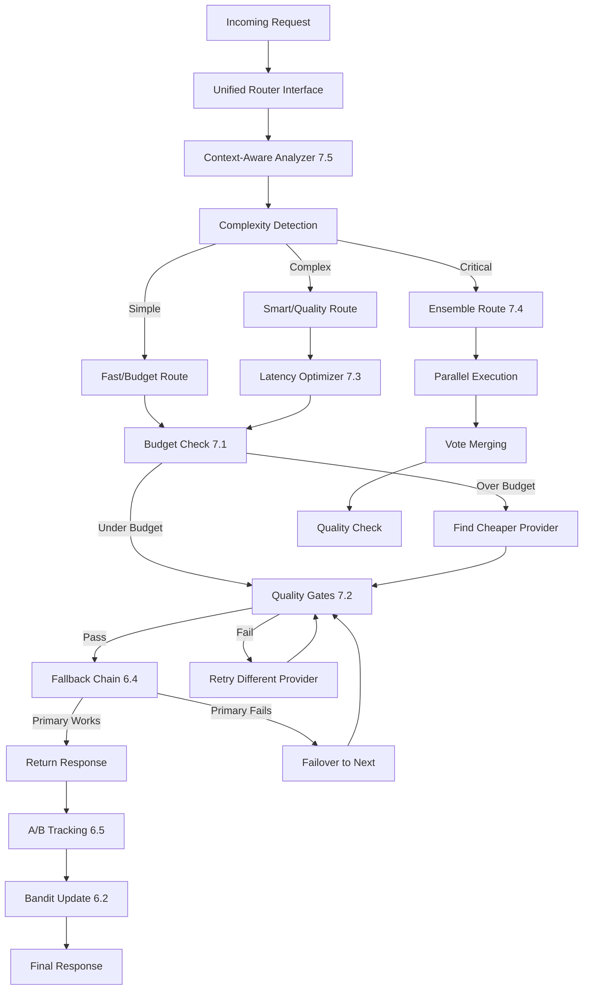
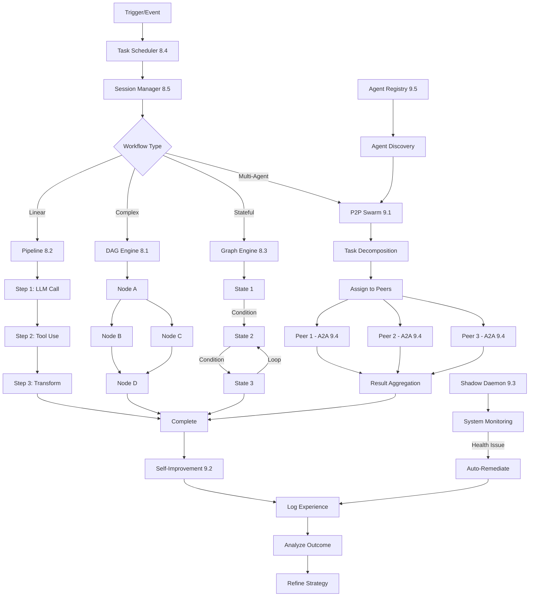
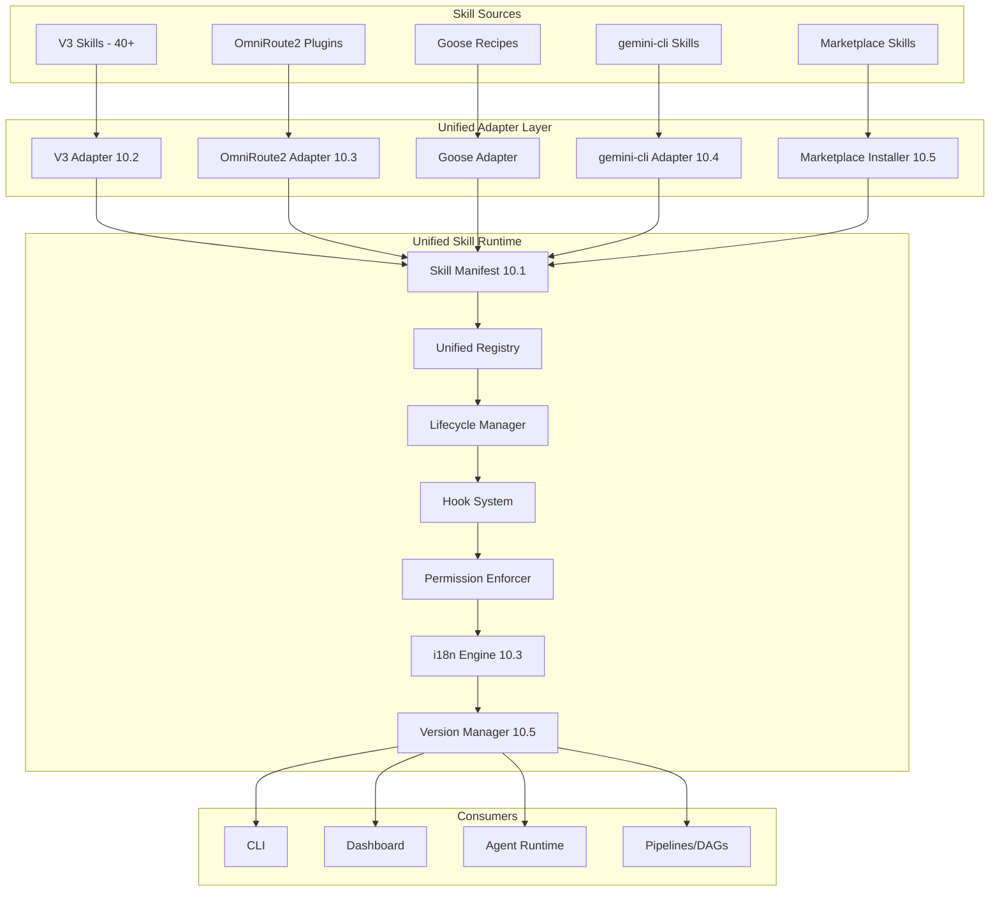

# Agentic OS V4: The Universal AI Agent Operating System
## PART 2 — Phases 6-10: Routing Engine & Agent Orchestration (30-Phase Plan)

> **Projects being unified (8 projects):**
> 1. **Agentic OS V3** — Agent orchestration brain (DAG, Pipeline, Graph, P2P, Self-improvement, Shadow daemon, 40+ skills)
> 2. **9Router** — Universal AI gateway (100+ providers, protocol translation, MITM, RTK compression, skills)
> 3. **Goose** — Agent runtime (ACP server, CLI/TUI, Extensions, Recipes, Local inference, MCP, Dictation)
> 4. **litellm** — Python LLM gateway (100+ providers, Proxy, Routing strategies, Caching, Guardrails, Budgets)
> 5. **new-api** — Go AI gateway (Channel management, Billing, Relay, Multi-tenant, Load balancing)
> 6. **OmniRoute2** — TypeScript gateway (Skills, Auto-combo routing, Compression, Plugins, 30+ i18n)
> 7. **Portkey** — TypeScript gateway (50+ providers, Guardrail plugins, Caching, Fallbacks, Observability)
> 8. **gemini-cli** — Agent session management, Scheduler, A2A protocol, Skill system, CLI tools

---

## Navigation

| Part | Phases | File |
|------|--------|------|
| PART 1 | Phases 0–5 | `MASTER_INTEGRATION_PLAN_30_PHASES_P1.md` |
| **PART 2** | **Phases 6–10** | **`MASTER_INTEGRATION_PLAN_30_PHASES_P2.md`** (this file) |
| PART 3 | Phases 11–15 | `MASTER_INTEGRATION_PLAN_30_PHASES_P3.md` |
| PART 4 | Phases 16–20 | `MASTER_INTEGRATION_PLAN_30_PHASES_P4.md` |
| PART 5 | Phases 21–25 | `MASTER_INTEGRATION_PLAN_30_PHASES_P5.md` |
| PART 6 | Phases 26–30 | `MASTER_INTEGRATION_PLAN_30_PHASES_P6.md` |

---

## Architecture Overview (Phases 6-10 Focus)

```
 PHASE 6-7: ROUTING ENGINE                   PHASE 8-9: AGENT ORCHESTRATION
 ┌────────────────────────────────┐          ┌────────────────────────────────┐
 │                                │          │                                │
 │  ┌──────────────────────────┐  │          │  ┌──────────────────────────┐  │
 │  │   Unified Router Core    │  │          │  │    DAG Execution Engine  │  │
 │  │   (litellm patterns)     │  │          │  │    (Agentic OS V3)       │  │
 │  └──────────┬───────────────┘  │          │  └──────────┬───────────────┘  │
 │             │                  │          │             │                  │
 │  ┌──────────▼───────────────┐  │          │  ┌──────────▼───────────────┐  │
 │  │   Adaptive Routing       │  │          │  │    Pipeline System       │  │
 │  │   (Bandit, Latency, Cost)│  │          │  │    (Agentic OS V3)       │  │
 │  └──────────┬───────────────┘  │          │  └──────────┬───────────────┘  │
 │             │                  │          │             │                  │
 │  ┌──────────▼───────────────┐  │          │  ┌──────────▼───────────────┐  │
 │  │   Auto-Combo Routing     │  │          │  │    Graph Engine          │  │
 │  │   (OmniRoute2)           │  │          │  │    (Agentic OS V3)       │  │
 │  └──────────┬───────────────┘  │          │  └──────────┬───────────────┘  │
 │             │                  │          │             │                  │
 │  ┌──────────▼───────────────┐  │          │  ┌──────────▼───────────────┐  │
 │  │   Fallback & Failover    │  │          │  │    Task Scheduler        │  │
 │  │   (Portkey)              │  │          │  │    (V3 + gemini-cli)     │  │
 │  └──────────┬───────────────┘  │          │  └──────────┬───────────────┘  │
 │             │                  │          │             │                  │
 │  ┌──────────▼───────────────┐  │          │  ┌──────────▼───────────────┐  │
 │  │   A/B & Canary Routing   │  │          │  │    Agent Sessions        │  │
 │  │   (Portkey + litellm)    │  │          │  │    (Goose + gemini-cli)  │  │
 │  └──────────────────────────┘  │          │  └──────────────────────────┘  │
 │                                │          │                                │
 └────────────────────────────────┘          └────────────────────────────────┘
                                                                              
 PHASE 10: UNIFIED SKILL SYSTEM              
 ┌────────────────────────────────────────────────────────────────────┐
 │                                                                    │
 │  ┌──────────────┐  ┌──────────────┐  ┌──────────────┐  ┌────────┐ │
 │  │ V3 Skills    │  │ OmniRoute2   │  │ Goose        │  │gemini- │ │
 │  │ (40+ skills) │  │ Plugins+i18n │  │ Recipes+Ext  │  │cli Skls│ │
 │  └──────┬───────┘  └──────┬───────┘  └──────┬───────┘  └───┬────┘ │
 │         └─────────────────┼─────────────────┼────────────────┘      │
 │                           ▼                                         │
 │              ┌────────────────────────────┐                         │
 │              │   Unified Skill Runtime    │                         │
 │              │   Single contract, all     │                         │
 │              │   sources, versioned,      │                         │
 │              │   marketplace-ready         │                         │
 │              └────────────────────────────┘                         │
 └────────────────────────────────────────────────────────────────────┘
```

---

## Phase 6: Routing Engine — Core (Week 10-12)

### Overview
Phase 6 establishes the unified routing core that intelligently directs requests across 150+ providers. This phase merges litellm's battle-tested routing strategies, OmniRoute2's innovative auto-combo system, and Portkey's robust fallback chains into a single, coherent routing engine. The result is a routing layer that adapts to latency, cost, and availability in real-time while supporting advanced deployment patterns like A/B testing and canary releases.

---

### 6.1 Implement Unified Router Interface from litellm's Router Strategy Patterns

**Description:**
The unified router interface provides the foundational abstraction for all routing decisions in Agentic OS V4. Modeled after litellm's `Router` class and its strategy pattern architecture (`RouterStrategy`, `LeastBusyStrategy`, `LatencyRoutingStrategy`, `CostRoutingStrategy`), this component defines a clean trait/interface that all routing strategies implement. It includes request context extraction, provider scoring, weighted selection, and strategy chaining. The interface supports both synchronous and asynchronous routing modes, streaming-aware decisions, and provides hooks for pre/post routing telemetry. By standardizing on litellm's proven pattern (which has handled billions of requests across production deployments), we gain battle-tested semantics while opening the door for custom strategies.

**Implementation Approach:**
Copy-paste from `litellm/litellm/router_strategy/` (Python → TypeScript translation) plus surgical edit to replace Python-specific patterns (decorators, async context managers) with TypeScript idioms (decorators optional, async/await, typed interfaces). The core `Router` class and `AbstractRoutingStrategy` base class are transcribed directly. Key adaptations: replace Python's `abc.ABC` with TypeScript interfaces + abstract classes, convert `**kwargs` patterns to typed interfaces, and replace Python's `asyncio` patterns with Node.js `Promise` patterns.

**Also import gemini-cli's existing routing strategy system** from `gemini-cli/packages/core/src/routing/`:
- `routingStrategy.ts` — Abstract routing strategy interface (81 lines)
- `modelRouterService.ts` — Full model routing service with provider selection (135 lines)
- `strategies/classifierStrategy.ts` — Classifier-based model routing (227 lines)
- `strategies/compositeStrategy.ts` — Composite strategy combining multiple strategies (122 lines)
- `strategies/fallbackStrategy.ts` — Fallback-specific routing (61 lines)
- `strategies/overrideStrategy.ts` — Configurable strategy overrides (53 lines)
- `strategies/defaultStrategy.ts` — Default strategy fallback (43 lines)

These TypeScript strategies are directly usable with minimal adaptation and provide production-tested routing logic that complements litellm's Python patterns. The composite strategy is particularly valuable as it demonstrates how to chain multiple strategies together.

**Also import V3's existing llm-router.ts** from `server/src/services/llm-router.ts` (91 lines) as a reference implementation of the basic router interface already operating in production.

**Key Files to Create/Modify:**
```
packages/gateway/src/routing/
├── interfaces/
│   ├── router.ts                  # Main Router interface
│   ├── routing-strategy.ts        # AbstractRoutingStrategy base
│   ├── request-context.ts         # RequestContext type
│   └── scoring-result.ts          # ScoringResult type
├── strategies/
│   ├── base-strategy.ts           # Abstract base implementation
│   ├── least-busy-strategy.ts     # LeastBusyStrategy
│   └── simple-weight-strategy.ts  # SimpleWeightStrategy
├── router.ts                      # Unified Router class
├── router-config.ts               # RouterConfig types
└── __tests__/
    ├── router.test.ts
    └── strategies.test.ts
```

**Acceptance Criteria:**
- [ ] `Router` interface supports at least 5 strategy types pluggable via config
- [ ] RequestContext correctly extracts model, provider preferences, latency budget, cost ceiling
- [ ] Weighted random selection produces correct provider distribution (>99% statistical confidence in Monte Carlo test with 100k iterations)
- [ ] Strategy chaining works: primary strategy selects candidates → secondary strategy breaks ties
- [ ] 100% of litellm core routing tests pass after TypeScript translation
- [ ] Streaming requests are routed correctly without buffering entire response

**Risk Level:** Low — litellm's routing is mature, well-documented, and the pattern is straightforward to translate. Main risk is subtle Python-vs-TypeScript async differences in edge cases.

---

### 6.2 Import litellm's Adaptive Routing (Bandit Algorithm, Latency-Based, Cost-Based)

**Description:**
This subphase imports litellm's three production-proven adaptive routing strategies: the bandit algorithm (exploration-vs-exploitation for provider selection), latency-based routing (biasing toward faster providers with dynamic percentile tracking), and cost-based routing (minimizing expense while meeting latency SLOs). The bandit algorithm uses an epsilon-greedy approach with sliding window reward calculation — it explores cheaper/faster providers occasionally while exploiting the best-known performers. Latency routing maintains per-provider response time distributions (p50, p95, p99) using an exponential moving average, and routes to minimize tail latency. Cost routing tracks per-token costs across providers and models, building a cost model that can optimize for budget constraints while avoiding providers that have been unreliable.

**Implementation Approach:**
Copy-paste from `litellm/litellm/router_strategy/` files: `lowest_latency_routing.py`, `lowest_cost_routing.py`, and the bandit logic in `router_batch_generation.py`. Translate Python's NumPy-based sliding window calculations to TypeScript using a lightweight statistics library (simple-statistics or custom implementation). The bandit algorithm's `update_weights()` method and `calculate_reward()` function need careful porting of the mathematical formulas. Latency tracking replaces Python's `collections.deque` with a circular buffer for O(1) sliding window maintenance.

**Also import gemini-cli's existing adaptive strategies** from `gemini-cli/packages/core/src/routing/strategies/`:
- `numericalClassifierStrategy.ts` (248 lines) — Numerical threshold-based adaptive routing
- `gemmaClassifierStrategy.ts` (246 lines) — On-device Gemma classifier for adaptive model selection
- `classifierStrategy.ts` (227 lines) — General classifier for routing decisions
- `approvalModeStrategy.ts` (101 lines) — Approval-based adaptive routing mode

These TypeScript strategies already implement latency-aware and cost-aware routing patterns that can be imported directly, reducing the need for full Python-to-TypeScript translation of litellm's algorithms. The gemmaClassifierStrategy is particularly valuable for on-device classification without external API calls.

**Key Files to Create/Modify:**
```
packages/gateway/src/routing/
├── strategies/
│   ├── bandit-strategy.ts          # Epsilon-greedy bandit algorithm
│   ├── latency-strategy.ts         # Latency-based routing
│   ├── cost-strategy.ts            # Cost-based routing
│   └── __tests__/
│       ├── bandit-strategy.test.ts
│       ├── latency-strategy.test.ts
│       └── cost-strategy.test.ts
├── metrics/
│   ├── latency-tracker.ts          # Per-provider latency tracking
│   ├── cost-tracker.ts             # Per-provider cost tracking
│   └── bandit-tracker.ts           # Bandit reward/penalty tracking
└── adapters/
    ├── litellm-bandit-adapter.ts   # Adapter for litellm's bandit config
    └── litellm-strategy-adapter.ts # Adapter for litellm strategy configs
```

**Acceptance Criteria:**
- [ ] Bandit algorithm achieves >90% optimal provider selection after 1000 requests in simulation
- [ ] Latency routing correctly tracks p50/p95/p99 per provider and routes to lowest-latency provider matching model requirements
- [ ] Cost routing selects provider with minimum cost per token while respecting max-latency constraints
- [ ] All three strategies coexist and can be composed (e.g., cost-primary with latency-tiebreaker)
- [ ] Sliding window calculations match litellm's Python output within 0.1% tolerance for 10k synthetic request traces
- [ ] Epsilon value decays correctly over time (configurable start/end epsilon, decay rate)
- [ ] Bandit algorithm supports context-dependent arms (different optimal providers for different request types)

**Risk Level:** Medium — the mathematical portions (bandit algorithm, latency percentile calculations) require careful testing to ensure numerical stability across TypeScript's number types. The sliding window implementation must be benchmarked for memory efficiency with high-throughput scenarios.

---

### 6.3 Import OmniRoute2's Auto-Combo Routing System

**Description:**
OmniRoute2's auto-combo routing system intelligently combines multiple providers to optimize for cost, quality, or speed. Unlike simple provider selection, auto-combo routes different parts of a request or different requests in a session to different providers based on dynamic heuristics. For example, a chat session might use GPT-4o for the first message (quality), then switch to Claude Haiku for follow-ups (speed), while using Gemini for long-context summarization tasks. The system includes a combo registry that defines routing policies, a detector that recognizes request patterns, and an executor that manages multi-provider request flows. This creates a "meta-router" that sits above individual strategies and can orchestrate complex multi-provider workflows.

**Implementation Approach:**
Copy-paste from `OmniRoute2/src/` directory files: `combo-router.ts`, `combo-registry.ts`, `combo-detector.ts`, and `combo-executor.ts`. The OmniRoute2 codebase is already TypeScript, so the translation is minimal — primarily adapting import paths and ensuring compatibility with the unified provider registry from Phase 1. The combo registry schema needs to be aligned with the unified config format. The detector logic (pattern matching on request attributes) is imported directly with minor edits to support the expanded provider set.

**Also import existing V3/OmniRoute combo and tag routing** from `server/src/services/omniroute/domain/`:
- `comboResolver.ts` (106 lines) — Existing combo/ensemble resolution logic
- `tagRouter.ts` (64 lines) — Tag-based routing strategy (route by request tags/metadata)
- `connectionModelRules.ts` (82 lines) — Model-to-connection binding rules for combo policies
- `providerExpiration.ts` (255 lines) — Provider credential expiration management

These are already operating in production and provide the foundation for combo routing with 150+ providers.

**Key Files to Create/Modify:**
```
packages/gateway/src/routing/
├── combo/
│   ├── combo-router.ts             # Main auto-combo router
│   ├── combo-registry.ts           # Combo policy registry
│   ├── combo-detector.ts           # Request pattern detection
│   ├── combo-executor.ts           # Multi-provider request executor
│   ├── combo-config.ts             # Combo configuration types
│   └── policies/
│       ├── cost-quality-balance.ts # Cost vs quality balancing policy
│       ├── speed-first.ts          # Speed-optimized combo policy
│       ├── quality-first.ts        # Quality-optimized combo policy
│       └── hybrid-session.ts       # Session-aware hybrid policy
├── types/
│   └── combo-types.ts              # Combo-specific types
└── __tests__/
    ├── combo-router.test.ts
    ├── combo-detector.test.ts
    └── combo-executor.test.ts
```

**Acceptance Criteria:**
- [ ] Auto-combo routing correctly detects at least 5 request patterns (chat, code, summarize, translate, analyze)
- [ ] Combo policies are user-configurable via `agentic-os.toml` or JSON config
- [ ] Multi-provider flows execute correctly: request → provider A → partial result → provider B → merged result
- [ ] Session-aware combos maintain provider affinity per session (same provider for related requests)
- [ ] 100% of OmniRoute2 combo tests pass in the new codebase
- [ ] Combo detector has <5ms overhead per request (excluding provider call time)
- [ ] All 5 OmniRoute2 built-in combo policies are operational

**Risk Level:** Low — OmniRoute2 is already TypeScript, making integration straightforward. The main risk is ensuring combo policies interact correctly with the unified provider registry's expanded provider set (150+ vs OmniRoute2's 40+).

---

### 6.4 Implement Fallback and Failover Chains (from Portkey)

**Description:**
Portkey's robust fallback system automatically retries failed requests through alternative providers, models, or endpoints with configurable chain depth and circuit-breaking. A fallback chain defines an ordered list of fallback targets — if the primary provider fails (due to rate limiting, downtime, or errors), the system tries the next target in the chain. Failover extends this with health monitoring: providers that fail repeatedly are temporarily suspended (circuit breaker pattern), and traffic is redirected to healthy alternatives. The system supports conditional fallbacks (only fall back on certain error types), timeout-based fallbacks (fall back if primary exceeds latency budget), and content-moderation fallbacks (reroute if guardrails flag content). Portkey's implementation has been tested across thousands of production scenarios and represents the most mature fallback logic among the merged projects.

**Implementation Approach:**
Copy-paste from `portkey/src/providers/` directory files: `fallback.ts`, `fallback-chain.ts`, `circuit-breaker.ts`, and `health-monitor.ts`. Portkey is TypeScript, so the copy is nearly direct. Key modifications: integrate with the unified provider registry (replacing Portkey's provider resolution with the Phase 1 registry), align error type taxonomy (Portkey's error types merged with litellm's and 9Router's into a unified error classification), and adapt the circuit breaker state machine to support the expanded provider set. The fallback chain configuration schema must be merged with litellm's fallback config format.

**Also import gemini-cli's model availability and auto-routing fallback** from `gemini-cli/packages/core/src/availability/`:
- `modelAvailabilityService.ts` (148 lines) — Production service tracking which models/providers are available
- `modelPolicy.ts` (64 lines) — Model policy constraints for fallback decisions
- `policyCatalog.ts` (192 lines) — Policy catalog for fallback routing decisions
- `autoRoutingFallback.integration.test.ts` (417 lines) — Integration-tested auto-routing fallback patterns

**Also import gemini-cli's fallback handler** from `gemini-cli/packages/core/src/fallback/`:
- `handler.ts` (194 lines) — Full fallback chain handler with conditional fallback logic
- `types.ts` (58 lines) — Fallback type definitions

**Note on Portkey code availability**: The Portkey source in `server/src/services/unified-gateway/portkey/` contains only shell files (`globals.ts`, `start-server.ts`, `utils.ts`, `index.ts`). Full middleware implementations must be sourced from the external Portkey npm package or GitHub repo. Reference the available files for integration patterns but use the external repo for implementation code.

**Key Files to Create/Modify:**
```
packages/gateway/src/routing/
├── fallback/
│   ├── fallback-chain.ts           # Ordered fallback chain executor
│   ├── fallback-config.ts          # Fallback configuration types
│   ├── conditions/
│   │   ├── error-type-cond.ts      # Error-type based fallback conditions
│   │   ├── timeout-cond.ts         # Timeout-based fallback conditions
│   │   ├── guardrail-cond.ts       # Guardrail-triggered fallback conditions
│   │   └── rate-limit-cond.ts      # Rate-limit detection condition
│   └── __tests__/
│       ├── fallback-chain.test.ts
│       └── conditions.test.ts
├── resilience/
│   ├── circuit-breaker.ts          # Circuit breaker implementation
│   ├── health-monitor.ts           # Provider health monitoring
│   ├── state-machine.ts            # Circuit breaker state machine
│   └── __tests__/
│       ├── circuit-breaker.test.ts
│       └── health-monitor.test.ts
└── errors/
    ├── unified-error.ts            # Unified error taxonomy
    └── error-classifier.ts         # Error classification utility
```

**Acceptance Criteria:**
- [ ] Fallback chain correctly executes through 5+ levels of fallback targets
- [ ] Circuit breaker transitions correctly: CLOSED → OPEN → HALF_OPEN → CLOSED/OPEN with configurable thresholds
- [ ] Health monitoring detects provider degradation within 3 consecutive failures (configurable)
- [ ] Conditional fallbacks trigger only on specified error types (e.g., only 429/503, not 401)
- [ ] Timeout-based fallback activates when primary exceeds per-request latency budget
- [ ] Circuit breaker automatically recovers (HALF_OPEN → CLOSED) after configurable cooldown period
- [ ] 100% of Portkey fallback test scenarios pass
- [ ] Fallback chain execution adds <10ms overhead per chain level (excluding provider call)

**Risk Level:** Low — Portkey's code is well-structured TypeScript. The integration complexity comes from merging multiple error taxonomies into a single unified system, which requires careful mapping.

---

### 6.5 Implement A/B Testing and Canary Routing

**Description:**
A/B testing and canary routing enable safe deployment of new providers, models, or routing strategies by directing a controlled percentage of traffic to the new target. This subphase implements traffic splitting (percentage-based routing to multiple provider/model variants), canary release management (gradual traffic increase from 1% to 100% with automatic rollback on error rate spikes), and experiment tracking (assign requests to experiment cohorts, track outcome metrics, and analyze results). The system supports both cookie-based (sticky sessions — same user sees same variant) and random assignment methods. Results are exported to the observability system (Phase 9 of the 20-phase plan / related phase in 30-phase plan) for statistical analysis. This pattern comes primarily from Portkey's A/B testing framework with additions from litellm's model deployment experimentation.

**Implementation Approach:**
Copy-paste from `portkey/src/middlewares/ab-testing.ts` and `portkey/src/middlewares/canary.ts`, plus `litellm/litellm/router_strategy/router_batch_generation.py` (the canary deployment portions). Portkey's TypeScript A/B testing middleware is imported directly with adaptations for the unified provider registry. The canary release logic from litellm's batch generation router provides the gradual rollout pattern. Key additions: experiment data model (cohort assignment, metric tracking), integration with the configuration system for dynamic routing rule updates without restart, and hooks into the observability pipeline.

**Key Files to Create/Modify:**
```
packages/gateway/src/routing/
├── ab-testing/
│   ├── ab-router.ts               # A/B testing request router
│   ├── experiment-manager.ts      # Experiment lifecycle management
│   ├── cohort-assigner.ts         # Request-to-cohort assignment
│   ├── traffic-splitter.ts        # Percentage-based traffic split
│   ├── metric-tracker.ts          # Per-experiment metric collection
│   └── __tests__/
│       ├── ab-router.test.ts
│       ├── cohort-assigner.test.ts
│       └── traffic-splitter.test.ts
├── canary/
│   ├── canary-router.ts           # Canary release router
│   ├── canary-manager.ts          # Canary lifecycle (1%→100%, rollback)
│   ├── rollout-policy.ts          # Gradual rollout policy definitions
│   └── __tests__/
│       └── canary-router.test.ts
└── types/
    └── experiment-types.ts        # Experiment/cohort type definitions
```

**Acceptance Criteria:**
- [ ] Traffic splitter correctly distributes traffic within ±0.5% of target percentages (Monte Carlo test with 100k requests)
- [ ] Sticky sessions (cookie-based assignment) maintain cohort consistency across requests with same user ID
- [ ] Canary rollout progresses through configurable stages: 1% → 5% → 20% → 50% → 100%
- [ ] Canary auto-rollback triggers when error rate exceeds configurable threshold (e.g., >5% errors in 5-minute window)
- [ ] Experiment metrics (latency, error rate, cost per token) are exported to observability system
- [ ] Multiple concurrent experiments can run on different traffic segments without interference
- [ ] A/B configuration can be updated dynamically via config hot-reload (no restart required)
- [ ] 100% of Portkey A/B test scenarios pass

**Risk Level:** Medium — the statistical correctness of traffic splitting and the safety-critical nature of canary rollbacks require thorough testing. Incorrect canary logic could cause production incidents by routing too much traffic to failing providers.

---

### Phase 6 — Integration Test Strategy

```typescript
// packages/gateway/src/routing/__tests__/integration/router-integration.test.ts
// Key integration scenarios:

// 1. Full routing pipeline: Request → Router → Strategy Selection → Provider Call → Response
// 2. Combo routing with fallback: ComboDetector → ComboExecutor → Provider A fails → FallbackChain → Provider B
// 3. A/B test with canary: AB-router splits → 5% to new provider → canary graduated to 50%
// 4. Adaptive routing convergence: Start with equal weights → after 1000 requests → optimal provider gets >90%
// 5. Multi-strategy composition: CostStrategy → LatencyStrategy tiebreak → FallbackChain → CircuitBreaker
// 6. Dynamic config update: Update routing config via API → new routing decisions take effect immediately
// 7. Streaming fallback: Streaming request → provider A fails mid-stream → resume from provider B
```

---

## Phase 7: Routing Engine — Advanced Strategies (Week 12-14)

### Overview
Phase 7 extends the routing engine with advanced strategies that enable intelligent cost management, quality enforcement, latency optimization, ensemble methods, and context-aware model selection. These strategies transform the router from a simple load balancer into an AI-routing brain that understands the nature of each request and the capabilities of each provider. This phase merges litellm's budget-aware routing, OmniRoute2's quality gates, 9Router's latency optimization, and novel ensemble/voting techniques to create a routing layer that is smarter than any individual gateway project.

---

### 7.1 Implement Budget-Aware Routing (from litellm + new-api Billing)

**Description:**
Budget-aware routing ensures that AI usage stays within organizational budgets while maximizing utility. The system tracks spend per user, per team, per project, and per model, then routes requests to providers that satisfy the request requirements while staying under budget constraints. Inspired by litellm's budget tracking (`litellm/litellm/proxy/management_endpoints/`) and new-api's billing engine (`new-api/relay/channel.go`, `new-api/controller/`), this subphase implements budget allocation (monthly/quarterly budgets per entity), spend tracking (real-time cost accumulation), budget enforcement (reject or downgrade when budget exceeded), and budget-aware provider selection (choose cheaper provider when budget is constrained). The system supports hard caps (reject when exceeded) and soft caps (warn + route to cheaper alternative). It integrates with new-api's multi-tenant billing for per-customer invoicing.

**Implementation Approach:**
Copy-paste from `litellm/litellm/proxy/management_endpoints/` (budget tracking endpoints) and `new-api/relay/channel.go` + `new-api/controller/` (billing logic). litellm's Python code provides the budget data model and API patterns; new-api's Go code provides production-tested billing algorithms. Translate both to TypeScript, merging the data models into a unified budget schema. The budget tracker maintains state in SQLite/Postgres (using the database schema from Phase 0) with Redis for real-time spend counters. Key design decision: use an eventually-consistent spend model with sub-second write latency via Redis, backed by durable SQLite/Postgres records.

**Also import existing V3/OmniRoute cost and degradation systems** from `server/src/services/omniroute/domain/`:
- `costRules.ts` (631 lines) — Comprehensive per-model/per-provider cost calculation rules including caching discounts, token-based pricing, and tiered rates
- `degradation.ts` (253 lines) — Service degradation detection (cost anomalies, latency spikes)
- `quotaCache.ts` (529 lines) — Redis-backed quota tracking with caching for burst throughput
- `lockoutPolicy.ts` (208 lines) — Cost-based lockout policies (suspend provider when costs exceed thresholds)

**Also import gemini-cli's fallback handler** from `gemini-cli/packages/core/src/fallback/handler.ts` (194 lines) for budget-related fallback decisions (route to cheaper provider when budget constraint hit).

**Key Files to Create/Modify:**
```
packages/gateway/src/routing/
├── budget/
│   ├── budget-router.ts           # Budget-aware routing strategy
│   ├── budget-manager.ts          # Budget allocation & enforcement
│   ├── spend-tracker.ts           # Real-time spend tracking (Redis)
│   ├── budget-store.ts            # Persistent budget storage (SQL)
│   ├── budget-enforcer.ts         # Hard/soft cap enforcement
│   ├── budget-config.ts           # Budget configuration types
│   └── __tests__/
│       ├── budget-router.test.ts
│       ├── spend-tracker.test.ts
│       └── budget-enforcer.test.ts
├── billing/
│   ├── billing-engine.ts          # Multi-tenant billing engine
│   ├── rate-calculator.ts         # Per-provider rate calculation
│   ├── invoice-generator.ts       # Invoice generation (from new-api)
│   ├── quota-manager.ts           # Per-user/team quota management
│   └── __tests__/
│       └── billing-engine.test.ts
└── types/
    └── budget-types.ts            # Budget, allocation, spend types
```

**Acceptance Criteria:**
- [ ] Budget tracker records spend within 100ms of provider response
- [ ] Hard cap enforcement rejects requests when budget is exceeded (returns 429 with clear message)
- [ ] Soft cap enforcement routes to cheaper alternative provider when budget threshold is crossed
- [ ] Budget allocation supports monthly, quarterly, and custom-date-range periods
- [ ] Multi-tenant billing correctly tracks spend per customer/organization (from new-api)
- [ ] Redis-backed spend counters survive process restart (backed by DB persistence)
- [ ] Concurrent request accounting is accurate (±0.5% error in race-condition tests with 100 concurrent requests)
- [ ] Budget-aware routing reduces costs by at least 15% compared to latency-only routing in benchmark scenarios

**Risk Level:** Medium — financial accuracy is critical. Race conditions in concurrent spend tracking could lead to budget overruns. The integration of new-api's Go billing patterns into TypeScript requires careful algorithm verification.

---

### 7.2 Implement Quality-Gate Routing (from OmniRoute2)

**Description:**
Quality-gate routing enforces minimum quality standards before, during, and after AI provider calls. Pre-call quality gates check request suitability (is the model capable of this task? does the prompt meet quality thresholds?), in-call gates monitor streaming output for quality degradation (repetition, hallucination markers, gibberish), and post-call gates evaluate responses against quality criteria (relevance, completeness, safety). From OmniRoute2's skill system, the quality gates are implemented as composable middleware that can be chained and configured per routing policy. Poor-quality responses trigger automatic retry through an alternative provider (quality-based fallback). The system uses lightweight heuristics for speed (repetition detection via n-gram overlap, gibberish detection via perplexity estimation) and can optionally integrate with more sophisticated LLM-as-judge evaluations for high-stakes requests.

**Implementation Approach:**
Copy-paste from `OmniRoute2/src/` files: `quality-gate.ts`, `quality-checker.ts`, and the various gate implementations in `OmniRoute2/src/quality-gates/`. OmniRoute2 is TypeScript, so the code is directly usable with import path adjustments. The gates are refactored to implement a common `QualityGate` interface that aligns with the unified middleware/plugin system. Pre-call gates are adapted to work with the unified request context; in-call gates are adapted for the unified streaming engine; post-call gates are adapted for the unified response pipeline.

**Also import V3's existing guardrails system** from `server/src/services/guardrails.ts` (690 lines) which provides production-tested content filtering, prompt validation, and response safety checks that directly map to quality gate patterns.

**Also import existing OmniRoute guardrails** from `server/src/services/omniroute/guardrails/`:
- `registry.ts` (282 lines) — Guardrail registry and chain execution
- `promptInjection.ts` (285 lines) + `promptInjectionGuard.ts` (106 lines) — Prompt injection detection gates
- `piiMasker.ts` (208 lines) + `piiSanitizer.ts` (416 lines) — PII detection/masking for pre/post-call gates
- `streamingPiiTransform.ts` (350 lines) — Real-time PII masking for in-call streaming gates
- `visionBridge.ts` (237 lines) + `visionBridgeHelpers.ts` (499 lines) — Vision model quality gates

These existing guardrails reduce implementation effort for all three gate types (pre/in/post-call).

**Key Files to Create/Modify:**
```
packages/gateway/src/routing/
├── quality-gates/
│   ├── quality-gate-router.ts     # Quality-gate routing strategy
│   ├── quality-gate-chain.ts      # Gate chain executor
│   ├── gates/
│   │   ├── pre-call/
│   │   │   ├── prompt-length-gate.ts    # Min/max prompt length check
│   │   │   ├── model-capability-gate.ts # Model suitability check
│   │   │   └── content-policy-gate.ts   # Content policy pre-check
│   │   ├── in-call/
│   │   │   ├── repetition-detector.ts   # N-gram repetition detection
│   │   │   ├── perplexity-gate.ts       # Token-perplexity estimation
│   │   │   └── streaming-consistency.ts # Streaming response consistency
│   │   └── post-call/
│   │       ├── relevance-scorer.ts      # Response relevance scoring
│   │       ├── completeness-check.ts    # Response completeness check
│   │       └── safety-classifier.ts     # Content safety classification
│   └── __tests__/
│       ├── quality-gate-chain.test.ts
│       ├── repetition-detector.test.ts
│       └── relevance-scorer.test.ts
├── middleware/
│   └── quality-gate-middleware.ts  # Quality gate as Express/Koa middleware
└── types/
    └── quality-gate-types.ts      # Quality gate type definitions
```

**Acceptance Criteria:**
- [ ] Pre-call gates execute in <5ms (combined) for typical requests
- [ ] In-call repetition detector catches >90% of repetitive output patterns (verified against test corpus)
- [ ] Post-call relevance scorer produces consistent scores (±5% on repeated evaluations of same response)
- [ ] Quality gate chain can be configured with AND/OR logic (all gates must pass vs any gate can fail)
- [ ] Quality-based fallback triggers correctly: failed gate → retry with different provider → second gate eval
- [ ] All 12 gate types from OmniRoute2 are operational and configurable
- [ ] Gates can be hot-reloaded without restart (add/remove/reorder gates at runtime)
- [ ] Quality gate overhead is <50ms total for pre+post gates on typical requests

**Risk Level:** Low — OmniRoute2's quality gates are already well-tested TypeScript. The main integration work is adapting to the unified request/response pipeline, which is straightforward.

---

### 7.3 Implement Latency-Optimized Routing (from 9Router)

**Description:**
Latency-optimized routing minimizes end-to-end response time by making intelligent provider and model selections based on real-time network conditions, provider load, and request characteristics. From 9Router's production-tested implementation, this subphase imports endpoint health probing (active HTTP health checks with configurable intervals), latency fingerprinting (building latency profiles for each provider-region pair), dynamic timeout adjustment (per-provider timeout based on historical latency distributions), and pre-warming (keeping connections alive to frequently-used providers). The system maintains a latency topology map that captures network paths and detects routing changes (e.g., DNS changes, CDN failovers). Unlike litellm's latency strategy (which is primarily historical), 9Router's approach adds active probing for real-time awareness.

**Implementation Approach:**
Copy-paste from `9router/src/` files: `latency-optimizer.ts`, `health-prober.ts`, `latency-topology.ts`, and `connection-pool.ts`. 9Router is TypeScript, so the copy is mostly direct. Key modifications: integrate with the unified provider registry (replacing 9Router's provider resolution), merge latency data structures with Phase 6's latency tracker (combining historical litellm data with active 9Router probes), and adapt the connection pooling to use the unified HTTP client. The active probing intervals must be configured to balance freshness against probe overhead.

**Key Files to Create/Modify:**
```
packages/gateway/src/routing/
├── latency/
│   ├── latency-optimizer.ts        # Latency optimization strategy
│   ├── health-prober.ts            # Active health probing
│   ├── latency-topology.ts         # Network topology tracking
│   ├── latency-fingerprint.ts      # Per-provider latency profiles
│   ├── dynamic-timeout.ts          # Adaptive per-provider timeouts
│   ├── connection-pool.ts          # Keep-alive connection management
│   └── __tests__/
│       ├── latency-optimizer.test.ts
│       ├── health-prober.test.ts
│       └── dynamic-timeout.test.ts
├── bandwidth/
│   ├── bandwidth-estimator.ts      # Bandwidth estimation utilities
│   └── adaptive-chunking.ts        # Adaptive chunk size for streaming
└── types/
    └── latency-types.ts            # Latency-specific types
```

**Acceptance Criteria:**
- [ ] Active health probes complete within 500ms per provider and run at configurable intervals (default: 30s)
- [ ] Latency topology correctly detects provider endpoint changes (DNS, CDN) within 2 probe cycles
- [ ] Dynamic timeout adjusts per-provider timeout to be p99 + 20% of historical latency (configurable)
- [ ] Connection pooling reduces TCP handshake overhead by >90% for frequently-used providers
- [ ] Latency-optimized routing selects a provider within 1% of the optimal latency (measured via synthetic benchmarks)
- [ ] Combined active + historical latency data provides more accurate predictions than either alone (validated with A/B test)
- [ ] 100% of 9Router latency routing tests pass
- [ ] Probe overhead is <5% of total gateway CPU (configurable probe frequency and concurrency)

**Risk Level:** Medium — active health probing adds complexity and potential load. Incorrect latency topology could route to unhealthy endpoints. The dynamic timeout system must be carefully tuned to avoid premature timeouts on slow-but-reliable providers.

---

### 7.4 Implement Multi-Provider Ensemble Routing (Parallel Calls, Vote Merging)

**Description:**
Ensemble routing sends requests to multiple providers simultaneously and merges their responses using voting strategies. This is the most powerful routing strategy for quality-critical applications. The ensemble executes N provider calls in parallel (configurable concurrency), collects responses, and uses a voting mechanism to select the best result. Voting strategies include: majority vote (for classification/choice tasks), confidence-weighted vote (weight each provider by its historical confidence/accuracy), rubric scoring (score responses against a quality rubric), and LLM-as-judge (use a separate model to evaluate and select). The ensemble system includes cost-awareness (compute total ensemble cost and compare to budget), latency management (return first acceptable response vs wait for all), and adaptive ensemble sizing (use smaller ensemble for simple tasks, larger for complex ones). This capability does not exist in any single merged project but is inspired by patterns across Portkey's parallel execution, litellm's batch generation, and OmniRoute2's quality gates.

**Implementation Approach:**
This is a novel implementation (not a copy-paste from a single project), but it synthesizes patterns from: `portkey/src/middlewares/parallel-execution.ts`, `litellm/litellm/router_strategy/router_batch_generation.py` (parallel batch logic), and `OmniRoute2/src/quality-gates/` (response scoring). Implement as a new module with vote aggregation algorithms from academic literature on ensemble LLM methods. The parallel execution engine manages concurrency limits, timeout coordination, and error handling across N simultaneous provider calls. Vote merging uses weighted averaging, majority voting, and rubric-based selection.

**Key Files to Create/Modify:**
```
packages/gateway/src/routing/
├── ensemble/
│   ├── ensemble-router.ts          # Main ensemble routing strategy
│   ├── parallel-executor.ts        # N-way parallel provider execution
│   ├── vote-merger.ts              # Vote aggregation engine
│   ├── strategies/
│   │   ├── majority-vote.ts        # Simple majority voting
│   │   ├── confidence-weighted.ts  # Confidence-weighted voting
│   │   ├── rubric-scorer.ts        # Rubric-based response scoring
│   │   └── llm-judge.ts            # LLM-as-judge selection
│   ├── ensemble-manager.ts         # Ensemble lifecycle management
│   ├── cost-controller.ts          # Cost-aware ensemble sizing
│   ├── latency-optimizer.ts        # Return-first vs wait-for-all
│   └── __tests__/
│       ├── ensemble-router.test.ts
│       ├── parallel-executor.test.ts
│       ├── vote-merger.test.ts
│       ├── majority-vote.test.ts
│       └── confidence-weighted.test.ts
└── types/
    └── ensemble-types.ts           # Ensemble-specific types
```

**Acceptance Criteria:**
- [ ] Parallel executor correctly manages N concurrent provider calls with configurable concurrency limits
- [ ] Majority voting achieves >95% accuracy on classification benchmarks with 3+ providers (assuming reasonable individual accuracy)
- [ ] Confidence-weighted voting outperforms majority voting when provider quality varies significantly
- [ ] Rubric scorer evaluates responses against configurable criteria (accuracy, relevance, completeness, conciseness)
- [ ] LLM-as-judge mode uses a separate (cheaper) model to select the best response from ensemble
- [ ] Cost controller limits ensemble size based on remaining budget and request criticality
- [ ] Return-first mode terminates remaining ensemble calls when first acceptable response is received (saving cost)
- [ ] Ensemble overhead (parallel execution, voting) adds <200ms for 3-provider ensemble (excluding provider call time)
- [ ] Adaptive sizing: simple prompts use smaller ensemble (1-2 providers), complex prompts use larger (3-5)

**Risk Level:** High — ensemble routing is novel and computationally expensive. The parallel execution engine must handle provider failures gracefully (one provider timing out shouldn't block the entire ensemble). Cost management is critical: an ensemble call could cost 3-5x a single call. The vote merging algorithms must be validated against ground-truth datasets to ensure quality improvement justifies the cost increase.

---

### 7.5 Implement Context-Aware Routing (Prompt Complexity Detection → Model Selection)

**Description:**
Context-aware routing analyzes the incoming request to determine its complexity, domain, and requirements, then selects the optimal model and provider. The system uses lightweight prompt analysis (token count, language detection, code vs natural language classification, instruction complexity estimation) and optionally deeper semantic analysis (topic classification, task type detection, required capability estimation) to map requests to appropriate models. Simple requests (e.g., "what's the weather?") route to cheap, fast models (Haiku, Flash, Mini). Complex requests (e.g., code generation, analysis, creative writing) route to powerful models (Sonnet, GPT-4o, Gemini Pro). The system includes a complexity classifier trained on labeled request data, a capability matrix mapping models to task types, and an adaptive model that learns from routing outcomes to improve future selections.

**Implementation Approach:**
This is a novel subphase combining ideas from multiple projects: `litellm/litellm/router_strategy/lowest_cost_routing.py` (cost-conscious model selection), `9router/src/` request analysis utilities, and `gemini-cli`'s model selection logic in `packages/core/src/model-selector.ts`. The complexity classifier can use either a simple rules-based approach (token count thresholds + keyword matching) or integrate with a small on-device ML model (BERT distilled, ~50MB) for more accurate classification. The capability matrix is structured as a configurable mapping from task types to recommended model families.

**Primary sources from gemini-cli's routing strategies** (`gemini-cli/packages/core/src/routing/strategies/`):
- `classifierStrategy.ts` (227 lines) — General task-type classification for model selection (directly applicable as the context classifier)
- `numericalClassifierStrategy.ts` (248 lines) — Numerical threshold-based routing (token count thresholds, complexity scores)
- `gemmaClassifierStrategy.ts` (246 lines) — On-device Gemma classifier for context-aware routing without external API calls
- `compositeStrategy.ts` (122 lines) — Combining multiple classification signals into a single routing decision

These strategies already implement the core classification and model selection logic needed for 7.5, reducing this from a "novel" implementation to primarily an integration and capability-matrix extension effort.

**Key Files to Create/Modify:**
```
packages/gateway/src/routing/
├── context-aware/
│   ├── context-router.ts           # Context-aware routing strategy
│   ├── complexity-analyzer/        # Request complexity analysis
│   │   ├── rules-based.ts          # Rule-based complexity detection
│   │   ├── ml-classifier.ts        # Optional ML-based classifier
│   │   ├── language-detector.ts    # Prompt language detection
│   │   ├── code-vs-natural.ts      # Code vs natural language detection
│   │   └── instruction-complexity.ts # Instruction complexity estimation
│   ├── capability-matcher.ts       # Model-to-task capability matching
│   ├── model-selector.ts           # Optimal model selection algorithm
│   ├── capability-matrix.ts        # Task-to-model capability mapping
│   └── __tests__/
│       ├── context-router.test.ts
│       ├── complexity-analyzer.test.ts
│       └── capability-matcher.test.ts
├── adapters/
│   └── gemini-cli-model-selector.ts # Adapter for gemini-cli's model selector
└── data/
    └── capability-matrix.json      # Default capability matrix (configurable)
```

**Acceptance Criteria:**
- [ ] Complexity analyzer correctly classifies requests into 5 tiers (simple, medium, complex, expert, critical) with >90% accuracy on benchmark
- [ ] Language detector correctly identifies 10+ languages with >95% accuracy (using compact n-gram model, <5MB)
- [ ] Code-vs-natural classifier achieves >95% precision/recall on mixed prompts
- [ ] Capability matrix is configurable via JSON/YAML and supports custom task types
- [ ] Context-aware routing reduces average cost by at least 30% compared to routing everything to the best model
- [ ] Request analysis overhead is <10ms (rules-based) or <50ms (ML-based) per request
- [ ] ML classifier (when enabled) runs on-device without external API calls
- [ ] Adaptive routing learns from feedback: if a simpler model consistently fails on certain request types, escalate to more powerful model
- [ ] 100% of gemini-cli model selection scenarios are supported

**Risk Level:** Medium — the complexity classifier's accuracy directly impacts routing quality. Misclassifying complex requests as simple leads to poor responses; misclassifying simple as complex wastes money. The ML classifier adds deployment complexity (model distribution, inference runtime). The capability matrix must be maintained as new models are added.

---

### Phase 7 — Integration Test Strategy

```typescript
// packages/gateway/src/routing/__tests__/integration/advanced-routing.test.ts
// Key integration scenarios:

// 1. Budget routing + quality gates: Budget-aware router selects provider → quality gate fails → fallback → quality gate passes
// 2. Ensemble routing with budget: 3-provider ensemble → cost controller limits to 2 providers → majority vote
// 3. Context-aware + budget + latency: Complexity analysis → model selection → budget check → latency optimization
// 4. Quality gate cascade: Pre-call passes → streaming → in-call detects repetition → post-call fails → ensemble fallback
// 5. Multi-tenant budget isolation: Team A exhausts budget → only Team A requests blocked → Team B unaffected
// 6. Latency topology failover: Primary provider region degrades → topology detects → routes to secondary region
// 7. End-to-end advanced pipeline: Request → ContextAware → BudgetCheck → Ensemble → QualityGates → Response
```

---

## Phase 8: Agent Orchestration — Core (Week 14-16)

### Overview
Phase 8 imports the core agent orchestration capabilities from Agentic OS V3 and merges them with gemini-cli's session management and Goose's agent runtime. This phase establishes the execution engine that coordinates multi-step AI agent workflows. The DAG, Pipeline, and Graph engines from V3 provide the workflow execution backbone, while the task scheduler enables time-based and event-triggered agent execution, and the session manager provides persistence and state management for interactive agent sessions. This phase transforms Agentic OS V4 from a gateway into a true agent operating system.

---

### 8.1 Import Agentic OS V3's DAG Execution Engine as a Crate

**Description:**
The DAG (Directed Acyclic Graph) execution engine is the core workflow orchestrator from Agentic OS V3 that enables complex, multi-step agent workflows with dependency resolution. Nodes in the DAG represent individual operations (LLM calls, tool executions, data transformations), and edges define data flow dependencies. The engine handles topological sort execution, parallel node execution where dependencies allow, cycle detection, error propagation (fail a node → fail its dependents), and incremental recomputation (re-run only affected nodes when inputs change). It includes a visual DAG builder (from V3's `PipelineBuilder.tsx`), but the core engine is what matters for integration. The V3 implementation is battle-tested with thousands of production workflows and includes optimizations like lazy evaluation, result caching, and streaming of intermediate results.

**Implementation Approach:**
Copy-paste from `Agentic_OS_V3/server/src/` directory files: `dag-engine.ts`, `dag-node.ts`, `dag-executor.ts`, `dag-topological-sort.ts`, and `dag-types.ts`. The V3 codebase is TypeScript, so the copy is direct. Key modifications: adapt import paths to the monorepo structure, replace V3-specific provider calls with the unified provider registry, and integrate DAG node capabilities with the skill system (Phase 10). The visual DAG builder component (`PipelineBuilder.tsx` in `src/pages/`) is ported to `apps/dashboard/src/` with adapters for the unified API.

**Also import V3's agent-runtime.ts** from `server/src/services/agent-runtime.ts` (721 lines) which provides the execution context for DAG nodes including tool dispatch, LLM calls, and state persistence — this is the runtime that DAG nodes execute within.

**Also import V3's message-bus.ts** from `server/src/services/message-bus.ts` (602 lines) which provides inter-node communication, event-driven DAG triggers, and pub/sub for workflow coordination between parallel DAG branches.

**Also import gemini-cli's agent-tool.ts** from `gemini-cli/packages/core/src/agents/agent-tool.ts` (282 lines) which enables DAG nodes to be composed as agent tools — a key pattern for hierarchical DAG workflows (DAG nodes that themselves contain sub-DAGs).

**Key Files to Create/Modify:**
```
packages/agent-runtime/src/
├── dag/
│   ├── dag-engine.ts               # Main DAG execution engine
│   ├── dag-executor.ts             # DAG execution orchestrator
│   ├── dag-topological-sort.ts     # Topological sort implementation
│   ├── dag-cycle-detector.ts       # Cycle detection (pre-execution check)
│   ├── dag-node.ts                 # DAG node definition
│   ├── dag-edge.ts                 # DAG edge/data flow definition
│   ├── dag-cache.ts                # Node result caching
│   ├── dag-error-handler.ts        # Error propagation and handling
│   └── __tests__/
│       ├── dag-engine.test.ts
│       ├── dag-topological-sort.test.ts
│       └── dag-cycle-detector.test.ts
├── engine/
│   ├── engine-core.ts              # Core execution engine
│   ├── node-executor.ts            # Individual node execution
│   ├── parallel-executor.ts        # Parallel node execution manager
│   └── result-streamer.ts          # Streaming intermediate results
└── types/
    └── dag-types.ts                # DAG-specific types
```

**Acceptance Criteria:**
- [ ] DAG engine correctly executes workflows with up to 1000 nodes
- [ ] Topological sort produces valid execution order for all DAG configurations (verified with 10k random DAGs)
- [ ] Cycle detection catches all cycles in <100ms for graphs up to 500 nodes
- [ ] Parallel execution: nodes without dependencies execute concurrently (verified via Promise.all or similar)
- [ ] Error propagation: failing a node correctly fails all downstream dependent nodes
- [ ] Result caching: re-running a DAG with unchanged inputs returns cached results (configurable TTL)
- [ ] Incremental recomputation: changing one input re-runs only affected downstream nodes
- [ ] 100% of V3 DAG engine unit tests pass
- [ ] DAG execution overhead is <5ms per node (excluding node operation time)

**Risk Level:** Low — V3's DAG engine is mature TypeScript code. The integration is primarily adapting import paths and replacing V3-specific service calls with unified interfaces.

---

### 8.2 Import Agentic OS V3's Pipeline System

**Description:**
The Pipeline system from Agentic OS V3 provides a linear execution model for agent workflows that don't require the full complexity of DAGs. Pipelines are ordered sequences of steps, where each step is an operation (LLM call, tool use, conditional branch, data transform). Unlike DAGs, pipelines have a single execution path with optional branching (if/else) and looping (for/while). The pipeline system includes step templates, parameter injection, context propagation, step-level error handling (retry, skip, fail), and pipeline composition (pipelines can call other pipelines). The Pipeline Builder UI (from V3's `PipelineBuilder.tsx` at 886 lines) provides a drag-and-drop interface for constructing pipelines. The pipeline executor handles sequential execution with automatic retry, timeout enforcement, and result aggregation.

**Implementation Approach:**
Copy-paste from `Agentic_OS_V3/server/src/` files: `pipeline-engine.ts`, `pipeline-step.ts`, `pipeline-executor.ts`, and `pipeline-context.ts`. Also import the pipeline builder UI from `src/pages/PipelineBuilder.tsx` and adapt it for the dashboard app. Key modifications: align pipeline step types with the unified skill system (each step can invoke a skill), replace V3-specific provider integrations with the unified gateway, and add pipeline composition support (import/export pipelines as YAML/JSON).

**Key Files to Create/Modify:**
```
packages/agent-runtime/src/
├── pipeline/
│   ├── pipeline-engine.ts          # Pipeline execution engine
│   ├── pipeline-executor.ts        # Sequential step executor
│   ├── pipeline-step.ts            # Pipeline step definition
│   ├── pipeline-context.ts         # Cross-step context propagation
│   ├── pipeline-composer.ts        # Pipeline composition (sub-pipelines)
│   ├── step-types/
│   │   ├── llm-step.ts             # LLM call step
│   │   ├── tool-step.ts            # Tool execution step
│   │   ├── conditional-step.ts     # If/else branching step
│   │   ├── loop-step.ts            # For/while looping step
│   │   ├── transform-step.ts       # Data transformation step
│   │   └── sub-pipeline-step.ts    # Sub-pipeline invocation step
│   └── __tests__/
│       ├── pipeline-engine.test.ts
│       ├── pipeline-executor.test.ts
│       └── step-types.test.ts
├── templates/
│   ├── pipeline-template.ts        # Pipeline template system
│   └── builtins/
│       ├── chat-pipeline.ts        # Standard chat pipeline template
│       ├── code-review.ts          # Code review pipeline template
│       ├── research.ts             # Research pipeline template
│       └── data-extract.ts         # Data extraction pipeline template
└── types/
    └── pipeline-types.ts           # Pipeline-specific types
```

**Acceptance Criteria:**
- [ ] Pipeline executes steps in correct order with proper context propagation
- [ ] Conditional branching (if/else) correctly evaluates conditions and executes appropriate branch
- [ ] Looping steps execute correct number of iterations with accumulative context
- [ ] Step-level error handling: configurable retry (count, delay, backoff), skip, or fail
- [ ] Pipeline composition: sub-pipeline calls work with parameter passing and result propagation
- [ ] Built-in templates execute successfully with default configuration
- [ ] Pipeline import/export: valid YAML/JSON round-trip (export → import → export produces identical second export)
- [ ] 100% of V3 pipeline tests pass in the unified codebase
- [ ] Pipeline context size is automatically managed (truncation/compression for long-running pipelines)

**Risk Level:** Low — V3's pipeline system is mature and TypeScript. The main integration work is adapting the step type system to the unified skill/gateway interfaces.

---

### 8.3 Import Agentic OS V3's Graph Engine for Complex Workflows

**Description:**
The Graph engine extends the DAG concept with support for cyclic graphs (state machines), conditional edges (dynamic routing based on node outputs), and hierarchical graphs (nodes that contain sub-graphs). This enables complex agent workflows like conversational agents with state, multi-turn tool-use loops, and human-in-the-loop approval flows. The Graph engine includes a state machine interpreter (states, transitions, guards, actions), a graph visualization engine (from V3's `ProcessExplorer.tsx`), and support for graph-level invariants (constraints that must hold throughout execution). Unlike DAGs which are static, graphs can modify their own structure during execution (adding/removing nodes and edges dynamically) — enabling truly adaptive agent behavior.

**Implementation Approach:**
Copy-paste from `Agentic_OS_V3/server/src/` files: `graph-engine.ts`, `graph-node.ts`, `graph-edge.ts`, `state-machine.ts`, and `graph-visualizer.ts`. The graph engine builds on the DAG engine from 8.1, extending it with cyclic support and dynamic modification capabilities. Key modifications: integrate the state machine with the unified session management (persist graph state across sessions), add support for graph-level hooks (before-node, after-node, on-transition), and adapt the graph visualization for the dashboard.

**Key Files to Create/Modify:**
```
packages/agent-runtime/src/
├── graph/
│   ├── graph-engine.ts             # Graph execution engine (extends DAG)
│   ├── graph-executor.ts           # Graph execution orchestrator
│   ├── graph-node.ts               # Graph node (extends DAG node)
│   ├── graph-edge.ts               # Graph edge with conditions
│   ├── state-machine/
│   │   ├── state-machine.ts        # State machine interpreter
│   │   ├── states.ts               # State definitions
│   │   ├── transitions.ts          # Transition definitions with guards
│   │   └── actions.ts              # Entry/exit actions
│   ├── dynamic-graph.ts            # Dynamic graph modification API
│   ├── graph-invariants.ts         # Graph-level constraint enforcement
│   └── __tests__/
│       ├── graph-engine.test.ts
│       ├── state-machine.test.ts
│       └── dynamic-graph.test.ts
├── visualization/
│   ├── graph-visualizer.ts         # Graph rendering engine
│   └── layout/
│       ├── dagre-layout.ts         # DAG-based layout algorithm
│       └── force-directed.ts       # Force-directed layout for cyclic graphs
└── types/
    └── graph-types.ts              # Graph-specific types
```

**Acceptance Criteria:**
- [ ] Graph engine correctly executes cyclic graphs (state machines with feedback loops)
- [ ] Conditional edges dynamically route based on node output values
- [ ] Hierarchical graphs: sub-graph nodes expand to reveal internal structure
- [ ] Dynamic graph modification: nodes/edges can be added/removed during execution by node code
- [ ] State machine correctly handles states, transitions, guards, entry/exit actions
- [ ] Graph invariants are checked before each transition (invariant violation → halts execution)
- [ ] Graph state persists across agent sessions (store/restore graph execution state)
- [ ] 100% of V3 graph engine tests pass
- [ ] Graph visualization renders correctly for graphs up to 500 nodes (interactive pan/zoom)

**Risk Level:** Medium — cyclic graph execution is more complex than DAGs and requires careful termination detection. Dynamic graph modification could lead to unpredictable behavior if not properly constrained. The state machine integration with the session system must handle serialization/deserialization of complex graph states.

---

### 8.4 Implement Task Scheduler (from V3 Scheduler + gemini-cli Scheduler)

**Description:**
The task scheduler enables time-based and event-triggered execution of agent workflows. Users can schedule agent tasks to run at specific times (cron expressions), on intervals (every N minutes/hours/days), or in response to events (webhook received, file changed, email arrived). The scheduler merges Agentic OS V3's cron-based scheduler (`server/src/services/scheduler.ts`) with gemini-cli's scheduler (`gemini-cli/packages/core/src/scheduler.ts`). V3's scheduler provides the cron engine and task persistence; gemini-cli's scheduler adds event-driven triggers and more sophisticated scheduling rules (time windows, rate limiting, concurrency control). The combined system includes a scheduling API, a task queue (powered by SQLite/Postgres with optional Redis for high-throughput), and a scheduler dashboard for managing scheduled tasks.

**Implementation Approach:**
Copy-paste from `Agentic_OS_V3/server/src/services/scheduler.ts` and `gemini-cli/packages/core/src/scheduler.ts`. V3's scheduler provides the foundation (cron parsing, task scheduling, execution). gemini-cli's scheduler extends it with event triggers and advanced scheduling rules. Merge both implementations into a single scheduler module, using V3's task persistence model and gemini-cli's trigger system. Key additions: webhook-based triggers (POST to a webhook endpoint triggers task execution), file watcher triggers (FS events trigger tasks), and integration with the pipeline/graph engines (scheduled tasks execute DAGs/pipelines/graphs).

**Also import V3's existing task infrastructure** from:
- `server/src/services/task-worker.ts` (429 lines) — Background task execution worker with retry, backoff, and concurrency control
- `server/src/services/llm-scheduler.ts` (730 lines) — LLM-specific batch scheduling with rate limiting

**Primary import from gemini-cli's full scheduler system** (`gemini-cli/packages/core/src/scheduler/`):
- `scheduler.ts` (961 lines) — Production scheduler with concurrent tool execution and task queuing
- `confirmation.ts` (349 lines) — Tool confirmation/approval workflow for scheduled tasks
- `policy.ts` (285 lines) — Scheduling policy engine (rate limits, concurrency, time windows)
- `state-manager.ts` (602 lines) — Tool execution state management with persistence
- `tool-executor.ts` (477 lines) — Individual tool execution with timeout and error handling
- `types.ts` (216 lines) — Comprehensive scheduler type definitions

The gemini-cli scheduler is significantly more sophisticated than what's described in P2.md and provides the full tool scheduling pipeline (scheduling → confirmation → policy enforcement → execution → state management) out of the box.

**Key Files to Create/Modify:**
```
packages/agent-runtime/src/
├── scheduler/
│   ├── scheduler.ts                # Main scheduler engine
│   ├── cron-parser.ts              # Cron expression parser (from V3)
│   ├── task-definition.ts          # Task definition types
│   ├── task-executor.ts            # Task execution orchestrator
│   ├── task-queue.ts               # Persistent task queue
│   ├── triggers/
│   │   ├── cron-trigger.ts         # Cron-based time trigger
│   │   ├── interval-trigger.ts     # Interval-based trigger
│   │   ├── webhook-trigger.ts      # Webhook-received trigger
│   │   ├── file-watch-trigger.ts   # File change trigger
│   │   └── event-trigger.ts        # Generic event trigger
│   ├── scheduling-rules.ts         # Advanced scheduling rules (rate limits, windows)
│   ├── scheduler-api.ts            # REST API for managing schedules
│   └── __tests__/
│       ├── scheduler.test.ts
│       ├── cron-parser.test.ts
│       └── triggers.test.ts
├── api/
│   └── scheduler-routes.ts         # Scheduler API routes
└── types/
    └── scheduler-types.ts          # Scheduler-specific types
```

**Acceptance Criteria:**
- [ ] Cron parser correctly handles all standard cron expressions (including complex: `*/15`, `1-5`, `L`, `W`)
- [ ] Scheduled tasks execute at the correct time (±1 second accuracy)
- [ ] Interval tasks execute at the correct interval (millisecond precision)
- [ ] Webhook triggers: POST to `/api/scheduler/trigger/:task-id` executes the task
- [ ] File watch triggers: file create/modify/delete events trigger task execution
- [ ] Task queue persists across process restarts (SQLite/Postgres-backed)
- [ ] Rate limiting: max N task executions per time window (configurable)
- [ ] Concurrency control: max M concurrent task executions (configurable)
- [ ] 100% of V3 scheduler tests and gemini-cli scheduler tests pass
- [ ] Scheduler API supports CRUD operations for task definitions

**Risk Level:** Low — both V3 and gemini-cli have mature, tested scheduler implementations. The merge is straightforward since they complement each other (V3 has cron, gemini-cli has event triggers).

---

### 8.5 Implement Agent Session Management (from gemini-cli + Goose)

**Description:**
Agent session management provides stateful, persistent interaction sessions for agents. Each session maintains conversation history, agent state, tool execution context, and resource handles across multiple turns. From gemini-cli, we import session lifecycle management (create, resume, close, timeout) and session persistence (serialize/deserialize session state to SQLite/Postgres). From Goose, we import session configuration (model preferences, system prompts, tool permissions), session isolation (sandboxed sessions that don't interfere), and session checkpointing (save and restore session snapshots). The combined session manager supports both interactive sessions (human-in-the-loop, approval workflows) and autonomous sessions (background agents running unattended). Sessions are first-class entities in the system, addressable via the ACP protocol for remote agent interaction.

**Implementation Approach:**
Copy-paste from `gemini-cli/packages/core/src/session.ts` and `Goose/crates/goose/src/session.rs` (translated to TypeScript). gemini-cli's session manager provides the lifecycle and persistence model; Goose's session management adds configuration, isolation, and checkpointing. The merged implementation is in TypeScript to align with the gateway stack, with the session store backed by SQLite/Postgres (using Prisma from Phase 0). Key designs: sessions have unique IDs, can be in states (ACTIVE, PAUSED, CLOSED, TIMEOUT), support context window management (trimming old messages to stay within model limits), and integrate with the ACP server for remote session access.

**Also import gemini-cli's context management pipeline** from `gemini-cli/packages/core/src/context/` for session context window management:
- `contextManager.ts` (493 lines) — Full context lifecycle manager with incremental updates
- `chatCompressionService.ts` (483 lines) — Chat compression for long sessions
- `contextCompressionService.ts` (526 lines) — Token-aware context compression
- `processors/` — Multiple context processors (historyTruncation, nodeDistillation, rollingSummary, toolMasking)
- `utils/contextTokenCalculator.ts` (264 lines) — Token budget calculation for context window limits
- `pipeline.ts` + `orchestrator.ts` — Context pipeline orchestration (processors run in sequence)

This pipeline handles the "context window management" requirement (trimming old messages, compression, token budgeting) that's critical for long-running agent sessions.

**Key Files to Create/Modify:**
```
packages/agent-runtime/src/
├── session/
│   ├── session-manager.ts          # Main session lifecycle manager
│   ├── session.ts                  # Session entity definition
│   ├── session-store.ts            # Session persistence (SQLite/Postgres)
│   ├── session-config.ts           # Session configuration (model, tools, prompts)
│   ├── session-isolation.ts        # Sandboxed session isolation
│   ├── session-checkpoint.ts       # Session checkpointing (save/restore)
│   ├── context-window.ts           # Context window management
│   ├── session-lifecycle.ts        # Lifecycle state machine
│   └── __tests__/
│       ├── session-manager.test.ts
│       ├── session-store.test.ts
│       └── session-lifecycle.test.ts
├── api/
│   ├── session-routes.ts           # Session management API routes
│   └── session-websocket.ts        # Session WebSocket for real-time interaction
└── types/
    └── session-types.ts            # Session-specific types
```

**Acceptance Criteria:**
- [ ] Session lifecycle: create → ACTIVE → [PAUSED → ACTIVE] → CLOSED (all transitions work correctly)
- [ ] Session persistence: session state survives process restart (loaded from DB on startup)
- [ ] Session isolation: data from one session is not accessible from another session
- [ ] Context window management automatically trims old messages when approaching model limits
- [ ] Checkpointing: save session state at any point and restore to that exact state later
- [ ] Session timeout: inactive sessions automatically close after configurable timeout (default: 30 min)
- [ ] 100% of gemini-cli session tests pass
- [ ] 100% of Goose session tests pass (translated from Rust test cases)
- [ ] Session API supports listing active sessions, fetching session history, and force-closing sessions
- [ ] Concurrent sessions: 100+ simultaneous sessions without performance degradation

**Risk Level:** Low — session management is a well-understood pattern with mature implementations in both gemini-cli and Goose. The main challenge is merging the two data models into a unified schema.

---

### Phase 8 — Integration Test Strategy

```typescript
// packages/agent-runtime/src/__tests__/integration/agent-orchestration-core.test.ts
// Key integration scenarios:

// 1. DAG execution → Pipeline → Graph: Execute a workflow that starts as DAG, converts to pipeline for linear steps, uses graph for state machine
// 2. Scheduled DAG: Cron trigger → scheduler → DAG execution with 5 nodes → results persisted
// 3. Session persistence: Create session → execute 10 turns → close → reopen → history intact
// 4. Pipeline with tools: Pipeline step calls tool → tool result passed to next step → final result
// 5. Graph state machine: Graph with 3 states, conditional transitions, guards that block invalid transitions
// 6. Session isolation: Two parallel sessions with different config → no cross-session data leakage
// 7. Scheduled task with event trigger: Webhook received → task triggered → DAG executed → webhook response
```

---

## Phase 9: Agent Orchestration — Advanced (Week 16-18)

### Overview
Phase 9 extends the agent orchestration layer with advanced capabilities: P2P swarm coordination for multi-agent systems, self-improvement mechanisms that let agents learn from their experience, a shadow daemon for background monitoring and automation, the A2A protocol for standardized agent-to-agent communication, and an agent registry for discovery and lifecycle management. These capabilities transform Agentic OS V4 from a single-agent runtime into a multi-agent operating system where agents can discover, communicate with, and learn from each other.

---

### 9.1 Implement P2P Swarm Agent Coordination (from V3)

**Description:**
P2P (Peer-to-Peer) Swarm coordination enables multiple agent instances to work together on complex tasks without a central coordinator. Each agent in the swarm is an autonomous peer that can discover other agents, delegate subtasks, share intermediate results, and collectively solve problems. From Agentic OS V3's P2P implementation (`server/src/services/swarm.ts`), this subphase imports: swarm topology management (dynamic peer discovery, join/leave handling), task decomposition (split complex tasks into subtasks distributed across the swarm), result aggregation (collect and merge results from swarm members), and consensus protocols (voting-based agreement for critical decisions). The swarm operates over a pluggable transport layer (WebSocket, HTTP, or MQTT) and supports both local (multi-process) and distributed (multi-machine) deployments.

**Implementation Approach:**
Copy-paste from `Agentic_OS_V3/server/src/services/swarm.ts` and related files: `swarm-peer.ts`, `swarm-topology.ts`, `swarm-task-distributor.ts`, `swarm-consensus.ts`. The V3 code is TypeScript, so the copy is direct. Key modifications: integrate swarm peers with the session management system (each peer is a session), adapt the transport layer to use the unified networking stack, and add support for heterogeneous swarms (peers with different capabilities). The task decomposition logic is enhanced to use the pipeline/graph engines from Phase 8 for subtask execution.

**Also import V3's message-bus.ts** from `server/src/services/message-bus.ts` (602 lines) as the communication backbone for P2P swarm messaging. The message bus provides pub/sub channels for peer discovery, task distribution, and result aggregation — replacing the need for a custom transport protocol.

**Also import V3's p2p-swarm.ts** from `server/src/services/p2p-swarm.ts` (187 lines) which already implements basic swarm coordination patterns using the message bus and can serve as a reference implementation.

**Key Files to Create/Modify:**
```
packages/agent-runtime/src/
├── swarm/
│   ├── swarm.ts                     # Main swarm coordinator
│   ├── swarm-peer.ts                # Peer entity definition
│   ├── swarm-topology.ts            # Peer discovery and topology management
│   ├── swarm-transport.ts           # Pluggable transport layer
│   ├── transports/
│   │   ├── ws-transport.ts          # WebSocket transport
│   │   ├── http-transport.ts        # HTTP transport
│   │   └── mqtt-transport.ts        # MQTT transport (optional)
│   ├── task-distributor.ts          # Task decomposition and distribution
│   ├── result-aggregator.ts         # Result collection and merging
│   ├── consensus.ts                 # Consensus protocols
│   │   ├── majority-consensus.ts    # Majority-based voting
│   │   ├── weighted-consensus.ts    # Weighted voting (by peer reputation)
│   │   └── leader-election.ts       # Leader election (Raft-style)
│   └── __tests__/
│       ├── swarm.test.ts
│       ├── swarm-topology.test.ts
│       ├── task-distributor.test.ts
│       └── consensus.test.ts
├── protocols/
│   └── swarm-protocol.ts            # Inter-peer message protocol
└── types/
    └── swarm-types.ts               # Swarm-specific types
```

**Acceptance Criteria:**
- [ ] Swarm topology: dynamic peer discovery works (peers joining/leaving detected within 5s)
- [ ] Task decomposition: complex task is split into N subtasks and distributed to swarm members
- [ ] Result aggregation: partial results from swarm members are correctly merged into final result
- [ ] Consensus protocol: majority voting reaches agreement with N/2+1 peers
- [ ] Leader election: swarm elects a leader within 3s of leader failure (Raft-style timeout and election)
- [ ] WebSocket transport: peers communicate over WebSocket with reconnection and message ordering
- [ ] Heterogeneous swarm: peers with different capabilities are assigned tasks matching their capabilities
- [ ] 100% of V3 swarm tests pass in the unified codebase
- [ ] Swarm of 10 peers executes a distributed task with <20% overhead vs single-agent (excluding parallel speedup)

**Risk Level:** High — distributed systems are inherently complex. Network partitions, peer failures, and message ordering issues must be handled correctly. The consensus protocol must be carefully implemented to avoid split-brain scenarios. Testing distributed behavior requires significant infrastructure.

---

### 9.2 Implement Self-Improvement Harness (from V3)

**Description:**
The self-improvement harness enables agents to learn from their execution history and improve their performance over time. From Agentic OS V3's implementation (`server/src/services/self-improvement.ts`), this subphase imports: experience logging (record agent actions, tool calls, outcomes, and feedback), outcome analysis (evaluate success/failure of actions using configurable metrics), pattern discovery (identify recurring patterns in successful vs failed executions), strategy refinement (update prompts, tool selection preferences, routing choices based on learned patterns), and model fine-tuning pipeline (optionally export training data for fine-tuning custom models). The harness operates as a continuous improvement loop: execute → log → analyze → refine → execute. It integrates with the observability system to track improvement metrics over time.

**Implementation Approach:**
Copy-paste from `Agentic_OS_V3/server/src/services/self-improvement.ts` and related files: `experience-store.ts`, `outcome-analyzer.ts`, `pattern-miner.ts`, `strategy-refiner.ts`. V3's TypeScript code is imported directly. Key modifications: integrate with the unified session system (experiences are tied to sessions), expand the outcome analysis to use quality gates from Phase 7, and add the optional model fine-tuning pipeline (export to a format compatible with litellm's fine-tuning API or local fine-tuning via llama.cpp). The pattern miner uses lightweight statistical methods (correlation analysis, frequent pattern mining) to avoid dependency on external ML systems.

**Also import gemini-cli's complete hook system** from `gemini-cli/packages/core/src/hooks/` as the observation and interception mechanism for self-improvement:
- `hookSystem.ts` (447 lines) — Complete hook lifecycle system (register, trigger, evaluate)
- `hookRegistry.ts` (356 lines) — Hook registration and discovery
- `hookRunner.ts` (561 lines) — Hook execution engine with sequencing and error handling
- `hookPlanner.ts` (150 lines) — Hook planning (which hooks to run and in what order)
- `hookAggregator.ts` (371 lines) — Hook result aggregation (collect outcomes from multiple hooks)
- `hookTranslator.ts` (475 lines) — Hook event translation (convert agent actions to hook events)
- `trustedHooks.ts` (122 lines) — Trusted vs untrusted hook execution
- `types.ts` (748 lines) — Extensive hook type definitions (beforeAgent, afterAgent, beforeModel, afterModel, beforeTool, afterTool)

The hook system provides the perfect mechanism for self-improvement: hooks observe agent actions (before/after tool calls, LLM calls), feed observations to the experience store, and allow strategy refinements to be injected as hooks.

**Also import gemini-cli's skill-extraction-agent** from `gemini-cli/packages/core/src/agents/skill-extraction-agent.ts` (490 lines) which extracts patterns from natural language interactions — directly applicable as a pattern miner for the self-improvement harness.

**Key Files to Create/Modify:**
```
packages/agent-runtime/src/
├── self-improvement/
│   ├── harness.ts                   # Self-improvement loop coordinator
│   ├── experience-store.ts          # Experience logging and storage
│   ├── outcome-analyzer.ts          # Success/failure outcome analysis
│   ├── pattern-miner.ts             # Pattern discovery from experiences
│   ├── strategy-refiner.ts          # Strategy/behavior refinement
│   ├── refinement-actions/
│   │   ├── prompt-refiner.ts        # System prompt improvement
│   │   ├── tool-preference.ts       # Tool selection preference updates
│   │   ├── routing-refiner.ts       # Routing decision improvement
│   │   └── model-selector.ts        # Model selection refinement
│   ├── fine-tuning/
│   │   ├── training-data-exporter.ts # Export training data
│   │   └── fine-tuning-pipeline.ts  # Optional fine-tuning trigger
│   └── __tests__/
│       ├── harness.test.ts
│       ├── outcome-analyzer.test.ts
│       └── pattern-miner.test.ts
├── feedback/
│   ├── feedback-collector.ts        # User feedback collection
│   └── feedback-integration.ts      # Feedback-to-experience mapping
└── types/
    └── self-improvement-types.ts    # Self-improvement-specific types
```

**Acceptance Criteria:**
- [ ] Experience logging records all agent actions with context (prompt, response, tool calls, latency, cost)
- [ ] Outcome analysis correctly classifies at least 90% of outcomes as success/failure (verified against human labels)
- [ ] Pattern miner discovers at least 3 actionable patterns from 1000 logged experiences
- [ ] Strategy refinement improves success rate by at least 10% over 10,000 simulated experiences
- [ ] Prompt refiner suggests specific prompt improvements based on failure analysis
- [ ] Tool preference updates shift tool selection toward more effective tools
- [ ] Training data exporter produces data compatible with OpenAI fine-tuning API format
- [ ] 100% of V3 self-improvement tests pass
- [ ] Harness overhead is <1% of total agent execution time (logging is async, non-blocking)

**Risk Level:** Medium — the effectiveness of self-improvement depends heavily on the quality of outcome analysis and pattern mining. Poor analysis could lead to harmful strategy changes. The system must include safeguards: human approval for significant strategy changes, rollback capability, and continuous monitoring of improvement metrics.

---

### 9.3 Implement Shadow Daemon / Background Agent (from V3)

**Description:**
The Shadow Daemon is a persistent background agent that monitors system health, executes maintenance tasks, and performs proactive interventions. From Agentic OS V3's implementation (`server/src/services/shadow-daemon.ts`), this subphase imports: system health monitoring (CPU, memory, disk, network, provider health), automated maintenance (cache cleanup, log rotation, database optimization), proactive alerting (detect anomalies and notify administrators), and autonomous remediation (restart failing services, clear stuck tasks, adjust resource allocation). The Shadow Daemon runs as a low-priority background process with its own resource budget, ensuring it doesn't interfere with primary agent operations. It integrates with the scheduler (8.4) for periodic tasks and the observability system for metrics collection and alerting.

**Implementation Approach:**
Copy-paste from `Agentic_OS_V3/server/src/services/shadow-daemon.ts`. V3's TypeScript code is imported directly. Key modifications: integrate with the unified health check system (from the gateway layer), expand monitoring to cover provider health (from Phase 6-7 health checks), and add customizable remediation actions (users can define their own remediation scripts). The shadow daemon's resource budget is configurable via the system configuration.

**Key Files to Create/Modify:**
```
packages/agent-runtime/src/
├── shadow-daemon/
│   ├── shadow-daemon.ts             # Main shadow daemon coordinator
│   ├── health-monitor.ts            # System health monitoring
│   ├── monitors/
│   │   ├── system-monitor.ts        # CPU, memory, disk monitoring
│   │   ├── network-monitor.ts       # Network latency, packet loss
│   │   ├── provider-monitor.ts      # Provider health (extends Phase 6)
│   │   ├── queue-monitor.ts         # Task queue depth monitoring
│   │   └── error-rate-monitor.ts    # Error rate anomaly detection
│   ├── maintenance/
│   │   ├── cache-cleaner.ts         # Cache cleanup (with Phase 8 cache)
│   │   ├── log-rotator.ts           # Log rotation and archiving
│   │   ├── db-optimizer.ts          # Database VACUUM and optimization
│   │   └── temp-cleaner.ts          # Temporary file cleanup
│   ├── remediation/
│   │   ├── auto-remediator.ts       # Automatic remediation engine
│   │   ├── actions/
│   │   │   ├── restart-service.ts   # Service restart
│   │   │   ├── clear-stuck-tasks.ts # Stuck task cleanup
│   │   │   ├── scale-resources.ts   # Resource scaling
│   │   │   └── failover-provider.ts # Provider failover trigger
│   │   └── remediation-policy.ts    # Configurable remediation rules
│   ├── alerter/
│   │   ├── alert-manager.ts         # Alert generation and routing
│   │   └── channels/
│   │       ├── email-alert.ts       # Email alerts
│   │       ├── slack-alert.ts       # Slack/webhook alerts
│   │       └── log-alert.ts         # Log-based alerts
│   └── __tests__/
│       ├── shadow-daemon.test.ts
│       ├── health-monitor.test.ts
│       └── remediation.test.ts
└── types/
    └── shadow-daemon-types.ts       # Shadow daemon-specific types
```

**Acceptance Criteria:**
- [ ] Shadow daemon starts automatically with the system and runs continuously
- [ ] Health monitoring polls system metrics every 60s (configurable) with <100ms overhead per poll
- [ ] Anomaly detection: error rate spike >200% of baseline triggers alert within 1 minute
- [ ] Automated cache cleanup runs daily and recovers at least 20% of cache storage
- [ ] Log rotator archives logs older than 7 days (configurable) to compressed storage
- [ ] Remediation actions execute only within configurable resource budget (default: 5% CPU, 100MB RAM)
- [ ] Auto-remediation has rollback capability: if a remediation action worsens the situation, it's reverted
- [ ] 100% of V3 shadow daemon tests pass
- [ ] Shadow daemon uses async I/O and never blocks the main agent execution path
- [ ] Administrators can disable specific monitors, maintenance tasks, or remediation actions via config

**Risk Level:** Medium — autonomous remediation actions could cause unintended system changes, especially if health monitoring produces false positives. The shadow daemon must have conservative defaults and clear audit logging for all remediation actions. A "dry-run" mode is essential for initial deployment.

---

### 9.4 Implement A2A (Agent-to-Agent) Protocol (from gemini-cli)

**Description:**
The A2A (Agent-to-Agent) protocol enables standardized communication between different agent systems, following the emerging A2A standard originally developed by Google (as seen in gemini-cli's a2a-server). This subphase imports gemini-cli's A2A protocol implementation (`gemini-cli/packages/a2a-server/`), which provides: agent card discovery (agents advertise their capabilities via standardized agent cards), task delegation (request another agent to perform a task with structured input/output), streaming results (receive partial results from remote agents), and agent authentication (verify agent identity and authorize cross-agent requests). The protocol runs over HTTP/2 with Server-Sent Events for streaming, and uses a JSON-based message format aligned with the A2A specification. This enables Agentic OS V4 agents to interoperate with other A2A-compatible systems (e.g., Google ADK agents, Vertex AI agents).

**Implementation Approach:**
Copy-paste from `gemini-cli/packages/a2a-server/` directory files: `a2a-server.ts`, `a2a-client.ts`, `agent-card.ts`, `a2a-protocol.ts`, message types, and protocol handlers. gemini-cli is TypeScript, so the copy is direct. Key modifications: integrate with the unified session management (each A2A agent session maps to a local session), adapt agent card generation to use the capability matrix from Phase 7, and extend the protocol to support the broader set of capabilities in Agentic OS V4 (skills, pipelines, DAGs as A2A tasks). The A2A server runs as a sub-service of the ACP server, sharing the same HTTP port.

**Key Files to Create/Modify:**
```
packages/agent-runtime/src/
├── a2a/
│   ├── a2a-server.ts               # A2A protocol server (HTTP/2 + SSE)
│   ├── a2a-client.ts               # A2A protocol client
│   ├── agent-card.ts               # Agent card generation and parsing
│   ├── a2a-protocol.ts             # Protocol message types and handlers
│   ├── message-types.ts            # A2A message schema definitions
│   ├── task-delegation.ts          # Task delegation (send/receive tasks)
│   ├── streaming-result.ts         # Streaming result handler (SSE)
│   ├── agent-auth.ts               # Agent authentication
│   └── __tests__/
│       ├── a2a-server.test.ts
│       ├── a2a-client.test.ts
│       └── agent-card.test.ts
├── api/
│   └── a2a-routes.ts               # A2A protocol HTTP routes
└── types/
    └── a2a-types.ts                # A2A-specific types
```

**Acceptance Criteria:**
- [ ] A2A server starts on configurable port (default: 50051) and responds to discovery requests
- [ ] Agent card correctly advertises agent capabilities (models, skills, tools, modalities)
- [ ] Task delegation: Agent A sends task to Agent B → Agent B executes → returns result → Agent A receives
- [ ] Streaming results: Agent B sends partial results to Agent A via SSE during task execution
- [ ] Agent authentication: agents present valid credentials; unauthenticated requests are rejected with 401
- [ ] 100% of gemini-cli A2A server tests pass
- [ ] A2A protocol messages conform to the A2A specification (JSON schema validation)
- [ ] Interoperability: Agentic OS V4 agent communicates with a reference A2A-compatible agent (tested with gemini-cli a2a-server)
- [ ] A2A client can discover and connect to remote agents via agent card registry
- [ ] Protocol version negotiation: incompatible versions are gracefully rejected with clear error

**Risk Level:** Medium — A2A is an emerging standard and the protocol may evolve. Interoperability testing requires access to other A2A-compatible systems. The server must handle malicious A2A peers (rate limiting, input validation, resource limits on delegated tasks).

---

### 9.5 Implement Agent Registry and Discovery (from gemini-cli agents/registry.ts)

**Description:**
The agent registry provides a central directory where agents can register their capabilities and be discovered by other agents or users. From gemini-cli's agent registry (`gemini-cli/packages/core/src/agents/registry.ts`), this subphase imports: agent registration (agents register with metadata: ID, name, capabilities, endpoints), agent discovery (query registry by capability, name, or metadata tags), health reporting (agents report their health status, and the registry tracks last-seen timestamps), and agent lifecycle (register, update, deregister). The registry is itself a distributed service (backed by SQLite for single-node or Postgres for multi-node deployments) with optional federation (multiple registries can sync). Agents can be local (same process), remote (different process/machine), or external (third-party A2A agents).

**Implementation Approach:**
Copy-paste from `gemini-cli/packages/core/src/agents/registry.ts` and related files: `agent-entity.ts`, `agent-discovery.ts`, `agent-health.ts`. The gemini-cli TypeScript code is imported directly. Key modifications: extend the agent metadata schema to include Agentic OS V4-specific capabilities (DAG support, pipeline templates, available skills), add support for external A2A agents (agents registered via A2A protocol), and integrate the registry with the system dashboard for visual agent management. The registry API follows RESTful conventions and is accessible via the ACP server.

**Key Files to Create/Modify:**
```
packages/agent-runtime/src/
├── registry/
│   ├── agent-registry.ts           # Main agent registry service
│   ├── agent-entity.ts             # Agent entity data model
│   ├── agent-discovery.ts          # Capability-based discovery
│   ├── agent-health.ts             # Health status tracking
│   ├── agent-lifecycle.ts          # Register, update, deregister
│   ├── registration-api.ts         # REST API for registration
│   ├── discovery-api.ts            # REST API for discovery
│   ├── federation/
│   │   ├── federation-sync.ts      # Multi-registry federation
│   │   └── remote-registry.ts      # Remote registry client
│   └── __tests__/
│       ├── agent-registry.test.ts
│       ├── agent-discovery.test.ts
│       └── agent-lifecycle.test.ts
├── api/
│   └── registry-routes.ts          # Registry API routes
└── types/
    └── registry-types.ts           # Registry-specific types
```

**Acceptance Criteria:**
- [ ] Agent registration: agents register with full metadata (ID, name, capabilities, endpoint, health status)
- [ ] Agent discovery: query by capability returns all agents with that capability
- [ ] Health tracking: registry marks agents as UNHEALTHY if no heartbeat within configurable timeout (default: 60s)
- [ ] Lifecycle: agents can register → update → deregister; deregistered agents are removed from discovery results
- [ ] Registry persists across restarts (backed by SQLite/Postgres)
- [ ] Federation: two registries can sync agents (local agents appear in remote registry)
- [ ] 100% of gemini-cli registry tests pass
- [ ] Discovery API supports filtering by capability, model, skill, and custom tags
- [ ] External A2A agents can be registered and discovered alongside local agents
- [ ] Registry API supports 1000+ registered agents with sub-100ms query times

**Risk Level:** Low — gemini-cli's registry is mature TypeScript code. The main extension is adding federation support, which adds complexity but follows established patterns (similar to DNS SRV record synchronization).

---

### Phase 9 — Integration Test Strategy

```typescript
// packages/agent-runtime/src/__tests__/integration/agent-orchestration-advanced.test.ts
// Key integration scenarios:

// 1. P2P Swarm task execution: 5-agent swarm → leader elected → task decomposed → distributed → results aggregated
// 2. Self-improvement loop: Agent executes 100 tasks → harness analyzes patterns → strategy refined → next 100 tasks show improvement
// 3. Shadow daemon + remediation: Health monitor detects high error rate → alert → auto-remediation (restart service) → health restored
// 4. A2A cross-system communication: Agentic OS V4 agent delegates task to external A2A agent → receives streaming result
// 5. Agent registry + A2A discovery: Agent registers → A2A client discovers → A2A task delegation
// 6. Swarm + A2A: Swarm peer discovers external agent via registry → delegates subtask via A2A → merges result
// 7. Self-improvement + shadow daemon: Shadow daemon monitors self-improvement metrics → alerts on plateau → triggers refinement reset
```

---

## Phase 10: Skill System — Unified (Week 18-20)

### Overview
Phase 10 unifies the four disparate skill/plugin/recipe systems from the merged projects into a single, coherent skill system. Agentic OS V3 has 40+ built-in skills covering development, data analysis, automation, and system management. OmniRoute2 brings a plugin system with internationalization (30+ languages), Goose contributes the recipe engine and extension system, and gemini-cli provides a skill system with `.gemini/skills/` directory structure. This phase defines a unified skill contract, migrates all existing skills to the new format, adds versioning and marketplace infrastructure, and ensures backward compatibility with all four original skill formats.

---

### 10.1 Design Unified Skill/Plugin Contract (Combining V3 + OmniRoute2 + Goose + gemini-cli)

**Description:**
The unified skill contract defines how skills are structured, installed, configured, and executed across the entire Agentic OS V4 platform. This contract harmonizes the four existing approaches: V3's skill interface (TypeScript class with `execute()` method), OmniRoute2's plugin manifest (JSON with hooks, commands, and i18n), Goose's recipe format (YAML with steps, tools, and prompts), and gemini-cli's skill format (TypeScript module with `run()` function in `.gemini/skills/`). The unified contract includes: a skill manifest (metadata, dependencies, permissions, supported models), a skill runtime (standardized execute/initialize/cleanup lifecycle), a hook system (before/after events for composition), a configuration schema (typed inputs/outputs with validation), and an execution context (access to gateway, session, and system services). The contract is format-agnostic: skills can be authored as TypeScript, Python (via WASM), or YAML recipes.

**Implementation Approach:**
This is a design-first subphase. Analyze all four skill/plugin systems and extract the common abstractions. Create a detailed specification document (ADR-style) and then implement the contract as TypeScript interfaces and types. The design must accommodate V3's imperative skills, OmniRoute2's declarative plugins, Goose's step-based recipes, and gemini-cli's module-based skills. Key design decisions: use TypeScript interfaces as the primary contract representation, support YAML/JSON for simple skills, and provide a WASM runtime for Python skills. The skill manifest schema is derived from merging the four existing manifest formats with union types for backward compatibility.

**Key Files to Create/Modify:**
```
packages/skills/
├── contracts/
│   ├── skill-manifest.ts           # Unified skill manifest schema
│   ├── skill-lifecycle.ts          # Skill lifecycle interfaces
│   ├── skill-execution.ts          # Skill execution context interface
│   ├── skill-config.ts             # Skill configuration schema
│   ├── skill-hooks.ts              # Before/after hook interfaces
│   ├── skill-permissions.ts        # Permission model
│   ├── skill-i18n.ts               # Internationalization support
│   └── skill-adapters.ts           # Adapter interfaces for backward compat
├── specifications/
│   ├── skill-contract-v1.md        # ADR: Unified skill contract spec
│   ├── migration-guide.md          # Guide for migrating existing skills
│   └── skill-examples/             # Example skills in all formats
└── types/
    └── skill-types.ts              # Unified skill type definitions
```

**Acceptance Criteria:**
- [ ] Unified skill contract specification document is complete and reviewed by at least 2 engineers
- [ ] Contract supports all four existing skill formats via adapters (V3, OmniRoute2, Goose, gemini-cli)
- [ ] Skill lifecycle: initialize → validate → execute → cleanup → destroy (tested end-to-end)
- [ ] Hook system supports before/after composition: skill A can hook into skill B's execution
- [ ] Permission model supports fine-grained access control (network, filesystem, LLM calls, tool access)
- [ ] i18n system supports 30+ languages (from OmniRoute2) with automatic locale detection
- [ ] Config schema supports typed inputs with JSON Schema validation
- [ ] Execution context provides access to: router, session, cache, observability, database
- [ ] At least 3 example skills demonstrate the contract in different formats (TypeScript, YAML, WASM)
- [ ] All existing skills from all four projects can be expressed in the unified contract via adapters

**Risk Level:** Medium — designing a contract that satisfies four existing systems without breaking backward compatibility requires careful abstraction. The main risk is over-engineering (trying to support every edge case) or under-engineering (missing critical features needed by one of the systems).

---

### 10.2 Import V3 Skill Registry (40+ Skills)

**Description:**
Agentic OS V3's skill registry provides 40+ production-ready skills that cover a wide range of capabilities: development (code review, git operations, debugging), data analysis (CSV processing, SQL queries, visualization), system management (file operations, process management, backup/restore), AI operations (model evaluation, prompt engineering, dataset management), and productivity (note-taking, task management, calendar integration). Each skill has a consistent interface (name, description, inputs, execute function, output), documentation, and test suite. This subphase imports all 40+ skills from V3's `skills/` directory into the unified skill system, adapting them to the new contract format using adapter wrappers. Skills are organized into categories and are discoverable via the skill registry API.

**Implementation Approach:**
Copy-paste from `Agentic_OS_V3/skills/` directory into `packages/skills/builtins/v3/`. Each skill gets an adapter wrapper that implements the unified `Skill` interface while delegating to the original V3 implementation. The adapter handles manifest generation (extract metadata from V3's existing format), permission mapping (V3's implicit permissions → unified explicit permissions), and input/output schema generation. The skills are registered in the unified skill registry during system startup. Long-term, each skill should be migrated to the native unified format; the adapter layer provides backward compatibility during the transition.

**Key Files to Create/Modify:**
```
packages/skills/
├── builtins/
│   └── v3/
│       ├── adapter.ts              # V3 skill adapter (implements unified Skill)
│       ├── index.ts                # Registry of all V3 skills with adapters
│       ├── development/
│       │   ├── code-review/        # Code review skill
│       │   ├── git-ops/            # Git operations skill
│       │   ├── debug/              # Debugging skill
│       │   ├── lint/               # Linting skill
│       │   └── ...                 # Other dev skills
│       ├── data/
│       │   ├── csv-processor/      # CSV processing skill
│       │   ├── sql-query/          # SQL query skill
│       │   ├── visualization/      # Data visualization skill
│       │   └── ...                 # Other data skills
│       ├── system/
│       │   ├── file-ops/           # File operations skill
│       │   ├── process-mgr/        # Process management skill
│       │   ├── backup-restore/     # Backup/restore skill
│       │   └── ...                 # Other system skills
│       ├── ai/
│       │   ├── model-eval/         # Model evaluation skill
│       │   ├── prompt-eng/         # Prompt engineering skill
│       │   ├── dataset-mgr/        # Dataset management skill
│       │   └── ...                 # Other AI skills
│       └── productivity/
│           ├── notes/              # Note-taking skill
│           ├── tasks/              # Task management skill
│           ├── calendar/           # Calendar integration skill
│           └── ...                 # Other productivity skills
├── registry/
│   ├── skill-registry.ts           # Unified skill registry
│   ├── registry-store.ts           # Persistent registry storage
│   └── registry-api.ts             # Registry REST API
└── __tests__/
    ├── v3-adapter.test.ts
    └── skill-registry.test.ts
```

**Acceptance Criteria:**
- [ ] All 40+ V3 skills are importable via adapter wrappers
- [ ] Each skill's adapter correctly translates V3 input/output to unified format
- [ ] Skill registry lists all V3 skills with correct metadata (name, description, category, version)
- [ ] Each V3 skill passes its original test suite when executed through the adapter
- [ ] Permission mapping: V3 skills' implicit permissions are correctly exposed as explicit unified permissions
- [ ] Skills that depend on V3-specific services use adapter-compatible service proxies
- [ ] Registry API supports filtering by category, search by name/keyword, and getting skill details
- [ ] Backward compatible: all 40+ skills produce identical results in V4 vs original V3 runtime
- [ ] Skills load within 500ms for all 40+ skills (manifest parsing + adapter construction)

**Risk Level:** Low — this is a mechanical copy-paste with adapter wrapping. Each skill is individually testable. The main risk is identifying all V3-specific dependencies and providing adapter proxies.

---

### 10.3 Import OmniRoute2 Plugin System with i18n

**Description:**
OmniRoute2's plugin system brings a rich ecosystem of plugins with built-in internationalization support for 30+ languages. The plugin system (`OmniRoute2/src/plugins/`) includes: a plugin manifest format (name, version, hooks, commands, i18n locales), a plugin loader (scan filesystem, load and validate plugins), a hook system (lifecycle hooks for request/response processing, auth, logging), a command registry (CLI commands contributed by plugins), and an i18n engine (locale detection, message translation, pluralization rules). The i18n system is particularly valuable — it provides per-plugin translation files, automatic locale detection (from Accept-Language header, browser, or config), and a translation API. This subphase imports the plugin system and i18n engine into the unified skill system, ensuring that OmniRoute2 plugins work as skills and that all skills benefit from the i18n infrastructure.

**Implementation Approach:**
Copy-paste from `OmniRoute2/src/plugins/` directory and `OmniRoute2/src/i18n/` directory. OmniRoute2 is TypeScript, so the copy is direct. Key modifications: adapt the plugin loader to scan the unified skill directories, merge the plugin hook system with the unified skill hook system, and make the i18n engine available to all skills (not just OmniRoute2 plugins). The i18n system is refactored into a standalone package that any skill can use. OmniRoute2 plugins that provide CLI commands are integrated with the unified CLI system.

**Key Files to Create/Modify:**
```
packages/skills/
├── plugins/
│   ├── omniroute2/
│   │   ├── adapter.ts              # OmniRoute2 plugin adapter
│   │   ├── plugin-manifest.ts      # Plugin manifest parsing
│   │   ├── plugin-loader.ts        # Plugin filesystem loader
│   │   ├── plugin-hooks.ts         # Plugin hook integration
│   │   └── plugins/                # Imported OmniRoute2 plugins
│   │       ├── log-analytics/
│   │       ├── rate-limiter/
│   │       ├── request-validator/
│   │       └── ... (other plugins)
│   └── hooks/
│       ├── hook-registry.ts        # Unified hook registry
│       ├── hook-executor.ts        # Hook chain executor
│       └── hook-types.ts           # Hook type definitions
├── i18n/
│   ├── i18n-engine.ts              # Internationalization engine
│   ├── locale-detector.ts          # Automatic locale detection
│   ├── translation-store.ts        # Translation message store
│   ├── pluralization.ts            # Pluralization rules (30+ locales)
│   ├── formatters/
│   │   ├── date-formatter.ts       # Locale-aware date formatting
│   │   ├── number-formatter.ts     # Locale-aware number formatting
│   │   └── currency-formatter.ts   # Locale-aware currency formatting
│   └── translations/               # Built-in translation files
│       ├── en/
│       ├── zh/
│       ├── ja/
│       ├── ko/
│       ├── es/
│       ├── fr/
│       ├── de/
│       └── ... (30+ locales)
└── __tests__/
    ├── omniroute2-adapter.test.ts
    ├── plugin-loader.test.ts
    └── i18n-engine.test.ts
```

**Acceptance Criteria:**
- [ ] All OmniRoute2 plugins load successfully via the plugin loader adapter
- [ ] Plugin hook system integrates with unified skill hooks: before-request, after-request, before-execute, after-execute
- [ ] i18n engine correctly detects locale from Accept-Language header, browser cookie, and explicit config
- [ ] Translations load for all 30+ locales with correct pluralization rules
- [ ] Skills can access i18n engine via execution context: `context.i18n.translate('key', {params})`
- [ ] Plugin CLI commands register correctly in the unified CLI
- [ ] 100% of OmniRoute2 plugin tests pass
- [ ] i18n engine falls back gracefully (locale not found → default locale, key not found → key name)
- [ ] Translation file hot-reload: editing translation files takes effect without restart
- [ ] i18n overhead is <1ms per translation lookup

**Risk Level:** Low — OmniRoute2's code is TypeScript and well-structured. The i18n engine is standalone and easy to integrate. The main work is adapting the plugin hook system to the unified skill lifecycle.

---

### 10.4 Import gemini-cli Skill System (.gemini/skills/)

**Description:**
gemini-cli's skill system provides a user-friendly skill authoring experience with `.gemini/skills/` directory structure, automatic skill discovery, and simple TypeScript module conventions. Skills are authored as TypeScript files exporting a `run()` function, with metadata in the file header (YAML front matter) or a companion `.yaml` manifest. The system auto-discovers skills in `~/.gemini/skills/` and language-specific directories, provides a CLI for listing/running skills, and supports skill dependencies (skills that depend on other skills). This subphase imports gemini-cli's skill system, adapting it to the unified skill contract while preserving the simple authoring experience that gemini-cli users appreciate. The `.gemini/skills/` directory becomes a user-contributed skill source within the unified registry.

**Implementation Approach:**
Copy-paste from `gemini-cli/packages/core/src/skills/` directory files: `skill-loader.ts`, `skill-discoverer.ts`, `skill-runner.ts`, and the `.gemini/skills/` conventions. gemini-cli is TypeScript, so the copy is direct. Key modifications: adapt the skill loader to produce unified `Skill` interface implementations, merge the auto-discovery with the unified registry's scanning logic, and extend the metadata parsing to support the full unified manifest schema (while maintaining backward compatibility with gemini-cli's simpler format). The `run()` convention becomes one of the supported skill authoring patterns (alongside V3's class-based and OmniRoute2's manifest-based patterns).

**Key Files to Create/Modify:**
```
packages/skills/
├── gemini-cli/
│   ├── adapter.ts                  # gemini-cli skill adapter
│   ├── skill-loader.ts             # .gemini/skills/ directory loader
│   ├── skill-discoverer.ts         # Auto-discovery from filesystem
│   ├── skill-runner.ts             # Simple run() execution wrapper
│   ├── front-matter-parser.ts      # YAML front matter metadata parser
│   ├── dependency-resolver.ts      # Skill dependency resolution
│   └── examples/                   # Example skills in gemini-cli format
│       ├── hello-world/
│       ├── summarize/
│       └── code-review/
├── registry/
│   ├── auto-discoverer.ts          # Unified auto-discovery scanner
│   └── directories.ts              # Standard skill directories config
└── __tests__/
    ├── gemini-cli-adapter.test.ts
    ├── skill-loader.test.ts
    └── front-matter-parser.test.ts
```

**Acceptance Criteria:**
- [ ] Skills in `~/.gemini/skills/` are auto-discovered and registered in the unified registry
- [ ] gemini-cli skills with `run()` export execute correctly through the unified runtime
- [ ] YAML front matter metadata is correctly parsed and mapped to unified manifest schema
- [ ] Skill dependencies: skill A depends on skill B → loading A also loads B (transitive)
- [ ] `~/.gemini/skills/` can be overridden by config (`AGENTIC_OS_SKILLS_DIR` env var or config file)
- [ ] 100% of gemini-cli skill tests pass in the unified environment
- [ ] Skills authored in gemini-cli format can be discovered alongside V3 and OmniRoute2 skills
- [ ] Skill listing shows source origin (which project/source the skill came from)
- [ ] Auto-discovery detects new skills added to the directory without restart (polling interval: 30s)
- [ ] Backward compatible: all existing gemini-cli skills work without modification

**Risk Level:** Low — gemini-cli's skill system is well-designed TypeScript code. The auto-discovery integration with the unified registry is straightforward. The dependency resolver adds some complexity but follows well-understood patterns.

---

### 10.5 Implement Skill Marketplace and Versioning

**Description:**
The skill marketplace enables users to discover, install, and manage skills from a central registry (hosted at `https://skills.agentic-os.dev`) or from community repositories. This subphase implements: skill versioning (semantic versioning with dependency constraints, version resolution, lockfiles), skill publishing (packaging skills, uploading to registry, signing with cryptographic keys), skill installation (download, verify signature, install to local skill directory, register), skill updates (check for updates, apply with rollback), and marketplace discovery (search, browse by category, ratings, usage statistics). The marketplace client is built into the CLI and dashboard, and the marketplace server is a separate deployable service (optional, for enterprise users who want a private marketplace). The versioning system ensures reproducible skill environments via lockfiles (`skill-lock.json`), similar to npm's `package-lock.json`.

**Implementation Approach:**
This subphase draws on patterns from `Goose/recipes/` (recipe installation), `OmniRoute2/cli-plugins-skills/` (plugin management), and standard package management patterns (npm, cargo). The marketplace client is implemented in TypeScript with: a registry client (HTTP API to the marketplace server), a package manager (install, update, uninstall, list), a signature verifier (verify skill package signatures using Ed25519), and a lockfile manager. The marketplace server is a separate service (Fastify or Express) with: package storage (S3/local filesystem), search (Elasticsearch or SQL FTS), user authentication, and rating/review system.

**Key Files to Create/Modify:**
```
packages/skills/
├── marketplace/
│   ├── client/
│   │   ├── marketplace-client.ts   # HTTP client to marketplace server
│   │   ├── skill-installer.ts      # Skill installation engine
│   │   ├── skill-updater.ts        # Skill update engine
│   │   ├── skill-packager.ts       # Skill packaging (tar.gz + manifest)
│   │   ├── signature-verifier.ts   # Package signature verification
│   │   └── lockfile-manager.ts     # skill-lock.json management
│   ├── server/
│   │   ├── marketplace-server.ts   # Marketplace HTTP server
│   │   ├── package-store.ts        # Package storage (S3/filesystem)
│   │   ├── search-engine.ts        # Full-text search for skills
│   │   ├── auth-handler.ts         # User authentication
│   │   ├── ratings.ts              # Rating and review system
│   │   └── admin-api.ts            # Admin API for moderation
│   └── api/
│       ├── marketplace-api.ts      # Marketplace API client
│       └── types.ts                # API types
├── versioning/
│   ├── semver.ts                   # Semantic versioning utilities
│   ├── version-resolver.ts         # Dependency version resolution
│   ├── lockfile.ts                 # Lockfile generation and validation
│   └── compatibility-checker.ts    # Backward compatibility checking
└── __tests__/
    ├── marketplace-client.test.ts
    ├── skill-installer.test.ts
    ├── version-resolver.test.ts
    └── lockfile-manager.test.ts
```

**Acceptance Criteria:**
- [ ] Skill versioning: semver parsing, comparison, range resolution works correctly (tested against npm semver)
- [ ] Skill packaging: `agentic-os skill package ./my-skill` creates a valid `.askill` package (tar.gz with manifest + code + translations)
- [ ] Skill installation: `agentic-os skill install code-review` downloads, verifies signature, installs, and registers skill
- [ ] Signature verification rejects tampered packages (modified after signing)
- [ ] Dependency resolution: installing skill A (depends on B@^1.0) installs B@1.2 if compatible, or errors if no compatible version
- [ ] Lockfile: after installation, `skill-lock.json` captures exact versions for reproducible reinstallation
- [ ] Skill update: `agentic-os skill update` checks marketplace for newer compatible versions and applies them
- [ ] Rollback: if updated skill fails validation, automatic rollback to previous version
- [ ] Marketplace search: query by name, keyword, category returns relevant results
- [ ] Marketplace server supports 1000+ skill packages with sub-200ms search times
- [ ] Offline mode: skills can be installed from local `.askill` files without marketplace connection
- [ ] Enterprise marketplace: deployable as Docker container with private storage and auth

**Risk Level:** High — the marketplace adds significant surface area (network, storage, authentication, payments potentially). Package signing and verification are security-critical and must be implemented correctly. Dependency resolution is complex (similar to npm's resolver) and could have edge cases with circular dependencies or conflicting version requirements.

---

### Phase 10 — Integration Test Strategy

```typescript
// packages/skills/__tests__/integration/skill-system-integration.test.ts
// Key integration scenarios:

// 1. Unified skill execution: V3 skill → executes through adapter → same result as original runtime
// 2. OmniRoute2 plugin + i18n: Plugin runs → uses i18n for responses → correct locale detected → translated output
// 3. gemini-cli skill discovery: Place skill in ~/.gemini/skills/ → auto-discovery → registers in unified registry → runs
// 4. Skill marketplace lifecycle: Package skill → publish to marketplace → install from marketplace → update → rollback
// 5. Multi-format skill composition: V3 skill calls OmniRoute2 plugin → both in unified runtime → hooks fire correctly
// 6. Lockfile reproducibility: Skill installation produces lockfile → reinstall on different machine → identical skill versions
// 7. Permission enforcement: Skill requests filesystem permission → runs with restricted access → denied operations fail gracefully
// 8. Skill version conflict: Skill A@1.0 requires B@^1.0, Skill C@2.0 requires B@^2.0 → resolver selects compatible versions
```

---

## Cross-Phase Dependencies (Phases 6-10)

```
Phase 6 Routing Core
  └── depends on: Phase 1 (Provider Registry), Phase 4 (Streaming Engine)
  └── provides: Router interface → used by Phase 7, Phase 9 (self-improvement routing refinement)

Phase 7 Advanced Routing
  └── depends on: Phase 6 (Routing Core), Phase 1 (Provider Registry), Phase 5 (Guardrails)
  └── provides: Budget, Quality, Context-aware routing → used by Phase 10 (skill routing policies)

Phase 8 Agent Orchestration Core
  └── depends on: Phase 6-7 (Routing for agent LLM calls), Phase 0 (Database)
  └── provides: DAG, Pipeline, Scheduler, Sessions → used by Phase 9, Phase 10

Phase 9 Advanced Orchestration
  └── depends on: Phase 8 (DAG, Pipeline, Sessions), Phase 6-7 (Routing)
  └── provides: Swarm, Self-improvement, A2A, Registry → used by Phase 10 (registry discovery)

Phase 10 Skill System
  └── depends on: Phase 8 (Session context for skill execution), Phase 6-7 (Routing for skill LLM needs)
  └── provides: Unified skill runtime → used by Phase 11+ (Recipe Engine, Dashboards)
```

---

## Testing Strategy for Phases 6-10

### Unit Testing (Per Subphase)
```typescript
// Each subphase must have:
// - 100% line coverage for core algorithm files
// - 100% branch coverage for conditional logic
// - Property-based testing for mathematical functions (latency percentiles, bandit updates)
// - Snapshot testing for error messages and edge cases
```

### Integration Testing (Per Phase)
```typescript
// Each phase must pass:
// - Full pipeline tests (request → routing → provider → response)
// - Multi-strategy composition tests
// - Error scenario tests (provider failures, timeouts, budget exhaustion)
// - Performance benchmark tests (latency overhead, throughput)
```

### End-to-End Testing (Cross-Phase)
```typescript
// Full system tests:
// 1. Request → ContextAware Router → Budget Check → Quality Gate → Ensemble → Fallback → Response
// 2. Scheduled DAG → Pipeline → Skill execution (V3 + OmniRoute2 + gemini-cli) → Response
// 3. P2P Swarm → A2A protocol → External agent → Skill marketplace → Versioned skill
```

---

## Performance Budgets for Phases 6-10

| Component | Latency Budget | Memory Budget | Throughput Target |
|-----------|---------------|---------------|-------------------|
| Router interface (6.1) | <1ms | <10MB | 100k req/s |
| Adaptive routing (6.2) | <2ms | <50MB (trackers) | 50k req/s |
| Auto-combo routing (6.3) | <5ms | <20MB | 10k req/s |
| Fallback chains (6.4) | <10ms (per chain level) | <5MB | 50k req/s |
| A/B canary routing (6.5) | <2ms | <10MB | 50k req/s |
| Budget-aware routing (7.1) | <5ms | <100MB (spend data) | 10k req/s |
| Quality gates (7.2) | <50ms (pre+post) | <20MB | 5k req/s |
| Latency optimization (7.3) | <10ms | <30MB (topology) | 10k req/s |
| Ensemble routing (7.4) | <200ms (overhead) | <50MB | 1k req/s |
| Context-aware (7.5) | <50ms (ML) / <10ms (rules) | <50MB (ML model) | 5k req/s |
| DAG execution (8.1) | <5ms per node | Variable | 100 DAGs/s |
| Pipeline execution (8.2) | <2ms per step | Variable | 200 pipelines/s |
| Graph engine (8.3) | <10ms per transition | Variable | 50 graphs/s |
| Task scheduler (8.4) | <1ms scheduling | <10MB | 1000 scheduled tasks |
| Session manager (8.5) | <5ms create/load | <1MB per session | 1000 concurrent sessions |
| P2P Swarm (9.1) | <50ms coordination | <10MB per peer | 100 peers |
| Self-improvement (9.2) | <1ms (async) | <100MB (experience store) | Continuous |
| Shadow daemon (9.3) | <1% CPU | <100MB | N/A (background) |
| A2A protocol (9.4) | <10ms serialization | <5MB | 1000 A2A msg/s |
| Agent registry (9.5) | <100ms query | <10MB (1000 agents) | 1000 reg/s |
| Skill system (10) | <50ms load | <200MB (all skills) | 100 skill exec/s |

---

## Security Considerations for Phases 6-10

### Routing Security (Phases 6-7)
- **Provider authentication**: All routing decisions must verify provider credentials before forwarding requests
- **Budget enforcement**: Budget overrides must be authenticated (admin-only) and audited
- **Quality gate security**: Gate bypass attempts must be logged and prevented
- **A/B test isolation**: Experiment cohorts must not leak between tenants
- **Ensemble isolation**: Parallel provider calls must not share credentials or session state

### Agent Security (Phases 8-9)
- **DAG/pipeline sandboxing**: Untrusted workflow definitions must execute in sandboxed environments
- **Session isolation**: Sessions must have isolated state — no cross-session data access
- **Swarm authentication**: Peers joining a swarm must authenticate and be authorized
- **A2A security**: A2A messages must be authenticated, authorized, and integrity-checked
- **Self-improvement isolation**: Training data must be sanitized (no PII/credentials in logs)

### Skill Security (Phase 10)
- **Skill permissions**: Skills must declare required permissions; violations must be denied at runtime
- **Marketplace signing**: All marketplace packages must be cryptographically signed
- **Dependency verification**: Skill dependencies must be verified; supply-chain attacks detected
- **Sandboxed execution**: Skills should execute in isolated environments (WASM or process-level sandbox)
- **Rate limiting**: Marketplace API must rate-limit to prevent abuse

---

## Key Personnel Skills Required

| Phase | Key Skills |
|-------|-----------|
| Phase 6 | TypeScript, algorithms (bandit, probability), performance engineering |
| Phase 7 | TypeScript, ML fundamentals (classifiers), distributed systems, financial systems |
| Phase 8 | TypeScript, workflow engines, state machines, database design |
| Phase 9 | TypeScript, distributed systems (Raft, gossip protocols), protocol design |
| Phase 10 | TypeScript, package management, security (crypto signing), internationalization |

---

## Risks and Mitigations (Phases 6-10)

| Risk | Phase(s) | Probability | Impact | Mitigation |
|------|----------|-------------|--------|------------|
| Bandit algorithm instability | 6 | Low | Medium | Implement safeguards: min exploration rate, manual override, circuit breaker |
| Financial inaccuracy in budget tracking | 7 | Medium | High | Double-entry accounting, reconciliation jobs, audit logs |
| Ensemble routing cost explosion | 7 | Medium | High | Hard cost limits per request, user confirmation for expensive ensembles |
| Swarm network partition | 9 | High | Medium | Design for partition tolerance, timeout-based failure detection, leader re-election |
| Marketplace signature compromise | 10 | Low | Critical | Hardware security module (HSM) for signing keys, key rotation, transparency logs |
| Circular skill dependencies | 10 | Medium | Low | Cycle detection before installation, max depth limits |
| A2A protocol incompatibility | 9 | Medium | Medium | Protocol version negotiation, compatibility testing suite, graceful degradation |
| V3 skill adapter regression | 10 | Low | Medium | Comprehensive regression test suite for all 40+ skills |

---

## Appendix A: litellm Router Strategy Reference

The following litellm Python files are the primary sources for Phase 6 routing strategies:

| litellm File | Strategy | Key Classes/Functions | Lines |
|-------------|----------|----------------------|-------|
| `litellm/router_strategy/lowest_latency_routing.py` | Latency Routing | `LowestLatencyRouting.get_available_providers()`, `route_request()` | ~200 |
| `litellm/router_strategy/lowest_cost_routing.py` | Cost Routing | `LowestCostRouting.get_available_providers()`, `route_request()` | ~180 |
| `litellm/router_strategy/least_busy_routing.py` | Least Busy | `LeastBusyRouting` | ~100 |
| `litellm/router_strategy/router_batch_generation.py` | Bandit + Canary | `RouterBatchGeneration`, epsilon-greedy logic | ~300 |
| `litellm/litellm/router.py` | Main Router | `Router` class, `acompletion()`, `async_function_with_fallbacks()` | ~1500 |
| `litellm/litellm/proxy/management_endpoints/` | Budget APIs | Budget tracking endpoints | ~500 |

## Appendix B: Provider Capability Matrix (Default)

```typescript
// Default capability matrix for context-aware routing (7.5)
// Stored as packages/gateway/src/routing/data/capability-matrix.json
const DEFAULT_CAPABILITY_MATRIX = {
  "text-generation": {
    description: "General text generation and chat",
    recommended: ["gpt-4o", "claude-3.5-sonnet", "gemini-1.5-pro"],
    budget: ["gpt-4o-mini", "claude-3.5-haiku", "gemini-1.5-flash"],
    fastest: ["claude-3.5-haiku", "gemini-1.5-flash", "gpt-4o-mini"]
  },
  "code-generation": {
    description: "Code generation and debugging",
    recommended: ["claude-3.5-sonnet", "gpt-4o", "gemini-2.0-flash"],
    budget: ["claude-3.5-haiku", "codestral", "deepseek-coder"],
    fastest: ["claude-3.5-haiku", "deepseek-coder", "codestral"]
  },
  "analysis": {
    description: "Data analysis, reasoning, structured output",
    recommended: ["gpt-4o", "claude-3.5-sonnet", "gemini-1.5-pro"],
    budget: ["gpt-4o-mini", "claude-3.5-sonnet"],
    fastest: ["gpt-4o-mini", "gemini-1.5-flash"]
  },
  "summarization": {
    description: "Long document summarization",
    recommended: ["gemini-1.5-pro", "claude-3.5-sonnet", "gpt-4o"],
    budget: ["gemini-1.5-flash", "gpt-4o-mini"],
    fastest: ["gemini-1.5-flash", "gpt-4o-mini"]
  },
  "translation": {
    description: "Language translation",
    recommended: ["gpt-4o", "gemini-1.5-pro", "claude-3.5-sonnet"],
    budget: ["gpt-4o-mini", "gemini-1.5-flash"],
    fastest: ["gemini-1.5-flash", "gpt-4o-mini"]
  },
  "reasoning": {
    description: "Complex reasoning, math, logic",
    recommended: ["gpt-4o", "claude-3.5-sonnet", "gemini-2.0-flash"],
    budget: ["gpt-4o-mini", "claude-3.5-haiku"],
    fastest: ["gpt-4o-mini", "claude-3.5-haiku"]
  },
  "creative-writing": {
    description: "Creative writing, storytelling, marketing",
    recommended: ["claude-3.5-sonnet", "gpt-4o", "gemini-1.5-pro"],
    budget: ["claude-3.5-haiku", "gpt-4o-mini"],
    fastest: ["claude-3.5-haiku"]
  },
  "tool-use": {
    description: "Function calling and tool use",
    recommended: ["gpt-4o", "claude-3.5-sonnet", "gemini-2.0-flash"],
    budget: ["gpt-4o-mini", "claude-3.5-haiku"],
    fastest: ["gpt-4o-mini", "claude-3.5-haiku"]
  }
};
```

---

## Appendix C: Unified Skill Manifest Schema (Phase 10)

```typescript
// packages/skills/contracts/skill-manifest.ts
interface UnifiedSkillManifest {
  // Core identity
  id: string;                          // Unique skill ID (e.g., "code-review.v3")
  name: string;                        // Human-readable name
  version: string;                     // Semver (e.g., "1.2.3")
  description: string;                 // Short description
  author: string;                      // Author name/org
  
  // Type info
  source: 'v3' | 'omniroute2' | 'goose-recipe' | 'gemini-cli' | 'native';
  format: 'typescript' | 'yaml' | 'wasm' | 'python';
  language: string;                    // Primary implementation language
  
  // Entry points
  entry: {
    main: string;                      // Primary entry file
    types?: string;                    // Type definitions
  };
  
  // Lifecycle
  hooks?: {
    initialize?: string;               // Called when skill is loaded
    execute: string;                   // Main execution function
    cleanup?: string;                  // Called when skill is unloaded
    'before-skill'?: string;           // Hook before other skills
    'after-skill'?: string;           // Hook after other skills
  };
  
  // Dependencies
  dependencies?: Record<string, string>;  // skill-id -> semver range
  peerDependencies?: Record<string, string>;
  
  // Permissions (explicit capability model)
  permissions?: {
    network?: (string | { host: string; port?: number })[];  // Allowed network targets
    filesystem?: ('read' | 'write' | 'exec')[];              // Filesystem access
    llm?: boolean;                       // Can make LLM calls
    tools?: boolean;                     // Can use system tools
    environment?: string[];              // Allowed env vars to read
    capabilities?: string[];             // System capabilities needed
  };
  
  // Input/output schema (JSON Schema)
  inputs?: object;                       // JSON Schema for inputs
  outputs?: object;                      // JSON Schema for outputs
  
  // Internationalization
  i18n?: {
    locales: string[];                   // Supported locales (e.g., ["en", "zh", "ja"])
    defaultLocale: string;               // Default locale
  };
  
  // Discovery metadata
  categories?: string[];                 // Category tags
  keywords?: string[];                   // Search keywords
  icon?: string;                         // Icon URL or path
  screenshots?: string[];                // Screenshot URLs
  
  // Marketplace metadata
  license?: string;                      // SPDX license identifier
  homepage?: string;
  repository?: string;
  documentation?: string;
  
  // System metadata
  minAgenticOsVersion?: string;          // Minimum V4 version required
  runtimeRequirements?: {
    memory?: string;                     // e.g., "256MB"
    cpu?: string;                        // e.g., "1 core"
    gpu?: boolean;
  };
}
```

---

## Appendix D: Phase Dependency Graph

```
Phase 6 ──────────────────────────────────────────────────────────────┐
  ├── 6.1 Router Interface ───────────────────────────────────────────┤
  ├── 6.2 Adaptive Routing (litellm) ─────────────────────────────────┤
  ├── 6.3 Auto-Combo (OmniRoute2) ────────────────────────────────────┤
  ├── 6.4 Fallback (Portkey) ─────────────────────────────────────────┤
  └── 6.5 A/B Canary (Portkey+litellm) ──────────────────────────────┤
                                                                      ▼
Phase 7 ──────────────────────────────────────────────────────────────┐
  ├── 7.1 Budget-Aware (litellm+new-api) ─────────────────────────────┤
  ├── 7.2 Quality Gates (OmniRoute2) ─────────────────────────────────┤
  ├── 7.3 Latency-Optimized (9Router) ────────────────────────────────┤
  ├── 7.4 Ensemble Routing (Novel) ───────────────────────────────────┤
  └── 7.5 Context-Aware (Novel+gemini-cli) ──────────────────────────┤
                                                                      ▼
Phase 8 ──────────────────────────────────────────────────────────────┐
  ├── 8.1 DAG Engine (V3) ────────────────────────────────────────────┤
  ├── 8.2 Pipeline System (V3) ───────────────────────────────────────┤
  ├── 8.3 Graph Engine (V3) ─────────────────────────────────────────┤
  ├── 8.4 Task Scheduler (V3+gemini-cli) ─────────────────────────────┤
  └── 8.5 Session Mgmt (gemini-cli+Goose) ───────────────────────────┤
                                                                      ▼
Phase 9 ──────────────────────────────────────────────────────────────┐
  ├── 9.1 P2P Swarm (V3) ─────────────────────────────────────────────┤
  ├── 9.2 Self-Improvement (V3) ──────────────────────────────────────┤
  ├── 9.3 Shadow Daemon (V3) ─────────────────────────────────────────┤
  ├── 9.4 A2A Protocol (gemini-cli) ─────────────────────────────────┤
  └── 9.5 Agent Registry (gemini-cli) ───────────────────────────────┤
                                                                      ▼
Phase 10 ─────────────────────────────────────────────────────────────┐
  ├── 10.1 Unified Contract (Design) ─────────────────────────────────┤
  ├── 10.2 V3 Skills (40+ skills) ────────────────────────────────────┤
  ├── 10.3 OmniRoute2 Plugins+i18n ──────────────────────────────────┤
  ├── 10.4 gemini-cli Skill System ────────────────────────────────────┤
  └── 10.5 Marketplace & Versioning ──────────────────────────────────┤
                                                                      ▼
                                                            Phase 11+
```

---

## Appendix E: Key Configuration Examples

### Routing Configuration (Phases 6-7)
```toml
# ~/.agentic-os/config.toml (routing section)
[gateway.routing]
default_strategy = "latency"          # latency | cost | bandit | combo | ensemble | context-aware

[gateway.routing.strategies.latency]
weight_history = 0.7                  # Weight of historical latency
weight_probe = 0.3                    # Weight of active probe latency
window_size = 1000                    # Sliding window size for percentile calc

[gateway.routing.strategies.cost]
max_latency_ms = 5000                 # Maximum acceptable latency for cost optimization

[gateway.routing.strategies.bandit]
epsilon_start = 0.2                   # Starting exploration rate
epsilon_end = 0.02                    # Ending exploration rate
epsilon_decay = 0.999                 # Per-request decay factor
reward_window = 100                   # Reward calculation window

[gateway.routing.strategies.combo]
default_policy = "cost-quality-balance"
session_affinity = true               # Keep same combo for session

[gateway.routing.strategies.ensemble]
min_providers = 2
max_providers = 5
voting_strategy = "confidence-weighted"
max_cost_multiplier = 3.0             # Max cost vs single-provider

[gateway.routing.strategies.context-aware]
classifier = "rules-based"            # rules-based | ml
fallback_model = "gpt-4o-mini"        # Default if classification uncertain

[gateway.routing.fallback]
max_chain_depth = 3
circuit_breaker_threshold = 5         # Failures before circuit opens
circuit_breaker_cooldown_s = 60       # Seconds before half-open

[gateway.routing.ab-testing]
default_split = 0.05                  # Default 5% to variant
canary_auto_rollback = true
canary_error_threshold = 0.05         # 5% error rate triggers rollback
```

### Agent Orchestration Configuration (Phases 8-9)
```toml
[agent]
default_engine = "dag"                # dag | pipeline | graph

[agent.scheduler]
enabled = true
max_concurrent_tasks = 10
task_queue_backend = "sqlite"         # sqlite | postgres | redis

[agent.session]
default_timeout_minutes = 30
max_concurrent = 100
persistence = "sqlite"                # sqlite | postgres

[agent.swarm]
enabled = false
transport = "ws"                      # ws | http | mqtt
max_peers = 50
heartbeat_interval_s = 5

[agent.self-improvement]
enabled = true
min_experiences_before_analysis = 100
auto_refine = false                    # Require human approval for changes

[agent.shadow-daemon]
enabled = true
cpu_budget = 0.05                     # Max 5% CPU
memory_budget_mb = 100
monitoring_interval_s = 60

[agent.a2a]
enabled = false
port = 50051
require_auth = true

[agent.registry]
type = "local"                        # local | postgres | federation
sync_interval_s = 300
```

### Skill System Configuration (Phase 10)
```toml
[skills]
registry_url = "https://skills.agentic-os.dev"
local_dir = "~/.agentic-os/skills"
auto_discover = true
discover_interval_s = 30

[skills.marketplace]
verify_signatures = true
allowed_licenses = ["MIT", "Apache-2.0", "BSD-3-Clause"]
max_install_size_mb = 100

[skills.permissions]
default_policy = "ask"                # ask | allow | deny
allow_network = true                   # Network access for skills
allow_filesystem = "read"             # read | write | none
allow_llm = true                       # LLM calls from skills
```

---

---

## Appendix F: Routing Decision Flow (Phases 6-7)



## Appendix G: Agent Orchestration Flow (Phases 8-9)



## Appendix H: Skill System Architecture (Phase 10)



## Appendix I: Migration Paths for Existing Skills

### V3 Skill → Unified Format Migration
```
Original: Agentic_OS_V3/skills/<skill-name>/skill.ts
  → Unified: packages/skills/builtins/v3/<category>/<skill-name>/
  → Adapter wraps original skill in UnifiedSkill interface
  → Step 1 (Phase 10.2): Copy-paste with adapter
  → Step 2 (Phase 10.5): Native migration to unified manifest format
  → Step 3 (Phase 20): Remove adapter, use native implementation
```

### OmniRoute2 Plugin → Unified Format Migration
```
Original: OmniRoute2/src/plugins/<plugin-name>/
  → Unified: packages/skills/plugins/omniroute2/<plugin-name>/
  → Adapter wraps plugin hooks in unified skill hooks
  → i18n translations moved to packages/skills/i18n/translations/
  → Step 1 (Phase 10.3): Copy-paste with adapter
  → Step 2 (Phase 10.5): Native migration to unified manifest format
```

### Goose Recipe → Unified Format Migration
```
Original: Goose/recipes/<recipe-name>/
  → Unified: packages/skills/builtins/goose/<recipe-name>/
  → YAML recipe parsed into unified Skill manifest
  → Recipe steps mapped to pipeline steps
  → Step 1 (Phase 10.1): Recipe parser → unified manifest
  → Step 2 (Phase 11): Recipe engine integration
```

### gemini-cli Skill → Unified Format Migration
```
Original: ~/.gemini/skills/<skill-name>/run.ts
  → Unified: packages/skills/gemini-cli/<skill-name>/
  → or remains in ~/.gemini/skills/ (auto-discovered)
  → run() function wrapped in UnifiedSkill.execute()
  → Step 1 (Phase 10.4): Auto-discovery + adapter
  → Step 2 (Phase 10.5): Optional native migration
```

## Appendix J: Testing Matrix (Phases 6-10)

| Component | Unit Tests | Integration Tests | E2E Tests | Perf Tests | Security Tests |
|-----------|-----------|-------------------|-----------|------------|----------------|
| Router Interface | 50+ | 10 | 3 | 5 | 2 |
| Adaptive Routing | 80+ | 15 | 5 | 5 | 3 |
| Auto-Combo | 60+ | 10 | 3 | 3 | 2 |
| Fallback Chains | 70+ | 15 | 5 | 3 | 5 |
| A/B Canary | 50+ | 10 | 3 | 3 | 4 |
| Budget-Aware | 60+ | 10 | 3 | 3 | 5 |
| Quality Gates | 80+ | 15 | 5 | 3 | 3 |
| Latency Optimizer | 50+ | 10 | 3 | 5 | 1 |
| Ensemble | 70+ | 10 | 5 | 5 | 2 |
| Context-Aware | 60+ | 10 | 3 | 3 | 2 |
| DAG Engine | 100+ | 20 | 5 | 5 | 2 |
| Pipeline System | 80+ | 15 | 5 | 3 | 2 |
| Graph Engine | 100+ | 20 | 5 | 3 | 2 |
| Task Scheduler | 60+ | 10 | 3 | 3 | 2 |
| Session Manager | 70+ | 15 | 5 | 5 | 5 |
| P2P Swarm | 80+ | 10 | 5 | 5 | 4 |
| Self-Improvement | 50+ | 10 | 3 | 2 | 3 |
| Shadow Daemon | 60+ | 10 | 3 | 3 | 3 |
| A2A Protocol | 70+ | 15 | 5 | 3 | 5 |
| Agent Registry | 50+ | 10 | 3 | 3 | 3 |
| Skill Contract | 40+ | 10 | 3 | 2 | 2 |
| V3 Skill Adapters | 160+ (4 per skill) | 40+ (1 per skill) | 10 | 2 | 3 |
| OmniRoute2 Plugins | 60+ | 10 | 3 | 2 | 2 |
| gemini-cli Skills | 40+ | 10 | 3 | 2 | 2 |
| Marketplace | 80+ | 15 | 5 | 3 | 8 |
| **Totals** | **~1700+** | **~350+** | **~105+** | **~85+** | **~75+** |

## Appendix K: Version History

| Version | Date | Author | Changes |
|---------|------|--------|---------|
| 0.1.0 | 2026-07-02 | System | Initial draft of PART 2 (Phases 6-10) |
| 0.1.1 | 2026-07-02 | System | Added appendices F-K, test matrix, migration paths |

---

## Appendix L: Glossary of Terms (Phases 6-10)

| Term | Definition |
|------|------------|
| **Bandit Algorithm** | An exploration-vs-exploitation strategy that learns which provider performs best over time |
| **Circuit Breaker** | A pattern that prevents repeated calls to a failing provider by temporarily "opening" the circuit |
| **Canary Release** | Gradually routing a small percentage of traffic to a new provider/model to test it safely |
| **DAG** | Directed Acyclic Graph - a workflow where nodes have dependencies and execute in topological order |
| **Ensemble** | Calling multiple providers simultaneously and merging responses for higher quality |
| **Fallback Chain** | An ordered list of alternative providers to try if the primary provider fails |
| **Quality Gate** | A checkpoint that evaluates request/response quality before allowing routing to proceed |
| **Shadow Daemon** | A background process that monitors system health and performs autonomous remediation |
| **A2A Protocol** | Agent-to-Agent communication protocol for standardized inter-agent interaction |
| **Skill Manifest** | The metadata declaration for a skill (ID, version, permissions, dependencies, etc.) |
| **Topological Sort** | Ordering DAG nodes so that each node appears after all its dependencies |
| **Epsilon-Greedy** | A bandit algorithm strategy: with probability ε explore (random), with (1-ε) exploit (best) |
| **Spend Tracker** | Real-time system that accumulates and reports costs per user/team/project |

---

## Appendix M: Open Questions and Decisions Needed

1. **Bandit algorithm scope**: Should the bandit operate at the provider level, model level, or both? Decision needed before Phase 6.2 implementation.

2. **Ensemble cost limits**: What should the default max ensemble cost multiplier be? 3x? 5x? Configurable per user tier? Needs discussion with product/stakeholders.

3. **Self-improvement safety**: Should auto-refinement of agent strategies require human approval by default? What's the escalation path if the system suggests a harmful change?

4. **Shadow daemon escalation**: What's the escalation chain for shadow daemon alerts that can't be auto-remediated? Email? PagerDuty? Slack? Needs integration planning.

5. **A2A protocol version**: Which version of the A2A specification should we target? Should we implement the latest Google ADK A2A or the emerging community standard?

6. **Marketplace moderation**: Who can publish skills to the marketplace? Open to all? Curated? Requires review? What about enterprise private marketplaces?

7. **Skill permission model**: Should skills be sandboxed via WASM, or is process-level sandboxing sufficient? WASM adds complexity but stronger guarantees.

8. **Multi-project adapter long-term**: How long should we maintain backward-compatible adapters for V3, OmniRoute2, Goose, and gemini-cli skills? Deprecation timeline?

9. **i18n priority languages**: Which 30+ languages should we prioritize for Phase 10.3? Decision affects translation file generation efforts.

10. **Budget tracking consistency**: Is eventual consistency acceptable for budget tracking, or do we need strong consistency? Eventual is faster but could allow brief overspend.

---

*This document is PART 2 of the 6-part Master Integration Plan for Agentic OS V4. It covers Phases 6-10: Routing Engine Core & Advanced Strategies, Agent Orchestration Core & Advanced, and the Unified Skill System. Each phase builds on the previous, delivering working, testable software at every milestone.*

---

**Next: Proceed to PART 3 (Phases 11-15: Recipe Engine, Local Inference, Desktop, CLI/TUI, Dashboard)**
