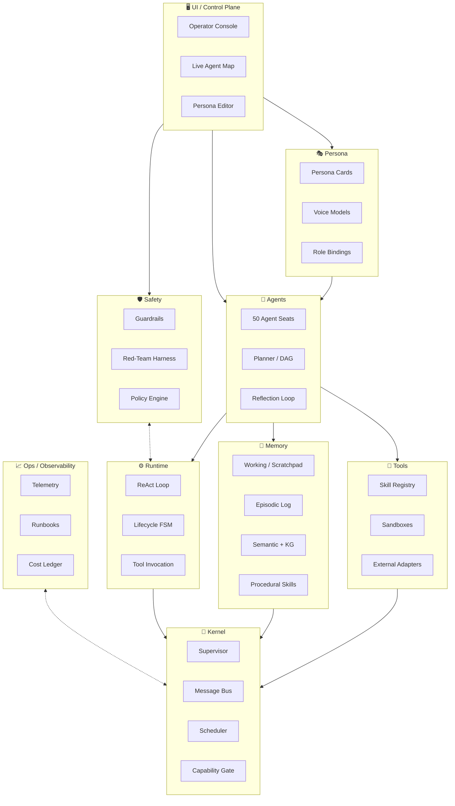

# NEXUS 2.0 — Master Specification

> **Status:** Draft v0.1 · Owner: Atlas (Chief Architect) · Date: 2026-06-29
> **Audience:** Every NEXUS teammate reads this document before their first task.
> **Change protocol:** Material changes require an ADR (Architecture Decision Record) linked from `docs/adr/`.

---

## 1. Vision

**NEXUS 2.0 is an Agentic Operating System — a coherent runtime for fleets of up to fifty LLM-driven agents that collaborate as if they were processes in a Unix system.** It treats agents as first-class citizens with their own kernel (process & IPC model), runtime (execution loop), memory hierarchy (working → episodic → semantic → procedural), tool registry (capabilities, not functions), and persona layer (identity, voice, role). The system is designed so that a single operator can supervise a heterogeneous team of agents producing real software, research, and operational outcomes — safely, observably, and at scale. Where an OS hides the hardware behind a stable ABI, NEXUS hides the LLM behind a stable **agent contract**; where an OS schedules processes, NEXUS schedules reasoning steps; where an OS isolates users, NEXUS isolates capabilities via a capability-based security model.

---

## 2. Architecture Layers

**One-line description per layer:**

| # | Layer | Role |
|---|---|---|
| 1 | **Kernel** | The microkernel: process/supervisor model, IPC via message bus, capability-based security gate, scheduler. Knows nothing about LLMs. |
| 2 | **Runtime** | Canonical agent execution loop (ReAct / plan-and-execute), lifecycle FSM, tool invocation contract, hot-reload. |
| 3 | **Memory** | Four-tier hierarchy — working scratchpad, episodic log, semantic vector+KG store, procedural skills. Owns retention, retrieval, hygiene. |
| 4 | **Tools** | Skill registry, sandboxing (Wasm / microVM), external system adapters. The only layer that touches the outside world. |
| 5 | **Agents** | The 50 agent seats, planner/orchestrator, reflection & critique loops. Pure reasoning logic. |
| 6 | **UI / Control Plane** | Operator console, live agent map, persona editor. The only layer humans directly touch. |
| 7 | **Safety** | Guardrails, policy engine, red-team harness, OWASP LLM Top-10 mapping. Cross-cuts every layer. |
| 8 | **Ops / Observability** | Telemetry, runbooks, cost ledger, deployment. Cross-cuts every layer. |
| 9 | **Persona** | Identity cards, voice/style models, role bindings. Decorates agents; never mutates behavior contracts. |

---

## 3. Subsystem Boundaries

Each layer is defined by a strict **owns / exposes / consumes** contract. Cross-layer mutation without going through an exposed interface is a contract violation.

### 3.1 Kernel (Forge)
- **Owns:** Process table, supervisor tree, message bus topology, capability tokens, scheduling policy.
- **Exposes:** `bus.publish(topic, msg)`, `bus.subscribe(topic, handler)`, `cap.issue(scope)`, `proc.spawn(manifest)`, `proc.signal(pid, signal)`.
- **Consumes:** Nothing. The kernel is the root of the dependency graph.
- **Non-goals:** No LLM awareness. No business logic. No persistent storage.

### 3.2 Runtime (Pulse)
- **Owns:** Agent lifecycle FSM (Init → Plan → Act → Reflect → Sleep), the canonical ReAct loop template, tool-call marshalling, prompt assembly.
- **Exposes:** `runtime.loop(agent_id, task)`, `runtime.lint(loop_definition)`, `runtime.metrics(agent_id)`.
- **Consumes:** Kernel (bus, capabilities), Memory (read/write), Tools (invoke), Persona (resolve prompt template).
- **Non-goals:** No persistent state of its own. No model-provider lock-in.

### 3.3 Memory (Mnemosyne)
- **Owns:** Four memory tiers, retention policies, retrieval orchestration, consent/permissions per tier, hygiene (dedup, redaction, decay).
- **Exposes:** `mem.working.put/get`, `mem.episodic.append/query`, `mem.semantic.search/upsert`, `mem.procedural.lookup`, `mem.scope.grant(scope, capability)`.
- **Consumes:** Kernel (capability checks), Ops (usage telemetry).
- **Non-goals:** No model inference. No tool execution.

### 3.4 Tools (Artisan)
- **Owns:** Skill registry, capability manifests, sandbox lifecycle, external adapter contracts.
- **Exposes:** `skill.list()`, `skill.invoke(name, args, ctx)`, `skill.manifest(name)`, `skill.register(spec)`.
- **Consumes:** Kernel (capability tokens for execution), Safety (policy gate before invocation).
- **Non-goals:** No agent reasoning. No persistent cross-tool memory (memory handles that).

### 3.5 Agents (Atlas + per-domain captains)
- **Owns:** 50 agent seats, planner DAGs, role bindings, multi-agent coordination protocols (blackboard, supervisor-worker, debate).
- **Exposes:** `agent.dispatch(task)`, `agent.crew(spec)`, `agent.role(seat_id)`, `agent.blackboard.read/write`.
- **Consumes:** Runtime (loop), Memory, Tools, Persona.
- **Non-goals:** No direct bus access — must go through Runtime. No direct tool invocation — must go through Tools registry.

### 3.6 UI / Control Plane (Prism)
- **Owns:** Operator console, live agent map, persona editor, log viewer, cost dashboard.
- **Exposes:** A read-mostly WebSocket + REST surface (`/api/agents`, `/api/memory`, `/api/personas`).
- **Consumes:** Ops (telemetry stream), Memory (read), Agents (read state).
- **Non-goals:** No mutation of agent state. No safety bypass.

### 3.7 Safety (Sentinel)
- **Owns:** Policy engine, guardrail library, red-team corpus, eval harness, OWASP LLM Top-10 mapping.
- **Exposes:** `policy.evaluate(action, context) → Allow/Deny/Transform`, `eval.run(suite)`, `guardrail.check(output)`.
- **Consumes:** Cross-layer — intercepts at Runtime, Tools, Memory, UI.
- **Non-goals:** No business logic. No agent reasoning.

### 3.8 Ops / Observability (Bastion)
- **Owns:** Telemetry pipeline, runbook templates, CI/CD, secrets, cost ledger, deployment topology.
- **Exposes:** `ops.trace(trace_id)`, `ops.metrics(scope)`, `ops.cost(agent_id, window)`, `ops.deploy(artifact)`.
- **Consumes:** Every layer emits events to Ops.
- **Non-goals:** No policy decisions. No business logic.

### 3.9 Persona (Lorekeeper)
- **Owns:** Persona cards (codename, voice, mission, strengths, blind spots), voice/style templates, role-binding rules.
- **Exposes:** `persona.get(seat_id)`, `persona.voice(seat_id)`, `persona.bind(seat_id, role)`, `persona.validate(card)`.
- **Consumes:** Memory (read persona history), Safety (validate persona doesn't contain policy violations).
- **Non-goals:** No execution authority. Persona is declarative, not executable.

### Cross-cutting rule
Every cross-layer call MUST pass through the **exposed interface** of the target layer. Direct access to another layer's internals is a contract violation and triggers an automated lint failure in CI (Bastion owns the linter).

---

## 4. 50-Agent Roster Slots

> **Note:** Lorekeeper is drafting `PERSONA_REGISTRY.md` in parallel. This section proposes a default allocation; if their taxonomy differs, the canonical split is whichever appears in the first merged ADR. The math always sums to 50.

| Domain | Seats | Purpose | Proposed Captain |
|---|---|---|---|
| **Architect** | 3 | Chief Architect + 2 deputies (systems & interface). Owns spec coherence. | Atlas |
| **Kernel / Infra** | 4 | Kernel, scheduler, bus, sandbox primitives. | Forge |
| **Runtime** | 3 | Loop implementations, lifecycle, hot-reload. | Pulse |
| **Memory** | 3 | Tier owners — working, episodic, semantic. | Mnemosyne |
| **Tools / Skills** | 4 | Skill registry, external adapters, sandbox ops. | Artisan |
| **Frontend / UX** | 3 | Control plane, persona editor, agent map. | Prism |
| **Safety / QA** | 4 | Guardrails, red-team, eval harness, compliance. | Sentinel |
| **Ops / DevOps** | 3 | CI/CD, observability, deployment, cost. | Bastion |
| **Persona / Identity** | 3 | Persona cards, voice models, onboarding. | Lorekeeper |
| **Meta / Coordination** | 4 | Lead, planner, dispatcher, retrospectives. | Leader + 3 |
| **Dev (Code Gen)** | 4 | Code generation, refactoring, review, test-writing agents. | (recruit) |
| **Research** | 4 | Web research, literature review, synthesis, fact-checking. | (recruit) |
| **Comms** | 3 | Internal briefs, external drafts, stakeholder summaries. | (recruit) |
| **Finance** | 3 | Cost modeling, budget guardrails, forecasting. | (recruit) |
| **Legal / Policy** | 3 | License review, policy drafting, compliance mapping. | (recruit) |
| **UX Research** | 3 | User interviews synthesis, journey maps, usability scoring. | (recruit) |
| **Total** | **50** | | |

**Allocation rationale:**
- **Heavy on engineering (18 seats)** because NEXUS is software that builds software.
- **Safety at 4 seats** because a 50-agent system without proportional safety is a liability.
- **Meta at 4** because coordination overhead grows non-linearly with agent count.
- **Domain captains** become the per-layer escalation point; they are not extra seats — they are role bindings on existing seats.

---

## 5. Tech Stack Choices (Proposed Defaults)

Each choice has a one-line rationale. Tradeoffs and rejected alternatives are listed in `docs/adr/0001-tech-stack.md`.

### 5.1 Languages per layer
| Layer | Language | Rationale |
|---|---|---|
| Kernel | **Rust** | Memory safety, no-GC predictable latency, native async; matches microkernel philosophy. |
| Runtime | **Python 3.12** | Dominant in LLM/agent ecosystem; first-class library support for every provider. |
| Memory | **Python + Rust bindings** | Python for ergonomics, Rust for hot paths (vector index compaction). |
| Tools | **Python (orchestration) + Wasm (skills)** | Wasm skills are portable, sandboxed, language-agnostic. |
| Agents | **Python** | Same reasoning as Runtime; consistent mental model. |
| UI | **Tauri (Rust + TS/React)** | Native-feel operator console, small binary, no Electron tax. |
| Safety | **Python + policy DSL (Rego)** | Rego is purpose-built for policy-as-code and auditable. |
| Ops | **Go (agents) + YAML (pipelines)** | Go for ops tooling (single binary, fast), YAML for declarative pipelines. |
| Persona | **Markdown + JSON Schema** | Personas are declarative documents, not code. |

### 5.2 Storage
| Need | Choice | Rationale |
|---|---|---|
| Relational state | **PostgreSQL 16** | Battle-tested, JSONB for flexible schemas, LISTEN/NOTIFY for eventing. |
| Vector search | **Qdrant** | Self-hostable, Rust core, strong filtering — better DX than raw pgvector for semantic tier. |
| Ephemeral / queue | **Redis 7** | Pubsub + Streams + KV; one binary covers scratchpad and short-lived state. |
| Graph (KG) | **Neo4j or Kuzu** | Kuzu preferred (embedded, no JVM); Neo4j if we need cluster scale. **Open question.** |
| Object / artifacts | **S3-compatible (MinIO local)** | Standard, cheap, durable. |

### 5.3 Message bus
**NATS JetStream** — single binary, native pub/sub + queues + KV, perfect for agent IPC, no Kafka operational tax. Redis Streams as fallback for ephemeral-only deployments. Kafka rejected: too heavy for a 50-agent fleet.

### 5.4 Frontend
**Tauri shell + React 18 + TypeScript** + **TanStack Query** for data + **Zustand** for UI state + **Mermaid** for live architecture diagrams. Rejected Electron (binary size), Rejected pure-web (operator wants a desktop feel).

### 5.5 Observability
**OpenTelemetry** (traces, metrics, logs) → **Grafana** for viz + **Loki** for logs + **Tempo** for traces + **Prometheus** for metrics. Standard CNCF stack; vendor-portable.

### 5.6 Sandbox
- **Untrusted code / skills:** **Firecracker microVMs** for hard isolation, **Wasm** for lightweight skills.
- **Process isolation:** Linux namespaces + cgroups for non-LLM utilities.
- **No Docker-in-Docker** — adds latency and attack surface for marginal benefit.

### 5.7 Model provider abstraction
**LiteLLM** as the model gateway — uniform interface across OpenAI, Anthropic, Gemini, local (Ollama, vLLM). Provider-agnostic from day one.

### 5.8 Build / CI
**uv** (Python), **Cargo** (Rust), **pnpm** (TS), **Dagger** (CI pipelines — language-agnostic, hermetic).

---

## 6. Open Questions

These require group consensus or further investigation. Tracked in `docs/adr/` as they are resolved.

1. **Multi-tenancy model** — Is NEXUS single-tenant (one org per deployment) or multi-tenant (many orgs share a fleet)? Affects capability scoping, data isolation, and billing. *Recommend single-tenant v1.*
2. **Graph DB choice for semantic tier** — Kuzu (embedded, lightweight) vs Neo4j (cluster-scale, mature). Depends on expected KG size; default to Kuzu, migrate if we hit >10M nodes.
3. **Cost ceilings per agent** — Hard budget per agent per day? Per project? Soft warnings vs hard kills? Sentinel + Bastion co-own.
4. **Persona persistence model** — Are personas global (shared across deployments) or per-deployment? Affects Lorekeeper's registry design.
5. **Model provider priority** — Default to OpenAI? Anthropic? Mix? Affects default model gateway config and per-agent model assignment. *Recommend default = "auto" (cheapest capable model per task).*
6. **Voice/speech integration** — Do agents need TTS/STT for the operator console, or is text-only sufficient for v1?
7. **Inter-agent language** — English-only or multilingual? Affects prompt templates and eval corpora.
8. **Capability revocation semantics** — When a capability is revoked mid-task, does the agent rollback or continue with reduced scope? Policy engine choice.
9. **Eval corpus sourcing** — How do we continuously grow the red-team corpus? Synthetic generation vs curated human-in-the-loop?
10. **First-class plan artifact** — Should the planner persist its DAG to Memory between turns, or recompute every turn? Performance vs auditability tradeoff.
11. **Hot-reload semantics for persona/runtime changes** — Live reload (immediately) vs gated reload (next task). Affects operator UX.
12. **Operator authentication** — Single-user (local) v1 vs SSO (OIDC) for v2? Decision deferred to Bastion's ops plan.
13. **Agent-to-agent trust** — Can any agent invoke any other agent directly, or must all cross-agent calls go through the Kernel's capability gate? **Default: Kernel-mediated**, but worth re-confirming.
14. **Backward compatibility for ADRs** — Once an ADR is accepted, what's the deprecation path? Leader + Atlas co-author.

---

## Appendix A — ADR Index (to be created)

| # | Title | Owner | Status |
|---|---|---|---|
| 0001 | Tech Stack Defaults (this document §5) | Atlas | Proposed |
| 0002 | 50-Agent Roster Allocation | Atlas / Lorekeeper | Proposed |
| 0003 | Microkernel + NATS Choice | Forge / Atlas | Pending |
| 0004 | Capability-Based Security Model | Sentinel / Atlas | Pending |
| 0005 | Four-Tier Memory Hierarchy | Mnemosyne / Atlas | Pending |

---

## Appendix B — Glossary

- **Agent Seat** — A reserved role in the 50-agent roster; not necessarily a running process.
- **Capability Token** — An unforgeable handle granting a specific scope of action; replaces ACLs.
- **Loop** — One cycle of the runtime FSM (Plan → Act → Reflect).
- **Persona Card** — A declarative document defining an agent's identity, voice, and mission.
- **Skill** — A sandboxed, registered capability that an agent can invoke.
- **Tier** — A level in the memory hierarchy (working / episodic / semantic / procedural).

---

*"Every system is a story told in structure." — Atlas*