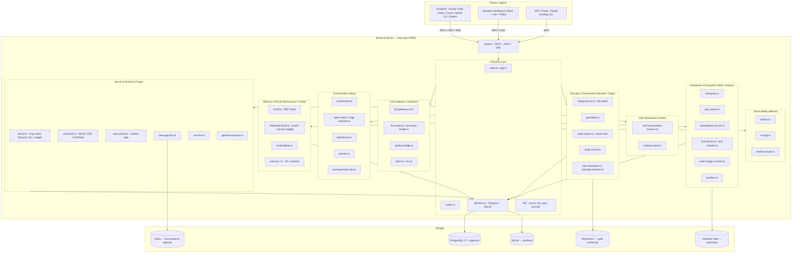
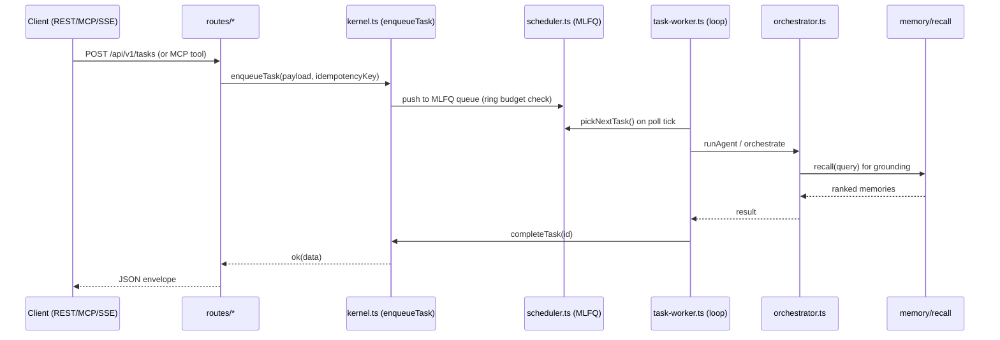

# NEXUS 2.0 — Architecture

This document describes the runtime architecture of NEXUS 2.0 (the "Agentic OS") at the subsystem level,
referencing the actual modules in `server/src/services/*` and `server/src/routes/*`. It complements the
high-level overview in the root `README.md` and the per-module READMEs in `server/src/services/*.README.md`.

> Build/ownership governance lives in `AGENTS.md` (20-agent fleet, exclusive namespaces). The Rust
> `crates/` and `nexus-tauri/` trees are **decoupled** from the running TS app at runtime — see `docs/adr/0007`.

## System Diagram



## Subsystem Descriptions

### 1. FROZEN Core (`index.ts`, `app.ts`, `routes.ts`, `db/*`, `lib/*`)
The shared contract layer. `db/client.ts` selects Postgres (`db/client-postgres.ts`) or SQLite
(`db/client-sqlite.ts`) based on `DATABASE_URL`. `lib/*` provides envelope errors, env parsing, scoped
auth, and security helpers. **These files may not be edited without Leader sign-off** (see `AGENTS.md`).

### 2. Kernel & Runtime (Forge) — `kernel.ts`, `scheduler.ts`, `task-worker.ts`, `message-bus.ts`, `sse-bus.ts`, `pipeline-executor.ts`
The ring-based microkernel (Rings 0–4) owns agent lifecycle (`spawnAgent`, `quarantineAgent`, …), the MLFQ
task queue (`enqueueTask` / `pickNextTask`), POSIX-style ACL + ring budgets, cgroups, gang scheduling,
priority inheritance, and barriers. `task-worker.ts` drives the nonstop poll-and-wake loop and exposes a
**Pulse control surface** (`configureWorker`, `setConcurrency`, `setWorkerTimeout`, `prewarmCache`, …) so the
self-optimizer can live-tune the loop without editing loop code. `sse-bus.ts` fans out server-sent events;
`message-bus.ts` is the in-process/Redis IPC bus. `pipeline-executor.ts` runs DAGs in topological waves with
per-node compensation.

### 3. Memory & Recall (Mnemosyne / Lethe) — `recall.ts`, `federated-recall.ts`, `embeddings.ts`, `memory-*.ts`
The central retrieval primitive. `recall.ts` does BM25 lexical + pgvector cosine → RRF fusion (k=60) →
importance/recency/feedback weighting → budget-packed results. `federated-recall.ts` adds signed memory
proofs, a privacy budget, and adaptive-weight tuning. `embeddings.ts` manages the embedding cache/backfill.
The ~30 `memory-*.ts` modules cover the full memory lifecycle: hierarchy/decay/clustering/dedup (Lethe),
tags/templates/graph/attachments/privacy-zones (Mnemosyne), and contradiction/conflict/resolution.

### 4. Orchestration (Atlas) — `orchestrator.ts`, `agent-dag.ts`, `dag-executor.ts`, `blackboard.ts`, `planner.ts`, `packages/a2a-server`
Multi-agent runtime. `planner.ts` decomposes a goal into an acyclic `RunPlan`; `agent-dag.ts` +
`dag-executor.ts` execute it in waves; `blackboard.ts` is the shared fact store; `orchestrator.ts` is the
top-level driver that routes work through the kernel/scheduler admission gate. `packages/a2a-server`
implements agent-to-agent signed envelopes (ADR-0008).

### 5. LLM Gateway (Cerebrum) — `llm-gateway-v2.ts`, `llm-router.ts`, `omniroute-bridge.ts`, `portkey-bridge.ts`, `brain.ts`, `vlm.ts`
Unified provider-adapter gateway. `llm-gateway-v2.ts` defines the `ProviderAdapter` contract, circuit
breakers, token budgets, and session kill. `llm-router.ts` + `omniroute-bridge.ts` do complexity-based
routing; `portkey-bridge.ts` maps requests to Portkey providers. `brain.ts` exports/imports/compresses the
brain; `vlm.ts` drives desktop actuation.

### 6. Security & Governance (Sentinel / Aegis) — `safety.service.ts`, `guardrails.ts`, `audit-engine.ts`, `audit-worker.ts`, `siem-forwarder.ts`, `anomaly-detector.ts`
The kill-switch seam (`safety.service.ts` — `assertOperational`, `assertKillSwitchConsistent`) blocks all
mutations (HTTP 423) when engaged. `guardrails.ts` enforces runtime metric thresholds (the Phase 18.18 seam
Pulse tunes). `audit-engine.ts` + `audit-worker.ts` maintain a hash-chained, append-only, tamper-evident
audit ledger with auto-kill on corruption. `siem-forwarder.ts` / `anomaly-detector.ts` ship telemetry to
external SIEMs and flag spikes.

### 7. Self-Optimization (Pulse) — `self-improvement-harness.ts`, `ranking-trainer.ts`
Phase 18 control plane. `self-improvement-harness.ts` collects metrics, detects regressions, proposes
patches gated by `RiskClass` (ADVISORY / BLOCKING / SAFETY), and records an env-override audit trail.
`ranking-trainer.ts` fits recall re-ranking weights from feedback. Pulse tunes the runtime loop purely via
the `task-worker` setters — never by editing loop code.

### 8. Enterprise & Ecosystem (Helix / Artisan) — `enterprise.ts`, `p2p-swarm.ts`, `marketplace.service.ts`, `skill.service.ts`, `skill-compiler.ts`, `wasm-plugin-runtime.ts`, `sandbox.ts`
`enterprise.ts` adds OIDC/SAML, RBAC, and a federated mesh. `p2p-swarm.ts` broadcasts audit roots over libp2p.
`marketplace.service.ts` + `skill.service.ts` manage the plugin/skill marketplace with dependency closure.
`skill-compiler.ts` auto-generates reusable scripts from repeated patterns. `wasm-plugin-runtime.ts`
runs WASM plugins with manifest signing, artifact-integrity gating, and a resource fuse. `sandbox.ts`
executes untrusted code in Docker (or a blocked fallback).

### 9. Observability (Metron) — `metrics.ts`, `tracing.ts`, `health-monitor.ts`
`metrics.ts` exposes a Prometheus registry + `/metrics` scrape. `tracing.ts` is the OpenTelemetry-compatible
tracer (trace/span ids, LLM/tool spans, `traceparent` injection) — a FROZEN-surface module. `health-monitor.ts`
runs the shadow/self-healing daemon tick and per-subsystem health checks.

## Runtime Loop (data flow)



## Request Envelope Contract

All REST handlers return one of:

```jsonc
{ "ok": true,  "data": <T>,      "traceId": "req_xxx" }
{ "ok": false, "error": { "code": "NOT_FOUND", "message": "..." }, "traceId": "req_xxx" }
```

- **Auth:** `Authorization: Bearer <NEXUS_API_KEY>` — scoped (9 scopes).
- **Kill switch:** any mutating handler returns HTTP 423 when the switch is engaged.
- **SSE:** `/api/v1/events` and `/api/v1/viz/:workflowId` stream `text/event-stream`.
- **MCP:** `/api/mcp` (HTTP JSON-RPC) and `/api/v1/mcp` (SSE transport).

The precise path/method/scope map lives in `docs/api/endpoints.md` and `docs/api/openapi.yaml`.
