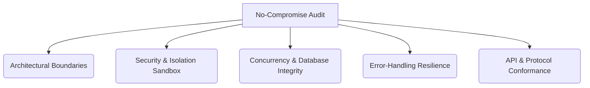

# NEXUS 2.0 — No-Compromise Codebase Audit Plan

This audit plan defines a rigorous, zero-exception validation framework for the entire **Agentic OS** repository. It outlines targeted scans, verification tools, test scenarios, and security boundaries that must be inspected to ensure the system is ready for enterprise production and open-source release.

---

## 1. Audit Scope Matrix

The audit targets 5 critical vectors across all workspaces:



| Audit Vector                     | Target Files / Modules                                  | Primary Goal                                                                            |
| :------------------------------- | :------------------------------------------------------ | :-------------------------------------------------------------------------------------- |
| **Architectural Boundaries**     | `crates/core/`, `server/src/services/kernel.ts`         | Verify strict privilege ring boundaries (Ring 0 to 3) and locate illegal imports.       |
| **Security & Sandbox Isolation** | `server/src/services/sandbox.ts`, `crates/safety/`      | Inspect JS worker threads, CPU/Memory resource constraints, and command sanitization.   |
| **Database Concurrency**         | `server/src/db/`, `server/tests/db-concurrency.test.ts` | Audit WAL options, write-serialization mutex locks, and connection pool configurations. |
| **Error-Handling Resilience**    | `server/src/lib/errors.ts`, `crates/core/src/errors.rs` | Ensure no raw panics, unhandled promise rejections, or missing recovery states exist.   |
| **API & Protocol Conformance**   | `packages/a2a-server/`, `server/src/routes/`            | Check compliance with Google A2A protocol specifications and MCP stdio JSON-RPC.        |

---

## 2. Phase-by-Phase Audit Checklist

### Phase 1: Architectural Boundaries & Privilege Rings (Ring 0–3)

- [ ] **1.1. Import Invariant Check:** Verify Ring 3 (React Control Plane) contains _no_ imports from Ring 0 (OS Kernel) or Ring 1 (Native Engine). Run tree analysis.
- [ ] **1.2. Kernel Invocation Gates:** Verify all native syscalls routed through [kernel.ts](<file:///C:/Users/Tahir/OneDrive/Desktop/nexus-20-ai-agent-os%20(7)/Agentic%20OS%20V3/server/src/services/kernel.ts>) require Ring-authorization headers before execution.
- [ ] **1.3. Rust Bindings Drift:** Check that TS interface files matched generated bindings from Rust `ts-rs` crates.

### Phase 2: Security & Isolation Sandbox

- [ ] **2.1. Thread Pool Memory Boundaries:** Verify that sandbox worker threads terminate immediately when allocation exceeds 64MB.
- [ ] **2.2. Timeout Verification:** Assert sandbox processes terminate after exactly 2000ms.
- [ ] **2.3. Native Module Blocklist:** Run static code checks to verify `require` or `import` of `child_process`, `fs`, `net`, and `http` inside sandbox workers is completely blocked.
- [ ] **2.4. Command Sanitizer Audit:** Review shell commands inside [desktop-actuator.ts](<file:///C:/Users/Tahir/OneDrive/Desktop/nexus-20-ai-agent-os%20(7)/Agentic%20OS%20V3/server/src/services/desktop-actuator.ts>) to verify no shell concatenation runs with raw user parameters.

### Phase 3: Database WAL & Concurrency

- [ ] **3.1. SQLite Mode Check:** Verify `journal_mode = WAL` is applied programmatically on connection setup.
- [ ] **3.2. Concurrency Mutex Check:** Inspect transaction blocks. Verify that every write query to `better-sqlite3` runs through the serialization mutex lock.
- [ ] **3.3. Dual Database Parity:** Verify FTS5 fallback works dynamically when pgvector extensions are missing in SQLite mode.
- [ ] **3.4. Database Lock Telemetry:** Verify that busy timeout warnings are pushed to structured logs when database queries block for > 2000ms.

### Phase 4: Error-Handling Resilience

- [ ] **4.1. Rust Panic Scan:** Grep Rust codebase for `unwrap()`, `expect()`, or `panic!` macros. Replace with type-safe `Result` returns.
- [ ] **4.2. Promise Rejection Isolation:** Scan server codebase for missing `.catch()` or try-catch wraps around async endpoints.
- [ ] **4.3. Connection Recovery Gates:** Verify MCP registries retry connection automatically with exponential backoff on connection drops.

### Phase 5: Protocol Conformance

- [ ] **5.1. Google A2A Card Conformity:** Verify `/.well-known/agent.json` exactly matches standard A2A schema criteria.
- [ ] **5.2. JSON-RPC 2.0 Stdio Stream Audit:** Verify MCP transport parsing splits chunks cleanly on newline characters and enforces 30s heartbeats.

---

## 3. Automated Scanning Commands

Run the following scripts as part of the audit verification process:

```bash
# ── 1. Scan for raw panics in Rust workspaces ──
grep -rn "unwrap(" crates/
grep -rn "expect(" crates/

# ── 2. Run static security checks on dependencies ──
pnpm audit

# ── 3. Run Clippy checks with strict warnings ──
cargo clippy --workspace --all-targets -- -D warnings

# ── 4. Verify TypeScript type safety ──
pnpm run typecheck

# ── 5. Run complete validation test matrix ──
pnpm --filter @agentic-os/server test
```

---

## 4. Remediation SLA & Sign-off

Any issues discovered during this audit will be logged under one of three categories:

1. **Blocker (Level 1):** Security sandbox bypasses, database corruptions, compile errors. Must be patched immediately.
2. **Warning (Level 2):** Uncaught warnings, performance degradation (> 50ms query delay), test warnings. Must be resolved before release branch merge.
3. **Info (Level 3):** Architectural debt, structural improvements. To be tracked in issues.
