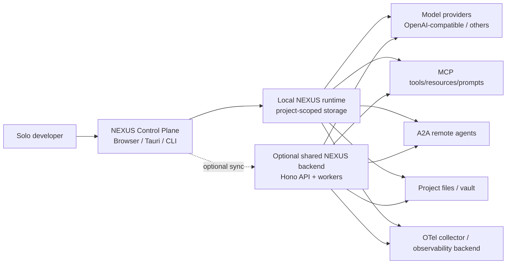
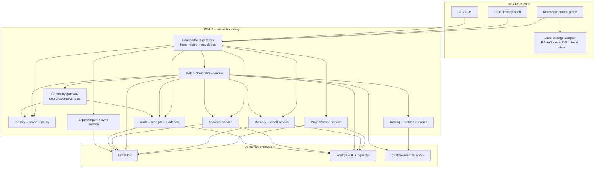
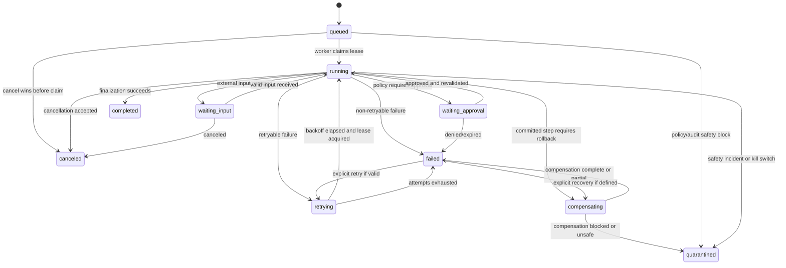

# BMAD Technical Architecture — NEXUS 2.0 / Agentic OS V3

**Date:** 2026-07-21  
**Status:** Draft for epics and story decomposition  
**Source:** `docs/bmad/04-prd.md`, `docs/bmad/05-ux-design.md`  
**Architecture style:** Domain-oriented modular monolith with local/shared adapters and protocol gateways

## 1. Architectural intent

R1 should be a reliable modular monolith before it becomes a distributed platform. The system needs clear domain boundaries, durable state, policy enforcement, and protocol adapters without introducing service-to-service failure modes prematurely.

The architecture must support two deployment shapes with the same domain contracts:

1. **Local-first:** Browser/Tauri/local runtime, local persistence, optional provider, no shared backend required for the core path.
2. **Shared backend:** Hono/Node API, PostgreSQL + pgvector, background workers, optional Redis/event infrastructure, and remote clients.

The local and shared paths may use different storage/transport implementations, but they must share state-machine contracts, authorization rules, export schema, and acceptance tests.

## 2. Architecture principles

1. Domain services own business invariants; route handlers only translate transport to typed commands.
2. All side effects are represented as durable task steps and action receipts.
3. Policy is evaluated at the server/runtime boundary, never only in the UI or prompt.
4. Local mode is a real implementation, not a mocked version of shared mode.
5. Events are derived from committed state through an outbox; clients can replay from a cursor.
6. Protocol adapters translate MCP/A2A into NEXUS capabilities/tasks without bypassing policy.
7. Audit and evidence are append-only or tamper-evident; exports are schema-versioned.
8. Provider failure degrades to safe capability reduction where possible, not hidden partial success.
9. No generic `any` escape hatches in domain contracts; external payloads are parsed at boundaries.
10. A modular monolith can be split later only at measured load or ownership boundaries.

## 3. C4 system context



## 4. Container view



## 5. Module boundaries

### 5.1 Transport/API gateway

**Responsibilities**

- HTTP/JSON, SSE, CLI/SDK command mapping, and envelope formatting.
- Authentication context extraction and request correlation.
- Input size, content type, rate, and schema validation.
- No direct database queries or business-state mutation.

**Proposed structure**

```text
server/src/routes/
  projects.ts
  memories.ts
  recall.ts
  tasks.ts
  approvals.ts
  capabilities.ts
  evidence.ts
  sync.ts
  health.ts
server/src/lib/
  auth-context.ts
  envelope.ts
  payload-limit.ts
  request-context.ts
```

Existing routes may be retained, but R1 routes should delegate to domain services rather than extending a single catch-all file.

### 5.2 Identity, scope, and policy

**Responsibilities**

- Resolve developer, local operator, agent, worker, and remote principal identities.
- Compute effective project, agent, capability, and data scopes.
- Evaluate action policy using action type, target, risk, identity, project, policy version, and runtime state.
- Enforce kill switch and quarantined state.

**Contract**

```ts
interface AuthorizationContext {
  principalId: string;
  principalType: 'developer' | 'agent' | 'worker' | 'operator' | 'remote_agent';
  projectId: string;
  agentId?: string;
  scopes: readonly string[];
  policyVersion: string;
  correlationId: string;
}

interface PolicyDecision {
  effect: 'allow' | 'deny' | 'approval_required';
  risk: 'low' | 'medium' | 'high' | 'critical';
  ruleId: string;
  reason: string;
  policyVersion: string;
}
```

Policy decisions must be deterministic for the same policy version and inputs, and the decision must be persisted with any approval request or receipt.

### 5.3 Project and scope service

Owns project lifecycle, mode (`local_only`/`shared`/`syncing`/`conflicted`), capability defaults, retention defaults, sync cursor, and project health.

All repository calls require a project scope. A missing scope is an error, not “all projects.”

### 5.4 Memory and recall service

**Write path**

```text
Input -> schema validation -> scope check -> provenance capture
      -> write policy -> transactional memory row
      -> embedding outbox (optional) -> audit/evidence
```

**Recall path**

```text
Query + scope + budget
  -> query normalization
  -> lexical candidates
  -> vector candidates when available
  -> scope/provenance filtering
  -> RRF/signal fusion
  -> token-budget packing
  -> result explanation + ledger/feedback metadata
```

The service must never use a vector result from an unauthorized scope merely because post-filtering would remove it later. Repository queries should include scope predicates in candidate selection.

Memory types and lifecycle states are domain enums, not free-form strings. Candidate/derived memory must not be promoted to trusted project policy without an explicit policy path.

### 5.5 Task orchestrator

The orchestrator owns task creation, step planning, state transitions, leases, retries, checkpoints, cancellation, compensation, and final outcome.

A task step runner is an adapter over bounded operations:

- `recall`
- `model_call`
- `approval`
- `tool_call`
- `a2a_call`
- `checkpoint`
- `compensation`
- `finalize`

It does not execute arbitrary model-generated code directly.

### 5.6 Capability gateway

All native tools, MCP tools, and A2A remote tasks enter through one gateway.

```text
resolve capability
  -> verify source/version/trust state
  -> validate requested operation and schema
  -> authorize effective principal + project scope
  -> classify risk
  -> approval service if required
  -> execute with timeout/limits/sandbox
  -> receipt + redacted result
  -> emit correlated event/trace
```

#### Native tools in R1

Use a minimal allowlist:

- Read a file inside the configured project root.
- Write a file inside the configured project root, approval required.
- Run a constrained command inside an explicit sandbox, approval required.

No credential files, arbitrary paths, unrestricted network, or self-modifying policy operations are in the R1 tool set.

#### MCP adapter

- Support a declared stable version/transport subset.
- Local STDIO uses a filtered environment and process sandbox.
- Remote HTTP uses HTTPS deployment guidance, origin checks, resource-bound OAuth tokens where configured, scopes, timeouts, and rate limits.
- Tool descriptions/annotations are untrusted hints.
- MCP server identity, source, version, and capability list are recorded.

#### A2A adapter

- Fetch and validate Agent Card with allowlist, version, endpoint, and auth requirements.
- Map outbound request to an internal task step.
- Preserve remote task ID, context ID, artifact metadata, and correlation IDs.
- Apply local policy before delegation and before accepting remote artifacts as memory.
- Treat remote agent responses as untrusted content.

### 5.7 Approval service

Approval requests are durable records, not transient UI prompts.

An approval request stores:

- `approvalId`, project/task/step IDs.
- Principal and agent identity.
- Capability/tool and normalized arguments hash.
- Redacted display payload.
- Risk classification and policy rule/version.
- Expiry and allowed decisions.
- Status and decision actor/time.

Approval transaction:

1. Lock task step and approval request.
2. Re-check kill switch and current policy.
3. Recompute normalized action hash.
4. Reject expired/mismatched/duplicate decisions.
5. Record decision and state transition atomically.
6. Emit an outbox event after commit.

### 5.8 Evidence service

The evidence service owns append-only/tamper-evident audit entries, tool receipts, provenance links, export projections, and integrity verification.

The audit payload must not be the only place that stores operational state. It is an evidence record, not a substitute for task or approval tables.

### 5.9 Observability and event service

- Use W3C trace context and a NEXUS correlation ID.
- Emit OTel-compatible spans for `invoke_agent`, `chat`, `execute_tool`, `memory_recall`, `approval_wait`, and `task_step`.
- Do not capture prompt, memory, file, or tool content by default.
- Send committed domain events through an outbox to SSE/Redis/event consumers.
- Events include monotonically increasing per-project sequence or a replay cursor.

## 6. Task state machine



Terminal states are `completed`, `failed`, `canceled`, and `quarantined`. A terminal task cannot be silently reopened; recovery creates a new attempt/recovery record linked to the original.

## 7. Persistence design

### 7.1 Canonical concepts

```text
projects
principals
agents
capabilities
policies
memories
memory_evidence
memory_feedback
agent_tasks
agent_task_steps
agent_checkpoints
approval_requests
approval_decisions
action_receipts
audit_log
outbox_events
sync_changes
sync_conflicts
exports
```

Existing schema names may differ. The migration plan should map existing tables before introducing duplicates.

### 7.2 Required invariants

- Foreign keys protect project and task ownership.
- Every scoped row includes `project_id` or is reachable through an immutable parent scope.
- Task-step transitions use an expected-version or row lock to prevent lost updates.
- Idempotency key uniqueness is scoped to project/principal/operation.
- Receipts reference the exact task step and normalized action hash.
- Audit records are append-only with integrity verification.
- Outbox event creation is in the same transaction as the state mutation it represents.
- Sync changes include revision, origin, tombstone, and record type.

### 7.3 Local/shared storage adapters

```ts
interface DomainStore {
  projects: ProjectRepository;
  memories: MemoryRepository;
  tasks: TaskRepository;
  approvals: ApprovalRepository;
  evidence: EvidenceRepository;
  capabilities: CapabilityRepository;
  sync: SyncRepository;
}
```

Implementations may use Drizzle over PostgreSQL, SQLite, or PGlite. Repository methods accept typed scope/context and return domain records, not raw driver rows.

## 8. Local-first and synchronization architecture

### 8.1 Local mode

- Local storage owns the project and can execute bounded local tools.
- Local event sequence supports UI updates and replay after reload.
- Export is always available even without a backend.
- Provider/embedding absence is represented as capability state.

### 8.2 Shared sync

R1 sync should start with one project and explicit push/pull rather than silent bidirectional background replication.

```text
local change -> local revision + outbox change
  -> preview push
  -> server validates project/record/version
  -> accept, reject, or conflict
  -> pull server changes after cursor
  -> apply only non-conflicting changes
```

Conflict rules:

- Never last-write-wins silently for memory content, policies, approvals, task state, or receipts.
- Append-only records merge by unique ID and integrity hash.
- Mutable memory metadata can merge field-by-field only when fields are independent and policy permits.
- Task/approval state conflicts are resolved by the server state machine, not timestamp.
- Conflicts remain visible until explicitly resolved.

## 9. Security architecture

### 9.1 Defense layers

1. **Transport:** HTTPS/origin policy for remote; secure process launch for local.
2. **Authentication:** API key/OAuth/local identity as appropriate.
3. **Authorization:** principal, ring, scope, project, capability, and action policy.
4. **Input validation:** typed schemas, path/URL/command validation, size limits.
5. **Execution isolation:** project-root filesystem allowlist, sandboxed commands, network egress policy.
6. **Approval:** durable human decision for configured risk classes.
7. **Evidence:** receipts, audit chain, trace correlation, redaction.
8. **Recovery:** kill switch, quarantine, bounded retry, compensation.

### 9.2 Trust boundaries

- Model output is untrusted.
- Tool descriptions and annotations are untrusted.
- Retrieved memory is data, not policy, unless explicitly designated and protected.
- External web/MCP/A2A content is untrusted.
- Imported exports are untrusted until schema and integrity validation.
- UI input is untrusted even for a local operator.

### 9.3 Secrets

- Do not place raw provider credentials in tool subprocess environments unless a specific adapter requires it and the scope is explicit.
- Redact authorization headers, API keys, private keys, environment files, and credential-like fields from logs/exports.
- Use OS keychain/secure storage for Tauri/local credentials where available; browser-only mode must make its weaker persistence model explicit.
- Never allow an agent to read or write the secret store as a general tool.

## 10. Observability model

### Span hierarchy

```text
invoke_agent {task_id}
├── memory_recall {query_id}
├── chat {provider, model}
│   └── execute_tool {tool_call_id} [MCP/A2A/native]
│       └── approval_wait {approval_id} (when required)
├── checkpoint {step_id}
└── task_outcome {status}
```

### Required dimensions

- `nexus.project.id`
- `nexus.task.id`
- `nexus.step.id`
- `nexus.agent.id`
- `nexus.principal.id` (hashed/pseudonymous where appropriate)
- `nexus.policy.version`
- `nexus.approval.id`
- `nexus.receipt.id`
- `nexus.scope`
- `nexus.outcome`

Do not make raw content dimensions. Content is linked by authorized evidence IDs, not copied into metric labels.

## 11. API and event contracts

### Command/query separation

- Commands: initialize project, create memory, create task, decide approval, cancel/retry task, export/import, sync.
- Queries: project status, memory search, task list/detail, approval list/detail, evidence timeline, health.
- Events: task state changed, approval created/decided, memory changed, capability health changed, sync conflict.

All commands return a request/correlation ID and the committed domain result. An accepted async command must say whether it is queued, applied, or waiting.

### SSE/event replay

- Event IDs are durable, monotonic within a project or deployment.
- Client sends `Last-Event-ID`/cursor to resume.
- Server replays from outbox or returns a resync-required signal.
- UI applies events idempotently by event ID and version.

## 12. Deployment modes

### Local browser

```text
React/Vite -> local adapter -> PGlite/IndexedDB (or supported local store)
          -> provider over explicitly configured network
          -> bounded local tools only
```

This mode must not imply that browser code can safely provide OS-level sandboxing. Host-level tools belong in Tauri/local runtime or a shared backend.

### Tauri/local runtime

```text
React UI -> Tauri command boundary -> local Node/Rust/runtime adapter
         -> OS keychain, sandbox, filesystem allowlist, local DB
```

Every Tauri command is treated as a privileged API with input schemas and audit hooks.

### Shared backend

```text
React/CLI -> Hono API -> auth/policy -> domain services -> PostgreSQL/pgvector
                                      -> worker -> capability gateway
                                      -> outbox -> SSE/Redis/OTel
```

PostgreSQL is authoritative for shared project/task state. Redis is optional infrastructure, not a source of truth.

## 13. Failure handling

| Failure | Required behavior |
|---|---|
| LLM/provider unavailable | Mark provider degraded; preserve task state; offer retry/fallback only if policy allows. |
| Embedding unavailable | Write memory and use lexical recall; mark result mode. |
| Worker crash | Lease expires; recover from last committed checkpoint; do not duplicate receipts. |
| Browser disconnect | Task continues; reconnect/replay events; approval persists. |
| Shared backend unavailable | Local mode remains usable; sync becomes explicit pending/conflict state. |
| MCP server timeout | Receipt records timeout; bounded retry policy; no hidden success. |
| A2A remote task unknown | Keep correlation and mark remote status unknown; require explicit recovery. |
| Audit integrity failure | Enter configured safety/quarantine state; block mutations; preserve reads/evidence. |
| Sync conflict | Do not overwrite; show conflict with versions and resolution action. |
| Kill switch enabled | Block mutation and execution paths; allow status/evidence reads needed for recovery. |

## 14. Testing architecture

### Contract tests

Run the same domain contract suite against local and PostgreSQL repositories for:

- Scope isolation.
- Memory lifecycle and recall budget.
- Task state transitions and idempotency.
- Approval race/expiry/replay.
- Receipt/audit integrity.
- Export/import validation.
- Sync conflict rules.

### Deterministic task harness

- Fake model provider with scripted tool proposals.
- Fake clock for timeout/backoff/expiry.
- In-memory or fixture tool implementations that record side effects.
- Worker crash injection at every checkpoint and side-effect boundary.
- Fixed policy versions and expected action hashes.

### Security tests

- Cross-project access attempts.
- Scope escalation and ring violations.
- Malicious tool annotations/descriptions.
- Path traversal, command injection, SSRF, oversized payloads.
- Credential leakage in logs, traces, exports, and subprocess env.
- Replay of approval and idempotency tokens.
- Kill-switch races.

### UI tests

- Golden path with mocked API/events.
- Approval keyboard flow.
- Reload while waiting approval.
- Offline/degraded state rendering.
- Task recovery controls based on state matrix.
- Reduced motion and accessibility checks.

## 15. Migration strategy from the existing repository

1. Inventory current routes, services, schemas, local engine, remote client, OS store, and server kernel; classify each as authoritative, adapter, simulation, or deprecated.
2. Introduce shared domain types and state transition tests before moving code.
3. Extract R1 task/approval/evidence contracts behind services; keep compatibility routes as thin adapters.
4. Replace direct UI assumptions with typed API/event projections.
5. Connect existing kernel/task/approval functionality only after it satisfies R1 state and authorization invariants.
6. Reconcile existing migrations (`0046_v3_100x.sql`, `0047_audit_log_append_only.sql`, `0048_vector_hnsw_indexes.sql`) with the canonical schema; do not duplicate migration numbers.
7. Remove or clearly label simulated/experimental surfaces that could be mistaken for R1 production behavior.
8. Add local/shared contract tests and baseline validation in CI.

## 16. Architecture decisions

| Decision | Choice | Rationale |
|---|---|---|
| Service topology | Modular monolith for R1 | Preserves transactional boundaries and reduces distributed failure modes. |
| Shared source of truth | PostgreSQL for shared mode | Existing repository support, ACID state, pgvector, joins, and audit tables. |
| Local storage | Adapter over PGlite/SQLite/local runtime | Local-first needs a real persistent path without coupling the domain to one driver. |
| Event delivery | Transactional outbox + SSE; optional bus | Events must reflect committed state and support replay. |
| Task state | Explicit versioned state machine | Prevents race conditions, ambiguous retries, and terminal-state corruption. |
| Tool governance | Single capability gateway | Prevents MCP/A2A/native paths from bypassing common policy and evidence. |
| Observability | OTel-compatible metadata-first telemetry | Vendor-neutral and safer for sensitive content. |
| Sync | Explicit revision/conflict protocol | Silent last-write-wins is unsafe for agent state and evidence. |
| Protocol support | Versioned adapters | MCP/A2A specifications evolve; adapters isolate churn. |

## 17. Architecture exit criteria

- Every PRD MUST requirement maps to a component and data contract.
- Task/approval state transitions and invalid transitions are testable without an LLM.
- Local and shared storage paths have contract tests.
- Tool calls cannot bypass policy, approval, receipts, or kill switch.
- Browser/Tauri/shared deployment boundaries are explicit.
- Failure/recovery paths are observable and do not silently report success.
- Migration plan identifies which current code is reused, adapted, replaced, or deferred.
- Epics and stories can be written without making new architectural decisions inside implementation tickets.
